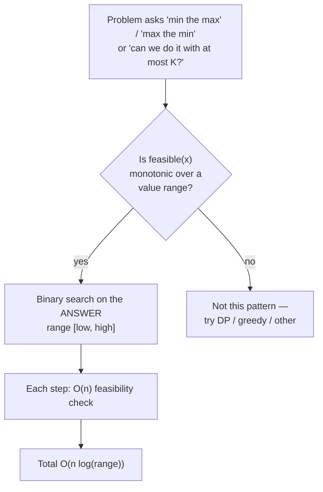

# Binary Search & Its Variants

Binary search is the canonical "halve the search space" algorithm: given a way to
decide, in O(1), which half of a range can be safely discarded, you converge on the
answer in **O(log n)** steps. It is deceptively simple to state and notoriously easy to
get wrong — off-by-one errors, integer overflow, and infinite loops are the classic
interview traps. This topic covers the correct templates, the standard variants
(insertion points, rotated arrays, 2D matrices, peaks), and the senior-level pattern
**binary search on the answer**.

## The core idea and prerequisites

Binary search works on any search space that is **monotonic** with respect to a
predicate. The textbook case is a **sorted array**: to find a target, compare it with
the middle element and discard the half that cannot contain it.

- **Prerequisite:** the data (or a derived predicate over it) must be *ordered /
  monotonic*. If `A[i] <= A[i+1]`, then for a target `t`, everything left of a "too big"
  midpoint is `<= A[mid]` and can inform which half to keep.
- **Why O(log n):** each step discards half the remaining candidates. Starting from `n`,
  you can halve at most `⌊log2 n⌋ + 1` times before one element remains. So worst/average
  time is **O(log n)**, space **O(1)** iterative (**O(log n)** recursive stack).
- **Random access is required** for the O(log n) bound — you must jump to `mid` in O(1).
  On a linked list, indexing `mid` is O(n), so binary search degrades to O(n) and offers
  no advantage over a linear scan.

| Aspect | Value |
|---|---|
| Time (worst / average) | O(log n) |
| Time (best) | O(1) — target is the first `mid` |
| Space (iterative) | O(1) |
| Space (recursive) | O(log n) call stack |
| Comparisons (worst) | ⌊log2 n⌋ + 1 |

> [!KEY-TAKEAWAY]
> Binary search is not "an array trick" — it is "search a **monotonic predicate**." The
> array may be implicit (a range of candidate answers). If you can write a boolean
> `feasible(x)` that is False, False, …, True, True over a range, you can binary-search it.

## The correct template and avoiding bugs

Three independent decisions define a binary search, and mixing them inconsistently is the
root of most bugs:

1. **Interval convention** — closed `[lo, hi]` vs half-open `[lo, hi)`.
2. **Loop condition** — `while (lo <= hi)` vs `while (lo < hi)`.
3. **Update rule** — `mid ± 1` vs `mid`, and whether you shrink `hi` or `lo`.

The most robust exact-match template uses a **closed interval** `[lo, hi]`:

```python
def binary_search(A, target):
    lo, hi = 0, len(A) - 1          # closed interval [lo, hi]
    while lo <= hi:                 # non-empty while lo <= hi
        mid = lo + (hi - lo) // 2   # overflow-safe midpoint
        if A[mid] == target:
            return mid
        elif A[mid] < target:
            lo = mid + 1            # discard left half INCLUDING mid
        else:
            hi = mid - 1            # discard right half INCLUDING mid
    return -1                       # not found; lo is the insertion point
```

**Trace it** — `A = [1, 3, 5, 7, 9]`, `target = 6` (a not-found case):

| Step | lo | hi | mid | `A[mid]` | Decision |
|---|---|---|---|---|---|
| 1 | 0 | 4 | `0+(4-0)//2 = 2` | `A[2] = 5` | `5 < 6` → `lo = 3` |
| 2 | 3 | 4 | `3+(4-3)//2 = 3` | `A[3] = 7` | `7 > 6` → `hi = 2` |
| 3 | 3 | 2 | — | — | `lo > hi` → exit, return `-1` |

At exit `lo = 3`, which is exactly where `6` would be inserted to keep the array sorted
(between `5` and `7`). That is why "`lo` is the insertion point" — the leftmost gap the
target belongs in.

> [!WARNING]
> **Overflow:** `mid = (lo + hi) / 2` overflows when `lo + hi > INT_MAX` (a real bug fixed
> in `java.util.Arrays.binarySearch` and the JDK in 2006). Always write
> `mid = lo + (hi - lo) / 2`. In Python integers are unbounded so it is stylistic there,
> but write it anyway for portable habits.

**Loop invariant discipline** prevents the other bugs. Pick an invariant and keep it true
every iteration:

- With `[lo, hi]` and `while lo <= hi`: the answer, if present, is always within
  `[lo, hi]`. Because both branches move past `mid` (`mid+1` / `mid-1`), the interval
  strictly shrinks, so the loop always terminates.
- With `while lo < hi` and an update that keeps `hi = mid` (not `mid - 1`), you must use
  `mid = lo + (hi - lo) // 2` (floor). Using `hi = mid` with a *ceil* midpoint, or
  `lo = mid` with a *floor* midpoint, can leave the interval unchanged → **infinite loop**.

> [!TIP]
> Memorize ONE template per job (exact match, leftmost, rightmost) and reuse it verbatim.
> "Reinventing the bounds" under interview pressure is where off-by-one bugs come from.

## Leftmost and rightmost bounds (lower_bound, upper_bound)

Most "real" binary-search questions are not exact-match; they ask for a **boundary**:
the first index `>= target`, the last index `<= target`, an insertion point, or a count.
The half-open `[lo, hi)` template with `hi = mid` (never `mid - 1`) is the cleanest, and
it *never returns early* — it always runs the full log n steps and converges on a
boundary.

**lower_bound** — first index whose value is `>= target` (leftmost insertion point):

```python
def lower_bound(A, target):
    lo, hi = 0, len(A)              # half-open [lo, hi), hi = len (not len-1)
    while lo < hi:
        mid = lo + (hi - lo) // 2
        if A[mid] < target:
            lo = mid + 1            # mid too small; answer is strictly right
        else:
            hi = mid                # A[mid] >= target; mid is a candidate, keep it
    return lo                       # in [0, len]; == len means "all smaller"
```

**upper_bound** — first index whose value is `> target`. Change the comparison to
`A[mid] <= target: lo = mid + 1`. Then:

- Count of elements equal to `target` = `upper_bound - lower_bound`.
- **First occurrence** of a duplicated value = `lower_bound`; **last occurrence** =
  `upper_bound - 1`. This solves *Find First and Last Position of Element in Sorted Array*
  with two calls, O(log n) total.

| Query | Predicate that becomes True | Return |
|---|---|---|
| lower_bound (`>= t`) | `A[mid] >= t` | leftmost such index (or `len`) |
| upper_bound (`> t`) | `A[mid] > t` | leftmost such index (or `len`) |
| last `<= t` | — | `upper_bound(t) - 1` |
| first occurrence | `A[mid] >= t`, then check `A[lo]==t` | `lower_bound(t)` |
| last occurrence | — | `upper_bound(t) - 1` |

> [!INTERVIEW]
> If asked "find the target," clarify **duplicates**. If the array has duplicates and they
> want *an* index, plain binary search is fine; if they want the *first/last* index or a
> *count*, you need lower_bound/upper_bound. Stating this distinction unprompted signals
> seniority.

Language built-ins: Python `bisect.bisect_left` = lower_bound, `bisect.bisect_right` =
upper_bound. Java `Arrays.binarySearch` returns *any* matching index (unspecified which
on duplicates) and, if absent, `-(insertion_point) - 1`. C++ `std::lower_bound` /
`std::upper_bound`.

## Search in rotated sorted array and find minimum

A sorted array rotated at an unknown pivot (e.g. `[4,5,6,7,0,1,2]`) is no longer globally
sorted, but **at least one half of any `[lo, hi]` is still sorted** — that is the
monotonic property binary search needs.

**Search in Rotated Sorted Array** (no duplicates), O(log n):

```python
def search_rotated(A, target):
    lo, hi = 0, len(A) - 1
    while lo <= hi:
        mid = lo + (hi - lo) // 2
        if A[mid] == target:
            return mid
        if A[lo] <= A[mid]:                 # left half [lo..mid] is sorted
            if A[lo] <= target < A[mid]:
                hi = mid - 1                # target in the sorted left half
            else:
                lo = mid + 1
        else:                               # right half [mid..hi] is sorted
            if A[mid] < target <= A[hi]:
                lo = mid + 1
            else:
                hi = mid - 1
    return -1
```

**Find Minimum in Rotated Sorted Array** — the minimum is the pivot; compare `A[mid]`
with `A[hi]` (the right end, which is stable under rotation):

```python
def find_min(A):
    lo, hi = 0, len(A) - 1
    while lo < hi:
        mid = lo + (hi - lo) // 2
        if A[mid] > A[hi]:      # min is strictly to the right of mid
            lo = mid + 1
        else:                   # A[mid] <= A[hi]: min is at mid or to the left
            hi = mid
    return A[lo]                # lo == hi points at the minimum
```

**Trace the rotated search** — `A = [4,5,6,7,0,1,2]`, `target = 0`:

| Step | lo | hi | mid | `A[mid]` | Which half sorted? | Decision |
|---|---|---|---|---|---|---|
| 1 | 0 | 6 | 3 | `A[3] = 7` | `A[0]=4 <= 7` → left `[4..7]` sorted | `0` not in `[4,7)` → `lo = 4` |
| 2 | 4 | 6 | 5 | `A[5] = 1` | `A[4]=0 <= 1` → left `[0..1]` sorted | `0` in `[0,1)` → `hi = 4` |
| 3 | 4 | 4 | 4 | `A[4] = 0` | — | `A[mid] == target` → return `4` |

Notice the check is `A[lo] <= A[mid]`, not `<`. When the window shrinks to a single
element (`lo == mid`, as at step 3 before the equality hit), `A[lo] == A[mid]` and the
left "half" is trivially sorted — using `<` would misclassify that case and pick the wrong
branch. This "why `<=` and not `<`?" is a classic interviewer probe.

> [!WARNING]
> **Duplicates break the log bound.** In *Search in Rotated Sorted Array II* / *Find
> Minimum II*, when `A[lo] == A[mid] == A[hi]` you cannot tell which half is sorted, so you
> shrink by one (`lo += 1` or `hi -= 1`). Worst case (all equal) degrades to **O(n)**.
> Compare against `A[hi]` rather than `A[lo]` for find-min, and never use a `<` that would
> mis-handle the equal case.

## Binary search on the answer (search a monotonic predicate)

This is the highest-leverage senior pattern. Instead of searching an array of *inputs*,
you binary-search a range of *candidate answers* `[low, high]`, using a monotonic
feasibility test `feasible(x)`.

**Recognition signals:**
- The problem says **"minimize the maximum,"** "maximize the minimum," "smallest X such
  that…," or **"can we do it within/using at most K?"**
- There is a value `x` (a speed, a capacity, a time budget, a largest-allowed sum) where
  `feasible(x)` is **monotonic**: once it becomes True it stays True as `x` grows (or vice
  versa). That monotonicity is exactly what lets you halve the answer range.
- Brute force would try every `x` in a large numeric range — you replace that O(range)
  scan with O(log range) binary search, each step doing an O(n) feasibility check.

**Template** (find the smallest feasible `x`):

```python
def min_feasible(low, high, feasible):     # answer in [low, high]
    while low < high:
        mid = low + (high - low) // 2
        if feasible(mid):
            high = mid          # mid works; try to do better (smaller)
        else:
            low = mid + 1       # mid too small/slow; must go bigger
    return low                  # smallest x with feasible(x) == True
```

**Koko Eating Bananas** — smallest eating speed `k` so Koko finishes in `H` hours. The
answer range is `[1, max(piles)]`; `feasible(k) = sum(ceil(p/k) for p in piles) <= H`,
which is monotonic (faster eating never needs more hours). Total: O(n log(max pile)).

**Trace Koko fully** — `piles = [3,6,7,11]`, `H = 8`, so the answer range is `[1, 11]`.
First see how `feasible(k)` produces numbers (hours = `Σ ceil(pile/k)`):

- `feasible(4)` = `ceil(3/4)+ceil(6/4)+ceil(7/4)+ceil(11/4)` = `1+2+2+3` = **8** ≤ 8 → **True**
- `feasible(3)` = `ceil(3/3)+ceil(6/3)+ceil(7/3)+ceil(11/3)` = `1+2+3+4` = **10** > 8 → **False**

So the predicate is `F,F,F,T,T,…` over `k = 1..11` — monotonic. Now run `min_feasible(1, 11, feasible)`:

| Step | low | high | mid | `feasible(mid)` | Decision |
|---|---|---|---|---|---|
| 1 | 1 | 11 | 6 | `1+1+2+2 = 6` ≤ 8 → True | `high = 6` |
| 2 | 1 | 6 | 3 | `1+2+3+4 = 10` > 8 → False | `low = 4` |
| 3 | 4 | 6 | 5 | `1+2+2+3 = 8` ≤ 8 → True | `high = 5` |
| 4 | 4 | 5 | 4 | `1+2+2+3 = 8` ≤ 8 → True | `high = 4` |
| 5 | 4 | 4 | — | — | `low == high` → return **4** |

The search converges on `k = 4`, the smallest speed that finishes in 8 hours — never
evaluating most of the 11 candidate speeds. That is the whole pattern in one trace.

**Capacity to Ship Packages Within D Days** — smallest ship capacity so all packages ship
in `D` days. Range `[max(weights), sum(weights)]`; `feasible(cap)` greedily counts days
needed and checks `<= D`.

**Split Array Largest Sum** — split into `m` subarrays minimizing the largest subarray
sum. Range `[max(nums), sum(nums)]`; `feasible(limit)` counts how many chunks are needed
if no chunk exceeds `limit`, checks `<= m`. (This *minimize-the-max* framing is the tell.)

**Binary search on a value + a count predicate** — a close cousin used by *Kth Smallest
Element in a Sorted Matrix* and "find the k-th number" problems. Here the search space is
the numeric *value range* `[min, max]`, and `feasible(mid)` = `count(elements <= mid) >= k`,
which is monotonic (raising `mid` never lowers the count). You shrink toward the *smallest*
value whose count reaches `k`. Counting is the per-step work: in a row-and-column-sorted
matrix you count `<= mid` in O(m+n) via a staircase walk, or O(m log n) with a per-row
`upper_bound`. Concretely, for the matrix `[[1,5,9],[10,11,13],[12,13,15]]`, `k = 8`, range
`[1, 15]`: at `mid = 13`, `count(<= 13) = 3 + 3 + 2 = 8 >= 8` → True (search left); at
`mid = 12`, `count(<= 12) = 3 + 2 + 1 = 6 < 8` → False (search right). The search narrows
to **13**, the 8th smallest (sorted order `1,5,9,10,11,12,13,13,15`). Note this returns a *value*, not an index — distinct from the
index-based searches above.



> [!KEY-TAKEAWAY]
> Set the answer bounds tightly and *provably*: `low` = the smallest value that could
> possibly be feasible, `high` = a value guaranteed feasible. For "largest sum" style
> problems that is `[max(nums), sum(nums)]`. Loose bounds still work (just a few extra log
> steps); *wrong* bounds (excluding the true answer) silently return garbage.

## Search a 2D matrix and find peak element

**Search a 2D Matrix** (rows sorted, each row's first > previous row's last) — treat the
`m×n` grid as one sorted array of length `m*n` and binary-search indices, mapping
`idx -> (idx // n, idx % n)`. O(log(m·n)).

```python
def search_matrix(M, target):
    m, n = len(M), len(M[0])
    lo, hi = 0, m * n - 1
    while lo <= hi:
        mid = lo + (hi - lo) // 2
        val = M[mid // n][mid % n]      # 1D index -> 2D coordinate
        if val == target: return True
        elif val < target: lo = mid + 1
        else: hi = mid - 1
    return False
```

> [!WARNING]
> *Search a 2D Matrix II* (rows AND columns sorted, but rows don't chain) is a **different
> problem** — the flatten trick is invalid because the flattened array isn't sorted. Use
> the **staircase search** from the top-right corner: move left if too big, down if too
> small — O(m + n), not O(log mn).

**Find Peak Element** — a peak is any element greater than its neighbors; array is *not*
sorted, yet binary search still works because the slope is a monotonic guide: if
`A[mid] < A[mid+1]`, a peak must exist to the *right* (the sequence rises, and boundaries
are treated as −∞).

```python
def find_peak(A):
    lo, hi = 0, len(A) - 1
    while lo < hi:
        mid = lo + (hi - lo) // 2
        if A[mid] < A[mid + 1]:
            lo = mid + 1        # ascending: peak is to the right
        else:
            hi = mid            # descending or equal: peak is at mid or left
    return lo                   # O(log n)
```

> [!WARNING]
> This slope-guided search relies on the LeetCode 162 guarantee that **no two adjacent
> elements are equal** (`A[i] != A[i+1]`). With that guarantee the `A[mid] < A[mid+1]`
> comparison is strict and always points uphill, so the `else` branch is really
> "descending → peak at `mid` or left." On inputs with a **plateau** (equal adjacent
> values) the strict-slope reasoning breaks and this O(log n) template is not guaranteed to
> land on a peak.

## Median of Two Sorted Arrays

The hard classic: find the median of two sorted arrays `A`, `B` in **O(log(min(m, n)))**.
The trick is to binary-search a **partition** of the smaller array. Pick `i` elements from
`A` and `j = (m+n+1)//2 - i` from `B` for the left half; a valid partition satisfies
`A[i-1] <= B[j]` and `B[j-1] <= A[i]`. Binary-search `i` to satisfy this; then the median
is derived from the four border elements `A[i-1], A[i], B[j-1], B[j]`. Always binary-search
over the *shorter* array so the range is `[0, min(m,n)]`. This is a partition search, not a
value search — a frequent senior/staff-level question.

The mental model: you are drawing a vertical cut through both arrays so that **everything
left of the cut** (the smaller half of all `m+n` numbers) has exactly `(m+n+1)//2` elements
and every left value is `<=` every right value. The four elements straddling the cut —
`A[i-1], A[i], B[j-1], B[j]` — are all you need to read off the median. Boundaries use
sentinels: `A[-1] = B[-1] = -∞` and `A[m] = B[n] = +∞`, so an empty left/right partition
never falsely fails the invariant.

```python
def find_median(A, B):
    if len(A) > len(B):                 # always binary-search the SHORTER array
        A, B = B, A
    m, n = len(A), len(B)
    half = (m + n + 1) // 2             # size of the combined left partition
    lo, hi = 0, m                       # i = how many of A go left; range [0, m]
    while lo <= hi:
        i = lo + (hi - lo) // 2
        j = half - i
        Aleft  = A[i-1] if i > 0 else float('-inf')
        Aright = A[i]   if i < m else float('inf')
        Bleft  = B[j-1] if j > 0 else float('-inf')
        Bright = B[j]   if j < n else float('inf')
        if Aleft <= Bright and Bleft <= Aright:     # valid partition
            if (m + n) % 2:                         # odd total
                return max(Aleft, Bleft)
            return (max(Aleft, Bleft) + min(Aright, Bright)) / 2
        elif Aleft > Bright:            # took too many from A → move i left
            hi = i - 1
        else:                           # Bleft > Aright → too few from A → move i right
            lo = i + 1
```

**Trace it** — `A = [1,3,8]` (m=3), `B = [7,9,10,11]` (n=4). `A` is already the shorter, so
no swap. `half = (3+4+1)//2 = 4`, `lo, hi = 0, 3`:

| Step | i | j = 4−i | Aleft, Aright | Bleft, Bright | Invariant `Aleft<=Bright and Bleft<=Aright`? | Move |
|---|---|---|---|---|---|---|
| 1 | `0+(3-0)//2 = 1` | 3 | `A[0]=1, A[1]=3` | `B[2]=10, B[3]=11` | `1<=11` ✓ but `10<=3` ✗ (`Bleft > Aright`) | `lo = 2` |
| 2 | `2+(3-2)//2 = 2` | 2 | `A[1]=3, A[2]=8` | `B[1]=9, B[2]=10` | `3<=10` ✓ but `9<=8` ✗ (`Bleft > Aright`) | `lo = 3` |
| 3 | `3+(3-3)//2 = 3` | 1 | `A[2]=8, A[3]=+∞` | `B[0]=7, B[1]=9` | `8<=9` ✓ and `7<=+∞` ✓ | valid! |

Total length `3+4 = 7` is odd, so median = `max(Aleft, Bleft) = max(8, 7) = **8**`. Check
against the merged array `[1,3,7,8,9,10,11]` — the 4th of 7 elements is indeed `8`. At the
final cut, `i=3` means all of `A` is on the left and `j=1` means only `B[0]=7` joins it:
left = `{1,3,8,7}` (4 elements = `half`), right = `{9,10,11}`, and every left value `<=`
every right value. The `+∞` sentinel for `A[3]` is what lets the `i=m` (empty A-right)
partition pass cleanly.

## Complexity summary of variants

| Problem / variant | Time | Space | Note |
|---|---|---|---|
| Exact match (sorted) | O(log n) | O(1) | classic template |
| lower/upper bound | O(log n) | O(1) | boundary, never early-exit |
| First & last position | O(log n) | O(1) | two boundary searches |
| Rotated search (no dups) | O(log n) | O(1) | one half always sorted |
| Rotated search (dups) | O(n) worst | O(1) | equal ends force linear shrink |
| Find minimum (rotated) | O(log n) | O(1) | compare with `A[hi]` |
| Search 2D matrix (chained) | O(log(mn)) | O(1) | flatten to 1D index |
| Search 2D matrix II | O(m + n) | O(1) | staircase, not binary search |
| Find peak | O(log n) | O(1) | slope-guided, unsorted OK |
| Binary search on answer | O(n log(range)) | O(1) | n = feasibility-check cost |
| Median of two sorted | O(log(min(m,n))) | O(1) | partition search |

## Interview Problems

Grouped by sub-pattern. Master the plain search + boundary problems first, then rotated
arrays, then the high-value **binary-search-on-the-answer** family.

**Core & boundaries**
- [Binary Search](https://leetcode.com/problems/binary-search/) — Easy — the canonical exact-match template
- [Search Insert Position](https://leetcode.com/problems/search-insert-position/) — Easy — lower_bound / leftmost insertion point
- [Find First and Last Position of Element in Sorted Array](https://leetcode.com/problems/find-first-and-last-position-of-element-in-sorted-array/) — Medium — two boundary searches (lower/upper bound)
- [First Bad Version](https://leetcode.com/problems/first-bad-version/) — Easy — binary search over a monotonic predicate with an API call
- [Sqrt(x)](https://leetcode.com/problems/sqrtx/) — Easy — binary search on the answer over integers
- [Valid Perfect Square](https://leetcode.com/problems/valid-perfect-square/) — Easy — binary search on the answer, no floating point

**Rotated & 2D**
- [Search in Rotated Sorted Array](https://leetcode.com/problems/search-in-rotated-sorted-array/) — Medium — one half is always sorted
- [Find Minimum in Rotated Sorted Array](https://leetcode.com/problems/find-minimum-in-rotated-sorted-array/) — Medium — pivot search comparing with the right end
- [Search a 2D Matrix](https://leetcode.com/problems/search-a-2d-matrix/) — Medium — flatten to a 1D sorted index
- [Find Peak Element](https://leetcode.com/problems/find-peak-element/) — Medium — slope-guided search on an unsorted array

**Binary search on the answer**
- [Koko Eating Bananas](https://leetcode.com/problems/koko-eating-bananas/) — Medium — smallest speed feasible within H hours
- [Capacity To Ship Packages Within D Days](https://leetcode.com/problems/capacity-to-ship-packages-within-d-days/) — Medium — smallest capacity feasible within D days
- [Split Array Largest Sum](https://leetcode.com/problems/split-array-largest-sum/) — Hard — minimize the maximum subarray sum
- [Kth Smallest Element in a Sorted Matrix](https://leetcode.com/problems/kth-smallest-element-in-a-sorted-matrix/) — Medium — binary search on value + count

**Hard / applied**
- [Median of Two Sorted Arrays](https://leetcode.com/problems/median-of-two-sorted-arrays/) — Hard — partition search on the smaller array
- [Time Based Key-Value Store](https://leetcode.com/problems/time-based-key-value-store/) — Medium — upper_bound over timestamps

## Common follow-up questions

- Why `mid = lo + (hi - lo) // 2` and not `(lo + hi) // 2`? To avoid signed-integer
  overflow when `lo + hi` exceeds the max int (a bug that lived in the JDK for years).
- When does your loop use `lo <= hi` vs `lo < hi`? `<=` with a closed interval and
  `mid ± 1` updates for exact match; `<` with a half-open interval and `hi = mid` for
  boundary/insertion-point searches. Consistency between condition and update is what
  prevents infinite loops.
- How do duplicates change rotated-array search? They can make you unable to decide
  which half is sorted (`A[lo]==A[mid]==A[hi]`), forcing a one-step linear shrink and
  degrading the worst case to O(n).
- How do you find the *first* vs *last* occurrence? lower_bound gives the first index
  `>= t`; upper_bound gives the first index `> t`, so `upper_bound - 1` is the last
  occurrence and `upper_bound - lower_bound` is the count.
- How do you recognize binary-search-on-the-answer? "Minimize the maximum / maximize
  the minimum" or "can we do it with at most K?" plus a monotonic `feasible(x)`.
- Can binary search run on a linked list? Logically yes, but indexing the midpoint is
  O(n), so total time is O(n) — no better than a linear scan. Binary search needs O(1)
  random access.
- How do you set the answer bounds? `low` = smallest possibly-feasible value, `high` =
  a guaranteed-feasible value; for min-largest-sum problems that's `[max(nums), sum(nums)]`.

## References

- Cormen, Leiserson, Rivest, Stein — *Introduction to Algorithms* (CLRS), 3rd ed., §2.3
  and Problem 2-3 (binary search correctness, O(log n) bound).
- Bentley, *Programming Pearls*, 2nd ed., Column 4 — writing and verifying correct binary
  search; the famous "90% of programmers get it wrong" observation.
- Josh Bloch, "Extra, Extra — Read All About It: Nearly All Binary Searches and Mergesorts
  are Broken" (Google Research blog, 2006) — the `(lo + hi)` overflow bug.
- Python docs — `bisect` module (`bisect_left` = lower_bound, `bisect_right` = upper_bound).
- Java Platform SE docs — `java.util.Arrays.binarySearch` (return value / insertion-point
  contract).
- C++ reference — `std::lower_bound`, `std::upper_bound`, `std::binary_search`.
- Competitive Programming canon — Halim & Halim, *Competitive Programming*; USACO Guide,
  "Binary Search on the Answer."
