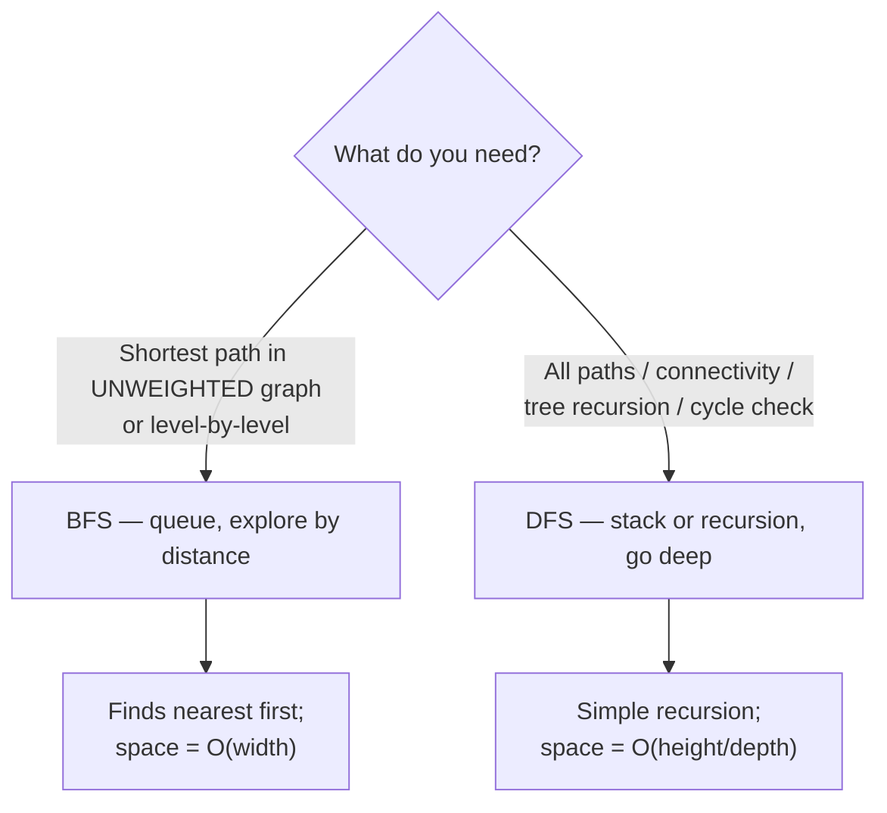
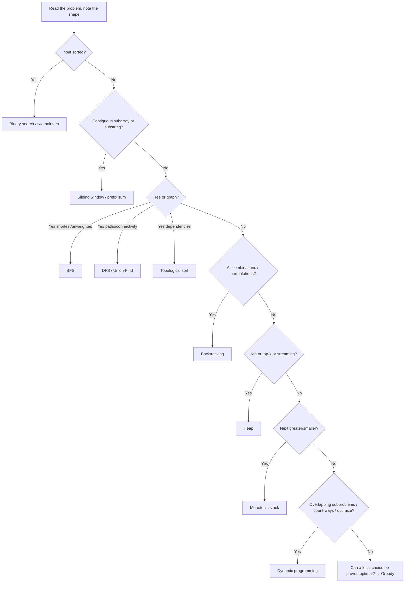
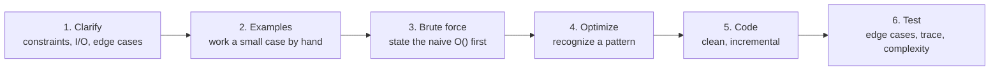

# Coding Interview Patterns Overview

Most interview problems are not novel — they are recombinations of ~20 recurring
**patterns**. The skill that separates candidates is not memorizing solutions but
**recognizing which pattern a problem's shape maps to**, then applying its template.
This topic is the meta-map: a catalogue of the patterns, the *recognition signal* for
each ("reach for this when…"), a decision guide from problem shape → technique, and the
disciplined problem-solving process that turns a blank editor into a correct, tested
solution.

> [!KEY-TAKEAWAY]
> Interviewers grade your **process and recognition**, not recall. Learn the signal
> ("contiguous subarray" → sliding window; "kth largest" → heap; "all combinations" →
> backtracking) and the templates, and the vast majority of problems become
> pattern-matching plus careful implementation.

## Why patterns matter

A pattern is a reusable strategy with three parts:

1. **A recognition signal** — the phrase or structural cue in the problem that hints at it
   (e.g. "sorted array", "contiguous", "shortest path in unweighted graph").
2. **A template** — the code skeleton you adapt (two indices converging, a queue-driven
   level loop, a memo table).
3. **A complexity profile** — what the pattern buys you over brute force (often turning
   O(n²) into O(n) or O(n log n)).

Recognizing a pattern collapses the search space of possible approaches. Instead of
inventing an algorithm under pressure, you retrieve a known one and spend your time on
edge cases and correctness. Senior interviews additionally probe *why* the pattern is
optimal and its trade-offs, so understand the invariant behind each, not just the shape.

> [!INTERVIEW]
> Say the pattern name out loud when you spot it: "This is a contiguous-subarray
> problem, so I'll use a sliding window." It signals experience and lets the
> interviewer redirect early if you've mis-recognized.

## The pattern catalogue — reach for this when…

The core patterns, each with its one-line recognition signal. Complexities are the
*typical* result of applying the pattern well (n = input size).

| Pattern | Reach for it when… | Typical time | Typical space |
|---|---|---|---|
| **Two pointers** | Array/string is **sorted** (or pairable), find a pair/triplet or partition | O(n) | O(1) |
| **Sliding window** | **Contiguous** subarray/substring with a constraint (max/min/at-most-k) | O(n) | O(1)–O(k) |
| **Fast & slow pointers** | Linked list / sequence cycle detection, find middle, cycle start | O(n) | O(1) |
| **Merge intervals** | Overlapping **intervals** to merge, insert, or count | O(n log n) | O(n) |
| **Cyclic sort** | Array holds numbers in a **known range 1..n**; find missing/duplicate | O(n) | O(1) |
| **In-place linked-list reversal** | Reverse a list or sublist **without extra space** | O(n) | O(1) |
| **BFS (level-order)** | **Shortest path in unweighted** graph, or level-by-level tree | O(V+E) | O(V) |
| **DFS** | Explore all paths, connectivity, tree/graph traversal, cycle check | O(V+E) | O(V) |
| **Backtracking** | Generate **all** permutations/combinations/subsets; constraint search | O(branch^depth) | O(depth) |
| **Top-K / heap** | "**K largest/smallest/most frequent**", streaming median | O(n log k) | O(k) |
| **K-way merge** | Merge/compare **K sorted** lists/arrays | O(n log k) | O(k) |
| **Binary search** | **Sorted** data, or answer is **monotonic** over a value range | O(log n) | O(1) |
| **Binary search on answer** | Minimize/maximize a value where feasibility is **monotonic** | O(n log(range)) | O(1) |
| **Monotonic stack** | "**Next/previous greater/smaller**" element; histogram spans | O(n) | O(n) |
| **Prefix sum** | Many **range-sum / subarray-sum** queries; count subarrays with sum k | O(n) | O(n) |
| **Union-Find (DSU)** | **Dynamic connectivity**, grouping, cycle detection in undirected graph | ~O(α(n)) per op | O(n) |
| **Topological sort** | **Ordering with dependencies** / DAG; course schedule, build order | O(V+E) | O(V) |
| **Trie (prefix tree)** | Many **prefix / word lookups**, autocomplete, word-dictionary search | O(L) per op | O(alphabet·nodes) |
| **Dynamic programming** | **Overlapping subproblems** + optimal substructure; count/optimize | O(states·transition) | O(states) |
| **Greedy** | A **locally optimal** choice provably yields the global optimum | O(n log n) | O(1) |
| **Bit manipulation** | Subsets via bitmask, parity, XOR tricks, flags in an int | O(n) | O(1) |

> [!TIP]
> Many hard problems compose patterns: e.g. "sliding window + hashmap" (longest
> substring without repeats), "binary search on answer + greedy feasibility check"
> (split array / ship packages), "DFS + memoization" (which *is* top-down DP).

## Two pointers

Two indices walk the array, usually from opposite ends (converging) or at different
speeds (fast/slow). Works because on a **sorted** array, moving a pointer changes the
running quantity monotonically, so you never need to backtrack.

```text
# Pair summing to target in a sorted array
lo, hi = 0, n-1
while lo < hi:
    s = a[lo] + a[hi]
    if s == target: return (lo, hi)
    elif s < target: lo += 1     # need bigger → move left up
    else:            hi -= 1     # need smaller → move right down
```

**Signal:** sorted input, "find a pair/triplet", partitioning, palindrome check,
merging two sorted arrays. Turns the O(n²) nested loop into O(n).

## Sliding window

A window `[left, right]` expands by advancing `right`, and contracts by advancing `left`
when a constraint is violated. Each element enters and leaves the window at most once →
**O(n)** total despite the nested-looking structure (amortized).

```text
# Longest substring with at most K distinct chars
left = 0; counts = {}; best = 0
for right, c in enumerate(s):
    counts[c] += 1
    while len(counts) > K:            # shrink until valid
        counts[s[left]] -= 1
        if counts[s[left]] == 0: del counts[s[left]]
        left += 1
    best = max(best, right - left + 1)
```

**Signal:** "contiguous", "substring/subarray", "longest/shortest/at-most-k",
fixed-size window (averages of size k). If the problem allows non-contiguous elements,
it's *not* a sliding window.

## Fast & slow pointers

Two pointers advance at different speeds (Floyd's tortoise-and-hare). If a cycle exists,
the fast pointer laps the slow one and they meet. Also finds the middle node in one pass
(fast moves 2×, slow moves 1×).

**Signal:** linked-list cycle detection / cycle start, find middle, "happy number",
detecting repetition in a functional sequence. O(n) time, O(1) space (beats a hash set).

## Cyclic sort & in-place reversal

- **Cyclic sort:** when values are a permutation of `1..n` (or `0..n-1`), place each
  value at its index by swapping. Then a missing/duplicate/misplaced value is found by a
  single scan. O(n) time, O(1) space — beats sorting or a hash set.
- **In-place reversal:** reverse a linked list (or sublist) by re-pointing `next`
  pointers with three cursors (`prev, curr, next`). O(n) time, O(1) space.

**Signal (cyclic sort):** "array of n numbers in range [1,n]", "find the missing /
duplicate / all missing numbers". **Signal (reversal):** "reverse list", "reverse in
groups of k", "reorder list" — with an O(1)-space constraint.

## BFS vs DFS

Both traverse trees/graphs in O(V+E); the difference is *order* and what that unlocks.



- **BFS** uses a **queue**, visits nodes in order of distance from the source → the first
  time you reach the target is the **shortest** path (unweighted). Space is O(max width).
- **DFS** uses recursion / an explicit **stack**, dives deep before backtracking. Natural
  for tree traversals, connected components, topological sort, and cycle detection. Space
  is O(max depth), which can be less than BFS on wide graphs but risks stack overflow on
  deep ones.

**Signal for BFS:** "shortest / fewest steps" in an unweighted graph or grid, "level
order". **Signal for DFS:** "does a path exist", "count components/islands", "all
paths", anything naturally recursive.

## Backtracking

DFS over the space of *partial solutions*: choose → recurse → **un-choose** (undo the
choice). Prune branches that cannot lead to a valid solution.

```text
def backtrack(path, choices):
    if is_solution(path): output(path); return
    for c in choices:
        if not valid(c): continue
        path.add(c)                 # choose
        backtrack(path, remaining)  # explore
        path.remove(c)              # un-choose (backtrack)
```

**Signal:** "generate **all**", "**how many** ways", permutations, combinations, subsets,
N-Queens, Sudoku, word search, partitioning. Exponential in the worst case, so prune
aggressively. Often upgraded to DP when subproblems overlap.

## Top-K & heap; K-way merge

A binary heap gives O(log k) push/pop and O(1) peek at the extreme element.

- **Top-K:** keep a heap of size **k** — a **min-heap for the K largest**, max-heap for
  the K smallest. Scan n elements → O(n log k), far better than sorting all (O(n log n))
  when k ≪ n.
- **K-way merge:** push the head of each of K sorted lists into a min-heap; repeatedly pop
  the smallest and push its successor. O(n log k) total.

**Signal:** "kth largest/smallest", "top k frequent", "k closest points", "merge k sorted
lists", running/streaming median (two heaps).

## Binary search (and on the answer)

Classic binary search halves a **sorted** search space each step → O(log n). The power
move is **binary search on the answer**: when a candidate answer's feasibility is
**monotonic** (if x works, so does every x′ > x, or vice-versa), binary-search the *value
range* and test feasibility with a linear check.

```text
# Minimize capacity so we can ship in <= D days (feasibility is monotonic)
lo, hi = max(weights), sum(weights)
while lo < hi:
    mid = (lo + hi) // 2
    if days_needed(weights, mid) <= D: hi = mid   # feasible → try smaller
    else:                              lo = mid+1  # infeasible → go bigger
return lo
```

**Signal:** sorted array (classic); "minimize the maximum / maximize the minimum",
"smallest capacity/speed/time that works", answer lies in a numeric range with a
monotonic yes/no test.

## Monotonic stack

A stack kept sorted (increasing or decreasing) as you scan. When the incoming element
breaks the order, pop — and the popped element's "next greater/smaller" is the current
element. Each element is pushed and popped once → **O(n)**.

**Signal:** "**next greater element**", "previous smaller", "daily temperatures",
"largest rectangle in histogram", "trapping rain water", stock spans.

## Prefix sum

Precompute `prefix[i] = a[0] + … + a[i-1]` so any range sum is `prefix[r] - prefix[l]` in
O(1). Combined with a hashmap of seen prefix sums, you count subarrays with a target sum
in O(n).

**Signal:** many range-sum queries, "subarray sums to k", "count subarrays with property",
2-D region sums (prefix matrix), "equilibrium/pivot index".

## Union-Find, topological sort & trie

- **Union-Find (DSU):** parent array + `find` (with path compression) + `union` (by
  rank/size). Near-constant `~O(α(n))` per op. **Signal:** dynamic connectivity, grouping,
  detecting a cycle in an **undirected** graph, Kruskal's MST, accounts/redundant-connection.
- **Topological sort:** linear ordering of a **DAG** so every edge points forward. Kahn's
  algorithm (BFS on in-degrees) or DFS post-order. O(V+E). **Signal:** "dependencies /
  prerequisites", "build order", "course schedule", detecting a cycle in a **directed** graph.
- **Trie:** tree keyed by character with an end-of-word flag; lookup/insert in O(L) for a
  length-L key, independent of dictionary size. **Signal:** many prefix queries,
  autocomplete, word dictionary with wildcards, replace-words.

## Dynamic programming vs greedy

Both optimize, but rest on different guarantees.

| | Dynamic programming | Greedy |
|---|---|---|
| **Requires** | Overlapping subproblems + optimal substructure | Greedy-choice property + optimal substructure |
| **Method** | Solve/cache **all** relevant subproblems, combine | Make the **locally best** choice, never reconsider |
| **Cost** | O(states × transition) time, O(states) space | Usually O(n log n) (sort) or O(n) |
| **Risk** | Correct but can be heavy | Fast but **wrong** if greedy-choice doesn't hold — must prove it |
| **Examples** | Knapsack, edit distance, LIS, coin change (min coins) | Interval scheduling, Huffman, Dijkstra, coin change (canonical coins) |

**DP recognition signal:** "count the number of ways", "min/max cost/length", choices
compound and subproblems repeat, brute-force recursion recomputes the same inputs.
**Greedy signal:** you can argue an exchange argument — swapping in the greedy choice
never hurts. When unsure, DP is the safe default; prove greedy before trusting it.

### Memoization vs tabulation

| | Memoization (top-down) | Tabulation (bottom-up) |
|---|---|---|
| Direction | Recursion + cache, computes only needed states | Iterative, fills table in dependency order |
| Pros | Mirrors the recurrence, easy to write, skips unused states | No recursion overhead / stack risk, easy to optimize space |
| Cons | Recursion stack, cache overhead | May compute unneeded states, order can be fiddly |

## Bit manipulation

Integers as bit sets. `x & 1` = parity; `x & (x-1)` clears the lowest set bit; XOR of
duplicates cancels to find the unique element; iterate all `2^n` subsets via bitmasks.

**Signal:** "single number", "count bits", "subsets" (bitmask enumeration), "power of
two", flags packed in an int, or a hint that O(1) extra space is required.

## Decision guide — problem shape → pattern



Quick lookup table:

| Cue in the problem | First pattern to consider |
|---|---|
| "sorted array" | binary search / two pointers |
| "contiguous subarray / substring" | sliding window |
| "range sum" / "subarray sum equals k" | prefix sum (+ hashmap) |
| "shortest path", "fewest steps", unweighted | BFS |
| "all paths", "connected components", "islands" | DFS / union-find |
| "prerequisites", "build/dependency order" | topological sort |
| "generate all", "permutations/combinations/subsets" | backtracking |
| "kth largest/smallest", "top k", "k closest" | heap |
| "merge k sorted …" | K-way merge (heap) |
| "next/previous greater/smaller", "histogram" | monotonic stack |
| "cycle in linked list", "find middle" | fast & slow pointers |
| "overlapping intervals" | merge intervals |
| "numbers 1..n, missing/duplicate" | cyclic sort |
| "minimize the max / maximize the min" | binary search on answer |
| "count ways", "min/max cost", overlapping subproblems | dynamic programming |
| "prefix / autocomplete / dictionary" | trie |
| "dynamic connectivity", "grouping" | union-find |

## The problem-solving process

A repeatable loop that interviewers explicitly grade. Do **not** jump to code.



1. **Clarify.** Restate the problem. Ask about input size (drives target complexity),
   value ranges, duplicates, empty/null, sorted?, in-place?, return value. Constraints are
   *hints*: n ≤ 20 → exponential/backtracking is fine; n ≤ 10⁵ → aim for O(n log n) or
   better; n ≤ 10⁹ as a *value* → binary search on the answer.
2. **Examples.** Write a concrete small example and the expected output; include an edge
   case. This surfaces misunderstandings before you code.
3. **Brute force.** State the naive solution and its complexity out loud — it shows you
   understand the problem and gives a correctness baseline. Sometimes it's accepted.
4. **Optimize.** Find the bottleneck; match the shape to a pattern (use the decision
   guide). Common upgrades: nested loop → hashmap/two-pointer/sliding-window; repeated
   recursion → memoization; repeated "min so far" → heap; repeated range sum → prefix sum.
5. **Code.** Write clean, readable code incrementally; narrate as you go. Name variables
   meaningfully; handle edge cases you identified.
6. **Test.** Dry-run your code on the examples and edge cases (empty, single element,
   duplicates, overflow). State final time/space complexity.

> [!WARNING]
> Skipping clarification is the most common failure. Coding the wrong problem fast is
> worse than coding the right problem slowly. Confirm the spec and edge cases first.

## Complexity trade-offs

Choosing a pattern is choosing a point on the time/space curve.

- **Hashmap** buys O(1) average lookup at the cost of O(n) space (and O(n) worst case on
  pathological collisions) — the classic time-for-space trade to kill a nested loop.
- **Sorting first** (O(n log n)) can enable two-pointer/binary-search follow-ups that beat
  an unsorted O(n²) approach — worth it unless input is huge or already ordered.
- **Heap of size k** (O(n log k), O(k) space) beats full sort (O(n log n)) when k ≪ n.
- **Two pointers / sliding window** achieve O(1) extra space where a hashmap-based count
  would spend O(n).
- **DP** trades memory (the table) for avoiding exponential recomputation; space-optimize
  by keeping only the last row/diagonal when transitions are local.
- **Binary search on the answer** turns an intractable search over answers into
  O(log range) feasibility checks — trades a cleverness for a huge constant-factor and
  asymptotic win.

Always state the target complexity implied by the constraints *before* optimizing, so you
know when to stop.

## Interview Problems

Canonical problems, grouped by the pattern they drill. Solving one representative per
pattern builds the recognition reflex this topic is about.

**Two pointers / sliding window / prefix sum**
- [Two Sum](https://leetcode.com/problems/two-sum/) — Easy — hashmap for O(n) complement lookup
- [Longest Substring Without Repeating Characters](https://leetcode.com/problems/longest-substring-without-repeating-characters/) — Medium — sliding window + hashset
- [3Sum](https://leetcode.com/problems/3sum/) — Medium — sort then two pointers
- [Subarray Sum Equals K](https://leetcode.com/problems/subarray-sum-equals-k/) — Medium — prefix sum + hashmap

**Fast/slow pointers & linked list**
- [Linked List Cycle](https://leetcode.com/problems/linked-list-cycle/) — Easy — Floyd's tortoise and hare
- [Reverse Linked List](https://leetcode.com/problems/reverse-linked-list/) — Easy — in-place pointer reversal

**BFS / DFS / topological sort / union-find**
- [Number of Islands](https://leetcode.com/problems/number-of-islands/) — Medium — DFS/BFS flood fill on a grid
- [Course Schedule](https://leetcode.com/problems/course-schedule/) — Medium — topological sort / cycle detection
- [Word Search](https://leetcode.com/problems/word-search/) — Medium — DFS backtracking on a grid

**Backtracking**
- [Subsets](https://leetcode.com/problems/subsets/) — Medium — backtracking over include/exclude
- [Permutations](https://leetcode.com/problems/permutations/) — Medium — backtracking with used set

**Heap / top-K / K-way merge**
- [Kth Largest Element in an Array](https://leetcode.com/problems/kth-largest-element-in-an-array/) — Medium — heap or quickselect
- [Merge k Sorted Lists](https://leetcode.com/problems/merge-k-sorted-lists/) — Hard — K-way merge with a min-heap
- [Top K Frequent Elements](https://leetcode.com/problems/top-k-frequent-elements/) — Medium — heap / bucket sort

**Binary search / monotonic stack / intervals**
- [Search in Rotated Sorted Array](https://leetcode.com/problems/search-in-rotated-sorted-array/) — Medium — modified binary search
- [Koko Eating Bananas](https://leetcode.com/problems/koko-eating-bananas/) — Medium — binary search on the answer
- [Daily Temperatures](https://leetcode.com/problems/daily-temperatures/) — Medium — monotonic stack (next greater)
- [Merge Intervals](https://leetcode.com/problems/merge-intervals/) — Medium — sort then merge overlaps

**Dynamic programming**
- [Climbing Stairs](https://leetcode.com/problems/climbing-stairs/) — Easy — 1-D DP (Fibonacci recurrence)
- [Coin Change](https://leetcode.com/problems/coin-change/) — Medium — DP min-coins / greedy contrast
- [Longest Increasing Subsequence](https://leetcode.com/problems/longest-increasing-subsequence/) — Medium — DP + binary search optimization

## Common follow-up questions

- **"How did you know to use this pattern?"** — Name the signal you recognized (sorted →
  binary search, contiguous → sliding window). Interviewers want the *reasoning*, not luck.
- **"What's the brute force, and why is your solution better?"** — Always have the naive
  complexity ready and articulate the specific bottleneck the pattern removes.
- **"Can you do it in O(1) space?"** — Often a nudge toward two-pointers, cyclic sort,
  in-place reversal, or bit tricks instead of a hashmap.
- **"What if the input doesn't fit in memory / is a stream?"** — Steers toward heaps
  (streaming top-k / median), reservoir sampling, or external merge.
- **"Prove your greedy choice is optimal."** — Give an exchange argument, or fall back to
  DP if you can't.
- **"How do the constraints change your approach?"** — Tie n's magnitude to a target
  complexity and thus a pattern (n ≤ 20 backtracking; n ≤ 10⁵ → O(n log n)).

## References

- Cormen, Leiserson, Rivest, Stein — *Introduction to Algorithms* (CLRS), 4th ed. —
  greedy vs DP, graph traversal, complexity foundations.
- Skiena — *The Algorithm Design Manual*, 3rd ed. — the "war stories" and technique
  selection.
- *Grokking the Coding Interview: Patterns for Coding Questions* (DesignGurus/Educative) —
  origin of the pattern-catalogue framing.
- Sedgewick & Wayne — *Algorithms*, 4th ed. — union-find (α analysis), sorting, search.
- LeetCode Explore cards and the NeetCode roadmap — canonical problem sets per pattern.
- CP-Algorithms (cp-algorithms.com) — reference implementations and complexity proofs.
