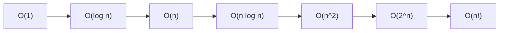
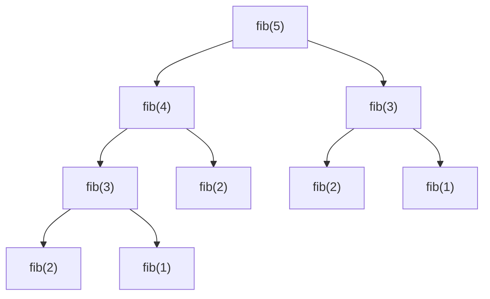

# Complexity Analysis & Big-O

Complexity analysis is the language interviewers use to reason about whether a
solution scales. It is the single most reused skill in the coding round: after you
sketch an approach, the first follow-up is almost always **"what's the time and space
complexity?"** This topic teaches the notation precisely (Big-O / Big-Omega / Big-Theta),
the common growth classes, how to analyze loops and recursion, amortized analysis, and
how to *state* complexity crisply under interview pressure without tripping on the classic
mistakes.

> [!KEY-TAKEAWAY]
> Big-O describes how the **cost grows as input size `n` grows**, ignoring constant
> factors and lower-order terms. It is an *asymptotic upper bound* on a *specific
> resource* (time or space) in a *specific case* (worst, average, best). Always be
> explicit about which resource and which case you mean.

## Asymptotic notation

We measure an algorithm by how its running time (or space) **grows** with input size
`n`, not by wall-clock seconds — those depend on hardware, language, and compiler.
Asymptotic notation captures the growth *rate* and deliberately throws away detail that
doesn't matter as `n → ∞`.

The three formal bounds (from CLRS):

| Notation | Name | Meaning | Analogy |
|---|---|---|---|
| `O(f(n))` | Big-O | **Upper** bound: grows *no faster than* `f(n)` | "≤" |
| `Ω(f(n))` | Big-Omega | **Lower** bound: grows *at least as fast as* `f(n)` | "≥" |
| `Θ(f(n))` | Big-Theta | **Tight** bound: both `O` and `Ω` — grows *exactly like* `f(n)` | "=" |

Formal definition of Big-O: `T(n) = O(f(n))` iff there exist positive constants `c` and
`n₀` such that `0 ≤ T(n) ≤ c·f(n)` for all `n ≥ n₀`. In words: past some input size,
`T(n)` stays under a constant multiple of `f(n)`.

> [!TIP]
> In interviews people say "Big-O" loosely to mean the *tight* bound (what CLRS calls
> Θ). Saying "this is O(n log n)" when it's really Θ(n log n) is universally accepted.
> But know the difference: quicksort is `O(n²)` worst case and `Θ(n log n)` on average —
> conflating "O" with "tight" is where the confusion starts.

### Why we drop constants and lower-order terms

Two simplification rules make asymptotics useful:

1. **Drop lower-order terms.** `T(n) = 3n² + 100n + 5000` is `O(n²)`. As `n` grows, the
   `n²` term dominates; at `n = 10,000` the `n²` term is ~10⁸ while `100n` is ~10⁶ — two
   orders of magnitude smaller. The tail terms become noise.
2. **Drop constant factors.** `O(2n)`, `O(100n)`, and `O(n/2)` are all just `O(n)`.
   Constants depend on machine/implementation details that Big-O intentionally abstracts
   away.

> [!WARNING]
> "Drop constants" is an *asymptotic* statement, not a *practical* one. A `O(n)` algorithm
> with a huge constant can lose to a `O(n log n)` one on realistic input sizes (this is
> exactly why library sorts switch to insertion sort for small subarrays). In an interview,
> report the Big-O, but if the constant matters for the use case, say so.

## Common complexity classes

Ordered from best to worst growth. The right column is roughly how large an `n` you can
handle in ~1 second (≈10⁸ simple operations, a useful competitive-programming rule of
thumb).

| Class | Name | Example | Feasible `n` (~1s) |
|---|---|---|---|
| `O(1)` | Constant | Array index, hash lookup (avg), push/pop | any |
| `O(log n)` | Logarithmic | Binary search, balanced-BST op, heap push | astronomically large |
| `O(n)` | Linear | Single scan, two-pointer, hashmap frequency count | ~10⁸ |
| `O(n log n)` | Linearithmic | Merge/heap sort, "sort then scan" | ~10⁶–10⁷ |
| `O(n²)` | Quadratic | Nested loops, bubble sort, naive pair comparison | ~10⁴ |
| `O(n³)` | Cubic | Floyd–Warshall, naive matrix multiply | ~500 |
| `O(2ⁿ)` | Exponential | Subsets/power set, naive recursive Fibonacci | ~20–25 |
| `O(n!)` | Factorial | Permutations, brute-force TSP | ~11 |



> [!TIP]
> The constraint sizes in a problem statement leak the intended complexity. `n ≤ 20` →
> think exponential/bitmask; `n ≤ 500` → `O(n³)` is fine; `n ≤ 10⁵` → you need `O(n log n)`
> or better; `n ≤ 10⁹` → `O(log n)` or `O(√n)` per query, or math. Reading the constraints
> is a legitimate interview signal, not cheating.

### Concrete examples

- **`O(1)`** — `arr[i]`, `map.get(k)` (average), `stack.push()`. No dependence on `n`.
- **`O(log n)`** — each step halves the search space (binary search, descending a
  balanced tree). Base of the log is irrelevant (see below).
- **`O(n)`** — touch each element a constant number of times: sum an array, two-pointer
  scan, one pass to build a frequency map.
- **`O(n log n)`** — the comparison-sort barrier; also "for each of n items, do a
  log-n operation" (e.g. push n items through a heap).
- **`O(n²)`** — every pair: `for i: for j:`. Naive "is there a duplicate" comparing all
  pairs.
- **`O(2ⁿ)`** — enumerate all subsets of a set of size `n` (there are 2ⁿ of them).
- **`O(n!)`** — enumerate all orderings/permutations of `n` items.

## Time vs space complexity

Big-O applies to **any** resource. The two that matter in interviews:

- **Time complexity** — number of elementary operations as a function of `n`.
- **Space complexity** — *extra* memory beyond the input, as a function of `n`. This is
  usually **auxiliary space**: the input itself is not counted (unless you're asked about
  total space).

Two space costs candidates routinely forget:

1. **Recursion stack space.** Each recursive call frame occupies the call stack. A
   recursion `d` levels deep uses `O(d)` stack space *even if it allocates no heap*. DFS
   on a tree is `O(h)` stack space where `h` is height — `O(n)` for a skewed tree,
   `O(log n)` for a balanced one. Recursive merge sort uses `O(log n)` recursion-stack
   depth plus an `O(n)` merge buffer, so `O(n)` auxiliary space overall.
2. **Output vs auxiliary.** If a problem asks you to return all subsets, the output is
   `O(2ⁿ)` — but that's *required* output, not wasteful auxiliary space. Distinguish
   "space I'm forced to produce" from "space my algorithm chose to use."

> [!INTERVIEW]
> "In-place" means `O(1)` **auxiliary** space (a constant number of extra variables),
> modifying the input directly. Reversing an array with two pointers is in-place.
> Note: an in-place *recursive* algorithm can still use `O(log n)` or `O(n)` stack space —
> in-place refers to heap/data allocation, not the call stack. Be ready for the interviewer
> who asks "is that truly O(1) space?" about a recursive solution — the honest answer counts
> the stack.

| Algorithm | Time | Auxiliary space |
|---|---|---|
| Iterative array reversal (two pointers) | `O(n)` | `O(1)` |
| Merge sort | `O(n log n)` | `O(n)` (merge buffer) |
| Quicksort (in-place partition) | `O(n log n)` avg | `O(log n)` (stack) |
| Heap sort | `O(n log n)` | `O(1)` |
| BFS on a graph | `O(V + E)` | `O(V)` (queue + visited) |
| Recursive DFS on a tree | `O(n)` | `O(h)` (stack) |

## Best, average, and worst case

The **case** describes *which input* you're analyzing, and it is orthogonal to the
notation (O/Ω/Θ):

- **Worst case** — the input that maximizes cost. Usually what interviewers want because
  it's the guarantee. "Quicksort is `O(n²)`" is a worst-case (already-sorted with naive
  pivot) statement.
- **Average case** — expected cost over a distribution of inputs (often assuming random
  input or randomized algorithm). "Quicksort is `O(n log n)` on average."
- **Best case** — the luckiest input. Rarely useful, but sometimes cited (insertion sort
  is `O(n)` best case on already-sorted input).

Classic table:

| Algorithm | Best | Average | Worst |
|---|---|---|---|
| Quicksort | `O(n log n)` | `O(n log n)` | `O(n²)` |
| Merge sort | `O(n log n)` | `O(n log n)` | `O(n log n)` |
| HashMap lookup | `O(1)` | `O(1)` | `O(n)` (all collide) |
| Binary search | `O(1)` | `O(log n)` | `O(log n)` |
| Insertion sort | `O(n)` | `O(n²)` | `O(n²)` |

> [!WARNING]
> Do not confuse **case** with **notation**. "Average case" is not "Big-Omega." You can
> state a worst-case *upper* bound `O(n²)`, a worst-case *lower* bound `Ω(n log n)` for
> comparison sorts, etc. The case picks the input scenario, the Greek letter picks the
> bound direction.

## Analyzing loops and nested loops

Counting is mechanical once you internalize a few rules:

- **Sequential blocks add**, then you keep the dominant term: `O(n) + O(n²) = O(n²)`.
- **Nested loops multiply** their iteration counts: two independent loops each running
  `n` times → `O(n²)`. A loop of `n` containing a loop of `m` → `O(n·m)`.
- **Watch the *actual* bounds, not the nesting depth.** A triangular double loop
  (`for i in 0..n: for j in i..n:`) runs `n + (n-1) + … + 1 = n(n+1)/2` times = `O(n²)`,
  even though the inner loop shrinks.
- **A loop that multiplies/divides the index is logarithmic:** `for (i=1; i<n; i*=2)`
  runs `log₂ n` times → `O(log n)`.

```java
// O(n^2): triangular nested loop still quadratic
for (int i = 0; i < n; i++)
    for (int j = i + 1; j < n; j++)
        check(a[i], a[j]);

// O(n log n): outer linear, inner logarithmic
for (int i = 0; i < n; i++)
    for (int j = 1; j < n; j *= 2)
        work();
```

> [!WARNING]
> **Hidden-cost trap:** a call inside a loop may itself be non-constant. `for x in list:
> if list.contains(x)` is `O(n²)` because `contains` on a list is `O(n)`. `list.insert(0,
> x)` inside a loop is `O(n²)`. `s = s + c` on immutable strings in a loop is `O(n²)`
> (each concat copies). Always ask "what's the complexity of the operation *inside* the
> loop, on the data structure I'm actually using?"

## Analyzing recursion & the Master Theorem

For recursive algorithms, write a **recurrence** for the running time, then solve it.

A **divide-and-conquer** recurrence has the form `T(n) = a·T(n/b) + f(n)`, where you make
`a` recursive calls on subproblems of size `n/b` and do `f(n)` non-recursive work to
split/combine. The **Master Theorem** compares `f(n)` against `n^(log_b a)`:

| Case | Condition | Result |
|---|---|---|
| 1 | `f(n)` grows *polynomially slower* than `n^(log_b a)` — i.e. `f(n) = O(n^(log_b a − ε))` for some `ε > 0` | `T(n) = Θ(n^(log_b a))` |
| 2 | `f(n) = Θ(n^(log_b a))` | `T(n) = Θ(n^(log_b a) · log n)` |
| 3 | `f(n)` grows *polynomially faster* — `f(n) = Ω(n^(log_b a + ε))` for some `ε > 0` — plus the regularity condition `a·f(n/b) ≤ c·f(n)` for some `c < 1` | `T(n) = Θ(f(n))` |

> [!WARNING]
> The word "polynomially" is load-bearing: `f(n)` must beat `n^(log_b a)` by a factor of
> at least `n^ε`, not merely by a logarithmic factor. Recurrences where the gap is only
> logarithmic fall into a **gap the Master Theorem cannot solve**. The classic example is
> `T(n) = 2T(n/2) + n·log n`: here `n^(log₂2) = n` and `f(n) = n log n` is faster than `n`,
> but only by a `log n` factor — *not* polynomially — so Case 3 does **not** apply. (The
> true answer is `Θ(n·log²n)`, found via the recursion-tree method or the Akra–Bazzi
> theorem.) Claiming "grows faster → Case 3 → `Θ(n log n)`" here is a common senior-level
> trap.

Worked examples:

- **Merge sort:** `T(n) = 2T(n/2) + O(n)`. Here `a=2, b=2`, so `n^(log₂2) = n`. `f(n)=n`
  matches → Case 2 → `Θ(n log n)`. ✅
- **Binary search:** `T(n) = T(n/2) + O(1)`. `a=1, b=2`, `n^(log₂1) = n⁰ = 1`. `f(n)=1`
  matches → Case 2 → `Θ(log n)`. ✅
- **Naive matrix multiply (Strassen setup):** `T(n) = 8T(n/2) + O(n²)`. `n^(log₂8)=n³`
  dominates → Case 1 → `Θ(n³)`.

For recursions that **don't** fit the D&C mold, use the **recursion-tree / counting**
approach: count total calls × work per call.

- **Naive recursive Fibonacci:** `T(n) = T(n-1) + T(n-2) + O(1)` → `O(φⁿ) ≈ O(1.618ⁿ)`,
  usually stated `O(2ⁿ)`. The tree has exponentially many nodes because subproblems
  repeat (this is the motivation for memoization → `O(n)`).
- **Backtracking permutations:** the tree has `n!` leaves → `O(n!)`.
- **Subset generation:** binary choice per element, `2ⁿ` leaves → `O(2ⁿ)`.



The repeated `fib(3)` and `fib(2)` subtrees show why the naive version is exponential —
overlapping subproblems computed again and again.

## Amortized analysis

**Amortized** cost is the *average cost per operation over a sequence*, when a few
expensive operations are rare enough to be paid for by many cheap ones. It is a
worst-case guarantee over the sequence — not a probabilistic average.

The canonical example is the **dynamic array (ArrayList / Python list / Go slice / C++
vector)** append:

- Most `append`s write to a free slot: `O(1)`.
- When the backing array is full, it **doubles** capacity, copying all `n` elements: that
  single append costs `O(n)`.
- But doublings are rare. To reach size `n` the total copy work across all resizes is
  `1 + 2 + 4 + … + n ≈ 2n = O(n)` over `n` appends → **`O(1)` amortized per append**.

> [!WARNING]
> Doubling (geometric growth) is what makes append amortized `O(1)`. If a naive
> implementation grew the array by a **constant** amount (e.g. +1 or +10) each time, each
> resize would still copy `O(n)` but resizes would happen `O(n)` times → `O(n²)` total →
> `O(n)` amortized per append. Growth factor matters.

Three techniques to *prove* amortized bounds (know the intuition, not the algebra):

| Method | Intuition |
|---|---|
| **Aggregate** | Bound total cost of the whole sequence, divide by number of ops. (Sum of copies = 2n over n appends → O(1) each.) |
| **Accounting (banker's)** | Charge each cheap op a little extra ("credit") saved to pay for future expensive ops. Each append "prepays" for its eventual copy. |
| **Potential** | Define a potential function Φ (stored energy, e.g. Φ = 2·size − capacity); amortized cost = actual cost + ΔΦ. |

Other amortized-`O(1)` classics: hash table insert (with resize/rehash), incrementing a
binary counter, and splay-tree / Fibonacci-heap operations.

> [!INTERVIEW]
> Don't confuse **amortized** with **average-case**. Amortized `O(1)` append is a
> guarantee for *any* sequence of appends (no probability involved). Average-case `O(1)`
> hashmap lookup assumes a good hash distribution over *random* keys — an adversary can
> force `O(n)`. Different guarantees, different assumptions.

## Log bases and other simplifications

- **Log base is irrelevant in Big-O.** `log₂ n`, `log₁₀ n`, and `ln n` differ only by a
  constant factor (`log_b n = log_c n / log_c b`), and Big-O drops constants. So we just
  write `O(log n)`. (The base *does* matter inside a `log_b a` exponent in the Master
  Theorem — don't drop it there.)
- **`O(log n!) = O(n log n)`** by Stirling's approximation — relevant to the comparison-sort
  lower bound.
- **`O(n^c)` beats `O(cⁿ)`** for any constants: polynomial always beats exponential
  asymptotically.
- **Two different variables stay separate.** Graph algorithms are `O(V + E)`, not `O(n)` —
  vertices and edges scale independently, and collapsing them hides real behavior (a dense
  graph has `E = O(V²)`). Similarly, don't collapse `O(n·m)` (two strings' lengths) into
  `O(n²)` unless they're the same size.

## How to state complexity in an interview

A repeatable script:

1. **Name both time and space**, unprompted: "This is `O(n log n)` time and `O(n)` space."
2. **Say the case** if it's not obvious: "worst case `O(n²)`, average `O(n log n)`."
3. **Justify in one sentence** by pointing at the code: "We sort once — that's the
   `n log n` — then a single linear scan."
4. **Account for hidden costs**: the sort, the recursion stack, the copy inside the loop.
5. **State the space breakdown**: "`O(n)` for the hashmap, plus `O(h)` recursion stack."
6. **Offer the trade-off** if relevant: "I can drop to `O(1)` space if I sort in place,
   but that mutates the input and costs the `O(n)` hashmap's speed."

> [!TIP]
> Interviewers reward candidates who *catch their own* complexity. Saying "wait — that
> `contains` inside the loop makes this `O(n²)`, let me use a set to get it back to `O(n)`"
> demonstrates exactly the analysis skill being tested.

## Common mistakes

- **Ignoring the cost of built-in / library operations.** `list.contains`, `list.insert(0,
  …)`, string concatenation, `min`/`max` over a collection, slicing (`arr[1:]` copies in
  Python — `O(n)`). Each hides a linear (or worse) cost.
- **Sorting inside a loop.** `for each query: sort(data)` is `O(q · n log n)`. Sort once
  outside the loop when possible.
- **Counting recursion but forgetting stack space.** A "clever" recursive solution can be
  `O(n)` space even when the logic looks in-place.
- **Confusing amortized with average, or O with Θ.** (See callouts above.)
- **Collapsing independent variables** (`O(V+E)` → `O(n)`, `O(n·m)` → `O(n²)`).
- **Forgetting output size.** Generating all subsets is inherently `O(2ⁿ)` — no algorithm
  can beat the size of what it must produce.
- **Over-counting: adding when you should keep the max.** `O(n) + O(log n)` sequential is
  `O(n)`, not `O(n + log n)` written out — keep the dominant term.
- **Assuming `HashMap` is always `O(1)`.** Worst case is `O(n)` (or `O(log n)` for
  tree-ified buckets in Java 8+); a bad hash or adversarial keys degrade it.

## Interview Problems

Complexity analysis is a *meta-skill* practiced on every problem, but these classics make
you defend nested-loop → hashmap improvements, recursion-tree reasoning, in-place/space
trade-offs, and amortized structures explicitly.

**Improve a brute-force bound (nested loop → hashmap/two-pointer):**
- [Two Sum](https://leetcode.com/problems/two-sum/) — Easy — `O(n²)` pairs vs `O(n)` hashmap complement lookup
- [Contains Duplicate](https://leetcode.com/problems/contains-duplicate/) — Easy — `O(n²)` compare-all vs `O(n)` set
- [Best Time to Buy and Sell Stock](https://leetcode.com/problems/best-time-to-buy-and-sell-stock/) — Easy — `O(n²)` all pairs vs `O(n)` single pass tracking min
- [Valid Anagram](https://leetcode.com/problems/valid-anagram/) — Easy — sort `O(n log n)` vs count array `O(n)`
- [Group Anagrams](https://leetcode.com/problems/group-anagrams/) — Medium — hashing key trade-offs, `O(n·k log k)` vs `O(n·k)`
- [3Sum](https://leetcode.com/problems/3sum/) — Medium — `O(n³)` brute force vs `O(n²)` sort + two-pointer

**Recursion / recurrence & memoization (exponential → polynomial):**
- [Fibonacci Number](https://leetcode.com/problems/fibonacci-number/) — Easy — `O(2ⁿ)` naive recursion vs `O(n)` memoized/iterative
- [Climbing Stairs](https://leetcode.com/problems/climbing-stairs/) — Easy — same overlapping-subproblem recurrence as Fibonacci
- [Pow(x, n)](https://leetcode.com/problems/powx-n/) — Medium — `O(n)` naive vs `O(log n)` fast exponentiation
- [Subsets](https://leetcode.com/problems/subsets/) — Medium — inherent `O(2ⁿ)` output; recursion-tree counting
- [Permutations](https://leetcode.com/problems/permutations/) — Medium — inherent `O(n!)` output; factorial branching

**Divide-and-conquer / Master Theorem:**
- [Merge Sort — Sort an Array](https://leetcode.com/problems/sort-an-array/) — Medium — `T(n)=2T(n/2)+O(n)` → `O(n log n)`, `O(n)` space
- [Search in Rotated Sorted Array](https://leetcode.com/problems/search-in-rotated-sorted-array/) — Medium — halving recurrence → `O(log n)`

**Space complexity & amortized structures:**
- [Move Zeroes](https://leetcode.com/problems/move-zeroes/) — Easy — in-place `O(1)` auxiliary space with two pointers
- [Implement Queue using Stacks](https://leetcode.com/problems/implement-queue-using-stacks/) — Easy — amortized `O(1)` dequeue via the two-stack trick

## Common follow-up questions

- "What's the space complexity?" — Almost always the immediate follow-up to a time
  answer. Separate auxiliary space, output space, and recursion-stack space.
- "Can you do it in `O(1)` space / in place?" — Tests whether you can trade the
  hashmap for two pointers, or mutate the input. Remember recursion stack still counts.
- "Is that truly `O(1)`, or amortized?" — For dynamic arrays / hashmaps, name it as
  amortized and explain the doubling.
- "What's the worst case vs the average?" — Especially for quicksort and hashmaps;
  explain the input that triggers the worst case and how randomization/good hashing avoids
  it.
- "Why is comparison sorting `Ω(n log n)`?" — Decision-tree argument: `n!` possible
  orderings, a binary decision tree of height `h` distinguishes `2ʰ` leaves, so
  `2ʰ ≥ n!` → `h ≥ log₂(n!) = Ω(n log n)`.
- "The constant factor is huge — does Big-O still apply?" — Yes asymptotically, but
  acknowledge that for the given `n` a higher-order algorithm with a small constant may
  win in practice.

## References

- Cormen, Leiserson, Rivest, Stein — *Introduction to Algorithms* (CLRS), 4th ed.:
  Ch. 3 (Growth of Functions / asymptotic notation), Ch. 4 (Divide-and-Conquer & the
  Master Theorem), Ch. 16/17 (Amortized Analysis), Ch. 8 (comparison-sort lower bound).
- Sedgewick & Wayne — *Algorithms*, 4th ed.: order-of-growth classification and empirical
  analysis.
- Skiena — *The Algorithm Design Manual*: practical complexity intuition and the "war
  stories."
- Java Collections docs (`ArrayList`, `HashMap`) and the CPython `list` object docs — for
  the concrete amortized-`O(1)` growth policy of dynamic arrays.
- Competitive Programming canon (CP-Algorithms, *Competitive Programmer's Handbook* by
  Laaksonen) — for the "~10⁸ ops/sec" constraint-to-complexity heuristic.
