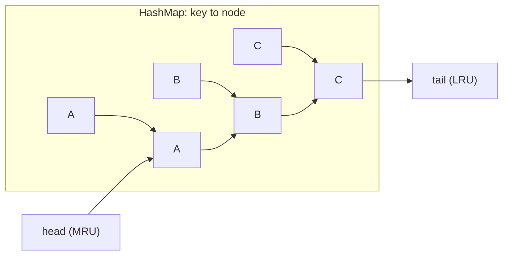
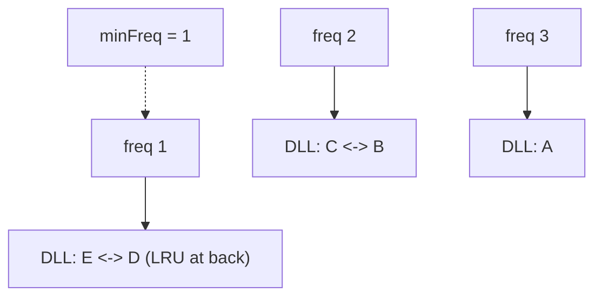
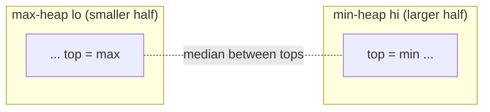
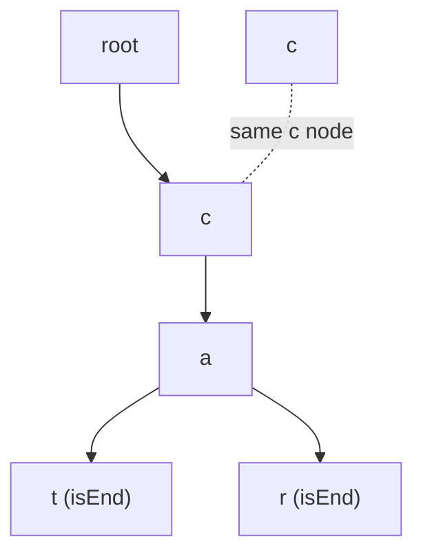

# Design Data Structures (LRU, LFU, etc.)

The **"design/implement a data structure"** genre is its own interview species. You are not
asked to *solve* a problem so much as to **compose known building blocks** — hash maps,
doubly linked lists, arrays, heaps, stacks, tries — so that *every required operation hits a
required complexity*, usually **O(1)** or **O(log n)**. The canonical example is the **LRU
cache**: `get` and `put` must both be **O(1)**, which no single built-in structure gives you
(a hash map has O(1) lookup but no ordering; a linked list has O(1) splice but O(n) lookup),
so you **glue two structures together** — a hash map for lookup and a doubly linked list for
recency ordering — and let each cover the other's weakness.

> [!KEY-TAKEAWAY]
> The winning method: **list the required operations and their target complexities, then pick
> a backing structure that delivers each op's complexity, and combine them so their strengths
> compose and their weaknesses cancel.** The recurring combos: **hash map + doubly linked
> list** (LRU, LFU, all-O(1) recency/ordering); **array + hash map of value→index** (insert /
> delete / getRandom in O(1) via swap-with-last); **two heaps** (streaming median); **auxiliary
> stack** (min-stack tracks the running min alongside the data); **tree of char-keyed nodes +
> end-of-word flag** (trie); **buckets keyed by frequency** (LFU); **sorted structure or binary
> search on timestamps** (time-based key-value store).

---

## The method: list ops, set target complexity, pick backing structures

Every design problem starts the same way. Write down the **API** (the exact methods and their
signatures), then next to each method write its **target complexity**. That target dictates
the structure:

| If an op must be… | Reach for… |
|---|---|
| O(1) lookup by key | hash map |
| O(1) insert/remove at an arbitrary known position | doubly linked list (splice given the node) |
| O(1) insert/remove at the ends only | array-backed deque / two stacks |
| O(1) random element | array (index) + hash map (value→index) |
| O(log n) min/max + insert | heap / balanced BST |
| O(log n) ordered lookup / predecessor / range | balanced BST or sorted array + binary search |
| prefix / character-path queries | trie |
| running min/max alongside a stack | auxiliary stack |

When **no single structure hits every target**, combine two so each covers the other's blind
spot. The classic pairing is **hash map (O(1) find) + doubly linked list (O(1) reorder)**: the
map stores `key → node`, and the node lives in the list so you can splice it out and reinsert
in O(1) *without searching for it*. This is the heart of LRU and LFU.

A few rules of thumb that come up constantly:

- **Doubly** linked list, not singly: to remove a node in O(1) you need its `prev` pointer.
- Use a **sentinel/dummy head and tail** to avoid null checks on the boundaries.
- The hash map must store the **node reference**, not the value — otherwise you'd scan the
  list (O(n)) to find what to move.
- "getRandom in O(1)" almost always means an **array** (uniform random index) plus a map to
  locate elements for deletion.

---

## LRU cache: hash map + doubly linked list (the canonical design)

**Least Recently Used** eviction: fixed capacity; on `get(key)` and `put(key, value)` the
touched entry becomes the most-recently-used; when full, `put` evicts the **least** recently
used entry. Both operations must be **O(1)**.

**Why one structure isn't enough.** A hash map gives O(1) `get`/`put` but has *no notion of
order*, so you can't find the LRU victim. An ordered list gives you recency ordering and O(1)
splicing *if you already hold the node*, but O(n) to *find* a key. Combine them:

- **Hash map** `key → node`: O(1) locate the node for any key.
- **Doubly linked list** of nodes ordered by recency: **front = most recently used**, **back =
  least recently used**. Because it's doubly linked and we hold the node from the map, we can
  **unlink and move-to-front in O(1)** with no search.



**Operations:**

- `get(key)`: map miss → return -1. Map hit → **unlink** the node and **move it to the front**
  (now MRU); return its value. O(1).
- `put(key, value)`: if key exists, update value and move node to front. Else create a node,
  insert at front, add to map. If `size > capacity`, **evict the tail's predecessor** (the LRU
  node): remove it from the list *and* delete its key from the map. O(1).

The **eviction removes from both structures** — forgetting to delete the key from the map is
the classic bug (a memory leak / stale entry).

```java
class LRUCache {
    class Node { int key, val; Node prev, next; Node(int k, int v){key=k; val=v;} }
    private final Map<Integer, Node> map = new HashMap<>();
    private final Node head = new Node(0,0), tail = new Node(0,0);
    private final int cap;
    LRUCache(int capacity){ cap = capacity; head.next = tail; tail.prev = head; }

    private void remove(Node n){ n.prev.next = n.next; n.next.prev = n.prev; }
    private void addFront(Node n){ n.next = head.next; n.prev = head;
                                   head.next.prev = n; head.next = n; }

    public int get(int key){
        Node n = map.get(key);
        if (n == null) return -1;
        remove(n); addFront(n);          // mark most-recently-used
        return n.val;
    }
    public void put(int key, int value){
        Node n = map.get(key);
        if (n != null){ n.val = value; remove(n); addFront(n); return; }
        if (map.size() == cap){          // evict LRU (node before tail)
            Node lru = tail.prev; remove(lru); map.remove(lru.key);
        }
        Node fresh = new Node(key, value); addFront(fresh); map.put(key, fresh);
    }
}
```

**Complexity:** `get` and `put` are **O(1)** time; **O(capacity)** space. (In Java you can cheat
in interviews with `LinkedHashMap` in access-order mode overriding `removeEldestEntry`, but
interviewers usually want the map+DLL built by hand.)

| Operation | Time |
|---|---|
| `get` | O(1) |
| `put` | O(1) |
| evict | O(1) |

---

## LFU cache: hash map + frequency buckets

**Least Frequently Used** eviction: evict the entry with the **lowest access count**; break
ties by **least recently used** among those with the minimum frequency. Both ops O(1).

The trick is a **second layer of indexing by frequency**:

- `keyToNode`: `key → node` (node stores key, value, and its current `freq`).
- `freqToList`: `freq → doubly linked list` of nodes that currently have that frequency,
  ordered by recency (front = most recent). This is essentially an LRU list *per frequency
  bucket*.
- `minFreq`: the current minimum frequency present, so eviction is O(1).



**On access (get, or put of an existing key):** remove the node from its `freq` bucket, bump
`freq++`, append it to the `freq+1` bucket. If the bucket it left was the `minFreq` bucket and
became empty, `minFreq++`.

**On insert when full:** evict from the **front/back of the `minFreq` bucket** (the LRU node
among least-frequent), delete from both maps. Insert the new key with `freq = 1` and set
`minFreq = 1`.

Every step is a constant number of hash lookups and O(1) list splices → **O(1)** `get`/`put`.
The subtlety students miss: **tie-break by recency requires an ordered (LRU) list inside each
frequency bucket**, and **`minFreq` must be maintained incrementally** (never scanned).

---

## Insert / Delete / GetRandom in O(1): array + hash map of index

Support `insert(x)`, `remove(x)`, and `getRandom()` (uniform over current elements) **all in
average O(1)**.

- **Dynamic array** `list` holds the values → `getRandom` is `list[rand(0, size-1)]`, O(1).
- **Hash map** `val → index` → `insert`/`remove` locate elements in O(1).

The clever bit is **deletion in O(1) from the middle of an array**: you can't shift (O(n)), so
**swap the element to delete with the last element**, update the moved element's index in the
map, then `pop_back`. Order is destroyed, but that doesn't matter here.

```python
class RandomizedSet:
    def __init__(self):
        self.arr = []
        self.idx = {}                       # val -> position in arr
    def insert(self, x):
        if x in self.idx: return False
        self.idx[x] = len(self.arr); self.arr.append(x); return True
    def remove(self, x):
        if x not in self.idx: return False
        i, last = self.idx[x], self.arr[-1]
        self.arr[i] = last; self.idx[last] = i      # move last into the hole
        self.arr.pop(); del self.idx[x]; return True
    def getRandom(self):
        return random.choice(self.arr)
```

`getRandom` needs an **array** (a hash set has no O(1) indexable random element). Handling
**duplicates** ("Insert Delete GetRandom O(1) - Duplicates allowed") upgrades `val → index`
to `val → set of indices` and needs care when swapping an element with itself.

---

## Min-stack: an auxiliary stack for the running minimum

Support `push`, `pop`, `top`, and **`getMin` all in O(1)**. A plain stack gives push/pop/top
in O(1) but scanning for the min is O(n). Fix it with a **second stack that tracks the minimum
so far**: each time you push, also push `min(x, currentMin)` onto the aux stack; on pop, pop
both. `getMin` reads the aux stack's top.

```python
class MinStack:
    def __init__(self): self.st, self.mins = [], []
    def push(self, x):
        self.st.append(x)
        self.mins.append(x if not self.mins else min(x, self.mins[-1]))
    def pop(self):  self.st.pop(); self.mins.pop()
    def top(self):  return self.st[-1]
    def getMin(self): return self.mins[-1]
```

The same "keep an auxiliary invariant in lockstep with the main structure" idea powers max-
stack and monotonic-structure designs. A space optimization stores `(value, minSoFar)` pairs or
encodes deltas to avoid a full second stack, but the two-stack version is the clean answer.

---

## Median from a data stream: two heaps

Support `addNum(x)` and `findMedian()` on a growing stream. Sorting each query is O(n log n);
a single heap gives you an extreme, not the middle. Use **two heaps that split the data at the
median**:

- A **max-heap** `lo` holds the **smaller half** (its max is near the median).
- A **min-heap** `hi` holds the **larger half** (its min is near the median).

Keep them **balanced** (sizes differ by ≤ 1). The median is the top of the larger heap, or the
average of both tops when sizes are equal.



`addNum` pushes then rebalances by moving one element across → **O(log n)**; `findMedian` is
**O(1)**. This two-heaps pattern generalizes to "sliding window median" and "IPO / capital"
style problems where you need both ends of a partition.

---

## Trie (prefix tree): tree of char-keyed nodes + end-of-word flag

A **trie** stores strings along paths: each node has a map/array of **children keyed by
character** and a boolean **`isEnd`** marking that a word terminates there. `insert`, `search`,
and `startsWith` are **O(L)** in the word length L (independent of how many words are stored).
See the dedicated *Tries* topic for depth; in design rounds it's the backing structure for
autocomplete, word dictionaries with `.` wildcards, and "add and search word" designs.



---

## Design Twitter, Time-Based store, Hit Counter, Snapshot, Circular buffer

These are variations on the same composition method:

- **Design Twitter** — `getNewsFeed` merges the 10 most recent tweets across the **user's own
  tweets plus everyone they follow** (a common trick is to have each user implicitly follow
  themselves so the merge set always includes self). Store each user's tweets as a list with a
  **global timestamp**; merge feeds with a **heap (k-way merge)** of those users' latest tweets.
  Follows/tweets are hash-map + set.
- **Time-Based Key-Value Store** — `set(key, val, timestamp)` and `get(key, timestamp)` returns
  the value with the **largest timestamp ≤ query**. Store `key → list of (timestamp, value)`
  appended in increasing time; `get` is a **binary search** on that list → O(log n).
- **Design Hit Counter** — count hits in the trailing 300 seconds. Use a **queue of timestamps**
  (evict those older than `now - 300`) or a **circular buffer of 300 buckets** indexed by
  `timestamp % 300` storing `(second, count)` for O(1) fixed memory.
- **Snapshot Array** — `snap()` returns a snapshot id; `get(index, snapId)` reads the value as
  of a snapshot. Store per index a **list of (snapId, value)** and binary-search by snapId,
  instead of copying the whole array each snapshot.
- **Circular buffer / ring buffer** — fixed array + `head`/`tail`/`size`; wrap indices with
  `% capacity` for O(1) enqueue/dequeue with bounded memory (the backbone of rate limiters and
  streaming windows).
- **Queue via two stacks / Stack via two queues** — amortized-O(1) queue: push to an `in` stack,
  and when dequeuing, if `out` is empty pour `in` into `out` (reversing order). Each element is
  moved at most twice → **amortized O(1)**.

---

## Common gotchas

- **Eviction must touch every structure.** In LRU/LFU, removing a node from the list but
  forgetting to delete its key from the map leaks memory and returns stale nodes.
- **Singly vs doubly linked.** O(1) removal of a known node needs a `prev` pointer — use a
  **doubly** linked list, and sentinel head/tail to avoid edge-case null checks.
- **Store the node, not the value, in the map.** Storing the value forces an O(n) list scan to
  reorder.
- **LFU tie-break is by recency**, so each frequency bucket is itself an ordered (LRU) list, and
  `minFreq` is maintained incrementally, never recomputed by scanning.
- **getRandom needs an array**, not a set — sets have no O(1) uniform-random indexed access.
- **Deleting from an array in O(1)** = swap-with-last then pop; remember to fix the moved
  element's index in the map.
- **Two-heap median rebalancing**: after every add, push to one heap then move its top to the
  other, keeping sizes within 1 — a common off-by-one source.
- **Amortized vs worst-case**: "queue with two stacks" and dynamic-array resizing are *amortized*
  O(1), not worst-case O(1); say so explicitly if asked.

---

## Interview Problems

Grouped roughly by the structure/composition they drill.

**Hash map + doubly linked list (recency/frequency):**
- [LRU Cache](https://leetcode.com/problems/lru-cache/) — Medium — hash map + doubly linked list, move-to-front, evict tail
- [LFU Cache](https://leetcode.com/problems/lfu-cache/) — Hard — hash map + per-frequency LRU buckets + minFreq
- [All O`one Data Structure](https://leetcode.com/problems/all-oone-data-structure/) — Hard — doubly linked list of count buckets for O(1) min/max key

**Array + hash map (O(1) random / index):**
- [Insert Delete GetRandom O(1)](https://leetcode.com/problems/insert-delete-getrandom-o1/) — Medium — array + val→index map, swap-with-last delete
- [Insert Delete GetRandom O(1) - Duplicates allowed](https://leetcode.com/problems/insert-delete-getrandom-o1-duplicates-allowed/) — Hard — val→set-of-indices variant
- [Design HashMap](https://leetcode.com/problems/design-hashmap/) — Easy — buckets + chaining from scratch
- [Design HashSet](https://leetcode.com/problems/design-hashset/) — Easy — hashmap with dummy values

**Auxiliary-structure / stack-queue designs:**
- [Min Stack](https://leetcode.com/problems/min-stack/) — Medium — auxiliary stack tracking running minimum
- [Implement Queue using Stacks](https://leetcode.com/problems/implement-queue-using-stacks/) — Easy — in/out stacks, amortized O(1)
- [Implement Stack using Queues](https://leetcode.com/problems/implement-stack-using-queues/) — Easy — rotate a single queue on push
- [Design Circular Queue](https://leetcode.com/problems/design-circular-queue/) — Medium — ring buffer with wraparound indices

**Heaps / ordered / trie composition:**
- [Find Median from Data Stream](https://leetcode.com/problems/find-median-from-data-stream/) — Hard — two heaps split at the median
- [Design Twitter](https://leetcode.com/problems/design-twitter/) — Medium — timestamps + k-way heap merge of feeds
- [Time Based Key-Value Store](https://leetcode.com/problems/time-based-key-value-store/) — Medium — binary search on sorted timestamps
- [Design Hit Counter](https://leetcode.com/problems/design-hit-counter/) — Medium — queue / circular buffer of timestamps
- [Implement Trie (Prefix Tree)](https://leetcode.com/problems/implement-trie-prefix-tree/) — Medium — char-keyed nodes + end-of-word flag
- [Design Add and Search Words Data Structure](https://leetcode.com/problems/design-add-and-search-words-data-structure/) — Medium — trie + DFS for `.` wildcard
- [Snapshot Array](https://leetcode.com/problems/snapshot-array/) — Medium — per-index (snapId, value) log + binary search

---

## Common follow-up questions

- **"Make your LRU cache thread-safe."** Guard operations with a lock; discuss the contention on
  the single list, striping, or a concurrent design (e.g., Java's `ConcurrentLinkedHashMap` /
  Caffeine, which approximate LRU with sampling to reduce lock contention).
- **"How does a real cache (Redis, Guava, Caffeine) do eviction?"** Often **approximate LRU/LFU**
  via sampling or frequency sketches (Caffeine's TinyLFU with a count-min sketch) — exact LRU's
  per-access bookkeeping is expensive at scale.
- **"LRU vs LFU — when does each win?"** LRU adapts fast to changing working sets but is fooled by
  one-off scans; LFU keeps genuinely hot items but can be polluted by stale once-popular keys
  (needs aging/decay).
- **"Extend LRU to a TTL cache."** Add expiry timestamps and a second ordering (min-heap by
  expiry, or lazy expiry on access).
- **"Why doubly and not singly linked?"** O(1) unlink of an arbitrary node needs its predecessor.
- **"getRandom with weighted probabilities?"** Prefix-sum array + binary search, or alias method.
- **"Two-stack queue worst case?"** A single dequeue can be O(n) when pouring stacks over; it's
  **amortized** O(1), and worst-case O(1) needs a more elaborate (functional) queue.

## References

- Cormen, Leiserson, Rivest, Stein — *Introduction to Algorithms* (CLRS), 3rd/4th ed.: hash
  tables (Ch. 11), heaps (Ch. 6), amortized analysis (Ch. 17), BSTs (Ch. 12).
- Java Platform SE docs — `LinkedHashMap` (access-order mode, `removeEldestEntry`),
  `PriorityQueue`, `ArrayDeque`.
- Python docs — `heapq`, `collections.OrderedDict` / `deque`, `random`.
- Ben Manes — *Caffeine* wiki on Window TinyLFU (approximate, scalable eviction).
- LeetCode Explore — *Design* card; problems linked above.
