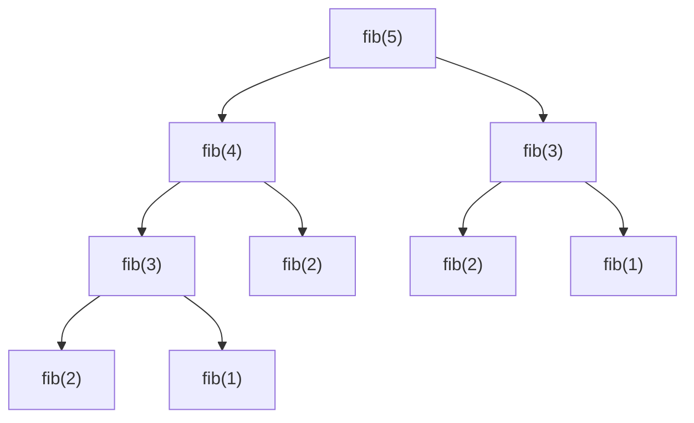
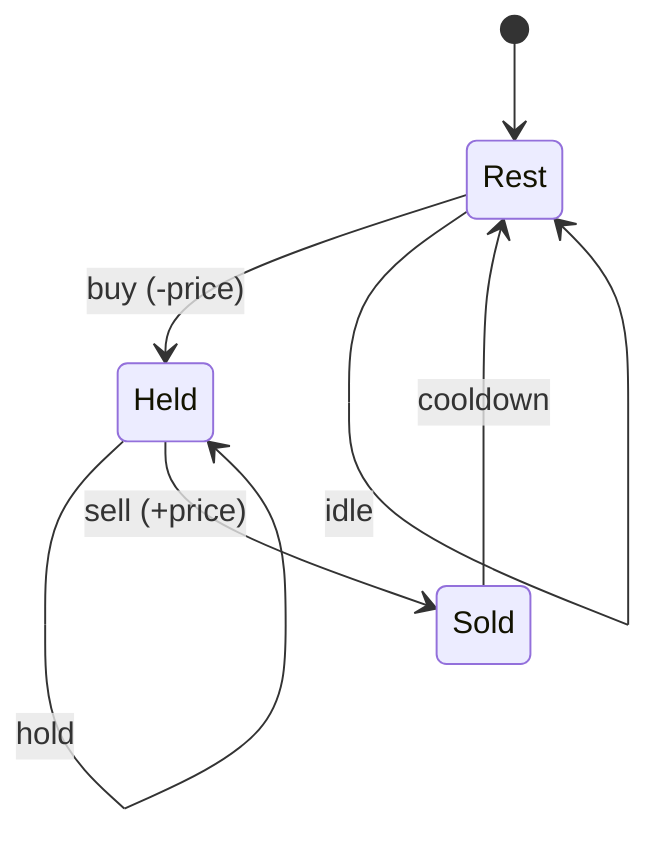

# Dynamic Programming

> **Dynamic programming (DP)** is a technique for solving problems by breaking them into
> overlapping subproblems, solving each subproblem *once*, and reusing the stored answer
> instead of recomputing it. It applies exactly when a problem has two properties:
> **optimal substructure** (an optimal answer is built from optimal answers to subproblems)
> and **overlapping subproblems** (the naive recursion revisits the same subproblem many
> times). DP turns exponential brute-force recursion into polynomial time by *trading
> memory for time* — you pay `O(#states)` space to avoid re-solving states. Interviewers
> reach for DP constantly (knapsack, LIS, LCS/edit distance, grid paths, decision DP), and
> the reason candidates fail is almost never "I forgot the algorithm" — it is failure to
> **define the state and recurrence** precisely. This page drills that method.

## The two signals: optimal substructure and overlapping subproblems

A problem is a DP candidate when *both* of these hold:

1. **Optimal substructure** — the optimal solution to the whole can be composed from
   optimal solutions to subproblems. Formally, once you fix a first choice, the remainder
   is an independent instance of the same problem whose optimum you can plug in. Example:
   the shortest path from A to C through B equals shortest(A→B) + shortest(B→C).
   *Counter-example:* longest **simple** path has no optimal substructure — gluing two
   optimal sub-paths can revisit a vertex — which is one reason it is NP-hard.
2. **Overlapping subproblems** — the recursion tree contains the *same* subproblem
   repeatedly. Fibonacci is the canonical illustration: `fib(n)` calls `fib(n-1)` and
   `fib(n-2)`, and `fib(n-2)` is recomputed in both branches, so the naive tree has
   `O(φ^n)` nodes even though there are only `n` distinct subproblems.

If subproblems do **not** overlap (each is solved once), you have plain divide-and-conquer
(merge sort, quicksort) — memoization buys nothing. If there is no optimal substructure,
DP does not apply and you likely need search/backtracking or a different formulation.



> [!KEY-TAKEAWAY]
> DP = **recursion + reuse**. The moment your recursive brute force recomputes an identical
> call, add a cache keyed by the call's arguments and the exponential collapses to
> `#states × transition cost`.

## The method: state, recurrence, base case, order, answer

Nearly every DP interview answer follows the same five-step recipe. Say these steps out
loud in an interview — it signals you understand DP as a *method*, not a memorized formula.

1. **Define the state.** What does `dp[i]` (or `dp[i][j]`) *mean*? Write a precise English
   sentence: "the minimum cost to ... using the first `i` items with capacity `j`". A
   vague state definition is the root cause of almost every wrong DP. The state variables
   are exactly the arguments your recursion branches on.
2. **Recurrence / transition.** Express `dp[state]` in terms of *smaller* states. This is
   the "if I make this choice, the rest is a smaller instance" step.
3. **Base cases.** The smallest states you can fill in directly (empty string, zero items,
   capacity 0).
4. **Evaluation order.** For tabulation, iterate so that every state's dependencies are
   already computed before it. (Top-down memoization handles ordering automatically via
   the recursion stack.)
5. **Where is the answer?** Often `dp[n]`, `dp[n][W]`, or a max/min over the last row —
   not always the last cell, so state it explicitly.

> [!INTERVIEW]
> "Walk me through your DP." The expected structure is exactly the five steps above. State
> the meaning of `dp`, the recurrence with a one-line justification, base cases, the loop
> order, and where the answer lives. Then give **time = #states × transition** and space.

## Top-down memoization vs bottom-up tabulation

There are two equivalent ways to implement any DP. They compute the same values; they
differ in control flow, overhead, and which subproblems get touched.

**Top-down (memoization):** write the natural recursion, then cache results in a
map/array. Solves *only the states actually reachable* from the target (lazy).

```python
from functools import lru_cache
@lru_cache(maxsize=None)
def rob(i):
    if i < 0: return 0
    return max(rob(i-1), rob(i-2) + nums[i])   # skip i, or take i
```

**Bottom-up (tabulation):** fill a table iteratively from base cases upward. Solves states
in a fixed order; no recursion, so no stack-overflow risk.

```python
dp = [0]*(n+1)
dp[1] = nums[0]
for i in range(2, n+1):
    dp[i] = max(dp[i-1], dp[i-2] + nums[i-1])
return dp[n]
```

| Aspect | Top-down (memoization) | Bottom-up (tabulation) |
|---|---|---|
| Control flow | recursion + cache | iterative loops over a table |
| States computed | only reachable ones (lazy) | typically **all** states |
| Ordering | automatic (call stack) | you must order dependencies correctly |
| Stack risk | deep recursion → stack overflow | none |
| Constant factor | function-call / hashing overhead | tighter; better cache locality |
| Easier when | transitions are irregular / sparse | dependencies are simple and dense |
| Space optimization | harder | easy (drop finished rows — rolling array) |

> [!TIP]
> Write it **top-down first** in an interview: the recurrence maps directly onto the
> recursion and is easiest to get right. If asked to optimize space or remove recursion,
> convert to tabulation and then to a rolling array.

## Complexity: #states × transition cost

The complexity formula for DP is mechanical:

- **Time** = (number of distinct states) × (work per transition).
- **Space** = number of states you must keep, before optimization.

Examples: 1-D `dp[i]` with `O(1)` transition → `O(n)` time. Knapsack `dp[i][w]` with `O(1)`
transition → `O(nW)`. LIS with the `dp[i]=max over j<i` recurrence → `O(n²)` (n states ×
O(n) transition), improvable to `O(n log n)` with a patience-sorting / binary-search
transition. Matrix-chain / interval DP with `dp[i][j]` and an `O(n)` split loop → `O(n³)`.

> [!WARNING]
> Knapsack's `O(nW)` is **pseudo-polynomial**: `W` is a *value* in the input, and encoding
> it takes `log W` bits, so the runtime is exponential in the *input size*. That is why
> subset-sum / knapsack are NP-complete yet still have an "efficient" table DP for small
> numeric bounds. Say "pseudo-polynomial" in interviews to score points.

## Space optimization: the rolling array

When `dp[i]` depends only on a bounded window of previous rows/entries, you don't need the
whole table. **Rolling array**: keep just the last one or two rows and overwrite in place.

- **House Robber:** `dp[i]` needs only `dp[i-1]`, `dp[i-2]` → keep two scalars, `O(1)` space.
- **0/1 Knapsack:** `dp[i][w]` needs row `i-1`. Collapse to a 1-D array and iterate `w`
  **descending** so each item is used at most once.
- **Unbounded knapsack (coin change):** same 1-D array but iterate `w` **ascending** so an
  item can be reused.
- **Grid / LCS:** two rows (or one row + a diagonal temp) reduce `O(mn)` space to `O(min(m,n))`.

> [!WARNING]
> The classic 0/1 knapsack 1-D bug: iterating capacity in *ascending* order lets the same
> item be picked multiple times (it turns 0/1 into unbounded). Direction is the whole
> difference between the two knapsacks.

## 0/1 knapsack and subset-sum

**0/1 knapsack:** `n` items with weights `w[i]` and values `v[i]`, capacity `W`; each item
taken **at most once**; maximize value. State `dp[i][c]` = best value using first `i` items
with capacity `c`. Transition per item: *skip* it (`dp[i-1][c]`) or *take* it if it fits
(`dp[i-1][c-w[i]] + v[i]`).

```text
dp[i][c] = max( dp[i-1][c],                       # skip item i
                dp[i-1][c - w[i]] + v[i] )         # take item i (if w[i] <= c)
```

`O(nW)` time, `O(W)` space with a rolling array (descending `c`). **Subset-sum / Partition
Equal Subset Sum** is the boolean specialization: `dp[c]` = can we hit exactly sum `c`?
`dp[c] |= dp[c - num]`. Partition-equal-subset reduces to subset-sum with target
`totalSum / 2` (impossible if the total is odd).

## Unbounded knapsack and coin change

**Unbounded knapsack:** each item can be used **unlimited** times. Same table, but the
transition references the *current* row (item still available): the 1-D form iterates
capacity **ascending**.

**Coin Change (min coins):** `dp[a]` = fewest coins summing to amount `a`; `dp[0]=0`,
`dp[a] = 1 + min over coins c of dp[a-c]`. `O(amount × #coins)`, `O(amount)` space.
**Coin Change II (count combinations):** loop coins on the *outside*, amount inside, so
each combination is counted once (order-independent) — a classic ordering subtlety.

> [!WARNING]
> In Coin Change II, swapping the loop order (amount outer, coins inner) counts *ordered*
> sequences (permutations), not combinations, and overcounts. Loop nesting encodes whether
> order matters.

## LIS — Longest Increasing Subsequence

State `dp[i]` = length of the longest strictly increasing subsequence **ending at index i**.
`dp[i] = 1 + max(dp[j])` over all `j < i` with `nums[j] < nums[i]`; answer = `max(dp)`.
That's `O(n²)`.

**`O(n log n)` version:** maintain `tails[]`, where `tails[k]` is the smallest possible tail
of an increasing subsequence of length `k+1`. For each element, binary-search the first tail
`>= x` and replace it (or append). The length of `tails` is the LIS length. `tails` is *not*
a valid subsequence itself — only its length is meaningful.

## LCS and edit distance

**Longest Common Subsequence (LCS):** `dp[i][j]` = LCS length of `A[:i]` and `B[:j]`.
If `A[i-1]==B[j-1]`: `dp[i][j] = dp[i-1][j-1] + 1`; else `max(dp[i-1][j], dp[i][j-1])`.
`O(mn)` time, `O(min(m,n))` space with two rows.

**Edit distance (Levenshtein):** `dp[i][j]` = min ops (insert/delete/replace) to turn
`A[:i]` into `B[:j]`. If chars match, `dp[i][j]=dp[i-1][j-1]`; else
`1 + min(dp[i-1][j] delete, dp[i][j-1] insert, dp[i-1][j-1] replace)`. Base cases:
`dp[i][0]=i`, `dp[0][j]=j`. `O(mn)`.

```text
        ""  h   o   r   s   e
    ""   0  1   2   3   4   5
    r    1  1   2   2   3   4
    o    2  2   1   2   3   4
    s    3  3   2   2   2   3      edit("ros","horse") = 3
```

## Grid / matrix-path DP

Path-counting and min-cost-path problems on a grid. **Unique Paths:** robot moves only
right/down from top-left to bottom-right; `dp[i][j] = dp[i-1][j] + dp[i][j-1]`, base row and
column = 1. `O(mn)` time, `O(n)` space with one row. **Minimum Path Sum:** same recurrence
with `grid[i][j] + min(up, left)`. These reduce to `O(min(m,n))` space because each cell
depends only on the cell above and to the left.

## Decision DP — House Robber and stocks

A **state machine** family: at each index you choose among a few actions, and `dp` tracks
the best value in each *mode*.

- **House Robber I:** can't rob adjacent houses. `dp[i] = max(dp[i-1], dp[i-2]+nums[i])`.
- **House Robber II:** houses in a **circle** → run the linear DP twice, once excluding the
  first house and once excluding the last, and take the max (first and last are adjacent).
- **Best Time to Buy/Sell Stock with Cooldown:** track states `held`, `sold`, `rest`.
  `sold = held + price`; `held = max(held, rest - price)`; `rest = max(rest, sold_prev)`.
  Cooldown means you can only buy from `rest`, not immediately after `sold`.



## Interval DP

State over a **subinterval** `dp[i][j]` (answer for the range `i..j`), built by choosing a
split point or endpoints. Fill by **increasing interval length** so shorter ranges are ready.

- **Longest Palindromic Substring/Subsequence:** `dp[i][j]` true/length depends on `dp[i+1][j-1]`
  plus whether `s[i]==s[j]`. (Longest palindromic *substring* is often done with the simpler
  expand-around-center technique in `O(n²)` time, `O(1)` space.)
- **Matrix-Chain Multiplication / Burst Balloons:** `dp[i][j] = min/max over k of
  dp[i][k] + dp[k+1][j] + cost(i,k,j)`. `O(n³)` — `O(n²)` states × `O(n)` split.

## DP on trees and bitmask DP

**DP on trees:** state is a node plus a small flag (e.g. "included / not included"),
combined over children in a post-order (DFS) traversal. *House Robber III* (rob a binary
tree): each node returns `(robThis, skipThis)`; `robThis = val + skipLeft + skipRight`,
`skipThis = max(left) + max(right)`. `O(n)`.

**Bitmask DP:** when a state must remember a *subset* of a small set (n ≤ ~20), encode the
subset as the bits of an integer. State `dp[mask][...]`. Classic: **Travelling Salesman**
`dp[mask][i]` = min cost to visit the set `mask` ending at city `i`, giving `O(2^n · n²)` —
exponential but far better than `n!`. Watch the `2^n` states explode past ~20 elements.

## DP vs greedy vs backtracking

Choosing the right paradigm is itself a common interview probe.

| Paradigm | Use when | Cost |
|---|---|---|
| **Greedy** | a *locally* optimal choice is provably globally optimal (exchange argument); no need to reconsider | usually `O(n log n)` or `O(n)` |
| **DP** | optimal substructure **and** overlapping subproblems; must weigh choices whose consequences overlap | `#states × transition` (polynomial or pseudo-poly) |
| **Backtracking** | must *enumerate* all configurations, or subproblems don't overlap / no clean state | exponential (`2^n`, `n!`) |

- **Greedy vs DP:** Coin Change with *arbitrary* denominations needs DP (greedy fails, e.g.
  coins {1,3,4}, amount 6 → greedy 4+1+1=3 coins, optimal 3+3=2). Greedy only works for
  *canonical* coin systems. Activity selection / interval scheduling by earliest finish is
  greedy-optimal.
- **Backtracking vs DP:** if you need *all* solutions → backtracking. If you need a *count*
  or an *optimum* and the recursion tree has repeated states → memoize.

> [!KEY-TAKEAWAY]
> Recognition checklist for "reach for DP": the problem asks for a **count**, a **max/min**,
> or a **yes/no reachability**, over choices that lead to *overlapping* subproblems, and a
> greedy choice can be shown to fail. If instead you must list every arrangement, it's
> backtracking; if a local rule is provably optimal, it's greedy.

## Kadane — maximum subarray

**Kadane's algorithm** is DP in disguise. State: `best ending here` = max subarray sum that
*ends at* index `i`. `endHere = max(nums[i], endHere + nums[i])` — either start fresh at `i`
or extend the previous run; track the global max. `O(n)` time, `O(1)` space. The DP insight:
the optimal subarray ending at `i` is built from the optimal subarray ending at `i-1`.

```python
best = cur = nums[0]
for x in nums[1:]:
    cur = max(x, cur + x)
    best = max(best, cur)
return best
```

## Interview Problems

Grouped by DP family. All are canonical, frequently-asked problems that drill state/recurrence design.

**1-D / decision & sequence DP:**
- [Climbing Stairs](https://leetcode.com/problems/climbing-stairs/) — Easy — Fibonacci-shaped 1-D DP, `O(1)` space
- [House Robber](https://leetcode.com/problems/house-robber/) — Medium — non-adjacent decision DP, two-scalar rolling array
- [House Robber II](https://leetcode.com/problems/house-robber-ii/) — Medium — circular variant, run linear DP twice
- [Maximum Subarray](https://leetcode.com/problems/maximum-subarray/) — Medium — Kadane, "best ending here"
- [Decode Ways](https://leetcode.com/problems/decode-ways/) — Medium — count-paths 1-D DP with validity constraints
- [Best Time to Buy and Sell Stock with Cooldown](https://leetcode.com/problems/best-time-to-buy-and-sell-stock-with-cooldown/) — Medium — state-machine DP
- [Word Break](https://leetcode.com/problems/word-break/) — Medium — reachability DP over string prefixes + dictionary

**Knapsack / subset-sum family:**
- [Coin Change](https://leetcode.com/problems/coin-change/) — Medium — unbounded knapsack, min coins
- [Coin Change II](https://leetcode.com/problems/coin-change-ii/) — Medium — count combinations, loop-order subtlety
- [Partition Equal Subset Sum](https://leetcode.com/problems/partition-equal-subset-sum/) — Medium — subset-sum boolean DP
- [Target Sum](https://leetcode.com/problems/target-sum/) — Medium — subset-sum via +/- assignment

**2-D string / sequence DP:**
- [Longest Increasing Subsequence](https://leetcode.com/problems/longest-increasing-subsequence/) — Medium — `O(n²)` DP or `O(n log n)` patience
- [Longest Common Subsequence](https://leetcode.com/problems/longest-common-subsequence/) — Medium — classic 2-D grid DP
- [Edit Distance](https://leetcode.com/problems/edit-distance/) — Hard — Levenshtein 2-D DP
- [Longest Palindromic Substring](https://leetcode.com/problems/longest-palindromic-substring/) — Medium — interval DP or expand-around-center

**Grid / interval / tree:**
- [Unique Paths](https://leetcode.com/problems/unique-paths/) — Medium — grid path-count DP, `O(n)` space
- [Minimum Path Sum](https://leetcode.com/problems/minimum-path-sum/) — Medium — grid min-cost DP

## Common follow-up questions

- **"Memoization or tabulation — which and why?"** Both are `O(#states × transition)`.
  Top-down is easier to derive and only touches reachable states; bottom-up avoids
  recursion-depth limits and enables rolling-array space optimization. Pick top-down to get
  it right, then convert if space/stack matters.
- **"What's the time and space complexity?"** Always answer as **#states × transition cost**
  for time, and number of retained states for space. Mention rolling-array reductions.
- **"Can you reduce the space?"** Identify the dependency window: if `dp[i]` needs only the
  previous row / last two entries, keep just those. Name the direction pitfall for 0/1 vs
  unbounded knapsack.
- **"How do you reconstruct the actual solution, not just its value?"** Store parent
  pointers / choices, or walk the finished table backward following which transition was
  taken (e.g. in edit distance, retrace the argmin).
- **"Why is knapsack called pseudo-polynomial?"** `O(nW)` is polynomial in the *numeric
  value* `W`, but `W` takes `log W` bits to encode, so it is exponential in input *size*.
- **"When is greedy enough instead of DP?"** When a local optimum is provably global (via
  an exchange argument). Otherwise, weighing overlapping choices needs DP.
- **"How do you spot the state?"** The state variables are exactly the arguments your brute-
  force recursion branches on; anything that changes across recursive calls and affects the
  answer belongs in the state key.

## References

- CLRS, *Introduction to Algorithms* — Ch. 15 Dynamic Programming (rod cutting, matrix-chain,
  LCS, optimal substructure & overlapping subproblems), Ch. 16 Greedy for the contrast.
- Sedgewick & Wayne, *Algorithms* — DP examples and shortest-path DAG DP.
- Kleinberg & Tardos, *Algorithm Design* — Ch. 6 Dynamic Programming (weighted interval
  scheduling, subset-sum/knapsack, sequence alignment / edit distance, tree DP).
- Bellman, *Dynamic Programming* (1957) — the origin of the term and the principle of optimality.
- *Competitive Programmer's Handbook* (Antti Laaksonen) — DP patterns: knapsack, LIS,
  paths in grids, bitmask DP, interval DP.
- Python `functools.lru_cache` docs — practical memoization; Java arrays for tabulation.
