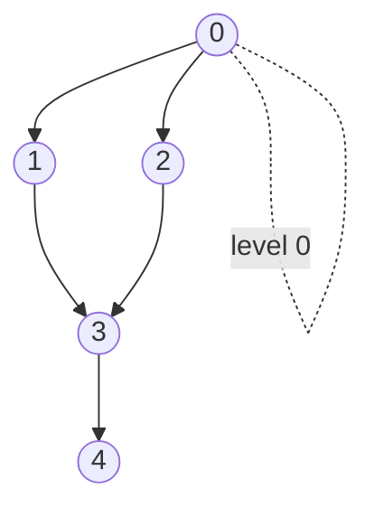
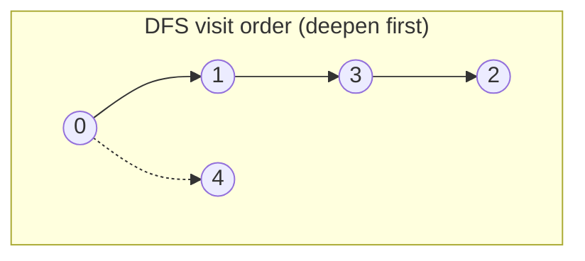
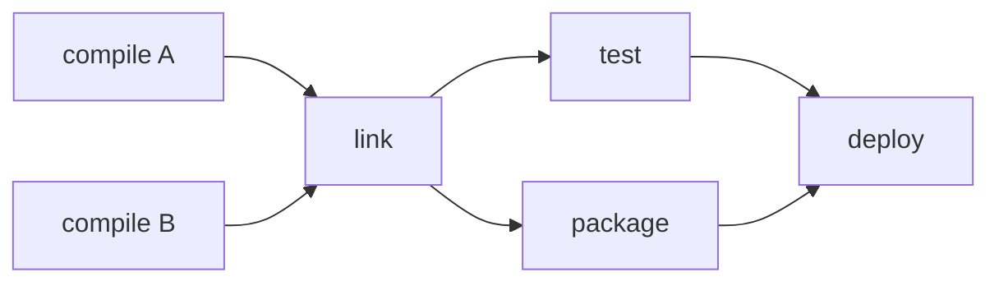

# Graphs: Representations, BFS, DFS & Topological Sort

> A **graph** `G = (V, E)` is a set of vertices connected by edges. It is the most
> general data structure — trees, grids, linked lists, and state machines are all
> special cases — which is why graph reasoning unlocks a huge slice of interview
> problems. This topic covers how to *store* a graph (adjacency list vs matrix vs
> edge list, and their space/time trade-offs), the two workhorse *traversals* (BFS
> and DFS), and **topological sort** for ordering a DAG. Master the traversal
> template once and the same 20 lines solve islands, clone graph, course schedule,
> word ladder, and more — the problem-specific logic is just what you do at each
> node.

## Graph vocabulary and classification

Before choosing a representation you must classify the graph, because it changes the
algorithm:

- **Directed vs undirected** — does an edge `u→v` also imply `v→u`? Undirected edges
  are stored *twice* in an adjacency list (once per endpoint).
- **Weighted vs unweighted** — do edges carry a cost? BFS gives shortest paths only
  when every edge has the *same* weight (treat as weight 1). Weighted shortest path
  needs Dijkstra / Bellman-Ford (see the shortest-path preview below).
- **Cyclic vs acyclic** — a **DAG** (directed acyclic graph) is required for
  topological sort. Cycle detection is a common sub-goal.
- **Connected / connected components** — an undirected graph may split into several
  disjoint pieces; "count components" and "is it one blob" are common asks.
- **Dense vs sparse** — `E ≈ V²` (dense) vs `E ≈ V` (sparse). Most real graphs are
  sparse, which is why the adjacency **list** is the default representation.

Key counts: an undirected graph has at most `V(V-1)/2` edges; a directed graph at most
`V(V-1)`. "Sparse" means `E = O(V)`; "dense" means `E = Θ(V²)`.

> [!KEY-TAKEAWAY]
> Your first two questions on any graph problem: *(1) directed or undirected?*
> *(2) weighted or unweighted?* The answers pick your representation and your
> algorithm (BFS vs Dijkstra vs topo-sort) before you write a line of code.

## Adjacency list — the default representation

An **adjacency list** stores, for each vertex, a container of its neighbors. Concretely
it is an array (or hash map) indexed by vertex, where each entry is a list of adjacent
vertices (and weights, if weighted).

```
Graph (undirected):  0—1, 0—2, 1—2, 2—3

adj = [
  0: [1, 2],
  1: [0, 2],
  2: [0, 1, 3],
  3: [2]
]
```

Memory layout: `V` list headers plus one node per directed edge. Undirected edges
appear twice, so total storage is `O(V + E)` — proportional to the *actual* edges, not
the potential `V²`. This is the win for sparse graphs.

| Operation | Complexity | Note |
|---|---|---|
| Space | `O(V + E)` | Only stores real edges |
| Add edge | `O(1)` | Append to a list |
| Check edge `u→v`? | `O(deg(u))` | Must scan `u`'s neighbor list |
| Iterate neighbors of `u` | `O(deg(u))` | Optimal — visits exactly the neighbors |
| Iterate ALL edges | `O(V + E)` | Basis of BFS/DFS cost |

```python
from collections import defaultdict
adj = defaultdict(list)
def add_edge(u, v, undirected=True):
    adj[u].append(v)
    if undirected:
        adj[v].append(u)
```

The reason BFS/DFS run in `O(V + E)` is precisely this layout: each vertex is dequeued
once (`O(V)`) and each edge is examined once as you scan neighbor lists (`O(E)`).

> [!TIP]
> If vertices are labeled by arbitrary objects (strings, nodes) rather than `0..V-1`,
> use a `HashMap<Node, List<Node>>` as the adjacency list. Interview "clone graph"
> and "word ladder" both use non-integer vertices.

## Adjacency matrix — dense graphs and O(1) edge lookup

An **adjacency matrix** is a `V × V` 2-D array where `M[u][v] = 1` (or the weight) if an
edge `u→v` exists, else `0` (or `∞` for weighted "no edge"). Undirected graphs give a
*symmetric* matrix.

```
     0  1  2  3
  0 [ 0  1  1  0 ]
  1 [ 1  0  1  0 ]
  2 [ 1  1  0  1 ]
  3 [ 0  0  1  0 ]
```

| Operation | Complexity | Note |
|---|---|---|
| Space | `O(V²)` | Independent of edge count — wasteful when sparse |
| Check edge `u→v`? | `O(1)` | Single index lookup — the headline advantage |
| Add / remove edge | `O(1)` | Flip one cell |
| Iterate neighbors of `u` | `O(V)` | Must scan the whole row, even empty cells |
| Iterate ALL edges | `O(V²)` | Slower BFS/DFS: `O(V²)` not `O(V+E)` |

Use a matrix when: the graph is **dense** (`E ≈ V²`), you need frequent `O(1)`
"is there an edge?" queries, or the algorithm is naturally matrix-based (Floyd-Warshall
all-pairs shortest path, transitive closure). Otherwise the `O(V²)` space is a liability
— a 100k-vertex sparse graph needs a 10-billion-cell matrix but only a few million list
entries.

## Adjacency list vs matrix vs edge list

| | Adjacency list | Adjacency matrix | Edge list |
|---|---|---|---|
| Space | `O(V + E)` | `O(V²)` | `O(E)` |
| Edge exists `u→v`? | `O(deg u)` | `O(1)` | `O(E)` |
| Enumerate neighbors of `u` | `O(deg u)` | `O(V)` | `O(E)` |
| Enumerate all edges | `O(V + E)` | `O(V²)` | `O(E)` |
| Best for | sparse (the default) | dense / fast lookup | Kruskal MST, simple input |

An **edge list** is just a list of `(u, v, weight)` tuples. It is the natural *input*
format (many LeetCode problems hand you `edges = [[0,1],[1,2],...]`), and it is what
Kruskal's MST and union-find problems consume directly after sorting by weight. You
usually convert an edge list into an adjacency list as your first step before
traversal.

> [!INTERVIEW]
> A classic verbal question: "You have a social network with 1 billion users but each
> has ~200 friends. List or matrix?" Answer: **adjacency list** — it is sparse
> (`E ≈ 200V ≪ V²`), so the matrix would need `10¹⁸` cells while the list needs
> `~2×10¹¹`. Naming the sparse/dense distinction is what they want to hear.

## BFS — breadth-first search (queue, shortest path in unweighted graphs)

BFS explores level by level: all vertices at distance 1, then distance 2, and so on. It
uses a **FIFO queue** and a **visited set**. Because it expands in rings of increasing
distance, the first time BFS reaches a vertex it has found a **shortest path in edges**
— this is BFS's signature use.

```python
from collections import deque
def bfs(adj, start):
    visited = {start}
    q = deque([start])
    while q:
        u = q.popleft()
        for v in adj[u]:
            if v not in visited:
                visited.add(v)          # mark when ENQUEUING, not dequeuing
                q.append(v)
```

**Complexity:** `O(V + E)` time (each vertex enqueued once, each edge scanned once),
`O(V)` space for the queue + visited set. On an adjacency matrix it degrades to `O(V²)`.

Critical correctness detail: **mark a vertex visited when you enqueue it, not when you
dequeue it.** If you wait until dequeue, the same vertex can be enqueued multiple times
before it is processed, breaking the `O(V+E)` bound and possibly the shortest-path
guarantee. For *distances*, track a `dist[]` array; the level of a node is
`dist[u] + 1` for its unvisited neighbors.

**Worked trace (dist[] fills level by level).** Take the directed graph in the diagram
below — `adj = {0:[1,2], 1:[3], 2:[3], 3:[4]}` — and BFS from `0`:

| Step | Pop | Queue after pop | Newly reached (dist set) |
|---|---|---|---|
| seed | — | `[0]` | `dist[0]=0` |
| 1 | `0` | `[1, 2]` | `dist[1]=1`, `dist[2]=1` |
| 2 | `1` | `[2, 3]` | `dist[3]=2` |
| 3 | `2` | `[3]` | (3 already visited — skip) |
| 4 | `3` | `[4]` | `dist[4]=3` |
| 5 | `4` | `[]` | (no neighbors) |

Final `dist = [0, 1, 1, 2, 3]`. Notice `3` is reached via `1` (dist 2) and the later
edge `2→3` is ignored because `3` was already visited — that "first arrival wins" is
exactly why the first time BFS touches a vertex it holds the shortest edge-count. The
`dist` values are literally the ring numbers: everything at distance 1 (`{1,2}`) is
dequeued before anything at distance 2 (`{3}`).

**Recognition signal for BFS:** "shortest path / fewest steps / minimum moves" in an
**unweighted** graph or grid; "level order"; "spread simultaneously from multiple
sources" (multi-source BFS — seed the queue with *all* sources at distance 0, as in
Rotting Oranges).



> [!WARNING]
> BFS finds shortest paths only when all edges have **equal weight**. With varying
> positive weights you need **Dijkstra** (a priority-queue BFS). With possible negative
> edges, Bellman-Ford. Reaching for plain BFS on a weighted graph is a classic bug.

## DFS — depth-first search (recursion/stack, components, cycles, paths)

DFS goes as deep as possible along one branch before backtracking. It is naturally
recursive (the call stack *is* the stack), or you can use an explicit stack.

```python
def dfs(adj, u, visited):
    visited.add(u)
    for v in adj[u]:
        if v not in visited:
            dfs(adj, v, visited)
```

**Complexity:** `O(V + E)` time, `O(V)` space for the visited set plus recursion stack
(the stack can reach depth `V` in a path-shaped graph — beware stack overflow on huge
graphs, where an iterative stack is safer).

**Iterative DFS (explicit stack).** A common interview ask is "rewrite that recursion
iteratively." The subtlety: mark visited when you *pop* (not when you push), or a vertex
can sit on the stack twice; and to match recursive visit order you must push neighbors in
*reverse* so the first neighbor is popped first (LIFO reverses order).

```python
def dfs_iter(adj, start):
    visited = set()
    stack = [start]
    while stack:
        u = stack.pop()
        if u in visited:            # may have been pushed by two parents
            continue
        visited.add(u)              # mark on POP
        for v in reversed(adj[u]):  # reverse ⇒ same order as recursion
            if v not in visited:
                stack.append(v)
```

On `adj = {0:[1,2], 1:[3], 2:[], 3:[]}` from `0`: push `0`; pop `0`, push `2` then `1`
(reversed) → stack `[2,1]`; pop `1`, push `3` → `[2,3]`; pop `3` → `[2]`; pop `2`. Visit
order `0,1,3,2` — identical to the recursive version. Drop the `reversed()` and you'd get
`0,2,...` instead: still a valid DFS, just a different branch order.

DFS is the tool for:
- **Connected components** — loop over vertices, and each time you hit an unvisited one,
  run a DFS/BFS that floods its whole component; count the launches.
- **Cycle detection** — in a *directed* graph, track three colors
  (white = unvisited, gray = on current recursion stack, black = done); an edge to a
  **gray** node is a back edge → cycle. In an *undirected* graph, a visited neighbor
  that is not the immediate parent means a cycle. (Caveat: the parent check alone breaks
  on **parallel edges** — two edges between `u` and `v` look like a cycle even in a tree —
  and a **self-loop** `u→u` is trivially a cycle the parent check misses; track the
  *edge* used, or an edge id, not just the parent vertex, when those are possible.)
- **Path existence / all paths** — DFS with backtracking enumerates routes.
- **Grid flood fill** — treat each cell as a vertex with up/down/left/right edges.



**BFS vs DFS pick:** need the *shortest* unweighted path or level structure → **BFS**.
Need to explore/enumerate, detect cycles, find components, or do post-order work →
**DFS**. Both are `O(V+E)`; they differ in the *order* of visitation and thus what
guarantees they give.

## Grid as a graph (islands, flood fill)

A 2-D grid is an implicit graph: each cell `(r,c)` is a vertex, and edges connect it to
its 4 (or 8) neighbors. You rarely build an explicit adjacency list — you compute
neighbors on the fly.

```python
DIRS = [(-1,0),(1,0),(0,-1),(0,1)]         # 4-directional
def neighbors(r, c, R, C):
    for dr, dc in DIRS:
        nr, nc = r+dr, c+dc
        if 0 <= nr < R and 0 <= nc < C:     # bounds check = "edge exists?"
            yield nr, nc
```

For an `R×C` grid: `V = R·C`, `E ≈ 2·R·C` (each interior cell has 4 edges, shared), so
BFS/DFS over a grid is `O(R·C)`. "Number of Islands" = count connected components of
land cells. "Rotting Oranges" = multi-source BFS from all rotten oranges at once.
"Flood Fill" = DFS/BFS recolor from a seed. The `visited` set is often the grid itself
(mutate visited land to water, or use a separate boolean matrix).

> [!TIP]
> Multi-source BFS is the grid superpower: seed the queue with *every* source at once
> (all rotten oranges, all gates, all `0`s in "walls and gates"). One BFS then computes
> the min distance from the *nearest* source to every cell — no need to run BFS per
> source.

## Topological sort — ordering a DAG (Kahn's BFS & DFS post-order)

A **topological sort** is a linear ordering of a DAG's vertices such that for every
directed edge `u→v`, `u` comes before `v`. It answers "in what order can I do these
tasks respecting dependencies?" It exists **iff the graph is a DAG** (no cycle) — so
topo-sort also *detects cycles* as a free by-product.

**Recognition signal:** the words **dependencies, prerequisites, ordering, build order,
scheduling, "can you finish all"** on a directed graph. Course Schedule is the canonical
example.

### Kahn's algorithm (BFS with in-degrees)

Compute each vertex's **in-degree** (number of incoming edges). Repeatedly take a vertex
with in-degree 0 (no unmet dependency), append it to the order, and decrement its
neighbors' in-degrees, enqueuing any that hit 0.

```python
from collections import deque
def kahn(adj, V):
    indeg = [0]*V
    for u in range(V):
        for v in adj[u]:
            indeg[v] += 1
    q = deque(u for u in range(V) if indeg[u] == 0)
    order = []
    while q:
        u = q.popleft()
        order.append(u)
        for v in adj[u]:
            indeg[v] -= 1
            if indeg[v] == 0:
                q.append(v)
    return order if len(order) == V else []   # empty ⇒ cycle exists
```

**Cycle test:** if the produced order contains fewer than `V` vertices, some vertices
never reached in-degree 0 — they are stuck in a cycle. This is how Course Schedule I
returns false.

**Worked trace on the build DAG below** (`A→link, B→link, link→test, link→package,
test→deploy, package→deploy`). Initial in-degrees: `A:0, B:0, link:2, test:1,
package:1, deploy:2`. Seed the queue with every in-degree-0 vertex → `[A, B]`.

| Pop | Order so far | Decrements | Newly 0 → enqueue | Queue after |
|---|---|---|---|---|
| `A` | A | link 2→1 | — | `[B]` |
| `B` | A,B | link 1→0 | link | `[link]` |
| `link` | A,B,link | test 1→0, package 1→0 | test, package | `[test, package]` |
| `test` | A,B,link,test | deploy 2→1 | — | `[package]` |
| `package` | A,B,link,test,package | deploy 1→0 | deploy | `[deploy]` |
| `deploy` | A,B,link,test,package,deploy | — | — | `[]` |

Result: `A, B, link, test, package, deploy` (length 6 = V, so no cycle). Where do
alternate valid orders branch? Any moment the queue holds >1 vertex, popping order is a
free choice: `[A,B]` could start `B,A,…`; `[test,package]` could emit `package,test,…`.
All are valid topo orders — the queue captures exactly the "no unmet dependency yet"
frontier.

### DFS post-order (reverse finishing times)

Run DFS; when a vertex *finishes* (all descendants done), push it onto a stack. The
**reverse** of finishing order is a topological order. Cycle detection uses the gray/black
coloring: hitting a gray (on-stack) vertex means a back edge → not a DAG.

```python
def topo_dfs(adj, V):
    WHITE, GRAY, BLACK = 0, 1, 2
    color = [WHITE]*V
    order = []
    def dfs(u):
        color[u] = GRAY
        for v in adj[u]:
            if color[v] == GRAY: raise Exception("cycle")
            if color[v] == WHITE: dfs(v)
        color[u] = BLACK
        order.append(u)          # post-order push
    for u in range(V):
        if color[u] == WHITE: dfs(u)
    return order[::-1]           # reverse
```

**Worked trace on the same build DAG.** Vertices in order `A, B, link, test, package,
deploy`; start DFS at `A`:

```
dfs(A) →  dfs(link) →  dfs(test) →  dfs(deploy)  finishes → push deploy
                                    ← test        finishes → push test
                       dfs(package) [deploy already BLACK, skip] → push package
          ← link       finishes → push link
← A       finishes → push A
dfs(B)    [link already BLACK, skip] → push B
```

Finishing (push) order: `[deploy, test, package, link, A, B]`. **Reverse it** →
`[B, A, link, package, test, deploy]` — a valid topo order (B and A before link, link
before test/package, both before deploy). Why reverse? `deploy` is a sink, so it *finishes
first* (nothing left to recurse into) but must come *last* in the ordering; the deepest-to-
finish is the last dependency, so reversing finish-order puts prerequisites first. Note
this differs from Kahn's `A,B,link,test,package,deploy` yet is equally valid.

**Cycle catch (gray back-edge), tiny example** `0→1→2→0`:

```
dfs(0): color[0]=GRAY;  → dfs(1): color[1]=GRAY; → dfs(2): color[2]=GRAY;
        edge 2→0: color[0]==GRAY  ⇒ back edge ⇒ raise "cycle"
```

`0` is still GRAY (on the recursion stack) when `2→0` is examined — that is the exact
signal of a back edge into an ancestor. A BLACK neighbor (already finished, off the stack)
would be a harmless cross/forward edge, *not* a cycle — which is why two colors are needed,
not one visited flag.

| | Kahn (BFS) | DFS post-order |
|---|---|---|
| Data structure | queue + in-degree array | recursion + color/visited |
| Cycle detection | `len(order) < V` | gray back-edge |
| Time / space | `O(V+E)` / `O(V)` | `O(V+E)` / `O(V)` |
| Feel | iterative, no recursion depth risk | concise, natural for "order II" |
| Gives | order directly | reversed finishing order |

Both are `O(V + E)`. A DAG can have **many** valid topological orders (any linearization
respecting the partial order). Kahn's with a min-heap instead of a plain queue yields the
*lexicographically smallest* order when that's asked.



## Shortest-path preview (weighted graphs)

BFS only handles unit weights. For weighted shortest paths:

- **Dijkstra** — non-negative weights. It's essentially BFS where the queue is a
  **min-heap (priority queue)** keyed by distance, so you always expand the closest
  unfinished vertex. With a binary heap: `O((V + E) log V)`. Signal: weighted graph,
  non-negative edges, single-source shortest path (Network Delay Time).
- **Bellman-Ford** — handles negative edges and detects negative cycles; `O(V·E)`.
- **Floyd-Warshall** — all-pairs shortest path on a matrix; `O(V³)`.
- **0-1 BFS** — edges of weight 0 or 1: use a **deque**, push-front for 0-weight,
  push-back for 1-weight; `O(V + E)`. *Why push-front works:* a 0-weight edge doesn't
  increase distance, so its target belongs at the *current* frontier (front of the deque);
  a 1-weight edge steps to the next level (back). This keeps the deque monotonically
  non-decreasing in distance — a 2-bucket stand-in for Dijkstra's heap, without the
  `log V` factor.

These are covered in depth in the dedicated shortest-path topic; know that "weighted +
non-negative + shortest" ⇒ reach for Dijkstra's heap-based BFS.

> [!KEY-TAKEAWAY]
> Dijkstra = BFS with a priority queue. The moment edge weights differ, swap the FIFO
> queue for a min-heap and process nodes in increasing-distance order. If you ever
> catch yourself running plain BFS on weighted edges, that's the bug.

## Interview Problems

Canonical LeetCode problems drilled by graph representations, BFS, DFS, and topo-sort.
Master the traversal template on these and most graph interviews become mechanical.

**BFS / DFS on grids (flood fill, components):**
- [Number of Islands](https://leetcode.com/problems/number-of-islands/) — Medium — DFS/BFS connected components on a grid
- [Flood Fill](https://leetcode.com/problems/flood-fill/) — Easy — canonical grid DFS/BFS recolor from a seed
- [Max Area of Island](https://leetcode.com/problems/max-area-of-island/) — Medium — DFS component size on a grid
- [Rotting Oranges](https://leetcode.com/problems/rotting-oranges/) — Medium — multi-source BFS for min time to spread
- [Pacific Atlantic Water Flow](https://leetcode.com/problems/pacific-atlantic-water-flow/) — Medium — reverse DFS/BFS from both borders
- [Surrounded Regions](https://leetcode.com/problems/surrounded-regions/) — Medium — DFS from border to protect un-captured cells
- [Walls and Gates](https://leetcode.com/problems/walls-and-gates/) — Medium — multi-source BFS distance to nearest gate

**BFS shortest path (unweighted):**
- [Word Ladder](https://leetcode.com/problems/word-ladder/) — Hard — BFS shortest transformation on an implicit word graph
- [Shortest Path in Binary Matrix](https://leetcode.com/problems/shortest-path-in-binary-matrix/) — Medium — 8-directional grid BFS

**Graph building / DFS traversal:**
- [Clone Graph](https://leetcode.com/problems/clone-graph/) — Medium — DFS/BFS with a visited hash map for copies
- [Number of Connected Components in an Undirected Graph](https://leetcode.com/problems/number-of-connected-components-in-an-undirected-graph/) — Medium — components via DFS or union-find

**Topological sort (dependencies / cycle detection):**
- [Course Schedule](https://leetcode.com/problems/course-schedule/) — Medium — cycle detection via Kahn's / DFS on a DAG
- [Course Schedule II](https://leetcode.com/problems/course-schedule-ii/) — Medium — produce a valid topological order
- [Alien Dictionary](https://leetcode.com/problems/alien-dictionary/) — Hard — build a DAG from order constraints, then topo-sort

**Tree/cycle validation & weighted preview:**
- [Graph Valid Tree](https://leetcode.com/problems/graph-valid-tree/) — Medium — connected + exactly V−1 edges + no cycle
- [Redundant Connection](https://leetcode.com/problems/redundant-connection/) — Medium — union-find (or DFS) to find the cycle-closing edge
- [Network Delay Time](https://leetcode.com/problems/network-delay-time/) — Medium — Dijkstra (heap BFS) single-source shortest path

## Common follow-up questions

- "Why is BFS/DFS `O(V + E)` and not `O(V·E)`?" — Each vertex is processed once and
  each edge is examined once (twice for undirected, still `O(E)`). The visited set
  guarantees no vertex is re-expanded. On a matrix it becomes `O(V²)` because you scan a
  full row per vertex.
- "When would you pick an adjacency matrix over a list?" — Dense graphs, frequent
  `O(1)` edge-existence queries, or matrix algorithms (Floyd-Warshall, transitive
  closure). Otherwise the list's `O(V+E)` space wins.
- "How do you detect a cycle differently in directed vs undirected graphs?" —
  Directed: gray/black DFS coloring, a back edge to a gray (on-stack) node is a cycle; or
  Kahn's producing `< V` nodes. Undirected: a visited neighbor that isn't the parent, or
  union-find where an edge connects two already-joined vertices.
- "Why mark visited on enqueue, not dequeue, in BFS?" — To prevent the same vertex
  being queued multiple times, which breaks the `O(V+E)` bound and can corrupt distances.
- "A DAG has how many topological orders?" — Potentially many; any linear extension
  of the partial order is valid. Use a heap in Kahn's for the lexicographically smallest.
- "BFS found a path but it's not shortest — why?" — The graph is weighted; BFS
  assumes unit weights. Switch to Dijkstra.
- "How do you turn Course Schedule into detecting *which* course causes the deadlock?"
  — After Kahn's, the vertices still with in-degree > 0 are exactly those on cycles.
- "BFS solves Word Ladder — can you make it faster?" — Use **bidirectional BFS**.
  When both the start and target are known and edges are reversible (undirected), run BFS
  alternately from *each* end, always expanding the smaller frontier, and stop when the two
  frontiers meet. Intuition on the cost: a one-directional search to depth `d` with
  branching factor `b` visits `~b^d` nodes; two searches meeting in the middle each go to
  depth `d/2`, so `b^(d/2) + b^(d/2)` — for `b=10, d=6` that's `10⁶` vs `2·10³`, a
  ~500× cut. Requires an explicit target and reversible edges (won't help on a pure
  directed reachability query).

## References

- Cormen, Leiserson, Rivest, Stein — *Introduction to Algorithms* (CLRS), 4th ed.,
  Ch. 20 (Elementary Graph Algorithms: representations, BFS, DFS, topological sort) and
  Ch. 22–24 (shortest paths).
- Sedgewick & Wayne — *Algorithms*, 4th ed., Ch. 4 (Graphs).
- Skiena — *The Algorithm Design Manual*, 2nd ed., Ch. 5 (Graph Traversal).
- Kahn, A. B. (1962), "Topological sorting of large networks," *CACM* 5(11).
- CP-Algorithms — [BFS](https://cp-algorithms.com/graph/breadth-first-search.html),
  [DFS](https://cp-algorithms.com/graph/depth-first-search.html),
  [Topological sort](https://cp-algorithms.com/graph/topological-sort.html).
- Python `collections.deque` docs (O(1) `append`/`popleft` — why it's the BFS queue).
