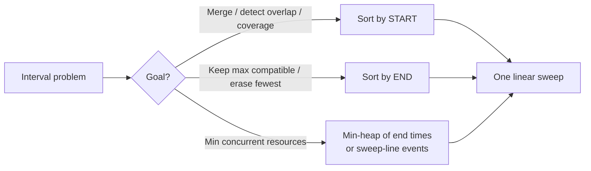
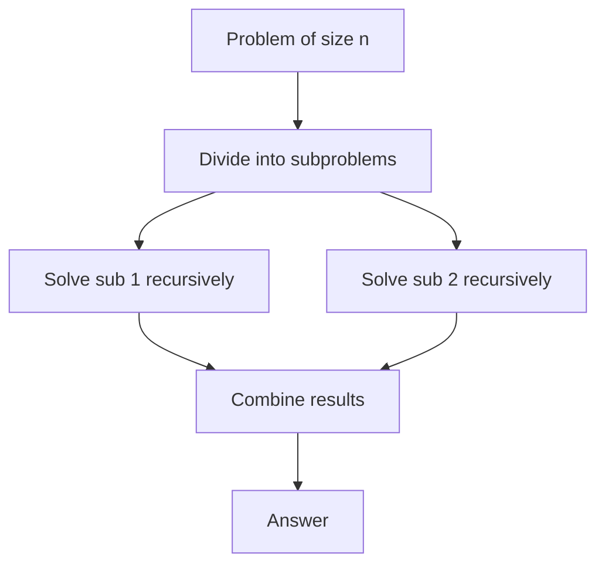

# Greedy, Intervals & Divide-and-Conquer

> Three algorithm-design families that dominate mid-to-senior coding rounds.
> **Greedy** builds a solution by taking the locally optimal choice at each step —
> blazing fast and simple, but *only correct when you can prove it* (greedy-choice
> property + optimal substructure). **Interval problems** are the single most common
> greedy sub-genre: almost all of them reduce to "**sort by start or by end, then
> sweep**." **Divide-and-conquer** splits a problem into independent subproblems,
> solves them recursively, and combines — the engine behind merge sort, quickselect,
> and the `O(n log n)` recurrences you analyze with the Master Theorem. Knowing *when*
> greedy is safe (versus when you must fall back to DP) is a recurring interview
> discriminator.

## Greedy: the greedy-choice property and optimal substructure

A **greedy algorithm** makes an irrevocable, locally optimal choice at each step and
never backtracks. It is correct only when the problem has two properties:

- **Greedy-choice property:** a globally optimal solution can be reached by making a
  locally optimal (greedy) choice. The greedy choice made now is *never* something you
  have to undo later.
- **Optimal substructure:** an optimal solution to the problem contains within it
  optimal solutions to subproblems (the same property DP relies on).

The greedy-choice property is the *extra* thing greedy needs beyond what DP needs. DP
explores choices and keeps the best; greedy commits to one choice up front. That commit
is only safe if you can prove it can't hurt you.

**The general recipe:**
1. Cast the problem as making a sequence of choices.
2. Prove that some greedy choice (usually "pick the smallest/largest/earliest by some
   key") is always part of *an* optimal solution.
3. Show that after making it, the remaining problem is a smaller instance of the same
   problem (optimal substructure).

> [!KEY-TAKEAWAY]
> Greedy = **sort by the right key + make one pass committing to a local choice.**
> The hard part is never the code (it's a few lines); it's *proving the greedy choice
> is safe*. In an interview, always state the greedy choice and give a one-line argument
> for why it works.

## Proving greedy correct: the exchange argument

The standard proof technique is the **exchange argument** (also "greedy stays ahead").

**Exchange argument:** take any optimal solution `OPT`. Show that you can transform it,
one swap at a time, into the greedy solution `G` **without making it worse**. Each swap
replaces a choice in `OPT` with the greedy choice; if the objective never degrades, then
`G` is at least as good as `OPT`, so `G` is also optimal.

**Worked example — Activity Selection (max non-overlapping intervals):** greedy choice is
"always pick the activity that **finishes earliest** among those still compatible."

- *Claim:* the earliest-finishing activity `a` is in some optimal solution.
- *Proof:* let `OPT` be optimal and let `f` be its first-finishing activity. Since `a`
  finishes no later than `f`, swapping `f` for `a` still leaves all later activities
  compatible (they started after `f` finished, hence after `a` finished). The swapped
  solution has the same size — still optimal. So an optimal solution containing `a`
  exists. Recurse on activities starting after `a` finishes. ∎

> [!INTERVIEW]
> You rarely write a full proof on the whiteboard, but interviewers *love* to ask
> "why does picking the earliest finish time work?" The exchange argument — "swapping the
> optimal's first choice for the earliest-finishing one never loses anything" — is the
> answer they want.

## Greedy vs Dynamic Programming: when greedy fails

Greedy and DP both need optimal substructure. The difference: **greedy commits to one
choice; DP considers all choices and memoizes.** When the greedy-choice property does
*not* hold, greedy gives a wrong answer and you must use DP (or search).

**Classic failure — coin change.** With US coins {1, 5, 10, 25}, greedy (take the largest
coin ≤ remaining) is optimal. But with coins {1, 3, 4} and target 6, greedy takes
`4 + 1 + 1 = 3` coins, while optimal is `3 + 3 = 2` coins. Greedy fails because taking the
largest coin isn't always part of an optimal solution → use DP.

**0/1 knapsack** is the canonical greedy-fails case: taking the highest value/weight ratio
item first can be suboptimal because you can't take fractions. **Fractional knapsack**, by
contrast, *is* greedy-solvable (take highest ratio, split the last item).

| Aspect | Greedy | Dynamic Programming |
|---|---|---|
| Choice model | One locally optimal choice, committed | Try all choices, keep best |
| Needs | Greedy-choice property + optimal substructure | Optimal substructure + overlapping subproblems |
| Speed | Usually `O(n)` or `O(n log n)` | Often `O(n·W)`, `O(n²)`, etc. |
| Correctness | Must **prove** greedy choice safe | Correct whenever substructure holds |
| Examples | Activity selection, Huffman, Dijkstra, MST | Coin change (general), 0/1 knapsack, edit distance |

> [!WARNING]
> "Greedy feels right" is not a proof. If you can't argue the greedy-choice property,
> assume greedy is wrong and reach for DP. Many interview traps (coin change, jump-game
> variants scored by cost) are DP problems dressed up to look greedy.

## Interval pattern: sort, then sweep

The unifying interview insight: **almost every interval problem is solved by sorting the
intervals (by start OR by end) and doing one linear sweep.** Choosing the sort key is the
whole game.

**Sort by END time** when you want to *keep the maximum number of compatible intervals* or
*remove the fewest* — the earliest-finishing interval leaves the most room (activity
selection, non-overlapping intervals).

**Sort by START time** when you want to *merge*, *detect any overlap*, or *reason about
coverage left-to-right* (merge intervals, insert interval, meeting rooms).

```text
Overlap test for two intervals [a1,a2] and [b1,b2] (after sorting so a1 <= b1):
    they overlap  ⟺  b1 < a2        (or <= a2 if touching endpoints count as overlap)
```

### Merge Intervals

Sort by start. Walk through; keep a `current` merged interval. If the next interval's
start ≤ `current.end`, extend `current.end = max(current.end, next.end)`; otherwise push
`current` and start a new one. `O(n log n)` (sort dominates), `O(n)` output.

```python
def merge(intervals):
    intervals.sort(key=lambda x: x[0])
    out = []
    for s, e in intervals:
        if out and s <= out[-1][1]:
            out[-1][1] = max(out[-1][1], e)   # overlap → extend
        else:
            out.append([s, e])
    return out
```

### Non-overlapping Intervals (erase the fewest)

Sort by **end**. Greedily keep an interval if it starts at or after the last kept
interval's end; otherwise it must be erased. Count the erasures. This is activity
selection in disguise — earliest finish leaves the most room. `O(n log n)`.

### Meeting Rooms I & II

- **Meeting Rooms I** ("can one person attend all?"): sort by start; if any meeting starts
  before the previous ends, return false. `O(n log n)`.
- **Meeting Rooms II** ("minimum rooms needed"): the max number of concurrently overlapping
  meetings. Two idiomatic solutions:

  1. **Min-heap of end times:** sort by start; for each meeting, if the earliest-ending
     room (heap top) is free by its start, reuse it (pop); always push the current end.
     Heap size = rooms in use; answer = max heap size. `O(n log n)`.
  2. **Sweep line / chronological events:** create `+1` at each start and `-1` at each end,
     sort all events, sweep accumulating a running count; the peak is the answer.



> [!TIP]
> For "minimum rooms / max concurrent X / CPU intervals" problems, the min-heap-of-ends
> and the sweep-line-of-events approaches are interchangeable. The sweep line is often the
> cleanest to reason about: "+1 on start, −1 on end, track the running max."

## Divide-and-conquer: split, solve, combine

**Divide-and-conquer (D&C)** solves a problem by:
1. **Divide** the input into independent subproblems (usually halves).
2. **Conquer** each subproblem recursively.
3. **Combine** the sub-solutions into the full answer.

The cost is captured by a recurrence `T(n) = a·T(n/b) + f(n)`, where `a` = number of
subcalls, `n/b` = subproblem size, and `f(n)` = divide+combine work.

**Master Theorem** (compare `f(n)` to `n^(log_b a)`):

| Case | Condition | Result |
|---|---|---|
| 1 | `f(n) = O(n^(log_b a − ε))` | `T(n) = Θ(n^(log_b a))` |
| 2 | `f(n) = Θ(n^(log_b a))` | `T(n) = Θ(n^(log_b a) · log n)` |
| 3 | `f(n) = Ω(n^(log_b a + ε))` (+ regularity) | `T(n) = Θ(f(n))` |

- **Merge sort:** `T(n) = 2T(n/2) + O(n)` → Case 2 → `Θ(n log n)`. Combine = merge two
  sorted halves. Stable; `O(n)` extra space.
- **Binary search:** `T(n) = T(n/2) + O(1)` → `Θ(log n)`.
- **Karatsuba multiplication:** `T(n) = 3T(n/2) + O(n)` → `Θ(n^log2(3)) ≈ Θ(n^1.585)`.



### Quickselect (k-th smallest in average O(n))

Partition around a pivot (like quicksort), but recurse into **only one side** — the side
containing rank `k`. Average `T(n) = T(n/2) + O(n) = O(n)`; worst case `O(n²)` with bad
pivots (mitigated by random pivot or median-of-medians for guaranteed `O(n)`).

### Maximum Subarray — D&C vs greedy (Kadane)

- **D&C:** best subarray is entirely in the left half, entirely in the right half, or
  **crosses the midpoint**. Compute all three; the crossing sum is a linear scan outward
  from the middle. `T(n) = 2T(n/2) + O(n) = O(n log n)`.
- **Kadane (DP/greedy):** `curr = max(x, curr + x)`; track the running max. `O(n)`, `O(1)`.
  In interviews, mention D&C to show breadth but code Kadane — it's strictly better.

### Majority Element (Boyer–Moore vs D&C)

- **D&C:** the majority of the whole array must be the majority of the left half or the
  right half; recurse and count. `O(n log n)`.
- **Boyer–Moore voting:** keep a `candidate` and a `count`; increment on match, decrement
  otherwise, swap candidate when count hits 0. `O(n)`, `O(1)` — the intended answer.

> [!KEY-TAKEAWAY]
> For max-subarray and majority-element, D&C is the "textbook" solution but a linear
> greedy/DP scan (Kadane, Boyer–Moore) beats it. Interviewers often want you to *recognize*
> the D&C framing and then produce the `O(n)` improvement.

## Worked example: Jump Game I and II (greedy)

**Jump Game I** ("can you reach the last index?", `nums[i]` = max jump from `i`): track the
**farthest reachable index** as you sweep. If your current index ever exceeds `farthest`,
you're stuck → false. Otherwise update `farthest = max(farthest, i + nums[i])`. `O(n)`.

**Jump Game II** ("minimum jumps to reach the end"): a greedy BFS-by-levels. Track the end
of the current jump's reach (`curEnd`) and the farthest reachable (`farthest`). When `i`
reaches `curEnd`, you must take another jump, so `jumps++` and `curEnd = farthest`. `O(n)`.

```python
def jump(nums):
    jumps = curEnd = farthest = 0
    for i in range(len(nums) - 1):        # no need to jump from the last index
        farthest = max(farthest, i + nums[i])
        if i == curEnd:                   # ran out of the current jump's range
            jumps += 1
            curEnd = farthest
    return jumps
```

Why greedy is safe here: within the reach of the current jump, the best next move is the
one that extends `farthest` the most — and you never need to jump *before* you must, so
committing one jump per "level" is optimal (a BFS shortest-path argument on the implicit
reachability graph).

## Interview Problems

Greedy and interval problems, grouped by sub-pattern.

**Intervals (sort + sweep):**
- [Merge Intervals](https://leetcode.com/problems/merge-intervals/) — Medium — sort by start, extend the current merged interval
- [Insert Interval](https://leetcode.com/problems/insert-interval/) — Medium — sweep and merge the new interval into a sorted list
- [Non-overlapping Intervals](https://leetcode.com/problems/non-overlapping-intervals/) — Medium — sort by end, greedily keep earliest-finishing (activity selection)
- [Meeting Rooms II](https://leetcode.com/problems/meeting-rooms-ii/) — Medium — min-heap of end times / sweep-line for max concurrency
- [Minimum Number of Arrows to Burst Balloons](https://leetcode.com/problems/minimum-number-of-arrows-to-burst-balloons/) — Medium — sort by end, greedy interval intersection

**Greedy (prove the choice):**
- [Jump Game](https://leetcode.com/problems/jump-game/) — Medium — track farthest reachable index
- [Jump Game II](https://leetcode.com/problems/jump-game-ii/) — Medium — greedy BFS-by-levels for min jumps
- [Gas Station](https://leetcode.com/problems/gas-station/) — Medium — single pass; reset start when running total goes negative
- [Task Scheduler](https://leetcode.com/problems/task-scheduler/) — Medium — greedy on most-frequent task + idle-slot formula
- [Partition Labels](https://leetcode.com/problems/partition-labels/) — Medium — greedy on last-occurrence index
- [Candy](https://leetcode.com/problems/candy/) — Hard — two greedy passes (left-to-right, right-to-left)
- [Best Time to Buy and Sell Stock II](https://leetcode.com/problems/best-time-to-buy-and-sell-stock-ii/) — Medium — greedily sum every upward step

**Divide-and-conquer / selection:**
- [Maximum Subarray](https://leetcode.com/problems/maximum-subarray/) — Medium — Kadane (greedy/DP) or D&C crossing-sum
- [Sort an Array](https://leetcode.com/problems/sort-an-array/) — Medium — implement merge sort / quicksort
- [Kth Largest Element in an Array](https://leetcode.com/problems/kth-largest-element-in-an-array/) — Medium — quickselect (D&C into one side)
- [Majority Element](https://leetcode.com/problems/majority-element/) — Easy — Boyer–Moore voting or D&C

## Common follow-up questions

- **"How do you know greedy is correct here?"** — State the greedy choice, then give the
  exchange argument: swapping the optimal solution's first choice for the greedy choice
  never makes it worse.
- **"When would greedy fail and you'd need DP?"** — When the greedy-choice property fails,
  e.g. general coin change {1,3,4} or 0/1 knapsack; local optima don't compose into a
  global optimum, so you must consider all choices (DP).
- **"Merge intervals: sort by start or end?"** — Start, so overlaps are adjacent and you
  extend the running interval. For "keep max compatible / erase fewest," sort by end.
- **"Meeting Rooms II without a heap?"** — Sweep line: `+1` at each start, `−1` at each
  end, sort events, track the running max = peak concurrency.
- **"Max subarray: D&C vs Kadane?"** — D&C is `O(n log n)` (left, right, crossing); Kadane
  is `O(n)` / `O(1)` and is the preferred answer.
- **"Why does quickselect average `O(n)` but quicksort `O(n log n)`?"** — Quickselect
  recurses into only one partition (`T(n)=T(n/2)+O(n)` geometric = `O(n)`); quicksort
  recurses into both.
- **"Give the merge-sort recurrence and solve it."** — `T(n)=2T(n/2)+O(n)`; Master Theorem
  Case 2 → `Θ(n log n)`.

## References

- Cormen, Leiserson, Rivest, Stein — *Introduction to Algorithms* (CLRS), 3rd/4th ed.:
  Ch. 4 (Divide-and-Conquer, Master Theorem, max-subarray), Ch. 15 (Greedy: activity
  selection, greedy-choice property, exchange argument, Huffman), Ch. 9 (Medians/Order
  Statistics: quickselect, median-of-medians).
- Kleinberg & Tardos — *Algorithm Design*, Ch. 4 (Greedy: "greedy stays ahead" and
  exchange arguments, interval scheduling).
- Sedgewick & Wayne — *Algorithms*, 4th ed.: merge sort, quicksort/quickselect.
- Competitive Programming canon (CP-Algorithms, *Competitive Programmer's Handbook* by
  Antti Laaksonen): sweep-line, interval scheduling, Boyer–Moore majority vote.
- LeetCode problem set — Intervals and Greedy tags (linked above).
