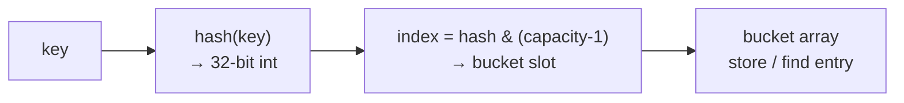
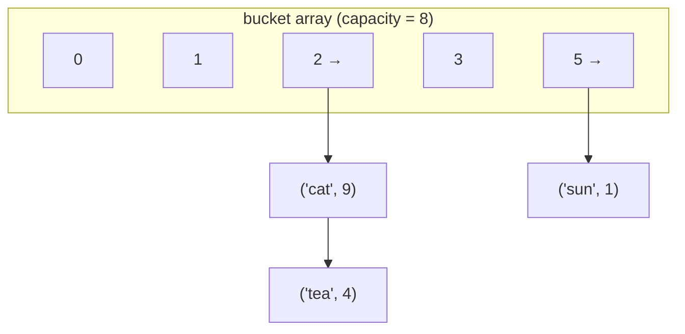
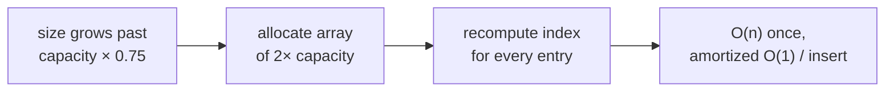

# Hash Tables: HashMap & HashSet Internals

A hash table trades memory for speed: it gives you **O(1) average** insert, lookup,
and delete by turning a key into an array index. It is the single most important
data structure in coding interviews — Two Sum, LRU Cache, Group Anagrams, and
countless "have I seen this before?" problems collapse to O(n) once you reach for a
hash map. But the O(1) is *average*, not guaranteed, and knowing *why* (and when it
degrades to O(n)) is exactly what separates a memorized API user from someone who
understands the structure.

This note leads with the internals — buckets, hash functions, collision resolution,
load factor, resize — then covers the JDK/Python built-ins, the `hashCode`/`equals`
contract, ordered/sorted variants, and the classic interview problems.

## How a hash table works under the hood

The core idea is a three-step pipeline:



1. **Backing array of buckets.** A hash table is fundamentally a contiguous array
   (`capacity` slots, always a power of two in Java). Each slot is a "bucket."
2. **Hash function.** `hash(key)` maps an arbitrary key to a 32-bit integer. A good
   hash spreads keys uniformly so different keys land in different buckets.
3. **Index reduction.** The hash is reduced to a valid array index. Java uses
   `hash & (capacity - 1)` (fast bitmask, valid because capacity is a power of two);
   the generic form is `hash % capacity`.
4. **Collision resolution.** Two distinct keys can map to the same bucket. The table
   needs a strategy to store both — chaining or open addressing (below).

Storing a key-value pair (`put`): compute index, walk the bucket, if a key `equals`
an existing entry overwrite its value, else append a new entry. Lookup (`get`):
compute index, walk the bucket comparing with `equals`, return the match or "absent."

> [!KEY-TAKEAWAY]
> A hash table = **array + hash function + collision strategy + resize policy.** All
> four together give amortized O(1). Remove any one (e.g. a terrible hash that funnels
> everything into one bucket) and you fall back to O(n).

## The hash function and index reduction

The hash function must be **deterministic** (same key → same hash every time) and
**well-distributed** (spreads keys across the whole range). In Java, `Object.hashCode()`
returns an `int`; `HashMap` then applies a *supplemental* mix to defend against weak
hashes:

```java
static final int hash(Object key) {
    int h;
    // XOR the high 16 bits into the low 16 so the high bits also
    // influence the bucket index (which uses only the low bits).
    return (key == null) ? 0 : (h = key.hashCode()) ^ (h >>> 16);
}
// index into the table:
int index = (capacity - 1) & hash;   // capacity is a power of two
```

Why the `h ^ (h >>> 16)` spread? Because the index is `hash & (capacity-1)`, and for a
small capacity only the *low* bits of the hash matter. If two keys differ only in their
high bits they would always collide. XOR-ing the high bits down mixes them in cheaply.

**Worked example — hash a real key into a bucket (and force a collision).** Take a
`HashMap` at the default `capacity = 16`, so the index mask is `capacity - 1 = 15`
(binary `0000 1111`). Insert `"cat"`:

- `"cat".hashCode()` in Java = `((('c'*31)+'a')*31)+'t'` = `((99*31+97)*31)+116` =
  `3166*31 + 116` = **98262**.
- Spread: `98262 >>> 16 = 1`, so `hash = 98262 ^ 1 = 98263`.
- Index: `98263 & 15` → `98263 = 6141*16 + 7`, so the low nibble is `7` → **bucket 7**.

Now insert `"sat"`:

- `"sat".hashCode()` = `((115*31+97)*31)+116` = `3662*31 + 116` = **113638**.
- Spread: `113638 >>> 16 = 1`, so `hash = 113638 ^ 1 = 113639`.
- Index: `113639 & 15` → `113639 = 7102*16 + 7` → **bucket 7** again.

`"cat"` and `"sat"` **collide**: both land in bucket 7. With separate chaining (below),
bucket 7 becomes a two-node list `("cat") → ("sat")`, and a `get("sat")` walks that list
comparing with `equals` until it finds the match.

> [!TIP]
> `hash % capacity` and `hash & (capacity-1)` are equivalent **only** when capacity is a
> power of two. That is precisely why Java rounds requested capacities up to the next
> power of two — it lets it use the much faster bitmask instead of a modulo.

## Collision resolution: separate chaining

With **separate chaining**, each bucket holds a secondary container of all entries that
hashed there. Java `HashMap` uses this strategy.



- Each bucket starts as a **singly linked list** of `Node(hash, key, value, next)`.
- `get`/`put` walk the list, comparing with `equals`.
- **Java 8 treeification:** when a single bucket's chain grows to **8 nodes** (`TREEIFY_THRESHOLD`)
  *and* the table capacity is ≥ 64, that bucket converts from a linked list into a
  **red-black tree**, so worst-case lookup within a degenerate bucket drops from O(n) to
  **O(log n)**. It untreeifies back to a list if the bucket shrinks to ≤ 6 (`UNTREEIFY_THRESHOLD`).
  This is a defense against hash-collision (hash-flooding) attacks.

| Chaining property | Value |
|---|---|
| Extra memory per entry | node/pointer overhead |
| Load factor can exceed 1.0? | Yes (buckets just get longer) |
| Delete | Easy — unlink the node, no tombstones |
| Worst case (all collide, no tree) | O(n) per op |
| Worst case (Java 8 treeified bucket) | O(log n) per op |

## Collision resolution: open addressing

With **open addressing**, all entries live *directly in the bucket array* — no
secondary lists. On collision, you **probe** for the next free slot by a rule. Python's
`dict`/`set` and many high-performance maps use open addressing (better cache locality,
no per-node pointer overhead).

- **Linear probing:** try `index, index+1, index+2, …` (mod capacity). Simple, cache
  friendly, but suffers **primary clustering** (runs of full slots grow and merge).
- **Quadratic probing:** try `index + 1², index + 2², …` — reduces primary clustering
  but has secondary clustering.
- **Double hashing:** step size is a second hash of the key — best distribution.
- **Robin Hood hashing:** on insert, the entry that has probed farther from its "home"
  slot steals the slot from one that is closer, evening out probe lengths.

> [!TIP]
> CPython's `dict` since 3.6 uses a **compact layout**: a sparse *index array* (holding
> positions) plus a dense, append-only *entries array* (the actual key/hash/value rows).
> Probing happens over the small index array (open addressing), but iteration walks the
> dense entries array in insertion order — which is why **dict insertion order is a
> guaranteed language feature since Python 3.7**. The compact design also cut dict memory
> by ~20–25%.

**Deletion needs tombstones.** You cannot just empty a slot, because a later slot in a
probe sequence would become unreachable (lookup stops at the first empty slot). Instead
you mark the slot as a **tombstone** (deleted-but-occupied) so probing continues past
it. Too many tombstones → periodic rehash to clean them out.

| | Separate chaining | Open addressing |
|---|---|---|
| Where entries live | External lists per bucket | Inside the array |
| Cache locality | Worse (pointer chasing) | Better (contiguous) |
| Load factor ceiling | > 1 tolerated | Must stay < 1 (typically ≤ 0.7) |
| Deletion | Trivial (unlink) | Needs tombstones |
| Clustering issues | None | Primary/secondary clustering |
| Used by | Java `HashMap` | Python `dict`, many C++/Rust maps |

## Load factor, resize and rehash

The **load factor** `α = size / capacity` measures how full the table is. As it rises,
buckets get longer (chaining) or probe sequences lengthen (open addressing), degrading
performance. To keep `α` bounded, the table **resizes**:

- Java `HashMap` default load factor is **0.75**. When `size > capacity * 0.75`, the
  table **doubles** capacity (16 → 32 → 64 …) and **rehashes** every entry into the new,
  larger array.
- 0.75 is a deliberate time/space trade-off: low enough to keep collision chains short,
  high enough not to waste too much memory.
- **Rehash is O(n)** for that one resize (every entry is re-placed). But because capacity
  *doubles*, resizes happen geometrically less often, so the cost **amortizes to O(1)**
  per insertion (same argument as a dynamic array / `ArrayList`).



**Worked example — trace a resize.** Start `capacity = 16`, `load factor = 0.75`, so
`threshold = 16 × 0.75 = 12`. Insert entries 1 through 12: each fits, `size` reaches 12,
still `≤ threshold`, no resize. Insert the **13th** entry: now `size = 13 > 12`, so the
table doubles to `capacity = 32` and rehashes all 13 entries into the bigger array.

Watch the Java 8 "one extra bit" trick decide where our two colliding keys go. The new
mask is `capacity - 1 = 31` (binary `0001 1111`) — one bit wider than before. The deciding
bit is `oldCapacity = 16` (`0001 0000`):

- `"cat"` had `hash = 98263`. `98263 & 16` → `98263 = 6141*16 + 7`, and `6141` is odd, so
  bit-4 is `1` → `98263 & 16 = 16 ≠ 0`. So `"cat"` **moves** from index 7 to
  `7 + oldCapacity = 7 + 16 =` **23** (and indeed `98263 & 31 = 23`).
- `"sat"` had `hash = 113639`. `113639 & 16`: `113639 = 7102*16 + 7`, and `7102` is even,
  so bit-4 is `0` → `113639 & 16 = 0`. So `"sat"` **stays** at index 7 (`113639 & 31 = 7`).

The collision is resolved for free: after doubling, `"cat"` and `"sat"` no longer share a
bucket, and no entry needed a full modulo recompute — each just checked one bit.

> [!WARNING]
> Rehashing is why a single `put` can occasionally take O(n): the resize it triggers
> touches every element. In latency-sensitive code, **pre-size** the map
> (`new HashMap<>(expectedSize / 0.75 + 1)`) to avoid mid-flight resizes. Note the
> int-arg constructor sets *initial capacity*, and HashMap rounds it **up to the next
> power of two** (`tableSizeFor`), so the exact formula matters less than "ask for
> capacity ≥ expectedSize / 0.75." E.g. for 100 entries, `100/0.75 ≈ 133.3` rounds up to
> 256, giving threshold `256 × 0.75 = 192 ≥ 100` — no resize. Java 19+ added
> `HashMap.newHashMap(int numMappings)`, which does this sizing correctly for you.

> [!TIP]
> Java 8 optimizes rehash: because capacity doubles, each entry either stays at index `i`
> or moves to `i + oldCapacity`, decided by one extra bit of its hash. No full modulo
> recompute is needed, and chains don't need to be fully rebuilt.

## Why O(1) average but O(n) worst

| Operation | Average | Worst case | Why |
|---|---|---|---|
| `get` / lookup | O(1) | O(n) | Avg: uniform hashing → short buckets. Worst: all keys collide into one bucket (untreeified). |
| `put` / insert | O(1) amortized | O(n) | Worst = a collision chain of length n, or a resize/rehash pass. |
| `remove` | O(1) | O(n) | Same collision-chain reasoning. |
| Iterate all | O(n + capacity) | O(n + capacity) | Must scan every bucket slot, empty or not. |
| Space | O(n) | O(n) | Plus unused capacity slack (~n/α extra slots). |

The **average** case assumes **simple uniform hashing**: each key is equally likely to
land in any bucket. Then the expected bucket length is the load factor `α`, a constant,
so each operation touches O(1 + α) = O(1) entries.

The **worst** case happens when the hash function is bad or an adversary crafts keys that
all hash to the same bucket — every operation degrades to a linear scan of one giant
chain. Java 8's red-black-tree treeification caps this at **O(log n)** per bucket, which
is why it exists.

## The hashCode and equals contract and immutability

Correctness depends on a strict contract between `hashCode()` and `equals()`:

1. **Consistency:** if `a.equals(b)` is true, then `a.hashCode() == b.hashCode()` **must**
   be true. (The reverse is not required — unequal objects *may* share a hash code; that's
   just a collision.)
2. `hashCode()` must return the same value across calls while the object's `equals`-relevant
   state is unchanged.

Why it matters: `put` finds the bucket via `hashCode`, then confirms the exact key via
`equals`. If you override `equals` but **not** `hashCode`, two "equal" keys can hash to
different buckets — you'll store duplicates and `get` will miss.

> [!WARNING]
> **Never mutate a key's `equals`/`hashCode`-relevant fields while it's in a map.** If a
> key's hash changes after insertion, it now lives in the "wrong" bucket: `get(key)`
> computes the new index and looks in the wrong place, so the entry becomes **unreachable
> and un-removable** — a silent leak. This is why immutable keys (`String`, boxed
> primitives, records with final fields) are strongly preferred.

```java
// Correct co-implementation for a key class:
record Point(int x, int y) {}   // record auto-generates consistent equals + hashCode
// or manually:
@Override public int hashCode() { return Objects.hash(x, y); }
@Override public boolean equals(Object o) { /* compare x, y */ }
```

> [!INTERVIEW]
> **Null keys/values — a classic "what's the difference" probe.** `HashMap` allows
> **exactly one null key** and **any number of null values**. The null key bypasses
> `hashCode()` entirely (the `hash()` method returns `0`), so it always lives in
> **bucket 0**. By contrast, `Hashtable` and `ConcurrentHashMap` **throw
> `NullPointerException`** on a null key *or* value. The reason for the concurrent ban:
> `map.get(k)` returning `null` would be ambiguous — it can't distinguish "key absent"
> from "key mapped to null" without a second `containsKey` call, which isn't atomic under
> concurrency, so the API forbids null outright.

## HashSet is a HashMap with a dummy value

A `HashSet` is not a separate structure — Java implements it as a thin wrapper around a
`HashMap` where every key maps to the **same dummy sentinel value**:

```java
// From java.util.HashSet:
private transient HashMap<E,Object> map;
private static final Object PRESENT = new Object();   // the dummy value

public boolean add(E e)      { return map.put(e, PRESENT) == null; }
public boolean contains(Object o) { return map.containsKey(o); }
public boolean remove(Object o)   { return map.remove(o) == PRESENT; }
```

So a set gets exactly the HashMap complexity profile (O(1) average `add`/`contains`/`remove`)
and the same load-factor/resize behavior. `LinkedHashSet` and `TreeSet` similarly wrap
`LinkedHashMap` and `TreeMap`.

## Ordered and sorted variants LinkedHashMap and TreeMap

Plain `HashMap` iteration order is **unspecified and unstable** — it depends on hash
values and capacity, and can change across resizes or JVM versions. Never rely on it.
When order matters, use a variant:

| Map type | Underlying structure | Ordering | get/put/remove | Notes |
|---|---|---|---|---|
| `HashMap` | array + chaining/tree | **none (arbitrary)** | O(1) avg | fastest general map |
| `LinkedHashMap` | HashMap + doubly linked list threading entries | **insertion order** (or access order) | O(1) avg | access-order mode → building block for **LRU cache** |
| `TreeMap` | red-black tree (`NavigableMap`) | **sorted by key** | **O(log n)** | range queries: `floorKey`, `ceilingKey`, `subMap` |

- `LinkedHashMap` maintains a linked list across all entries → predictable iteration.
  With `accessOrder=true` and an overridden `removeEldestEntry`, it *is* an LRU cache in a
  few lines.
- `TreeMap` gives sorted iteration and range/nearest-key operations, at the cost of
  O(log n) per op (it's a balanced BST, not a hash table). Reach for it when you need
  ordering or `floor`/`ceiling`, not raw speed.

## Hash flooding (algorithmic complexity attacks)

If an attacker knows your hash function, they can craft many keys that all hash to the
**same bucket**, forcing every insert into an O(n) chain walk — turning an n-insert
workload into O(n²) and DoS-ing the server (classic against web frameworks parsing
untrusted query params / JSON into maps).

Defenses:
- **Treeification** (Java 8): degenerate buckets become red-black trees → O(log n), not O(n).
- **Randomized/keyed hashing:** Python randomizes string/bytes hashing per-process
  (on by default since 3.3, controllable via `PYTHONHASHSEED`; the keyed SipHash
  algorithm landed in 3.4 via PEP 456), so an attacker can't precompute colliding keys.
- Don't build hash maps directly from untrusted input at unbounded size without limits.

## Thread-safety and ConcurrentHashMap

`HashMap` is **not thread-safe** — it does zero synchronization. Concurrent writes can
corrupt it in ways that go far beyond a lost update:

- **Java 7 resize infinite loop.** In Java 7, resize rehashed each chain by *prepending*
  nodes (order-reversing). If two threads resized the same bucket at once, the
  `next`-pointer rewrites could interleave into a **circular linked list** — a later
  `get` on that bucket then spins forever at 100% CPU. Java 8's resize preserves node
  order using the lo/hi split (the "one extra bit" trick above), which removes *this*
  specific cycle, but concurrent puts can **still** lose entries, resurrect stale data, or
  see a half-built table. HashMap remains unsafe under concurrency — Java 8 just made the
  failure less catastrophic.
- **Fail-fast iterators.** Every structural modification bumps an internal `modCount`.
  An iterator snapshots `modCount` at creation and checks it each `next()`; a mismatch
  throws `ConcurrentModificationException`. This is a **best-effort bug detector**, not a
  concurrency guarantee — it also fires on single-threaded modification during iteration.

Your options for concurrent access:

| Choice | Locking | Notes |
|---|---|---|
| `Collections.synchronizedMap(map)` | one **coarse** lock around every method | simple, but serializes all access → contention; compound ops (`get`-then-`put`) still need external sync |
| `ConcurrentHashMap` | **per-bin** CAS + `synchronized` on the head node (Java 8; no `Segment` striping anymore) | high concurrency, **weakly-consistent** iterators (never throw CME, may miss/see concurrent updates), **no null keys or values** |

**When to use which:** reach for `ConcurrentHashMap` for genuine concurrent maps (caches,
counters via `merge`/`computeIfAbsent`); use `synchronizedMap` only for a quick wrapper on
a legacy map with low contention; use plain `HashMap` when access is single-threaded or
externally confined (e.g. thread-local, or fully built then published safely as read-only).

## Interview Problems

The unifying signal for reaching for a hash map: **"have I seen this / how many times /
what's the complement / group by a key"** — anything needing O(1) membership, counting,
or complement lookup to beat an O(n²) brute force.

Easy:
- [Two Sum](https://leetcode.com/problems/two-sum/) — Easy — hash map of value→index for O(n) complement lookup
- [Contains Duplicate](https://leetcode.com/problems/contains-duplicate/) — Easy — HashSet membership test
- [Valid Anagram](https://leetcode.com/problems/valid-anagram/) — Easy — char-count hash map (or frequency array)
- [First Unique Character in a String](https://leetcode.com/problems/first-unique-character-in-a-string/) — Easy — frequency map then first count==1
- [Intersection of Two Arrays](https://leetcode.com/problems/intersection-of-two-arrays/) — Easy — HashSet intersection
- [Single Number](https://leetcode.com/problems/single-number/) — Easy — hash set/XOR counting
- [Majority Element](https://leetcode.com/problems/majority-element/) — Easy — count map (or Boyer-Moore)

Medium:
- [Group Anagrams](https://leetcode.com/problems/group-anagrams/) — Medium — hash map keyed by sorted string / char-count signature
- [Subarray Sum Equals K](https://leetcode.com/problems/subarray-sum-equals-k/) — Medium — prefix-sum count map
- [Top K Frequent Elements](https://leetcode.com/problems/top-k-frequent-elements/) — Medium — frequency map + bucket/heap
- [Longest Consecutive Sequence](https://leetcode.com/problems/longest-consecutive-sequence/) — Medium — HashSet for O(1) neighbor checks, O(n) total
- [Longest Substring Without Repeating Characters](https://leetcode.com/problems/longest-substring-without-repeating-characters/) — Medium — sliding window + last-seen index map
- [Insert Delete GetRandom O(1)](https://leetcode.com/problems/insert-delete-getrandom-o1/) — Medium — hash map (value→index) + array for random access
- [LRU Cache](https://leetcode.com/problems/lru-cache/) — Medium — hash map + doubly linked list (or LinkedHashMap access-order)
- [4Sum II](https://leetcode.com/problems/4sum-ii/) — Medium — map of pair-sums to collapse O(n⁴)→O(n²)

Hard:
- [LFU Cache](https://leetcode.com/problems/lfu-cache/) — Hard — two hash maps + frequency buckets of linked lists
- [First Missing Positive](https://leetcode.com/problems/first-missing-positive/) — Hard — hashing into the array itself (index-as-hash)

### Worked trace — Two Sum

`nums = [2, 7, 11, 15]`, `target = 9`. Keep a map of `value → index`; for each element,
check whether its **complement** (`target - value`) is already in the map before inserting
it. One pass, O(n):

| i | nums[i] | complement = 9 − nums[i] | complement in map? | action | map after |
|---|---|---|---|---|---|
| 0 | 2 | 7 | no | store `2 → 0` | `{2:0}` |
| 1 | 7 | 2 | **yes → 0** | return `[0, 1]` | — |

The complement check turns the O(n²) nested-loop brute force into O(n): the map answers
"have I already seen the number that pairs with me?" in O(1).

### Worked trace — LRU Cache

An LRU cache is a **hash map + doubly linked list**. The map gives O(1) `key → node`
lookup; the list orders nodes by recency (**head = most-recently used, tail = least**). On
every access, unlink the node and move it to the head; on insert past capacity, evict the
tail. Trace `capacity = 2`:

1. `put(1, A)` → list: `[1]`, map `{1}`.
2. `put(2, B)` → list: `[2, 1]` (2 is newest at head), map `{1, 2}`.
3. `get(1)` → returns A, and 1 moves to head → list: `[1, 2]`.
4. `put(3, C)` → at capacity; evict the **tail = 2** (least recently used), insert 3 at
   head → list: `[3, 1]`, map `{1, 3}`.
5. `get(2)` → **miss** (evicted in step 4) → returns −1.

Each `get`/`put` is O(1): the map locates the node, and the doubly linked list lets us
unlink and re-insert without scanning. Java's `LinkedHashMap` in access-order mode plus an
overridden `removeEldestEntry` gives the same behavior in a few lines.

## Common follow-up questions

- Why is `get` O(1) on average but O(n) worst? Uniform hashing → constant-length
  buckets on average; adversarial/bad hashing → all keys in one bucket → linear scan.
- What does load factor 0.75 mean and why that number? size/capacity threshold at
  which Java doubles+rehashes; balances collision length vs wasted memory.
- Chaining vs open addressing — trade-offs? Chaining tolerates α>1 and deletes easily
  but chases pointers; open addressing has great cache locality but needs tombstones and
  α<1.
- Why must `equals` and `hashCode` agree, and why immutable keys? Lookup finds the
  bucket by hash then confirms by equals; a key whose hash changes after insertion becomes
  unreachable.
- What happens on resize? Allocate 2× array, rehash all entries (O(n) once), amortized
  O(1) per insert.
- Why did Java 8 add tree bins? To cap worst-case bucket cost at O(log n) and defend
  against hash-flooding DoS.
- How would you build an LRU cache? Hash map for O(1) lookup + doubly linked list for
  O(1) recency reordering/eviction (or `LinkedHashMap` in access-order mode).
- HashMap vs TreeMap vs LinkedHashMap — when each? HashMap for speed/no order; TreeMap
  for sorted/range queries at O(log n); LinkedHashMap for predictable iteration or LRU.

## References

- CLRS, *Introduction to Algorithms*, 3rd ed., Ch. 11 "Hash Tables" (direct addressing,
  chaining, open addressing, simple uniform hashing analysis).
- OpenJDK source: `java.util.HashMap` (hash spread, treeify thresholds, resize),
  `java.util.HashSet` (PRESENT dummy value), `java.util.LinkedHashMap`, `java.util.TreeMap`.
- Java Platform SE docs — `Map`, `Object.hashCode()`/`equals()` contract.
- Python Language Reference — `object.__hash__`, `dict`/`set` (open addressing, hash
  randomization / `PYTHONHASHSEED`, PEP 456 SipHash).
- Sedgewick & Wayne, *Algorithms*, 4th ed., Ch. 3.4 "Hash Tables."
