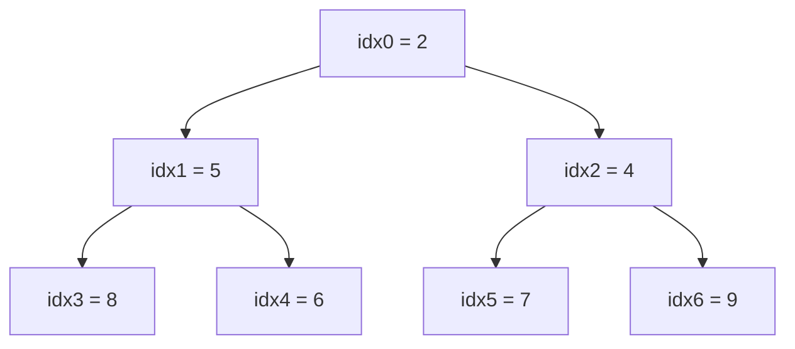
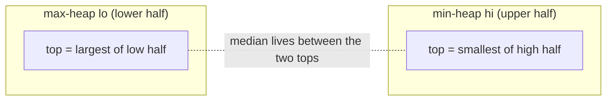

# Heaps, Priority Queues & Top-K

A **binary heap** is the data structure interviewers reach for whenever a problem needs
repeated access to the *smallest* or *largest* element without a full sort: "find the k-th
largest", "top k frequent", "median of a stream", "merge k sorted lists", "k closest
points". The magic is that a heap gives you **O(1) peek** at the min (or max) and **O(log n)**
insert/extract, and it's implemented not with tree nodes and pointers but with a flat
**array** — a beautiful example of an *implicit* data structure. A **priority queue** is the
abstract type ("give me the highest-priority element next"); a binary heap is its usual
concrete implementation (Java's `PriorityQueue`, Python's `heapq`, C++'s `priority_queue`).

> [!KEY-TAKEAWAY]
> A binary heap is a **complete binary tree stored in an array**: for index `i`, children
> are `2i+1` and `2i+2`, parent is `(i-1)/2` — no pointers. It maintains the **heap
> invariant** (min-heap: every parent ≤ its children). `peek` is **O(1)**; `push`
> (sift-up) and `pop` (sift-down) are **O(log n)**; `build-heap` from an array is **O(n)**,
> not O(n log n). The killer pattern is **Top-K with a size-k heap → O(n log k)**: for the
> k *largest* keep a **min-heap** of size k (evict the smallest); for the k *smallest* keep
> a **max-heap**. **Two heaps** (a max-heap of the low half + a min-heap of the high half)
> give a running **median** in O(log n) per element.

---

## The internals: a complete binary tree stored in an array

A binary heap is a **complete binary tree** — every level is fully filled except possibly
the last, which fills left-to-right. Completeness is what lets us drop pointers entirely and
store the tree in a contiguous array by level-order (breadth-first) position.

For a node at **0-based** array index `i`:

| Relationship | Index |
|---|---|
| Left child | `2*i + 1` |
| Right child | `2*i + 2` |
| Parent | `(i - 1) / 2` (integer division) |

(If you use 1-based indexing — common in textbooks like CLRS — it's `2i`, `2i+1`, and
`i/2`, which is slightly prettier but off-by-one relative to real array code.)



The tree above is the array `[2, 5, 4, 8, 6, 7, 9]`. Node `5` is at index 1; its children
`8` and `6` sit at indices `2*1+1 = 3` and `2*1+2 = 4`. This is a **min-heap**: every parent
is ≤ its children. The **root (index 0) is always the minimum** — that's the O(1) peek.

Two invariants together define a valid heap:

1. **Shape property** — the tree is complete (⇒ height is exactly `⌊log₂ n⌋`, and the array
   has no gaps).
2. **Heap-order property** — min-heap: `A[parent] ≤ A[child]` for every node (max-heap: `≥`).

Note the heap order is **weak**: it says nothing about siblings or about left-vs-right. A
heap is *not* sorted; it only guarantees the extreme element is at the root. This is exactly
why peek is O(1) but finding an arbitrary element is O(n).

> [!TIP]
> Memory layout matters: because a heap is a plain array, it is **cache-friendly** and has
> zero per-node pointer overhead — unlike a balanced BST. That's a real reason
> `PriorityQueue`/`heapq` beat a `TreeMap`-style structure when you only need the extreme.

---

## Sift-up (bubble-up) on insert — O(log n)

To **insert**, append the new element at the end of the array (the next open leaf, keeping
the tree complete), then **sift it up**: while it is smaller than its parent (min-heap),
swap with the parent. It stops when it reaches the root or its parent is ≤ it.

```
push(x):
    A.append(x)
    i = len(A) - 1
    while i > 0 and A[i] < A[(i-1)//2]:   # min-heap
        swap(A[i], A[(i-1)//2])
        i = (i-1)//2
```

Each swap moves the element up one level; the tree height is `⌊log₂ n⌋`, so at most
**O(log n)** swaps and comparisons. Space is O(1).

**Trace — `push(1)` into the min-heap `[2,5,4,8,6,7,9]`:**

| Step | Array | `i` | Compare | Action |
|---|---|---|---|---|
| append 1 | `[2,5,4,8,6,7,9,1]` | 7 | — | new leaf at idx 7 |
| sift | `[2,5,4,1,6,7,9,8]` | 3 | `1 < A[3]=8` | swap idx 7 ↔ 3 |
| sift | `[2,1,4,5,6,7,9,8]` | 1 | `1 < A[1]=5` | swap idx 3 ↔ 1 |
| sift | `[1,2,4,5,6,7,9,8]` | 0 | `1 < A[0]=2` | swap idx 1 ↔ 0 → root, stop |

The value 1 climbed 3 levels (7→3→1→0) to become the new min. Final heap `[1,2,4,5,6,7,9,8]`
is still valid: `1 ≤ {2,4}`, `2 ≤ {5,6}`, `4 ≤ {7,9}`, `5 ≤ 8`.

---

## Sift-down (bubble-down) on extract — O(log n)

To **extract the min** (the root), you can't just remove index 0 — that would break the
array. Instead: **swap the root with the last element**, remove the last element (the old
root, now returned), then **sift the new root down**: repeatedly swap it with its *smaller*
child (min-heap) until both children are ≥ it or it becomes a leaf.

```
pop():
    min = A[0]
    A[0] = A[len(A)-1]; A.pop()       # move last element to root, then shrink
    n = len(A)                        # current (post-shrink) size for bounds checks
    i = 0
    while True:
        l, r = 2*i+1, 2*i+2
        smallest = i
        if l < n and A[l] < A[smallest]: smallest = l
        if r < n and A[r] < A[smallest]: smallest = r
        if smallest == i: break
        swap(A[i], A[smallest]); i = smallest
    return min
```

Again bounded by the height ⇒ **O(log n)**. The subtle bug interviewers watch for: you must
compare against the **smaller** of the two children (max-heap: the larger), otherwise you can
push a small value below a larger sibling and violate the invariant.

**Trace — `pop()` on the min-heap `[2,5,4,8,6,7,9]`:**

| Step | Array | `i` | Children of `i` | Action |
|---|---|---|---|---|
| move last→root | `[9,5,4,8,6,7]` | 0 | `A[1]=5, A[2]=4` | return `min=2`; old last `9` now at root, `n=6` |
| sift-down | `[4,5,9,8,6,7]` | 0→2 | smaller child = `4` (idx2) | `9 > 4` → swap idx0 ↔ 2, descend to idx2 |
| sift-down | `[4,5,7,8,6,9]` | 2→5 | only child = `7` (idx5) | `9 > 7` → swap idx2 ↔ 5, idx5 is a leaf → stop |

We returned `min = 2`. The old last element `9` sank from root to a leaf (0→2→5). Final heap
`[4,5,7,8,6,9]` is valid: `4 ≤ {5,7}`, `5 ≤ {8,6}`, `7 ≤ 9`. Note we always chased the
**smaller** child (at idx 2, `9`'s only child was `7`, so we swapped).

| Operation | Time | Notes |
|---|---|---|
| `peek` / find-min | **O(1)** | root is always the extreme |
| `push` / insert | **O(log n)** | append + sift-up |
| `pop` / extract-min | **O(log n)** | swap root with last + sift-down |
| `build-heap` (heapify array) | **O(n)** | see below — *not* O(n log n) |
| `decrease-key` (known index) | O(log n) | sift-up from that index |
| search for arbitrary value | **O(n)** | heap is not sorted |
| delete arbitrary element | O(n) find + O(log n) fix | must locate it first |
| space | O(n) | just the array, no pointers |

---

## Build-heap is O(n), not O(n log n)

A classic interview "gotcha." Building a heap from an unordered array of n elements by
**sift-down from the bottom up** — Floyd's method — is **O(n)**, not O(n log n):

```
build_heap(A):
    for i from (n//2 - 1) down to 0:   # all internal nodes, bottom-up
        sift_down(i)
```

Why O(n)? Sift-down cost is proportional to a node's *height*, and most nodes are near the
bottom (short). Summing height over all nodes: `Σ (n / 2^(h+1)) · h` = `n · Σ h/2^(h+1)`,
and `Σ_{h≥0} h/2^h` converges to 2. So the total is **O(n)**. (Building by n successive
*inserts*/sift-ups instead is O(n log n), because sift-up cost scales with *depth*, and most
nodes are deep — the reverse.)

**Trace — heapify `[3,1,6,5,2,4]` (min-heap), `n=6`.** Internal nodes are `i = n//2-1 = 2`
down to `0`; the leaves (indices 3,4,5 — *half* the nodes) are skipped entirely, doing **zero
work**:

| `i` | Node | Sift-down | Array after | Levels moved |
|---|---|---|---|---|
| 2 | `6` | child `4` (idx5) < 6 → swap | `[3,1,4,5,2,6]` | 1 |
| 1 | `1` | children `5,2`; `1 ≤ min=2` → no swap | `[3,1,4,5,2,6]` | 0 |
| 0 | `3` | swap with `1`(idx1), then with `2`(idx4) | `[1,2,4,5,3,6]` | 2 (full height) |

Total swaps: `1 + 0 + 2 = 3`. Only the **root** traveled the full height (2); the low
internal node moved once; three leaves moved not at all. That lopsided distribution — cheap
nodes vastly outnumber expensive ones — is exactly why the sum is O(n), not O(n log n). Final
heap `[1,2,4,5,3,6]` is valid: `1 ≤ {2,4}`, `2 ≤ {5,3}`, `4 ≤ 6`.

> [!WARNING]
> Don't confuse **build-heap O(n)** (heapify an existing array) with **heapsort O(n log n)**
> (build then extract all n elements, each extract O(log n)). And don't claim "inserting n
> items one-by-one is O(n)" — that's O(n log n). O(n) requires the bottom-up sift-down.

---

## Priority queue: the ADT, and the library APIs

A **priority queue** is an abstract data type supporting `insert(x, priority)` and
`extract-highest-priority`. A binary heap is the standard implementation, but not the only
one (binomial/Fibonacci heaps improve `decrease-key`/`meld` asymptotically; they're rarely
needed in interviews).

- **Java** `PriorityQueue<E>` — a **min-heap by default** (natural ordering). For a max-heap
  pass `Collections.reverseOrder()` or a comparator: `new PriorityQueue<>(Comparator.reverseOrder())`.
  `offer/poll` are O(log n), `peek` O(1). Not thread-safe; not sorted when iterated.
- **Python** `heapq` — functions over a plain list; **min-heap only**. `heappush`,
  `heappop`, `heapify(list)` (O(n)), `heappushpop`, `heapreplace`, and `nlargest/nsmallest`.
  For a **max-heap**, negate values (push `-x`) or store tuples. For custom priority push
  `(priority, tiebreaker, item)` tuples — include a monotonic counter as a tiebreaker so
  Python never compares the `item` objects on equal priority.
- **C++** `std::priority_queue` — a **max-heap by default**; `push/pop/top`.

> [!INTERVIEW]
> Two facts interviewers love to hear you volunteer: (1) Java's `PriorityQueue` is a *min*-heap
> by default while C++ `priority_queue` is a *max*-heap by default — mixing them up is a
> common bug. (2) To emulate a max-heap in Python's `heapq`, negate the keys.

---

## The Top-K pattern: a size-k heap → O(n log k)

This is the single most important pattern this topic teaches.

**Recognition signals:** the words **"k-th largest / smallest"**, **"top k"**, **"k most
frequent"**, **"k closest"**, or a **streaming**/"too big to sort" input. Whenever you need
the k extreme elements out of n (and k ≪ n), a heap of **size k** beats sorting.

The counterintuitive part is *which* heap:

- **k LARGEST elements → use a MIN-heap of size k.** Iterate all n elements; push each; if
  size exceeds k, `pop` (which removes the *smallest* of the k you're holding). At the end
  the heap holds the k largest, and its root is the **k-th largest**.
- **k SMALLEST elements → use a MAX-heap of size k** (symmetric: evict the largest).

```
kth_largest(nums, k):
    minheap = []                 # size-k min-heap
    for x in nums:
        heappush(minheap, x)
        if len(minheap) > k:
            heappop(minheap)     # drop the smallest so far
    return minheap[0]            # k-th largest = smallest of the k biggest
```

**Complexity: O(n log k)** time, **O(k)** space — because the heap never grows past k, each
of the n operations is O(log k). Compare with the alternatives:

| Approach | Time | Space | When to prefer |
|---|---|---|---|
| Sort, take k | O(n log n) | O(n) or O(1) | k close to n, or you need all sorted |
| Size-k heap | **O(n log k)** | O(k) | k ≪ n, or **streaming** (can't hold/sort all n) |
| Quickselect | **O(n) average**, O(n²) worst | O(1) | one-shot k-th element in memory, order not needed |

> [!TIP]
> Quickselect is the fastest for a **one-shot in-memory** k-th element (O(n) average). The
> **size-k heap wins for streaming** — data arrives online, you can't re-scan or hold it all —
> and when you must maintain the top-k as data updates (e.g. `KthLargest` in a stream).

For **Top K Frequent** you first build a frequency map (O(n)), then either run a size-k heap
over the distinct keys (O(m log k)) or **bucket sort by frequency** (O(n), since frequencies
are bounded by n) — bucket sort is the optimal answer if the interviewer pushes past the heap.
Concretely: make an array `bucket[0..n]` where `bucket[f]` is the list of keys that occur
exactly `f` times, then walk it from the high end downward collecting keys until you have k.
For `["a","a","a","b","b","c"]` (n=6): `bucket[3]=[a]`, `bucket[2]=[b]`, `bucket[1]=[c]`; walk
`f=6..1` and the first `k=2` keys collected are `a`, then `b`. No comparisons, no log factor.

### Quickselect: the O(n)-average alternative

Quickselect is quicksort's partition step, but you recurse into **only one side**. To find the
k-th smallest, pick a pivot and **partition** the array so everything ≤ pivot is on the left
and everything > pivot on the right; the pivot lands at its final sorted index `p`. If `p == k`
you're done; if `k < p` recurse left, else recurse right — you never touch the other half.

Because each level does O(remaining) work and the remaining size roughly *halves* on a decent
pivot, the total is `n + n/2 + n/4 + … ≈ 2n = ` **O(n) average**. A pathological pivot (always
the min or max, e.g. an already-sorted array with last-element pivots) shrinks the problem by
just 1 each time → `n + (n−1) + … = ` **O(n²) worst case**. A **randomized pivot** makes that
worst case astronomically unlikely; **median-of-medians** pivot selection guarantees
**worst-case O(n)** (at a higher constant). Space is O(1) with in-place partitioning.

**Trace — find the 2nd smallest (k=1, 0-based) of `[7, 2, 9, 4]`, pivot = last = 4:**
partition puts elements `< 4` left: scan `7`(skip), `2`(→ left, swap into slot 0), `9`(skip),
then place pivot after the left region → `[2, 4, 9, 7]`, pivot `4` at index `p = 1`. Since
`k == p == 1`, return **4** — and indeed sorted `[2,4,7,9]` has `4` at index 1. We never
partitioned the `[9,7]` right half.

---

## Two-heaps pattern: running median of a stream

**Recognition signal:** "median of a data stream", "balance two halves", "median in a sliding
window". Keep the lower half of the numbers in a **max-heap** (`lo`) and the upper half in a
**min-heap** (`hi`), maintaining two invariants:

1. Every element in `lo` ≤ every element in `hi`.
2. Sizes are balanced: `size(lo) == size(hi)` or `size(lo) == size(hi) + 1`.

Then the median is `lo.top()` (odd total) or the average of `lo.top()` and `hi.top()` (even).



The canonical trick avoids all `if x < lo.top()` branching by **funneling every number
through `lo` first**, then shipping `lo`'s new top over to `hi`, then rebalancing sizes. This
guarantees both invariants automatically:

```
addNum(x):
    lo.push(x)                    # 1. always push to the max-heap first
    hi.push(lo.pop())             # 2. move lo's largest to hi  → ordering invariant holds
    if size(hi) > size(lo):       # 3. keep lo the same size or exactly 1 bigger
        lo.push(hi.pop())

findMedian():
    if size(lo) > size(hi): return lo.top()           # odd total
    else:                   return (lo.top() + hi.top()) / 2   # even total
```

**Trace — feed the stream `[5, 2, 8, 1]`** (`lo` = max-heap, `hi` = min-heap):

| add | after step 1 (`lo.push`) | after step 2 (`lo→hi`) | after step 3 (rebalance) | `lo` / `hi` | median |
|---|---|---|---|---|---|
| **5** | lo`[5]` hi`[]` | lo`[]` hi`[5]` | size(hi)=1>0 → lo`[5]` hi`[]` | `[5]` / `[]` | **5** (lo.top) |
| **2** | lo`[5,2]` hi`[]` | lo`[2]` hi`[5]` | sizes equal, skip | `[2]` / `[5]` | **(2+5)/2 = 3.5** |
| **8** | lo`[8,2]` hi`[5]` | lo`[2]` hi`[5,8]` | size(hi)=2>1 → lo`[5,2]` hi`[8]` | `[5,2]` / `[8]` | **5** (lo.top) |
| **1** | lo`[5,2,1]` hi`[8]` | lo`[2,1]` hi`[5,8]` | sizes equal, skip | `[2,1]` / `[5,8]` | **(2+5)/2 = 3.5** |

Verify against the sorted stream: `[5]`→5; `[2,5]`→3.5; `[2,5,8]`→5; `[1,2,5,8]`→3.5. All four
match. **Read `top()`, not the raw array:** `lo` is a *max*-heap so `lo.top()` is its largest
(`2`), and `hi` is a *min*-heap so `hi.top()` is its smallest (`5`) — the median lives in the
gap between the two tops. The final answer is `(lo.top=2 + hi.top=5)/2 = 3.5`.

`findMedian` is **O(1)**; each `addNum` does a constant number of O(log n) heap ops. This beats
re-sorting (O(n log n) per query) or a sorted list with insertion (O(n) per insert).

For the **sliding-window** variant you also have to *remove* the element leaving the window,
but a binary heap can't delete an arbitrary interior value in O(log n). The standard fix is
**lazy deletion**: keep a hash map of "to-delete" counts, and whenever a heap's `top()` is a
value that's marked for deletion, pop and discard it (decrementing the map) before trusting the
top. Track sizes by *logical* count (physical size minus pending deletes) so rebalancing stays
correct even though stale entries linger in the arrays.

---

## K-way merge with a heap

**Recognition signal:** "merge k sorted lists/arrays", "smallest range covering k lists",
"k-th smallest in a sorted matrix". Put the **head of each of the k lists** into a min-heap
(each entry tagged with which list it came from). Repeatedly pop the smallest, append it to
the output, and push the *next* element from that same list.

- Heap size stays ≤ k, and you do this for all N total elements ⇒ **O(N log k)** time, O(k)
  space. Naively concatenating and sorting is O(N log N); merging pairwise is O(N·k). The
  heap is the clean win when k is moderate and N is large.

---

## Gotchas & interview traps

- **Heaps are not sorted.** Iterating a `PriorityQueue`/`heapq` list does **not** yield
  sorted order — only repeated `poll`/`heappop` does. In-order iteration gives array order.
- **No O(log n) arbitrary search.** Finding/deleting a specific value (not the root) is O(n)
  to locate. If you need that plus ordering, consider a balanced BST / `TreeMap`.
- **Wrong heap direction for Top-K.** For k *largest* you want a *min*-heap (so you can evict
  the smallest cheaply). Reversing this is the most common bug.
- **Build-heap vs. n inserts.** Only bottom-up sift-down is O(n); n inserts is O(n log n).
- **Python tuple comparison.** Pushing `(priority, item)` crashes when two priorities tie and
  `item` isn't comparable — add a unique increasing counter as a tiebreaker.
- **Sift-down must pick the smaller child** (min-heap), not just any out-of-order child.
- **`decrease-key` needs the index.** A plain binary heap can't find an element to update in
  O(log n); you need an auxiliary index map (used in Dijkstra with a "lazy deletion" trick,
  where you instead push duplicates and skip stale pops).

---

## Interview Problems

Heap / priority-queue / top-k canon — the ones that show up again and again:

**Top-K (size-k heap or quickselect):**
- [Kth Largest Element in an Array](https://leetcode.com/problems/kth-largest-element-in-an-array/) — Medium — size-k min-heap O(n log k), or quickselect O(n) avg
- [Top K Frequent Elements](https://leetcode.com/problems/top-k-frequent-elements/) — Medium — freq map + size-k heap, or bucket sort by frequency O(n)
- [K Closest Points to Origin](https://leetcode.com/problems/k-closest-points-to-origin/) — Medium — size-k max-heap on squared distance
- [Top K Frequent Words](https://leetcode.com/problems/top-k-frequent-words/) — Medium — heap with a custom (count, lexicographic) comparator
- [Kth Largest Element in a Stream](https://leetcode.com/problems/kth-largest-element-in-a-stream/) — Easy — maintain a size-k min-heap online
- [Sort Characters By Frequency](https://leetcode.com/problems/sort-characters-by-frequency/) — Medium — count then heap / bucket by frequency

**Two heaps:**
- [Find Median from Data Stream](https://leetcode.com/problems/find-median-from-data-stream/) — Hard — max-heap low half + min-heap high half
- [Sliding Window Median](https://leetcode.com/problems/sliding-window-median/) — Hard — two heaps with lazy deletion

**K-way merge:**
- [Merge k Sorted Lists](https://leetcode.com/problems/merge-k-sorted-lists/) — Hard — min-heap of list heads, O(N log k)
- [Kth Smallest Element in a Sorted Matrix](https://leetcode.com/problems/kth-smallest-element-in-a-sorted-matrix/) — Medium — k-way merge heap, or binary search on value
- [Find K Pairs with Smallest Sums](https://leetcode.com/problems/find-k-pairs-with-smallest-sums/) — Medium — heap over pair frontier
- [Smallest Range Covering Elements from K Lists](https://leetcode.com/problems/smallest-range-covering-elements-from-k-lists/) — Hard — k-way merge tracking window max/min

**Greedy scheduling with a heap:**
- [Task Scheduler](https://leetcode.com/problems/task-scheduler/) — Medium — max-heap of counts (or math formula)
- [Reorganize String](https://leetcode.com/problems/reorganize-string/) — Medium — max-heap on remaining frequency
- [Meeting Rooms II](https://leetcode.com/problems/meeting-rooms-ii/) — Medium — min-heap of end times to count overlaps
- [Last Stone Weight](https://leetcode.com/problems/last-stone-weight/) — Easy — max-heap, repeatedly smash the two largest

---

## Common follow-up questions

- Why is build-heap O(n) but heapsort O(n log n)? Build-heap sums *heights* (converges
  to O(n)); heapsort then does n extractions each O(log n).
- For the k largest, do you use a min-heap or a max-heap? Why? Min-heap of size k, so the
  root is the smallest of your current k and can be evicted in O(log n) when a bigger element
  arrives.
- When would you use quickselect over a heap? One-shot k-th element of an in-memory array
  where you don't need the elements ordered — O(n) average beats O(n log k). Heap wins for
  streaming / online top-k.
- How do you make a max-heap in Python? Negate the keys (or push `(-key, item)`); `heapq`
  is min-only.
- How does Dijkstra use a heap, and how do you handle decrease-key? A min-heap keyed by
  tentative distance; since binary heaps lack O(log n) decrease-key, use *lazy deletion* —
  push a new (dist, node) entry and skip stale entries when popped.
- Median of a stream — what structure? Two heaps (max-heap low half, min-heap high half),
  rebalanced to differ in size by at most one.
- Is a heap sorted? No — only the root is guaranteed extreme; siblings are unordered.

---

## References

- Cormen, Leiserson, Rivest, Stein, *Introduction to Algorithms* (CLRS), 3rd/4th ed., Ch. 6
  "Heapsort" (heap definition, sift-down `MAX-HEAPIFY`, `BUILD-MAX-HEAP` O(n) proof) and
  Ch. 6.5 "Priority queues."
- Sedgewick & Wayne, *Algorithms*, 4th ed., §2.4 "Priority Queues" (binary heaps, sink/swim).
- Java Platform SE docs — `java.util.PriorityQueue` (min-heap default, O(log n) offer/poll).
- Python docs — `heapq` module (min-heap, `heapify` O(n), `nlargest`/`nsmallest`).
- cppreference — `std::priority_queue` (max-heap default).
