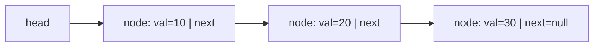
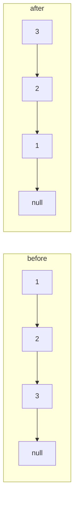
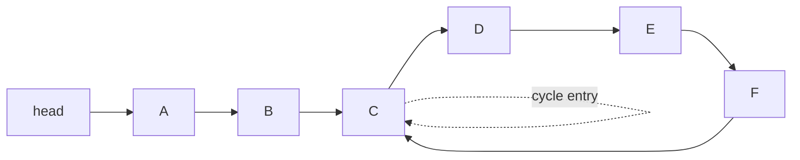

# Linked Lists & Fast/Slow Pointers

A linked list is a linear data structure where elements (**nodes**) are stored in
independently-allocated cells connected by pointers, rather than in one contiguous block
like an array. This single design choice — pointers instead of contiguity — drives every
trade-off that follows: O(1) structural edits, but O(n) indexing and terrible cache
behavior. Linked lists are also the substrate for the **fast/slow pointer** pattern
(Floyd's tortoise-and-hare), one of the highest-leverage tricks in interviews.

> [!KEY-TAKEAWAY]
> A linked list trades **random access** (arrays' superpower) for **cheap splicing**:
> inserting/deleting a node you already hold a pointer to is O(1) with no shifting, but
> reaching the k-th element costs O(k) because you must walk the chain.

## How a linked list works under the hood

A node is a small heap-allocated record with two parts: a **payload** (the value) and one
or more **link fields** (pointers to neighbors). The list itself is just a reference to the
first node (the **head**); the last node's `next` is `null`, which marks the end.

```
Singly linked:  head -> [10|·] -> [20|·] -> [30|null]
Doubly linked:  head <-> [10] <-> [20] <-> [30] <-> null   (each node also stores prev)
```

Memory layout — the crux of everything:

- **Array:** one contiguous block. Element `i` lives at `base + i * elem_size`, so address
  arithmetic gives O(1) random access. Elements are physically adjacent.
- **Linked list:** each node is a *separate* allocation, scattered anywhere on the heap.
  There is no formula for "address of node i" — you must follow `next` pointers from the
  head. Each node also carries pointer overhead (8 bytes per link on a 64-bit machine) plus
  allocator/object-header overhead, so a linked list of ints uses far more memory than an
  int array.



Per-operation complexity (singly linked list):

| Operation | Time | Notes |
|---|---|---|
| Access / index `get(i)` | O(n) | must walk from head; no random access |
| Search by value | O(n) | linear scan |
| Insert/delete at **head** | O(1) | just repoint head |
| Insert/delete at **tail** | O(n) singly, O(1) if tail pointer kept | need the node before tail to delete |
| Insert/delete **given the node's predecessor** | O(1) | pointer surgery, no shifting |
| Insert/delete given only the node (singly) | O(n) to find predecessor | doubly-linked makes it O(1) |
| Space | O(n) | plus per-node pointer + header overhead |

> [!INTERVIEW]
> "O(1) insert/delete" is the classic linked-list selling point, but it's conditional: it's
> O(1) only if you **already hold a pointer to the right spot** (the node, or its
> predecessor in a singly list). Finding that spot is O(n). Interviewers love to probe this
> nuance.

## Singly vs doubly linked lists

- **Singly linked:** node = `{value, next}`. Minimal memory (one pointer/node). Can only
  traverse forward. To delete a node you need its **predecessor**, so deletion given only
  the node is O(n) — unless you use the "copy the next node's value into this node and
  delete the next node" trick (fails for the tail).
- **Doubly linked:** node = `{value, prev, next}`. Two pointers/node. Traverse both ways;
  delete a node in O(1) given only that node (relink `node.prev.next = node.next` and
  `node.next.prev = node.prev`). This is why **LRU caches** and Java's `LinkedList` /
  `LinkedHashMap` use doubly-linked nodes: they need O(1) removal of an arbitrary node.
- **Circular:** the tail's `next` points back to the head (singly-circular) or the list is
  a ring (doubly-circular). Useful for round-robin schedulers and buffers.

| | Singly | Doubly |
|---|---|---|
| Pointers/node | 1 (`next`) | 2 (`prev`, `next`) |
| Memory overhead | lower | higher |
| Traverse backward | no | yes |
| Delete given only the node | O(n) | O(1) |
| Typical uses | stacks, adjacency lists, simple queues | LRU cache, deques, text editors' undo |

> [!TIP]
> Java's `java.util.LinkedList` is a **doubly-linked list** implementing both `List` and
> `Deque`. In practice `ArrayList`/`ArrayDeque` beat it for almost all workloads because of
> cache locality — reach for `LinkedList` only when you truly need O(1) splicing at held
> nodes.

## Linked list vs array: cache locality

Even though a linked list gives O(1) structural edits, arrays usually win in real
performance because of the **memory hierarchy**:

- **Spatial locality:** array elements are contiguous, so a single cache-line fetch (~64
  bytes) pulls in many neighbors. Iterating an array streams predictably and the hardware
  **prefetcher** stays ahead of you.
- **Pointer chasing:** linked-list nodes are scattered, so each `next` dereference is likely
  a **cache miss** — the CPU stalls waiting on main memory (tens to hundreds of cycles).
  The prefetcher can't predict where the next node lives.
- Net effect: sequential traversal of a linked list can be **an order of magnitude slower**
  than an array of the same length, despite identical O(n) asymptotics. Big-O hides the
  constant factor, and here the constant is dominated by memory latency.

> [!KEY-TAKEAWAY]
> Asymptotics say array and linked-list traversal are both O(n); the memory hierarchy says
> the array is often 5–10x faster. This is the canonical example of "constant factors and
> cache behavior matter in practice."

## The dummy / sentinel head trick

A **dummy head** (a.k.a. sentinel) is a throwaway node placed *before* the real head so that
every real node has a predecessor. It removes the special-case branch for "am I modifying
the head?" — the #1 source of linked-list bugs.

```python
def remove_all(head, v):          # delete every node whose value == v
    dummy = Node(0)
    dummy.next = head
    prev = dummy
    curr = head
    while curr:
        if curr.val == v:
            prev.next = curr.next   # unlink; prev does NOT advance
        else:
            prev = curr             # keep node; prev advances onto it
        curr = curr.next
    return dummy.next               # the (possibly new) real head
```

**Worked trace — `remove_all(1 -> 2 -> 2 -> 3, v=2)`.** `prev` starts at `dummy` (`→1`):

| `curr` | match? | action | list after |
|---|---|---|---|
| `1` | no | `prev = 1` | `d -> 1 -> 2 -> 2 -> 3` |
| first `2` | yes | `prev.next = curr.next` → `1 -> (2) -> 3`; `prev` stays `1` | `d -> 1 -> 2 -> 3` |
| second `2` | yes | `prev.next = 3`; `prev` stays `1` | `d -> 1 -> 3` |
| `3` | no | `prev = 3` | `d -> 1 -> 3` |

Return `dummy.next = 1`. Now delete the head instead — `remove_all(2 -> 1, v=2)`: `prev`
is still `dummy`, so `prev.next = 1` drops the old head with **no `if curr == head` branch**.
That uniformity is the whole payoff: `prev` (which begins at the sentinel) is what advances,
and the head-deletion case is just the ordinary case.

Use it whenever the head might be inserted before or deleted (merge, remove-Nth, partition,
remove-duplicates, reorder). It makes the code uniform and shorter, at the cost of one
temporary node.

> [!TIP]
> If your solution has an `if node == head:` branch, ask whether a dummy head would delete
> that branch entirely. It usually does.

## In-place reversal (iterative 3-pointer & recursive)

Reversing a singly linked list in place is the archetypal pointer-manipulation problem. The
iterative version walks the list once with three pointers, flipping each `next` pointer.

```python
def reverse(head):
    prev = None
    curr = head
    while curr:
        nxt = curr.next   # 1. SAVE next before we clobber it
        curr.next = prev  # 2. reverse the link
        prev = curr       # 3. advance prev
        curr = nxt        # 4. advance curr
    return prev           # prev is the new head
```

- **Time O(n), space O(1).** Single pass.
- The `nxt = curr.next` save on line 1 is essential: once you set `curr.next = prev` you've
  lost the rest of the list unless you saved it. Forgetting this is the classic bug.

**Worked trace — reverse `1 -> 2 -> 3`.** Watch the three pointers each iteration; the
"reversed so far" column is what `prev` heads:

| Step | `nxt` (saved) | after `curr.next = prev` | `prev` | `curr` | reversed so far |
|---|---|---|---|---|---|
| start | — | — | `None` | `1` | (empty) |
| 1 | `2` | `1 -> None` | `1` | `2` | `1 -> None` |
| 2 | `3` | `2 -> 1` | `2` | `3` | `2 -> 1 -> None` |
| 3 | `None` | `3 -> 2` | `3` | `None` | `3 -> 2 -> 1 -> None` |

Loop ends when `curr` is `None`; return `prev = 3`, the new head. Note each `nxt` save
rescues the tail we're about to orphan — drop line 1 and after step 1 you can never reach
node `2` again.

Recursive version (O(n) time, **O(n) stack space** — the recursion depth is the list
length, so it can stack-overflow on long lists):

```python
def reverse(head):
    if not head or not head.next:
        return head
    new_head = reverse(head.next)
    head.next.next = head   # make the next node point back to me
    head.next = None        # break my forward link
    return new_head
```



## Fast/slow pointers (Floyd's tortoise & hare)

The **fast/slow pointer** pattern uses two pointers advancing at different speeds — slow
one step, fast two steps — through the same list. It solves cycle and midpoint problems in
O(1) extra space, where the naive approach would need a hash set (O(n) space).

**Recognition signal:** reach for fast/slow when a linked-list (or implicit "next
function") problem asks about a **cycle**, the **middle**, or a position **relative to the
end** (nth-from-end), especially with an O(1)-space requirement.

### Find the middle
Advance `slow` by 1 and `fast` by 2. When `fast` reaches the end, `slow` is at the middle.
For even length, the exact node `slow` lands on depends on the loop condition
(`fast and fast.next` gives the second middle; adjust for the first).

```python
slow = fast = head
while fast and fast.next:
    slow = slow.next
    fast = fast.next.next
# slow is the middle
```

**Worked trace — even-length `1 -> 2 -> 3 -> 4`.** Both start at `1`:

| Iteration | condition `fast and fast.next` | `slow` moves to | `fast` moves to |
|---|---|---|---|
| 1 | `fast=1`, `fast.next=2` ✓ | `2` | `3` |
| 2 | `fast=3`, `fast.next=4` ✓ | `3` | `None` |
| 3 | `fast=None` ✗ — stop | — | — |

`slow` lands on `3`, the **second** of the two middles (`2` and `3`). To get the **first**
middle (`2`) instead, start `fast` one node ahead — `slow = head; fast = head.next` — then
with the same loop `slow` advances only once (to `2`) before `fast` reaches `4`/`None`.
This split point is off-by-one-sensitive: reorder/palindrome problems that reverse the
*second* half want the first-middle variant so the two halves are `[1,2]` and `[3,4]`.

### Detect a cycle (does the list loop?)
If there is a cycle, the fast pointer eventually laps the slow one and they **meet inside
the loop**; if fast hits `null`, there is no cycle. This is O(n) time, O(1) space — vs. a
hash-set of visited nodes which is O(n) space.

```python
slow = fast = head
while fast and fast.next:
    slow = slow.next
    fast = fast.next.next
    if slow is fast:
        return True   # cycle detected
return False
```

**Why fast moves exactly 2 (and why they can't skip past each other):** once both pointers
are inside the loop, fast gains **exactly one node on slow every iteration** (fast +2, slow
+1 → gap shrinks by 1). A gap that decreases by 1 each step must eventually hit 0 — they
land on the same node; it can never jump from 1 to −1 and overshoot. If fast stepped by 3
the gap would change by 2 per step and could skip from a gap of 1 to −1 (mod L), so meeting
is no longer guaranteed. Step-2 is the smallest speed that both guarantees a meeting and
gives the clean cycle-start congruence below.

**Worked trace — `1 -> 2 -> 3 -> 4 -> 2` (tail links back to `2`, loop length `L=3`).**

| Iteration | `slow` | `fast` | meet? |
|---|---|---|---|
| start | `1` | `1` | — |
| 1 | `2` | `3` | no |
| 2 | `3` | `2` (`4`→`2`) | no |
| 3 | `4` | `4` (`2`→`3`→`4`) | **yes** |

They meet at node `4`. On a null-terminated list `fast` (or `fast.next`) would reach `None`
first and the loop exits `False`.

### Find the cycle's start node
After a meeting point is found, reset one pointer to the head and advance **both one step at
a time**; they meet at the cycle's entry node. (Why: if the non-cyclic prefix has length
`a`, and the meeting point is `b` nodes into the loop of length `L`, the math works out so
that `a ≡ (L − b) mod L`, meaning a pointer from the head and a pointer from the meeting
point converge exactly at the loop entry.)

**Deriving the congruence.** When they meet, slow has walked `d = a + b` (reach the entry,
then `b` into the loop). Fast walked `2d` and, being in the loop, is `a + b` plus some whole
number of laps: `2d = d + nL`, so `d = nL`. Substitute: `a + b = nL`, hence
`a = nL − b = (L − b) mod L`. So the leftover distance from the meeting point to the entry
(`L − b`) equals `a` modulo full laps — walk `a` steps from either the head or the meeting
point and both land on the entry.

**Concrete trace.** List `n1 -> n2 -> [n3] -> n4 -> n5 -> n6 -> back to n3`; prefix `a = 2`
(`n1,n2`), entry `n3`, loop `n3,n4,n5,n6` so `L = 4`. Phase 1 (slow +1, fast +2 from `n1`):

| Iter | `slow` | `fast` |
|---|---|---|
| 1 | `n2` | `n3` |
| 2 | `n3` | `n5` |
| 3 | `n4` | `n3` (`n5→n6→n3`) |
| 4 | `n5` | `n5` (`n3→n4→n5`) — **meet** |

Meeting node `n5` is `b = 2` nodes into the loop (`n3`=0, `n4`=1, `n5`=2). Check the
congruence: `(L − b) mod L = (4 − 2) mod 4 = 2 = a` ✓; and `d = a + b = 4 = 1·L` ✓. Phase 2,
reset `p = head = n1`, keep `slow = n5`, step both +1:

| Step | `p` | `slow` |
|---|---|---|
| 1 | `n2` | `n6` |
| 2 | `n3` | `n3` — **meet at entry** |

Both land on `n3`, the cycle start, after exactly `a = 2` steps.

```python
# after slow is fast (meeting point):
p = head
while p is not slow:
    p = p.next
    slow = slow.next
return p   # cycle start
```



## Merge two sorted lists

Classic dummy-head + two-pointer merge (same core step as merge sort's merge). Walk both
lists, always splicing the smaller current node onto the result tail.

```python
def merge(l1, l2):
    dummy = tail = Node(0)
    while l1 and l2:
        if l1.val <= l2.val:
            tail.next, l1 = l1, l1.next
        else:
            tail.next, l2 = l2, l2.next
        tail = tail.next
    tail.next = l1 or l2   # attach the remaining tail
    return dummy.next
```

- **Time O(n + m), space O(1)** (splicing existing nodes, no new allocation).
- Merging **k** sorted lists: use a min-heap of the k current heads for O(N log k) total
  (N = total nodes), or pairwise/divide-and-conquer merging for the same bound.
- **`<=` vs `<` is a stability choice.** Using `<=` (ties → take from `l1`) keeps equal keys
  in their original relative order — a **stable** merge, which is exactly what merge sort
  relies on to be a stable sort. Flip it to `<` and equal elements from `l2` jump ahead of
  `l1`'s, breaking stability.

**Worked trace — merge `l1 = 1 -> 4` and `l2 = 2 -> 3`.** `tail` starts at `dummy`:

| Step | compare | spliced onto tail | list so far | `l1` | `l2` |
|---|---|---|---|---|---|
| 1 | `1 <= 2` ✓ | `1` | `1` | `4` | `2 -> 3` |
| 2 | `4 <= 2` ✗ | `2` | `1 -> 2` | `4` | `3` |
| 3 | `4 <= 3` ✗ | `3` | `1 -> 2 -> 3` | `4` | `None` |
| 4 | `l2` empty — exit loop | — | `1 -> 2 -> 3` | `4` | — |

`tail.next = l1 or l2` attaches the leftover `4`: final `1 -> 2 -> 3 -> 4`. Return
`dummy.next`.

## Common bugs & gotchas

- **Losing the `next` pointer.** Any time you overwrite `node.next`, save the old value
  first if you still need the rest of the list (see reversal). This is the #1 bug.
- **Null handling.** Guard `while fast and fast.next` (not just `fast`) before
  `fast.next.next`, or you'll dereference null on even-length / empty lists.
- **Off-by-one in nth-from-end.** Advance the lead pointer exactly `n` steps (or `n+1` with
  a dummy) before moving both; test on edge cases (delete head, single node).
- **Head mutation without a dummy.** Deleting/inserting at the head without a sentinel needs
  a special branch — easy to forget. Use a dummy head.
- **Creating a cycle by accident.** When rewiring (e.g. reorder list), forgetting to set the
  final node's `next = null` produces an infinite loop.
- **Comparing values vs. identity.** In cycle detection compare node **identity**
  (`is`/`==` reference), never values, since values can repeat.
- **Leftover carry in digit-add problems.** After both lists end, a remaining carry needs an
  extra node — e.g. `5 + 5`: `5+5 = 10`, emit digit `0`, carry `1`; both lists are now empty
  but you must append a final `1`, giving `0 -> 1` (the number 10). Loop on
  `while l1 or l2 or carry`, not just `while l1 or l2`.

## Interview Problems

Grouped by the technique they drill. All are canonical, frequently-asked problems.

**Pointer manipulation / reversal**
- [Reverse Linked List](https://leetcode.com/problems/reverse-linked-list/) — Easy — iterative 3-pointer / recursive reversal
- [Reverse Linked List II](https://leetcode.com/problems/reverse-linked-list-ii/) — Medium — reverse a sublist with a dummy head
- [Swap Nodes in Pairs](https://leetcode.com/problems/swap-nodes-in-pairs/) — Medium — local pointer surgery, dummy head
- [Reverse Nodes in k-Group](https://leetcode.com/problems/reverse-nodes-in-k-group/) — Hard — segmented reversal
- [Palindrome Linked List](https://leetcode.com/problems/palindrome-linked-list/) — Easy — find middle + reverse second half

**Fast/slow pointers**
- [Linked List Cycle](https://leetcode.com/problems/linked-list-cycle/) — Easy — Floyd's cycle detection
- [Linked List Cycle II](https://leetcode.com/problems/linked-list-cycle-ii/) — Medium — find cycle start node
- [Middle of the Linked List](https://leetcode.com/problems/middle-of-the-linked-list/) — Easy — slow/fast midpoint
- [Remove Nth Node From End of List](https://leetcode.com/problems/remove-nth-node-from-end-of-list/) — Medium — two-pointer gap of n
- [Find the Duplicate Number](https://leetcode.com/problems/find-the-duplicate-number/) — Medium — Floyd's on an implicit list
- [Reorder List](https://leetcode.com/problems/reorder-list/) — Medium — find middle + reverse + merge

**Merging & arithmetic**
- [Merge Two Sorted Lists](https://leetcode.com/problems/merge-two-sorted-lists/) — Easy — dummy-head two-pointer merge
- [Merge k Sorted Lists](https://leetcode.com/problems/merge-k-sorted-lists/) — Hard — min-heap or divide-and-conquer
- [Add Two Numbers](https://leetcode.com/problems/add-two-numbers/) — Medium — digit-by-digit with carry
- [Sort List](https://leetcode.com/problems/sort-list/) — Medium — merge sort on a linked list, O(1) space merge

**Design / complex pointers**
- [Copy List with Random Pointer](https://leetcode.com/problems/copy-list-with-random-pointer/) — Medium — interleave-clone or hash map
- [LRU Cache](https://leetcode.com/problems/lru-cache/) — Medium — doubly-linked list + hash map for O(1) ops
- [Remove Duplicates from Sorted List](https://leetcode.com/problems/remove-duplicates-from-sorted-list/) — Easy — single-pass splice

## Common follow-up questions

- **Why is `ArrayList` usually faster than `LinkedList` in Java even for inserts?**
  Cache locality and amortized O(1) append; `LinkedList` pays a cache miss per node and
  allocates a node object per element, so its constant factors dwarf the asymptotic edge.
- **How do you detect a cycle in O(1) space, and why does resetting to the head find the
  entry?** Floyd's algorithm; explain the `a = (L − b) mod L` congruence.
- **Delete a node given only a pointer to it (not the head), singly linked.** Copy the next
  node's value into this node and delete the next node — O(1); note it fails for the tail.
- **Reverse only a sublist / in groups of k.** Combine the dummy-head trick with segmented
  reversal.
- **How would you merge k sorted lists efficiently?** Min-heap of heads → O(N log k), or
  divide-and-conquer pairwise merge.
- **Recursive vs iterative reversal trade-off?** Same O(n) time; recursion uses O(n) call
  stack and can overflow on long lists, iterative is O(1) space.
- **Why do LRU caches use a doubly-linked list rather than an array or singly-linked list?**
  O(1) removal of an arbitrary (recently-used) node given a hash-map pointer to it, plus
  O(1) move-to-front.

## References

- Cormen, Leiserson, Rivest, Stein — *Introduction to Algorithms* (CLRS), 3rd/4th ed.,
  Ch. 10 "Elementary Data Structures" (linked lists), Ch. 6 (heaps for merge-k).
- Sedgewick & Wayne — *Algorithms*, 4th ed., §1.3 (linked lists, sentinels).
- Java Platform SE docs — `java.util.LinkedList`, `java.util.LinkedHashMap`.
- Python data model docs — object model / references (no built-in linked list; lists are
  dynamic arrays).
- R. W. Floyd — cycle-detection ("tortoise and hare") algorithm; standard treatment in
  Knuth, *TAOCP* Vol. 2.
