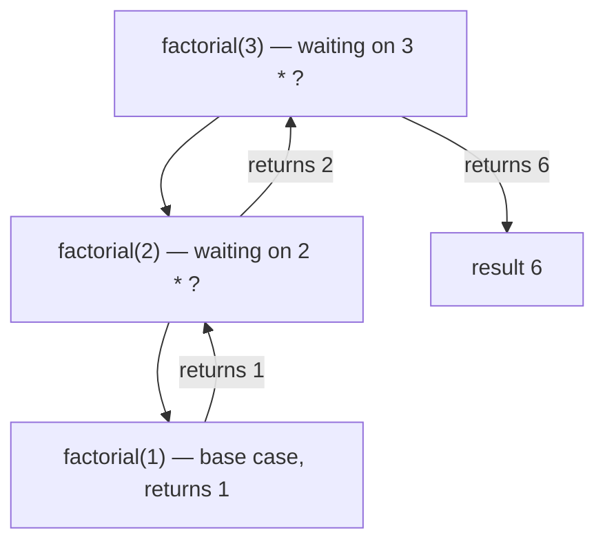
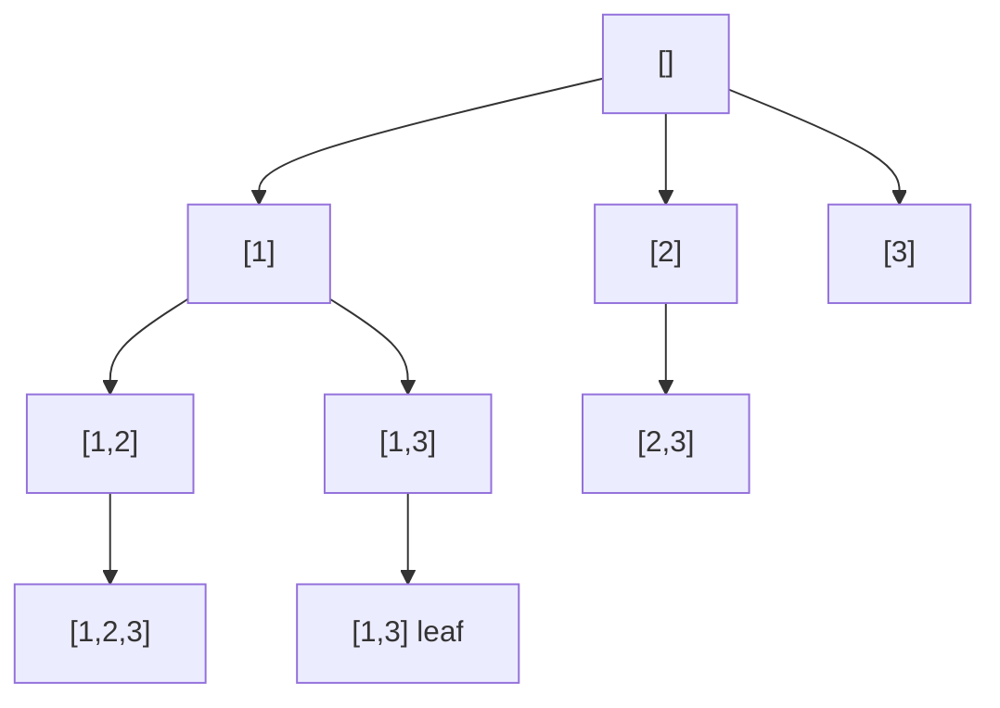

# Recursion & Backtracking

> Two of the most fundamental problem-solving tools in coding interviews. **Recursion**
> is a technique where a function solves a problem by calling itself on smaller
> sub-instances until it hits a trivial *base case*. **Backtracking** is a disciplined
> use of recursion that builds a candidate solution incrementally and *abandons*
> ("backtracks" from) a partial candidate the moment it can no longer lead to a valid
> solution. Together they power the entire family of "generate all combinations /
> permutations / subsets", constraint-satisfaction (N-Queens, Sudoku), and
> exhaustive-search problems. Master the templates and the pruning, and a large slice
> of Medium/Hard interview problems collapse into a fill-in-the-blanks exercise.

## Recursion: base case, recursive case, and the call stack

Every correct recursive function has two ingredients:

1. **Base case** — the smallest input(s) you can answer directly, *without* recursing.
   Missing or wrong base cases are the #1 cause of infinite recursion / `StackOverflowError`.
2. **Recursive case** — reduce the problem to one or more *strictly smaller* sub-problems,
   call yourself on them, and combine the results. The reduction must make *progress
   toward the base case* on every call, or it never terminates.

```text
factorial(n):
    if n <= 1:            # base case
        return 1
    return n * factorial(n - 1)   # recursive case — progresses toward 1
```

**How it runs — the call stack.** Each call gets its own *stack frame* holding its
parameters, local variables, and the return address. A call *pushes* a frame; a return
*pops* it. `factorial(3)` pushes frames for 3, 2, 1; then unwinds, multiplying on the
way back up. The maximum number of frames alive simultaneously is the **recursion depth**,
and that is what determines **stack space** usage.



> [!KEY-TAKEAWAY]
> A recursive solution is correct when: (1) the base case is reachable and right, and
> (2) every recursive call moves *strictly closer* to a base case. Reason about it by
> **induction**: assume the recursive call is correct on the smaller input, then show the
> combine step is correct.

**Complexity of recursion.** Two separate axes:

| Axis | Determined by |
|---|---|
| **Time** | number of calls × work per call — often expressed as a *recurrence*, e.g. `T(n) = 2T(n/2) + O(n)` → `O(n log n)` by the Master Theorem |
| **Space** | *max recursion depth* × frame size (the call stack), **plus** any heap-allocated state you carry |

A common interview trap: an algorithm can be `O(n)` time but still `O(n)` **space**
purely because of recursion depth (e.g. recursing down a skewed tree or a linked list).

## Recursion depth, stack space, and StackOverflowError

The call stack is a finite region of memory. Each language/runtime caps it:

- **Java:** default main-thread stack is typically ~512 KB (tunable with `-Xss`); blowing
  it throws `StackOverflowError`. Roughly tens of thousands of frames deep.
- **Python:** guarded by `sys.getrecursionlimit()` (default 1000) which raises
  `RecursionError` *before* the C stack actually overflows. Deep recursion (e.g. DFS on a
  100k-node graph) will hit this — a frequent gotcha.

Because of this, **depth matters**. Recursing to depth `n` on an input of size `n` (a
degenerate/linear recursion) is dangerous for large `n`; prefer iteration or an explicit
stack when depth can be large.

> [!WARNING]
> "It works on the small test case" hides depth bugs. A recursion that is `O(n)` deep will
> crash on `n = 10^5`+. Interviewers love to ask "what happens for very large input?" —
> the answer is *stack overflow*, and the fix is an explicit stack or an iterative reformulation.

## When recursion beats iteration (and when it doesn't)

**Reach for recursion when** the problem is *naturally self-similar*: trees, graphs,
divide-and-conquer (merge sort, quicksort, binary search on a structure), and — above all —
**exhaustive search** where you make a sequence of choices (backtracking). The code mirrors
the structure and is far shorter and clearer.

**Prefer iteration when** the problem is a simple linear sweep, when depth can be large
(risk of stack overflow), or when the per-call overhead matters in a hot loop. Iteration
has no frame-push cost and uses `O(1)` control space.

| | Recursion | Iteration |
|---|---|---|
| Clarity for tree/DAG/divide-conquer | Excellent | Poor (manual stack) |
| Control-flow space overhead | `O(depth)` call stack | `O(1)` |
| Risk of stack overflow | Yes, if deep | No |
| Function-call overhead | Per call | None |

## Tail recursion and recursion-to-iteration

A call is **tail-recursive** when the recursive call is the *very last* action — its result
is returned directly with no pending work (no `n * f(n-1)`; instead `f(n-1, acc*n)` with an
accumulator). Languages/compilers that do **tail-call optimization (TCO)** can reuse the
current frame, turning the recursion into a loop and using `O(1)` stack.

> [!WARNING]
> **Java and Python do NOT perform TCO.** Rewriting to tail form does *not* save you from
> stack overflow in these languages — you must convert to an actual loop. (Scala, most
> functional languages, and many C/C++ compilers under `-O2` do optimize tail calls.)

**Converting recursion → iteration with an explicit stack.** Any recursion can be made
iterative by simulating the call stack yourself with a `Stack`/`Deque`. This is the standard
fix for "avoid stack overflow" and the basis of *iterative DFS*:

```text
# Recursive DFS
dfs(node):
    if node is null: return
    visit(node); dfs(node.left); dfs(node.right)

# Iterative DFS with explicit stack (pre-order)
stack = [root]
while stack not empty:
    node = stack.pop()
    if node is null: continue
    visit(node)
    stack.push(node.right)   # push right first so left is processed first
    stack.push(node.left)
```

The explicit stack holds exactly the state the call stack would have held, but lives on the
**heap** (bounded by available memory, not the small stack region), so it scales to far
greater depth.

## Backtracking: the choose / explore / unchoose template

Backtracking = DFS over the **space of partial candidates**. You grow a candidate one
decision at a time; if the partial candidate is still viable you *recurse* to extend it; when
you return you *undo* the last decision so you can try the next option. Three moves:

1. **Choose** — make a decision (add an element, place a queen, fill a cell).
2. **Explore** — recurse to make the *next* decision with that choice in place.
3. **Unchoose** — undo the decision (remove the element) to restore state for the next branch.

```text
backtrack(state, path):
    if isComplete(path):
        record(path); return
    for choice in candidates(state, path):
        if not valid(choice, path):   # PRUNE — skip doomed branches
            continue
        path.add(choice)              # CHOOSE
        backtrack(advance(state), path)  # EXPLORE
        path.removeLast()             # UNCHOOSE (backtrack)
```

> [!KEY-TAKEAWAY]
> The mechanical heart of backtracking is the **symmetric choose/unchoose pair around the
> recursive call**. If you mutate shared state going *down*, you must restore it coming *up*
> — otherwise later branches see corrupted state. (Alternatively, pass an *immutable copy*
> down and skip the undo, trading memory for simplicity.)

**Recognition signals** — reach for backtracking when the prompt says:
- "Generate **all** / find **every** …" (subsets, permutations, combinations, partitions).
- "Return all valid X" under **constraints** (N-Queens, Sudoku, valid parentheses).
- Constraint-satisfaction / puzzle solving where you place items subject to rules.
- The answer is a *set of configurations*, not a single number/optimum (that's often DP/greedy).

## The decision-tree view & why it's exponential

Every backtracking search is a walk over an implicit **decision tree**: each node is a partial
candidate, each edge is a choice, and leaves are complete candidates. Complexity =
(number of nodes visited) × (work per node, e.g. copying a solution of length `k` is `O(k)`).



Because you branch at every level, the counts are inherently large:

| Problem shape | # of results | Typical time |
|---|---|---|
| **Subsets** of `n` items | `2^n` | `O(n · 2^n)` (each subset costs `O(n)` to build) |
| **Permutations** of `n` items | `n!` | `O(n · n!)` |
| **Combinations** `C(n, k)` | `C(n,k)` | `O(k · C(n,k))` |
| N-Queens on `n×n` | (grows fast) | roughly `O(n!)` with pruning |
| Combination Sum (unbounded) | varies | exponential in target/candidates |

> [!INTERVIEW]
> You cannot beat the *output size*: if there are `2^n` subsets to emit, any algorithm is at
> least `O(2^n)`. So for pure "generate all" problems the exponential is expected and fine —
> just say so and note that the `2^n` / `n!` bounds the input to small `n`. Where you *can* win
> is **pruning**: cut branches that provably can't reach a valid/optimal solution.

## Subsets, Permutations, and Combinations — three templates

These three differ only in *what candidates each recursive call considers* and *whether order
matters*. Learn the distinctions cold.

**Subsets (Power set).** Each element is either *in* or *out*. Two equivalent formulations:
the "include/exclude" binary tree, or the "start index" loop that avoids reusing earlier
elements (so `{1,2}` and `{2,1}` aren't both generated).

```text
subsets(nums):
    res = []
    def bt(start, path):
        res.add(copy(path))            # every node is a valid subset
        for i in range(start, len(nums)):
            path.add(nums[i])
            bt(i + 1, path)            # i+1: don't reuse or reorder
            path.removeLast()
    bt(0, [])
```

**Combinations `C(n,k)`.** Same as subsets but only record when `len(path) == k`; use `start`
so order doesn't matter (a combination is a *set*, not a sequence).

**Permutations.** *Order matters* and each element is used exactly once, so you loop over
*all* indices each level and track which are `used` (a boolean array or by swapping).

```text
permute(nums):
    res = []; used = [False]*len(nums)
    def bt(path):
        if len(path) == len(nums):
            res.add(copy(path)); return
        for i in range(len(nums)):
            if used[i]: continue        # can't reuse a chosen element
            used[i] = True; path.add(nums[i])
            bt(path)
            path.removeLast(); used[i] = False
    bt([])
```

| | Order matters? | Reuse elements? | Candidate set per level | Count |
|---|---|---|---|---|
| Subsets | No | No | `start..n` | `2^n` |
| Combinations | No | No | `start..n`, stop at size `k` | `C(n,k)` |
| Permutations | **Yes** | No | all unused indices | `n!` |
| Combination Sum | No | **Yes** (reuse allowed) | `start..n`, recurse on same `i` | varies |

**Handling duplicates** (e.g. Subsets II, Permutations II): *sort first*, then in each loop
skip a candidate equal to its predecessor at the same tree level
(`if i > start and nums[i] == nums[i-1]: continue`). This dedups without a hash set.

## Pruning: cutting the search space

Pruning is what turns an intractable search into an interview-fast one. Techniques:

- **Feasibility / bound pruning:** stop as soon as the partial candidate violates a constraint
  (in Combination Sum, if the running sum already exceeds target, don't recurse — and if the
  input is *sorted*, you can `break` the whole loop, since all later candidates are even larger).
- **Constraint propagation (N-Queens / Sudoku):** maintain sets of occupied columns and
  diagonals so `valid()` is `O(1)` instead of rescanning the board; only recurse into positions
  that stay legal.
- **Symmetry breaking:** avoid generating equivalent configurations (dedup rule above; fixing
  the first queen to half the columns, etc.).
- **Order candidates smartly (MRV heuristic):** in Sudoku, fill the cell with the *fewest*
  legal options first — it prunes the tree earliest.

> [!TIP]
> The single highest-leverage pruning is *checking validity before recursing, not at the leaf*.
> Rejecting a bad partial candidate at depth 2 kills an entire exponential subtree; discovering
> it only at a leaf wastes all that work.

## Worked example — N-Queens (place n queens, none attacking)

Place one queen per **row** (guarantees no two share a row). For each row, try every column;
a placement is legal if that column and both diagonals are free. Track three sets for `O(1)`
checks: `cols`, `diag1 = row - col` (constant along a ↘ diagonal), `diag2 = row + col`
(constant along a ↙ diagonal).

```text
solveNQueens(n):
    res = []; cols=set(); d1=set(); d2=set(); board=[]
    def bt(row):
        if row == n: res.add(render(board)); return
        for col in range(n):
            if col in cols or (row-col) in d1 or (row+col) in d2:
                continue                      # PRUNE illegal squares
            place: cols.add(col); d1.add(row-col); d2.add(row+col); board.push(col)
            bt(row + 1)                       # EXPLORE next row
            remove: cols.remove(col); d1.remove(row-col); d2.remove(row+col); board.pop()
    bt(0)
```

This is the full choose/explore/unchoose loop plus `O(1)` constraint pruning — the archetype
for constraint-satisfaction backtracking.

## Interview Problems

Canonical LeetCode problems that drill recursion & backtracking. Grouped by sub-pattern.

**Subsets / Combinations (start-index template):**
- [Subsets](https://leetcode.com/problems/subsets/) — Medium — power set via include/exclude or start-index loop
- [Subsets II](https://leetcode.com/problems/subsets-ii/) — Medium — subsets with duplicates; sort + skip-equal-sibling dedup
- [Combinations](https://leetcode.com/problems/combinations/) — Medium — `C(n,k)` with start index and size cutoff
- [Combination Sum](https://leetcode.com/problems/combination-sum/) — Medium — reuse allowed; recurse on same index, prune on overshoot
- [Combination Sum II](https://leetcode.com/problems/combination-sum-ii/) — Medium — each number once + duplicate skipping

**Permutations (used-set / swap template):**
- [Permutations](https://leetcode.com/problems/permutations/) — Medium — used[] array, all unused indices per level
- [Permutations II](https://leetcode.com/problems/permutations-ii/) — Medium — duplicates; sort + skip rule with used[]

**String / partition generation:**
- [Letter Combinations of a Phone Number](https://leetcode.com/problems/letter-combinations-of-a-phone-number/) — Medium — digit→letters branching, classic decision tree
- [Generate Parentheses](https://leetcode.com/problems/generate-parentheses/) — Medium — backtrack with open/close counters as the prune
- [Palindrome Partitioning](https://leetcode.com/problems/palindrome-partitioning/) — Medium — cut positions; prune non-palindrome prefixes

**Grid / constraint satisfaction:**
- [Word Search](https://leetcode.com/problems/word-search/) — Medium — DFS on grid with visited-marking + backtrack
- [N-Queens](https://leetcode.com/problems/n-queens/) — Hard — place per row, `O(1)` diagonal/column pruning
- [N-Queens II](https://leetcode.com/problems/n-queens-ii/) — Hard — count solutions; same pruning, no board copy
- [Sudoku Solver](https://leetcode.com/problems/sudoku-solver/) — Hard — constraint propagation, fill-and-backtrack
- [Word Search II](https://leetcode.com/problems/word-search-ii/) — Hard — backtracking DFS + Trie to prune many words at once

**Recursion fundamentals / divide-and-conquer:**
- [Pow(x, n)](https://leetcode.com/problems/powx-n/) — Medium — fast exponentiation by recursive halving, `O(log n)`

## Common follow-up questions

- **"What's the time and space complexity?"** State the two axes separately: time from the
  number of decision-tree nodes × work per node (usually exponential — `2^n`, `n!`, `C(n,k)`),
  space from recursion depth `O(n)` *plus* output storage. Note that emitting `2^n` results is
  itself `O(2^n)` — you can't beat the output size.
- **"Why do you undo the choice (`path.removeLast()`)?"** Because the `path` (and any occupancy
  sets) is shared mutable state; without restoring it, sibling branches inherit a corrupted
  partial candidate. Alternatively pass immutable copies down and skip the undo.
- **"How would you avoid stack overflow for very deep recursion?"** Convert to iteration with an
  explicit heap-allocated stack (Java/Python don't do tail-call optimization, so tail-form
  rewriting alone won't help).
- **"How do you handle duplicate inputs without emitting duplicate results?"** Sort, then skip a
  candidate equal to its sibling at the same tree level (`i > start && nums[i]==nums[i-1]`).
- **"Where does pruning help most?"** Reject invalid partial candidates *before* recursing — a
  cut at a shallow node eliminates an entire exponential subtree.
- **"Backtracking vs DP — how do I choose?"** If you must enumerate *all* configurations →
  backtracking. If you need a *count* or an *optimum* over overlapping subproblems → memoize
  (top-down DP) or tabulate; the recursion tree has repeated states you can cache.
- **"Recursion vs BFS for search?"** DFS/backtracking uses `O(depth)` memory and finds *a*
  solution fast; BFS uses `O(width)` memory but finds the *shortest*-depth solution.

## References

- CLRS, *Introduction to Algorithms* — recurrences & the Master Theorem (Ch. 4), divide-and-conquer.
- Sedgewick & Wayne, *Algorithms* — recursion, backtracking, and the systematic search framework.
- Skiena, *The Algorithm Design Manual* — backtracking as a general combinatorial-search template + pruning.
- *Competitive Programmer's Handbook* (Antti Laaksonen) — recursive search and complete search.
- Java Language Spec / `-Xss` docs; Python `sys.setrecursionlimit` docs — stack limits and recursion depth.
