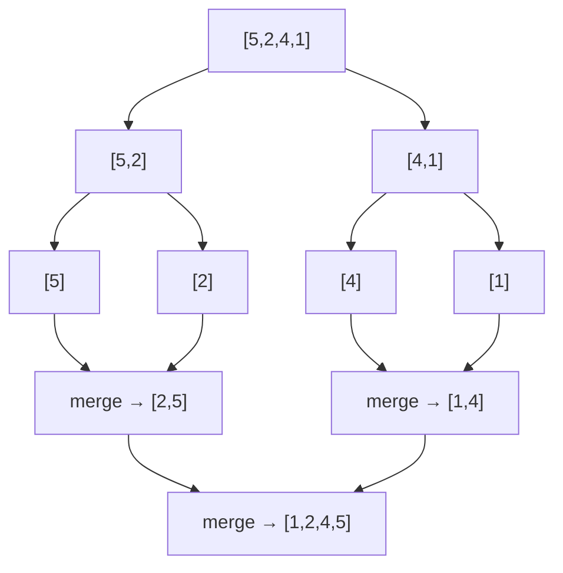
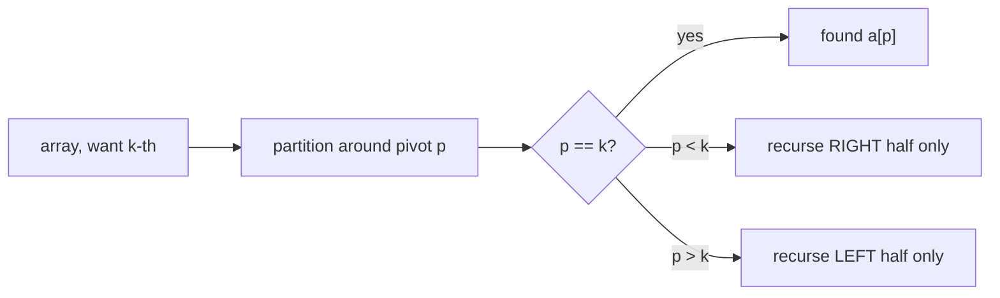

# Sorting Algorithms & Selection

Sorting is the single most reused primitive in coding interviews. Half the time the
"trick" to a problem is *"sort first, then the structure becomes obvious"* (Merge
Intervals, Largest Number, Meeting Rooms). The other half is knowing the internals well
enough to answer *"what does the library actually do?"* and *"can you get the k-th element
without sorting everything?"* (Quickselect). This note covers the classic comparison sorts
(their complexity, **stability**, and **in-place**-ness), the non-comparison linear sorts
(counting/radix/bucket) and their constraints, the **Ω(n log n) comparison lower bound**,
what real standard libraries use (**Timsort** for objects, **dual-pivot quicksort** for
primitives), **Quickselect** as the O(n)-average selection pattern, and sorting as a
preprocessing step.

> [!KEY-TAKEAWAY]
> **Comparison sorts cannot beat Θ(n log n)** in the worst case. Merge sort is stable and
> O(n log n) guaranteed but needs O(n) extra space; quicksort is in-place and fastest in
> practice but O(n²) worst case and not stable; heap sort is in-place O(n log n) worst case
> but not stable and cache-unfriendly. Counting/radix/bucket beat the bound by **not
> comparing** — they need bounded/uniform keys. Real libraries: **Timsort** (Java `Arrays.sort`
> for objects, Python `sorted`/`list.sort`) and **dual-pivot quicksort** (Java primitives).
> To find just the k-th element, use **Quickselect: O(n) average**, no full sort.

---

## Two dimensions that define every sort: stability and in-place

Before comparing algorithms, fix two vocabulary words interviewers probe:

- **Stable** — equal keys keep their original relative order. Matters when you sort by a
  secondary key first, then a primary key (multi-key sort), or sort records by one field
  while wanting ties to preserve input order. Merge sort, insertion sort, bubble sort,
  counting sort, and radix sort are stable. Quicksort, heap sort, and selection sort are
  **not** stable (in their standard in-place forms).
- **In-place** — uses O(1) or O(log n) auxiliary space (recursion stack aside), mutating
  the input array. Quicksort, heap sort, insertion/selection/bubble are in-place. Standard
  merge sort is **not** (it needs an O(n) merge buffer).

| Algorithm | Best | Average | Worst | Space (aux) | Stable | In-place |
|---|---|---|---|---|---|---|
| Bubble sort | O(n)\* | O(n²) | O(n²) | O(1) | Yes | Yes |
| Insertion sort | O(n)\* | O(n²) | O(n²) | O(1) | Yes | Yes |
| Selection sort | O(n²) | O(n²) | O(n²) | O(1) | No | Yes |
| Merge sort | O(n log n) | O(n log n) | O(n log n) | O(n) | Yes | No |
| Quicksort | O(n log n) | O(n log n) | **O(n²)** | O(log n)† | No | Yes |
| Heap sort | O(n log n) | O(n log n) | O(n log n) | O(1) | No | Yes |
| Counting sort | O(n+k) | O(n+k) | O(n+k) | O(n+k) | Yes | No |
| Radix sort (LSD) | O(d·(n+k)) | O(d·(n+k)) | O(d·(n+k)) | O(n+k) | Yes | No |
| Bucket sort | O(n+k) | O(n+k) | O(n²) | O(n+k) | Yes‡ | No |

\* Best case O(n) only for the "adaptive" variant that stops early when the array is already
sorted (insertion sort, or bubble sort with an early-exit flag). † Quicksort recursion depth
is O(log n) expected, O(n) worst case unless you recurse into the smaller side first. ‡ Bucket
sort stability depends on the per-bucket sub-sort.

> [!TIP]
> "Best case O(n)" for insertion sort is why it (and hence Timsort) shines on **nearly
> sorted** data — each element moves only a few slots. Interviewers love "what sort would you
> use if the array is almost sorted?" → insertion sort / Timsort.

---

## Bubble, insertion, selection sort (the O(n²) trio)

All three are quadratic, in-place, and only appropriate for **small n** or (insertion) **nearly
sorted** input — but their differences are frequent trivia.

- **Bubble sort** — repeatedly swap adjacent out-of-order pairs; the largest "bubbles" to the
  end each pass. Stable. With an early-exit flag, O(n) on already-sorted input. Almost never the
  right real answer, but the canonical teaching sort.
- **Insertion sort** — grow a sorted prefix; take the next element and shift it left into place.
  Stable, adaptive: **O(n) on nearly-sorted**, O(n²) worst. This is why library sorts (Timsort)
  fall back to insertion sort for small runs (typically ≤ 32–64 elements) — low constant factors
  and great cache behavior beat asymptotics at small n.
- **Selection sort** — repeatedly select the minimum of the unsorted suffix and swap it into
  place. Always O(n²) (no adaptivity), **not stable**, but makes the **fewest swaps** (O(n)),
  which matters if a write/swap is far more expensive than a compare.

```text
insertion sort, one step:  sorted=[2,5,9]  next=4
  shift 9,5 right, drop 4 →  [2,4,5,9]
```

---

## Merge sort (stable, O(n log n), divide-and-conquer)

**Idea:** split the array in half, recursively sort each half, then **merge** the two sorted
halves in linear time. The recurrence T(n) = 2T(n/2) + O(n) solves to **Θ(n log n)** by the
Master Theorem — in *all* cases (best/avg/worst), because the split is always balanced.

```python
def merge_sort(a):
    if len(a) <= 1:
        return a
    mid = len(a) // 2
    left, right = merge_sort(a[:mid]), merge_sort(a[mid:])
    return merge(left, right)

def merge(l, r):
    out, i, j = [], 0, 0
    while i < len(l) and j < len(r):
        if l[i] <= r[j]:        # <= keeps it STABLE (left wins ties)
            out.append(l[i]); i += 1
        else:
            out.append(r[j]); j += 1
    out.extend(l[i:]); out.extend(r[j:])
    return out
```

**Properties:** stable (take from the left half on ties), O(n log n) guaranteed, but **O(n)
auxiliary space** for the merge buffer — the main downside vs quicksort. Merge sort is the
natural choice for **linked lists** (O(1) extra space merge via pointer relinking, no random
access needed — see *Sort List*) and for **external sorting** (data too big for RAM: sort
chunks, merge streams). Counting inversions and many divide-and-conquer problems piggyback on
the merge step.



---

## Quicksort (in-place, O(n log n) avg / O(n²) worst, pivot & partition)

**Idea:** pick a **pivot**, **partition** the array so everything ≤ pivot is left and
everything > pivot is right (pivot lands in its final sorted position), then recurse on both
sides. No merge step — the work is in the partition.

```python
def quicksort(a, lo, hi):
    if lo >= hi: return
    p = partition(a, lo, hi)     # Lomuto: pivot = a[hi]
    quicksort(a, lo, p - 1)
    quicksort(a, p + 1, hi)

def partition(a, lo, hi):
    pivot = a[hi]; i = lo
    for j in range(lo, hi):
        if a[j] <= pivot:
            a[i], a[j] = a[j], a[i]; i += 1
    a[i], a[hi] = a[hi], a[i]
    return i
```

**Complexity:** each good partition halves the problem → T(n)=2T(n/2)+O(n)=**O(n log n)**
average. But a **bad pivot** (e.g. always the min/max, which happens with a naive "last element"
pivot on already-sorted input) gives partitions of size 0 and n−1 → T(n)=T(n−1)+O(n)=**O(n²)**.

**Mitigations interviewers want:**
- **Randomized pivot** or **median-of-three** (median of first/mid/last) → makes worst case
  astronomically unlikely, defeats adversarial sorted/reverse-sorted input.
- Recurse into the **smaller** partition first (or use tail recursion) → bounds stack to O(log n).
- **3-way partition (Dutch National Flag)** → groups `< = >` in one pass; O(n) on arrays with
  **many duplicate keys** (avoids re-partitioning equal elements). This is exactly the *Sort
  Colors* problem.

Quicksort is **in-place** (O(log n) stack) and typically the **fastest comparison sort in
practice** (excellent cache locality, low constants) — but **not stable** and O(n²) worst case.

---

## Heap sort (in-place, O(n log n) worst, not stable)

**Idea:** build a **max-heap** in place over the array, then repeatedly swap the root (current
max) to the end and sift-down the reduced heap. Uses the array-as-heap layout: node `i`'s
children are `2i+1` and `2i+2`.

- **Build-heap:** sift-down from the last internal node upward → **O(n)** (tighter than the naive
  O(n log n); most nodes are near the leaves and sift down cheaply).
- **Sort phase:** n swaps, each followed by an O(log n) sift-down → **O(n log n)**.

**Properties:** O(n log n) **worst-case guaranteed** (unlike quicksort), **in-place** O(1) aux,
but **not stable** and **poor cache locality** (jumps around the array), so it's usually slower
in practice than quicksort. Its guaranteed bound + O(1) space is why it's used as the fallback in
**introsort** (C++ `std::sort`: start quicksort, switch to heap sort when recursion depth exceeds
~2·log n to escape the O(n²) trap).

---

## Non-comparison sorts: counting, radix, bucket (linear, with constraints)

Comparison sorts are stuck at Ω(n log n). These break the bound by **not comparing keys** —
instead they use the key values as **array indices**. The catch: they need **bounded or
structured keys**.

- **Counting sort** — count occurrences of each key in range `[0, k)`, then compute prefix sums
  to place each element directly. **O(n + k)** time and space; **stable** if you iterate the
  input right-to-left when placing. Great when `k = O(n)` (small integer range); useless when `k`
  is huge (sorting 32-bit ints directly needs a 4-billion-entry array).
- **Radix sort (LSD)** — stable-counting-sort the numbers one digit at a time, least-significant
  digit first. **O(d·(n + b))** for d digits in base b. Turns "large range" into "few passes over
  small ranges." Requires a stable inner sort (counting) to be correct.
- **Bucket sort** — scatter n elements into `~n` buckets by value range, sort each bucket, concat.
  **O(n)** expected when input is **uniformly distributed**; degrades to **O(n²)** if everything
  lands in one bucket. Good for uniform floats in [0,1).

> [!WARNING]
> Non-comparison sorts are **not free lunch**. They assume the keys fit an integer range /
> digit structure / uniform distribution. If an interviewer says "sort arbitrary comparable
> objects" or "the range is unbounded," you're back to O(n log n) comparison sorting.

---

## Why comparison sorts are Ω(n log n): the decision-tree lower bound

Any comparison sort's execution is a **binary decision tree**: each internal node is one
comparison (`a[i] < a[j]?`), each leaf a distinct output permutation. To sort correctly, the
tree must have **at least n! leaves** (one per possible permutation). A binary tree with L leaves
has height ≥ log₂(L). So the worst-case number of comparisons (tree height) is:

```text
h ≥ log₂(n!)  and by Stirling  log₂(n!) = Θ(n log n)
```

Therefore **no comparison-based sort can do better than Θ(n log n) comparisons in the worst
case.** This is why merge/heap sort are asymptotically optimal, and why linear sorts must abandon
comparison entirely.

---

## What real libraries actually use (Timsort & dual-pivot quicksort)

A very common senior question: *"What does `Collections.sort` / `sorted()` do internally?"*

- **Timsort** — a hybrid **stable** merge sort + insertion sort by Tim Peters. Used by **Python**
  (`sorted`, `list.sort`) and **Java** (`Arrays.sort` for **object** arrays and `Collections.sort`).
  It finds already-sorted **runs**, extends short runs with insertion sort (≤ 32–64 elems), and
  merges runs with galloping. **O(n) on already-sorted / nearly-sorted** data, O(n log n) worst,
  stable, O(n) space. Chosen for objects because stability is a contract and real data has runs.
- **Dual-pivot quicksort** (Yaroslavskiy) — Java's `Arrays.sort` for **primitive** arrays (`int[]`,
  `long[]`, …). Two pivots split into three regions per pass; in-place, cache-friendly, and fast.
  Stability doesn't matter for primitives (equal ints are indistinguishable), so the non-stable but
  faster quicksort family is fine.
- **Introsort** — C++ `std::sort`: quicksort with median-of-three, switching to heap sort when
  recursion is too deep (guarantees O(n log n)) and insertion sort for tiny subarrays.

> [!INTERVIEW]
> Crisp answer: **"Java sorts objects with Timsort (stable, adaptive, O(n log n)); it sorts
> primitives with dual-pivot quicksort (in-place, not stable, but stability is meaningless for
> primitives). Python uses Timsort. C++ uses introsort."** That one sentence signals you know the
> stability-vs-speed trade-off drives the choice.

---

## Quickselect: O(n)-average selection (the k-th element pattern)

**Recognition signal:** "find the **k-th largest / smallest**" or "find the **median**" —
**without** needing the whole array sorted. Sorting is O(n log n); Quickselect gets the answer in
**O(n) average**.

**Idea:** run quicksort's **partition**, but only recurse into the **one side** that contains the
k-th index. Each pass discards a chunk, so the expected work is n + n/2 + n/4 + … = **O(n)**.

```python
def quickselect(a, k):            # k-th smallest, 0-indexed
    lo, hi = 0, len(a) - 1
    while lo <= hi:
        p = partition(a, lo, hi)  # random pivot in practice
        if p == k: return a[p]
        if p < k:  lo = p + 1
        else:      hi = p - 1
```

- **Average O(n)**, **worst O(n²)** (adversarial pivots) — randomize the pivot to make worst case
  negligible. **Median-of-medians** guarantees worst-case O(n) but has large constants and is rarely
  coded in interviews; know its name.
- Alternative for *Kth Largest*: a **min-heap of size k** → O(n log k) time, O(k) space. Better when
  k is small, data streams in, or you can't mutate/reorder the array. Quickselect wins when you have
  the full array in memory and want the best average time.



---

## Sorting as a preprocessing step (the meta-pattern)

Many problems have no obvious structure until you **sort first**, after which a linear scan or
two-pointer sweep finishes the job. Spend the O(n log n) up front to make the rest trivial.

- **Merge Intervals / Meeting Rooms** — sort by start time, then sweep: overlaps become adjacent.
- **Largest Number** — sort strings by a custom comparator (`a+b vs b+a`), then concatenate.
- **Two Sum (sorted) / 3Sum** — sort, then two-pointer inward to hit a target in O(n) per anchor.
- **Group anagrams** — sort each word's letters to get a canonical key.
- **Detect duplicates / closest pair** — sort so equal/near elements sit next to each other.

> [!TIP]
> If you're stuck and the answer doesn't depend on the original order, **ask "does sorting
> help?"** It's the cheapest first move and unlocks a huge fraction of array/interval problems.

---

## Interview Problems

Grouped by the sub-skill they drill. Sort-as-preprocessing, partition/selection, and
merge-based problems dominate.

**Partition / Dutch flag / selection**
- [Sort Colors](https://leetcode.com/problems/sort-colors/) — Medium — Dutch National Flag 3-way partition, one pass O(n)
- [Kth Largest Element in an Array](https://leetcode.com/problems/kth-largest-element-in-an-array/) — Medium — Quickselect O(n) avg (or min-heap of size k)
- [K Closest Points to Origin](https://leetcode.com/problems/k-closest-points-to-origin/) — Medium — Quickselect / heap selection by distance
- [Wiggle Sort II](https://leetcode.com/problems/wiggle-sort-ii/) — Medium — Quickselect the median, then 3-way partition placement

**Merge-based / sort a list**
- [Merge Sorted Array](https://leetcode.com/problems/merge-sorted-array/) — Easy — the merge step of merge sort, in place from the back
- [Sort List](https://leetcode.com/problems/sort-list/) — Medium — merge sort on a linked list, O(1) extra space
- [Merge k Sorted Lists](https://leetcode.com/problems/merge-k-sorted-lists/) — Hard — k-way merge with a min-heap
- [Count of Smaller Numbers After Self](https://leetcode.com/problems/count-of-smaller-numbers-after-self/) — Hard — count inversions during merge sort

**Sort-first preprocessing (intervals & custom order)**
- [Merge Intervals](https://leetcode.com/problems/merge-intervals/) — Medium — sort by start, sweep and merge overlaps
- [Insert Interval](https://leetcode.com/problems/insert-interval/) — Medium — sorted intervals, linear merge
- [Meeting Rooms II](https://leetcode.com/problems/meeting-rooms-ii/) — Medium — sort starts/ends (or heap) to count concurrent meetings
- [Non-overlapping Intervals](https://leetcode.com/problems/non-overlapping-intervals/) — Medium — sort by end, greedy interval scheduling
- [Largest Number](https://leetcode.com/problems/largest-number/) — Medium — custom comparator sort (`a+b` vs `b+a`)

**Top-K & frequency**
- [Top K Frequent Elements](https://leetcode.com/problems/top-k-frequent-elements/) — Medium — bucket sort by frequency, or heap
- [Sort Characters By Frequency](https://leetcode.com/problems/sort-characters-by-frequency/) — Medium — counting/bucket sort by frequency
- [Maximum Gap](https://leetcode.com/problems/maximum-gap/) — Hard — bucket/radix sort to beat O(n log n)

---

## Common follow-up questions

- **"Which sort would you use for nearly-sorted data / small arrays?"** Insertion sort (adaptive,
  O(n) best, tiny constants) — which is exactly why Timsort uses it for short runs.
- **"Merge sort vs quicksort — when each?"** Quicksort for in-memory arrays (in-place, fastest
  constants); merge sort when you need **stability**, are sorting a **linked list**, or doing
  **external sorting**. Quicksort risks O(n²); merge sort guarantees O(n log n) but costs O(n) space.
- **"How do you avoid quicksort's O(n²) worst case?"** Randomized or median-of-three pivot; 3-way
  partition for duplicates; introsort-style fallback to heap sort on deep recursion.
- **"Kth largest — heap or quickselect?"** Heap (size k) → O(n log k), streaming-friendly, doesn't
  mutate input. Quickselect → O(n) average, best when the full array is in memory.
- **"Can you sort in O(n)?"** Only non-comparison sorts, and only with bounded integer keys
  (counting/radix) or uniform distribution (bucket). Otherwise Ω(n log n) by the decision-tree bound.
- **"Is Java's `Arrays.sort` stable?"** For **objects** yes (Timsort); for **primitives** it's
  dual-pivot quicksort (not stable, but irrelevant for primitives).
- **"Why is heap sort rarely the default despite O(n log n) worst case?"** Poor cache locality and
  higher constants than quicksort; not stable.

## References

- Cormen, Leiserson, Rivest, Stein — *Introduction to Algorithms* (CLRS), 3rd/4th ed.: Ch. 2
  (insertion/merge), Ch. 6 (heapsort), Ch. 7 (quicksort), Ch. 8 (lower bound, counting/radix/bucket),
  Ch. 9 (medians & order statistics / Quickselect & median-of-medians).
- Sedgewick & Wayne — *Algorithms*, 4th ed.: sorting chapters, 3-way quicksort, Dutch flag.
- Java Platform docs — `java.util.Arrays.sort` / `Collections.sort` (Timsort for objects,
  dual-pivot quicksort for primitives).
- Python docs — `list.sort` / `sorted` and the CPython `listsort.txt` (Timsort description).
- Yaroslavskiy, Bloch, Bentley — "Dual-Pivot Quicksort" (the algorithm behind Java primitive sort).
