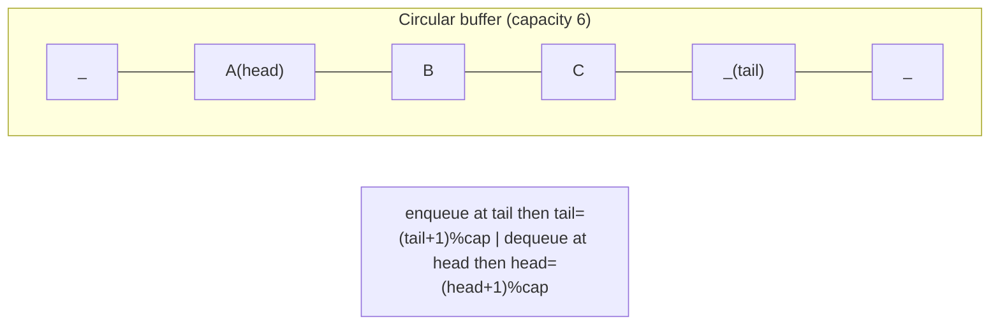
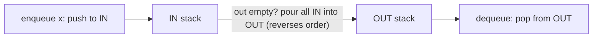

# Stacks, Queues & Monotonic Stack

Stacks and queues are the two simplest **linear, restricted-access** containers: you
only touch the ends. That restriction is exactly what makes them powerful — it maps
directly onto recursion/backtracking (LIFO), level-order processing (FIFO), and a family
of O(n) array problems solved by the **monotonic stack/deque** pattern (next-greater,
histogram, sliding-window max). This topic covers how each is actually implemented under
the hood, their per-operation complexity, and the recognition signals for the patterns
they unlock.

> [!KEY-TAKEAWAY]
> A stack is "process most-recent-first"; a queue is "process oldest-first". A
> **monotonic** stack/queue keeps its contents sorted so that the element you pop is
> always the answer to "what is the next greater/smaller thing?" — turning an O(n²)
> brute force into O(n) amortized.

## Stack internals (LIFO)

A **stack** is a Last-In-First-Out container: `push` adds to the top, `pop` removes the
top, `peek`/`top` reads it without removing. Every operation touches only one end, so all
are **O(1)**.

Two standard implementations:

| Backing | push | pop | peek | Memory layout | Notes |
|---|---|---|---|---|---|
| **Dynamic array** (`ArrayDeque`, Python `list`, C++ `std::stack` over `deque`/`vector`) | O(1) amortized | O(1) | O(1) | Contiguous block + a `top`/`size` index | Occasional O(n) resize (double capacity) → amortized O(1); cache-friendly |
| **Singly linked list** | O(1) worst | O(1) | O(1) | Node = {value, next}; head = top | No resize spikes, but a pointer + allocation per element; poor cache locality |

The **array-backed** version is preferred in practice: append/remove-last on a growable
array is amortized O(1) (geometric resizing means the total cost of n pushes is O(n)), and
the contiguous memory is cache-friendly. The linked version guarantees true O(1) worst
case with no resize pause, at the cost of an allocation and a `next` pointer per node.

> [!WARNING]
> In Java, **do not** use the legacy `java.util.Stack` class — it extends `Vector` and is
> synchronized (slow) and exposes the entire List API (you can index into the middle,
> violating the abstraction). Use `Deque<T> stack = new ArrayDeque<>()` with
> `push`/`pop`/`peek`. `ArrayDeque` is also faster than `LinkedList` for this.

**What is the stack good for?**

- **Reversal / most-recent semantics** — undo/redo, browser back button.
- **Balanced-symbol matching** — parentheses, HTML tags, expression validity.
- **Expression evaluation** — RPN / postfix eval, infix→postfix (shunting-yard).
- **DFS without recursion** — an explicit stack replaces the call stack.
- **The function call stack itself** — each call frame (locals, return address) is pushed;
  deep/infinite recursion overflows it (`StackOverflowError`).

```python
stack = []
stack.append(x)      # push  O(1) amortized
top = stack[-1]      # peek  O(1)
val = stack.pop()    # pop   O(1)
empty = not stack
```

## Queue internals (FIFO)

A **queue** is First-In-First-Out: `enqueue`/`offer` adds to the back, `dequeue`/`poll`
removes from the front. Both must be **O(1)**, which rules out the naive "array + shift
everything left on dequeue" (that dequeue is O(n)).

Two correct implementations:

- **Circular buffer (ring buffer)** — a fixed/growable array with `head` and `tail`
  indices that wrap around modulo capacity. Enqueue writes at `tail`, advances
  `tail = (tail + 1) % cap`; dequeue reads at `head`, advances `head`. No element ever
  moves, so both ops are O(1). This is how `ArrayDeque` works internally.
- **Singly linked list with head and tail pointers** — dequeue from head, enqueue at tail.
  Both O(1); the tail pointer is what avoids an O(n) walk to the end.

| Operation | Circular array | Linked list |
|---|---|---|
| enqueue (offer) | O(1) amortized | O(1) |
| dequeue (poll) | O(1) | O(1) |
| peek front | O(1) | O(1) |
| space | O(n), one array | O(n), node overhead per element |



> [!WARNING]
> Do not implement a queue as `ArrayList` with `remove(0)` (or Python `list.pop(0)`) —
> that shifts every remaining element, making dequeue **O(n)** and the whole loop O(n²).
> Use a real deque: Java `ArrayDeque`, Python `collections.deque` (`popleft()` is O(1)).

## Deque (double-ended queue)

A **deque** supports O(1) insert/remove at **both** ends (`addFirst/addLast`,
`removeFirst/removeLast`). It generalizes both stack and queue and is the backing
structure for the monotonic-deque pattern below.

- Implemented as a **growable circular array** (Java `ArrayDeque`) or a doubly linked list.
- Use it as a stack (`addLast`/`removeLast`) or a queue (`addLast`/`removeFirst`) — one
  class covers both.
- Python: `collections.deque` — `append`, `appendleft`, `pop`, `popleft`, all O(1). Also
  supports `maxlen` for a fixed-size sliding buffer.

## Min-Stack (auxiliary-stack pattern)

**Problem:** support `push`, `pop`, `top`, and `getMin` all in **O(1)**. A single stack
can't answer "min so far" in O(1) after arbitrary pops.

**Technique — maintain a second stack of running minimums** synchronized with the main
stack. When you push `x`, push `min(x, currentMin)` onto the min-stack. When you pop, pop
both. `getMin` = top of min-stack.

```python
class MinStack:
    def __init__(self):
        self.s = []          # values
        self.mins = []       # running minimum, parallel to s
    def push(self, x):
        self.s.append(x)
        self.mins.append(x if not self.mins else min(x, self.mins[-1]))
    def pop(self):
        self.mins.pop(); return self.s.pop()
    def top(self):    return self.s[-1]
    def getMin(self): return self.mins[-1]   # O(1)
```

- All four operations are **O(1)**; extra space is **O(n)**.
- **Space optimization:** store only the values that were the minimum at push time (a
  strictly non-increasing auxiliary stack), or encode deltas from the current min so you
  don't store a full copy per element. If you take the "push only new minimums" route, get
  the two edge cases right: **push** onto the min-stack with `<=` (not `<`) so a repeated
  minimum is recorded, and on **pop** only pop the min-stack *when the popped value equals
  `mins[-1]`*. Skip either condition and a duplicate minimum makes `getMin` wrong after a
  pop — the classic bug. The parallel-stack version above sidesteps all of this and is the
  one to reach for in an interview — it's simplest and correct.

## Two stacks as a queue (and vice versa)

**Queue using two stacks** — an `in` stack and an `out` stack.
- `enqueue`: push onto `in`.
- `dequeue`: if `out` is empty, **pour** all of `in` into `out` (which reverses order, so
  the oldest element is now on top), then pop from `out`.
- Each element is moved at most twice (into `in`, then into `out`), so despite the
  occasional O(n) transfer, `dequeue` is **amortized O(1)**.



**Worked trace — the amortized pour.** Run `enqueue 1, 2, 3`, then
`dequeue, dequeue, enqueue 4, dequeue` (IN top is on the right, OUT top on the right):

| Op | IN | OUT | Work | Returns |
|---|---|---|---|---|
| enqueue 1 | `[1]` | `[]` | O(1) push | — |
| enqueue 2 | `[1,2]` | `[]` | O(1) push | — |
| enqueue 3 | `[1,2,3]` | `[]` | O(1) push | — |
| dequeue | `[]` | `[3,2,1]` | OUT empty → **pour 3** (O(n)), pop | **1** |
| dequeue | `[]` | `[3,2]` | OUT non-empty → just pop | **2** |
| enqueue 4 | `[4]` | `[3,2]` | O(1) push (OUT untouched) | — |
| dequeue | `[4]` | `[3]` | OUT still has 2 → pop it | **3** |

The single expensive pour (moving 3 elements) happened once and its cost is spread across
the three cheap dequeues that drain OUT. Element 1 was touched twice total (push to IN, pour
to OUT); 4 is still sitting in IN having been touched once. Over any sequence, each element
crosses the pour boundary at most once → **amortized O(1)**.

**Stack using two queues** — one queue, and on each `push` rotate so the newest element
sits at the front (making one of push or pop O(n)). This is the mirror trick; the
two-stacks-as-a-queue direction is the more common interview question because of its
elegant amortized-O(1) analysis.

> [!INTERVIEW]
> "Implement Queue using Stacks" is really a test of **amortized analysis**. Say the words:
> "each element is pushed to `in` once and moved to `out` at most once, so the total work
> over n dequeues is O(n) → amortized O(1) per op," even though a single dequeue can be O(n).

## Monotonic stack pattern

A **monotonic stack** keeps its elements in sorted order (strictly/weakly increasing or
decreasing) *by discarding* elements that break the order as you push. It is the go-to
tool for **"for each element, find the nearest greater/smaller element to its left/right"**
in **O(n)** total.

**Recognition signals** (reach for a monotonic stack when you see):
- "**next greater / next smaller** element", "previous greater/smaller".
- "How many days until a warmer temperature?" (Daily Temperatures).
- "**Largest rectangle** in a histogram" / "**maximal rectangle**".
- "Trapping rain water", "sum of subarray minimums", "remove k digits to make smallest".
- Anything where a brute force is "for each i, scan left/right until a condition" = O(n²)
  and you suspect the scans overlap.

**Why O(n)?** Each element is **pushed once and popped at most once** across the whole
loop, so total push/pop work is O(n) — even though the inner `while` can pop many at once.

**Template — Next Greater Element to the right (indices):**

```python
def next_greater(nums):
    n = len(nums)
    res = [-1] * n
    stack = []                      # holds INDICES, values decreasing bottom->top
    for i in range(n):
        while stack and nums[i] > nums[stack[-1]]:
            j = stack.pop()         # nums[i] is j's next greater element
            res[j] = nums[i]
        stack.append(i)
    return res                      # indices left on stack have no greater element
```

- **Decreasing** stack (pop when the incoming element is **larger**) → finds **next
  greater**. **Increasing** stack → finds **next smaller**.
- Iterate **left→right** for "next … to the right"; **right→left** for "previous … / … to
  the left".
- Store **indices**, not values, so you can also compute distances (Daily Temperatures) or
  widths (histogram).

**Worked example — Daily Temperatures** `[73,74,75,71,69,72,76,73]` → answer
`[1,1,4,2,1,1,0,0]` (days to wait for a warmer day). Keep a stack of **indices** with
decreasing temperatures; when today is warmer than the stack top, pop and record
`i - poppedIndex` as the wait. Tracing it index by index (stack holds indices, temps shown
in parens):

| i | temp | pops (record `i - j`) | stack after | res updated |
|---|---|---|---|---|
| 0 | 73 | — | `[0]` | |
| 1 | 74 | pop 0 → `res[0]=1-0=1` | `[1]` | `res[0]=1` |
| 2 | 75 | pop 1 → `res[1]=2-1=1` | `[2]` | `res[1]=1` |
| 3 | 71 | — (71<75) | `[2,3]` | |
| 4 | 69 | — (69<71) | `[2,3,4]` | |
| 5 | 72 | pop 4 →`res[4]=5-4=1`, pop 3 →`res[3]=5-3=2` (72<75 stop) | `[2,5]` | `res[3]=2, res[4]=1` |
| 6 | 76 | pop 5 →`res[5]=6-5=1`, pop 2 →`res[2]=6-2=4` | `[6]` | `res[2]=4, res[5]=1` |
| 7 | 73 | — (73<76) | `[6,7]` | |

Indices 6 and 7 never get popped (no warmer day follows), so they keep the initial `0`.
Final `res = [1,1,4,2,1,1,0,0]`.

**Largest Rectangle in a Histogram** is the flagship: use an **increasing** stack of bar
indices; when a shorter bar arrives, pop taller bars and compute the area each can form as
the shortest bar. The width formula is the part everyone gets wrong — after popping bar `h`,
the rectangle of height `heights[h]` extends **right up to (but not including) `i`** and
**left down to (but not including) the new stack top**, so:

```python
def largestRectangleArea(heights):
    stack = []                              # indices, heights increasing bottom->top
    best = 0
    for i, h in enumerate(heights + [0]):   # sentinel 0 flushes the stack at the end
        while stack and heights[stack[-1]] > h:
            top = stack.pop()               # this bar can't extend past i
            left = stack[-1] if stack else -1
            width = i - left - 1            # <-- the crux formula
            best = max(best, heights[top] * width)
        stack.append(i)
    return best
```

**Numeric trace on `heights=[2,1,5,6,2,3]`** (append sentinel `0`, so the loop sees
`[2,1,5,6,2,3,0]`). Stack holds indices:

| i | h | pops → `heights[top] * (i - left - 1)` | stack after | best |
|---|---|---|---|---|
| 0 | 2 | — | `[0]` | 0 |
| 1 | 1 | pop 0: `2 * (1 - (-1) - 1) = 2*1 = 2` | `[1]` | 2 |
| 2 | 5 | — | `[1,2]` | 2 |
| 3 | 6 | — | `[1,2,3]` | 2 |
| 4 | 2 | pop 3: `6*(4-2-1)=6`; pop 2: `5*(4-1-1)=10` | `[1,4]` | **10** |
| 5 | 3 | — | `[1,4,5]` | 10 |
| 6 | 0 | pop 5:`3*(6-4-1)=3`; pop 4:`2*(6-1-1)=8`; pop 1:`1*(6-(-1)-1)=6` | `[]` | 10 |

Answer **10** — the `5,6` pair widened to width 2 at height 5. Note when the stack is empty
after a pop, `left = -1`, so `width = i - (-1) - 1 = i` (the bar reaches all the way to the
left edge). The sentinel `0` at `i=6` guarantees every remaining bar gets popped and costed.

**Two more variants the recognition list names.** *Next Greater Element II* (circular):
iterate `i` from `0..2n-1` and read `nums[i % n]`, but only **push** indices while `i < n`
— the second pass just lets earlier bars find a greater element that wraps around. *Trapping
Rain Water* has a monotonic-stack form: keep a **decreasing** stack; when a taller bar `i`
arrives, pop the bottom `mid`, and the water it caps is
`(min(heights[left], heights[i]) - heights[mid]) * (i - left - 1)` where `left` is the new
top — though the **two-pointer** solution (O(1) space) is usually preferred in interviews.

> [!WARNING]
> **Strict vs non-strict (`>` vs `>=`) is not cosmetic — it decides how ties are handled.**
> A `while heights[stack[-1]] > h` (strict) leaves *equal* bars on the stack; `>=`
> (non-strict) pops them. For plain next-greater this only shifts which duplicate matches,
> but for **span-counting** problems it controls double-counting. In *Sum of Subarray
> Minimums* you must use **asymmetric** strictness — e.g. treat the previous-smaller
> boundary as strictly-smaller (`<`) and the next-smaller boundary as smaller-or-equal
> (`<=`). That way a run of equal minima is attributed to exactly one bar; make both sides
> strict (or both non-strict) and subarrays whose minimum is a duplicated value get counted
> twice or zero times. Rule of thumb: **break ties toward one side only.**

## Monotonic deque (sliding-window maximum)

For **Sliding Window Maximum / Minimum** you need the max of every length-k window in O(n).
A heap gives O(n log k); a **monotonic deque** gives **O(n)**.

**Technique:** maintain a deque of **indices** whose values are **decreasing** front→back.
- Before adding index `i`, pop from the **back** while `nums[back] <= nums[i]` (those can
  never be the max while `i` is in the window — `i` is newer and bigger).
- Pop from the **front** if it has slid out of the window (`front <= i - k`).
- The **front** of the deque is always the index of the current window's maximum.

```python
from collections import deque
def maxSlidingWindow(nums, k):
    dq, res = deque(), []            # dq holds indices, values decreasing
    for i, x in enumerate(nums):
        while dq and nums[dq[-1]] <= x:
            dq.pop()                 # discard smaller-or-equal from back
        dq.append(i)
        if dq[0] <= i - k:
            dq.popleft()             # drop indices that left the window
        if i >= k - 1:
            res.append(nums[dq[0]])  # front = window max
    return res
```

- **O(n)** time (each index enters and leaves the deque once), **O(k)** space.
- Flip the comparison (`>=`) for sliding-window **minimum**.

## Complexity summary

| Structure / op | Time | Notes |
|---|---|---|
| Stack push/pop/peek | O(1) (amortized on array) | resize doubling → amortized O(1) |
| Queue enqueue/dequeue | O(1) | circular buffer or linked; never `list.pop(0)` |
| Deque both ends | O(1) | `ArrayDeque` / `collections.deque` |
| Min-Stack all ops | O(1) time, O(n) space | parallel min-stack |
| Queue-from-2-stacks dequeue | amortized O(1) | each element moved ≤ 2× |
| Monotonic stack (next greater/smaller) | O(n) total | each element pushed/popped once |
| Sliding-window max (monotonic deque) | O(n) | vs heap O(n log k) |

## Interview Problems

Grouped by the technique they drill. All are canonical, frequently-asked problems.

**Stack — matching, evaluation, design**
- [Valid Parentheses](https://leetcode.com/problems/valid-parentheses/) — Easy — stack to match opening/closing brackets
- [Min Stack](https://leetcode.com/problems/min-stack/) — Medium — auxiliary min-stack for O(1) getMin
- [Evaluate Reverse Polish Notation](https://leetcode.com/problems/evaluate-reverse-polish-notation/) — Medium — stack-based postfix evaluation
- [Basic Calculator](https://leetcode.com/problems/basic-calculator/) — Hard — stack for parentheses and signs
- [Basic Calculator II](https://leetcode.com/problems/basic-calculator-ii/) — Medium — stack for operator precedence
- [Simplify Path](https://leetcode.com/problems/simplify-path/) — Medium — stack of path components
- [Decode String](https://leetcode.com/problems/decode-string/) — Medium — two stacks for counts and strings
- [Backspace String Compare](https://leetcode.com/problems/backspace-string-compare/) — Easy — stack (or two-pointer) to apply backspaces
- [Remove All Adjacent Duplicates In String](https://leetcode.com/problems/remove-all-adjacent-duplicates-in-string/) — Easy — stack collapses adjacent pairs

**Queue / deque design**
- [Implement Queue using Stacks](https://leetcode.com/problems/implement-queue-using-stacks/) — Easy — two-stacks, amortized O(1) dequeue
- [Implement Stack using Queues](https://leetcode.com/problems/implement-stack-using-queues/) — Easy — queue rotation trick
- [Design Circular Queue](https://leetcode.com/problems/design-circular-queue/) — Medium — ring buffer with head/tail indices

**Monotonic stack / deque**
- [Daily Temperatures](https://leetcode.com/problems/daily-temperatures/) — Medium — monotonic decreasing stack of indices
- [Next Greater Element I](https://leetcode.com/problems/next-greater-element-i/) — Easy — monotonic stack next-greater map
- [Next Greater Element II](https://leetcode.com/problems/next-greater-element-ii/) — Medium — monotonic stack on a circular array
- [Largest Rectangle in Histogram](https://leetcode.com/problems/largest-rectangle-in-histogram/) — Hard — increasing monotonic stack of bar indices
- [Maximal Rectangle](https://leetcode.com/problems/maximal-rectangle/) — Hard — histogram trick per row + monotonic stack
- [Trapping Rain Water](https://leetcode.com/problems/trapping-rain-water/) — Hard — monotonic stack (or two-pointer) for trapped water
- [Sliding Window Maximum](https://leetcode.com/problems/sliding-window-maximum/) — Hard — monotonic deque of indices, O(n)
- [Car Fleet](https://leetcode.com/problems/car-fleet/) — Medium — sort by position + stack of arrival times
- [Remove K Digits](https://leetcode.com/problems/remove-k-digits/) — Medium — monotonic increasing stack, greedy
- [Sum of Subarray Minimums](https://leetcode.com/problems/sum-of-subarray-minimums/) — Medium — monotonic stack, previous/next-smaller spans
- [Online Stock Span](https://leetcode.com/problems/online-stock-span/) — Medium — monotonic stack tracking spans

## Common follow-up questions

- Why `ArrayDeque` over `Stack`/`LinkedList` in Java? `java.util.Stack` is a legacy
  synchronized `Vector` subclass that leaks the List API; `LinkedList` allocates a node per
  element with poor cache locality. `ArrayDeque` is an unsynchronized growable circular
  array — faster and the recommended stack/queue implementation.
- How is `enqueue`/`dequeue` O(1) if the array is fixed size? Circular indexing: `head`
  and `tail` wrap modulo capacity, so no element is shifted. When full, the buffer doubles
  (amortized O(1)).
- Prove the two-stack queue is amortized O(1). Aggregate/accounting method: each element
  is pushed to `in` once and transferred to `out` at most once, so n dequeues do O(n) total
  work regardless of interleaving.
- When monotonic stack vs monotonic deque? Stack for next-greater/smaller *per element*
  (unbounded reach); deque when there's a **window** constraint (max/min over a moving
  window of size k), because you must also evict from the front as the window slides.
- Monotonic deque vs heap for sliding-window max? Deque is O(n) and never stores stale
  values; a heap is O(n log k) and needs lazy deletion to skip out-of-window entries.
- Why store indices, not values, on the stack? Indices let you recover distances (Daily
  Temperatures) and widths (histogram) and handle duplicates/circular arrays cleanly.
- What causes `StackOverflowError` and how do you avoid it? Recursion deeper than the
  call-stack limit; convert to an explicit stack (iterative DFS) or use tail-recursion/
  iteration.

## References

- CLRS, *Introduction to Algorithms* (3rd/4th ed.), §10.1 "Stacks and Queues" — array
  implementations and O(1) operations.
- Java Platform SE docs: `java.util.Deque`, `java.util.ArrayDeque` (recommended over
  `Stack`), `java.util.Queue`.
- Python docs: `collections.deque` (O(1) `append`/`popleft`) and the `list` data model.
- Sedgewick & Wayne, *Algorithms* (4th ed.) — resizing-array and linked-list stack/queue,
  amortized analysis.
- Competitive Programmer's Handbook (Laaksonen) — monotonic stack and sliding-window
  deque techniques.
