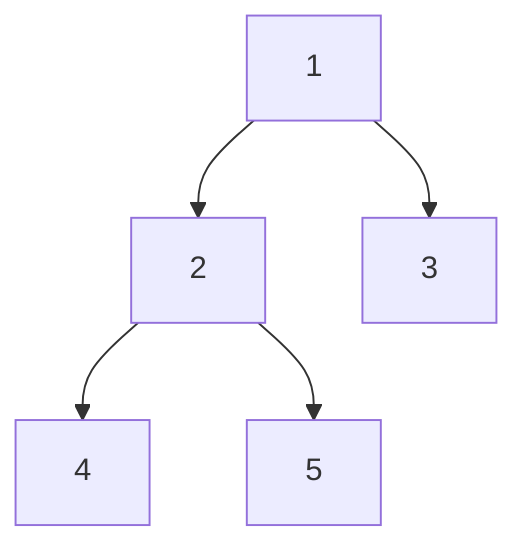
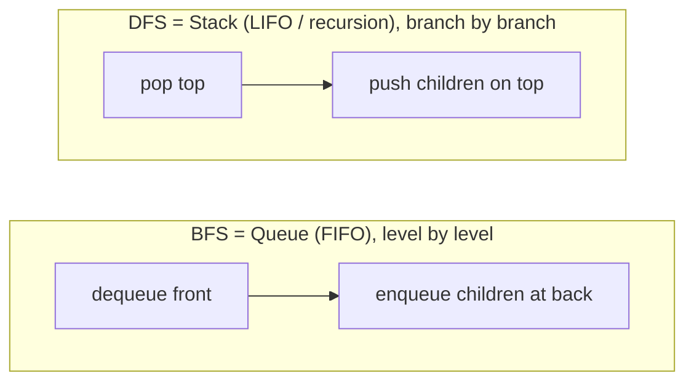
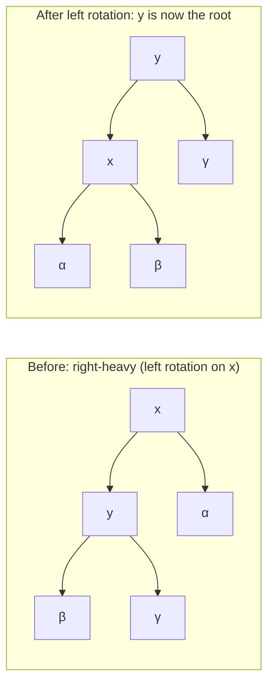

# Trees, BST & Traversals

Trees are the first *recursive* data structure most interviewers reach for, and they
appear in an enormous share of SDE rounds — Invert a Tree, LCA, Validate BST,
Serialize/Deserialize, Level Order. The unlock is realising that almost every tree
problem is solved by **recursion**: define what one node should return given the
answers from its children, and the recursion writes itself. This note leads with the
tree/BST **structure and invariants** (memory layout, height vs depth, balance), then
the three DFS traversals and BFS, then the BST ordering invariant and why balancing
matters, and finally the patterns (tree DP, LCA, serialize) with the canonical problems.

> [!KEY-TAKEAWAY]
> A binary tree node is `{ val, left, right }` — just two pointers. Every classic
> problem is either a **traversal** (visit every node in some order) or a **bottom-up
> return** (each node computes an answer from its subtrees). Pick the traversal order
> or the return value, and the code is short.

## Binary tree structure and terminology

A **binary tree** is a set of nodes where each node holds a value and up to two child
pointers. There is no ordering guarantee between parent and child (that extra rule is
what makes a *BST*).

```java
class TreeNode {
    int val;
    TreeNode left;   // may be null
    TreeNode right;  // may be null
}
```

Memory layout: unlike an array or heap, a general binary tree is **pointer-based** —
nodes are scattered on the heap and linked by references. There is no locality
guarantee, and no arithmetic index formula for children (that only works for *complete*
trees stored in an array, e.g. a binary heap).

Core vocabulary (interviewers assume you know these cold):

| Term | Definition |
|---|---|
| **Root** | The single top node with no parent. |
| **Leaf** | A node with no children. |
| **Depth of a node** | Number of edges from the **root** down to that node (root depth 0). |
| **Height of a node** | Number of edges on the **longest path** down to a leaf (leaf height 0). |
| **Height of the tree** | Height of the root. A single node has height 0, empty tree height −1. |
| **Full binary tree** | Every node has **0 or 2** children (never exactly 1). |
| **Complete binary tree** | All levels full except possibly the last, which is filled **left to right** (heap shape). |
| **Perfect binary tree** | All internal nodes have 2 children and all leaves are at the same level. |
| **Balanced (height-balanced)** | For every node, the heights of its two subtrees differ by ≤ 1. |

> [!WARNING]
> Depth and height are measured in opposite directions and are a favourite trip-up.
> Depth counts down from the root; height counts up from the leaves. A common
> off-by-one is defining tree height in *nodes* vs *edges* — state your convention.

Why height matters: nearly every tree operation costs **O(h)** where `h` is the height.
For `n` nodes, `h` ranges from `⌊log₂ n⌋` (perfectly balanced) to `n − 1` (a
degenerate/skewed tree that is really a linked list). This gap — O(log n) vs O(n) — is
the entire motivation for self-balancing trees.

## DFS traversals: preorder, inorder, postorder

Depth-first search dives down one branch fully before backtracking. The three orders
differ only in **when you visit (process) the current node** relative to recursing into
its children:

- **Preorder** — node, then left, then right. *(Root first — use to copy/serialize a tree top-down.)*
- **Inorder** — left, then node, then right. *(For a BST this yields values in **sorted** order.)*
- **Postorder** — left, then right, then node. *(Children first — use to delete a tree or compute bottom-up values like height.)*



For the tree above: preorder = `1 2 4 5 3`, inorder = `4 2 5 1 3`, postorder =
`4 5 2 3 1`.

Recursive template (dead simple — move the "visit" line):

```python
def inorder(node):
    if node is None: return
    inorder(node.left)      # left
    visit(node.val)         # node   ← move this line for pre/postorder
    inorder(node.right)     # right
```

**Complexity:** every traversal is **O(n) time** (each node visited once). Space is
**O(h)** for the recursion stack — O(log n) if balanced, O(n) worst case for a skewed
tree. This recursion-stack space is easy to forget when asked "what's the space
complexity?"

### Iterative traversal with an explicit stack

Interviewers often ask for an iterative version (to show you understand the recursion
uses a stack, and to avoid stack overflow on deep trees).

```python
def inorder_iterative(root):
    stack, cur, out = [], root, []
    while cur or stack:
        while cur:               # go as far left as possible
            stack.append(cur)
            cur = cur.left
        cur = stack.pop()        # backtrack to the deepest unvisited node
        out.append(cur.val)      # visit
        cur = cur.right          # then explore its right subtree
    return out
```

Preorder iteratively is simplest: push root, then loop popping a node, visit it, and
push **right child then left child** (so left is processed first). Postorder is the
trickiest — a common trick is to do a modified preorder (node, right, left) and
**reverse** the result.

> [!TIP]
> **Inorder of a BST is sorted.** This single fact solves "Kth Smallest in a BST"
> (stop after k inorder visits), "Validate BST" (check the inorder sequence is strictly
> increasing), and "Two Sum in a BST." Reach for inorder whenever a BST problem mentions
> order, rank, or a target value.

## BFS level-order traversal

Breadth-first search visits nodes **level by level**, top to bottom, left to right,
using a **queue** (FIFO). This is the go-to when a problem mentions "levels," "closest
to root," "minimum depth," or "right side view."

```python
from collections import deque
def level_order(root):
    if not root: return []
    q, out = deque([root]), []
    while q:
        level = []
        for _ in range(len(q)):      # fix the count BEFORE the loop = one level
            node = q.popleft()
            level.append(node.val)
            if node.left:  q.append(node.left)
            if node.right: q.append(node.right)
        out.append(level)
    return out
```

The **"process one level at a time" trick** — snapshot `len(q)` before the inner loop —
is what lets you group nodes by level (needed for Level Order II, Right Side View,
zigzag, average-per-level).

**Complexity:** O(n) time. Space is **O(w)** where `w` is the maximum width; for a
balanced tree the bottom level holds ~n/2 nodes, so BFS space is **O(n)** worst case —
often *more* than DFS's O(h). Choose DFS when memory matters and you don't need level
grouping.



## Binary Search Tree: the ordering invariant

A **Binary Search Tree (BST)** adds one rule to a binary tree: for **every** node, all
values in its **left** subtree are `<` the node's value, and all values in its
**right** subtree are `>` it (assuming no duplicates; policies for duplicates vary).

This invariant enables binary-search-like navigation: at each node, compare the target
with `node.val` and go left or right, discarding half the remaining tree each step.

| Operation | Balanced (avg) | Skewed (worst) |
|---|---|---|
| Search | O(log n) | O(n) |
| Insert | O(log n) | O(n) |
| Delete | O(log n) | O(n) |
| Min / Max | O(log n) | O(n) |
| Inorder (all sorted) | O(n) | O(n) |

Search / insert follow the compare-and-descend path:

```python
def search(node, target):
    while node:
        if target == node.val: return node
        node = node.left if target < node.val else node.right
    return None
```

**Insert** descends the same compare path until it falls off a null slot, then attaches
the new node there. The recursive form relinks on the way back up:

```python
def insert(node, val):
    if node is None: return TreeNode(val)   # empty slot → new node lives here
    if val < node.val: node.left  = insert(node.left, val)
    else:              node.right = insert(node.right, val)
    return node                              # parent re-attaches this subtree
```

The base case (`node is None`) creates the node; each caller reassigns its `left`/`right`
to the returned subtree, which also handles the empty-tree/root case cleanly.

**Delete** is the fiddly one — three cases:
1. **Leaf** — just remove it.
2. **One child** — splice the child up into the node's place.
3. **Two children** — replace the node's value with its **inorder successor** (smallest
   in the right subtree) or inorder predecessor (largest in the left subtree), then
   delete that successor node (which has at most one child).

**Worked trace — deleting `5` (two children).** Start with:

```
        5
       / \
      3    8
          / \
         6    9
```

`5` has two children, so we can't just remove it. Find its **inorder successor** =
smallest value in the right subtree: from `8`, go left as far as possible → `6`. Copy
`6` into the node holding `5`:

```
        6            (now delete the duplicate 6 from the right subtree)
       / \
      3    8
          / \
         6    9
```

Now recursively delete `6` from the right subtree. That `6` is a **leaf** (case 1) — or
in general has at most one child, since it was the leftmost node — so it removes cleanly:

```
        6
       / \
      3    8
            \
             9
```

Inorder before: `3 5 6 8 9`; after: `3 6 8 9` — still strictly increasing, so the BST
invariant survives. The key insight: the successor is guaranteed to have **no left
child** (it's the leftmost), so deleting it is always the easy 0-or-1-child case.

> [!WARNING]
> "Validate BST" is famously failed by checking only `left.val < node.val < right.val`
> locally. That's insufficient — a node deep in the left subtree could still exceed the
> root. You must pass down a **(low, high) valid range** and tighten it as you descend,
> or verify that a full inorder traversal is **strictly increasing**.

**Worked counterexample — why the local check fails.** Take this tree:

```
        10
       /  \
      5     15
           /  \
          6    20
```

The naive per-node check passes everywhere: at `15`, `6 < 15 < 20` ✓; at `10`,
`5 < 10 < 15` ✓. Yet this is **not** a valid BST — `6` sits in `10`'s *right* subtree,
so it must be `> 10`, but `6 < 10`. Now watch the **range** method catch it as it
descends:

| Node | Inherited range `(low, high)` | Check |
|---|---|---|
| `10` (root) | `(−∞, +∞)` | ✓ |
| `5` (left of 10) | `(−∞, 10)` | `5 < 10` ✓ |
| `15` (right of 10) | `(10, +∞)` | `15 > 10` ✓ |
| `6` (left of 15) | `(10, 15)` | `6 > 10`? **NO → invalid** |

Going right tightens the *low* bound (`> 10`); going left from `15` tightens *high* to
`15` but keeps `low = 10`. Node `6` inherits `(10, 15)` and fails `6 > 10` — the exact
constraint the local check never sees.

## Why balance matters: AVL & red-black rotations

A BST's performance is only as good as its height. Insert sorted data `1,2,3,4,5` into
a plain BST and you get a right-leaning chain of height n−1 — every operation degrades
to **O(n)**. **Self-balancing** trees fix this by restructuring during insert/delete so
height stays **O(log n)**.

The core mechanism is a **rotation** — a local, O(1) pointer rearrangement that changes
height while preserving the inorder ordering:



Read off the **inorder** of each side to confirm the ordering is untouched. Before (`x`
on top): `α, x, β, y, γ`. After (`y` on top): `α, x, β, y, γ` — identical. The rotation
only relinks three pointers; the left-to-right sorted sequence is invariant, which is
exactly why a balanced BST can restructure freely without breaking search.

| Tree | Balance rule | Guarantee | Character |
|---|---|---|---|
| **AVL** | Subtree heights differ by ≤ 1 (strict) | O(log n) all ops | More rigidly balanced → faster lookups, more rotations on write |
| **Red-Black** | Coloring + no two red in a row; equal black-height | O(log n) all ops | Looser balance → fewer rotations, favoured for write-heavy use |

Red-black trees back Java's `TreeMap`/`TreeSet` and C++ `std::map`/`std::set`. You
rarely implement them in an interview, but you should be able to say **why** they exist
(guaranteed O(log n) ordered operations) and that a **rotation preserves inorder order**
while reducing height.

> [!INTERVIEW]
> You almost never code AVL/red-black rotations in a 45-minute interview. What you *do*
> need: explain that a plain BST degrades to O(n) on sorted input, that self-balancing
> keeps it O(log n) via O(1) rotations, and name TreeMap/TreeSet as the balanced BSTs
> you'd actually use in production for an **ordered** map/set.

## Tree DP: the bottom-up return pattern

The single most powerful tree pattern: each node computes its answer from the values
**returned by its children**, in a single postorder pass. This solves height, diameter,
balanced-check, max path sum, and "count subtrees with property X" — all in **O(n)**.

The recognition signal: the answer for a node depends on results from its subtrees, and
you often need to return **two things** — a value that bubbles up to the parent, and a
side-effect global answer.

```python
def diameter(root):
    best = 0
    def height(node):                 # returns height; updates global best
        nonlocal best
        if not node: return 0
        L = height(node.left)
        R = height(node.right)
        best = max(best, L + R)       # path THROUGH this node (in edges)
        return 1 + max(L, R)          # node-count height returned to parent
    height(root)
    return best
```

Convention note: this `height()` uses **node counts** (null → 0, leaf → 1), which
differs from the edge-based height in the terminology table (leaf height 0). That is
intentional and keeps the diameter correct: with node counts, `L + R` equals the number
of **edges** on the longest path through the node — exactly LeetCode's edge-based
diameter. (Equivalently, use null → −1, leaf → 0 to match the table's edge convention;
then `best = max(best, L + R + 2)`.)

Note the split: `height` is the **return value** (what the parent needs), while `best`
is the **global answer** (a path that may not extend to the parent). Recognising that a
node must return one thing but *record* another is the crux of Diameter, Max Path Sum,
and Longest Univalue Path.

**Balanced check** uses the same trick: return the height, but return a sentinel (e.g.
−1) up the chain the moment any subtree is unbalanced, so you short-circuit to O(n)
instead of the naive O(n log n) that recomputes height at every node.

## Lowest Common Ancestor (LCA)

The **LCA** of two nodes is the deepest node that has both as descendants. Two flavours:

**In a BST** — use the ordering. Walk from the root: if both targets are smaller, go
left; if both larger, go right; the moment they **split** (one ≤ node ≤ other), that
node is the LCA. O(h).

```python
def lca_bst(root, p, q):
    while root:
        if p.val < root.val and q.val < root.val:   root = root.left
        elif p.val > root.val and q.val > root.val:  root = root.right
        else: return root
```

**In a general binary tree** — no ordering, so recurse. Return the node if it *is* p or
q; recurse both sides; if **both** sides return non-null, the current node is the LCA;
otherwise bubble up whichever side found something. O(n).

```python
def lca(root, p, q):
    if not root or root is p or root is q: return root
    L = lca(root.left, p, q)
    R = lca(root.right, p, q)
    if L and R: return root          # p and q found on opposite sides
    return L or R
```

**Worked trace — how partial results bubble up.** Find LCA of `p = 4` and `q = 7`:

```
        3
       / \
      5    1
     / \    \
    4    6    7
```

Follow the returns bottom-up (each line is what one call hands back to its parent):

| Call at node | left result | right result | returns |
|---|---|---|---|
| `4` | — | — | `4` (it *is* p) |
| `6` | null | null | `null` |
| `5` | `4` | `null` | `4 or null` = `4` |
| `7` | — | — | `7` (it *is* q) |
| `1` | `null` | `7` | `null or 7` = `7` |
| `3` (root) | `4` (from `5`) | `7` (from `1`) | **both non-null → `3`** |

Nodes off the search path (like `6`) return `null` and vanish. A found target bubbles up
unchanged through single-sided parents (`5` passes `4` up, `1` passes `7` up). Only at
`3` do *both* sides come back non-null — that's the split point, so `3` is the answer and
it then propagates unchanged to the top.

## Serialize and deserialize

Encode a tree to a string and reconstruct it — tests whether you understand that a
traversal **plus null markers** uniquely determines a tree.

- **Preorder with explicit null sentinels** (e.g. `1,2,#,#,3,...`) serializes and
  deserializes in one recursive pass each, O(n). This is the cleanest approach and the
  usual expected answer.
- **BFS/level-order with nulls** (LeetCode's own format) also works.

**Worked example — serialize the running tree** (root `1`; `2`,`3`; `4`,`5` under `2`):

```
    1
   / \
  2    3
 / \
4   5
```

Preorder emits the node, then recurses left, then right, writing `#` for each null:
visit `1` → visit `2` → visit `4` (leaf: `4,#,#`) → visit `5` (leaf: `5,#,#`) → back up,
`2`'s work done → visit `3` (leaf: `3,#,#`). Full string:

```
1,2,4,#,#,5,#,#,3,#,#
```

Deserialize reads those tokens **in the same preorder**, popping from the front of a
queue; `#` means "no node here," anything else builds a node then fills its left and
right by recursing:

```python
def deserialize(data):
    tokens = iter(data.split(","))
    def build():
        t = next(tokens)
        if t == "#": return None          # null sentinel → empty slot
        node = TreeNode(int(t))
        node.left  = build()              # recurse left first (matches serialize)
        node.right = build()
        return node
    return build()
```

Replaying `1,2,4,#,#,5,#,#,3,#,#`: `build()` reads `1`, then its left `build()` reads
`2`, whose left `build()` reads `4` and then two `#`s (leaf `4`); back at `2`, right
`build()` reads `5` and two `#`s (leaf `5`); back at `1`, right `build()` reads `3` and
two `#`s — reconstructing the exact original tree.

Key theory for the related **"Construct from Preorder + Inorder"** problem: a single
traversal is *not* enough to rebuild a tree, but **preorder + inorder** (or postorder +
inorder) together are, because preorder gives you the root and inorder tells you which
elements fall in the left vs right subtree. Two preorder/postorder together do **not**
suffice (ambiguous).

> [!TIP]
> Preorder alone can't rebuild an arbitrary tree — but preorder alone with **null
> markers** can, because the sentinels encode the missing structure. That's the whole
> trick behind Serialize/Deserialize.

## Interview Problems

Grouped by the technique they drill. All are canonical, high-frequency SDE questions.

**Traversal & structure (warm-ups)**
- [Invert Binary Tree](https://leetcode.com/problems/invert-binary-tree/) — Easy — swap children in any traversal
- [Maximum Depth of Binary Tree](https://leetcode.com/problems/maximum-depth-of-binary-tree/) — Easy — DFS height or BFS level count
- [Same Tree](https://leetcode.com/problems/same-tree/) — Easy — parallel recursion on two trees
- [Symmetric Tree](https://leetcode.com/problems/symmetric-tree/) — Easy — mirror recursion
- [Subtree of Another Tree](https://leetcode.com/problems/subtree-of-another-tree/) — Easy — same-tree check at every node
- [Binary Tree Inorder Traversal](https://leetcode.com/problems/binary-tree-inorder-traversal/) — Easy — recursive + iterative stack

**Bottom-up tree DP**
- [Balanced Binary Tree](https://leetcode.com/problems/balanced-binary-tree/) — Easy — return height, short-circuit on imbalance
- [Diameter of Binary Tree](https://leetcode.com/problems/diameter-of-binary-tree/) — Easy — return height, record best-through-node
- [Binary Tree Maximum Path Sum](https://leetcode.com/problems/binary-tree-maximum-path-sum/) — Hard — return best downward path, record best-through-node

**BFS / level order**
- [Binary Tree Level Order Traversal](https://leetcode.com/problems/binary-tree-level-order-traversal/) — Medium — queue, snapshot level size
- [Binary Tree Right Side View](https://leetcode.com/problems/binary-tree-right-side-view/) — Medium — last node of each BFS level

**BST-specific (ordering / inorder)**
- [Validate Binary Search Tree](https://leetcode.com/problems/validate-binary-search-tree/) — Medium — (low, high) range or increasing inorder
- [Kth Smallest Element in a BST](https://leetcode.com/problems/kth-smallest-element-in-a-bst/) — Medium — stop inorder after k visits
- [Lowest Common Ancestor of a Binary Search Tree](https://leetcode.com/problems/lowest-common-ancestor-of-a-binary-search-tree/) — Medium — descend until targets split

**LCA & construction (general trees)**
- [Lowest Common Ancestor of a Binary Tree](https://leetcode.com/problems/lowest-common-ancestor-of-a-binary-tree/) — Medium — recurse, node where both sides return non-null
- [Construct Binary Tree from Preorder and Inorder Traversal](https://leetcode.com/problems/construct-binary-tree-from-preorder-and-inorder-traversal/) — Medium — preorder root + inorder split
- [Serialize and Deserialize Binary Tree](https://leetcode.com/problems/serialize-and-deserialize-binary-tree/) — Hard — preorder with null sentinels

## Common follow-up questions

- What's the space complexity of a recursive traversal? O(h) for the call stack —
  O(log n) balanced, O(n) for a skewed tree. Interviewers love this because candidates
  say O(1) forgetting the stack.
- When would BFS use more memory than DFS? On a wide/balanced tree: BFS holds up to
  the widest level (~n/2 nodes) while DFS holds only the current path (height).
- How do you validate a BST correctly? Bounded range passed down, or check that an
  inorder traversal is strictly increasing — never just compare a node to its immediate
  children.
- Why does a plain BST degrade to O(n)? Sorted or nearly-sorted insertions build a
  skewed chain of height n−1; balancing (AVL/red-black) restores O(log n).
- Can you rebuild a tree from a single traversal? Not in general — you need two
  (preorder + inorder), *unless* the traversal includes null markers (serialize) or the
  tree is a BST (preorder alone suffices, since inorder is the sorted order).
- Iterative vs recursive traversal — why bother iterating? To avoid stack overflow
  on very deep trees and to demonstrate you understand the implicit recursion stack.
- Morris traversal? Inorder in O(1) extra space by temporarily threading nodes to
  their inorder predecessor — a strong bonus answer for "can you do it without a stack?"

## References

- CLRS, *Introduction to Algorithms* (3rd/4th ed.) — Ch. 12 Binary Search Trees, Ch. 13
  Red-Black Trees (rotations, balance proofs).
- Sedgewick & Wayne, *Algorithms* (4th ed.) — BST and balanced-tree (2-3, red-black)
  chapters.
- Java Platform docs — `java.util.TreeMap` / `TreeSet` (red-black tree backed, sorted
  navigation).
- LeetCode Explore — *Binary Tree* and *Binary Search Tree* cards.
