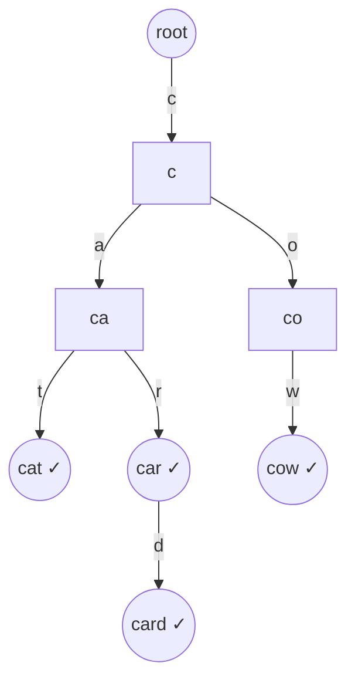
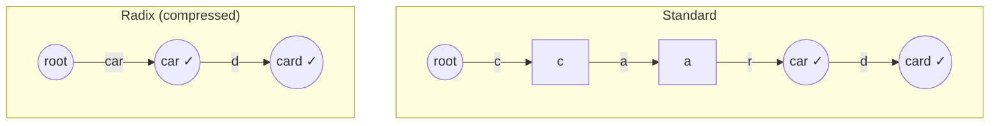

# Tries (Prefix Trees)

A **trie** (from re*trie*val, usually pronounced "try") is a tree keyed by the
*characters* of your keys rather than by the keys themselves. Every path from the root
spells a prefix; every stored word is a path that ends at a node marked "end of word."
The payoff is that `insert`, `search`, and `startsWith` all cost **O(L)** where L is the
length of the key — *independent of how many words the trie holds*. That prefix
superpower is exactly why tries dominate autocomplete, dictionary/word-search problems,
IP-prefix routing, and bit-trie tricks like maximum-XOR.

This note leads with the internals — node layout, per-operation complexity, why prefix
queries are cheap, the space cost — then compares a trie to a hash map, covers compressed
(radix) and ternary tries, walks the bit-trie pattern, and ends with the canonical
interview problems.

## How a trie works under the hood

A trie is a rooted tree. The root represents the empty prefix `""`. Each **edge** is
labeled with one character; a **node** represents the prefix formed by concatenating the
edge labels from the root down to it. A boolean **`isEnd`** flag on a node says "a
complete word ends here." Nodes do *not* store the character themselves — the character
is implied by *which child slot* points to the node.



The trie above holds `{cat, car, card, cow}`. Notice `cat`, `car`, and `card` **share**
the `c → a` path: shared prefixes are stored exactly once. The `(( ✓ ))` nodes have
`isEnd = true`. The node `"ca"` exists but is *not* a word, so its `isEnd` is false —
this is why you cannot infer word-membership from "the node exists."

Two representations for a node's children:

- **Array of children (fixed alphabet).** `TrieNode[] children = new TrieNode[26]` for
  lowercase `a–z` (index = `c - 'a'`). O(1) child access, but every node reserves 26
  slots (mostly null) — memory-heavy but cache-friendly and branch-free.
- **Hash map of children (sparse / large alphabet).** `Map<Character, TrieNode>`. Uses
  memory proportional to actual branching, handles Unicode, but each hop pays hashing
  overhead and pointer chasing.

```java
class TrieNode {
    TrieNode[] children = new TrieNode[26]; // a..z
    boolean isEnd = false;
}
```

> [!KEY-TAKEAWAY]
> A trie = **tree of nodes + one edge per character + an `isEnd` flag**. The character is
> encoded by the child slot, not stored in the node. `isEnd` is what distinguishes a
> stored word from a mere prefix.

## Insert, search, and startsWith: the core operations

All three walk down from the root one character at a time.

- **insert(word):** for each char, follow the child; if the child slot is null, create a
  node. After the last char, set `isEnd = true`.
- **search(word):** walk the chars; if any child is missing, return false. At the end,
  return the node's `isEnd` (the word must be *terminated* here, not merely a prefix).
- **startsWith(prefix):** identical walk, but at the end just return "node exists" — you
  do **not** check `isEnd`.

```java
void insert(String w) {
    TrieNode n = root;
    for (char c : w.toCharArray()) {
        int i = c - 'a';
        if (n.children[i] == null) n.children[i] = new TrieNode();
        n = n.children[i];
    }
    n.isEnd = true;
}
boolean search(String w)      { TrieNode n = walk(w); return n != null && n.isEnd; }
boolean startsWith(String p)  { return walk(p) != null; }
TrieNode walk(String s) {
    TrieNode n = root;
    for (char c : s.toCharArray()) {
        n = n.children[c - 'a'];
        if (n == null) return null;
    }
    return n;
}
```

The single most-tested distinction: **`search` returns `node.isEnd`; `startsWith` returns
`node != null`.** Get those two lines right and Implement-Trie is done.

## Complexity and why prefix queries beat a hash set

Let **L** = key length, **N** = number of words, **Σ** = alphabet size (26 here).

| Operation | Time | Space added |
|---|---|---|
| insert(word) | O(L) | up to O(L) new nodes |
| search(word) | O(L) | O(1) |
| startsWith(prefix) | O(L) | O(1) |
| delete(word) | O(L) | frees up to O(L) nodes |
| enumerate all words with prefix p | O(len(p) + total chars in results) | O(1) extra |
| **Total space** | — | **O(N · L · Σ)** worst case (array nodes) |

The headline: trie operations are **O(L), independent of N**. A `HashSet<String>` also
gives O(L) *exact* lookup (you must still hash all L characters, and equality re-scans on
collision). But the hash set has **no notion of prefixes** — asking "how many stored words
start with `car`?" forces you to scan every key, O(N·L). The trie answers it by walking to
the `car` node in O(L) and reading a subtree.

> [!INTERVIEW]
> When an interviewer says **"prefix," "autocomplete," "startsWith," "words sharing a
> common start," or "shortest/longest matching prefix,"** reach for a trie. If it is
> purely *exact* membership with no prefix structure, a hash set is simpler and lighter.

## Space cost and the array-vs-map trade-off

The trie's weakness is memory. With array nodes over `a–z`, every node — even one with a
single child — reserves 26 pointers. Worst case (no shared prefixes) the node count is
O(N·L), and each node is O(Σ), giving **O(N·L·Σ)**. In practice shared prefixes near the
root collapse a lot of this, but tries are still far heavier than a packed hash set.

| Children representation | Child lookup | Memory per node | Best for |
|---|---|---|---|
| Fixed array `[Σ]` | O(1), branch-free | O(Σ) always (wasteful when sparse) | small alphabet, dense tries (a–z) |
| Hash map | O(1) avg + hashing | O(actual children) | large/sparse alphabet, Unicode |
| Sorted list / TST | O(log Σ) | O(actual children) | memory-tight, ordered traversal |

## Compressed (radix) tries and ternary search tries

Two standard optimizations attack the "many single-child chain nodes" waste:

- **Compressed trie / radix tree (PATRICIA):** collapse any chain of single-child nodes
  into one edge labeled with the *whole substring*. `card` after `car` no longer needs a
  separate node per letter if the path doesn't branch. This shrinks node count
  dramatically and is what real IP-routing tables (longest-prefix match) and many
  key-value stores use. Lookups still O(L) but with far fewer nodes/allocations.
- **Ternary search trie (TST):** each node stores one character and *three* pointers —
  `lo` (smaller char), `eq` (next char of key), `hi` (larger char). It's a BST-of-tries
  hybrid: memory close to a BST, supports ordered/near-neighbor and prefix queries, at
  the cost of O(L·log Σ) instead of O(L).



## The bit-trie pattern for Maximum XOR

A trie need not be over letters — over **bits** it becomes a powerful tool for
XOR/nearest-value problems. Store each integer as a fixed-width (e.g. 32-bit) binary
string, MSB first, in a binary trie (each node has children `0` and `1`).

To maximize `x XOR y` for a query `x`: walk from the MSB and **greedily take the opposite
bit** at each level when that child exists (opposite bits make that XOR bit 1, the most
valuable because it's the highest place value). This gives the best partner for `x` in
**O(32)** per query instead of O(N) pairwise comparison — turning Maximum XOR of Two
Numbers from O(N²) into O(N·32).

> [!TIP]
> Bit-tries also solve "maximum XOR with a value ≤ limit," "count pairs with XOR < k," and
> subarray-XOR problems. Recognition signal: *pairwise XOR maximization/counting over an
> array of integers.*

## Building on a trie: Word Search II with DFS and trie

The trie's killer application in interviews is pruning a search. **Word Search II** asks
you to find which of many words appear in a character grid. The naive approach runs a DFS
per word: O(W · cells · 4^L). Instead, **build one trie of all words**, then DFS the grid
*once*, advancing a trie pointer alongside the path. The moment the current path is not a
prefix of *any* word (the trie has no matching child), you prune the entire branch. When
you reach a node with `isEnd`, you've found a word. This collapses redundant work across
words and is the canonical "trie as a shared prefix index for backtracking" pattern.

> [!WARNING]
> Two classic bugs in Word Search II: (1) forgetting to mark cells visited and restore
> them on backtrack, and (2) adding a found word to results repeatedly — set the node's
> word to null after collecting it (or use a set) to dedupe.

## Deleting from a trie

Delete is the trickiest core op because you must not orphan other words. Walk to the
word's end node and clear `isEnd`. Then, unwinding back up, prune a node only if it has
**no children and is not itself the end of another word**. Deleting `car` from
`{car, card}` must *not* remove the `c→a→r` path because `card` still needs it — you only
flip `car`'s `isEnd` to false. This is O(L).

## Interview Problems

Canonical LeetCode problems that drill tries. Start with Implement Trie, then the
add-and-search / word-search variants, then the bit-trie.

**Core / Easy–Medium**

- [Implement Trie (Prefix Tree)](https://leetcode.com/problems/implement-trie-prefix-tree/) — Medium — the reference implementation: insert / search / startsWith
- [Implement Trie II (Prefix Tree)](https://leetcode.com/problems/implement-trie-ii-prefix-tree/) — Medium — add counts per word and per prefix to nodes
- [Design Add and Search Words Data Structure](https://leetcode.com/problems/design-add-and-search-words-data-structure/) — Medium — trie + DFS to handle the `.` wildcard
- [Longest Word in Dictionary](https://leetcode.com/problems/longest-word-in-dictionary/) — Medium — build trie, DFS keeping only words whose every prefix is also a word
- [Replace Words](https://leetcode.com/problems/replace-words/) — Medium — trie of roots, find the shortest matching prefix of each word
- [Map Sum Pairs](https://leetcode.com/problems/map-sum-pairs/) — Medium — trie storing prefix-sum of values, aggregate over a prefix
- [Implement Magic Dictionary](https://leetcode.com/problems/implement-magic-dictionary/) — Medium — trie + DFS allowing exactly one char change
- [Search Suggestions System](https://leetcode.com/problems/search-suggestions-system/) — Medium — trie/sort for autocomplete top-3 per typed prefix

**Harder / Hard**

- [Word Search II](https://leetcode.com/problems/word-search-ii/) — Hard — trie + grid DFS with prefix pruning
- [Concatenated Words](https://leetcode.com/problems/concatenated-words/) — Hard — trie/DP to test if a word is built from other words
- [Word Break II](https://leetcode.com/problems/word-break-ii/) — Hard — trie/DP to reconstruct all segmentations
- [Palindrome Pairs](https://leetcode.com/problems/palindrome-pairs/) — Hard — trie of reversed words to find palindrome-forming pairs
- [Stream of Characters](https://leetcode.com/problems/stream-of-characters/) — Hard — trie of reversed words queried against a suffix stream
- [Word Squares](https://leetcode.com/problems/word-squares/) — Hard — trie for prefix lookup while backtracking a square

**Bit-trie**

- [Maximum XOR of Two Numbers in an Array](https://leetcode.com/problems/maximum-xor-of-two-numbers-in-an-array/) — Medium — binary trie, greedily take opposite bit
- [Maximum XOR With an Element From Array](https://leetcode.com/problems/maximum-xor-with-an-element-from-array/) — Hard — offline queries + bit-trie with a value bound

## Common follow-up questions

- **Trie vs hash set for a dictionary — when does each win?** Hash set: less memory,
  simpler, O(L) exact lookup. Trie: prefix queries (`startsWith`, autocomplete,
  longest/shortest matching prefix), enumerating words by prefix, and sharing work across
  many keys during a search.
- **How do you make `search` differ from `startsWith`?** `search` returns `node.isEnd`
  after the walk; `startsWith` returns `node != null`. Same traversal, different final
  check.
- **How do you cut a trie's memory?** Use a compressed/radix trie to collapse single-child
  chains, a hash-map (or TST) children representation for sparse alphabets, and share
  prefixes (which the trie does automatically).
- **How do you delete a word without breaking others?** Clear `isEnd`; on the way up,
  prune a node only if it has no children and isn't another word's end.
- **How does a bit-trie maximize XOR?** Insert numbers MSB-first as bits; per query, greedily
  descend to the opposite bit when possible so the high-value XOR bits become 1.
- **Why is a trie used in IP routing?** Longest-prefix match on address bits is exactly a
  (radix) trie walk; routers use PATRICIA/radix tries for this.
- **What's the complexity of enumerating all words under a prefix?** O(length of prefix +
  total characters across all matching words) — you pay only for what you output.

## References

- CLRS, *Introduction to Algorithms* — radix trees / string data structures.
- Sedgewick & Wayne, *Algorithms, 4th ed.* — Tries and Ternary Search Tries (Ch. 5.2), with complexity analysis.
- Donald Knuth, *TAOCP Vol. 3* — original digital-search-tree (trie) analysis.
- Java Platform docs — `HashMap`, `TreeMap` (for the children-map representation trade-offs).
- LeetCode Explore card: *Trie*, and the problem set linked above.
