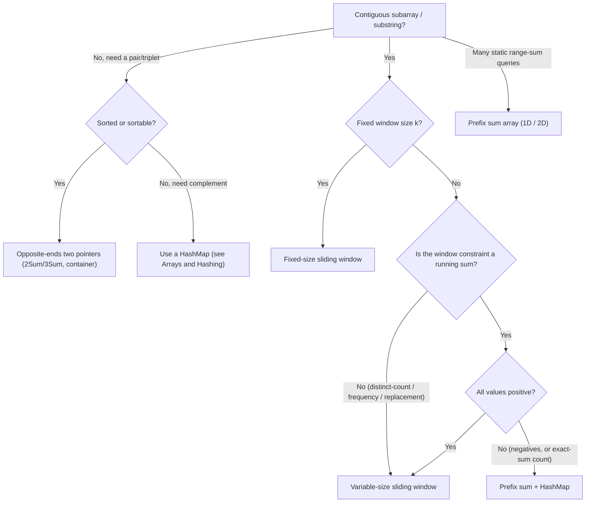

# Two Pointers, Sliding Window & Prefix Sum

> Three closely-related linear-scan patterns that collapse the naive `O(n²)`
> (or `O(n³)`) "check every pair / every subarray" brute force down to `O(n)` or
> `O(n log n)`. They all exploit the same idea: **don't recompute from scratch —
> maintain state as you move pointers across the array/string.** Two pointers walk
> two indices toward or alongside each other; sliding window keeps a contiguous
> range and slides it; prefix sum precomputes cumulative totals so any range query
> is `O(1)`. Together they are the single highest-frequency array/string pattern
> family in coding interviews.

## Two Pointers: opposite-ends (converging)

**Recognition signal:** the array is **sorted** (or can be sorted), and you need a
**pair / triplet** that satisfies a condition (sum, difference, product), or you must
verify/transform something symmetric (palindrome, reverse in place).

The idea: place one pointer at the far left (`lo`), one at the far right (`hi`), and
move them toward each other. At each step the comparison tells you *which* pointer to
move, so you never revisit a discarded candidate — you eliminate a whole row/column of
the `O(n²)` pair matrix per step.

```text
Two Sum II (sorted, find pair summing to target):
  lo = 0, hi = n-1
  while lo < hi:
      s = a[lo] + a[hi]
      if s == target: return (lo, hi)
      elif s < target: lo++      # need a bigger sum → raise the low end
      else:            hi--      # need a smaller sum → lower the high end
```

Why it's correct: if `a[lo] + a[hi] < target`, then `a[lo]` paired with *any* element
`≤ a[hi]` is also too small, so `a[lo]` can never be part of a solution with anything
except elements `> a[hi]` — but those are all gone. Safe to discard `lo`. Symmetric
argument for moving `hi`.

**Complexity:** `O(n)` time after sorting, `O(1)` extra space. If you must sort first,
`O(n log n)` dominates. Brute force is `O(n²)`.

> [!KEY-TAKEAWAY]
> Opposite-ends two pointers needs a **monotone response**: moving a pointer must change
> the objective in a *predictable direction*. Sorted input is what usually provides that.

## Two Pointers: same-direction (fast and slow)

**Recognition signal:** in-place array modification ("remove duplicates", "move zeroes",
"partition"), or comparing two sequences, or a **slow write pointer** trailing a **fast
read pointer**.

One pointer (`read`/`fast`) scans every element; the other (`write`/`slow`) marks where
the next kept element goes. This is the engine behind in-place compaction and Dutch-flag
partitioning.

```python
# Remove duplicates from sorted array in place, return new length
def dedup(a):
    if not a: return 0
    write = 1
    for read in range(1, len(a)):
        if a[read] != a[write-1]:
            a[write] = a[read]
            write += 1
    return write
```

**Complexity:** `O(n)` time, `O(1)` space. Related: Floyd's cycle detection uses two
pointers moving at different *speeds* (covered in the Linked Lists topic).

> [!WARNING]
> Same-direction two pointers is **not** the same as sliding window. Here the two pointers
> serve different roles (read vs write); in a sliding window both delimit a *range* whose
> contents you actively track.

## Three-pointer and k-Sum (3Sum)

**3Sum** ("find all triplets summing to 0") is the canonical extension: **sort**, then for
each index `i`, run an opposite-ends two-pointer scan on the remaining subarray to find
pairs summing to `-a[i]`.

```python
def three_sum(a):
    a.sort()
    res = []
    for i in range(len(a) - 2):
        if i > 0 and a[i] == a[i-1]:      # skip duplicate anchors
            continue
        if a[i] > 0: break                # smallest is positive → no zero-sum triplet
        lo, hi = i + 1, len(a) - 1
        while lo < hi:
            s = a[i] + a[lo] + a[hi]
            if s < 0: lo += 1
            elif s > 0: hi -= 1
            else:
                res.append([a[i], a[lo], a[hi]])
                lo += 1; hi -= 1
                while lo < hi and a[lo] == a[lo-1]: lo += 1   # skip dup
                while lo < hi and a[hi] == a[hi+1]: hi -= 1
    return res
```

**Complexity:** `O(n²)` time (outer loop × inner linear scan), `O(1)` or `O(n)` extra
depending on sort. This beats the `O(n³)` triple loop. General **k-Sum** recurses down to
a 2-pointer base case: `O(n^(k-1))`.

> [!INTERVIEW]
> The two hard parts of 3Sum in an interview are (1) **de-duplicating** results without a
> hash set — skip equal values at the anchor *and* after recording a hit; (2) explaining
> why sorting + two pointers is `O(n²)` not `O(n² log n)` (the sort is a one-time
> `O(n log n)`, dominated by the `O(n²)` scan).

## Sliding Window: variable-size

**Recognition signal:** "**longest / shortest / max / min** *contiguous* subarray or
substring such that <property>". Contiguity is the trigger — if order can be rearranged,
it's not a window problem.

Maintain a window `[left, right]`. **Expand `right`** to include new elements; when the
window **violates** the constraint, **shrink `left`** until it's valid again. Track the
best answer as you go. Each index enters once (right++) and leaves at most once (left++),
so the whole scan is `O(n)` even though it looks nested.

```python
# Longest substring without repeating characters
def longest_unique(s):
    last = {}            # char -> most recent index
    left = 0
    best = 0
    for right, c in enumerate(s):
        if c in last and last[c] >= left:
            left = last[c] + 1        # jump left past the previous occurrence
        last[c] = right
        best = max(best, right - left + 1)
    return best
```

Note that the code above uses the **"jump-left" optimization**: instead of shrinking
`left` one step at a time, the `last` map tells you exactly where the duplicate sat, so
you leap `left` straight to `last[c] + 1`. The guard `last[c] >= left` matters because a
character's previous occurrence may already be *outside* the current window — in that case
it isn't a duplicate anymore, so don't move `left` backward. (Example: in `"abba"`, when
the second `a` arrives `left` is already at 2, but `last['a'] == 0 < 2`, so we keep `left`
where it is rather than jumping it back to 1.)

Two common shrink styles:
- **"Shrink while invalid"** (longest problems): grow right; while constraint broken,
  move left. Answer is the max window seen.
- **"Shrink while valid"** (shortest / minimum problems, e.g. Minimum Window Substring):
  grow right until valid, then greedily shrink left as far as still-valid, recording the
  minimum.

**Complexity:** `O(n)` time (amortized — `left` and `right` each advance ≤ n times),
`O(k)` space for the window-state structure (k = distinct elements / alphabet size).

### Worked example: Minimum Window Substring (shrink-while-valid)

The canonical "shrink while valid" problem: find the shortest substring of `s` that
contains every character of `t` (with multiplicity). The mechanic that trips people up is
knowing *when the window is valid*. Track a `need` count per required char, a `required`
= number of distinct chars still to satisfy, and a `have` = how many of those are
currently satisfied. The window is valid exactly when `have == required`.

```python
def min_window(s, t):
    need = {}
    for c in t: need[c] = need.get(c, 0) + 1
    required = len(need)
    window = {}
    have = 0
    best = (float('inf'), 0, 0)   # (length, l, r)
    left = 0
    for right, c in enumerate(s):
        window[c] = window.get(c, 0) + 1
        if c in need and window[c] == need[c]:
            have += 1
        while have == required:                       # valid → try to shrink
            if right - left + 1 < best[0]:
                best = (right - left + 1, left, right)
            lc = s[left]
            window[lc] -= 1
            if lc in need and window[lc] < need[lc]:
                have -= 1
            left += 1
    return "" if best[0] == float('inf') else s[best[1]:best[2]+1]
```

Trace on `s = "ADOBECODEBANC"`, `t = "ABC"`: `need = {A:1, B:1, C:1}`, `required = 3`.
Tracking only the counts that matter (`A`, `B`, `C`) and `have`:

| step | char in | window A/B/C | have | action |
|---|---|---|---|---|
| r=0 | A | 1/0/0 | 1 | grow |
| r=3 | B | 1/1/0 | 2 | grow |
| r=5 | C | 1/1/1 | **3** | valid → window `[0..5]`="ADOBEC" len **6** = best; drop `A`, have→2, left=1 |
| r=10 | A | 1/2/1 | **3** | valid → `[1..10]` len 10 (not better); shrink D,O,B,E off (each still valid) to left=5, len 6 = tie; drop `C`, have→2, left=6 |
| r=12 | C | 1/1/1 | **3** | valid → `[6..12]`="ODEBANC" len 7; shrink `O`(left=7), `D`(left=8)→"EBANC" len **5** = best; `E`(left=9)→"BANC" len **4** = best; drop `B`, have→2, left=10 |

The candidate windows shrink **ADOBEC (6) → EBANC (5) → BANC (4)**; the answer is
`"BANC"`. Notice the two distinct events: `have` *increases* only when a count first
*reaches* its `need` (window `A` hitting 1), and *decreases* only when a removal drops a
count *below* `need` (dropping the last `C` or `B`) — a surplus like `B:2` never touches
`have`, which is why you can safely shrink past redundant characters.

## Sliding Window: fixed-size

**Recognition signal:** "subarray/substring **of size k**" — max sum of k consecutive
elements, averages, anagram checks.

Keep the window exactly `k` wide: for each new `right`, the element that leaves is always
`a[right - k]`, so `left` is implicit and you never need a separate variable. Add the
entering element's contribution, subtract the leaving one — never re-sum the window.

```python
# Max sum of any window of size k
def max_sum_k(a, k):
    window = sum(a[:k])
    best = window
    for right in range(k, len(a)):
        window += a[right] - a[right - k]   # slide: add new, drop old
        best = max(best, window)
    return best
```

**Complexity:** `O(n)` time, `O(1)` space. Brute force (re-sum each window) is `O(n·k)`.

> [!TIP]
> **Longest Repeating Character Replacement** and **anagram-in-string** are window problems
> where the state is a **frequency count** of characters in the window. The window is valid
> when `windowLen - maxFreq <= k` (chars you'd need to replace). You don't even have to
> decrement `maxFreq` when shrinking — because this window never *shrinks*: `left` advances
> in lockstep with `right`, so the window width is monotonically non-decreasing. A stale
> (too-large) `maxFreq` can therefore only keep the window the *same* width, never let it
> grow wider than the best genuinely-valid window seen — so it cannot fabricate a larger
> answer.

## Prefix Sum: O(1) range queries

**Recognition signal:** many **range-sum queries** on a static array, or "**subarray sum
equals / divisible by / bounded by** a target".

Precompute `P[0]=0`, `P[i] = a[0] + … + a[i-1]`. Then the sum of `a[i..j]` (inclusive) is
`P[j+1] - P[i]` in `O(1)`. One `O(n)` preprocessing pass buys `O(1)` per query forever
(as long as the array is immutable).

```python
def build_prefix(a):
    P = [0] * (len(a) + 1)
    for i, x in enumerate(a):
        P[i+1] = P[i] + x
    return P
# range sum a[i..j] = P[j+1] - P[i]
```

**Complexity:** `O(n)` build, `O(1)` per range query, `O(n)` space. (If the array gets
**updates** between queries, prefer a Fenwick/BIT or segment tree — `O(log n)` per
op — covered in Advanced Structures.)

## Prefix Sum with HashMap: subarray sum equals K

**Recognition signal:** count/find a **subarray with a given sum** in an array that may
contain **negatives** (so a plain sliding window won't work — negatives break window
monotonicity).

Key rewrite: `sum(i..j) == k` ⟺ `P[j+1] - P[i] == k` ⟺ `P[i] == P[j+1] - k`. Scan once,
keeping a hashmap of **how many times each running prefix sum has occurred**. At each `j`,
the number of valid start points is `count[currentPrefix - k]`.

```python
# Count subarrays summing to k (handles negatives)
def subarray_sum_k(a, k):
    seen = {0: 1}        # prefix 0 occurs once (empty prefix)
    running = 0
    count = 0
    for x in a:
        running += x
        count += seen.get(running - k, 0)
        seen[running] = seen.get(running, 0) + 1
    return count
```

**Complexity:** `O(n)` time, `O(n)` space. The `{0: 1}` seed is essential — it counts
subarrays that start at index 0. Same trick with `running % k` solves "subarray sums
divisible by k".

**Trace** on `a = [1, -1, 1]`, `k = 1` (a negative is included on purpose). Start
`seen = {0:1}`, `running = 0`, `count = 0`:

| x | running | look up `running - k` | seen has it? | count | seen after |
|---|---|---|---|---|---|
| 1 | 1 | `1 - 1 = 0` | yes, `seen[0]=1` → **+1** | 1 | `{0:1, 1:1}` |
| -1 | 0 | `0 - 1 = -1` | no | 1 | `{0:2, 1:1}` |
| 1 | 1 | `1 - 1 = 0` | yes, `seen[0]=2` → **+2** | 3 | `{0:2, 1:2}` |

Final `count = 3`. The three subarrays summing to 1 are `[1]` (index 0), `[1]` (index 2),
and the whole `[1,-1,1]`. Watch the `{0:1}` seed *fire* on the very first step: the prefix
`[1]` itself equals `k`, and the only way to count it is a start-boundary of prefix-sum 0 —
that is what the seed represents. On the third step the running prefix `1` has now been
seen at *two* earlier boundaries (before index 0 with sum 0, and after index 0 with sum 1),
so the lookup adds **2**, correctly capturing both `[1,-1,1]` and the trailing `[1]`.

> [!WARNING]
> **Do not** reach for a sliding window when the array has **negative numbers** and you
> need an exact sum — expanding the window can *decrease* the sum, so the "shrink when too
> big" invariant no longer holds. Prefix-sum + hashmap is the correct tool. Sliding window
> for sum problems requires **all-positive** values (monotone growth).

## Prefix Sum in 2D

For repeated rectangle-sum queries on a matrix, build a 2D prefix table `P[r][c]` = sum of
the submatrix from `(0,0)` to `(r-1,c-1)`. Any rectangle sum is then four table lookups
(inclusion–exclusion):

```text
sum(r1..r2, c1..c2) = P[r2+1][c2+1] - P[r1][c2+1] - P[r2+1][c1] + P[r1][c1]
```

Why four lookups? `P[r2+1][c2+1]` is the whole block from the origin down to the bottom-
right corner. Subtract the strip *above* the rectangle (`P[r1][c2+1]`) and the strip to the
*left* (`P[r2+1][c1]`) — but those two strips overlap in the top-left corner block, which
you've now subtracted **twice**, so add `P[r1][c1]` back once. That is textbook
inclusion–exclusion.

**Worked example.** Matrix and its prefix table `P` (row/col 0 are the zero-padding):

```text
a =  1 2 3          P =  0  0  0  0
     4 5 6               0  1  3  6
     7 8 9               0  5 12 21
                         0 12 27 45
```

Sum of the bottom-right `2×2` block (rows 1..2, cols 1..2 → values `5,6,8,9`):

```text
P[3][3] - P[1][3] - P[3][1] + P[1][1]
  = 45   -   6     -   12    +   1     = 28
```

Check: `5 + 6 + 8 + 9 = 28`. The `-6` peels off the top strip (`P[1][3]` = sum of row 0 =
`1+2+3`), the `-12` peels off the left strip (`P[3][1]` = col 0 = `1+4+7`), and `+1` restores
the top-left cell `a[0][0]=1` that both strips removed.

**Complexity:** `O(m·n)` build, `O(1)` per query.

## Choosing the right pattern



The all-positive gate only applies when the window's constraint is a **running sum**
(monotone growth is what lets you shrink safely). Distinct-count, frequency, and
character-replacement windows (Longest Substring Without Repeating Characters, Fruit Into
Baskets, Longest Repeating Character Replacement) are variable-window problems *regardless*
of whether values are positive or negative — value positivity is irrelevant there.

| Pattern | Signal | Time | Space | Replaces |
|---|---|---|---|---|
| Opposite-ends 2-ptr | sorted, find pair | `O(n)` (+sort) | `O(1)` | `O(n²)` |
| Same-direction 2-ptr | in-place compact/partition | `O(n)` | `O(1)` | `O(n²)` |
| 3Sum / k-Sum | sorted, triplet | `O(n²)` / `O(n^{k-1})` | `O(1)`–`O(n)` | `O(n³)` |
| Variable window | longest/shortest contiguous, positive | `O(n)` | `O(k)` | `O(n²)` |
| Fixed window | size-k contiguous | `O(n)` | `O(1)` | `O(n·k)` |
| Prefix sum | static range-sum queries | `O(n)` build, `O(1)` query | `O(n)` | `O(n)` per query |
| Prefix sum + hashmap | subarray sum = k (negatives ok) | `O(n)` | `O(n)` | `O(n²)` |

## Worked example: Trapping Rain Water (two pointers)

Water above bar `i` = `min(maxLeft[i], maxRight[i]) - height[i]`. The naive approach
precomputes both max arrays in `O(n)` time / `O(n)` space. The two-pointer optimization
does it in `O(1)` space: keep `left`, `right`, `leftMax`, `rightMax`. Whichever side has
the **smaller running max** is the bottleneck, so that side's water level is fully
determined — process and advance it.

```python
def trap(h):
    l, r = 0, len(h) - 1
    lmax = rmax = water = 0
    while l < r:
        if h[l] < h[r]:
            lmax = max(lmax, h[l])
            water += lmax - h[l]     # left side is the binding constraint
            l += 1
        else:
            rmax = max(rmax, h[r])
            water += rmax - h[r]
            r -= 1
    return water
```

`O(n)` time, `O(1)` space. The insight — "the shorter wall bounds the water regardless of
what's beyond the taller wall" — is exactly the same monotone-response reasoning as
Container With Most Water.

## Interview Problems

Grouped by sub-pattern. These are the canonical drills for this topic family.

**Two pointers (opposite ends / same direction):**
- [Two Sum II - Input Array Is Sorted](https://leetcode.com/problems/two-sum-ii-input-array-is-sorted/) — Medium — converging pointers on a sorted array
- [3Sum](https://leetcode.com/problems/3sum/) — Medium — sort + two-pointer inner scan, de-dup
- [Container With Most Water](https://leetcode.com/problems/container-with-most-water/) — Medium — move the shorter wall inward
- [Trapping Rain Water](https://leetcode.com/problems/trapping-rain-water/) — Hard — two pointers with running left/right max
- [Valid Palindrome](https://leetcode.com/problems/valid-palindrome/) — Easy — symmetric converging pointers
- [Remove Duplicates from Sorted Array](https://leetcode.com/problems/remove-duplicates-from-sorted-array/) — Easy — slow write / fast read
- [Move Zeroes](https://leetcode.com/problems/move-zeroes/) — Easy — same-direction in-place compaction
- [Sort Colors](https://leetcode.com/problems/sort-colors/) — Medium — Dutch national flag, three pointers

**Sliding window (fixed and variable):**
- [Longest Substring Without Repeating Characters](https://leetcode.com/problems/longest-substring-without-repeating-characters/) — Medium — variable window + last-seen map
- [Minimum Window Substring](https://leetcode.com/problems/minimum-window-substring/) — Hard — shrink-while-valid window with need/have counts
- [Longest Repeating Character Replacement](https://leetcode.com/problems/longest-repeating-character-replacement/) — Medium — window valid when len - maxFreq ≤ k
- [Permutation in String](https://leetcode.com/problems/permutation-in-string/) — Medium — fixed-size window frequency match
- [Sliding Window Maximum](https://leetcode.com/problems/sliding-window-maximum/) — Hard — fixed window + monotonic deque
- [Maximum Average Subarray I](https://leetcode.com/problems/maximum-average-subarray-i/) — Easy — fixed-size window sum
- [Fruit Into Baskets](https://leetcode.com/problems/fruit-into-baskets/) — Medium — longest window with ≤ 2 distinct

**Prefix sum:**
- [Subarray Sum Equals K](https://leetcode.com/problems/subarray-sum-equals-k/) — Medium — prefix sum + hashmap of counts (handles negatives)
- [Range Sum Query - Immutable](https://leetcode.com/problems/range-sum-query-immutable/) — Easy — 1D prefix-sum array
- [Product of Array Except Self](https://leetcode.com/problems/product-of-array-except-self/) — Medium — prefix/suffix products
- [Contiguous Array](https://leetcode.com/problems/contiguous-array/) — Medium — prefix sum with 0→-1 remapping + hashmap

## Common follow-up questions

- "Why does a sliding window fail with negative numbers for exact-sum problems?"
  Expanding the window can *decrease* the sum, so "shrink when the sum exceeds target" no
  longer restores validity — there's no monotonic relationship between window length and
  sum. Use prefix sum + hashmap instead.
- "3Sum without sorting?" Possible with a hashset per anchor (`O(n²)` time, `O(n)`
  space), but de-duplication is messier; sorting is the cleaner interview answer.
- "Container With Most Water — why is greedily moving the shorter wall safe?" Area is
  bounded by the shorter wall × width. Moving the taller wall inward can only shrink width
  while the height stays capped by the shorter wall, so it can never improve; moving the
  shorter wall is the only move that *might* help. This is the same exchange argument as
  the converging-pointer proof.
- "How do prefix sums extend to updates?" A static prefix array is `O(n)` to rebuild
  per update. If updates and queries interleave, switch to a Fenwick tree (BIT) or segment
  tree for `O(log n)` update and query.
- "Fixed window sum — how do you avoid re-summing?" Add the entering element and
  subtract the leaving element each slide (`window += a[right] - a[right-k]`), turning
  `O(n·k)` into `O(n)`.

## References

- CLRS, *Introduction to Algorithms*, 4th ed. — amortized analysis (aggregate method),
  which justifies why the two-pointer/window scan is `O(n)` despite the nested-loop look.
- Sedgewick & Wayne, *Algorithms*, 4th ed. — two-pointer partitioning (quicksort/Dutch
  flag) and array scanning idioms.
- Competitive Programmer's Handbook (Antti Laaksonen) — sliding window, prefix sums (1D/2D),
  and range-query preprocessing.
- LeetCode Explore cards: Two Pointers, Sliding Window — canonical problem set and editorials.
