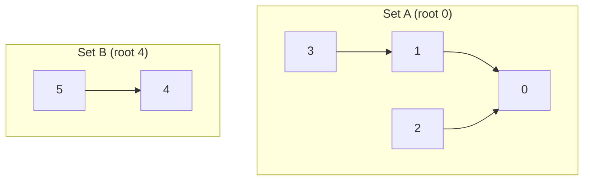

# Union-Find (Disjoint Set Union)

Union-Find — also called the **Disjoint Set Union (DSU)** structure — answers one
deceptively simple question over and over, fast: *"are these two elements in the same
group?"* and lets you **merge** two groups. It maintains a collection of disjoint sets
(partitions) under two operations: `find(x)` (which set is `x` in?) and `union(a, b)`
(merge the two sets containing `a` and `b`). With its two optimizations — **path
compression** and **union by rank/size** — both operations run in **nearly O(1)
amortized** (inverse-Ackermann time), which is effectively constant for any input that
fits in the universe.

DSU is the go-to structure for **dynamic connectivity**: cycle detection in an
undirected graph, counting connected components, Kruskal's MST, and equivalence-class /
grouping problems. It leads with the internals below (parent array, the two
optimizations, the amortized-cost proof intuition), then when to reach for it versus
BFS/DFS, then the canonical interview problems.

## The structure: parent array as a forest

**Mental model — friend groups with one leader.** Picture people split into friend
groups where each group only remembers a single **leader**. To check whether two people
are in the same group, each follows the *"who's your leader?"* chain upward until they
hit someone who is their own leader — if both arrive at the same person, they're in the
same group. To merge two groups, you just make one leader report to the other. That's the
whole trick. Map it to DSU: **leader → root**, **the chain-following → `find`**,
**"make one leader report to the other" → `union`**. The array below is just a compact way
to store "who does each person report to."

DSU represents each set as a **rooted tree**, and the whole collection as a **forest**.
Each element has exactly one parent pointer; the **root** of a tree (an element that is
its own parent) is the set's canonical **representative**. Two elements are in the same
set **iff** they have the same root.

The entire forest is stored in a single flat integer array — no node objects, no
pointers, just indices:

```
parent[i] = the parent of element i   (parent[i] == i  means i is a root)
```

Memory layout is a contiguous `int[n]` (plus an `int[n]` for rank or size) — extremely
cache-friendly and O(n) space total. There is no tree-node allocation; the "tree" is
implicit in the index links.



Here `parent = [0,0,0,1,4,4]`: elements {0,1,2,3} form one set rooted at 0, and {4,5}
form another rooted at 4. `find(3)` walks 3 → 1 → 0 and returns 0.

> [!KEY-TAKEAWAY]
> DSU = **a parent array encoding a forest of rooted trees.** `find` walks to the root;
> `union` links one root under another. Same root ⇔ same set. That's the whole
> structure — the cleverness is in keeping the trees shallow.

## Initialization

Every element starts in its own singleton set, so each element is its own parent:

```java
int[] parent = new int[n];
int[] rank    = new int[n];      // or size[]; used to keep trees shallow
int   count   = n;               // number of disjoint sets — starts as n singletons
for (int i = 0; i < n; i++) parent[i] = i;   // rank[i] = 0 implicitly
```

`count` tracks how many disjoint sets currently exist; each successful `union` decrements
it (see below), so it answers "how many connected components?" in O(1). A trivial helper
follows from `find`: `boolean connected(int a, int b) { return find(a) == find(b); }`.

Initialization is **O(n)** time and **O(n)** space. Some problems key on strings or
coordinates rather than `0..n-1`; map them to integer ids first (via a hash map or
`row * numCols + col` for a grid) so the backing array can stay a flat `int[]`.

## find: locating the representative

`find(x)` follows parent pointers until it reaches a root:

```java
int find(int x) {
    while (parent[x] != x) x = parent[x];   // walk to the root
    return x;
}
```

Cost is proportional to the element's **depth** in the tree. Without optimizations a
naive `union` can build a degenerate chain (a "linked list" tree) of height n, making
`find` **O(n)** worst case. The two optimizations below bound that depth.

## Optimization 1: path compression

During a `find`, every node on the path from `x` to the root is pointed **directly at
the root**, flattening the tree so future `find`s on those nodes are O(1). The cleanest
form is recursive:

```java
int find(int x) {
    if (parent[x] != x) parent[x] = find(parent[x]);  // point x straight at the root
    return parent[x];
}
```

An iterative two-pass version (find root, then relink) avoids recursion stack depth.
A common one-pass variant is **path halving** — `parent[x] = parent[parent[x]]` each
step — which grabs most of the benefit with a tight loop and no recursion:

```java
int find(int x) {
    while (parent[x] != x) {
        parent[x] = parent[parent[x]];   // point x at its grandparent
        x = parent[x];
    }
    return x;
}
```

Path compression alone (with naive union) gives **O(log n)** amortized per operation.

**Worked trace — watch the tree flatten.** Start with a degenerate chain over 5 nodes,
`parent = [0,0,1,2,3]`, i.e. `4 → 3 → 2 → 1 → 0` (node 4 is 4 links deep). Call
`find(4)`.

- **Recursive compression** recurses all the way to root 0, then on the way back points
  *every* node on the path straight at 0:

  ```
  before: parent = [0,0,1,2,3]     4→3→2→1→0  (depth of 4 is 4)
  after:  parent = [0,0,0,0,0]     4→0, 3→0, 2→0, 1→0  (all depth 1)
  ```

  A second `find(4)` now reads `parent[4]==0`, returns in **one step — O(1)**.

- **Path halving** on the same input only shortcuts every *other* node (each step relinks
  `x` to its grandparent):

  ```
  x=4: parent[4] = parent[parent[4]] = parent[3] = 2;  x ← 2
  x=2: parent[2] = parent[parent[2]] = parent[1] = 0;  x ← 0  → root, stop
  after: parent = [0,0,0,2,2]      4→2→0, 3→2→0  (depths cut from 4/3 to 2)
  ```

  Not fully flat, but node 4 dropped from depth 4 to depth 2 in a single tight loop with
  no recursion — and repeated `find`s keep halving until the tree is flat.

## Optimization 2: union by rank / union by size

When merging two trees, always attach the **shorter/smaller** tree under the **taller/
larger** one. This prevents building tall chains.

- **Union by rank:** `rank` is an upper bound on tree height. Attach the lower-rank root
  under the higher-rank root; if ranks are equal, pick either as the new root and
  increment its rank by 1.
- **Union by size:** track the number of nodes per tree; attach the smaller-count root
  under the larger-count root. Size is often more useful in interviews because problems
  frequently ask for **component sizes** (e.g. largest component).

```java
boolean union(int a, int b) {
    int ra = find(a), rb = find(b);
    if (ra == rb) return false;              // already connected → (e.g.) a cycle edge
    if (rank[ra] < rank[rb]) { int t = ra; ra = rb; rb = t; }  // ra = taller root
    parent[rb] = ra;                          // attach smaller under larger
    if (rank[ra] == rank[rb]) rank[ra]++;     // tie → resulting tree got one deeper
    count--;                                  // one fewer disjoint set
    return true;
}
```

**Worked trace — how rank evolves (and why the tie rule matters).** All ranks start at 0,
`parent = [0,1,2,3]`. Run three unions:

| Union | Roots (ranks) | Link | Rank update | ranks after |
|---|---|---|---|---|
| `union(0,1)` | 0(0), 1(0) — tie | `parent[1]=0` | tie → `rank[0]++` | `[1,0,0,0]` |
| `union(2,3)` | 2(0), 3(0) — tie | `parent[3]=2` | tie → `rank[2]++` | `[1,0,1,0]` |
| `union(1,3)` | find(1)=0 (1), find(3)=2 (1) — tie | `parent[2]=0` | tie → `rank[0]++` | `[2,0,1,0]` |

The last union merges two rank-1 trees, so the survivor (root 0) climbs to rank 2 — the
height genuinely grew by one, and that's the *only* case where rank increments. When ranks
differ, the shorter tree tucks under the taller one and the taller tree's height is
unchanged, so no increment. That's why you bump **only on a tie**: any other case adds a
node at a depth that already existed.

**Union by size** tracks counts instead of a height bound; the same three unions give
sizes `[2,1,1,1] → [2,1,2,1] → [4,1,2,1]` (root 0 ends with 4 nodes). Size is just "how
many nodes are under me" — always the sum, never a conditional increment — which is why
many find it more intuitive, and it directly answers "largest component?" problems.

Union by rank/size **alone** (without path compression) already guarantees tree height
**O(log n)**, so `find` is O(log n).

> [!WARNING]
> Always call `find` to get the **roots** before comparing or linking. A frequent bug is
> `parent[b] = a` (linking the raw elements) instead of `parent[find(b)] = find(a)`
> (linking the roots) — that corrupts the forest.

## Why it's nearly O(1): the inverse-Ackermann bound

Combining **both** optimizations yields the famous bound: a sequence of *m* operations
on *n* elements runs in **O(m · α(n))** total, where **α(n)** is the inverse Ackermann
function. α(n) grows so slowly it is ≤ 4 for any n that could ever be stored (α of the
number of atoms in the universe is still < 5). So amortized cost per operation is
**effectively constant** — though *not* truly O(1), a distinction interviewers probe.

| Optimizations used | Amortized time per op |
|---|---|
| Neither (naive) | O(n) worst case |
| Path compression only | O(log n) |
| Union by rank/size only | O(log n) |
| **Both** | **O(α(n)) ≈ O(1)** |

**Intuition for why the two optimizations collapse to α(n).** Union-by-rank does the
*height control*: a root's rank only rises on a tie, and a rank-`r` tree needs at least
`2^r` nodes, so ranks — and therefore heights — never exceed `O(log n)`. Path compression
does the *payoff*: every expensive `find` that walks a long path immediately shortcuts all
those nodes to the root, so that cost is "paid forward" and never charged again. The
accounting (potential) argument then shows a node can only be re-parented onto a
strictly-higher-rank ancestor so many times before it's hanging off the root — and the
number of distinct rank *bands* a node can climb through is bounded by α(n), not log n.
That's the whole story at interview depth: **rank bounds how tall trees get; compression
means each costly walk buys down many future walks; the leftover per-op cost is α(n).**
Interviewers almost never want the full potential proof — stating this causal chain is
enough.

This near-constant amortized bound (Tarjan, 1975) is why DSU beats a graph traversal for
*incremental* connectivity: each edge added is essentially free.

## Operation complexity summary

| Operation | Time (both opts) | Notes |
|---|---|---|
| `makeSet` / init | O(n) total | fill parent array |
| `find(x)` | O(α(n)) amortized | worst single call O(log n) before compression settles |
| `union(a,b)` | O(α(n)) amortized | dominated by two `find`s |
| `connected(a,b)` | O(α(n)) amortized | `find(a) == find(b)` |
| component count | O(1) | maintain a counter, decrement on each successful union |
| Space | O(n) | `parent[]` + `rank[]`/`size[]` |

## When to reach for DSU — recognition signals

Reach for Union-Find when the problem involves **grouping, merging, or connectivity**
over a set of items, especially incrementally. Signals:

- **"Are X and Y connected / in the same group?"** asked many times, possibly interleaved
  with edges being added → dynamic connectivity.
- **Count connected components** in an undirected graph.
- **Detect a cycle in an undirected graph** — while adding an edge `(u,v)`, if `find(u)
  == find(v)` already, the edge closes a cycle.
- **Equivalence relations** — "a == b, b == c, so a == c" grouping (equality equations,
  accounts merge, synonyms).
- **Kruskal's MST** — sort edges, add the cheapest that doesn't form a cycle (uses DSU
  to test connectivity).
- **Merging groups** where you never need to split them (DSU is *not* built for
  deletion/splitting).

> [!INTERVIEW]
> The tell for DSU vs BFS/DFS: if edges/unions **arrive over time** and you must answer
> connectivity queries **between** them, DSU shines (each update is ~O(1) and you never
> re-traverse). If the graph is **static** and you just need one component labeling, a
> single BFS/DFS pass is simpler and equally fast. Mention both and justify your choice.

## DSU vs BFS/DFS for connectivity

| Aspect | Union-Find | BFS/DFS |
|---|---|---|
| Static "count components" once | O(n·α) after building | O(V + E), often simpler |
| Incremental unions + queries | Excellent — ~O(1) per op | Poor — re-traverse each query |
| Shortest path / actual path | Cannot — no path info | Natural (BFS gives shortest in unweighted) |
| Cycle detection (undirected) | Clean: union returns false | DFS with visited/parent tracking |
| Cycle detection (directed) | Not directly (needs edge direction) | DFS with recursion-stack / colors |
| Edge deletion / splitting sets | Not supported (no un-union) | Just rebuild/re-traverse |
| Memory | O(n) flat arrays | O(V + E) adjacency + visited |

Key limitation: **DSU cannot delete edges or split a set.** Problems that remove
connections (or "offline" deletion problems) are usually solved by DSU **in reverse**
(process deletions as unions from the final state backwards) or by a different structure.

## Worked example: cycle detection & component count

Graph edges over 5 nodes {0..4}: `(0,1), (1,2), (3,4), (0,2)`. Start with 5 components.

| Edge | find(u), find(v) | Action | Components |
|---|---|---|---|
| (0,1) | 0, 1 (differ) | union → parent[1]=0 | 4 |
| (1,2) | 0, 2 (differ) | union → parent[2]=0 | 3 |
| (3,4) | 3, 4 (differ) | union → parent[4]=3 | 2 |
| (0,2) | 0, 0 (**same**) | skip — cycle detected | 2 |

Final: 2 connected components ({0,1,2} and {3,4}); edge (0,2) was redundant. This exact
loop is the skeleton of *Redundant Connection*, *Graph Valid Tree*, and *Number of
Connected Components*.

> [!TIP]
> A connected undirected graph on `n` nodes is a **tree** iff it has exactly `n-1` edges
> **and** no cycle. With DSU: reject if any edge unites two already-connected nodes
> (cycle), then check that the final component count is 1. Both conditions together —
> that's *Graph Valid Tree*.

## Common gotchas

- **Comparing elements instead of roots:** always `find` both endpoints before union or
  connectivity checks.
- **Forgetting path compression makes trees tall:** without it, adversarial inputs push
  `find` toward O(n)/O(log n).
- **Recursion depth:** the recursive `find` can stack-overflow on huge degenerate inputs
  built before compression kicks in — prefer iterative path halving in production.
- **Non-integer universe:** map strings/coordinates to dense integer ids first.
- **Directed-graph cycle detection:** DSU handles **undirected** cycles; directed cycles
  need DFS coloring / Kahn's topological sort instead.
- **Expecting exact O(1):** it's O(α(n)) amortized, and a *single* early `find` can be
  O(log n) — don't claim strict constant time.
- **Union return value:** returning whether a merge actually happened (roots differed)
  is what powers cycle detection and edge-counting; don't discard it.

## Interview Problems

Grouped by how directly they map to the DSU template. All are classic undirected-
connectivity / grouping problems.

Core connectivity & cycle detection:
- [Number of Connected Components in an Undirected Graph](https://leetcode.com/problems/number-of-connected-components-in-an-undirected-graph/) — Medium — canonical component count; union edges, count roots
- [Graph Valid Tree](https://leetcode.com/problems/graph-valid-tree/) — Medium — n-1 edges + no cycle + one component
- [Redundant Connection](https://leetcode.com/problems/redundant-connection/) — Medium — the edge whose union finds equal roots is the cycle-closing one
- [Number of Provinces](https://leetcode.com/problems/number-of-provinces/) — Medium — connected components from an adjacency matrix
- [Number of Operations to Make Network Connected](https://leetcode.com/problems/number-of-operations-to-make-network-connected/) — Medium — components minus one = cables to move (needs enough spare edges)

Grouping / equivalence classes:
- [Accounts Merge](https://leetcode.com/problems/accounts-merge/) — Medium — union accounts sharing an email, then collect groups
- [Satisfiability of Equality Equations](https://leetcode.com/problems/satisfiability-of-equality-equations/) — Medium — union all `==`, then verify no `!=` links same set
- [Synonymous Sentences](https://leetcode.com/problems/synonymous-sentences/) — Medium — union synonym pairs into equivalence classes
- [Regions Cut By Slashes](https://leetcode.com/problems/regions-cut-by-slashes/) — Medium — split each cell into triangles, union across borders

Grid connectivity:
- [Number of Islands](https://leetcode.com/problems/number-of-islands/) — Medium — DSU alternative to BFS/DFS; union adjacent land cells
- [Number of Islands II](https://leetcode.com/problems/number-of-islands-ii/) — Hard — incremental land additions; DSU shines over re-running BFS
- [Making A Large Island](https://leetcode.com/problems/making-a-large-island/) — Hard — union land into components with sizes, then test flipping each 0

Advanced / union-by-size & offline:
- [Most Stones Removed with Same Row or Column](https://leetcode.com/problems/most-stones-removed-with-same-row-or-column/) — Medium — union stones sharing a row/col; answer = n − components
- [Smallest String With Swaps](https://leetcode.com/problems/smallest-string-with-swaps/) — Medium — swap-index pairs form groups; sort chars within each group
- [Redundant Connection II](https://leetcode.com/problems/redundant-connection-ii/) — Hard — directed variant; combine DSU with in-degree analysis
- [Number of Good Paths](https://leetcode.com/problems/number-of-good-paths/) — Hard — process nodes by value, union with DSU while counting paths

## Common follow-up questions

- **"Is DSU truly O(1)?"** No — it's **O(α(n))** amortized with both optimizations,
  where α is inverse Ackermann (≤ ~4 in practice). A single `find` can be O(log n) before
  compression flattens the path.
- **"Union by rank vs by size — which and why?"** Both give O(log n) height alone and
  O(α(n)) with compression. Use **size** when the problem asks about component sizes;
  rank is a slightly smaller counter but functionally equivalent.
- **"Can you delete an edge / un-union?"** Not with plain DSU — it only merges. Handle
  deletions **offline in reverse** (turn deletions into unions) or use a different
  structure (e.g. link-cut trees / Euler tour trees for fully dynamic connectivity).
- **"Why does path compression not need to update rank?"** Rank stays an *upper bound* on
  height; compression only lowers real height, so ranks remain valid (never
  recomputed) — that's why the combined analysis still holds.
- **"DSU or BFS/DFS here?"** DSU for incremental unions + repeated connectivity queries;
  BFS/DFS for a one-shot static labeling or when you need actual paths / shortest paths.
- **"How would you make find iterative to avoid stack overflow?"** Use path halving, or a
  two-pass loop (find root, then relink each node to it).
- **"How does Kruskal's use it?"** Sort edges by weight; for each edge, `union` the
  endpoints if they're in different sets (DSU rejects cycle-forming edges), stopping after
  n-1 edges.
- **"Can DSU track more than membership?"** Yes — **weighted / relational DSU** stores a
  relation to the parent (a parity bit, or a numeric offset/ratio) alongside each parent
  pointer, and *combines* those relations during `find` as it compresses the path. This
  answers "what's the relationship between a and b?", not just "same set?". Uses:
  bipartite detection (parity to the root — same parity ⇒ conflict), and
  [Evaluate Division](https://leetcode.com/problems/evaluate-division/) (store the
  multiplicative ratio to the root, so `a/b` = ratio(a)/ratio(b) when they share a root).
  The catch: path compression must recompute the accumulated relation as it re-points each
  node, or the offsets go stale.

## References

- Cormen, Leiserson, Rivest, Stein, *Introduction to Algorithms* (CLRS), 3rd ed., Ch. 21
  "Data Structures for Disjoint Sets" — union by rank, path compression, the O(m·α(n))
  analysis.
- R. E. Tarjan, "Efficiency of a Good But Not Linear Set Union Algorithm," *JACM* 22
  (1975) — the inverse-Ackermann bound.
- Sedgewick & Wayne, *Algorithms*, 4th ed., §1.5 "Union-Find" — weighted quick-union and
  the connectivity API.
- CP-Algorithms: "Disjoint Set Union" — cp-algorithms.com/data_structures/disjoint_set_union.html
