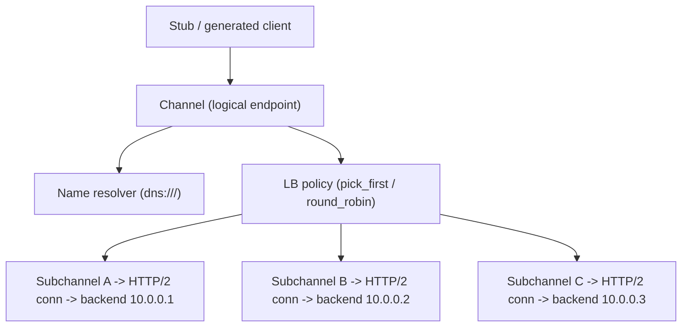
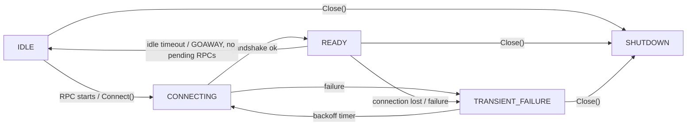
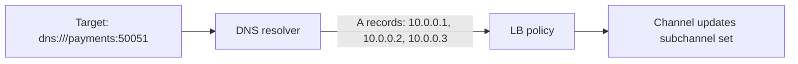
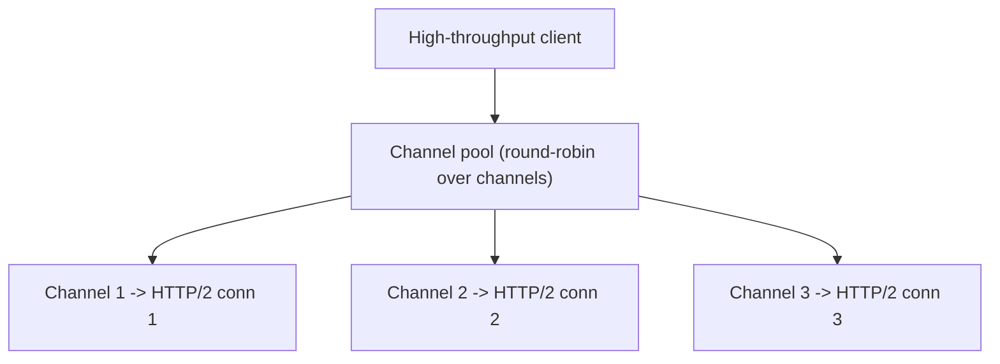
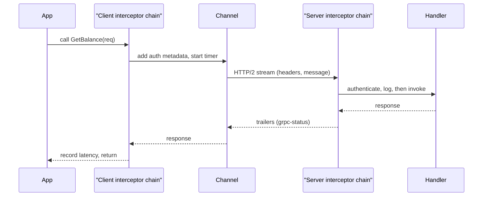
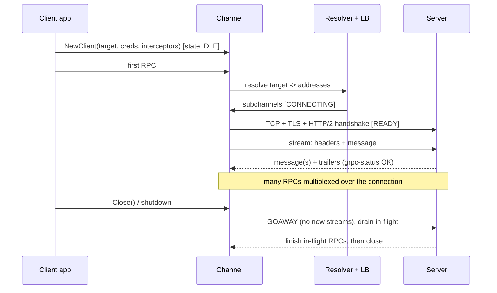

# Channels, Stubs & Client/Server Lifecycle

The **channel** is the single most misunderstood object in gRPC — and the most common
source of production incidents. Beginners treat it like an HTTP client connection they
open and close per call; it is actually a long-lived, expensive, self-managing
abstraction that owns a *pool* of connections, does name resolution and load balancing,
and tracks connectivity state. This page covers what a channel really is, how stubs sit
on top of it, how the server side accepts and serves RPCs, and the full lifecycle from
`createChannel` to graceful shutdown with a `GOAWAY`.

> [!INTERVIEW]
> If you remember one thing: **create a channel once, share it across all stubs and
> goroutines/threads, and keep it for the process lifetime.** Creating a channel per
> RPC is the classic anti-pattern — it forces a fresh DNS lookup, TCP+TLS handshake, and
> HTTP/2 connection setup on every call, destroying latency and defeating multiplexing.

HTTP/2 framing, HPACK, flow control, and the TLS handshake themselves live in
`networking` — see `networking/http2` and `networking/tls`. Here we stay at the gRPC
framework altitude: how gRPC *uses* those primitives. The resolver + load-balancing
policy internals are covered in depth in `grpc/load-balancing-and-service-discovery`;
this page introduces them only as they attach to the channel. General resilience theory
(retries, backoff, circuit breakers) lives in `reliability-ops`.

## The Channel: a virtual connection to a logical endpoint

A **`Channel`** (gRPC's `grpc.ClientConn` in Go, `ManagedChannel` in Java,
`grpc.Channel`/`aio.Channel` in Python) is a *virtual* connection to a **logical
endpoint** identified by a target string, not a single TCP socket. One channel:

- resolves the target name into a set of backend addresses (name resolution),
- maintains a **pool of subchannels** — one per backend address — each wrapping an
  HTTP/2 connection,
- runs a **load-balancing policy** that picks a subchannel for each new RPC,
- tracks **connectivity state** and transparently reconnects on failure,
- carries channel-wide config: credentials, interceptors, compression, keepalive,
  max message sizes, and the service config (retry/LB policy).



Because a channel does all this bookkeeping, it is **expensive to create** and **cheap
to reuse**. It is fully thread-safe: many stubs and many concurrent RPCs share one
channel, and gRPC multiplexes them over the underlying HTTP/2 streams.

```go
// Create ONCE, at process startup, and reuse.
conn, err := grpc.NewClient("dns:///payments.svc.cluster.local:50051",
    grpc.WithTransportCredentials(insecure.NewCredentials()))
if err != nil { log.Fatal(err) }
defer conn.Close()

// Many stubs can share the same conn.
payments := pb.NewPaymentsClient(conn)
refunds  := pb.NewRefundsClient(conn)
```

> [!WARNING]
> A channel does **not** eagerly connect by default. `grpc.NewClient` (Go) and building
> a `ManagedChannel` (Java) start in **IDLE**; the first RPC (or an explicit
> `Connect()`/`getState(true)`) triggers name resolution and connection establishment.
> This is why the *first* RPC on a fresh channel is slower — it pays the handshake cost.
> (Go's older `grpc.Dial`/`DialContext` with `WithBlock` connected eagerly; `Dial` is now
> deprecated in favor of the lazy `NewClient`.)

## Subchannels and the HTTP/2 connection pool

A **subchannel** is the channel's handle to a *single* backend address. Each subchannel
owns (at most) one HTTP/2 connection (a TCP+TLS connection) and has its own connectivity
state machine. The load-balancing policy operates on the set of subchannels: `pick_first`
uses one at a time; `round_robin` spreads RPCs across all READY subchannels.

This layering matters because of an HTTP/2 limit: **`SETTINGS_MAX_CONCURRENT_STREAMS`**.
A single HTTP/2 connection caps how many streams (= in-flight RPCs) can be active at
once. gRPC servers (and proxies) commonly advertise 100. Once you hit that ceiling on a
connection, new RPCs **queue** behind it rather than opening a second connection to the
same address — a single subchannel does not automatically fan out to multiple
connections.

> [!KEY-TAKEAWAY]
> One channel to one backend = effectively one HTTP/2 connection = capped at
> `MAX_CONCURRENT_STREAMS` in-flight RPCs. For very high throughput to a single backend,
> you need **multiple channels** (or a pool) so RPCs spread across multiple connections.
> See "Channel pooling for high throughput" below.

## Channel connectivity states and wait-for-ready

Every channel (and subchannel) moves through a fixed **connectivity state machine**
defined in the gRPC connectivity semantics doc:

| State | Meaning |
|---|---|
| `IDLE` | No active RPCs and no attempt to connect (or gone idle after inactivity). Cheap. |
| `CONNECTING` | Actively establishing a transport (DNS, TCP, TLS, HTTP/2 handshake). |
| `READY` | A working transport exists; RPCs can be sent. |
| `TRANSIENT_FAILURE` | The last connect attempt failed; the channel will retry with backoff. |
| `SHUTDOWN` | The channel is closing/closed; no new RPCs; terminal state. |



**Reconnect backoff.** When a subchannel enters `TRANSIENT_FAILURE`, gRPC does *not*
hot-loop reconnecting. It uses exponential backoff (per the gRPC connection-backoff
spec): a base delay, a multiplier (~1.6), jitter, capped at a max (~120s). This protects
a struggling backend from a reconnect storm.

**wait-for-ready** is the per-RPC (or per-channel) flag that decides what happens when
the channel is *not* `READY` at RPC start:

- **wait-for-ready = false (the default):** if the channel is in `TRANSIENT_FAILURE`
  (or otherwise can't get a connection), the RPC **fails fast** immediately with
  `UNAVAILABLE`. Good when you want to shed load / fail fast.
- **wait-for-ready = true:** the RPC is **queued** until the channel becomes `READY` (or
  the RPC's **deadline** fires, which then returns `DEADLINE_EXCEEDED`). Good for
  smoothing over brief blips at startup — but *only* safe when paired with a deadline,
  or the RPC can hang indefinitely.

> [!WARNING]
> `wait-for-ready = true` **without a deadline** is a hang waiting to happen: if the
> backend never comes up, the RPC blocks forever. Always set a deadline with
> wait-for-ready.

```go
resp, err := client.GetBalance(ctx, req, grpc.WaitForReady(true))
```

## Name resolution: dns:/// and the resolver plugin

A channel target is a URI: **`scheme://authority/endpoint`**. The **scheme** selects a
**resolver plugin** that turns the endpoint into a list of addresses (and optionally a
service config):

| Target | Resolver | Behavior |
|---|---|---|
| `dns:///host:port` | DNS resolver (default in most languages) | Resolves the A/AAAA records to a set of IPs. |
| `dns://8.8.8.8/host:port` | DNS with explicit authority | Uses a specific DNS server. |
| `ipv4:10.0.0.1:50051,10.0.0.2:50051` | static | Fixed address list, no DNS. |
| `unix:///path/to.sock` | unix domain socket | Local IPC. |
| `xds:///service` | xDS resolver | Gets endpoints + config from an xDS control plane (service mesh). |

The triple slash in `dns:///host:port` is deliberate: it means "empty authority", i.e.
use the default DNS server. Note that if you pass a bare `host:port` with no scheme, most
implementations default to the DNS resolver — but being explicit (`dns:///`) avoids
ambiguity.



> [!WARNING]
> The **default DNS resolver only re-resolves on reconnect / connection loss**, not on a
> timer, and gRPC caches the resolved set. If you scale a backend deployment up, a
> long-lived channel using `pick_first` will keep talking to the *original* IPs and never
> discover the new pods until it reconnects. This is the classic "gRPC doesn't load
> balance across my new Kubernetes pods" bug. Fixes: use `round_robin` + a headless
> Service so DNS returns all pod IPs, use a proxy/mesh, or use `xds`. Full treatment in
> `grpc/load-balancing-and-service-discovery`.

The resolver feeds the **load-balancing policy**, which decides how RPCs map onto
subchannels. Set it via service config: `{"loadBalancingConfig":[{"round_robin":{}}]}`.
Details (pick_first vs round_robin vs lookaside/xDS) are in the load-balancing topic.

## Stubs and generated clients (blocking, async, future)

A **stub** (a.k.a. client) is the generated, type-safe surface for calling a service's
methods. `protoc` + the gRPC plugin turns each `service` in the `.proto` into one or more
stub classes that marshal your request message, open an HTTP/2 stream on the channel,
send the serialized proto, and hand you back the response(s). Stubs are **cheap** — they
are thin wrappers over the channel; create as many as you like.

Languages expose several stub *flavors*:

| Flavor | Language examples | Semantics |
|---|---|---|
| **Blocking / synchronous** | Java `FooBlockingStub`, Python sync | Call blocks the calling thread until the response (or error). Simplest; can only do unary + server-streaming as blocking iterators. |
| **Async / future** | Java `FooFutureStub` (returns `ListenableFuture`), `FooStub` (callback-based) | Non-blocking; you get a future or register callbacks. Required for full-duplex bidi streaming. |
| **Coroutine / async-await** | Kotlin coroutine stubs, Python `grpc.aio` | Suspend/await style over the event loop. |

In Go there is a single generated client interface (methods return either a value+error
for unary, or a stream object); concurrency is handled by goroutines rather than stub
flavors.

```java
// Java: three stub flavors, all over the SAME channel.
var blocking = GreeterGrpc.newBlockingStub(channel);
var future   = GreeterGrpc.newFutureStub(channel);
var async    = GreeterGrpc.newStub(channel);      // required for client/bidi streaming

HelloReply r = blocking.sayHello(req);            // blocks
ListenableFuture<HelloReply> f = future.sayHello(req);  // non-blocking
```

> [!TIP]
> Attach **per-call options** by deriving a new stub, not mutating a shared one. In Java,
> `stub.withDeadlineAfter(200, MS).withCompression("gzip")` returns a *new* immutable stub
> — the original is untouched, so it's safe to share the base stub.

## The server: registering service impls, binding, concurrency

The server side: you implement the generated service base class, **register** the
implementation(s) with a server object, **bind** it to a port with credentials, and
**start** it. One server process can host multiple services on the same port (they are
distinguished by the `/package.Service/Method` path in the HTTP/2 `:path` header).

```go
lis, _ := net.Listen("tcp", ":50051")
s := grpc.NewServer(
    grpc.Creds(creds),
    grpc.MaxConcurrentStreams(200),                 // per-connection stream cap
    grpc.ChainUnaryInterceptor(authInterceptor, logInterceptor),
)
pb.RegisterPaymentsServer(s, &paymentsImpl{})       // register impl
pb.RegisterRefundsServer(s, &refundsImpl{})         // multiple services, one port
s.Serve(lis)                                        // blocks, serving RPCs
```

**Concurrency model** differs by language runtime:

- **Java (`grpc-java`, Netty/OkHttp):** an `Executor` (thread pool) runs handlers.
  Blocking work in a handler ties up a pool thread — size the pool for your blocking
  profile, or offload.
- **Go:** each RPC runs in its own **goroutine**; the runtime schedules them. Cheap
  concurrency, but you still guard shared state.
- **Python:** `grpc.server(futures.ThreadPoolExecutor(max_workers=N))` for sync; the pool
  size caps concurrent RPCs (a too-small pool silently queues/starves). `grpc.aio` gives
  an asyncio event-loop server instead.

Each incoming RPC is an HTTP/2 stream; the server reads the length-prefixed messages,
invokes your handler, and writes the response messages followed by **trailers** carrying
`grpc-status` and `grpc-message`. (The wire framing of that is in
`grpc/http2-foundations-for-grpc`; the status model in `grpc/error-handling-and-status-codes`.)

## Per-RPC vs per-channel options

gRPC lets you set behavior at two scopes; knowing which lives where is a common
interview probe:

| Option | Per-channel (set once) | Per-RPC (set per call) |
|---|---|---|
| Credentials (TLS/mTLS) | ✅ | — |
| Interceptors | ✅ | — |
| Keepalive settings | ✅ | — |
| Default service config (retry, LB, method deadlines) | ✅ | — |
| Max message send/recv size | ✅ (default) | ✅ (override) |
| **Deadline / timeout** | via service config default | ✅ (the norm — per call) |
| **Metadata** (custom headers) | — | ✅ |
| **Compression** | ✅ (default) | ✅ (override) |
| **wait-for-ready** | ✅ (default) | ✅ (override) |

The rule of thumb: **connection-shaping and security are per-channel; request-shaping is
per-RPC.** A **deadline** is almost always set per-RPC because it reflects *this*
request's latency budget, and it propagates downstream (see `grpc/deadlines-timeouts-cancellation`
and `grpc/retries-resiliency-and-deadline-propagation`).

> [!TIP]
> Prefer an **absolute deadline** over a relative "timeout". gRPC transmits the remaining
> time on the wire in the `grpc-timeout` header, so a deadline set at the edge naturally
> shrinks as it propagates through a call chain. A per-hop relative timeout does not.

## Channel pooling for high throughput

Because a channel to one backend funnels through one HTTP/2 connection capped at
`MAX_CONCURRENT_STREAMS`, a single channel can bottleneck under high concurrency even
though HTTP/2 multiplexes. Symptoms: RPC latency climbs under load while CPU is idle —
requests are **queued** waiting for a stream slot. The gRPC performance best-practices
guidance addresses this directly.

Mitigations, in order of preference:

1. **Use `round_robin` across many backends** — if DNS returns N addresses, RR spreads
   load over N connections, multiplying the stream ceiling by N. Often enough.
2. **Create a pool of channels** and round-robin RPCs across them (each channel gets its
   own connection to the backend). Rule of thumb from gRPC guidance: roughly **one
   channel per ~100 concurrent streams**, i.e. add a channel for every 100 in-flight RPCs
   you expect. Ensure the channels don't dedupe to the same connection (in Go, the
   `WithDisableServiceConfig`/local pool patterns or distinct target args help; some
   stacks provide explicit pool options).
3. **Raise `MAX_CONCURRENT_STREAMS`** on the server — helps, but a single TCP connection
   can still become a head-of-line / congestion bottleneck.



> [!WARNING]
> Don't over-pool. Each channel is a real connection with keepalive traffic and memory.
> The goal is enough connections to clear the stream ceiling, not one per RPC.

## Interceptors attach at the channel and the server

**Interceptors** (Java/Go/Python) — a.k.a. middleware — are the gRPC hook for
cross-cutting concerns: auth, logging, metrics, retries, tracing, deadline injection.
They attach **once, at the channel (client side) or the server**, and run for *every*
RPC through it. There are two kinds:

- **Unary interceptor** — wraps a single request/response call.
- **Stream interceptor** — wraps a streaming call (wrapping the stream object to observe
  each message).



Interceptors chain in order; the mechanics, metadata handling, and full examples live in
`grpc/metadata-headers-interceptors`. The point *here*: they are a **per-channel /
per-server** attachment, part of lifecycle setup, not something you wire per RPC.

## Client and server lifecycle end to end



**Graceful shutdown** is the part interviewers probe. A hard `Stop()`/kill drops
in-flight RPCs and returns errors to clients. A **graceful shutdown** instead:

- **Server side:** `GracefulStop()` (Go) / `shutdown()` + `awaitTermination()` (Java) /
  `server.stop(grace)` (Python). The server sends an HTTP/2 **`GOAWAY`** frame telling
  clients "don't start new streams on this connection", stops accepting new RPCs, lets
  **in-flight RPCs drain** to completion (up to a grace period), then closes. `GOAWAY`
  carries the last stream ID the server will process, so clients know exactly which
  in-flight RPCs are safe.
- **Client side:** `Close()` transitions the channel to `SHUTDOWN`, fails any new RPCs
  immediately, and lets in-flight ones finish (or cancels them, depending on API).
- On receiving `GOAWAY`, a healthy client **reconnects** (re-resolves + opens a fresh
  connection) so ongoing traffic continues on a new connection — this is how rolling
  deploys avoid dropping requests.

> [!KEY-TAKEAWAY]
> `GOAWAY` is the graceful-shutdown primitive: "finish what you started, start nothing
> new here." Combined with a drain grace period and client reconnect, it lets you deploy
> and scale down gRPC servers with zero dropped RPCs — provided requests have deadlines
> shorter than your grace period.

> [!WARNING]
> A long-running **server-streaming or bidi** RPC can outlive the grace period. `GOAWAY`
> stops *new* streams but a stream that's been open for an hour won't drain quickly.
> Bound long streams with deadlines or app-level "please reconnect" signals, or graceful
> shutdown will time out and hard-close them.

## Common Interview Follow-ups

- **"Why is creating a channel per request bad?"** Each channel triggers DNS, TCP, TLS,
  and HTTP/2 handshakes, and can't reuse multiplexed streams — huge latency and resource
  cost. Create once, share, reuse.
- **"A channel is READY but my new Kubernetes pods get no traffic — why?"** The default
  DNS resolver + `pick_first` caches the first resolved address and only re-resolves on
  disconnect. Use `round_robin` + headless Service, a proxy, or `xds`.
- **"Client hangs forever on a call — what did they likely misconfigure?"**
  `wait-for-ready=true` with no deadline while the backend is down.
- **"What happens to in-flight RPCs on `GracefulStop`?"** Server sends `GOAWAY`, stops
  new streams, drains existing RPCs up to the grace period, then closes.
- **"One backend, huge throughput, latency climbing but CPU idle — diagnosis?"** Hitting
  `MAX_CONCURRENT_STREAMS` on a single HTTP/2 connection; RPCs queue. Pool channels or
  spread across backends.
- **"IDLE vs TRANSIENT_FAILURE — difference?"** IDLE = no attempt to connect (cheap,
  intentional); TRANSIENT_FAILURE = a connect attempt failed and backoff is running.
- **"Are stubs thread-safe / expensive?"** Cheap and safe to share; the *channel* is the
  expensive shared object. Per-call options create derived immutable stubs.
- **"Does `NewClient` connect immediately?"** No — it starts IDLE and connects lazily on
  the first RPC (Go's old `Dial`+`WithBlock` was eager; `Dial` is deprecated).

## References

- gRPC Core Concepts, Architecture and Lifecycle — https://grpc.io/docs/what-is-grpc/core-concepts/
- gRPC Connectivity Semantics and Connection States — https://github.com/grpc/grpc/blob/master/doc/connectivity-semantics-and-api.md
- gRPC Connection Backoff protocol — https://github.com/grpc/grpc/blob/master/doc/connection-backoff.md
- gRPC Name Resolution — https://github.com/grpc/grpc/blob/master/doc/naming.md
- gRPC Performance Best Practices (channel reuse, pooling) — https://grpc.io/docs/guides/performance/
- gRPC Keepalive (gRFC A8) — https://github.com/grpc/proposal/blob/master/A8-client-side-keepalive.md
- Wait-for-ready — https://grpc.io/docs/guides/wait-for-ready/
- gRPC over HTTP/2 wire spec (GOAWAY, trailers) — https://github.com/grpc/grpc/blob/master/doc/PROTOCOL-HTTP2.md
- HTTP/2 RFC 9113 (GOAWAY, SETTINGS_MAX_CONCURRENT_STREAMS) — https://www.rfc-editor.org/rfc/rfc9113
- Cross-refs: `grpc/load-balancing-and-service-discovery`, `grpc/deadlines-timeouts-cancellation`, `grpc/metadata-headers-interceptors`, `networking/http2`, `networking/tls`, `reliability-ops`
