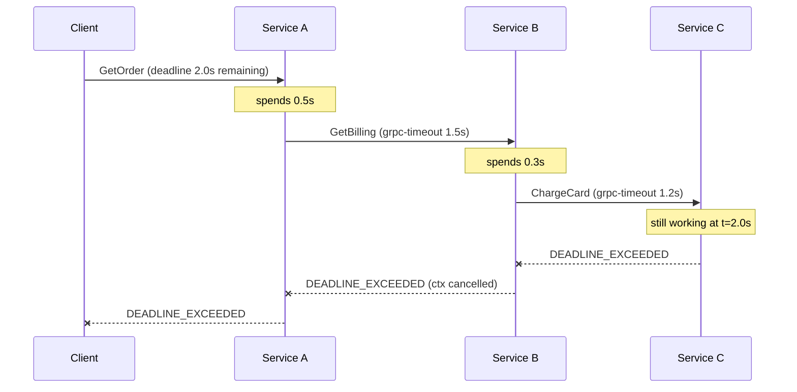
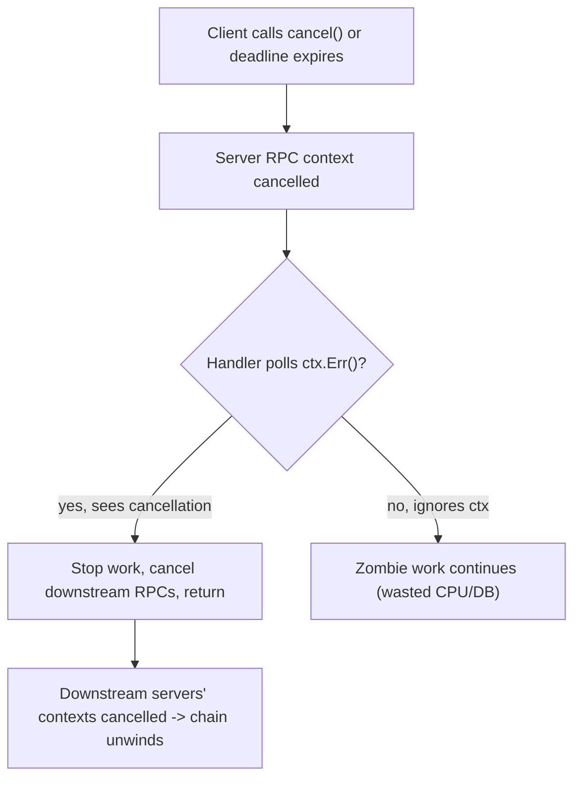
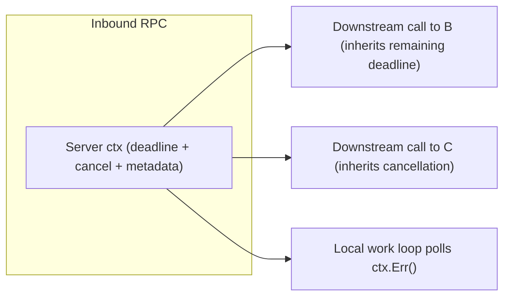

# Deadlines, Timeouts & Cancellation

This is one of the most-asked gRPC production topics, because the single most common
gRPC outage pattern is **"we forgot to set a deadline, a downstream stalled, and threads
piled up until the whole fleet fell over."** gRPC bakes an answer into the framework: RPCs
carry an **absolute deadline**, that deadline is sent on the wire as the `grpc-timeout`
header, it **propagates automatically down a call chain**, and when it expires both sides
are notified so work can stop. This page covers the mechanism — what actually goes on the
wire and in the framework — plus cancellation, the Context object, and how to choose values.

> [!INTERVIEW]
> The senior-level one-liner: *"gRPC clients set an absolute deadline, not a per-hop
> relative timeout. It travels as `grpc-timeout` (a remaining-time value, not a wall-clock
> timestamp — to dodge clock skew), it's decremented and re-propagated at each hop so a
> downstream call can never outlive its caller, and on expiry the RPC fails with
> `DEADLINE_EXCEEDED` while the server's context fires too — reporting `DeadlineExceeded` on
> expiry, or `CANCELLED` on an explicit client cancel. Cancellation is
> cooperative: the library won't kill your handler, so long-running handlers must poll the
> context."*

The general theory of deadline budgets, retry/backoff and circuit breaking is owned by
`reliability-ops` (see `reliability-ops/deadline-propagation` and
`reliability-ops/retries-backoff`); the gRPC **retry policy / hedging** config lives in the
sibling topic `grpc/retries-resiliency-and-deadline-propagation`. HTTP/2 framing, trailers
and flow control are owned by `networking` (RFC 9113). Here we stay at the gRPC
framework/protocol altitude.

## Deadlines vs Timeouts

The distinction is a favourite precision question:

- A **timeout** is a *relative duration* — "fail if this call takes more than 2 seconds."
- A **deadline** is an *absolute point in time* — "fail if this call has not completed by
  13:00:02.000 UTC."

gRPC's public APIs are expressed in terms of **deadlines**. A timeout is just a deadline
you compute at call start: `deadline = now() + timeout`. The reason the *deadline* is the
primitive is **propagation across a call chain** (below): an absolute deadline is a single
fixed target that every hop shares, whereas a naive relative timeout would reset the full
budget at every hop and let the total blow past what the original client is willing to wait.

| | Timeout (relative) | Deadline (absolute) |
|---|---|---|
| Expressed as | duration ("2s") | instant ("13:00:02") |
| Resets per hop? | yes, if passed naively | no — one shared target |
| gRPC public API uses | derived from deadline | **the primitive** |
| Survives being passed down a chain | poorly | correctly |

> [!KEY-TAKEAWAY]
> Think in **deadlines**, not timeouts. A deadline is set once near the edge of the request
> and every downstream hop races the same clock.

## The grpc-timeout header (wire format)

Although the *API* is a deadline, the *wire* carries a **remaining-time value**, because
sending an absolute wall-clock timestamp between two machines whose clocks may disagree is
fragile. Per the gRPC-over-HTTP2 wire spec, the client computes `remaining = deadline - now()`
and sends it in the request HEADERS as:

```
grpc-timeout = TimeoutValue TimeoutUnit
```

- **`TimeoutValue`** — a positive integer, **at most 8 digits**, as an ASCII string.
- **`TimeoutUnit`** — a single-letter code:

| Unit | Code |
|---|---|
| Hour | `H` |
| Minute | `M` |
| Second | `S` |
| Millisecond | `m` |
| Microsecond | `u` |
| Nanosecond | `n` |

So `grpc-timeout: 1S` means one second; `grpc-timeout: 100m` means 100 milliseconds. The
client picks a unit that fits the 8-digit limit. **If the header is absent, the server
assumes an infinite timeout** — this is exactly why "no deadline set" means "can hang
forever."

Because a *duration* (not a timestamp) is sent, the server reconstructs its own deadline
locally as `server_deadline = server_now() + grpc-timeout`. This sidesteps cross-machine
clock skew (an NTP-drifted server never mis-reads an absolute timestamp) at the cost of
ignoring in-flight network latency — the elapsed transit time is effectively "given" to the
callee, a deliberate, conservative trade-off.

> [!WARNING]
> `grpc-timeout` is a duration remaining, **not** an absolute time. Don't expect to read a
> UNIX timestamp out of it in a debugger. Also note it is capped at 8 digits per unit, so
> the client library will choose a coarser unit for very long deadlines.

## Always set a deadline

Because the default is **no deadline** (infinite), an RPC to a wedged or overloaded server
can block a client goroutine/thread and the resources it holds indefinitely. Under load
this cascades: blocked callers hold connections, thread pools, and memory; retries pile on;
the fleet tips over. **Setting a deadline on every outbound RPC is the top production
lesson** of this topic.

```go
// Go — derive a deadline from a timeout and attach it to the context.
ctx, cancel := context.WithTimeout(context.Background(), 2*time.Second)
defer cancel() // ALWAYS cancel to release the timer + context resources
resp, err := client.GetUser(ctx, &pb.GetUserRequest{Id: id})
if status.Code(err) == codes.DeadlineExceeded {
    // handle: the RPC ran out of budget
}
```

```java
// Java — deadlines are set on the stub, not the context; use withDeadline.
UserResponse resp = blockingStub
    .withDeadlineAfter(2, TimeUnit.SECONDS)   // relative -> absolute internally
    .getUser(request);
```

```python
# Python — the timeout kwarg is a relative duration; the library converts it.
resp = stub.GetUser(request, timeout=2.0)
```

> [!TIP]
> Set the deadline at the **edge** of the request (the API gateway / entry handler) based on
> what the *end user* will tolerate, and let propagation carry it inward. Setting a fresh
> generous deadline deep in the stack defeats the whole budget.

## Deadline propagation across a call chain

This is the flagship mechanism. When service A (handling a client RPC) calls service B, and
B calls C, gRPC ensures the **remaining** deadline flows downstream so no inner call outlives
the original caller's budget. Implementations that support it (enabled by default in Go and
Java; opt-in in C++) read the deadline off the **inbound** request's context and attach it to
**outbound** calls made from that context — minus the time already spent.

Crucially it propagates as a *recomputed remaining duration* at each hop, not the original
value: if A's client allowed 2s and A spent 0.5s before calling B, B receives `grpc-timeout`
of ~1.5s, and if B spends 0.3s before calling C, C receives ~1.2s.



The mechanism requires that the handler **passes the inbound context through** to outbound
calls. In Go this means using the `ctx` your handler received (never `context.Background()`)
for downstream stub calls; in Java the propagation rides on the `io.grpc.Context` / current
`Deadline`. Break that chain and you lose propagation.

```go
// Go handler: propagation works ONLY if you pass the inbound ctx downward.
func (s *server) GetOrder(ctx context.Context, r *pb.OrderReq) (*pb.Order, error) {
    // GOOD: ctx carries the remaining deadline + cancellation from the caller.
    bill, err := s.billing.GetBilling(ctx, &pb.BillReq{Id: r.Id})
    // BAD: context.Background() would give billing a FRESH infinite deadline.
    ...
}
```

> [!WARNING]
> The single most common propagation bug: a handler calls downstream with a brand-new
> `context.Background()` (Go) or a fresh channel/stub without the inbound deadline (Java),
> so the downstream call gets an *infinite* budget and can outlive the client. Always thread
> the inbound context through.

Because transit time is not subtracted, propagation is slightly generous — but it can never
*extend* the budget beyond the original deadline, which is the invariant that matters.

## What happens on deadline expiry

When the deadline passes:

1. **Client side:** the RPC is failed locally with status **`DEADLINE_EXCEEDED`** (code 4).
   The client stops waiting immediately — it does not need the server to respond.
2. **Wire:** gRPC sends an HTTP/2 `RST_STREAM` to tear down the stream for that RPC (recall
   gRPC maps one RPC to one HTTP/2 stream; other streams on the connection are unaffected —
   see `networking` for HTTP/2 multiplexing).
3. **Server side:** the server's RPC **context fires** (its `Done()` channel closes). Because
   the server reconstructs a *local* deadline from `grpc-timeout` (see the wire section), on
   pure deadline expiry the handler's context error is **`DeadlineExceeded`** — in gRPC-Go
   `ctx.Err()` returns `context.DeadlineExceeded`, which maps to `DEADLINE_EXCEEDED` (code 4).
   (An *explicit client cancel* or disconnect, by contrast, surfaces as `Canceled`/`CANCELLED`
   — see the next section.) Either way the server is *notified* but **not forcibly stopped** —
   gRPC has no way to interrupt your handler mid-execution. The exact surfaced error can vary
   slightly by language/implementation, but the deadline-vs-explicit-cancel split holds.
4. **Downstream:** because the server's context is now done, any outbound calls made
   from that context are cancelled too, propagating the teardown down the chain.

> [!KEY-TAKEAWAY]
> The **client** sees `DEADLINE_EXCEEDED` (code 4). The **server's** context also fires: on
> deadline expiry the handler typically observes `DeadlineExceeded`, whereas an explicit client
> cancel/disconnect surfaces as `CANCELLED` (code 1). Same family of events, distinct triggers.
> Either way the server must *cooperate* by noticing and stopping work — the framework won't
> kill the handler for you.

A server that ignores the cancelled context keeps burning CPU, holding DB connections, and
doing work whose result no one will read — the classic "zombie work" waste. Well-behaved
handlers check the context and abort early:

```go
func (s *server) Crunch(ctx context.Context, r *pb.Req) (*pb.Resp, error) {
    for _, chunk := range work {
        if err := ctx.Err(); err != nil { // Canceled or DeadlineExceeded
            return nil, status.FromContextError(err).Err()
        }
        process(chunk)
    }
    ...
}
```

## Cancellation

Cancellation is the more general mechanism; deadline expiry is just one trigger. Others:
the client explicitly cancels, the client disconnects, or an I/O error occurs. In every case
the effect on the server is the same shape — its context becomes *done* and the handler should
stop (though `ctx.Err()` distinguishes `Canceled` from `DeadlineExceeded`, per the previous
section).

A client cancels by calling a cancel method on the call/context object; the cancel API takes
a reason string that surfaces in a client-side error/log. Cancellation is:

- **Cooperative / best-effort:** "the gRPC library in general does not have a mechanism to
  interrupt the application-provided server handler." A long-lived handler **must
  periodically check** whether its RPC was cancelled and, if so, stop.
- **Propagating:** since a server is usually also a client, cancellation should flow to all
  downstream computation. Go/Java/C++ auto-cancel *outgoing* RPCs when the current context is
  cancelled; otherwise you wire it up by hand.



```go
// Client cancelling a long-running / streaming RPC in Go.
ctx, cancel := context.WithCancel(context.Background())
stream, _ := client.Tail(ctx, &pb.TailReq{})
go func() {
    if userNavigatedAway() {
        cancel() // cancels the stream; server ctx.Done() fires
    }
}()
for {
    msg, err := stream.Recv()
    if err != nil { break } // will surface as Canceled after cancel()
    render(msg)
}
```

For **streaming** RPCs specifically, cancellation is how you tear down an open stream you no
longer need (e.g. the user closes a live feed). Cancelling the context/call ends the stream
in both directions; on the server the `stream.Context().Done()` channel (Go) or `Context`
cancellation (Java) fires so the send/recv loop can exit.

> [!WARNING]
> Cancellation is **not** a way to force-kill a runaway handler. If your handler is a tight
> CPU loop that never checks the context, cancellation (and deadline expiry) does nothing to
> it until it returns on its own. Poll `ctx` in long loops and around blocking calls.

## The Context object

Every RPC carries a per-call **context** (`context.Context` in Go, `io.grpc.Context` in
Java, `grpc.ServicerContext` / `context` in Python). It is the single carrier for:

- the **deadline** (and thus the remaining-time budget);
- the **cancellation** signal (a channel/callback that fires on cancel, disconnect, or
  expiry);
- request-scoped **metadata** (headers/trailers — owned in depth by
  `grpc/metadata-headers-interceptors`);
- values (auth principal, trace span, etc.).

Key properties for interviews:

- It is **per-RPC and immutable/derived** — you *derive* a child context (adding a deadline
  or cancel) rather than mutating one. Cancelling a parent cancels all children.
- On the **server**, the context you receive is already wired to the inbound deadline and to
  client disconnection — passing it downstream is what enables propagation.
- You must **release** it: in Go, always `defer cancel()` on any context you create with
  `WithTimeout`/`WithCancel`, or you leak the timer/goroutine.



## Choosing deadline values

There is no universal number; a deadline is a **budget** you set deliberately. Interview-grade
reasoning:

- **Work backward from the user-facing SLO.** If the edge must answer in 300 ms p99, that is
  the total budget; inner hops must fit inside it, not each get 300 ms.
- **Base each hop on the downstream's p99 latency plus headroom**, not its average. Sizing on
  the mean guarantees you time out a large fraction of legitimately slow-but-fine calls.
- **Leave budget for retries.** If you retry once, a single attempt's deadline plus backoff
  must fit inside the parent budget, or the retry never gets to run (the parent deadline
  fires first). This interplay with retry policy is detailed in
  `grpc/retries-resiliency-and-deadline-propagation`.
- **Deadlines shrink as you go inward** (propagation subtracts elapsed time), so the deepest
  services see the tightest budgets — design them to be fast or to fail fast.

The general budgeting theory (percentile math, why deadlines beat retries for load-shedding,
"deadline propagation" as a resilience pattern) is owned by
`reliability-ops/deadline-propagation`; here the gRPC-specific point is simply that the
framework *carries and enforces* the budget for you once you set it.

## Deadline vs keepalive vs connection timeout

These are frequently conflated. They operate at different layers and answer different
questions:

| Mechanism | Scope | Question it answers | Trigger / config |
|---|---|---|---|
| **Deadline / timeout** | one **RPC** (application) | "has this *call* taken too long?" | `grpc-timeout` header; `DEADLINE_EXCEEDED` |
| **Keepalive** | one **connection / transport** | "is this idle TCP+HTTP2 connection still alive?" | HTTP/2 PING frames on an interval; see gRFC A8 |
| **Connection / dial timeout** | establishing a **connection** | "can I even connect (TCP+TLS handshake)?" | channel dial options |
| **Idle timeout** | a channel | "should I drop an unused connection to save resources?" | channel idle setting |

Key distinctions:

- A **deadline** governs a *logical call* and can span retries; it fails the RPC with
  `DEADLINE_EXCEEDED`.
- **Keepalive** (gRFC A8, client-side keepalive) sends periodic HTTP/2 PINGs to detect a dead
  peer or a silently-dropped connection (e.g. a NAT/LB idle-reaped it) and to keep long-lived
  streams from being reaped. It has nothing to do with how long a single call may take;
  misconfigured aggressive keepalive can even get you `ENHANCE_YOUR_CALM`/`GOAWAY` from a
  server that considers your PINGs abusive. HTTP/2 PING framing is owned by `networking`.
- A **connection timeout** bounds only the handshake, not the RPC.

> [!WARNING]
> "My RPCs hang" is usually a **deadline** problem, not a keepalive problem. Keepalive detects
> a *broken* connection; it will not rescue a call to a server that is connected but simply
> slow — only a deadline will.

## Common Interview Follow-ups

- **"What header carries the deadline and in what form?"** `grpc-timeout`, sent in the request
  HEADERS as a positive integer (≤8 digits) plus a unit code (`H/M/S/m/u/n`) — a *remaining
  duration*, not a wall-clock timestamp, to avoid clock skew.
- **"Client sees `DEADLINE_EXCEEDED` — what does the server see?"** Its context becomes *done*.
  On plain deadline expiry the handler typically observes `DeadlineExceeded` (gRPC-Go:
  `context.DeadlineExceeded`), because the server ran its own locally-reconstructed deadline; an
  *explicit client cancel/disconnect* instead surfaces as `CANCELLED` (code 1). Either way the
  server is notified but not force-stopped; it must poll the context.
- **"Why absolute deadlines instead of per-hop timeouts?"** So a shared budget propagates down
  a chain and inner calls can't outlive the caller; a naive relative timeout resets at each hop.
- **"How does propagation compute the downstream value?"** Remaining time = original deadline −
  elapsed; each hop re-derives it. Transit latency isn't subtracted (a conservative choice).
- **"How do you cancel a long server-streaming call from the client?"** Cancel the
  context/call (Go `cancel()`); the server's `ctx.Done()` fires and the stream tears down via
  `RST_STREAM`.
- **"Why does my cancelled handler keep running?"** Cancellation is cooperative — gRPC can't
  interrupt your code. Poll `ctx.Err()` in loops and around blocking work.
- **"What's the default deadline?"** None — infinite. Always set one.
- **"Difference between deadline and keepalive?"** Deadline bounds a call; keepalive (gRFC A8)
  detects dead connections via HTTP/2 PINGs. Different layers.
- **"Common propagation bug?"** Passing `context.Background()` downstream instead of the
  inbound context, giving the downstream call a fresh infinite budget.

## References

- gRPC docs — Deadlines: https://grpc.io/docs/guides/deadlines/
- gRPC docs — Cancellation: https://grpc.io/docs/guides/cancellation/
- gRPC-over-HTTP2 wire spec (`grpc-timeout`, trailers, `grpc-status`):
  https://github.com/grpc/grpc/blob/master/doc/PROTOCOL-HTTP2.md
- gRPC status codes: https://grpc.io/docs/guides/status-codes/
- gRPC-Go package reference (server context / `status.FromContextError` mapping
  `context.DeadlineExceeded`→`DEADLINE_EXCEEDED`, `context.Canceled`→`CANCELLED`):
  https://pkg.go.dev/google.golang.org/grpc
- gRFC A8 — client-side keepalive:
  https://github.com/grpc/proposal/blob/master/A8-client-side-keepalive.md
- gRFC A6 — client retries (deadline/retry interplay):
  https://github.com/grpc/proposal/blob/master/A6-client-retries.md
- RFC 9113 — HTTP/2 (streams, `RST_STREAM`, PING, trailers): https://www.rfc-editor.org/rfc/rfc9113
- Cross-refs: `reliability-ops/deadline-propagation`, `reliability-ops/retries-backoff`,
  `grpc/retries-resiliency-and-deadline-propagation`, `networking` (HTTP/2),
  `grpc/metadata-headers-interceptors`.
