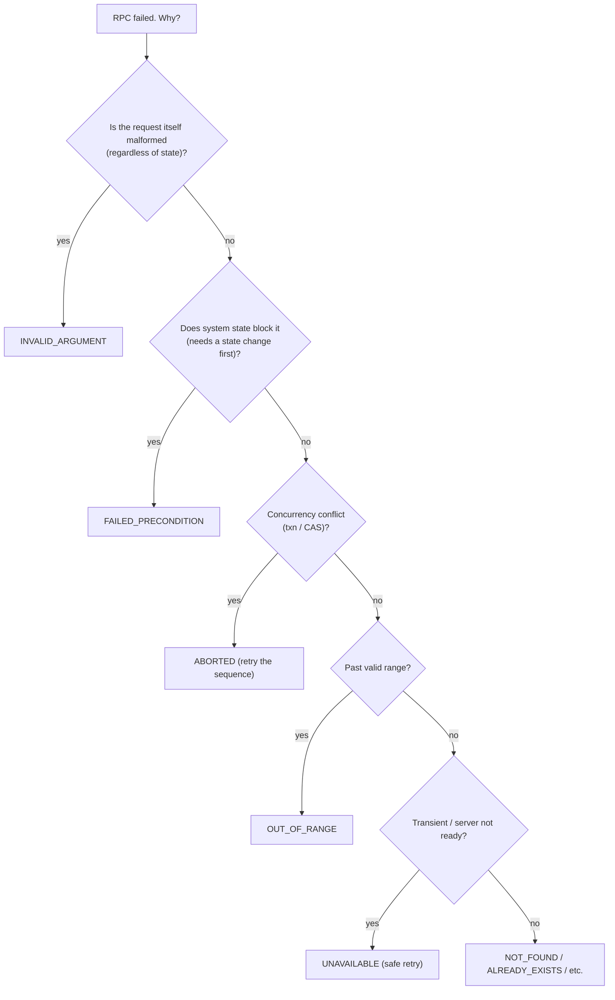
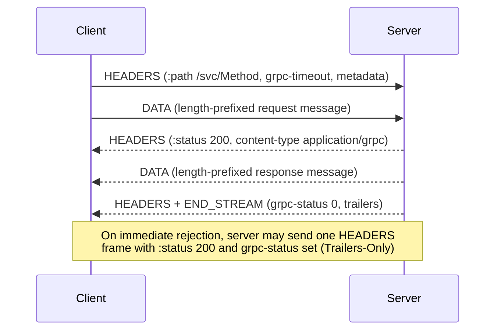
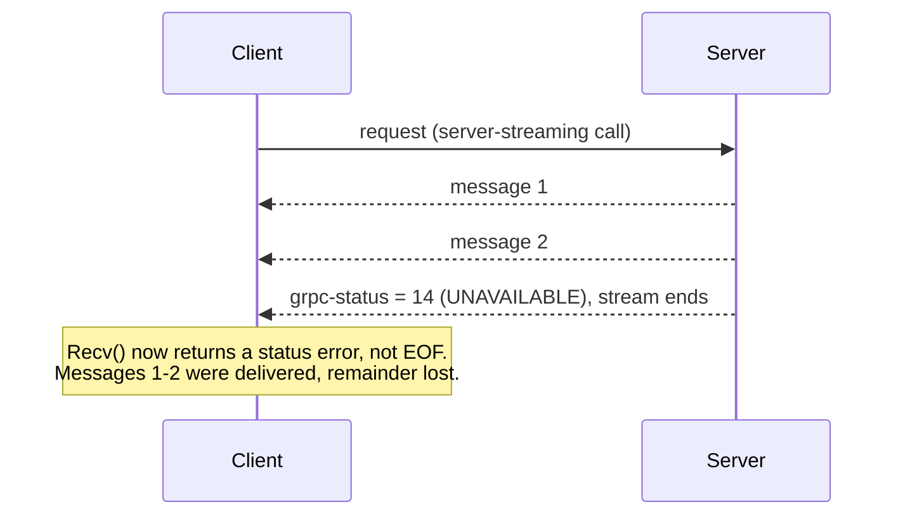

# Error Handling & Status Codes

Every gRPC call — unary or streaming — terminates with exactly one **status**: a
numeric **code**, an optional human-readable **message**, and optional structured
**details**. This is gRPC's universal error contract. Unlike REST, where the outcome
is smeared across an HTTP status line plus an ad-hoc JSON body, gRPC uses one small,
closed set of ~17 codes shared by every method in every language, delivered in HTTP/2
**trailers**. Getting the code selection right (and knowing what actually travels on
the wire) is a recurring senior-interview theme because it drives client retry
behaviour, alerting, and cross-service error propagation.

> [!KEY-TAKEAWAY]
> A gRPC call always ends with a `(code, message, details)` status. The code comes
> from a fixed enum of 17 values; `OK=0` means success. The status rides in HTTP/2
> **trailers** (`grpc-status`, `grpc-message`), and rich structured errors ride in the
> binary `grpc-status-details-bin` trailer as a serialized `google.rpc.Status`.

> [!NOTE]
> HTTP/2 framing, HPACK, and trailer mechanics themselves are owned by the
> **networking** domain; TLS/mTLS internals by **networking/security**; general
> retry/backoff/circuit-breaker theory by **reliability-ops**; interceptor plumbing by
> the **Metadata, Headers & Interceptors** topic. Here we stay at the gRPC status/error
> altitude and cross-reference those.

## The Status Model

Every RPC's result is a **`Status`** object with three parts:

| Part | Type | Meaning |
|---|---|---|
| **code** | enum `0..16` | The outcome class. `OK` (0) = success; anything else = error. |
| **message** | UTF-8 string | Human-oriented, free-form; for logs/debugging, not for programmatic branching. |
| **details** | repeated `Any` | Optional machine-readable payload (the *rich error model*, below). |

The **status code is the only part clients should branch on programmatically.** The
message is descriptive text; details carry structured data. A successful RPC has code
`OK` and (usually) an empty message.

The framework surfaces the status differently per language, but semantically it is
always the same triple:

- **Go:** `status.FromError(err)` → `*status.Status` with `.Code()`, `.Message()`,
  `.Details()`. Servers return `status.Error(codes.NotFound, "…")`.
- **Java:** a `StatusRuntimeException` carrying `Status` + `Metadata` trailers.
- **Python:** the call raises `grpc.RpcError`; `err.code()`, `err.details()`.

```go
// Server side (Go): return a coded error.
return nil, status.Error(codes.NotFound, "user 42 not found")

// Client side: extract the code.
resp, err := client.GetUser(ctx, req)
if err != nil {
    st := status.Convert(err)      // never nil; UNKNOWN if not a gRPC status
    switch st.Code() {
    case codes.NotFound:  /* handle */
    case codes.Unavailable: /* retry */
    }
}
```

> [!WARNING]
> If a server handler returns a *plain* (non-status) error, gRPC does not leak it — the
> client sees code `UNKNOWN` (2) with a generic message. Always wrap intended errors in
> a `status` so the client gets a meaningful code. Similarly, an unhandled panic/exception
> in a handler typically surfaces as `UNKNOWN` or `INTERNAL`.

## The Canonical Status Codes

There are **17 codes**, `0` through `16`. They are defined once (in
`google.rpc.Code` / `grpc/codes`) and shared by every gRPC implementation, so a Go
server and a Java client agree on their meaning.

| # | Code | Typical meaning | Who usually generates it |
|---|---|---|---|
| 0 | `OK` | Success | server (implicit) |
| 1 | `CANCELLED` | Caller cancelled the RPC | client (or propagated) |
| 2 | `UNKNOWN` | Unknown error / uncaught exception / plain error returned | server, fallback |
| 3 | `INVALID_ARGUMENT` | Client sent a malformed argument (bad regardless of system state) | server (app) |
| 4 | `DEADLINE_EXCEEDED` | The RPC deadline elapsed | framework (either side) |
| 5 | `NOT_FOUND` | Requested entity does not exist | server (app) |
| 6 | `ALREADY_EXISTS` | Entity the client tried to create already exists | server (app) |
| 7 | `PERMISSION_DENIED` | Caller authenticated but not authorized for this operation | server (authz) |
| 8 | `RESOURCE_EXHAUSTED` | Quota/rate limit hit, out of space, per-user throttle | server, framework |
| 9 | `FAILED_PRECONDITION` | System state prevents the operation (retrying same request won't help until state changes) | server (app) |
| 10 | `ABORTED` | Concurrency conflict — txn abort, sequencer/CAS check failure | server (app) |
| 11 | `OUT_OF_RANGE` | Operation attempted past the valid range (e.g. seek past EOF) | server (app) |
| 12 | `UNIMPLEMENTED` | Method not implemented/enabled by this server | server, framework |
| 13 | `INTERNAL` | Serious internal invariant broken; something is badly wrong | server, framework |
| 14 | `UNAVAILABLE` | Transient — service down, connection dropped, not ready; **safe to retry** | framework, server |
| 15 | `DATA_LOSS` | Unrecoverable data loss or corruption | server (app) |
| 16 | `UNAUTHENTICATED` | Request lacks valid credentials for the operation | server (authn) |

> [!TIP]
> Interviewers love the "name the code number" trap. Anchor a few: `OK=0`,
> `INVALID_ARGUMENT=3`, `DEADLINE_EXCEEDED=4`, `NOT_FOUND=5`, `PERMISSION_DENIED=7`,
> `UNAVAILABLE=14`, `UNAUTHENTICATED=16`. Note `UNAUTHENTICATED` is the *last* code
> (16), a common surprise given its name suggests it'd be near `PERMISSION_DENIED` (7).

## Choosing the Right Code

The distinctions between "the argument is bad" codes are the most tested judgment area.
The canonical gRPC guidance (`doc/statuscodes.md`) is precise:

- **`INVALID_ARGUMENT`** — the argument is wrong **independent of the system's state**.
  A negative page size, an unparseable field, a required field left empty. Fixing the
  request means changing the argument. **Not retryable** as-is.
- **`FAILED_PRECONDITION`** — the argument is fine, but the **system is not in the
  state** the operation requires. Example: deleting a non-empty directory, or a step
  that must run only after another step. The client should **not** retry until it fixes
  the *system state* (e.g. empties the directory first).
- **`OUT_OF_RANGE`** — a *specialization* of failed-precondition/invalid-argument for
  operations that ran **past the valid range**, e.g. reading past end-of-file. It is
  distinguished so a client iterating a range can detect completion (`OUT_OF_RANGE`)
  without a stateful check (unlike `FAILED_PRECONDITION`, an `OUT_OF_RANGE` can be
  fixed by the client without changing system state — just request an in-range value).

Concurrency and existence codes:

- **`ALREADY_EXISTS`** vs **`NOT_FOUND`** — creation of an entity that exists / lookup
  of one that doesn't. Both are about a specific named entity.
- **`ABORTED`** — a *concurrency* failure: transaction abort, optimistic-lock/CAS
  conflict, sequencer check failed. The client typically **retries at a higher level**
  (re-read, recompute, retry the whole sequence). Contrast with `FAILED_PRECONDITION`,
  where a plain retry is useless until state changes.
- **`RESOURCE_EXHAUSTED`** — quota exhausted, rate limited, per-user or per-system
  throttle, disk/memory full. Often paired with a `RetryInfo` detail telling the client
  how long to wait.



> [!INTERVIEW]
> "A client asks to read bytes past the end of a file — what code?" `OUT_OF_RANGE`.
> "It asks to delete a directory that still has files?" `FAILED_PRECONDITION`. "It
> sends `page_size = -1`?" `INVALID_ARGUMENT`. Being able to instantly separate these
> three signals real gRPC experience.

## Authentication vs Authorization Codes

A classic distinction, mirrored from HTTP's 401/403:

| Code | Question it answers | Analogy |
|---|---|---|
| `UNAUTHENTICATED` (16) | *Who are you?* — no/invalid/expired credentials | HTTP `401 Unauthorized` |
| `PERMISSION_DENIED` (7) | *You're known, but may you do this?* — identity is valid but lacks the right | HTTP `403 Forbidden` |

Key rule from the spec: **`PERMISSION_DENIED` must not be used when the caller cannot
be identified** (use `UNAUTHENTICATED`), and it must **not** be used to indicate the
resource is missing (use `NOT_FOUND`) or that some precondition failed. It is purely
"authenticated identity lacks authorization."

> [!WARNING]
> Returning `PERMISSION_DENIED` when the entity simply doesn't exist can be a
> deliberate choice to avoid leaking existence, but the *default* semantic is:
> missing → `NOT_FOUND`, unauthenticated → `UNAUTHENTICATED`, authenticated-but-forbidden
> → `PERMISSION_DENIED`.

## How Status Travels on the Wire

A gRPC call is one HTTP/2 stream. The response is framed as:

1. **Response headers** (an HTTP/2 `HEADERS` frame): `:status: 200`,
   `content-type: application/grpc`, plus any custom initial metadata.
2. **Zero or more message frames** (length-prefixed protobuf in `DATA` frames).
3. **Trailers** (a final `HEADERS` frame with `END_STREAM`): this is where the gRPC
   status lives.

The status is carried in these **trailing metadata** entries:

| Trailer | Contents |
|---|---|
| `grpc-status` | The integer code (e.g. `5` for `NOT_FOUND`). **Always present** on a completed RPC. |
| `grpc-message` | The status message, **percent-encoded** (ASCII; non-ASCII bytes escaped as `%XX`). Optional. |
| `grpc-status-details-bin` | Base64-encoded serialized `google.rpc.Status` (the rich error model). Optional; a `-bin` binary header. |

> [!KEY-TAKEAWAY]
> The **HTTP status is almost always `200 OK`, even for gRPC errors.** The real
> gRPC outcome is `grpc-status` in the **trailers**. This is exactly why gRPC *requires*
> HTTP/2: trailers let the server send a status *after* streaming the body. (Trailer
> framing itself is a networking-domain topic — cross-reference it.)

**Trailers-Only responses.** If the server has nothing to send *before* the status —
e.g. it rejects the call immediately (auth failure, unimplemented method) — it may
collapse everything into a **single `HEADERS` frame** that carries `:status: 200`,
`content-type`, **and** `grpc-status`/`grpc-message` together, with `END_STREAM` set and
no `DATA` frames. This is the "Trailers-Only" case; clients must handle a status that
arrives in the *initial* header block.



> [!NOTE]
> A **non-200 HTTP status** (e.g. a proxy returns `502`, or `:status: 404`) is a
> *transport-level* failure, not a gRPC status. gRPC maps these to codes via a fixed
> table — e.g. HTTP `502/503/504` → `UNAVAILABLE`, `401` → `UNAUTHENTICATED`, `403` →
> `PERMISSION_DENIED`, `429` → `UNAVAILABLE` (with retry semantics), `400` → `INTERNAL`.
> An intermediary that can't reach the server thus surfaces as `UNAVAILABLE`.

## The Rich Error Model

The `(code, message)` pair is often not enough — you want structured, machine-readable
detail (which field was invalid, how long to back off, which quota was hit). gRPC's
**rich error model** solves this with two protos from `google.rpc`:

```protobuf
// google/rpc/status.proto
message Status {
  int32 code = 1;                    // a google.rpc.Code value
  string message = 2;                // developer-facing message
  repeated google.protobuf.Any details = 3;  // packed error-detail messages
}
```

Servers serialize a `google.rpc.Status` (with `details` packed as `Any`) and put it in
the **`grpc-status-details-bin`** trailer (base64). Client libraries expose helpers
(Go: `st.Details()`; Java: `StatusProto.fromThrowable`; Python:
`grpc_status.rpc_status.from_call`) to unpack the `Any` list back into typed messages.

```go
// Server: attach a BadRequest detail describing the offending field.
st := status.New(codes.InvalidArgument, "email is malformed")
st, _ = st.WithDetails(&errdetails.BadRequest{
    FieldViolations: []*errdetails.BadRequest_FieldViolation{
        {Field: "user.email", Description: "must be a valid RFC 5322 address"},
    },
})
return nil, st.Err()
```

> [!WARNING]
> The rich error model rides in **metadata (trailers)**, which is subject to the
> server's/transport's max header list size. Do **not** stuff large payloads (stack
> traces, big lists) into error details — oversized trailers can be truncated or
> rejected, and huge metadata hurts every RPC. Keep details small and structured.

> [!NOTE]
> The `code` inside `google.rpc.Status` should match the `grpc-status` code. They are
> two encodings of the same outcome; clients treat the top-level `grpc-status` as
> authoritative and use the details for extra structure.

## Standard Error Detail Types

`google.rpc.error_details.proto` defines reusable, standardized detail messages. Using
these (instead of ad-hoc app protos) means generic tooling and clients understand them:

| Detail type | Purpose | Often paired with |
|---|---|---|
| `ErrorInfo` | Stable, machine-readable **reason** + **domain** + metadata map — the primary "what went wrong" identifier | any code |
| `RetryInfo` | How long the client should wait before retrying (`retry_delay`) | `UNAVAILABLE`, `RESOURCE_EXHAUSTED` |
| `QuotaFailure` | Which quota/limit was exceeded (list of violations) | `RESOURCE_EXHAUSTED` |
| `BadRequest` | Per-field validation violations (`field`, `description`) | `INVALID_ARGUMENT` |
| `PreconditionFailure` | Which precondition(s) failed (type/subject/description) | `FAILED_PRECONDITION` |
| `ResourceInfo` | The resource name/type/owner involved | `NOT_FOUND`, `ALREADY_EXISTS` |
| `Help` | Links to docs/help resolving the error | any |
| `LocalizedMessage` | A locale + user-facing message | any |
| `DebugInfo` | Stack entries + detail (debug only — avoid in prod) | `INTERNAL` |
| `RequestInfo` | Request id / serving data for support correlation | any |

> [!TIP]
> `ErrorInfo` is the one to know: it gives a **stable `reason`** (an UPPER_SNAKE_CASE
> enum-like string, e.g. `USER_SUSPENDED`) and a **`domain`** (e.g. `myservice.example.com`)
> plus a metadata map. Clients branch on `reason` for behaviour that the coarse status
> code can't express — many different `PERMISSION_DENIED`s can share code 7 but differ
> by `reason`.

## Retryable vs Non-Retryable Codes

Whether a code is retryable is a *semantic* property of the code, and it drives gRPC's
built-in retry policy (configured in **service config**; see gRFC A6 and the
**Retries, Resiliency & Deadline Propagation** topic for mechanics).

- **Safely retryable (transient):** **`UNAVAILABLE`** is the canonical retryable code —
  it means "try again, the failure is transient" (server restarting, connection dropped,
  LB has no ready backend). Retries here are usually safe even for non-idempotent calls
  *if the server never received/processed the request* — but that guarantee isn't
  universal, so treat with care.
- **Sometimes retryable with backoff:** `RESOURCE_EXHAUSTED` (after the `RetryInfo`
  delay), `ABORTED` (retry the whole read-modify-write sequence), and
  `DEADLINE_EXCEEDED` *only* if you extend the deadline (retrying with the *same*
  already-blown deadline is pointless).
- **Not retryable (deterministic):** `INVALID_ARGUMENT`, `NOT_FOUND`, `ALREADY_EXISTS`,
  `PERMISSION_DENIED`, `UNAUTHENTICATED`, `FAILED_PRECONDITION`, `OUT_OF_RANGE`,
  `UNIMPLEMENTED`, `INTERNAL`, `DATA_LOSS` — the same request will fail the same way, so
  retrying just wastes resources (and can amplify load — a retry storm).

In gRPC's service config, the retry policy lists an explicit
**`retryableStatusCodes`** set; the client only retries responses whose `grpc-status`
is in that set (and only when no message has been received yet / the RPC is committed
per gRFC A6).

```json
{
  "methodConfig": [{
    "name": [{"service": "myapp.Users"}],
    "retryPolicy": {
      "maxAttempts": 4,
      "initialBackoff": "0.1s",
      "maxBackoff": "1s",
      "backoffMultiplier": 2,
      "retryableStatusCodes": ["UNAVAILABLE"]
    }
  }]
}
```

> [!WARNING]
> Never blanket-retry `INTERNAL` or `UNKNOWN` — they may indicate the server *did*
> partially process the request, so a retry on a non-idempotent method can double-apply
> effects. And retrying `INVALID_ARGUMENT`/`NOT_FOUND` is pure waste. Match the
> `retryableStatusCodes` set to the codes your service actually uses for transient
> faults.

## Mapping Domain Errors to Status Codes

The server's job is to translate its internal/domain errors into the closest canonical
code so clients (which don't know your internals) can react generically. Good practice:

- Keep a **single translation layer** (often an interceptor) that maps domain
  errors/exceptions → `status.Error(code, msg)` + details, so codes stay consistent
  across handlers.
- Attach an **`ErrorInfo`** with a stable `reason` when the code alone is too coarse.
- **Don't over-specify** — clients can only branch on the 17 codes plus your `ErrorInfo`
  reasons; inventing meaning by abusing a code (e.g. using `INTERNAL` for validation
  errors) breaks retry logic and alerting.
- **`INTERNAL` is for "our invariant broke,"** not "the user did something wrong."
  Misusing `INTERNAL`/`UNKNOWN` for client errors inflates error-rate alerts and makes
  on-call miserable.

| Domain situation | Right code | Wrong-but-common code |
|---|---|---|
| Validation: bad input value | `INVALID_ARGUMENT` | `INTERNAL` |
| Record not found | `NOT_FOUND` | `INVALID_ARGUMENT` |
| Duplicate create | `ALREADY_EXISTS` | `INVALID_ARGUMENT` |
| Rate limited | `RESOURCE_EXHAUSTED` | `UNAVAILABLE` |
| Optimistic-lock conflict | `ABORTED` | `INTERNAL` |
| Downstream dependency down | `UNAVAILABLE` | `INTERNAL` |
| Feature/method disabled | `UNIMPLEMENTED` | `INTERNAL` |
| Expired token | `UNAUTHENTICATED` | `PERMISSION_DENIED` |

## Error Handling in Streaming RPCs

In all four RPC types, the **status is the single terminal event** that ends the RPC —
there is exactly one per call, delivered as trailers. Streaming implications:

- **Server-streaming / bidi:** the server may send many messages, then end with a
  status. A **non-OK status terminates the stream**; any messages already delivered
  stand, but the client's receive loop then observes the error instead of a clean
  end-of-stream. In Go, `stream.Recv()` returns `io.EOF` on clean completion (`OK`) and
  a *status error* on failure — you distinguish success from error by which one you get.
- **You cannot send data after the status.** Once the server writes the trailing status,
  the stream is closed; there's no "error then more messages."
- **Partial results are real.** A stream that fails midway may have already delivered N
  valid messages. Clients must decide whether partial data is usable. If not, wrap the
  work so it's discardable/idempotent.
- **Client cancellation** surfaces as `CANCELLED` (to the server, via context) and lets
  the client stop a long stream; a blown deadline surfaces as `DEADLINE_EXCEEDED` on
  both ends. (Cancellation/deadline mechanics live in the **Deadlines, Timeouts &
  Cancellation** topic.)
- **Errors mid-stream can't be retried transparently** by the built-in retry policy
  once the client has already *committed* to the attempt (received a message); gRFC A6
  only retries before the first message is received. Later failures need
  application-level recovery (or **hedging**, a separate policy).



## Consuming Errors on the Client

The status reaches application code as a **language-idiomatic error/exception**, but
always carries the same triple:

- **Go:** the method returns `(resp, err)`; `err` is non-nil on non-OK. Convert with
  `status.FromError(err)` / `status.Convert(err)` to read `.Code()`, `.Message()`,
  `.Details()`. `status.Convert` never returns nil and yields `UNKNOWN` for non-gRPC
  errors.
- **Java:** the blocking stub throws `StatusRuntimeException`; `e.getStatus().getCode()`,
  and trailers via `Status.trailersFromThrowable` / `StatusProto.fromThrowable(e)` for
  the rich `google.rpc.Status`.
- **Python:** the call raises `grpc.RpcError` (the response future's exception);
  `e.code()`, `e.details()`; `grpc_status.rpc_status.from_call(call)` for details.

Rules of thumb for clients:

- **Branch on the code**, not the message string (messages are free-form and may change).
- **Unpack details only for the types you expect** (`ErrorInfo.reason`, `RetryInfo`), and
  degrade gracefully if absent — a server may send code-only.
- **Treat `UNKNOWN`/`INTERNAL` as "server bug, page someone,"** not as user-actionable.
- **Respect `RetryInfo.retry_delay`** if present rather than using your own backoff.

> [!INTERVIEW]
> "Server returns `nil, errors.New("boom")` from a Go handler — what does the client
> see?" Code `UNKNOWN` (2) with message `"boom"` (gRPC wraps plain errors as UNKNOWN).
> The fix is `status.Error(codes.Internal, "boom")` (or a more specific code). This
> tests whether you know plain errors don't map to `INTERNAL` automatically.

## Common Interview Follow-ups

- **How many status codes are there and what is `OK`?** 17 (`0`–`16`); `OK=0` = success.
- **Where does the gRPC status live on the wire?** In HTTP/2 **trailers**
  (`grpc-status` integer, `grpc-message` percent-encoded); the HTTP status is normally
  `200` even for errors. Rich details go in `grpc-status-details-bin` (base64
  `google.rpc.Status`).
- **What's a Trailers-Only response?** An immediate rejection where the server sends one
  `HEADERS` frame containing both `:status:200` and the `grpc-status`, with `END_STREAM`
  and no body.
- **`INVALID_ARGUMENT` vs `FAILED_PRECONDITION` vs `OUT_OF_RANGE`?** Bad-regardless-of-state
  vs system-state-blocks-it vs past-the-valid-range. Only the middle needs a *state*
  change before retry.
- **`UNAUTHENTICATED` vs `PERMISSION_DENIED`?** No/invalid credentials (who are you)
  vs authenticated-but-not-authorized (may you). 401 vs 403.
- **Which code should clients retry?** `UNAVAILABLE` (transient) is the canonical one;
  `RESOURCE_EXHAUSTED`/`ABORTED` with care; never `INVALID_ARGUMENT`, `NOT_FOUND`, etc.
- **What if a handler throws/returns a plain error?** Client sees `UNKNOWN` — wrap it in
  a `status` with an intentional code.
- **What is the rich error model and why use standard details?** `google.rpc.Status`
  with `Any` details; standard types (`ErrorInfo`, `RetryInfo`, `BadRequest`, …) are
  understood by generic tooling; `ErrorInfo.reason`+`domain` give a stable machine key.
- **What happens to a stream when a non-OK status is sent?** It terminates the stream;
  no messages can follow; already-delivered messages stand as partial results.
- **`ABORTED` vs `FAILED_PRECONDITION` for a CAS conflict?** `ABORTED` — it's a
  concurrency conflict the client can resolve by retrying the whole read-modify-write.

## References

- gRPC status codes and their use — `grpc/grpc` `doc/statuscodes.md` (canonical
  guidance on INVALID_ARGUMENT vs FAILED_PRECONDITION vs OUT_OF_RANGE, etc.).
- gRPC error model & error handling guide — grpc.io "Error handling" and
  `grpc.io/docs/guides/error/`.
- `google.rpc.Code` enum — `googleapis/rpc/code.proto` (the 17 codes and numbers).
- `google.rpc.Status` and error details — `googleapis/rpc/status.proto`,
  `error_details.proto` (`ErrorInfo`, `RetryInfo`, `QuotaFailure`, `BadRequest`, …).
- gRPC over HTTP/2 wire spec — `grpc/grpc` `doc/PROTOCOL-HTTP2.md` (`grpc-status`,
  `grpc-message` percent-encoding, `grpc-status-details-bin`, Trailers-Only, HTTP→gRPC
  status mapping).
- gRFC A6: client retries (service config `retryPolicy`, `retryableStatusCodes`).
- Cross-references in this repo: **Metadata, Headers & Interceptors** (trailer plumbing,
  translation interceptors); **Retries, Resiliency & Deadline Propagation** (retry
  mechanics, hedging); **Deadlines, Timeouts & Cancellation** (`CANCELLED`,
  `DEADLINE_EXCEEDED`); **networking** (HTTP/2 trailers/framing); **reliability-ops**
  (retry/backoff theory); **rest-api-design** (HTTP 4xx/5xx model comparison).
