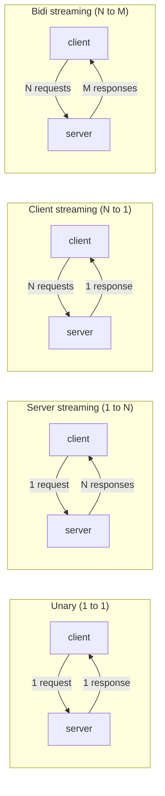
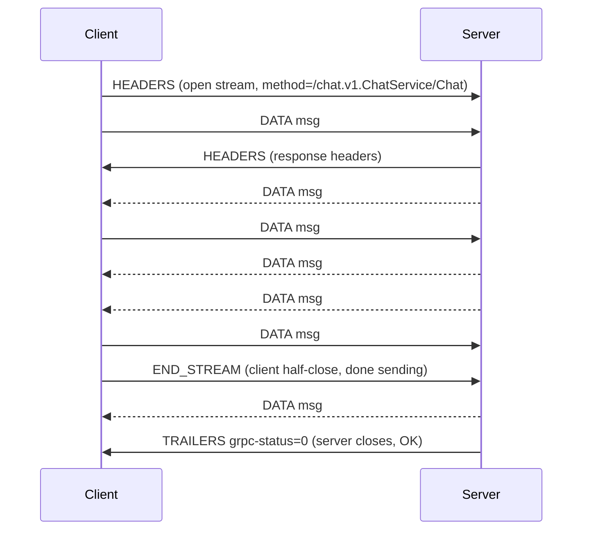
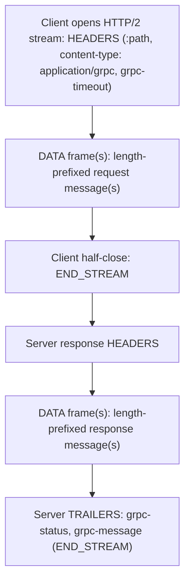

# The Four RPC Types & Streaming

gRPC defines exactly **four kinds of RPC** — unary, server-streaming, client-streaming,
and bidirectional-streaming — and the kind is fixed by how you declare the method in the
`.proto` file using the `stream` keyword on the request and/or response. This topic is the
conceptual core of gRPC: what each shape means, how each maps onto a single HTTP/2 stream,
how messages are framed on the wire, and the streaming semantics (ordering, flow control,
half-close, cancellation) that trip people up in production.

> [!KEY-TAKEAWAY]
> There is **one dimension repeated twice**: is the request a single message or a stream,
> and is the response a single message or a stream? The 2×2 gives you the four types. In
> all four, the entire RPC — every message in either direction plus the final status — lives
> on **one HTTP/2 stream**, and each message is a self-describing **length-prefixed frame**.

For the HTTP/2 protocol itself (frames, HPACK, multiplexing, flow-control windows on the
wire, TLS handshake) see the `networking` domain — this topic teaches HTTP/2 *only as far as
gRPC semantics require it*. For the general theory of retries/backpressure/circuit-breaking
see `reliability-ops`; for gRPC-specific error codes see the `error-handling-and-status-codes`
topic; for how streaming affects load balancing see `load-balancing-and-service-discovery`.

## The Four RPC Types at a Glance

The RPC type is a **compile-time property of the method**, declared by placing `stream`
before the request type, the response type, both, or neither:

```proto
syntax = "proto3";
package chat.v1;

service ChatService {
  // UNARY: 1 request  -> 1 response
  rpc GetMessage(GetMessageRequest) returns (Message);

  // SERVER STREAMING: 1 request -> stream of responses
  rpc Subscribe(SubscribeRequest) returns (stream Message);

  // CLIENT STREAMING: stream of requests -> 1 response
  rpc UploadLog(stream LogChunk) returns (UploadSummary);

  // BIDIRECTIONAL STREAMING: stream <-> stream (full duplex)
  rpc Chat(stream ChatEvent) returns (stream ChatEvent);
}
```



| RPC type | Request | Response | Half-close by | Typical use |
|---|---|---|---|---|
| Unary | 1 message | 1 message | client (implicitly, after the one msg) | CRUD, lookups, command RPCs |
| Server streaming | 1 message | stream | client (implicitly, after the one msg) | subscriptions, feeds, large/paged results |
| Client streaming | stream | 1 message | client (explicitly, when done sending) | uploads, ingest, aggregation |
| Bidirectional | stream | stream | client (explicitly); server ends with status | chat, realtime sync, negotiation |

> [!INTERVIEW]
> A very common opener: *"How many RPC types does gRPC have and what determines the type?"*
> Answer: four, decided at schema-compile time by the presence of `stream` on the request
> and/or response type. There is no runtime "switch" — the generated stub method signatures
> differ per type.

## Unary RPC

Unary is the default and simplest shape: the client sends **exactly one** request message,
the server replies with **exactly one** response message plus a status. It behaves like an
ordinary (asynchronous) function call and is what most RPCs should be.

Idiomatic Go client and server:

```go
// server
func (s *server) GetMessage(ctx context.Context, req *pb.GetMessageRequest) (*pb.Message, error) {
    m, err := s.store.Load(ctx, req.GetId())
    if err != nil {
        return nil, status.Errorf(codes.NotFound, "message %s not found", req.GetId())
    }
    return m, nil
}

// client
resp, err := client.GetMessage(ctx, &pb.GetMessageRequest{Id: "42"})
```

On the wire, a unary call is still a full HTTP/2 stream: request HEADERS, one DATA frame
carrying one length-prefixed message (the client then half-closes with END_STREAM),
response HEADERS, one DATA frame with the response message, then **trailers** carrying the
final `grpc-status`. Because it is a single request/response, unary calls are the easiest
to retry, cache, load-balance per-call, and reason about.

> [!TIP]
> Prefer unary unless you have a concrete streaming need. Unary RPCs are stateless per call,
> so a proxy or client-side load balancer can spread them across backends freely; a single
> long-lived stream, by contrast, is pinned to one backend for its whole lifetime.

## Server Streaming RPC

The client sends **one** request; the server responds with a **sequence** of messages,
then a final status. The client cannot send more request messages after the first — it
half-closes immediately. Server streaming is ideal when the server has more data than fits
comfortably in one message, or produces results incrementally over time.

```proto
rpc Subscribe(SubscribeRequest) returns (stream Message);
```

```go
// server: push messages as they arrive; return nil to end with OK
func (s *server) Subscribe(req *pb.SubscribeRequest, stream pb.ChatService_SubscribeServer) error {
    for msg := range s.feed(req.GetTopic()) {
        if err := stream.Send(msg); err != nil { // Send blocks under backpressure
            return err // client gone / flow-control error
        }
    }
    return nil // ends the stream with grpc-status OK
}
```

```go
// client: loop until io.EOF, which signals a clean end-of-stream
stream, _ := client.Subscribe(ctx, &pb.SubscribeRequest{Topic: "orders"})
for {
    msg, err := stream.Recv()
    if err == io.EOF { break }          // server sent OK, stream done
    if err != nil { /* real RPC error */ break }
    handle(msg)
}
```

Use cases: server-side "subscribe"/notification feeds, streaming a large result set that
you don't want to materialize in memory, progress updates for a long job. The trade-off:
one stream is tied to a single server instance for its whole life, and a slow client
applies backpressure onto the server (see flow control below).

## Client Streaming RPC

The client sends a **sequence** of request messages, then **half-closes** to signal it is
done; the server replies with **one** response message plus status. Classic for uploads and
aggregation where the total size is unknown up front or you want to stream chunks rather
than buffer the whole payload.

```proto
rpc UploadLog(stream LogChunk) returns (UploadSummary);
```

```go
// client
stream, _ := client.UploadLog(ctx)
for _, chunk := range chunks {
    if err := stream.Send(chunk); err != nil { break }
}
summary, err := stream.CloseAndRecv() // half-close, then wait for the single response
```

```go
// server: Recv() until io.EOF (client half-closed), then send one response
func (s *server) UploadLog(stream pb.ChatService_UploadLogServer) error {
    var total int64
    for {
        chunk, err := stream.Recv()
        if err == io.EOF {              // client half-closed: done receiving
            return stream.SendAndClose(&pb.UploadSummary{Bytes: total})
        }
        if err != nil { return err }
        total += int64(len(chunk.Data))
    }
}
```

The key mechanic is **explicit half-close** (`CloseAndRecv`/`CloseSend` on the client side).
The server sees the client's half-close as `io.EOF` on `Recv()`; that is its cue to compute
and send the single reply. Note the server *may* send its response and status before the
client has finished sending (e.g. it validated the first chunk and rejects) — a well-written
client checks the return of every `Send`.

## Bidirectional Streaming RPC

Both sides send a **stream** of messages over the **same** HTTP/2 stream, and the two
directions are **fully independent** (full-duplex). The client can be sending its 5th
message while it has received the server's 100th; there is no request/response lock-step
unless your application protocol imposes one. Best for chat, collaborative editing, realtime
telemetry with control messages, and long-lived negotiations.

```proto
rpc Chat(stream ChatEvent) returns (stream ChatEvent);
```



Because reads and writes are independent, each side typically runs a **send loop and a
receive loop concurrently** (two goroutines in Go, a StreamObserver in Java, an async
iterator in Python). Deadlocks are a classic bug: if both peers block on `Recv` waiting for
the other to `Send`, or if one side never half-closes, the stream hangs until the deadline.

> [!WARNING]
> Bidi is **not** magic request/response pairing. gRPC does not correlate the Nth response
> to the Nth request for you. If your protocol needs correlation, put a request id in the
> message and match them in application code.

## Mapping an RPC onto One HTTP/2 Stream

Every gRPC call — regardless of type — is **exactly one HTTP/2 stream** (an identified,
independently flow-controlled sequence of frames within a connection). The lifecycle:

1. **Request HEADERS frame** — carries the pseudo-headers and gRPC call headers, notably
   `:method: POST`, `:path: /<package>.<Service>/<Method>`, `:scheme`, `content-type:
   application/grpc`, and any `grpc-timeout` (the deadline) plus custom metadata. gRPC
   always uses `POST`.
2. **DATA frames** — carry one or more length-prefixed messages. A single message may span
   multiple DATA frames and multiple messages may share a DATA frame; message boundaries
   come from the length prefix, not from frame boundaries.
3. **Half-close** — the sender sets the END_STREAM flag on its last DATA (or HEADERS) frame
   to say "I will send no more messages this direction."
4. **Trailers (a second HEADERS frame with END_STREAM)** — the server ends the call by
   sending **trailing metadata** containing `grpc-status` (an integer status code) and
   optionally `grpc-message`. This is *why gRPC requires HTTP/2*: HTTP/1.1 has no reliable
   trailers, so there would be nowhere to put a status that follows a streamed body.



> [!KEY-TAKEAWAY]
> gRPC needs HTTP/2 for three concrete reasons: **binary framing** (efficient length-prefixed
> messages), **multiplexed streams** (many concurrent RPCs, and streaming, over one TCP
> connection without head-of-line blocking at the HTTP layer), and **trailers** (a place to
> put the final `grpc-status` after a possibly-streamed body).

Because many streams multiplex over one connection, a streaming RPC does **not** monopolize
the socket — other unary and streaming calls run concurrently on the same connection. This
is what makes long-lived server-streaming subscriptions cheap at the connection level. (Full
HTTP/2 stream/connection details live in `networking`.)

## Length-Prefixed Message Framing

Inside the DATA frames, gRPC does **not** send raw protobuf bytes. Each message is wrapped
in a 5-byte prefix — this is the gRPC "length-prefixed message" defined by the
gRPC-over-HTTP2 wire spec:

```
+---------+----------------+----------------------+
| 1 byte  |     4 bytes    |    <length> bytes    |
| Compr'd | Message-Length |   Message  (proto)   |
| flag    |  (big-endian   |    payload           |
| (0/1)   |   uint32)      |                      |
+---------+----------------+----------------------+
```

- **Byte 0 — compressed flag:** `0` = payload is uncompressed; `1` = payload is compressed
  using the algorithm named in the `grpc-encoding` header (e.g. `gzip`). It is a single byte,
  not a bitfield of algorithms.
- **Bytes 1–4 — message length:** unsigned 32-bit **big-endian** length of the payload that
  follows. This is why a single message can be up to ~4 GiB in theory, but servers enforce a
  **max receive message size** (commonly 4 MiB default) to bound memory.
- **Bytes 5…** — the serialized message (protobuf by default; the framing is codec-agnostic).

This length prefix is what lets the receiver carve discrete messages out of the HTTP/2 byte
stream (frame boundaries are irrelevant), and it is uniform across all four RPC types — a
unary response and one element of a server stream are framed identically.

> [!WARNING]
> The `grpc-message` header (human-readable error string) and the length-prefix compression
> flag are different things. Also: hitting the max-message-size limit fails the RPC with
> `RESOURCE_EXHAUSTED`, which surprises people streaming large blobs in a single message —
> chunk them or raise the limit deliberately.

## Ordering Guarantees Within a Stream

gRPC guarantees that **messages within a single stream are delivered in the order they were
sent**, in each direction. HTTP/2 delivers frames of a given stream in order (TCP guarantees
byte order; the stream's frames are sequenced), so `Send` order == `Recv` order per
direction.

What is **not** guaranteed:

- **Cross-direction ordering in bidi.** The client's sends and the server's sends are two
  independent ordered sequences; there is no global interleaving order and no request↔response
  pairing (see bidi section).
- **Ordering across different RPCs / streams.** Two separate calls on the same channel may
  complete in any order; multiplexing is concurrent by design.
- **Exactly-once semantics.** Ordering is not delivery-count. A retried RPC (gRFC A6) can
  re-send messages; design idempotency at the application layer (cross-ref `reliability-ops`).

> [!INTERVIEW]
> *"If I `Send(A)` then `Send(B)` on a client stream, can the server see B before A?"* No —
> within one direction of one stream, order is preserved. But on a **bidi** stream, the
> server's responses are not interleaved into any defined order relative to the client's
> requests; only each side's own sequence is ordered.

## Flow Control and Backpressure

gRPC streaming backpressure is **inherited directly from HTTP/2 flow control**. Every HTTP/2
stream (and the connection) has a receive **window**; the receiver advertises how many bytes
it is willing to accept via WINDOW_UPDATE frames. If a receiver is slow to consume, its
window fills and the sender's `Send`/`stream.Write` **blocks** (or, in async APIs, the
`isReady`/`onReady` callback stops firing) until the window opens again.

The practical consequences:

- **A slow reader slows the writer.** If a client streaming responses can't keep up, the
  server's `Send` blocks — this is desired backpressure, not an error. It protects memory by
  refusing to let an unbounded queue build up.
- **Never ignore `Send`'s signal.** In Go, `stream.Send` returns when the message is accepted
  into the flow-controlled buffer. In Java/C-core async, you must respect `isReady()` /
  `onReadyHandler`; blindly calling `onNext` in a tight loop buffers unboundedly in memory and
  defeats flow control.
- **Deadlocks from mutual blocking.** In bidi, if both sides fill each other's windows while
  each waits to read, you deadlock. Run send and receive concurrently.

> [!TIP]
> "gRPC streaming backpressure = HTTP/2 flow-control windows. A slow consumer causes the
> producer's writes to block, so memory stays bounded — you get end-to-end backpressure for
> free, provided you don't buffer ahead of the flow-control signal." The full HTTP/2
> window/WINDOW_UPDATE mechanics live in `networking`.

## Half-Close and End-of-Stream Semantics

**Half-close** = one party signals "I'm done *sending*" while remaining able to *receive*.
On the wire it is the HTTP/2 **END_STREAM** flag on that party's last frame. gRPC uses it to
delimit the request stream:

- **Unary / server-streaming:** the client half-closes automatically right after its single
  request message — there is nothing more it will send.
- **Client-streaming / bidi:** the client calls `CloseSend()` (Go), completes the request
  `StreamObserver`'s `onCompleted()` (Java), or stops the async request iterator (Python) to
  half-close. The server observes this as `io.EOF` on `Recv()`.
- **The server never half-closes separately:** it ends the whole RPC by sending **trailers**
  with `grpc-status`, which closes its direction (END_STREAM) *and* completes the call.

A common bug in client-streaming and bidi is **forgetting to half-close**: the server's
`Recv` loop never sees EOF, so it waits forever (until the deadline fires) instead of
producing its response.

> [!WARNING]
> Half-close is not cancellation. Half-closing means "no more messages from me" — the RPC is
> still alive and you still expect a response/status. Cancellation (next section) tears the
> whole RPC down.

## Streaming vs Repeated Fields in a Unary Call

A frequent design question: to return many items, do you use **server streaming** or a
**unary RPC returning a `repeated` field**? Both send many items; they differ in memory
model, latency profile, and lifecycle.

```proto
// Option A — unary + repeated (bounded batch)
rpc ListMessages(ListRequest) returns (ListResponse);
message ListResponse { repeated Message messages = 1; }

// Option B — server streaming (unbounded / incremental)
rpc StreamMessages(ListRequest) returns (stream Message);
```

| Concern | Unary + `repeated` | Server streaming |
|---|---|---|
| Result size | Bounded, fits in memory + max-message-size | Unbounded / very large |
| Delivery | All-or-nothing, one atomic response | Incremental, first byte sooner |
| Memory | Whole set materialized both sides | Process one at a time (bounded) |
| Backpressure | None (single message) | HTTP/2 flow control per message |
| Complexity | Simple (looks like a function call) | Stream lifecycle, EOF, cancellation |
| Retries | Trivial (idempotent unary) | Harder (partial progress on failure) |
| Long-lived / push | No — request completes | Yes — subscriptions, live feeds |

Rule of thumb: **use unary + `repeated` for bounded batches** (a page of results, a config
blob) — it's simpler and easier to retry/cache. **Use streaming for unbounded, incremental,
or long-lived** data (live feeds, tailing logs, large exports you don't want to buffer, or
anything where you want the first item before the last is ready). Pagination (unary +
`page_token`) is often the right middle ground for large-but-finite result sets and is easier
to load-balance than a long stream.

> [!INTERVIEW]
> A senior-level nuance: streaming pins the whole call to **one backend** and one connection
> for its lifetime, so it interacts badly with per-request load balancing and makes rolling
> deploys drain slowly. If the result is bounded, a paginated unary API usually scales and
> operates more smoothly than a long server stream.

## Cancellation Propagation on a Stream

A gRPC call can be **cancelled** by either side at any time. On the wire, cancellation is an
HTTP/2 **RST_STREAM** frame (typically with error code `CANCEL`); it tears down that one
stream without touching other streams on the connection. The framework surfaces it as the
`CANCELLED` status.

- **Client-initiated:** cancel the context/`CancelFunc` (Go), call `cancel()` on the
  `ClientCall`/future (Java), or `call.cancel()` (Python). This is the correct way to stop a
  server stream you no longer want ("client needs to cancel a long stream — how?": cancel the
  context, which sends RST_STREAM).
- **Deadline expiry** is effectively an automatic cancellation: when the `grpc-timeout`
  elapses, the client cancels the call locally and the RPC ends with `DEADLINE_EXCEEDED`
  (see the `deadlines-timeouts-cancellation` topic).
- **Server-side observation:** the server's `ctx.Done()` / `Context.isCancelled()` fires, so
  a well-written handler stops work, releases resources, and returns promptly — you should
  **check for cancellation in your stream loop**, not push into a dead stream.
- **Propagation down the chain:** if service A calls service B while handling a client's call,
  cancelling A→client should cancel A→B. In Go this is automatic if you pass the incoming
  `ctx` to the outbound call; forgetting to propagate the context leaks work on downstream
  services. (Deadline propagation is covered in `retries-resiliency-and-deadline-propagation`.)

```go
// client cancels a long server stream when it has seen enough
ctx, cancel := context.WithCancel(context.Background())
stream, _ := client.Subscribe(ctx, req)
for {
    msg, err := stream.Recv()
    if err != nil { break }
    if seenEnough(msg) {
        cancel()   // sends RST_STREAM(CANCEL); server ctx.Done() fires
        break
    }
}
```

> [!WARNING]
> Cancellation is best-effort and racy: the server may have already produced a response the
> client will now discard, and in-flight side effects don't roll back. Cancellation controls
> *the stream*, not distributed transactions. Design server handlers to be cancellation-aware
> and idempotent.

## Common Interview Follow-ups

- **"What decides the RPC type?"** The `stream` keyword on the request and/or response type in
  the `.proto` service definition — a compile-time property, four combinations.
- **"How does a gRPC message look on the wire inside HTTP/2 DATA?"** 1 compression-flag byte +
  4-byte big-endian length + payload, repeated per message.
- **"Why does gRPC require HTTP/2 and not HTTP/1.1?"** Binary framing, stream multiplexing for
  concurrent/streaming calls, and trailers to carry the final `grpc-status` after the body.
- **"Where does gRPC put the status code?"** In HTTP/2 **trailers** (`grpc-status`,
  `grpc-message`) — a trailing HEADERS frame, not the response headers.
- **"How do you signal 'done sending' on a client stream?"** Half-close (`CloseSend` /
  `onCompleted`), which is HTTP/2 END_STREAM; the server sees `io.EOF`.
- **"Client wants to abort a long server stream — how?"** Cancel the context/call → RST_STREAM
  → server `ctx.Done()` fires; RPC ends `CANCELLED`.
- **"Streaming vs a `repeated` field?"** Unary+`repeated` for bounded batches (simpler,
  retryable); streaming for unbounded/incremental/long-lived, at the cost of pinning to one
  backend and harder retries.
- **"Are bidi responses paired with requests?"** No — two independent ordered streams; correlate
  in application code if needed.
- **"What provides backpressure in streaming?"** HTTP/2 flow-control windows: a slow reader
  blocks the writer, bounding memory.
- **"Does gRPC guarantee ordering?"** Yes, per-direction within one stream; not across streams
  or across the two directions of a bidi call, and not exactly-once.

## References

- gRPC Concepts — *Core concepts, architecture and lifecycle* (the four RPC lifecycles):
  https://grpc.io/docs/what-is-grpc/core-concepts/
- gRPC over HTTP/2 wire protocol (framing, headers, `grpc-status`, `grpc-timeout`, trailers):
  https://github.com/grpc/grpc/blob/master/doc/PROTOCOL-HTTP2.md
- gRPC compression spec (the compressed-flag byte and `grpc-encoding`):
  https://github.com/grpc/grpc/blob/master/doc/compression.md
- Protocol Buffers proto3 language guide (`stream`, `repeated`, service definitions):
  https://protobuf.dev/programming-guides/proto3/
- RFC 9113 — HTTP/2 (streams, DATA/HEADERS frames, END_STREAM, RST_STREAM, flow control):
  https://www.rfc-editor.org/rfc/rfc9113
- gRFC A6 — client retries (interaction of retries with streaming):
  https://github.com/grpc/proposal/blob/master/A6-client-retries.md
- gRPC status codes reference:
  https://grpc.io/docs/guides/status-codes/
- Cross-references in this library: `networking` (HTTP/2 on the wire, TLS),
  `error-handling-and-status-codes`, `deadlines-timeouts-cancellation`,
  `retries-resiliency-and-deadline-propagation`, `load-balancing-and-service-discovery`,
  `grpc-vs-rest-vs-graphql-ecosystem`.
