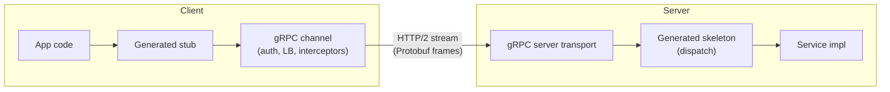
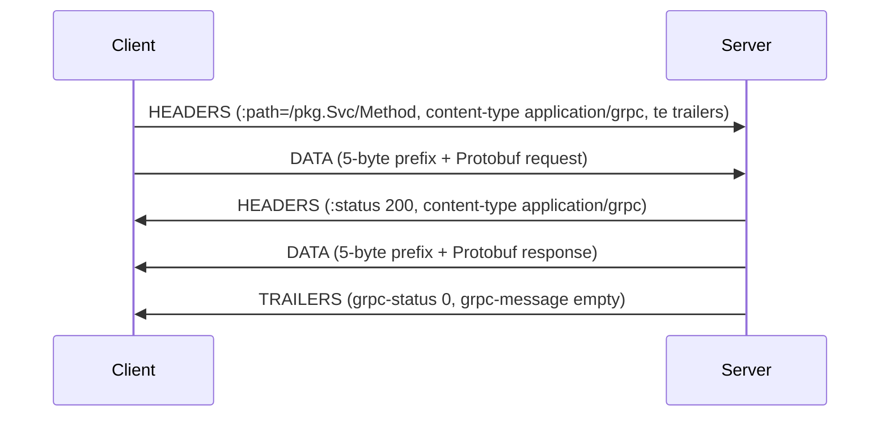
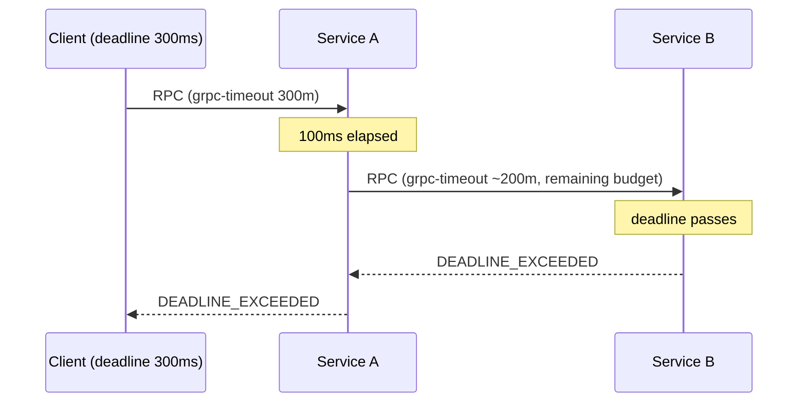
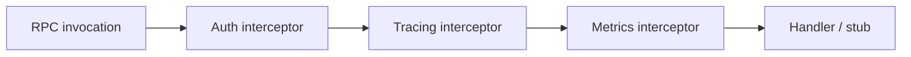
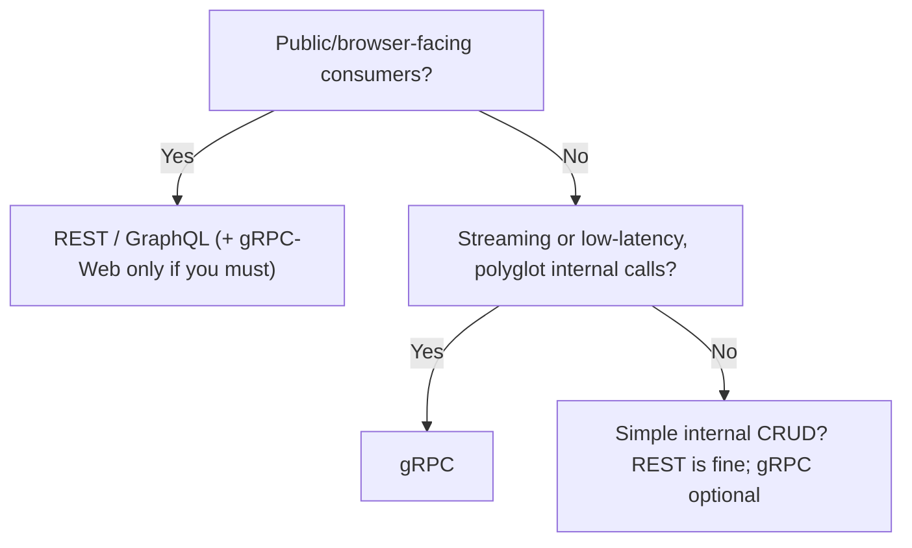

# gRPC Fundamentals & When to Use It

gRPC is a **high-performance, contract-first Remote Procedure Call (RPC)
framework** originally built at Google and now a **CNCF** project. The name is a
recursive-ish backronym — **gRPC Remote Procedure Calls** — and the "g" has stood
for a different word in almost every release (a running joke in the project). The
elevator pitch: you **define a service and its methods in a `.proto` file**, run a
code generator, and get a strongly-typed **client stub** and **server skeleton** in
your language of choice. Calling a remote method then looks almost exactly like
calling a local function — the framework handles serialization, framing,
connection management, flow control, deadlines, and error propagation.

This topic teaches gRPC at the **mechanism and protocol level**: what actually
goes on the wire, why the design decisions were made, and where the sharp edges
are. It is language-agnostic, with small `.proto`, Go, Java, and Python snippets
where they clarify.

Boundaries with sibling domains (cross-referenced, **not** re-taught here):

- **networking** owns HTTP/2 on the wire (framing, HPACK, streams, flow control,
  multiplexing) and the TLS handshake. Here we teach the HTTP/2 foundations *only
  as they matter for gRPC*.
- **rest-api-design** owns REST/HTTP contracts and GraphQL as an API style. The
  deep three-way comparison lives in `grpc-vs-rest-vs-graphql-ecosystem` (and
  `rest-api-design/rest-vs-graphql-vs-grpc`).
- **reliability-ops** owns resilience theory (retries/backoff/circuit-breakers as
  concepts). Here we teach gRPC-*specific* mechanics.
- **system-design** owns service-mesh/xDS architecture at scale.
- **observability** owns OTel/metrics/tracing tooling generally.

> [!KEY-TAKEAWAY]
> gRPC = **Protocol Buffers (contract + binary serialization) + HTTP/2
> (transport) + code generation (stubs/skeletons) + pluggable auth/LB/interceptors**.
> Its sweet spot is **internal, low-latency, polyglot, streaming service-to-service**
> traffic — not public browser-facing CRUD APIs.

---

## What gRPC is

**Definition.** gRPC is an open-source RPC framework: a *client* invokes a method
on a *server* on a different machine as if it were a local object, and the
framework transparently marshals the arguments, ships them over the network,
executes the method on the server, and returns the result.

**The RPC lineage.** RPC is an old idea (Sun RPC/ONC RPC, CORBA, Java RMI, Thrift,
Finagle's `stubby` at Google — gRPC's internal predecessor). gRPC modernizes it
by standardizing on two open, widely-supported technologies: **Protocol Buffers**
for the interface definition + serialization, and **HTTP/2** for transport. That
combination is what makes it polyglot and production-grade rather than a
proprietary binary protocol.

**Contract-first.** The `.proto` file is the *single source of truth*. Both sides
generate code from the same contract, so the client and server agree on method
names, argument types, and return types **at compile time**. There is no
hand-written serialization and no "hope the JSON shapes match" — a whole class of
integration bugs disappears.

```proto
syntax = "proto3";
package routeguide;
option go_package = "example.com/routeguide";

service RouteGuide {
  // A simple unary RPC: one request, one response.
  rpc GetFeature(Point) returns (Feature);
}

message Point {
  int32 latitude  = 1;
  int32 longitude = 2;
}

message Feature {
  string name = 1;
  Point  location = 2;
}
```

From this, `protoc` (+ the gRPC plugin) generates a `RouteGuideClient` stub with a
`GetFeature(point)` method and a `RouteGuideServer` interface you implement.

> [!INTERVIEW]
> "What *is* gRPC in one sentence?" — A contract-first, high-performance RPC
> framework that uses Protocol Buffers as its IDL and binary format and HTTP/2 as
> its transport, generating typed client stubs and server skeletons in many
> languages.

---

## The four pillars

gRPC stands on four load-bearing pillars. Being able to name and explain each is
the most common opening question.

| Pillar | What it provides | Why it matters |
|---|---|---|
| **Protocol Buffers (IDL + serialization)** | A language-neutral schema language and a compact **binary** wire format | Small payloads, fast (de)serialization, a typed contract, schema evolution |
| **HTTP/2 transport** | Multiplexed, binary-framed, bidirectional streams over one TCP connection, with trailers and flow control | Enables streaming, low latency, and many concurrent RPCs without head-of-line blocking at the HTTP layer |
| **Code generation** | Generated client *stubs* and server *skeletons* in 10+ languages | Polyglot interop; no hand-rolled marshalling; compile-time type safety |
| **Pluggable stack** | Interceptors, credentials/auth, name resolution, load-balancing policies, compression, stats/tracing plugins | Cross-cutting concerns (auth, retries, metrics, LB) are configured, not re-implemented per service |

**Stub vs skeleton.** The **stub** is the client-side proxy object whose methods
serialize the request, open an HTTP/2 stream, and deserialize the response. The
**skeleton** (server-side generated base class/interface) dispatches an incoming
stream to your implementation method. You write only the business logic.



---

## Protocol Buffers as the IDL and wire format

Protocol Buffers (protobuf) play **two** roles in gRPC: they are the **Interface
Definition Language** (the `.proto` service/message declarations) *and* the
default **binary serialization format** on the wire.

**How the binary encoding works (mechanism).** Each message field is serialized as
a **key–value pair**. The key is a *varint* that packs the **field number** and a
3-bit **wire type**: `key = (field_number << 3) | wire_type`. Wire types:

| Wire type | Value | Used for |
|---|---|---|
| VARINT | 0 | `int32/64`, `uint32/64`, `sint*`, `bool`, `enum` |
| I64 | 1 | `fixed64`, `sfixed64`, `double` |
| LEN | 2 | `string`, `bytes`, embedded messages, packed repeated |
| I32 | 5 | `fixed32`, `sfixed32`, `float` |

Because field **numbers** — not names — go on the wire, protobuf is compact and
renaming a field in the `.proto` does **not** break the wire format. This is the
foundation of schema evolution (see below).

**Field-number cost.** Tags for field numbers **1–15** fit in a single byte;
**16–2047** take two bytes. So the *most frequently set* fields should get the low
numbers. Numbers **19000–19999** are reserved for the protobuf implementation.

**Why binary beats JSON here.** Integers are varint-packed, there are no field
names or quotes/braces, and there is no text parsing — deserialization is largely
a memcpy-and-shift. Payloads are typically several times smaller than the
equivalent JSON, and encode/decode is much cheaper. The cost is that the bytes are
**not human-readable** (see Strengths/weaknesses).

> [!WARNING]
> Protobuf is *not* self-describing. Without the `.proto` (or a `FileDescriptorSet`),
> raw bytes are un-interpretable — you cannot tell a field's name or type from the
> wire. This is exactly what makes tooling/debugging harder than REST+JSON, and why
> gRPC ships **server reflection** for tools like `grpcurl`.

---

## proto3 field presence and schema precision

proto3 is the current syntax (the `syntax = "proto3";` line). Its field-presence
rules are a favorite "gotcha" interview area.

**Default values are NOT sent on the wire.** In proto3, a scalar field set to its
type default — `0` for numbers, `false` for bool, `""` for string, empty for
`bytes`, the zero-value enum — is **omitted** from the serialized bytes entirely.
The receiver, on decode, simply sees the field absent and fills in the default.

**The consequence: you can't tell "unset" from "set-to-default".** For a plain
`int32 age = 1;`, a wire with no field-1 could mean "age is 0" or "age was never
set." This breaks partial-update (PATCH-style) semantics.

**proto3 solutions for explicit presence:**

- **`optional` keyword** (re-introduced to proto3): `optional int32 age = 1;`
  generates a `has_age()` accessor. Under the hood the field is put in a synthetic
  one-field `oneof`, so presence is tracked and *is* transmitted.
- **Wrapper types** (`google.protobuf.Int32Value`, `StringValue`, …): a wrapped
  scalar is a *message*, and messages always have explicit presence (present vs
  absent), at the cost of an allocation.
- **`FieldMask`** to explicitly enumerate which fields an update touches.

Other precision points:

- **`message` fields always have presence** — you can always distinguish a set
  sub-message from an unset one (`nil`/`null`).
- **`repeated` and `map` fields** have no "presence" — empty and absent are the
  same; scalar `repeated` fields are **packed** (a single LEN blob) by default in
  proto3.
- **Unknown fields** encountered during parsing are, by default, **preserved** (in
  proto3 since a later revision), so a proxy that round-trips a message won't drop
  fields it doesn't understand.

| | proto2 | proto3 |
|---|---|---|
| Explicit presence for scalars | Default (`optional`/`required`) | Only via `optional` keyword or wrapper types |
| `required` fields | Allowed (discouraged) | **Removed** — all fields effectively optional |
| Default value customization | `[default = ...]` | Not allowed (defaults are type zero-values) |
| Enums | Closed | Open (unknown enum values preserved as ints) |

> [!INTERVIEW]
> "Is a scalar field set to its default value transmitted on the wire in proto3?"
> **No.** Default-valued scalars are omitted. If you need to distinguish "unset"
> from "zero", use `optional`, a wrapper type, or a `FieldMask`.

---

## Why gRPC needs HTTP/2

gRPC *requires* HTTP/2 end-to-end. The full HTTP/2 spec (RFC 9113 — framing,
HPACK, flow control) is owned by **networking**; here is only *why gRPC depends on
each feature*:

- **Multiplexed streams over one connection.** Each RPC is one HTTP/2 **stream**.
  Many RPCs run concurrently on a single TCP connection without HTTP-level
  head-of-line blocking, so a long-running streaming RPC does not starve short
  unary calls. HTTP/1.1 could not do this (one request per connection at a time).
- **Bidirectional, full-duplex streams.** HTTP/2 streams carry independent DATA
  frames in both directions, which is exactly what gRPC's client-, server-, and
  bidirectional-streaming call types need.
- **Trailers (trailing headers).** gRPC delivers the final **status** in HTTP/2
  **trailers** (a HEADERS frame after the DATA), so the server can start streaming
  a response *before* it knows the final outcome, then report success/failure at
  the end. REST over HTTP/1.1 has no clean trailer mechanism.
- **Binary framing + HPACK header compression.** Cheap to parse; repeated headers
  (e.g., `:path`, auth metadata) are compressed across requests on a connection.
- **Flow control.** HTTP/2's per-stream and per-connection WINDOW_UPDATE flow
  control gives gRPC streaming its **backpressure** for free.

> [!WARNING]
> "HTTP/2 end-to-end" is a real operational constraint. Any intermediary (old load
> balancer, proxy, or a browser's `fetch`) that can't speak HTTP/2 with trailers
> breaks gRPC. This is precisely why **browsers need gRPC-Web + a proxy** and why
> some L7 LBs must be configured for HTTP/2 / "gRPC" backends.

---

## The gRPC-over-HTTP/2 wire format

Understanding what a single gRPC call looks like on the wire separates people who
"use gRPC" from people who *understand* it.

**Request.** The client opens an HTTP/2 stream with a HEADERS frame:

- `:method = POST` (always POST), `:scheme`, `:authority`
- `:path = /<package>.<Service>/<Method>` — e.g. `/routeguide.RouteGuide/GetFeature`
- `content-type = application/grpc` (or `application/grpc+proto`)
- `te: trailers` — signals the client understands HTTP/2 trailers
- optional `grpc-timeout`, `grpc-encoding` (compression), and custom **metadata**

**Message framing (Length-Prefixed-Message).** Each protobuf message in a DATA
frame is prefixed by a **5-byte header**: **1 byte compressed-flag** (0 or 1) +
**4-byte big-endian length**, followed by the message bytes. One HTTP/2 DATA frame
may carry several messages, or one message may span frames.

```
+--------+----------------+========================+
| 1 byte |    4 bytes     |   <length> bytes       |
| compr? |  msg length BE |   (Protobuf message)   |
+--------+----------------+========================+
```

**Response.** The server sends **response headers** (`:status: 200` — note the
HTTP status is 200 even for gRPC errors), then DATA frames with length-prefixed
messages, then **trailers**:

- `grpc-status` — a **decimal status code 0–16** (0 = OK)
- `grpc-message` — optional, **percent-encoded** human-readable error message
- optional `grpc-status-details-bin` — a serialized `google.rpc.Status` for rich
  error details

**Trailers-Only response.** If the server fails *before* sending any message (or
has nothing to send), it may collapse everything into a **single HEADERS frame**
with `END_STREAM` set that carries both `:status: 200` and `grpc-status` — this is
the "Trailers-Only" case.



> [!INTERVIEW]
> "Where does gRPC put the call's success/failure status?" — In **HTTP/2 trailers**
> (`grpc-status` / `grpc-message`), sent *after* the response body. The HTTP
> `:status` is almost always `200` even when the RPC failed; the real outcome is
> the trailing `grpc-status`.

---

## The RPC mental model vs REST resources

**gRPC is verb/method-oriented; REST is noun/resource-oriented.** In gRPC you call
**named methods** (`CreateOrder`, `ListShipments`, `StreamPrices`) that take a
typed request message and return a typed response message. In REST you manipulate
**resources** (`/orders`, `/orders/42`) with a fixed, uniform set of HTTP verbs
(`GET/POST/PUT/PATCH/DELETE`).

| Aspect | gRPC (RPC model) | REST (resource model) |
|---|---|---|
| Unit of interaction | A **method** call | An **action on a resource** (URI + verb) |
| Contract | `.proto` service, compile-time typed | OpenAPI/hand docs, usually runtime JSON |
| Vocabulary | Arbitrary domain verbs | Uniform HTTP verbs + status codes |
| Payload | Protobuf binary | Usually JSON (text) |
| Discoverability | Reflection/`.proto`; not URL-browsable | URLs + HATEOAS, browser-friendly |

The mental shift: with gRPC you think "*which function do I want to call?*"; with
REST you think "*which resource, and what am I doing to it?*". Neither is
universally "better" — see When to Use. The full comparison is in
`grpc-vs-rest-vs-graphql-ecosystem` / `rest-api-design/rest-vs-graphql-vs-grpc`.

---

## The four RPC types

gRPC method signatures declare one of **four** call shapes by adding the `stream`
keyword to the request and/or response side in the `.proto`:

```proto
service PriceService {
  rpc GetPrice(Symbol) returns (Price);                       // unary
  rpc WatchPrice(Symbol) returns (stream Price);              // server streaming
  rpc UploadTicks(stream Tick) returns (UploadSummary);       // client streaming
  rpc Trade(stream Order) returns (stream Fill);              // bidirectional
}
```

| Type | `.proto` shape | Semantics | Example |
|---|---|---|---|
| **Unary** | `(Req) returns (Res)` | One request, one response — like a normal function call | `GetUser` |
| **Server streaming** | `(Req) returns (stream Res)` | One request, a **stream** of responses; ends when server closes | Live price feed, download, tailing logs |
| **Client streaming** | `(stream Req) returns (Res)` | A **stream** of requests, one response after client half-closes | Upload chunks, ingest metrics, aggregate |
| **Bidirectional** | `(stream Req) returns (stream Res)` | Independent read/write streams on one call, fully **full-duplex** | Chat, trading, interactive protocols |

**Key streaming facts (mechanism):**

- All four ride on **one HTTP/2 stream**. Streaming is just "more than one
  length-prefixed message in a direction before END_STREAM."
- Message **order within a single stream is preserved** (it's one ordered HTTP/2
  stream). There is no ordering guarantee *across* separate RPCs.
- In **bidirectional** streaming the two directions are **independent** — the
  server can respond before the client finishes sending, or interleave. The
  request/response cadence is **application-defined**, not lock-step.
- Client streaming ends when the client **half-closes** its side (END_STREAM on
  its DATA); the server then sends its single response + trailers.


---

## Streaming semantics, backpressure and flow control

Streaming is powerful and the source of the subtlest gRPC bugs.

**Backpressure comes from HTTP/2 flow control.** Each stream has a receive
**window**; a receiver only issues `WINDOW_UPDATE` frames as the application reads
messages. If a consumer is slow, the window fills, the sender's writes **block**
(or the async API stops signalling "ready"), and the producer is naturally
throttled. This is real backpressure — *if you respect the API*.

**The classic gotcha: you must actually read to get backpressure.** If your code
drains messages into an unbounded in-memory queue as fast as they arrive, you have
defeated flow control and can OOM. Let the stream block; don't buffer without
bound.

**Streams are not free reliability.** A broken stream does not auto-resume. If the
connection drops mid-stream, the RPC fails and the application must decide how to
resume (e.g., a resume token / offset). gRPC **retries do not apply to messages
already sent on a streaming RPC** once it is "committed" (see Retries).

**Half-close vs cancel vs error:**

- **Half-close** = "I'm done *sending*" (normal completion of the send side).
- **Cancel** = "abandon the whole RPC now" (see Deadlines/Cancellation).
- An **error status** on either side terminates the stream with a `grpc-status`.

**Head-of-line within a stream.** Messages on one stream are ordered and
sequential; a giant message blocks later messages *on that stream*. Across
streams, HTTP/2 multiplexing prevents HTTP-layer HOL blocking (though TCP-level HOL
still exists — HTTP/3/QUIC addresses that; see networking).

> [!WARNING]
> Long-lived server-streaming or bidi RPCs interact badly with naive load
> balancers: a connection-level LB pins the whole stream to one backend for its
> lifetime, so **new backends get no traffic** until streams end. Use request-level
> (L7) LB and/or `MAX_CONNECTION_AGE` to force periodic rebalancing.

---

## The status code model and error handling

gRPC has its **own** flat status-code space — it does **not** reuse HTTP status
codes on the wire (the HTTP `:status` is 200). There are **17 canonical codes**
(0–16), shared across all languages.

| Code | Name | Typical meaning |
|---|---|---|
| 0 | `OK` | Success |
| 1 | `CANCELLED` | Caller cancelled the RPC |
| 2 | `UNKNOWN` | Unknown error (e.g., an unmapped exception) |
| 3 | `INVALID_ARGUMENT` | Client sent a bad argument (independent of system state) |
| 4 | `DEADLINE_EXCEEDED` | Deadline elapsed before completion |
| 5 | `NOT_FOUND` | Entity not found |
| 6 | `ALREADY_EXISTS` | Entity the caller tried to create already exists |
| 7 | `PERMISSION_DENIED` | Authenticated but not authorized |
| 8 | `RESOURCE_EXHAUSTED` | Quota / rate limit / out of space |
| 9 | `FAILED_PRECONDITION` | System not in a state for the operation (do not retry blindly) |
| 10 | `ABORTED` | Concurrency conflict (e.g., txn abort) — retry at a higher level |
| 11 | `OUT_OF_RANGE` | Past the valid range (distinct from INVALID_ARGUMENT) |
| 12 | `UNIMPLEMENTED` | Method not implemented/supported |
| 13 | `INTERNAL` | Serious internal invariant broken |
| 14 | `UNAVAILABLE` | Transient — service down/unreachable; **safe/expected to retry** |
| 15 | `DATA_LOSS` | Unrecoverable data loss/corruption |
| 16 | `UNAUTHENTICATED` | Missing/invalid credentials |

**INVALID_ARGUMENT vs FAILED_PRECONDITION vs OUT_OF_RANGE** — a favorite subtlety:
`INVALID_ARGUMENT` means the argument is bad *regardless of system state*;
`FAILED_PRECONDITION` means the argument is fine but the *system state* forbids the
op (e.g., deleting a non-empty directory); `OUT_OF_RANGE` means an argument is
outside a valid range and can be fixed by re-reading state.

**Retryability.** `UNAVAILABLE` is the canonical "transient, retry me" code.
`ABORTED` and (carefully) `RESOURCE_EXHAUSTED` may be retried. `INVALID_ARGUMENT`,
`NOT_FOUND`, `PERMISSION_DENIED`, `UNIMPLEMENTED` should **not** be retried — the
result won't change.

**Rich error details.** Beyond `code` + `message`, gRPC supports a
`google.rpc.Status` payload (serialized into the `grpc-status-details-bin`
trailer) carrying typed detail messages like `ErrorInfo`, `RetryInfo`,
`QuotaFailure`, `BadRequest.FieldViolation`. This is the standard way to return
field-level validation errors.

> [!INTERVIEW]
> "How does a gRPC server signal an error?" — It completes the stream with a
> non-zero `grpc-status` in the **trailers** (plus optional `grpc-message` and
> `grpc-status-details-bin`). It does **not** use HTTP status codes — the HTTP
> `:status` stays 200.

---

## Deadlines, cancellation and propagation

**Deadlines, not just timeouts.** A gRPC client should set a **deadline** — an
*absolute* point in time by which the call must finish. (A "timeout" is the
relative form; gRPC transmits it as the `grpc-timeout` request header, e.g.
`grpc-timeout: 100m` for 100 ms, using units `H,M,S,m,u,n`.) The server sees the
deadline and can abandon work once it passes.

**What happens on expiry (mechanism).** When the deadline elapses, gRPC **cancels
the RPC**: the client stops waiting and receives `DEADLINE_EXCEEDED` (code 4); a
`RST_STREAM` is sent so the server's request **context is cancelled**, letting the
handler stop work, release resources, and abort downstream calls. In-flight
processing is *not* magically rolled back — cancellation is cooperative.

**Deadline propagation across a call chain.** When service A (with a deadline)
calls service B, the *remaining* time is propagated as B's `grpc-timeout`. So the
whole call tree shares one shrinking budget: if A had 300 ms and spent 100 ms
before calling B, B gets ~200 ms. This prevents "orphaned" work continuing
downstream after the root caller has given up.



**Explicit cancellation.** A client can cancel at any time (e.g. user navigated
away, a streaming consumer is done early): cancelling the call/context sends
`RST_STREAM(CANCEL)`; the server sees a cancelled context and the RPC ends with
`CANCELLED` (code 1). This is the correct way to "stop a long stream early."

```go
ctx, cancel := context.WithTimeout(context.Background(), 300*time.Millisecond)
defer cancel()               // always cancel to free resources
resp, err := client.GetFeature(ctx, point)  // deadline flows to the server
```

> [!WARNING]
> **Always set a deadline on every RPC.** The most common gRPC production
> incident is a hung dependency with *no* deadline: goroutines/threads pile up
> waiting forever, resources leak, and the outage cascades. "No deadline" is not a
> default you want.

---

## Channels, subchannels and load balancing

**Channel.** A gRPC **channel** is a client-side abstraction of a *virtual
connection to a logical service* (a target name like `dns:///payments.svc:50051`).
It is **thread-safe and long-lived** — create one per target and reuse it; do
**not** open a channel per call. A channel manages name resolution, connections,
and load-balancing state.

**Name resolver → subchannels.** A **name resolver** (DNS, `xds`, custom) turns
the target into a set of backend addresses. The channel's **load-balancing
policy** then maintains a **subchannel** per backend — each subchannel is
essentially one HTTP/2 connection to one server — and picks a subchannel per RPC.

**Why gRPC LB is "L7, not L4".** Because many RPCs are multiplexed on one
long-lived HTTP/2 connection, a classic **L4/connection-level** load balancer
pins *all* of a client's traffic to whichever backend the single connection
landed on — it never rebalances *per request*. gRPC needs **request-level (L7)**
balancing to spread individual RPCs.

| Approach | Where the decision is made | Trade-offs |
|---|---|---|
| **Client-side (thick client)** | In the client channel's LB policy (`pick_first`, `round_robin`) | No extra hop, low latency; client must discover all backends; logic in every client/language |
| **Proxy (L7)** | A middle proxy (Envoy, gRPC-aware LB) terminates and re-dispatches | Simple thin clients; central control; extra hop + a component to run/scale |
| **Lookaside / xDS** | Client asks a control plane (e.g. `grpclb`/xDS) which backends to use, then connects directly | Central policy *and* direct data path; needs a control plane (service mesh territory — see system-design) |

**Default policy is `pick_first`.** By default a channel connects to the *first*
working address — i.e., **no spreading**. To spread load you must select
`round_robin` (or an xDS policy), typically via **service config** and a resolver
that returns *all* addresses (e.g. DNS returning multiple A records, or a
headless Kubernetes Service).

> [!INTERVIEW]
> "You have a headless gRPC service in Kubernetes and traffic is all hitting one
> pod — why?" — The channel's default `pick_first` policy sticks to one address on
> one long-lived HTTP/2 connection. Fix: use a resolver that returns all pod IPs
> and set `round_robin` (or use a mesh/xDS), and consider `MAX_CONNECTION_AGE` so
> connections churn and rebalance.

---

## Security: channel and call credentials (mTLS)

gRPC splits authentication into two composable layers (TLS internals are owned by
**networking/security**; here it's the gRPC-credential API level):

- **Channel credentials** secure the *transport/connection*: **TLS** (server auth)
  or **mTLS** (mutual — client also presents a cert). This is set once when
  creating the channel/server.
- **Call credentials** attach **per-RPC** auth data as **metadata** — typically a
  bearer token / OAuth2 / JWT in an `authorization` header, refreshed per call.

**Composite credentials.** Real services often combine them:
`CompositeChannelCredentials(TLS, callCreds)` — the connection is mTLS *and* each
call carries a token. Call credentials require a secure channel (you can't send
bearer tokens over an insecure transport).

```python
# Python: TLS channel + per-call bearer token (call credentials)
channel_creds = grpc.ssl_channel_credentials(root_certs)
call_creds = grpc.access_token_call_credentials("ya29...")
creds = grpc.composite_channel_credentials(channel_creds, call_creds)
channel = grpc.secure_channel("payments.svc:443", creds)
```

- **`insecure`** channels exist for local/dev only; production should be TLS/mTLS.
- **mTLS** is the standard for service-to-service identity (each side validates the
  other's certificate) and is what service meshes automate.
- Authorization (what the caller may do) is layered on top via interceptors that
  read the token/cert and enforce policy — see rest-api-design/security for authZ
  models.

---

## Interceptors, metadata and observability

**Metadata** is gRPC's key–value header mechanism (like HTTP headers). It comes in
two flavors: **leading metadata** (sent as HTTP/2 headers before the messages) and
**trailing metadata** (sent in trailers after). Binary values use keys with a
**`-bin` suffix** (base64/binary-safe); everything else is ASCII. Metadata carries
auth tokens, request IDs, trace context (`traceparent`), etc.

**Interceptors** are gRPC's middleware — the pluggable hook for cross-cutting
concerns. There are **client** and **server** interceptors, each with **unary** and
**stream** variants. They wrap the call to add auth, logging, metrics, tracing,
retries, and request-ID propagation without touching business logic.



**Observability specifics** (general OTel/metrics tooling is owned by
**observability**):

- **OpenTelemetry gRPC instrumentation** propagates trace context via metadata and
  emits per-RPC spans/metrics; it's typically wired as an interceptor.
- **channelz** is a built-in gRPC service exposing live channel/subchannel/socket
  stats for debugging connection and LB state.
- Per-RPC **stats handlers** expose latency, message sizes, and status-code
  distributions.
- **Health checking** (`grpc.health.v1.Health`) is the standard readiness probe;
  **server reflection** lets tools discover services without the `.proto`.

---

## Retries, hedging and keepalive

The resilience *theory* (backoff, circuit breakers, bulkheads) lives in
**reliability-ops**; here are the gRPC-*specific* mechanics.

**Built-in retry policy (gRFC A6).** gRPC supports **automatic transparent
retries** configured declaratively in **service config** (JSON), *not* code:

```json
{
  "methodConfig": [{
    "name": [{"service": "payments.Payments"}],
    "retryPolicy": {
      "maxAttempts": 4,
      "initialBackoff": "0.1s",
      "maxBackoff": "1s",
      "backoffMultiplier": 2,
      "retryableStatusCodes": ["UNAVAILABLE"]
    }
  }]
}
```

Mechanics/gotchas:

- Retries fire only for the **listed `retryableStatusCodes`** and only while the
  RPC is **not "committed"** — once the server has sent a response message (or a
  streaming RPC has received data), it can't be retried.
- Exponential backoff with jitter is applied between attempts.
- A server can push back with the **`grpc-retry-pushback-ms`** trailer to tell the
  client to wait a specific time (or stop retrying with a negative value).
- A client-wide **retry throttling** (token-budget) prevents retry storms from
  amplifying an outage.
- **Only retry idempotent methods** — automatic retries of non-idempotent calls
  can double-apply side effects (see rest-api-design/idempotency).

**Hedging (gRFC A6).** An alternative to retry: send the *same* RPC to multiple
backends after small delays (`hedgingDelay`) and take the **first** successful
response, cancelling the rest. Trades extra load for tail-latency reduction; only
safe for idempotent calls.

**Keepalive (gRFC A8).** gRPC uses HTTP/2 **PING** frames to detect dead
connections and keep idle connections (and NAT/LB state) alive: `KEEPALIVE_TIME`
(how often to ping an idle connection) and `KEEPALIVE_TIMEOUT` (how long to wait
for the PING ack before declaring the connection dead). Servers enforce a minimum
ping interval and can send `GOAWAY` / `ENHANCE_YOUR_CALM` to punish overly
aggressive clients. Related connection-management knobs: `MAX_CONNECTION_AGE`
(force reconnect to rebalance), `MAX_CONNECTION_IDLE`.

> [!WARNING]
> gRPC's built-in retry policy is **per-RPC on one channel**; it is **not** a
> circuit breaker and does not do outlier ejection. For those, use a mesh/xDS or
> library (see reliability-ops / system-design). And never enable blind retries on
> non-idempotent mutations.

---

## Schema evolution: backward and forward compatibility

Because field **numbers** (not names) are on the wire and unknown fields are
preserved, protobuf is built for **independent client/server evolution** — the
top gRPC interview area after the wire format.

**Safe (backward- AND forward-compatible) changes:**

- **Add a new field** with a **new field number**. Old readers ignore it
  (preserved as unknown); new readers see the default when old writers omit it.
- **Add a new method** to a service, or a new value to an (open, proto3) enum.
- **Rename a field or a message** — names aren't on the wire (but it can break
  *source* code / JSON mapping).
- **Add/remove `optional`** in proto3 for a field (careful with presence
  semantics).

**Unsafe / breaking changes (do NOT do):**

- **Reusing or changing a field number** — the single most dangerous change; the
  old and new meanings collide on the wire, silently corrupting data.
- **Changing a field's type** in an incompatible way (e.g., `string` ↔ `int32`,
  or `int32` ↔ its varint-compatible cousins is *sometimes* OK, most changes are
  not).
- **Deleting a field and later recycling its number** — always `reserved` the old
  number/name instead.
- **Moving a field into/out of a `oneof`**, or changing `repeated` ↔ singular.
- **Renumbering** existing fields.

**The `reserved` guard.** When you remove a field, reserve its number *and* name so
no future edit can accidentally re-use them:

```proto
message User {
  reserved 3, 5 to 7;         // never reuse these numbers
  reserved "email", "phone";  // nor these names
  string id = 1;
  string name = 2;
  // field 3 (old "email") intentionally retired
}
```

**Wire-type compatibility nuance.** Fields that share a wire type can sometimes be
swapped compatibly: `int32/int64/uint32/uint64/bool/enum` are all VARINT and
interchange with care; `sint32/sint64` (zig-zag) are *not* compatible with plain
`int*`; `fixed32`↔`sfixed32` and `fixed64`↔`sfixed64` are compatible. Interviewers
love "can you change `int32` to `int64` safely?" — usually yes for the wire, but
watch for value truncation on the reading side.

> [!INTERVIEW]
> "Which schema change breaks compatibility?" — **Reusing/changing an existing
> field number.** Adding new fields with new numbers is safe (unknowns are
> preserved); renaming is wire-safe; but recycling a number corrupts data. Always
> `reserved` removed numbers and names.

---

## Strengths and weaknesses

**Strengths:**

- **Performance / low latency** — binary protobuf + HTTP/2 multiplexing + header
  compression → small payloads, cheap (de)serialization, many concurrent RPCs on
  one connection.
- **First-class streaming** — server/client/bidirectional streaming built into the
  contract, not bolted on.
- **Strong, typed, contract-first** — the `.proto` is a compile-time contract;
  whole classes of "shape mismatch" bugs vanish.
- **Polyglot code generation** — one contract, generated stubs in Go, Java,
  Python, C++, C#, Node, Rust, etc.
- **Batteries included** — deadlines, cancellation, metadata, interceptors,
  pluggable auth/LB, retries, health, reflection.

**Weaknesses / trade-offs:**

- **Not browser-native.** Browsers can't control HTTP/2 frames/trailers directly,
  so a browser needs **gRPC-Web** plus a translating proxy (Envoy). No `curl`-ing a
  gRPC endpoint casually.
- **Binary / not human-readable.** Payloads aren't self-describing; debugging needs
  reflection + tools (`grpcurl`), not `cat`/browser devtools.
- **HTTP/2 end-to-end required.** Every hop must speak HTTP/2 with trailers; some
  legacy LBs/proxies don't.
- **Tooling & ecosystem friction.** Requires a build step (`protoc`), schema repo
  governance, and CI for compatibility checks; less ubiquitous than REST+JSON.
- **Weaker human/edge ergonomics.** Caching (no simple HTTP GET caching), API
  exploration, and third-party developer onboarding are harder than REST.

---

## When to use gRPC vs when not to

**Use gRPC when:**

- **Internal service-to-service** (east-west) traffic in a microservices system.
- You need **low latency / high throughput** with **compact payloads**.
- You need **streaming** (real-time feeds, chat, telemetry, long-lived duplex).
- You're in a **polyglot** org and want one contract to generate clients in many
  languages.
- You want **strong, versioned contracts** and safe schema evolution across teams.

**Prefer REST/JSON (or GraphQL) when:**

- The API is **public / browser-facing** or consumed by unknown third parties
  (REST is universally reachable; gRPC needs gRPC-Web + proxy).
- **Simple CRUD** where HTTP verbs + JSON are perfectly adequate and the extra
  build/tooling isn't worth it.
- You rely on **HTTP caching**, CDNs, or human-inspectable payloads.
- Clients are **many diverse mobile/web browsers** and easy `curl`/Postman testing
  matters.
- The consumer wants to **shape responses** flexibly (GraphQL) — see
  rest-api-design.



> [!KEY-TAKEAWAY]
> Rule of thumb: **gRPC for internal, high-performance, streaming, polyglot
> service-to-service**; **REST/JSON for public, cache-friendly, browser-facing,
> simple CRUD**. Many systems use gRPC internally behind a REST/GraphQL gateway at
> the edge.

---

## gRPC vs Thrift, Avro RPC and JSON-RPC

A brief positioning against other RPC frameworks (the deep REST/GraphQL comparison
is in `grpc-vs-rest-vs-graphql-ecosystem`):

| Framework | IDL / format | Transport | Notes |
|---|---|---|---|
| **gRPC** | Protobuf (binary), contract-first | **HTTP/2** (standard) | First-class streaming, huge polyglot ecosystem, CNCF, HTTP/2 gives multiplexing + trailers |
| **Apache Thrift** | Thrift IDL, multiple protocols (binary/compact) | Pluggable transports (TCP, HTTP) | Predates gRPC; very broad language support; no standardized HTTP/2 streaming story |
| **Avro RPC** | Avro schema (JSON-defined), binary | Various | Schema travels/negotiates with data (self-describing-ish); strong in the Hadoop/Kafka data ecosystem |
| **JSON-RPC** | JSON, method + params (text) | Usually HTTP/1.1 or WebSocket | Dead simple, human-readable, no code-gen/typing; no streaming or binary efficiency |

Key differentiators for gRPC: it standardized on **HTTP/2** (so it inherits
multiplexing, flow control, and trailers rather than inventing a transport), it
has **native streaming built into the contract**, and it has an unusually broad,
well-maintained **polyglot + tooling ecosystem** (interceptors, xDS/mesh
integration, reflection, health, OTel).

---

## Common Interview Follow-ups

- **"Walk me through what happens on the wire for a unary call."** POST to
  `/pkg.Service/Method`, `content-type: application/grpc`, `te: trailers`; a
  5-byte-prefixed protobuf message in a DATA frame; response headers (`:status
  200`), a prefixed response message, then trailers with `grpc-status`/`grpc-message`.
- **"Where does the status code live and why trailers?"** In HTTP/2 trailers, so
  the server can stream a body first and report the final outcome after — the HTTP
  `:status` stays 200.
- **"Is a proto3 scalar at its default value on the wire?"** No — it's omitted; use
  `optional`/wrappers/`FieldMask` for explicit presence.
- **"Which schema change is unsafe?"** Reusing/changing an existing field number;
  always `reserved` removed numbers/names.
- **"What happens when a deadline expires?"** RPC is cancelled, client gets
  `DEADLINE_EXCEEDED`, `RST_STREAM` cancels the server context; remaining budget is
  propagated to downstream calls via `grpc-timeout`.
- **"How do you cancel a long stream early?"** Cancel the call/context — sends
  `RST_STREAM(CANCEL)`; server sees cancellation and ends with `CANCELLED`.
- **"Why is my headless gRPC service hitting one pod?"** Default `pick_first` +
  long-lived HTTP/2 connection; use `round_robin`/xDS and a resolver returning all
  addresses, plus `MAX_CONNECTION_AGE`.
- **"Which status codes are retryable?"** `UNAVAILABLE` (canonical), sometimes
  `ABORTED`/`RESOURCE_EXHAUSTED`; never `INVALID_ARGUMENT`/`NOT_FOUND`/
  `PERMISSION_DENIED`/`UNIMPLEMENTED`.
- **"Why does gRPC require HTTP/2?"** Multiplexed streams (streaming + concurrency
  w/o HOL), trailers (final status), binary framing + HPACK, flow control
  (backpressure).
- **"Why can't a browser call gRPC directly?"** No frame/trailer control in
  browser HTTP APIs → need gRPC-Web + a proxy.
- **"gRPC vs REST — when each?"** Internal low-latency/streaming/polyglot → gRPC;
  public/browser/cache-friendly/simple CRUD → REST.

## References

- gRPC official docs — Introduction, Core concepts, Guides — https://grpc.io/docs/
- gRPC over HTTP/2 wire protocol spec — https://github.com/grpc/grpc/blob/master/doc/PROTOCOL-HTTP2.md
- gRPC status codes — https://grpc.io/docs/guides/status-codes/ and https://github.com/grpc/grpc/blob/master/doc/statuscodes.md
- Protocol Buffers proto3 language guide — https://protobuf.dev/programming-guides/proto3/
- Protobuf encoding (wire format) — https://protobuf.dev/programming-guides/encoding/
- Protobuf field presence — https://protobuf.dev/programming-guides/field_presence/
- gRFC A6 — client retries & hedging — https://github.com/grpc/proposal/blob/master/A6-client-retries.md
- gRFC A8 — client-side keepalive — https://github.com/grpc/proposal/blob/master/A8-client-side-keepalive.md
- gRPC load balancing — https://github.com/grpc/grpc/blob/master/doc/load-balancing.md
- gRPC service config — https://github.com/grpc/grpc/blob/master/doc/service_config.md
- gRPC authentication — https://grpc.io/docs/guides/auth/
- RFC 9113 — HTTP/2 (transport foundations; see networking) — https://www.rfc-editor.org/rfc/rfc9113
- google.rpc.Status / rich error model — https://cloud.google.com/apis/design/errors
