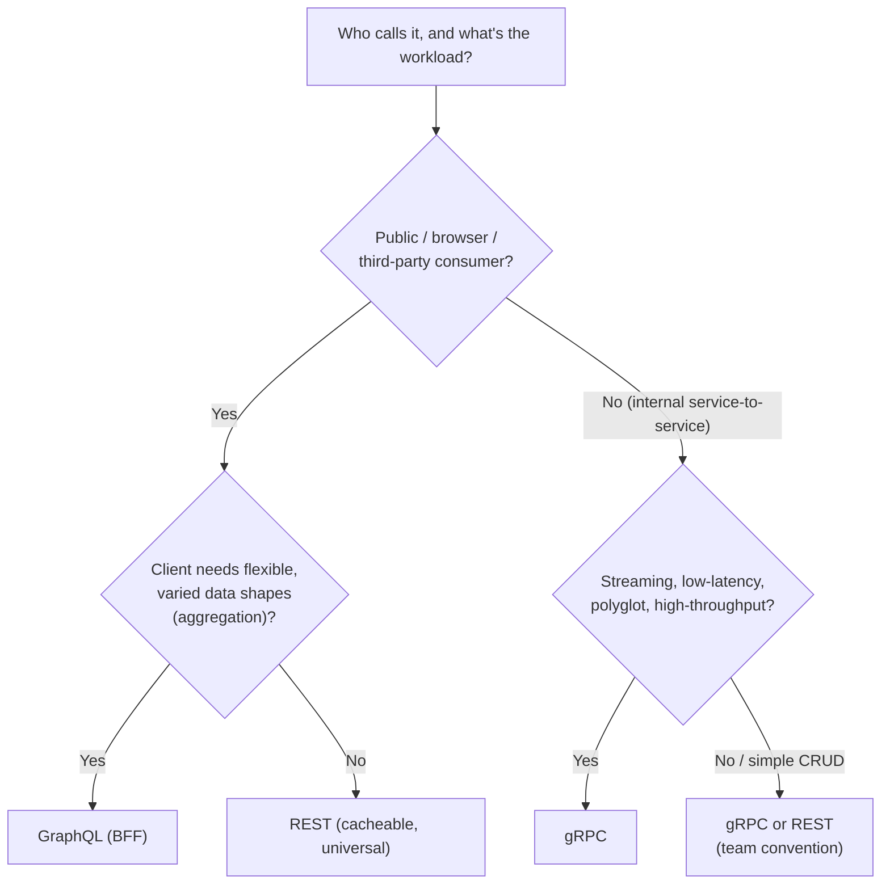
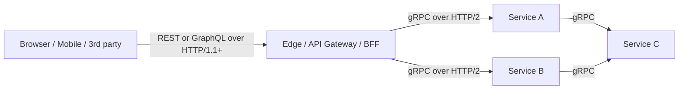

# gRPC vs REST vs GraphQL & Ecosystem

This is the **synthesis topic**: the very common interview question *"when would
you pick gRPC over REST or GraphQL?"* and the surrounding tooling ecosystem
(buf/BSR, Connect, Envoy, grpc-gateway, protovalidate, the CNCF landscape). It
assumes you already know how gRPC works at the mechanism level (see the other
topics in this domain) and how HTTP/2 works on the wire.

The goal here is **judgment**: understanding the *design axes* along which the
three approaches differ, why each excels in its niche, and how real systems
combine them (gRPC internally, REST/GraphQL at the edge). A strong answer never
says "gRPC is faster, so use gRPC" — it reasons about the *workload* and the
*consumers*.

Boundaries with sibling domains (cross-referenced, **not** re-taught here):

- **networking** owns HTTP/2 on the wire (framing, HPACK, multiplexing, flow
  control) and TLS internals. Here we only invoke *why gRPC needs HTTP/2*.
- **rest-api-design** owns REST/HTTP contract design and **GraphQL as an API
  style** (schemas, resolvers, N+1, persisted queries). Here we *compare* them —
  we do not re-teach how to design a REST or GraphQL API.
- **system-design** owns service-to-service architecture at scale and service
  mesh. Here we stay at the framework/protocol altitude and reference it for BFF
  and mesh patterns.
- **reliability-ops** owns resilience theory; **observability** owns OTel tooling.

> [!KEY-TAKEAWAY]
> The three are **not** competitors on one axis — they occupy different niches:
> **gRPC** = typed, binary, low-latency **RPC for internal polyglot
> service-to-service** (esp. streaming); **REST** = universal, cacheable,
> human-readable **resource API for public/browser/third-party** consumers;
> **GraphQL** = a **client-driven query language** that solves over-/under-fetching
> for **flexible frontends aggregating many sources**. Mature systems commonly use
> **all three**: gRPC in the mesh, REST/GraphQL at the edge/BFF.

---

## The three paradigms at a glance

The fundamental difference is the **interaction model**, not the wire format.

| Axis | gRPC | REST | GraphQL |
|---|---|---|---|
| **Model** | Remote **procedure** call (methods) | **Resources** + HTTP verbs | **Query language** over a graph/schema |
| **Contract** | `.proto` (strong, codegen, required) | OpenAPI/Swagger (optional, looser) | SDL schema (strong, introspectable) |
| **Payload** | Protobuf **binary** | JSON/text (usually) | JSON (query is text) |
| **Transport** | **HTTP/2 required** | Any HTTP (1.1/2/3) | Usually HTTP/1.1 POST to one endpoint |
| **Endpoints** | One method = one path (`/pkg.Svc/Method`) | Many resource URLs + verbs | Usually **one** endpoint (`/graphql`) |
| **Streaming** | **Native** (server/client/bidi) | Bolted on (SSE, WebSockets, long-poll) | Subscriptions (usually over WebSockets) |
| **Fetch shape** | Fixed per method | Fixed per endpoint (over/under-fetch) | **Client picks exact fields** |
| **Browser** | Not directly (needs gRPC-Web + proxy) | **Universal / native** | Native (it's just HTTP POST) |
| **Caching** | No HTTP caching (POST, binary) | **HTTP caching native** (GET, ETag, CDN) | Hard (POST); needs app-layer/persisted queries |
| **Human-readable** | No (binary; needs tooling) | **Yes** (curl/browser) | Semi (JSON response, text query) |
| **Sweet spot** | Internal, low-latency, polyglot, streaming | Public/third-party CRUD, cacheable | Aggregating BFF for rich, varied frontends |

The key mental model: **gRPC is call-a-function**, **REST is manipulate-a-resource**,
**GraphQL is ask-for-exactly-the-data-you-want**. Once you internalize that, the
"when to use which" answers fall out naturally.

> [!INTERVIEW]
> A frequent trap: interviewers expect you to say "gRPC because it's binary and
> faster." The senior answer flips it: performance is *one* axis and the gap is
> **workload-dependent**; the *decisive* factors are usually **who the consumer
> is** (internal service vs browser vs third party), **whether you need
> streaming**, and **whether you can afford strong contracts + codegen**.

---

## gRPC vs REST

**REST** models the domain as **resources** addressed by URLs and manipulated with
HTTP verbs (`GET /users/42`, `POST /orders`), typically exchanging JSON over any
HTTP version. **gRPC** models the domain as **service methods** you invoke
(`rpc GetUser(GetUserRequest) returns (User)`), sending Protobuf-encoded binary
frames over HTTP/2.

**Where gRPC wins:**

- **Payload size + CPU.** Protobuf is a compact binary encoding with no field
  names on the wire (field *numbers* + wire types only) — smaller and faster to
  (de)serialize than JSON text parsing. See `protocol-buffers-syntax-types-encoding`.
- **Strong contract + codegen.** The `.proto` generates typed stubs; the compiler
  catches type mismatches. REST's OpenAPI is optional and often drifts from
  reality; you frequently hand-write client models.
- **Native streaming.** Server-, client-, and bidirectional streaming are
  first-class (one HTTP/2 stream per RPC). REST simulates streaming with SSE,
  WebSockets, or long-polling bolted on top.
- **Multiplexing.** Many concurrent RPCs share one HTTP/2 connection with no
  head-of-line blocking at the HTTP layer (networking owns the details).

**Where REST wins:**

- **Universality / browser-native.** Any HTTP client — a browser `fetch`, `curl`,
  a webhook sender — can call REST with zero tooling. gRPC is **not directly
  callable from a browser** (browsers don't expose HTTP/2 trailers/framing to JS),
  so you need **gRPC-Web + a proxy** (see `grpc-web-and-gateways`).
- **HTTP caching + intermediaries.** `GET` responses are cacheable by browsers,
  CDNs, and reverse proxies via `Cache-Control`/`ETag`. gRPC uses `POST` with
  binary bodies and cannot use HTTP caching — a big deal for read-heavy public
  APIs.
- **Human-readability / debuggability.** You can read a JSON response by eye,
  reproduce a call with `curl`, and inspect it in browser devtools. gRPC needs
  `grpcurl`/reflection/Wireshark dissectors.
- **Ubiquity.** Every language, gateway, WAF, and API-management product speaks
  REST; the operational ecosystem is enormous.

| Concern | gRPC | REST |
|---|---|---|
| Serialization | Binary Protobuf | Text JSON (usually) |
| Transport | HTTP/2 mandatory | Any HTTP |
| Contract | `.proto`, enforced, codegen | OpenAPI, optional |
| Streaming | Native (4 types) | SSE / WebSocket add-ons |
| Interaction | Method / RPC | Resource / verb |
| Browser | Needs gRPC-Web + proxy | Native |
| Caching | None (POST/binary) | Native (GET/ETag/CDN) |
| Debuggability | Tooling required | curl/browser |
| Best for | Internal low-latency polyglot | Public/third-party/browser |

> [!WARNING]
> "gRPC is X times faster than REST" benchmarks are notoriously workload-sensitive.
> For **small, chatty, internal** calls gRPC's binary framing + connection reuse
> shines. For **large, cacheable, read-mostly public** traffic, REST + a CDN can
> crush gRPC on effective latency because the fastest request is the one served
> from cache. Always qualify the claim.

---

## gRPC vs GraphQL

These solve **different problems**, which is why "gRPC vs GraphQL" is often a
category error unless you frame it as *internal RPC vs client-driven aggregation*.

**GraphQL** is a **query language + runtime**: the client sends a query describing
**exactly the fields it wants** (across possibly many backend sources), and the
server's resolvers assemble precisely that shape in one round trip. It directly
attacks **over-fetching** (REST returns fields you don't need) and **under-fetching**
(REST needs N calls to assemble a screen). It shines for **rich, heterogeneous
frontends** (web + mobile + partners) that each want different data shapes from a
single **aggregating endpoint** — a classic BFF role.

**gRPC** is **fixed-method RPC**: each method has a fixed request/response type.
There is no "give me only these fields" — you get the whole response message
(though `google.protobuf.FieldMask` lets a server *optionally* honor a
client-specified subset, it's a convention, not the transport: `FieldMask` is
just a request *field* the server must explicitly read and apply in its own
handler code — nothing in the wire protocol enforces it. So it gives read/update
masks for get-and-update patterns you hand-code, **not** the free, runtime-enforced
client field selection GraphQL gives you). gRPC shines for
**typed, high-throughput, internal service-to-service** calls where the shapes are
known and stable and you want minimal latency and codegen safety.

| Axis | gRPC | GraphQL |
|---|---|---|
| Nature | RPC framework | Query language + runtime |
| Who shapes response | The **method** (fixed) | The **client** (per query) |
| Over/under-fetching | Possible (fixed messages) | Solved by design |
| Transport/format | HTTP/2 + binary Protobuf | HTTP + JSON (query is text) |
| Aggregation | Client orchestrates calls | Server resolvers aggregate |
| Streaming | Native (bidi) | Subscriptions (WebSocket) |
| Typical consumer | Internal services | Diverse frontends / BFF |
| Perf profile | Low-latency internal RPC | Flexible; resolver-cost/N+1 risk |

**Key GraphQL gotchas (owned by rest-api-design, noted here for the comparison):**
the **N+1 resolver problem** (needs dataloaders/batching), **caching is harder**
(single POST endpoint; needs persisted queries or app-layer caching), and a single
malicious deep/wide query can be expensive (needs depth/complexity limits).

> [!TIP]
> A clean framing for interviews: **GraphQL optimizes the *client's* data-fetching
> ergonomics** (one flexible query, no over/under-fetch); **gRPC optimizes the
> *server-to-server* call path** (typed, binary, streaming, low-latency). They can
> coexist: a GraphQL BFF resolves fields by making **gRPC calls** to downstream
> microservices.

---

## Performance reality (what actually matters)

Performance is real but **nuanced** — mechanism-level reasons gRPC is often faster
for internal RPC, and the caveats:

**Why gRPC tends to be faster for internal RPC:**

- **Compact binary encoding.** Protobuf omits field names, uses varint/zigzag and
  length-delimited encoding — fewer bytes and cheaper to parse than JSON text.
- **HTTP/2 connection reuse + multiplexing.** One long-lived connection carries
  many concurrent streams; no per-request TCP/TLS setup, no HTTP-layer
  head-of-line blocking (see `http2-foundations-for-grpc`).
- **HPACK header compression** amortizes repeated headers.
- **Streaming** avoids repeated request framing for high-volume data.

**Worked example — "binary is smaller," in actual bytes.** Take the message
`{"user_id": 42, "name": "Ada", "active": true}`.

*JSON on the wire* (compact, no spaces) is the literal text
`{"user_id":42,"name":"Ada","active":true}` — **41 bytes**. Every field *name* is
shipped as characters, plus quotes, colons, commas, and braces.

*Protobuf* ships field *numbers* + wire types, no names. Each field starts with a
**tag byte** = `(field_number << 3) | wire_type`:

- `user_id = 42` (field 1, wire type 0 = varint): tag = `(1<<3)|0 = 0x08`, then
  varint `42 = 0x2A` → `08 2A` = **2 bytes**.
- `name = "Ada"` (field 2, wire type 2 = length-delimited): tag = `(2<<3)|2 = 0x12`,
  length `3`, then bytes `A d a` = `41 64 61` → `12 03 41 64 61` = **5 bytes**.
- `active = true` (field 3, wire type 0 = varint): tag = `(3<<3)|0 = 0x18`, then
  `true = 1` → `18 01` = **2 bytes**.

Total = 2 + 5 + 2 = **9 bytes** vs 41 for JSON — roughly a **4.5× shrink**, and the
CPU win is bigger still because there is no text tokenizing/number-parsing. Note the
caveat: after gzip/brotli the *field-name* redundancy JSON pays for compresses away,
so on large, repetitive payloads the compressed gap narrows to ~1.5–2× — the raw
byte win is largest on small, high-frequency messages.

**Why the gap is workload-dependent (and REST can win):**

- **HTTP caching.** REST `GET`s can be served from browser/CDN/proxy caches; a
  cache hit beats *any* origin serialization speed. gRPC (POST, binary) gets no
  free HTTP caching.
- **Payload composition.** For large text-ish payloads that compress well with
  gzip/brotli, the JSON-vs-Protobuf byte gap narrows.
- **JSON is not always the bottleneck.** DB latency, network RTT, and business
  logic often dominate; shaving serialization time may be noise.
- **TCP HOL blocking under loss.** HTTP/2 multiplexes over one TCP connection, so
  packet loss stalls *all* streams. Why: all streams are interleaved into one
  *ordered* TCP byte-stream, and TCP guarantees in-order delivery, so a single lost
  segment forces the kernel to hold back *every* byte that arrived after it — even
  bytes belonging to unrelated streams — until the retransmit arrives. HTTP/2's
  multiplexing lives *above* TCP and can't see past that reorder buffer. QUIC (HTTP/3)
  fixes it by giving each stream its own delivery order, so loss on stream A doesn't
  block stream B (a lossy-network caveat; networking owns the details).

> [!KEY-TAKEAWAY]
> Correct interview claim: *"gRPC is generally faster and more efficient for
> high-throughput, low-latency **internal** RPC due to binary Protobuf + HTTP/2
> multiplexing, but the advantage is workload-dependent, and REST's native HTTP
> **caching** can make it faster end-to-end for read-heavy public traffic."*

---

## Browser reachability and third-party reach

A decisive, often-overlooked axis: **who can call it with no special tooling.**

- **gRPC is not natively browser-callable.** Browser JS cannot control HTTP/2
  framing or read **trailers** (where gRPC puts `grpc-status`), so a raw gRPC call
  from a browser is impossible. You use **gRPC-Web** (a slightly different wire
  format) plus a translating proxy (**Envoy** `grpc_web` filter or the built-in
  support in Connect) — see `grpc-web-and-gateways`.
- **REST is the lingua franca of the public internet.** Third parties, webhooks,
  no-code tools, and every browser speak it with zero setup — a major reason
  **public and partner APIs are almost always REST** (or REST + GraphQL).
- **GraphQL** is browser-friendly (plain HTTP POST) and popular for public APIs
  that want client-flexible queries (e.g., GitHub's API offers both REST and
  GraphQL).

This is why the standard architecture is **gRPC internal, REST/GraphQL at the
edge**: keep the typed, fast, streaming protocol *inside* your trust boundary, and
expose a universal, cacheable, browser-friendly surface *outward*.

---

## The decision guide (when to pick which)

The interview payoff. Map **consumer + workload** to a choice:



**Rules of thumb:**

- **Internal microservices, low latency, streaming, polyglot** → **gRPC**. Typed
  contracts + codegen keep a large service graph consistent.
- **Public / third-party / browser-facing, cacheable, simple resources** →
  **REST**. Universality, caching, and debuggability dominate.
- **Frontend needs to aggregate many sources / avoid over-fetch, varied clients**
  → **GraphQL** (typically as a BFF).
- **Often the answer is "both/and,"** not "either/or" (next subtopic).

Secondary tie-breakers: existing org/team convention and tooling; whether
consumers can adopt codegen; whether you need HTTP caching/CDN; observability and
debugging maturity; and the maturity of your schema-management practice.

> [!INTERVIEW]
> When asked "REST or gRPC for our new service?", *ask a clarifying question
> first*: **"Who consumes it — a browser/third party, or another internal
> service?"** and **"Do we need streaming or is it request/response?"** The answer
> to those two almost fully determines the choice, and asking shows judgment.

---

## Both together: gRPC internal, REST or GraphQL at the edge

Most mature backends don't choose one — they **layer** them. The dominant pattern:



- **Edge/BFF** exposes REST or GraphQL to external/browser clients (universal,
  cacheable, flexible), then **fans out to internal services over gRPC** (typed,
  fast, streaming). The BFF pattern is owned by **system-design**.
- **grpc-gateway / Envoy / Connect** can *auto-generate* a RESTful/JSON edge from
  the same `.proto` (next subtopics), so you maintain **one contract** and get both
  surfaces.
- **GraphQL BFFs** commonly implement resolvers as **gRPC calls** to downstream
  microservices.

**Worked example — trace one "profile page" request through the layers.** A browser
loads a profile screen that needs the user, their recent orders, and recommendations:

1. Browser sends **`GET /profile/42`** — plain REST/JSON over HTTP/1.1 (cacheable,
   browser-native, needs zero tooling).
2. The **BFF** receives it and fans out **3 concurrent gRPC calls** —
   `GetUser(42)`, `ListOrders(user_id=42)`, `GetRecommendations(user_id=42)` — to
   three internal services. All three ride **one HTTP/2 connection per service**
   (or even one shared mux), so there's **no new TCP/TLS handshake per call** and no
   HTTP-layer head-of-line blocking; the three responses come back in parallel.
3. The BFF **assembles one JSON object** `{ user, orders, recommendations }` and
   returns it as the single REST response to the browser.

Net: the browser paid **1 round trip** over a universal protocol; the internal fan-out
was **3 parallel typed binary RPCs**, not 3 more browser round trips. The **GraphQL-BFF
variant** is the same shape — the browser POSTs one query to `/graphql`, and the
`user`, `orders`, and `recommendations` *resolvers* each make the identical gRPC calls
— the only difference is the client, not the server, picks which of those fields to
fetch.

> [!TIP]
> "One contract, two surfaces": annotate your `.proto` with
> `google.api.http` and generate **both** a gRPC service and a REST/JSON gateway
> from it. You get gRPC internally and REST externally without maintaining two
> hand-written specs — this is the grpc-gateway / gRPC transcoding story.

---

## Protobuf-over-REST and Connect (middle grounds)

Not a binary choice — several **hybrids** blend the strengths:

- **Protobuf over REST/HTTP.** Keep RESTful resource semantics and HTTP methods
  but use **Protobuf as the payload** (`Content-Type: application/x-protobuf`) for
  compactness and a shared schema, sacrificing JSON's human-readability. Google's
  public APIs use **gRPC transcoding** — the same `.proto` serves gRPC and a
  REST/JSON API via `google.api.http` annotations.
- **Connect (connectrpc.com, from Buf).** A protocol/family of libraries that
  speaks **three protocols on one server**: gRPC, gRPC-Web, and its own simpler
  **Connect protocol** that works over plain **HTTP/1.1 with JSON or binary** and
  is **directly curl-able and browser-callable without a proxy**. It's schema-first
  (same `.proto`) but drops the hard HTTP/2 requirement, easing the
  browser/debuggability pain while keeping codegen and typing.
- **gRPC-Web.** A wire variant that lets browser clients call gRPC services through
  a translating proxy (Envoy/Connect) — see `grpc-web-and-gateways`.

| Middle ground | Keeps | Gains | Costs |
|---|---|---|---|
| Protobuf-over-REST | REST semantics, HTTP caching | Smaller payloads, shared schema | Loses JSON readability |
| gRPC transcoding (grpc-gateway) | One `.proto` | Both gRPC + REST/JSON surfaces | Extra proxy/codegen layer |
| Connect | Schema + codegen | HTTP/1.1, curl/browser, no proxy | Newer, smaller ecosystem than gRPC |

---

## Schema management ecosystem (buf, BSR, protovalidate)

At scale, the `.proto` files *are* your API surface, so the tooling around them is
part of the decision. The modern stack is largely **Buf**:

- **`buf` CLI** — replaces raw `protoc` invocation: builds, **lints** (style rules),
  formats, and generates code from a `buf.yaml`/`buf.gen.yaml`. Much simpler than
  managing `protoc` plugins and include paths by hand.
- **Breaking-change detection.** `buf breaking` compares your protos against a
  baseline (git ref or the registry) and **fails CI** if you make an incompatible
  change — e.g., changing a field number, changing a field type, or renumbering.
  This operationalizes the schema-evolution rules (see
  `schema-evolution-and-compatibility`) so wire-compat is enforced automatically.
- **BSR (Buf Schema Registry).** A hosted registry for `.proto` modules:
  versioning, dependency management (import shared protos like you'd import a
  library), generated-SDK hosting, and remote codegen. It turns schemas into
  first-class, discoverable artifacts across an org.
- **protovalidate.** The successor to `protoc-gen-validate` (PGV): you declare
  **validation constraints as options directly in the `.proto`**
  (e.g., `string email = 1 [(buf.validate.field).string.email = true];`) using CEL
  expressions, and a runtime library enforces them across languages — validation
  travels with the contract instead of being re-implemented per service.

```proto
// protovalidate: constraints live in the schema, enforced across languages
import "buf/validate/validate.proto";

message CreateUserRequest {
  string email = 1 [(buf.validate.field).string.email = true];
  int32  age   = 2 [(buf.validate.field).int32 = {gte: 0, lte: 150}];
}
```

> [!WARNING]
> Wire-compat is about **field numbers and types**, not field names — renaming a
> field is wire-safe but renaming an RPC/service or **changing/reusing a field
> number** is breaking. `buf breaking` catches these mechanically; don't rely on
> code review alone. (Full rules: `schema-evolution-and-compatibility`.)

---

## Proxies, gateways and the service mesh

gRPC's HTTP/2 + streaming nature means **naive L4 load balancers don't work well**
(one long-lived connection pins all RPCs to one backend). The ecosystem answers
with L7-aware infrastructure:

- **Envoy.** The de-facto **L7 proxy/sidecar** for gRPC: HTTP/2-native,
  **per-request** gRPC load balancing, the `grpc_web` filter (browser bridge),
  retries, health checks, and the **xDS** control-plane API. It's the data plane in
  most meshes. (LB mechanics: `load-balancing-and-service-discovery`.)
- **grpc-gateway.** A `protoc` plugin that generates a **reverse-proxy** exposing a
  **RESTful JSON API** in front of your gRPC service, driven by `google.api.http`
  annotations in the `.proto`. This is the canonical "one contract → gRPC + REST"
  tool in the open-source world.
- **Service mesh (Istio/Linkerd + Envoy).** Off-loads mTLS, retries, timeouts,
  traffic-splitting, and per-request LB from app code into sidecars, configured via
  **xDS**. Mesh architecture is owned by **system-design**; here just know gRPC is a
  first-class mesh citizen and *why* it needs L7.

> [!TIP]
> If asked "how do you load-balance gRPC behind Kubernetes?", the crisp answer:
> a plain L4 `Service`/`kube-proxy` will pin all streams to one pod because the
> connection is long-lived. Use a **headless Service + client-side LB**, or an
> **L7 proxy/mesh (Envoy/Istio/Linkerd)** that balances **per-RPC**. Details in
> `load-balancing-and-service-discovery`.

---

## The CNCF landscape (ecosystem map)

For a "what's around gRPC?" question, the reference points:

- **gRPC** itself — a **CNCF incubating** project (accepted 2017, donated by Google).
- **Protocol Buffers** — the IDL + serialization (Google, open source).
- **Buf** — `buf` CLI, **BSR**, `buf breaking`/`buf lint`, **protovalidate**,
  **Connect**: the modern schema-management + codegen + multi-protocol stack.
- **Envoy** — CNCF graduated L7 proxy; the data plane for gRPC LB and gRPC-Web.
- **grpc-gateway** — REST/JSON transcoding reverse proxy from `.proto`.
- **xDS** — the discovery-service API family (LDS/RDS/CDS/EDS) that gRPC clients
  *and* Envoy consume for LB/config from a control plane.
- **OpenTelemetry** — vendor-neutral tracing/metrics; the standard way to
  instrument gRPC (interceptors + OTel gRPC). Owned by **observability**.
- **channelz / grpc reflection / grpcurl** — built-in debugging/observability
  (channel state) and CLI tooling for a binary protocol.
- **Health Checking Protocol** (`grpc.health.v1.Health`) — the standard gRPC
  liveness/readiness service used by k8s probes and LBs.

> [!KEY-TAKEAWAY]
> "gRPC" in production really means **gRPC + Protobuf + a schema-management stack
> (Buf/BSR) + an L7 data plane (Envoy/mesh) + observability (OTel/channelz) +
> optionally a REST/GraphQL edge (grpc-gateway/Connect/BFF)**. Naming this
> ecosystem — not just the core framework — is what distinguishes a senior answer.

---

## Common Interview Follow-ups

- **"When would you *not* use gRPC?"** — Public/browser/third-party APIs where
  universality, HTTP caching, and debuggability matter; simple CRUD where REST's
  ecosystem is enough; clients that can't adopt codegen; environments where the
  team lacks HTTP/2/L7-LB operational maturity.
- **"Is gRPC always faster than REST?"** — No. Faster for chatty internal binary
  RPC; but REST + CDN/HTTP caching can win end-to-end for read-heavy public traffic,
  and serialization is often not the bottleneck. It's workload-dependent.
- **"gRPC or GraphQL for our mobile app's backend?"** — Likely a **GraphQL (or
  REST) BFF** at the edge (browser/mobile-friendly, client-flexible), which itself
  calls internal services over **gRPC**. Not an either/or.
- **"How do you expose a gRPC service to a browser?"** — gRPC-Web + a proxy (Envoy
  `grpc_web` / Connect), or expose a REST/JSON surface via grpc-gateway
  transcoding, or use the Connect protocol (HTTP/1.1, curl/browser-friendly).
- **"How do you keep one API contract but serve both gRPC and REST?"** — Annotate
  the `.proto` with `google.api.http` and generate a REST gateway (grpc-gateway) or
  use gRPC transcoding — one source of truth, two surfaces.
- **"How do you stop breaking changes to a widely-used proto?"** — `buf breaking`
  in CI against a baseline in the BSR/git; enforces the field-number/type rules
  mechanically. (Rules: `schema-evolution-and-compatibility`.)
- **"What's the middle ground between gRPC and REST?"** — Protobuf-over-REST (JSON
  semantics, binary payload) or **Connect** (schema + codegen over HTTP/1.1, JSON
  or binary, curl/browser-friendly, no proxy).
- **"Why can't a browser call gRPC directly?"** — Browser JS can't control HTTP/2
  framing or read **trailers**, where `grpc-status` lives; hence gRPC-Web + proxy.

## References

- gRPC docs — *Introduction / Core concepts / FAQ*: <https://grpc.io/docs/what-is-grpc/introduction/>
- gRPC docs — *gRPC on HTTP/2*: <https://grpc.io/blog/grpc-on-http2/>
- gRPC over HTTP/2 wire spec: <https://github.com/grpc/grpc/blob/master/doc/PROTOCOL-HTTP2.md>
- Protocol Buffers proto3 language guide: <https://protobuf.dev/programming-guides/proto3/>
- gRPC-Web: <https://github.com/grpc/grpc-web>
- Connect (connectrpc): <https://connectrpc.com/docs/introduction/>
- Buf docs — CLI, `buf breaking`, BSR: <https://buf.build/docs/>
- protovalidate: <https://buf.build/docs/protovalidate/overview/>
- grpc-gateway: <https://grpc-ecosystem.github.io/grpc-gateway/>
- Google AIP-127 / HTTP transcoding (`google.api.http`): <https://google.aip.dev/127>
- Envoy gRPC / gRPC-Web filters: <https://www.envoyproxy.io/docs/envoy/latest/>
- GraphQL spec (comparison context; owned by rest-api-design): <https://spec.graphql.org/>
- CNCF landscape: <https://landscape.cncf.io/>
