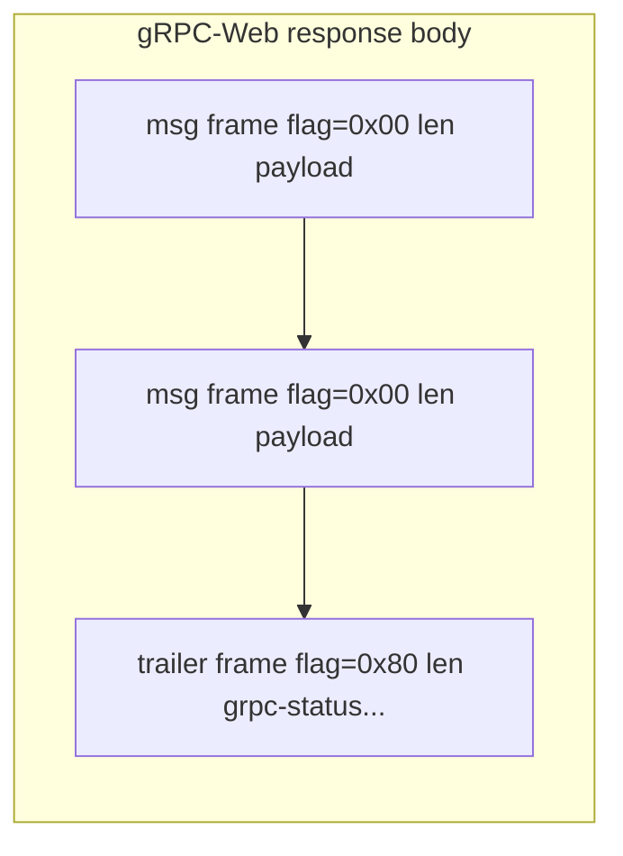
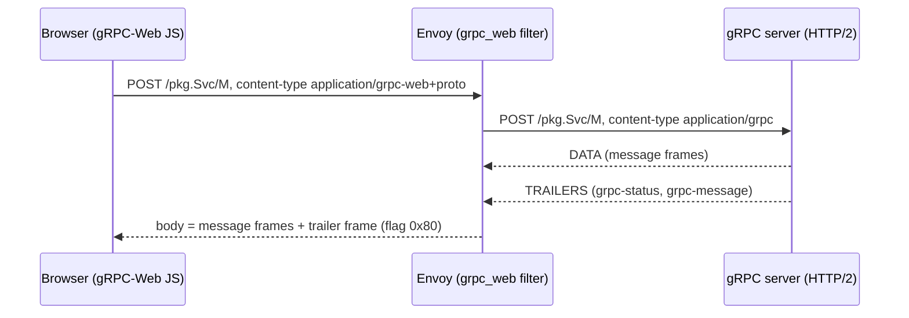
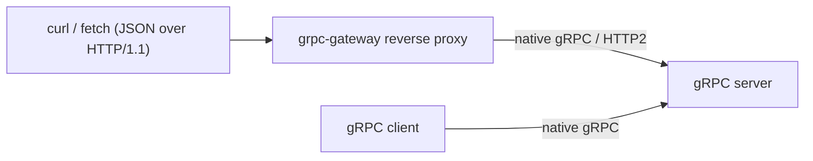
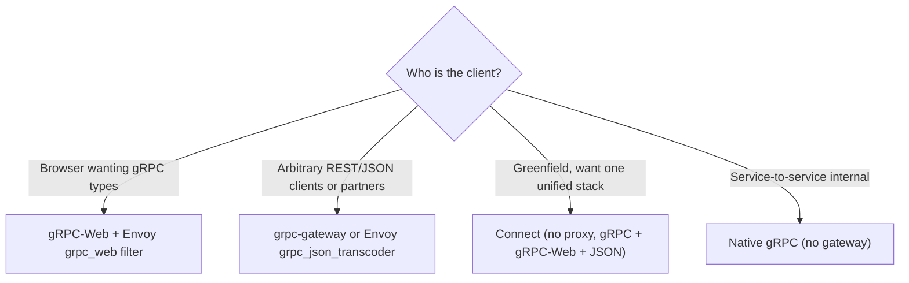

# gRPC on the Web & Gateways (gRPC-Web, grpc-gateway)

Native gRPC assumes a client that can drive HTTP/2 at the frame level: length-prefixed
message framing, HTTP/2 **trailers** for the final status, and full-duplex streaming.
Browsers cannot do that from JavaScript, and many existing clients (curl scripts,
partner integrations, mobile SDKs) speak only JSON over HTTP/1.1. This topic is about
**bridging gRPC to the web**: the `gRPC-Web` protocol + proxy, JSON/REST **transcoding**
via `grpc-gateway` (and Envoy's transcoder), and `Connect` — a modern stack that speaks
gRPC, gRPC-Web, and its own browser-friendly HTTP protocol without a separate proxy.

> [!KEY-TAKEAWAY]
> A browser cannot emit a compliant gRPC request or read the `grpc-status` **trailer**,
> so it cannot speak native gRPC. gRPC-Web is a *modified* protocol (trailers encoded
> **in the body**) that a proxy (Envoy `grpc_web` filter or the standalone proxy)
> translates to real gRPC — and it supports **unary + server-streaming only**, not
> client- or bidi-streaming. grpc-gateway generates a **REST/JSON reverse proxy** from
> `google.api.http` annotations. Connect collapses all of this into one runtime that
> needs **no proxy** for browsers.

> [!TIP]
> HTTP/2 framing, HPACK, flow control, multiplexing, and TLS internals are owned by the
> **networking** (and **security**) domains — this topic uses those foundations but does
> not re-derive them. REST/HTTP API contracts and GraphQL as an API style are owned by
> **rest-api-design**. General resilience theory (retries/backoff/circuit breakers) is
> owned by **reliability-ops**; service-mesh/xDS architecture by **system-design**;
> OTel/metrics/tracing tooling by **observability**. We cross-reference, not duplicate.

## Why Browsers Cannot Speak Native gRPC

Native gRPC is defined *on top of HTTP/2* (see the `http2-foundations-for-grpc` topic).
An RPC is a single HTTP/2 stream where:

- The request is `POST /package.Service/Method` with `content-type: application/grpc`.
- Payloads are **length-prefixed messages**: 1 compression-flag byte + 4-byte
  big-endian length + the serialized protobuf, one or more per DATA frame.
- The **final status** (`grpc-status`, `grpc-message`, `grpc-status-details-bin`) is
  delivered in **HTTP/2 trailers** — HEADERS frames sent *after* the DATA, with
  `END_STREAM` set.
- Streaming relies on the client controlling when DATA frames are flushed (full-duplex).

The browser `fetch`/`XMLHttpRequest` APIs deliberately **abstract HTTP away from the
application**. From JS you cannot:

1. **Read HTTP trailers.** There is no API to observe trailing HEADERS, so a browser
   could never see `grpc-status` — the RPC's actual result. This is the single most
   fundamental blocker.
2. **Force or frame HTTP/2.** You cannot require HTTP/2 or manipulate DATA/HEADERS
   frames; the browser and OS decide the protocol and connection reuse.
3. **Do full-duplex request streaming.** Historically `fetch` could not stream a
   request body at all; even now upload streaming is limited (HTTP/2-only, half-duplex,
   not universally supported), so bidi/client-streaming is not viable.

Because the *result* of every gRPC call travels in a trailer the browser cannot read,
"just call the gRPC endpoint from JavaScript" is impossible. Something must move the
status out of the trailer and into a place the browser *can* read — the body. That is
exactly what gRPC-Web does.

> [!WARNING]
> The blocker is not TLS or CORS or "browsers don't do HTTP/2" (they do). It is the
> **inability to read trailers** (and to control framing/full-duplex). Candidates who
> say "browsers can't do HTTP/2" are wrong — browsers use HTTP/2 heavily; they just
> don't expose it to JavaScript.

## The gRPC-Web Protocol

**gRPC-Web** is a spec-defined variant of the gRPC wire protocol designed to be
expressible by a browser and translatable by a proxy. Key differences from native gRPC:

| Aspect | Native gRPC | gRPC-Web |
|---|---|---|
| Transport | HTTP/2 only | HTTP/1.1 **or** HTTP/2 |
| `content-type` | `application/grpc` | `application/grpc-web+proto` or `application/grpc-web-text+proto` (base64) |
| Final status | HTTP/2 **trailers** | encoded **in the response body** as a trailer frame |
| Message framing | length-prefixed | **same** length-prefixed framing |
| Streaming | all 4 types | **unary + server-streaming only** |

Two encodings exist:

- **`application/grpc-web+proto`** — binary framing, identical message framing to gRPC.
  Requires the client to read raw bytes (fine with modern `fetch`/`XHR` in
  arraybuffer/binary mode).
- **`application/grpc-web-text+proto`** — the *entire* body is **base64-encoded** so it
  survives environments (old XHR, some proxies) that mangle binary. Larger and slower;
  used as a fallback.

The crucial trick is **trailers-in-body**. gRPC-Web reuses the same
`<1-byte flag><4-byte length><payload>` framing, but the flag byte's **most-significant
bit (`0x80`)** marks a frame as a **trailers frame** rather than a message frame. Its
payload is the HTTP/1.1-style trailer text:

```
grpc-status: 0\r\n
grpc-message: \r\n
```

So a gRPC-Web response is: `[message frame(s)] [trailer frame (flag 0x80)]`. The browser
reads the body to the end, finds the trailer frame, and parses `grpc-status` — solving
the "can't read trailers" problem by putting the status where the body reader can see it.



## The gRPC-Web Proxy

A gRPC-Web client cannot talk to a stock gRPC server directly — the server expects
native `application/grpc` with real trailers, not `application/grpc-web+proto` with
in-body trailers. A **proxy** sits in between and **translates**:

- Browser → proxy: gRPC-Web (HTTP/1.1 or HTTP/2, possibly base64).
- Proxy → backend: native gRPC over HTTP/2.
- On the way back, the proxy takes the backend's HTTP/2 trailers and **re-encodes them
  as the in-body trailer frame** the browser expects (and base64-encodes if `-text`).

Common proxies:

- **Envoy `grpc_web` filter** — the production-standard option. Envoy already terminates
  TLS and load-balances L7; adding `envoy.filters.http.grpc_web` makes it a gRPC-Web
  translator. Typically paired with the CORS filter.
- **`grpcwebproxy`** (the standalone Go proxy from the grpc-web project) — simpler, good
  for local dev or small deployments.
- **In-process handlers** — e.g. the Go `improbable-eng/grpc-web` `WrapServer`, which lets
  a Go gRPC server also answer gRPC-Web on the same port without a separate hop.



> [!TIP]
> Because gRPC-Web needs a translating proxy anyway, teams already running Envoy at the
> edge get gRPC-Web nearly for free — enable the filter. Remember to configure **CORS**
> (preflight + exposing `grpc-status`/`grpc-message` if surfaced as headers) so the
> browser's cross-origin request succeeds.

## Streaming Support and Limits in gRPC-Web

gRPC-Web supports **unary** and **server-streaming** RPCs, but **not client-streaming or
bidirectional streaming**.

- **Unary** and **server-streaming** both send a *single* request and then read a
  response body to completion — which maps cleanly onto a browser request whose response
  is read as a stream (server-streaming) or in one shot (unary).
- **Client-streaming** and **bidi** require the *client* to send multiple messages over
  time, i.e. stream the **request** body full-duplex. Browsers historically cannot stream
  a request body at all, and even the newer `ReadableStream` request upload is
  HTTP/2-only, half-duplex, experimental, and not broadly supported — so the gRPC-Web
  spec excludes these two call types.

| RPC type | Native gRPC | gRPC-Web |
|---|---|---|
| Unary | ✅ | ✅ |
| Server-streaming | ✅ | ✅ |
| Client-streaming | ✅ | ❌ |
| Bidirectional | ✅ | ❌ |

Server-streaming over gRPC-Web has an important gotcha: some client/proxy transports
**buffer the whole response** before delivering it, defeating incremental streaming.
The base64 `-text` mode in particular is often fully buffered. For true incremental
server-streaming you generally want the binary mode over HTTP/2 and a client/transport
that exposes chunks as they arrive.

> [!INTERVIEW]
> "Your web app needs to upload a large file to a gRPC service as a stream of chunks
> (client-streaming). Can gRPC-Web do it?" — **No.** gRPC-Web has no client-streaming.
> Options: switch to **Connect** (its protocol supports client-streaming where the
> platform allows) but browser request-streaming is still constrained; more commonly,
> redesign as **server-streaming** or **unary** (chunk via repeated unary calls, or use a
> resumable upload endpoint), or use a non-gRPC upload path. Cross-ref `rest-api-design`
> for resumable-upload patterns.

## The gRPC-Web Client and Codegen

The browser client is generated from the same `.proto` files, so the contract stays
single-sourced. The classic toolchain is **`protoc` + `protoc-gen-grpc-web`**:

```bash
protoc -I. echo.proto \
  --js_out=import_style=commonjs:./gen \
  --grpc-web_out=import_style=typescript,mode=grpcwebtext:./gen
```

- `mode=grpcwebtext` → base64 `application/grpc-web-text+proto` (works everywhere;
  supports server-streaming reads through XHR progress events).
- `mode=grpcweb` → binary `application/grpc-web+proto` (smaller/faster; needs a transport
  that can read binary).
- `import_style=typescript` emits typed clients; `commonjs`/`closure` also exist.

Generated usage (TypeScript):

```ts
const client = new EchoServiceClient("https://api.example.com"); // points at the proxy
client.echo(new EchoRequest({ message: "hi" }), {}, (err, resp) => {
  if (err) { /* err.code is a grpc status code, err.message from grpc-message */ }
  else { console.log(resp.getMessage()); }
});
```

Newer ecosystems prefer **`protoc-gen-connect-es`** / **buf** with the Connect client (see
below), which can *also* speak gRPC-Web — many teams now generate a Connect client and
point it at an Envoy `grpc_web` endpoint. Either way, the browser URL targets the
**proxy**, not the raw gRPC backend.

> [!TIP]
> Use **`buf`** to manage protos and codegen (`buf generate`) instead of hand-rolled
> `protoc` invocations — it pins plugin versions and enforces lint/breaking-change checks
> (cross-ref `schema-evolution-and-compatibility`).

## grpc-gateway and REST/JSON Transcoding

**grpc-gateway** solves a *different* problem than gRPC-Web. Instead of teaching the
browser a gRPC dialect, it exposes your gRPC service as a **plain RESTful JSON/HTTP API**
so that *any* HTTP client (curl, a fetch call, a partner with no protobuf tooling) can
use it — while the same `.proto` still serves native gRPC clients.

`protoc-gen-grpc-gateway` reads **`google.api.http`** annotations in the `.proto` and
generates a **reverse-proxy** (a Go `http.Handler`) that:

1. Accepts an HTTP/1.1 JSON request.
2. Parses path/query/body into the protobuf **request message** (JSON↔proto mapping via
   the canonical proto3 JSON mapping).
3. Makes the **real gRPC call** to the backend (or dispatches in-process).
4. Marshals the protobuf **response** back to JSON, and maps the **gRPC status code** to
   an **HTTP status code** (e.g. `NOT_FOUND`→404, `INVALID_ARGUMENT`→400,
   `UNAUTHENTICATED`→401, `PERMISSION_DENIED`→403, `UNAVAILABLE`→503).



So one `.proto` yields **both** a gRPC API and a REST API — "write once, serve both."
The same transcoding can also run **inside Envoy** via the
`envoy.filters.http.grpc_json_transcoder` filter, which reads a compiled proto
**descriptor set** and does JSON↔gRPC at the edge with no generated Go code.

> [!WARNING]
> Transcoding costs a JSON↔protobuf conversion on every call and loses some gRPC features
> (no streaming semantics beyond simple cases, no trailers to the HTTP client). It is a
> compatibility bridge, not a replacement for native gRPC between services.

## HTTP Annotations and Mapping Rules

The mapping lives in the `.proto` using `google.api.http` (from
`google/api/annotations.proto`):

```protobuf
import "google/api/annotations.proto";

service UserService {
  rpc GetUser(GetUserRequest) returns (User) {
    option (google.api.http) = { get: "/v1/users/{user_id}" };
  }
  rpc CreateUser(CreateUserRequest) returns (User) {
    option (google.api.http) = {
      post: "/v1/users"
      body: "user"          // map the request's `user` field to the JSON body
    };
  }
  rpc UpdateUser(UpdateUserRequest) returns (User) {
    option (google.api.http) = {
      patch: "/v1/users/{user.id}"
      body: "user"
    };
  }
}
```

Mapping rules to know:

- **Path parameters** `{user_id}` bind to request-message fields (dotted paths like
  `{user.id}` reach into nested messages). By default a path variable matches one URL
  segment; `{name=shelves/*/books/*}` captures multiple.
- **`body: "*"`** maps the *entire* request message to the JSON body; **`body: "field"`**
  maps one sub-field; omitting `body` (typical for `GET`/`DELETE`) means no body and
  remaining fields come from **query parameters**.
- **HTTP verb** is chosen by the annotation key (`get`/`post`/`put`/`patch`/`delete`) —
  align it with REST semantics (idempotency, safety); cross-ref `rest-api-design`.
- **`additional_bindings`** lets one RPC expose multiple URL shapes.
- `protoc-gen-openapiv2` can emit an **OpenAPI/Swagger** doc from the same annotations.

> [!WARNING]
> proto3 JSON mapping gotchas surface here: by default **`0`/`""`/`false` scalar fields
> are omitted** from JSON output (they equal the default), which can confuse REST
> consumers. Use `proto3` **`optional`** (explicit field presence) or well-known wrapper
> types (`google.protobuf.Int32Value`) when a REST client must distinguish "absent" from
> "zero". `int64`/`uint64` are rendered as **strings** in proto3 JSON to avoid JS 53-bit
> precision loss. See `protocol-buffers-syntax-types-encoding` and
> `schema-evolution-and-compatibility`.

## Connect (connectrpc)

**Connect** (connectrpc.com; `connect-go`, `connect-es`, etc.) is a newer, protobuf-based
RPC framework that speaks **three protocols over the same server**:

1. **gRPC** — fully interoperable with stock gRPC clients/servers.
2. **gRPC-Web** — so browsers using a gRPC-Web transport work directly.
3. **The Connect protocol** — a simple, browser-native HTTP protocol: a **unary** call is
   an ordinary `POST` with `content-type: application/proto` *or* `application/json`, no
   special framing, so it is debuggable with **curl** and readable in browser devtools.
   Streaming uses an enveloped framing similar to gRPC-Web.

The headline benefit: **a Connect server needs no separate proxy** to serve browsers. The
same handler answers a curl JSON request, a gRPC-Web browser client, and a native gRPC
client — you drop the Envoy `grpc_web` hop entirely (though you may still run Envoy for
LB/TLS). Errors use the gRPC status-code model, and unary errors are returned as a JSON
body with a `code` string + `message` + `details`, so an HTTP client can read them
without protobuf trailers.

```bash
# A Connect unary call is just HTTP + JSON — no framing, no proxy:
curl -X POST https://api.example.com/user.v1.UserService/GetUser \
  -H "Content-Type: application/json" \
  -d '{"user_id": "42"}'
```

| Capability | gRPC-Web (+ proxy) | Connect |
|---|---|---|
| Browser support | needs translating proxy | native, no proxy |
| curl-friendly unary | no (framed/base64) | yes (plain JSON POST) |
| Speaks native gRPC | via proxy to backend | yes, directly |
| Client/bidi streaming in browser | no | limited by platform (still constrained) |

> [!TIP]
> Connect does **not** magically enable browser client-streaming — the browser
> request-body limitation still applies. Its win is a unified, proxy-free stack with
> human-readable JSON/curl access, while remaining wire-compatible with the gRPC world.

## Envoy as the Common Gateway

**Envoy** is the de-facto edge/gateway for gRPC on the web because it consolidates several
jobs in one L7 proxy (cross-ref `system-design` for mesh/xDS and `networking` for the
HTTP/2 details):

- **`grpc_web` filter** — translate gRPC-Web ↔ native gRPC.
- **`grpc_json_transcoder` filter** — REST/JSON ↔ gRPC from a proto descriptor (Envoy's
  built-in alternative to grpc-gateway).
- **L7 load balancing** — the critical one for gRPC. gRPC pins **long-lived HTTP/2
  connections** and multiplexes RPCs on them, so a naïve **L4 (connection) load balancer
  sends all of one client's requests to a single backend** — new streams don't rebalance.
  A gRPC-aware **L7** proxy like Envoy balances at the **request/stream** level, so it is
  the standard answer for spreading gRPC load. (Client-side or lookaside LB is the
  proxy-less alternative; cross-ref `channels-stubs-client-server-lifecycle` and
  `reliability-ops`.)
- **TLS termination / mTLS**, **CORS**, timeouts, retries, and observability hooks.

> [!WARNING]
> This L4-vs-L7 point is a classic interview trap: putting a plain TCP/L4 load balancer
> in front of gRPC backends leads to **hot-spotting** because HTTP/2 connection reuse
> means the LB never sees new connections to rebalance. Use an L7 gRPC-aware proxy
> (Envoy) or client-side LB with a headless service + resolver.

## Choosing Between gRPC-Web, grpc-gateway, and Connect



- **gRPC-Web** — you want browser clients that use the gRPC contract/types and you already
  run (or can run) Envoy. Accept the proxy hop and unary/server-streaming-only limit.
- **grpc-gateway / Envoy transcoder** — you must expose a **REST/JSON** surface (public
  API, partners, curl users, existing REST tooling) while keeping gRPC internally. One
  `.proto`, two front doors. Pay the JSON↔proto conversion cost.
- **Connect** — greenfield or modernization where you want a **single, proxy-free** server
  that satisfies browsers (JSON + gRPC-Web) and gRPC clients, with curl-debuggable unary
  calls. Great DX, still gRPC-compatible.
- **Native gRPC** — internal service-to-service traffic needs none of the above; use the
  raw protocol over HTTP/2 with an L7 LB.

These are not mutually exclusive: a common production shape is **native gRPC between
services**, **Envoy at the edge** doing gRPC-Web for the SPA and JSON transcoding for
public REST — all from the same `.proto`.

## Common Interview Follow-ups

- **"Why can't a browser call a gRPC server directly?"** It cannot read HTTP/2
  **trailers** (where `grpc-status` lives), cannot control HTTP/2 framing, and cannot do
  full-duplex request streaming from `fetch`/`XHR`. gRPC-Web moves the status into the
  body to work around the trailer problem.
- **"What exactly does the gRPC-Web proxy translate?"** `application/grpc-web+proto`
  (HTTP/1.1 or /2, possibly base64) ↔ native `application/grpc` over HTTP/2, and it
  re-encodes the backend's HTTP/2 **trailers** as an in-body **trailer frame** (flag byte
  `0x80`).
- **"Which RPC types does gRPC-Web support?"** Unary and **server-streaming** only — no
  client-streaming or bidi (browsers can't full-duplex-stream the request).
- **"gRPC-Web vs grpc-gateway?"** gRPC-Web keeps the gRPC contract for browser clients (+
  proxy). grpc-gateway exposes a **REST/JSON** API for arbitrary HTTP clients via
  `google.api.http` annotations (transcoding).
- **"What does Connect add?"** One server speaking gRPC + gRPC-Web + a plain HTTP/JSON
  protocol, **no proxy** needed for browsers, curl-friendly unary calls, still gRPC-wire
  compatible.
- **"Load balancing gRPC through a gateway?"** Use **L7** (Envoy / gRPC-aware) — an L4 LB
  hot-spots because HTTP/2 connections are long-lived and multiplexed.
- **"REST-JSON gotchas after transcoding?"** proto3 omits default scalars from JSON,
  `int64` becomes a **string**, and you lose gRPC streaming/trailers — use `optional`/
  wrapper types where presence matters. Cross-ref `protocol-buffers-syntax-types-encoding`.

## References

- gRPC-Web protocol spec: `github.com/grpc/grpc/blob/master/doc/PROTOCOL-WEB.md`
- gRPC-over-HTTP2 wire spec: `github.com/grpc/grpc/blob/master/doc/PROTOCOL-HTTP2.md`
- grpc-web (JS/TS): `github.com/grpc/grpc-web`
- grpc-gateway: `github.com/grpc-ecosystem/grpc-gateway` and `grpc-ecosystem.github.io/grpc-gateway`
- `google.api.http` annotation: `github.com/googleapis/googleapis/blob/master/google/api/http.proto`
- Envoy `grpc_web` and `grpc_json_transcoder` filters: `envoyproxy.io` HTTP filters docs
- Connect: `connectrpc.com` (protocol, connect-go, connect-es)
- proto3 JSON mapping: `protobuf.dev/programming-guides/json`
- gRPC official docs: `grpc.io/docs`
- HTTP/2 RFC 9113 (trailers, streams) — see `networking` domain
