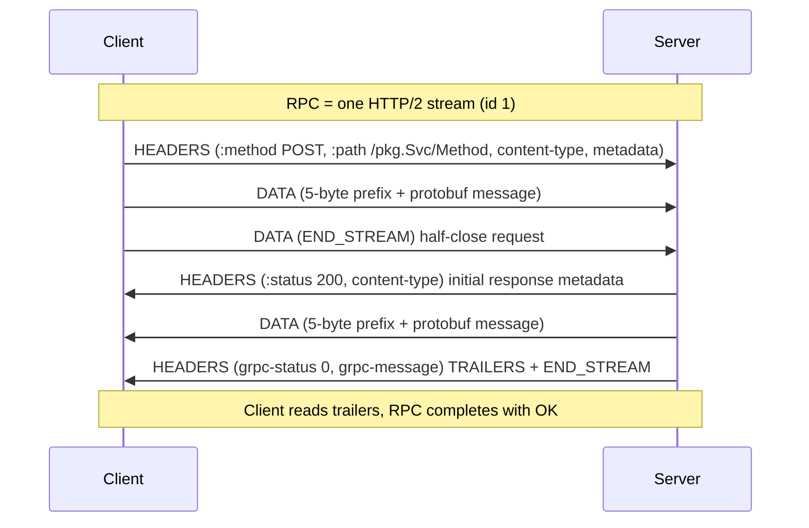
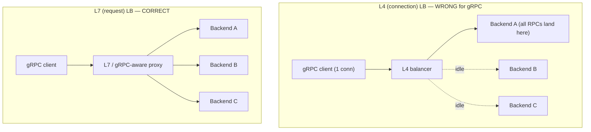

# HTTP/2 Foundations for gRPC

gRPC is not "a new protocol on the wire." It is a **calling convention layered on top of
HTTP/2**: every gRPC call maps to exactly one HTTP/2 stream, request and response messages
travel in HTTP/2 `DATA` frames, and metadata rides in HTTP/2 `HEADERS` frames. Understanding
gRPC at an interview level means understanding *why* it needs HTTP/2 specifically, and *how*
the abstract concepts (an RPC, request metadata, a status code, a deadline, backpressure) are
each encoded into concrete HTTP/2 frames and reserved header names.

This topic teaches the **gRPC-over-HTTP2 mapping** — the contract between the framework and the
transport. It deliberately does **not** re-derive HTTP/2 itself: HPACK header compression, the
binary framing layer, the full stream state machine, `SETTINGS`, priority, and the TLS/ALPN
handshake are owned by the **networking** domain (see `networking/http2-http3-quic` and
`networking/tls-ssl-https`). Here we stay at the altitude of "what does gRPC put in which
frame, and why."

> [!KEY-TAKEAWAY]
> One gRPC RPC = one HTTP/2 stream. The request is a `HEADERS` frame (pseudo-headers + call
> metadata) followed by length-prefixed messages in `DATA` frames. The response ends with a
> **second** `HEADERS` frame carried as HTTP/2 **trailers** — this is where `grpc-status` lives.
> Status is a trailer, not a header, because the outcome of a stream is only known *after* all
> response messages have been sent.

The canonical reference is the **gRPC-over-HTTP2 wire spec** (`grpc/grpc` repo,
`doc/PROTOCOL-HTTP2.md`) plus **RFC 9113** (HTTP/2). Everything below is checked against those.

---

## Why gRPC requires HTTP/2

gRPC could, in principle, have used HTTP/1.1. It does not, and the reasons map directly onto
HTTP/2's features:

**1. Multiplexed streams over one TCP connection.** HTTP/1.1 allows at most one in-flight
request per connection (pipelining exists but is effectively unusable due to head-of-line
blocking and poor support). To run many concurrent RPCs, an HTTP/1.1 client must open a pool of
TCP connections. HTTP/2 multiplexes many independent **streams** over a single connection, each
identified by a stream ID. gRPC assigns one stream per RPC, so a single connection can carry
hundreds of concurrent calls. This removes **head-of-line blocking at the application layer**:
a slow RPC does not block other RPCs on the same connection.

> [!WARNING]
> HTTP/2 removes application-layer HOL blocking but **not** transport-layer HOL blocking. All
> streams still share one TCP byte stream, so a single lost TCP segment stalls *every* stream
> until retransmission. Eliminating that is the job of HTTP/3 / QUIC (see
> `networking/http2-http3-quic`), which gRPC can also run over.

**2. Bidirectional streaming.** HTTP/2 streams carry `DATA` frames in *both* directions and stay
open until explicitly half-closed (`END_STREAM`). This is exactly what gRPC's client-streaming,
server-streaming, and bidirectional-streaming call types need — long-lived, full-duplex message
flows over one stream. HTTP/1.1 has no clean equivalent.

**3. Trailers.** HTTP/2 supports **trailing headers** — a `HEADERS` frame sent *after* the
`DATA` frames. gRPC uses trailers to deliver the final status (`grpc-status`, `grpc-message`)
once a response has finished streaming. Without trailers there is nowhere to put a status that
is only known at the end. (HTTP/1.1 has chunked-encoding trailers, but support is spotty.)

**4. Binary framing.** HTTP/2 is a binary protocol with a fixed 9-byte frame header. gRPC
messages are binary protobuf, and length-prefixing them inside binary `DATA` frames is natural —
no text parsing, no base64.

**5. Header compression (HPACK).** gRPC calls carry repetitive metadata (`:path`,
`content-type: application/grpc`, auth tokens). HPACK (RFC 7541) compresses these across
requests on a connection, cutting per-RPC header overhead. gRPC does not manage HPACK itself; it
just benefits from HTTP/2 providing it.

**What gRPC does *not* use:** HTTP/2 **server push** (`PUSH_PROMISE`) is unused by gRPC — server
streaming is done with `DATA` frames on the RPC's own stream, not push. Stream **priority**
(the RFC 7540 priority tree) is likewise not part of the gRPC model.

| HTTP/1.1 limitation | HTTP/2 feature gRPC relies on |
|---|---|
| One request per connection (HOL blocking) | Multiplexed streams, one per RPC |
| No full-duplex within a request | Bidirectional `DATA` frames per stream |
| No reliable trailers | Trailers carry final `grpc-status` |
| Text framing, header repetition | Binary frames + HPACK compression |

---

## An RPC is one HTTP/2 stream

The core mapping: **each gRPC call occupies exactly one HTTP/2 stream**, opened by the client. A
stream is a bidirectional sequence of frames sharing a stream ID (odd for client-initiated, per
RFC 9113). The RPC's entire lifetime — request metadata, request messages, response metadata,
response messages, final status — lives on that one stream, and the stream closes when the RPC
completes (or is cancelled/reset).

Because streams are cheap and multiplexed, a client's single `Channel` (its logical connection)
can run many RPCs at once. This is why gRPC connection reuse works so well — but also why naive
L4 load balancing fails (see *Why gRPC needs L7 load balancing* below).



> [!TIP]
> When someone asks "how does gRPC map onto HTTP/2," the crisp answer is three frame groups:
> **request HEADERS + DATA**, **response initial HEADERS + DATA**, **response TRAILERS**. If you
> can name what goes in each, you understand the wire format.

---

## Request framing: the HEADERS frame

The client starts an RPC by sending an HTTP/2 `HEADERS` frame. This frame carries HTTP/2
**pseudo-headers** plus gRPC's **reserved headers** plus any custom **metadata**. Reserved
gRPC request headers (from the wire spec):

- `:method` = **POST** (always — gRPC never uses GET; even unary calls are POSTs).
- `:scheme` = `http` or `https`.
- `:path` = **`/{full.package.Service}/{Method}`**, e.g. `/routeguide.RouteGuide/GetFeature`.
  The service is the fully-qualified proto service name; the method is the RPC name.
- `:authority` = the virtual host (like HTTP `Host`).
- `content-type` = **`application/grpc`** (optionally `application/grpc+proto`,
  `application/grpc+json`, etc., to name the message codec). A server MUST reject a non-`grpc`
  content-type.
- `te` = **`trailers`** — the client asserts it understands HTTP/2 trailers. Required by the
  spec; a compliant server may reject requests missing it.
- `grpc-timeout` (optional) — the call deadline (see *Deadlines on the wire*).
- `grpc-encoding` / `grpc-accept-encoding` (optional) — per-message compression codec (gzip,
  etc.), distinct from HTTP/2 transport-level framing.
- **Custom metadata**: arbitrary `key: value` headers. ASCII values are sent as-is; **binary
  metadata keys must end in `-bin`** and the value is base64-encoded on the wire.

> [!WARNING]
> Metadata keys are case-insensitive and lowercased on the wire. Keys are reserved if they start
> with `grpc-`; do not invent your own `grpc-*` metadata. Binary values (`-bin` suffix) are
> base64-encoded — a common gotcha when reading raw captures.

---

## Length-prefixed messages in DATA frames

gRPC does **not** put one message per HTTP/2 `DATA` frame, and it does not rely on frame
boundaries to delimit messages. Instead each gRPC message is wrapped in a **5-byte length
prefix** and then written into the stream's `DATA` frames as an opaque byte sequence. The HTTP/2
layer may split or coalesce these bytes across frames arbitrarily; the gRPC layer reassembles by
reading the prefix.

The length-prefixed message format is:

```
+--------+----------------+--------------------------------+
| 1 byte | 4 bytes        | <length> bytes                 |
| flag   | message length | serialized message (protobuf)  |
| (0/1)  | (big-endian)   |                                |
+--------+----------------+--------------------------------+
```

- **Byte 0 — compressed flag**: `0` = uncompressed, `1` = compressed with the codec named in the
  `grpc-encoding` header. (Values 2–255 are reserved.)
- **Bytes 1–4 — length**: unsigned 32-bit big-endian length of the message that follows.
- Then exactly that many bytes of the serialized message.

Multiple messages (in streaming calls) are just concatenated length-prefixed frames on the
stream. This framing is why gRPC can stream: the receiver reads a prefix, reads that many bytes,
delivers one message, and repeats — independent of how HTTP/2 chose to chunk the `DATA` frames.

> [!TIP]
> The 5-byte prefix is per **message**, not per HTTP/2 frame. A 1 MB message may span many
> `DATA` frames; ten tiny messages may fit in one `DATA` frame. Never assume one message =
> one frame.

The client signals it is done sending request messages by setting `END_STREAM` on its last
`DATA` frame (or an empty `DATA`/`HEADERS` with `END_STREAM`). This **half-closes** the request
direction; the stream stays open for the response.

---

## The response: initial metadata, data, and trailers

The server's reply to a stream comes in up to three parts:

1. **Response headers (initial metadata)** — a `HEADERS` frame with `:status 200` and
   `content-type: application/grpc`, plus any server-set metadata. Note `:status` is the
   **HTTP** status; for gRPC it is essentially always `200` even when the *RPC* fails — the RPC
   outcome is carried separately in the trailer `grpc-status`.
2. **Response messages** — zero or more length-prefixed messages in `DATA` frames.
3. **Trailers (Trailers-Only or trailing HEADERS)** — a final `HEADERS` frame with `END_STREAM`
   carrying `grpc-status` and optional `grpc-message`.

**Trailers-Only case:** if the server fails *before* sending any message (e.g. the method
doesn't exist, or auth fails immediately), it may send a single `HEADERS` frame that contains
both the HTTP `:status` **and** the gRPC trailers together, with `END_STREAM` set — no separate
initial-headers frame. This is the "Trailers-Only" response. Clients must handle both shapes.

**Why status is a trailer, not a header.** This is the key insight interviewers probe. For a
server-streaming call the server might send 10,000 messages and only *then* discover an error (a
DB read failed on message 9,999). The status code can only be known after the last message is
produced, so it cannot go in the *initial* headers that were already sent. HTTP/2 trailers — a
header block sent after the body — are the only place to put an "end-of-stream outcome." gRPC
therefore standardized on trailers for status. This is *the* structural reason gRPC needs
HTTP/2's trailer support.

> [!KEY-TAKEAWAY]
> `grpc-status` lives in **trailers** because a stream's outcome is only known once all response
> messages have been sent. A successful RPC still ends with `grpc-status: 0` in the trailers —
> the HTTP `:status` is `200` regardless of the RPC result.

---

## The gRPC status model on the wire

Every RPC terminates with a status. On the wire it is two reserved trailer fields:

- **`grpc-status`** — an integer status code (0–16). `0` = `OK`. This is the authoritative RPC
  result.
- **`grpc-message`** — an optional, **percent-encoded** UTF-8 human-readable message. It is
  descriptive only; clients must not switch on its text.
- **`grpc-status-details-bin`** (optional) — a base64-encoded serialized
  `google.rpc.Status` protobuf, used to carry **rich error details** (typed error payloads)
  beyond the flat code + message.

The canonical status codes (subset shown; there are 17 total, 0–16):

| Code | Name | Typical cause |
|---|---|---|
| 0 | `OK` | Success |
| 1 | `CANCELLED` | Caller cancelled the RPC |
| 2 | `UNKNOWN` | Unhandled server exception |
| 3 | `INVALID_ARGUMENT` | Bad client input (independent of system state) |
| 4 | `DEADLINE_EXCEEDED` | Deadline elapsed before completion |
| 5 | `NOT_FOUND` | Entity not found |
| 7 | `PERMISSION_DENIED` | Authenticated but not authorized |
| 8 | `RESOURCE_EXHAUSTED` | Quota / rate limit / out of space |
| 9 | `FAILED_PRECONDITION` | System state wrong for the operation |
| 10 | `ABORTED` | Concurrency conflict (e.g. txn abort) — often retryable |
| 13 | `INTERNAL` | Serious internal invariant broken |
| 14 | `UNAVAILABLE` | Transient — connection lost, server down; safest to retry |
| 16 | `UNAUTHENTICATED` | Missing/invalid credentials |

`UNAVAILABLE` and `DEADLINE_EXCEEDED` are especially important for resiliency (which retry
policies key off). The deep error-handling and status-mapping discussion lives in
`grpc/error-handling-and-status-codes`; here the point is simply *where these codes live on the
wire* (trailers) and *that HTTP `:status` is not the RPC result*.

> [!WARNING]
> Do not confuse HTTP status with gRPC status. A gRPC RPC that failed with
> `grpc-status: 7 (PERMISSION_DENIED)` still returns HTTP `:status: 200`. Only a few
> transport-level HTTP statuses map to gRPC codes (e.g. HTTP 404 → `UNIMPLEMENTED`,
> 429/502/503/504 → `UNAVAILABLE`), used when a non-gRPC intermediary responds.

---

## Deadlines on the wire: the grpc-timeout header

gRPC has first-class **deadlines** (not just client-side timeouts). When a client sets a
deadline, the value is serialized into the request `HEADERS` frame as the **`grpc-timeout`**
header, so the *server* knows how long it has. The format is an integer followed by a unit
suffix:

```
grpc-timeout: 100m     # 100 milliseconds
grpc-timeout: 5S       # 5 seconds
grpc-timeout: 1H       # 1 hour
```

Units: `H` (hours), `M` (minutes), `S` (seconds), `m` (milliseconds), `u` (microseconds),
`n` (nanoseconds). The value is at most 8 digits.

**Deadline propagation.** Because the timeout is on the wire, a server acting as a client to a
downstream service can *propagate* the remaining time (subtracting elapsed time) into its own
outgoing `grpc-timeout`. This makes deadlines flow through a call chain — a top-level 500 ms
budget shrinks as it descends — so no downstream keeps working after the caller has given up.
The mechanics of propagation, cancellation, and hedging are covered in
`grpc/deadlines-timeouts-cancellation` and `grpc/retries-resiliency-and-deadline-propagation`;
cross-ref `reliability-ops` for the general timeout/deadline theory.

**What happens when a deadline expires.** The RPC is terminated with `DEADLINE_EXCEEDED`. On the
wire the client (or server) resets the HTTP/2 stream with a `RST_STREAM` frame; in-flight work
on that stream is cancelled and any further `DATA` is dropped. The client's call fails
immediately with status 4 — it does not wait for the server.

> [!TIP]
> Prefer **deadlines** (an absolute point in time) over **timeouts** (a duration) so that the
> single budget is shared and shrinks as it propagates through downstream calls, rather than
> each hop restarting a fresh timer.

---

## Flow control and backpressure

HTTP/2 provides **flow control** and gRPC inherits it as its **backpressure** mechanism. Flow
control operates at two levels, each governed by a `WINDOW_UPDATE` frame:

- **Per-stream window** — how many bytes of `DATA` the sender may have outstanding on that one
  stream before the receiver acknowledges consumption.
- **Connection-level window** — the aggregate limit across all streams on the connection.

A receiver advertises an initial window (via `SETTINGS_INITIAL_WINDOW_SIZE`) and replenishes it
by sending `WINDOW_UPDATE` frames as it consumes data. If a receiver stops reading, its window
drains to zero and the sender **must stop sending `DATA`** on that stream — this is
backpressure: a slow consumer automatically throttles a fast producer, without dropping data.

**Why this matters for gRPC streaming.** In a server-streaming call, if the client is slow to
process messages, gRPC (via the transport) stops advertising window, the server's writes block,
and the server-side application's `Send()` blocks or the stream buffers fill — the app naturally
slows to the consumer's pace. A well-behaved streaming service relies on this rather than
buffering unbounded messages in memory.

> [!WARNING]
> A classic streaming bug is treating `Send()` as fire-and-forget. Under backpressure `Send()`
> can block (or the buffer grows) when the peer's flow-control window is exhausted. If you ignore
> this and produce faster than the consumer reads, you get unbounded memory growth or stalls, not
> magic. Flow control is protection, but only if you honor it.

The full HTTP/2 flow-control state machine, window-size tuning, and BDP-based auto-tuning belong
to `networking/http2-http3-quic`; here the point is that gRPC's backpressure **is** HTTP/2 flow
control.

---

## Connection management and keepalive (gRFC A8)

A gRPC **channel** is backed by one or more HTTP/2 connections (subchannels). Keeping those
connections healthy is essential because idle multiplexed connections can be silently dropped by
NATs, load balancers, and proxies without either endpoint noticing.

**Keepalive PING (gRFC A8).** gRPC uses HTTP/2 `PING` frames as an application-level keepalive.
Configurable knobs:

- `keepalive_time` — send a `PING` after this much idle time.
- `keepalive_timeout` — if no `PING` ack arrives within this window, consider the connection dead
  and close it (failing the RPCs on it, typically with `UNAVAILABLE`).
- `permit_without_calls` — whether to send keepalive pings when there are no active RPCs.

**Server-side enforcement.** Because misbehaving clients can DoS a server with excessive pings,
servers enforce a minimum ping interval (`GRPC_ARG_HTTP2_MIN_RECV_PING_INTERVAL_WITHOUT_DATA`
and friends). A client pinging too aggressively receives an HTTP/2 `GOAWAY` with an
`ENHANCE_YOUR_CALM` / `too_many_pings` debug message. Misconfigured keepalive is a real
production failure mode.

**GOAWAY and graceful shutdown.** When a server wants to drain (deploy, scale-down), it sends a
`GOAWAY` frame naming the last stream ID it will process. Existing RPCs finish; new streams go to
other connections. gRPC clients handle `GOAWAY` by reconnecting elsewhere. `MAX_CONCURRENT_STREAMS`
(a `SETTINGS` value) caps how many RPCs may be in flight per connection at once.

Connection pooling, subchannel lifecycle, and name resolution are detailed in
`grpc/channels-stubs-client-server-lifecycle`; the transport-level keepalive mechanics are here.

---

## Why gRPC needs L7 load balancing

This is the most important operational consequence of "one connection, many streams." Because a
gRPC client **multiplexes all its RPCs over a single long-lived HTTP/2 connection**, a
connection-level (L4 / TCP) load balancer sees exactly **one connection** and pins *all* of that
client's traffic to *one* backend. New RPCs do **not** get spread across backends — they ride the
existing connection. The result: badly skewed load, hot backends, and no rebalancing when you
scale out.



**The fix** is to balance at **L7 — per RPC (per HTTP/2 stream)**, not per connection. Two common
approaches:

- **Client-side (thick client) load balancing** — the client resolves all backend addresses
  (e.g. via DNS returning multiple A records, or a headless Kubernetes `Service`), opens a
  subchannel to each, and picks a backend per RPC (`round_robin`, `pick_first`, etc.). No proxy
  in the path.
- **Proxy / lookaside** — a gRPC-aware L7 proxy (Envoy, a service mesh sidecar) terminates the
  connection and load-balances individual RPCs across backends; or a lookaside balancer tells the
  client where to send.

| Approach | Where balancing happens | Notes |
|---|---|---|
| L4 / TCP LB | Per connection | **Broken for gRPC** — one connection, one backend |
| Client-side (round_robin) | Per RPC, in the client | No extra hop; client needs all addresses (headless DNS) |
| Proxy (Envoy / mesh) | Per RPC, at the proxy | Extra hop; centralized policy, mTLS, retries |
| Lookaside | Per RPC, client asks a balancer | Scales address discovery separately |

> [!KEY-TAKEAWAY]
> Because gRPC pins many RPCs to one HTTP/2 connection, **connection-level (L4) load balancing
> distributes nothing** — all RPCs land on the backend that owns the connection. You need
> **request-level (L7)** balancing: client-side per-RPC picking or a gRPC-aware proxy.

Load-balancing policies, name resolvers, and service discovery are covered in
`grpc/load-balancing-and-service-discovery`; mesh/xDS architecture is owned by `system-design`
and `networking/proxies-gateways-load-balancing`.

---

## The four RPC types over one stream

For completeness, all four gRPC call types are the *same* one-stream mapping, differing only in
how many messages flow in each direction and when each side sends `END_STREAM`. (Full semantics
and idiomatic code are in `grpc/four-rpc-types-and-streaming`.)

| RPC type | Request messages | Response messages | Stream shape |
|---|---|---|---|
| Unary | 1 | 1 | Client sends 1 msg + `END_STREAM`, server sends 1 msg + trailers |
| Server streaming | 1 | many | Client sends 1 msg + `END_STREAM`, server streams N `DATA` + trailers |
| Client streaming | many | 1 | Client streams N `DATA` then `END_STREAM`, server sends 1 msg + trailers |
| Bidirectional | many | many | Both sides interleave `DATA`, independent half-close |

The `.proto` declares which is which purely by where the `stream` keyword appears:

```proto
service RouteGuide {
  rpc GetFeature(Point) returns (Feature);                    // unary
  rpc ListFeatures(Rectangle) returns (stream Feature);       // server streaming
  rpc RecordRoute(stream Point) returns (RouteSummary);       // client streaming
  rpc RouteChat(stream RouteNote) returns (stream RouteNote); // bidirectional
}
```

Every one of these is still exactly one HTTP/2 stream; the framework just reads/writes more
length-prefixed messages before the terminating trailers.

---

## Common Interview Follow-ups

- **"Why does gRPC use HTTP/2 and not HTTP/1.1?"** — Multiplexed streams (many concurrent RPCs,
  no app-layer HOL blocking), full-duplex streaming, reliable trailers for end-of-stream status,
  binary framing, HPACK header compression.
- **"Where does the gRPC status code live and why there?"** — In HTTP/2 **trailers**
  (`grpc-status`), because the outcome of a (possibly streaming) call is only known after all
  response messages are sent. The HTTP `:status` is `200` even for failed RPCs.
- **"What's in the HEADERS frame for a gRPC request?"** — `:method POST`,
  `:path /pkg.Service/Method`, `:scheme`, `:authority`, `content-type: application/grpc`,
  `te: trailers`, optional `grpc-timeout`, `grpc-encoding`, and custom metadata.
- **"How are messages delimited on the stream?"** — A 5-byte prefix (1 compressed-flag byte + 4
  big-endian length bytes) per message, independent of HTTP/2 frame boundaries.
- **"How is a deadline sent to the server?"** — The `grpc-timeout` header (e.g. `100m`, `5S`);
  servers can propagate the remaining budget downstream.
- **"What is gRPC's backpressure mechanism?"** — HTTP/2 flow control: per-stream and
  connection-level `WINDOW_UPDATE`. A slow reader drains the window and throttles the sender.
- **"Why can't I just put a TCP load balancer in front of gRPC?"** — All RPCs multiplex over one
  connection, so an L4 LB pins them to a single backend. You need L7 per-RPC balancing
  (client-side `round_robin` or a gRPC-aware proxy).
- **"Does gRPC use HTTP/2 server push?"** — No. Server streaming uses `DATA` frames on the RPC's
  own stream, not `PUSH_PROMISE`.
- **"What happens when a client cancels or a deadline expires mid-stream?"** — The stream is
  reset with `RST_STREAM`; in-flight work is cancelled and the call fails with `CANCELLED` or
  `DEADLINE_EXCEEDED`.
- **"How does gRPC keep idle connections alive?"** — HTTP/2 `PING` keepalive (gRFC A8), tuned by
  `keepalive_time`/`keepalive_timeout`; servers enforce a minimum interval and send `GOAWAY` +
  `ENHANCE_YOUR_CALM` against abusive clients.

---

## References

- **gRPC over HTTP/2 wire protocol** — `grpc/grpc` repo, `doc/PROTOCOL-HTTP2.md`
  (framing, reserved headers, `grpc-status`, `grpc-timeout`, Trailers-Only).
- **gRPC status codes** — `grpc/grpc` `doc/statuscodes.md`; `grpc.io` core concepts.
- **RFC 9113** — HTTP/2 (streams, `HEADERS`/`DATA`/`WINDOW_UPDATE`/`RST_STREAM`/`GOAWAY`/`PING`,
  flow control, trailers). Obsoletes RFC 7540.
- **RFC 7541** — HPACK header compression.
- **gRFC A8** — Client-side keepalive (`grpc/proposal` repo).
- **gRFC A6** — Client retries / service config (cross-ref
  `grpc/retries-resiliency-and-deadline-propagation`).
- **Protocol Buffers Language Guide (proto3)** — `protobuf.dev` (message/field semantics; deep
  dive in `grpc/protocol-buffers-syntax-types-encoding`).
- Cross-references: `networking/http2-http3-quic` (full HTTP/2 deep dive),
  `networking/tls-ssl-https` (TLS/ALPN), `grpc/four-rpc-types-and-streaming`,
  `grpc/error-handling-and-status-codes`, `grpc/deadlines-timeouts-cancellation`,
  `grpc/load-balancing-and-service-discovery`, `reliability-ops` (resilience theory),
  `system-design` (service mesh / xDS).
