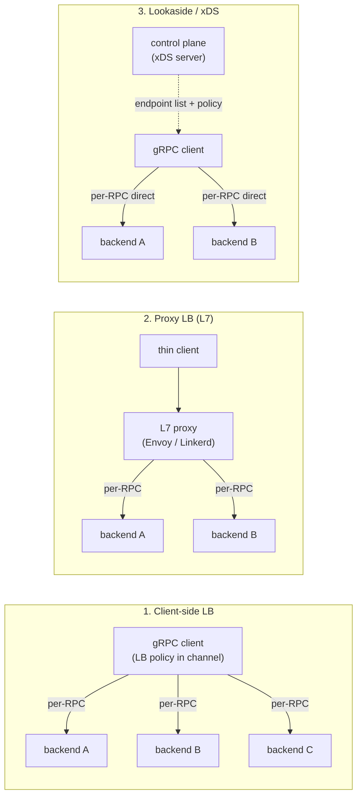
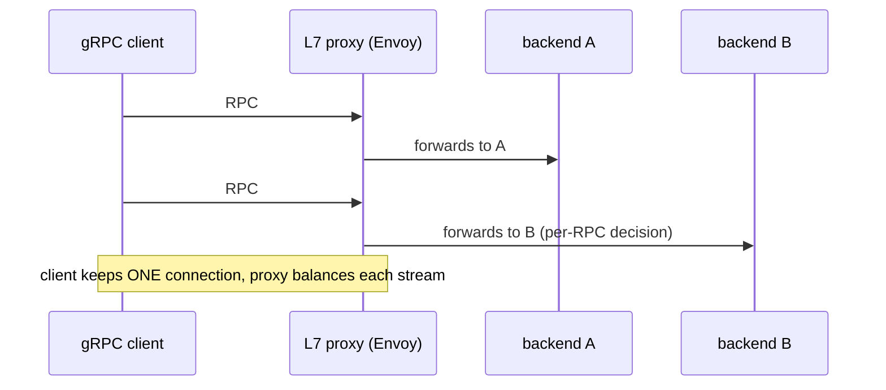
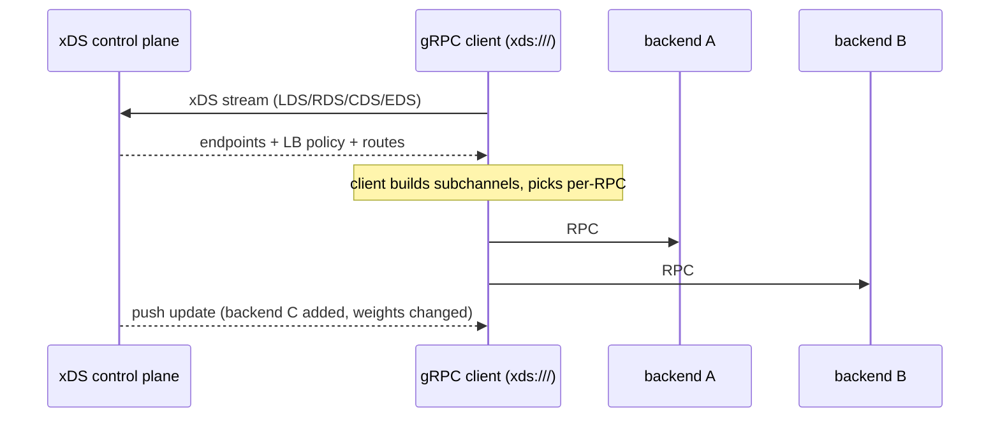
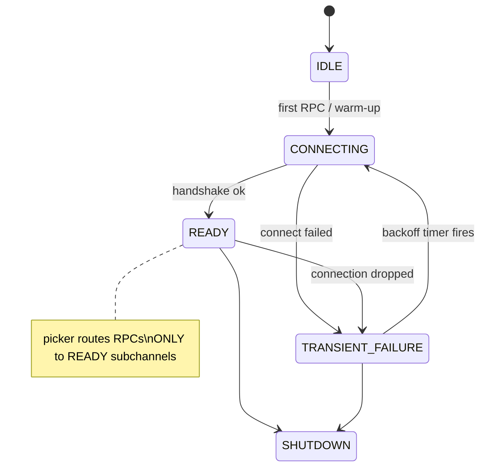

# Load Balancing & Service Discovery

Load balancing gRPC is *not* the same problem as load balancing REST behind an ELB, and the
reason is architectural: **gRPC runs over HTTP/2, and HTTP/2 multiplexes many concurrent,
often long-lived RPC streams over a single TCP connection.** A connection-level (L4) load
balancer distributes *connections*, so once a gRPC client opens one connection it pins
*all* of its traffic to whatever backend it landed on — new pods added to the fleet get no
traffic, and one hot client can hammer one server. gRPC therefore needs **request-level
(L7) balancing**, and it gives you three ways to get it: **client-side LB**, **proxy LB**,
and **lookaside / external LB (gRPC-LB → xDS)**. This page teaches the mechanism of each,
how gRPC resolves names to backends, the Kubernetes `ClusterIP` trap, and the modern xDS
direction.

> [!INTERVIEW]
> The senior one-liner: *"HTTP/2 multiplexes all RPCs onto one long-lived connection, so an
> L4 load balancer pins a client to a single backend — you get zero real balancing. You fix
> it three ways: client-side LB (the channel resolves all backends and its `round_robin`
> policy picks a subchannel per-RPC — fat client, no extra hop), a per-request L7 proxy like
> Envoy (thin client, one extra hop and a bottleneck to scale), or lookaside/xDS where a
> control plane streams the endpoint list and policy to the client (best of both, the
> service-mesh direction). In Kubernetes the classic trap is that a normal `ClusterIP`
> Service is L4/iptables, so it pins connections — use a **headless** Service so DNS returns
> all pod IPs and let `round_robin` balance, or run a mesh."*

The general *theory* of load balancing (algorithms, health checking, the LB taxonomy) is
owned by `reliability-ops` and `system-design`; service-mesh / xDS *architecture at scale*
is owned by `system-design`. HTTP/2 framing, multiplexing and flow control on the wire are
owned by `networking` (RFC 9113). Here we stay at the gRPC framework/protocol altitude:
what the **channel** does, how the **resolver** and **LB policy** cooperate, and what
crosses the wire.

## Why Load Balancing gRPC Is Hard

REST/HTTP-1.1 clients typically open a *new* connection (or grab a fresh one from a pool)
per request, so a plain L4 TCP load balancer naturally spreads requests across backends —
each connection is a fresh balancing decision. gRPC breaks that assumption in two ways:

1. **One connection, many RPCs.** HTTP/2 multiplexes concurrent RPCs as independent
   *streams* over a single TCP connection. A gRPC channel typically holds **one** connection
   (subchannel) to each backend and keeps it open. So an L4 balancer that hashes on the
   4-tuple sends every RPC on that connection to the *same* backend.
2. **Long-lived connections.** gRPC connections are sticky and reused for the life of the
   channel. New backends that come up *after* the connection is established receive no
   traffic until the client reconnects. Conversely a big client sticks to one server.

The consequence: **connection-level (L4) balancing does not balance gRPC request load.** You
must make the balancing decision at the **request / RPC level (L7)** — either in the client,
in a proxy that understands HTTP/2, or via a control plane that hands the client the backend
list. This single insight is the root of the entire topic.

> [!KEY-TAKEAWAY]
> HTTP/2 multiplexing + long-lived connections means L4/connection load balancing pins a
> gRPC client to one backend. gRPC needs **per-RPC (L7)** balancing. Everything else here is
> a way to achieve that.

## The Three Load-Balancing Models

There are exactly three places you can make the per-RPC decision. Interviewers love this
comparison.



| Model | Where the decision is made | Client | Extra hop? | Knows all backends via | Trade-off |
|---|---|---|---|---|---|
| **Client-side** | in the client's channel (LB policy) | fat | no | the resolver | fastest path, no bottleneck; but every client embeds LB logic and must see the full backend set — hard across languages/versions |
| **Proxy (L7)** | in a proxy that speaks HTTP/2 | thin | **yes** (one hop) | the proxy's own discovery | dead-simple client; centralised policy; but adds latency, a scaling/HA concern, and a second hop |
| **Lookaside / xDS** | client picks, control plane *tells* it the backends+policy | medium | no (data path direct) | a control plane over a streaming API | best of both — thin-ish client, direct data path, centralised control; but you must run the control plane |

> [!TIP]
> Mental model: **proxy** = balancing *in the data path*; **lookaside/xDS** = balancing
> logic *centralised* but the decision *executed in the client* so the data path stays
> direct. gRPC-LB was the original lookaside protocol; **xDS** is its modern successor.

## Client-Side Load Balancing (pick_first vs round_robin)

In client-side LB the **channel** does everything. Its two collaborating pieces:

- **Resolver** — turns the target name (e.g. `dns:///my-svc:50051`) into a list of
  addresses (plus optional service config). See *Name Resolution*.
- **LB policy** — given that address list, decides how to distribute RPCs. It creates a
  **subchannel** per backend (each subchannel owns one connection) and, for each RPC, its
  *picker* returns which subchannel to use.

The two built-in policies:

| Policy | Behaviour | Connections | Use when |
|---|---|---|---|
| **`pick_first`** (default) | tries the resolved addresses in order, uses the **first** that connects, sends **all** RPCs there | one | you actually want a single connection (e.g. talking through an L4 VIP/proxy that balances for you) |
| **`round_robin`** | connects to **all** resolved backends and rotates RPCs across the ready subchannels | one per backend | you have the real backend IPs and want the client to spread load |

`pick_first` is the default precisely *because* it is safe behind a proxy/VIP. To get real
client-side balancing you must (a) resolve to the **actual backend addresses** (not a single
VIP) and (b) select `round_robin`. In current gRPC this is done via **service config**, not
a magic prefix:

```json
{
  "loadBalancingConfig": [ { "round_robin": {} } ]
}
```

```go
// Go: set the default service config on the channel (client-side round_robin over DNS).
conn, err := grpc.NewClient(
    "dns:///my-svc.my-ns.svc.cluster.local:50051",
    grpc.WithDefaultServiceConfig(`{"loadBalancingConfig":[{"round_robin":{}}]}`),
    grpc.WithTransportCredentials(insecure.NewCredentials()),
)
```

> [!WARNING]
> The old `grpc.WithBalancerName("round_robin")` API and the `round_robin://` scheme are
> **deprecated/removed**. Configure the LB policy through **service config**
> (`loadBalancingConfig`), delivered either as the channel's *default* service config or via
> the resolver (e.g. DNS TXT / xDS). Don't cite the deprecated API in an interview.

**Trade-offs of client-side LB:** no extra network hop and no proxy to scale — but the
client must be able to *see every backend address*, embed the LB logic, and be updated when
policy changes. Across many languages and service versions that becomes an operational tax —
which is exactly what lookaside/xDS solves.

## Proxy Load Balancing (L7)

Here the client is dumb: it connects to a single stable address — an **L7 proxy** (Envoy,
Linkerd, HAProxy, nginx, or a cloud L7 LB) that terminates HTTP/2 and re-distributes each
RPC (each HTTP/2 stream) across backends.

- **Client side:** `pick_first` to the proxy VIP is fine — the client only ever needs one
  connection because the proxy does the real balancing.
- **Proxy side:** must be a *true L7 / HTTP-2-aware* balancer. It reads each request and can
  route per-RPC, retry, apply timeouts, do canary/traffic-split, and observe per-method
  metrics.



**Trade-offs:** the thinnest possible client (great for polyglot fleets and browsers via
gRPC-Web), centralised policy and observability — at the cost of an **extra hop** (latency +
another failure domain) and a component you must scale and keep highly available. A **service
mesh sidecar** (Envoy/Linkerd per pod) is proxy LB pushed to the edge of each workload; the
mesh's control plane is usually xDS. Mesh architecture is `system-design` territory.

## Lookaside and External Load Balancing (gRPC-LB, xDS)

Lookaside LB splits the concern: **a control plane decides *which* backends exist and *what*
policy applies; the client still makes the per-RPC pick and talks to backends directly**, so
the data path has no extra hop.

- **gRPC-LB** (the original, now legacy): the client opens a side channel to an *external
  balancer* which streams a list of backend addresses (a `BalanceLoad` streaming RPC). The
  client load-balances RPCs across those backends directly.
- **xDS** (the modern successor, CNCF direction): the client speaks the **xDS** APIs
  (LDS/RDS/CDS/EDS) to a control plane (e.g. Envoy's control plane, Istio, Traffic Director,
  gRPC's own xDS support). EDS streams the endpoint list; CDS/RDS carry cluster and routing
  config; the client applies weighted/locality-aware/least-request policies. Same protocol
  Envoy uses, so gRPC clients and Envoy proxies share one control plane — this is what makes
  **proxyless service mesh** possible.



You select xDS with the **`xds:///`** target scheme:

```go
conn, err := grpc.NewClient("xds:///my-service", /* creds, opts */)
```

**Trade-offs:** direct data path (no proxy hop) *and* centralised control (add backends,
shift weights, canary, locality routing — all pushed from the control plane, no client
redeploy). Cost: you must operate the control plane, and full xDS feature parity varies by
gRPC language/version. This is the CNCF-endorsed direction for large fleets.

## Name Resolution and Resolvers

Before any policy can balance, the channel must turn a **target string** into addresses. A
gRPC target is a URI: `scheme://authority/endpoint`. The **resolver** for that scheme
produces (1) a list of addresses and (2) an optional **service config**. Built-in schemes:

| Scheme | Resolver behaviour |
|---|---|
| `dns:///host:port` | queries DNS; returns **all A/AAAA records** as separate addresses; can read a service config from DNS TXT |
| `ipv4:` / `ipv6:` | a literal, comma-separated list of addresses (no lookup) |
| `unix:` | a Unix-domain socket path |
| `xds:///service` | resolves via the xDS control plane |
| *custom* | you can register your own (e.g. read from Consul/etcd/ZooKeeper) |

The key fact for balancing: **`dns:///` returns *all* the addresses behind the name**, so if
DNS gives back multiple IPs, `round_robin` can spread across them. If DNS returns a *single*
VIP, you're back to pinning. Hence the Kubernetes headless-service pattern below.

> [!WARNING]
> Plain DNS is a weak service-discovery mechanism. gRPC's DNS resolver is **event-driven,
> not periodic**: on the success path it does **not** re-resolve on a timer — it re-resolves
> only when a connection breaks or the LB policy requests it (a `ResolveNow` trigger). Even
> then a **minimum re-resolution interval** (grpc-go default **30s**, `MinResolutionInterval`)
> rate-limits how often it will actually re-query DNS, so bursts of triggers can't hammer the
> resolver. (Only on a resolution *error* does it retry on a schedule — exponential backoff.)
> It also honours the OS/library resolver, not necessarily per-record TTLs. So backends that
> scale up or churn fast may not be picked up promptly. For dynamic fleets use xDS or a custom
> resolver that watches your registry (Consul/etcd) and pushes updates.

## Kubernetes: Headless Services and the ClusterIP Gotcha

This is the single most common real-world gRPC LB question.

A normal Kubernetes **`ClusterIP`** Service gives you *one* virtual IP; kube-proxy programs
**iptables/IPVS (L4)** to DNAT connections to a random pod. Because it balances *connections*
and gRPC keeps *one long-lived connection*, **every RPC from a client pins to a single pod.**
New pods get no traffic; scaling out doesn't rebalance existing clients. Classic symptom:
"we scaled the deployment but load stayed on the old pods."

**Worked example — why the 7 new pods get exactly zero.** Start with **6 client pods**, each
opening **1** long-lived connection through the `ClusterIP` VIP to a backend of **3** pods.
kube-proxy DNATs each connection to a random pod at *connection-establishment time*; say the
6 connections land 3 / 2 / 1 across pods P1 / P2 / P3. Each client fires **100 RPC/s**, and
every RPC rides its one pinned connection — so:

- P1 = 3 conns × 100 = **300 RPC/s**, P2 = 2 × 100 = **200 RPC/s**, P3 = 1 × 100 = **100 RPC/s**.

Now scale the Deployment **3 → 10 pods**. DNAT only picks a backend when a *new* connection is
made; the 6 existing connections stay pinned to P1–P3. So the **7 new pods receive 0 RPC/s**,
and all **600 RPC/s** stay concentrated on the original 3. They only start getting traffic when
an existing connection breaks (pod restart, `GOAWAY`, keepalive death) and its client
reconnects — which is exactly "we scaled but load stayed on the old pods."

Contrast **headless + `round_robin`**: each of the 6 clients resolves *all 10 pod IPs*, opens a
subchannel to each, and rotates its 100 RPC/s across 10 subchannels = 10 RPC/s per subchannel.
Every pod then serves 6 clients × 10 = **60 RPC/s** (600 ÷ 10), and a new pod starts receiving
traffic as soon as re-resolution hands its IP to the policy. Even distribution, no idle pods.

Fixes:

1. **Headless Service + client-side `round_robin`.** Set `clusterIP: None`. Now the Service's
   DNS name resolves to the **individual pod IPs** (multiple A records) instead of one VIP.
   Point the client at `dns:///my-svc.ns.svc.cluster.local:port` with a `round_robin` service
   config, and the client connects to all pods and balances per-RPC.

   ```yaml
   apiVersion: v1
   kind: Service
   metadata:
     name: my-svc
   spec:
     clusterIP: None          # headless -> DNS returns all pod IPs
     selector: { app: my-svc }
     ports: [ { port: 50051, targetPort: 50051 } ]
   ```

2. **A service mesh** (Istio/Linkerd) — the sidecar (Envoy) does per-RPC L7 balancing, so a
   normal ClusterIP is fine; the mesh intercepts and rebalances.

3. **xDS** (`xds:///`) with a control plane feeding endpoints.

> [!KEY-TAKEAWAY]
> Default `ClusterIP` = L4 = pins gRPC. For gRPC in Kubernetes use a **headless Service +
> client-side `round_robin`**, or a **mesh/xDS**. This is a top interview trap.

Also mind DNS staleness: headless-service DNS + gRPC's infrequent re-resolution means fast
pod churn can leave clients talking to dead/missing pods until a connection breaks triggers
re-resolution. Meshes/xDS push updates and avoid this.

## Subchannels, Connectivity State and Keepalive

The channel builds one **subchannel** per backend address; a subchannel owns a single
HTTP/2 connection and has a **connectivity state**: `IDLE → CONNECTING → READY →
TRANSIENT_FAILURE → (back to CONNECTING) → SHUTDOWN`. The LB policy's *picker* only routes
RPCs to subchannels in **`READY`**. When a subchannel drops, the policy stops picking it,
retries connecting with **exponential backoff**, and re-resolves the name.



**Worked example — what the picker returns.** With `round_robin` over 3 subchannels in states
`{A:READY, B:TRANSIENT_FAILURE, C:READY}`, the picker's ready set is just **[A, C]** — B is
excluded. Successive RPCs rotate `A, C, A, C, …`; B gets **0** picks. Meanwhile B is retrying
with exponential backoff; the instant it transitions back to `READY` the picker is rebuilt and
the rotation becomes `A, B, C, A, B, C, …`. So a client with one failing backend keeps serving
at full availability on the survivors, with zero RPCs wasted on the dead subchannel.

**Keepalive** (gRFC A8, HTTP/2 PING) matters for balancing because a silently-dead
connection that never gets torn down keeps receiving picks that then fail. Client keepalive
sends periodic PINGs; if the peer doesn't ACK within the timeout, the subchannel is torn down
and the policy re-picks / re-resolves. Servers enforce a **minimum** ping interval
(`EnforcementPolicy` / `GRPC_ARG_HTTP2_MIN_RECV_PING_INTERVAL_WITHOUT_DATA`) and will send
`GOAWAY` + `ENHANCE_YOUR_CALM` to clients that ping too aggressively — a real production
gotcha when tuning keepalive.

```go
grpc.WithKeepaliveParams(keepalive.ClientParameters{
    Time:                10 * time.Second, // ping if idle this long
    Timeout:             3 * time.Second,  // wait this long for PING ACK
    PermitWithoutStream: true,             // ping even with no active RPCs
})
```

> [!WARNING]
> `PermitWithoutStream: true` + a short `Time` is a classic way to get your clients kicked
> with `GOAWAY (ENHANCE_YOUR_CALM, too_many_pings)`. Keep client keepalive ≥ the server's
> enforced minimum. Keepalive theory / TCP-level detail is `networking`.

**`GOAWAY` for graceful draining:** a server that is shutting down or being drained sends an
HTTP/2 `GOAWAY`; well-behaved clients finish in-flight RPCs on that connection and open a new
connection (re-resolving), which is how rolling deploys drain gRPC connections without
dropping requests. This connection-management detail is why long-lived-connection balancing
also needs graceful shutdown.

## Weighted and Least-Request Policies

`round_robin` treats every backend equally, which is wrong when backends have different
capacity or heterogeneous request costs. Richer policies (mostly delivered via xDS today):

| Policy | Idea | When |
|---|---|---|
| `round_robin` | equal rotation over ready subchannels | homogeneous backends, cheap default |
| `pick_first` | one backend, all RPCs | behind an L4 VIP/proxy that already balances |
| **weighted_round_robin** | rotate proportional to a weight, often derived from backend-reported load (ORCA/backend metrics) | heterogeneous capacity, or load-aware balancing |
| **least_request** | pick the ready backend with the fewest outstanding RPCs (often "power of two choices") | uneven per-request cost; smooths hot spots better than round-robin |
| **ring_hash / consistent hashing** | hash a request key to a backend for affinity | session/cache affinity (sticky by key) |

**Worked example — `weighted_round_robin` 3:1.** Two backends, A with weight 3 and B with
weight 1 (say A has 3× the CPU). The scheduler hands out picks in proportion 3:1, so over a
window of **8 RPCs** A should get 8 × 3/(3+1) = **6** and B should get 8 × 1/4 = **2**. A
smooth interleave (not "AAAAAAB B" in a burst) looks like:
`A B A A A B A A` — count them: 6 A's, 2 B's. Every 4-RPC cycle is `A B A A` (3:1), repeated
twice. If ORCA later reports B is overloaded and its weight drops to 0.5, the ratio becomes
3:0.5 = 6:1, so over 7 RPCs A gets 6 and B gets 1 — traffic bled away from the hot pod without
any redeploy.

**Worked example — `least_request` / power-of-two-choices (P2C).** Four ready backends with
outstanding-RPC counts `{A:5, B:2, C:9, D:3}`. Plain `least_request` would scan all four and
pick B (min = 2), but that requires reading every backend's counter on every pick and tends to
*herd* — many clients simultaneously spot the same idle backend and stampede it. **P2C** instead
samples **2 backends at random** and routes to the lesser of the two. Say this pick samples
{C:9, D:3} → route to **D** (3 < 9). D's outstanding count becomes 4. The next pick might sample
{A:5, B:2} → route to **B**. P2C never picks the global worst (C:9 only loses whenever it's
sampled against someone lower), needs only 2 reads per pick, and avoids the herd — while still
beating plain `round_robin`, which would blindly send the next RPC to C:9 regardless of load.
This matters most when request *cost* is uneven (one slow RPC leaves a high outstanding count
that steers new work elsewhere).

**Worked example — `ring_hash` (consistent hashing).** Place backends on a hash ring by hashing
their IDs onto a 0–(2³²−1) circle, e.g. A@1000, B@2500, C@3900 (positions illustrative). To
route a request, hash its key (say `user_id`) and walk **clockwise** to the first backend at or
past that position. `hash(user=42)=1500` → next node clockwise is **B@2500**; `hash(user=7)=3000`
→ **C@3900**; `hash(user=99)=4200` wraps past the top → **A@1000**. Same user always lands on the
same backend → cache/session affinity. Now backend **B leaves**: only keys that mapped to B's arc
(the range 1000–2500, i.e. user=42) move — they shift clockwise to C. Keys for A and C are
untouched. Only ~**1/N** of keys remap (here ~1/3), versus a plain `hash(key) % N` scheme where
changing N reshuffles nearly *every* key. (Real rings use many virtual nodes per backend so the
arcs are evenly sized.)

**ORCA (Open Request Cost Aggregation)** lets a backend report its real load (CPU, queue
depth, custom metrics) back to the client, so `weighted_round_robin` can bias away from
overloaded pods — moving client-side LB from blind rotation toward *load-aware* balancing.
Distribution-algorithm theory (P2C, consistent hashing) is `reliability-ops`/`system-design`;
here just know gRPC/xDS exposes these as pluggable LB policies.

## xDS-Based Load Balancing (the CNCF direction)

xDS deserves its own note because it is where gRPC LB is heading. The client, addressed via
`xds:///target`, becomes a **first-class xDS client** and pulls its entire dataplane config
from a control plane over gRPC streams:

- **LDS** (Listener) — what the client is connecting to.
- **RDS** (Route) — routing rules: match on path/headers, split traffic (canary/A-B),
  per-route timeouts and retries.
- **CDS** (Cluster) — the logical backend group + its LB policy (round_robin,
  weighted, ring_hash…).
- **EDS** (Endpoint) — the actual endpoint addresses, with **weights** and **locality**
  (region/zone) for locality-aware balancing and priority failover.

Because this is the *same* API surface Envoy consumes, one control plane (Istio, Traffic
Director/Cloud Service Mesh, or any Envoy control plane) can drive **both** sidecar proxies
and **proxyless** gRPC clients. Benefits: dynamic endpoint updates with no redeploy, weighted
canaries, locality/zone-aware routing, circuit-breaking and outlier detection pushed from the
control plane. Cost/caveat: you operate a control plane, and xDS feature coverage differs
across gRPC languages/versions — verify before promising a feature. Mesh architecture at
scale is owned by `system-design`.

## Common Interview Follow-ups

- **"Why can't I just put my gRPC service behind an AWS NLB / L4 load balancer?"** Because
  it's connection-level: HTTP/2 multiplexes all RPCs on one long-lived connection, so the NLB
  pins a client to one backend. Use an L7 (ALB with HTTP/2, Envoy) or client-side/xDS LB.
- **"You scaled a Kubernetes gRPC Deployment from 3 to 10 pods but load stayed on 3. Why?"**
  A normal `ClusterIP` is L4 and existing long-lived connections stay pinned. Use a headless
  Service + `round_robin`, or a mesh; existing clients only rebalance on re-resolution
  (connection break, GOAWAY).
- **"Client-side vs proxy vs lookaside — pick one for a large polyglot fleet."** Lookaside/
  xDS: centralised control + direct data path, and it works across languages via one control
  plane; pure client-side LB forces every language/version to embed matching LB logic.
- **"Default LB policy? How to switch to round_robin?"** `pick_first`. Switch via **service
  config** `loadBalancingConfig: [{round_robin:{}}]` (default service config or resolver-
  delivered), *and* resolve to real backend IPs (e.g. `dns:///` to a headless service) — not
  a single VIP.
- **"How does the client find out a new backend appeared?"** The resolver re-resolves when
  triggered (connection failure / LB request), rate-limited by its minimum re-resolution
  interval (grpc-go default ~30s) rather than on a fixed poll, and hands the new address list
  to the LB policy, which creates a subchannel; xDS/mesh instead *push* updates.
- **"How do you drain a gRPC backend during a deploy without dropping RPCs?"** Server sends
  HTTP/2 `GOAWAY`; clients finish in-flight RPCs, then reconnect/re-resolve to other backends.
- **"What is `pick_first` good for if it doesn't balance?"** It's correct when something
  *else* (an L7 proxy/VIP or mesh sidecar) already balances, or you genuinely want a single
  connection. It's the safe default that never accidentally fans out to a VIP's members.
- **"gRPC-LB vs xDS?"** gRPC-LB is the legacy lookaside protocol (side channel streaming
  backend lists); xDS is its richer, Envoy-compatible successor and the current direction.
- **"How does weighted/load-aware balancing get load info?"** ORCA lets backends report load
  (via trailers/out-of-band metrics) so `weighted_round_robin` biases away from hot pods.

## References

- gRPC docs — *Load Balancing* (concept guide): https://grpc.io/docs/guides/custom-load-balancing/ and the load-balancing design doc `grpc/grpc/blob/master/doc/load-balancing.md`
- gRPC blog — *gRPC Load Balancing*: https://grpc.io/blog/grpc-load-balancing/
- gRPC docs — *Name Resolution* design: `grpc/grpc/blob/master/doc/naming.md`
- grpc-go DNS resolver — event-driven re-resolution + `MinResolutionInterval` (30s default): `grpc/grpc-go/blob/master/internal/resolver/dns/dns_resolver.go`
- gRPC docs — *Service Config* & `loadBalancingConfig`: `grpc/grpc/blob/master/doc/service_config.md`
- gRFC A6 — client retries; gRFC A8 — client-side keepalive; gRFC A27/A28/A30/A31 — xDS support in gRPC (see `grpc/proposal`)
- gRPC docs — *gRPC xDS features* and proxyless service mesh: https://grpc.io/docs/guides/xds/
- Envoy / xDS protocol (LDS/RDS/CDS/EDS): https://www.envoyproxy.io/docs/envoy/latest/api-docs/xds_protocol
- ORCA — Open Request Cost Aggregation (gRFC A51)
- Kubernetes — *Headless Services*: https://kubernetes.io/docs/concepts/services-networking/service/#headless-services
- RFC 9113 — HTTP/2 (multiplexing, streams, GOAWAY) — see `networking`
- Cross-references: `reliability-ops` (LB theory, retries/backoff), `system-design` (service mesh, xDS at scale), `networking` (HTTP/2 & TLS), `grpc/security-tls-mtls-authentication` (mTLS/credentials), `grpc/channels-stubs-client-server-lifecycle` (channel & subchannel lifecycle)
