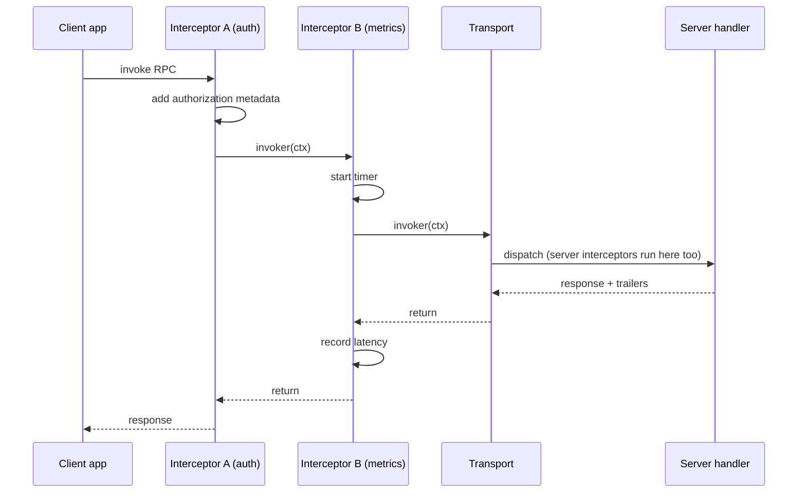
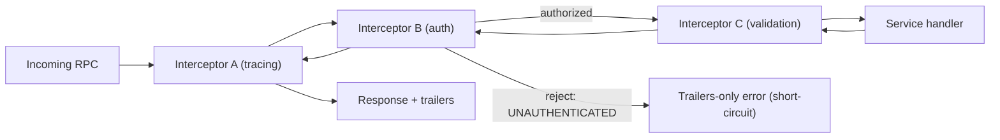

# Metadata, Headers & Interceptors

Every gRPC call can carry **metadata** — key/value pairs, conceptually like HTTP
headers — alongside the actual protobuf message, and every call can be wrapped by
**interceptors**, gRPC's middleware layer. Together they are how cross-cutting
concerns (auth, tracing, logging, request IDs, deadlines, error mapping) ride along
with an RPC without polluting the business `.proto` or the service method signatures.

This page covers what metadata *is* on the HTTP/2 wire (initial headers vs trailers,
ASCII vs binary keys, reserved keys), how you read/write it, and how interceptors wrap
the client invoker and the server handler, chain in order, and short-circuit.

> [!INTERVIEW]
> The single most common precision question here: "How does a gRPC server return the
> status code, and where on the wire does it live?" Answer: in the **trailing
> metadata** (HTTP/2 trailers) as the `grpc-status` header — *not* in the initial
> response headers. This is a core reason gRPC requires HTTP/2, which supports
> trailers; HTTP/1.1 does not carry them reliably.

The full HTTP/2 framing, HPACK header compression, and stream mechanics live in
`networking` (see `networking/http2`); TLS internals live in `networking`/`security`.
Here we stay at the gRPC altitude: what gRPC *puts* in those headers/trailers and why.
The general resilience theory (retries, circuit breakers) lives in `reliability-ops`;
OTel/tracing tooling lives in `observability`. This page teaches the gRPC-specific
mechanics and cross-references those.

## What Is Metadata

**Metadata** is a list of key/value pairs sent with an RPC, out-of-band from the
message body. It is the gRPC analogue of HTTP headers, and on the wire it literally
*is* HTTP/2 headers. Metadata is for information *about* the call; the protobuf
message is the call's payload.

There are three distinct places metadata appears in one RPC:

| Kind | Direction | Sent when | HTTP/2 carrier | Typical use |
|---|---|---|---|---|
| **Request (initial) metadata** | client → server | before the first request message | HEADERS frame that opens the stream | auth token, request-id, tracing context, `grpc-timeout` |
| **Response initial metadata** | server → client | before the first response message | HEADERS frame | server version, custom response headers |
| **Trailing metadata (trailers)** | server → client | after the last response message | trailing HEADERS frame (with END_STREAM) | `grpc-status`, `grpc-message`, per-call stats/metrics |

The key insight: request/response *headers* are sent **before** the message, so they
must be known up front. **Trailers** are sent **after** the message(s), so they can
carry things you only know at the end — most importantly the final status.

> [!KEY-TAKEAWAY]
> Metadata is not part of your protobuf contract. It never appears in the `.proto`.
> It is a parallel, string-keyed channel for call-scoped context. If a value is truly
> part of the domain response, put it in the message; if it is cross-cutting context,
> use metadata.

## Metadata Key Rules

Metadata keys and values follow strict rules derived from the HTTP/2 header model and
the gRPC wire spec:

- **Keys are ASCII strings**, case-**insensitive**, and are normalized to
  **lowercase** on the wire. `Request-Id` and `request-id` are the same key. Allowed
  characters are the HTTP token set: letters, digits, and `-_.`.
- **Values come in two flavors:**
  - **ASCII (text) values** — printable ASCII (`0x20`–`0x7E`). No newlines. The key
    is the plain name, e.g. `authorization: Bearer abc`.
  - **Binary values** — the key MUST end with the suffix **`-bin`**. The value is
    arbitrary bytes and is **base64-encoded on the wire** (padding may be omitted by
    the sender; receivers must accept both). Your gRPC library encodes/decodes
    transparently — you hand it raw bytes, it emits base64. Example:
    `grpc-status-details-bin`, `trace-context-bin`.
- **Reserved keys you cannot set:**
  - Keys beginning with **`grpc-`** are reserved for the gRPC framework
    (`grpc-timeout`, `grpc-status`, `grpc-message`, `grpc-encoding`,
    `grpc-status-details-bin`, `grpc-accept-encoding`, …). Applications must not set
    these; libraries reject or ignore attempts.
  - HTTP/2 **pseudo-headers** starting with `:` (`:method`, `:scheme`, `:path`,
    `:authority`, `:status`) are reserved by HTTP/2 itself and managed by the
    transport.
  - Other transport-managed headers: `content-type` (must be
    `application/grpc[+proto|+json]`), `te: trailers`, `user-agent`.

```text
# On the wire (initial HEADERS), a gRPC unary request looks like:
:method = POST
:scheme = https
:path = /helloworld.Greeter/SayHello
:authority = api.example.com
content-type = application/grpc+proto
te = trailers
grpc-timeout = 100m                 # 100 milliseconds (deadline)
grpc-encoding = gzip
authorization = Bearer eyJhbGci...  # <-- application metadata
request-id = 7f3a...                # <-- application metadata
trace-bin = <base64>                # <-- binary application metadata (-bin)
```

> [!WARNING]
> A frequent bug: putting binary data in a non-`-bin` key. Values that aren't valid
> printable ASCII in a plain key produce corrupted or rejected headers. Any non-text
> value (a protobuf, raw bytes, a compressed blob) must use a `-bin` key so the
> library base64-encodes it.

## Request (Initial) Metadata

Request metadata is attached by the client and sent in the **HEADERS frame that opens
the HTTP/2 stream**, before the request message DATA frame(s). Because it precedes the
payload, it's available to the server *before* it reads any request message — which is
exactly why auth and routing decisions can be made from metadata alone.

```go
// Go client: attach metadata to the outgoing context.
md := metadata.Pairs(
    "authorization", "Bearer "+token,
    "request-id", reqID,
)
ctx := metadata.NewOutgoingContext(context.Background(), md)
resp, err := client.SayHello(ctx, &pb.HelloRequest{Name: "Ada"})
```

```go
// Go server: read incoming metadata from the context.
func (s *server) SayHello(ctx context.Context, in *pb.HelloRequest) (*pb.HelloReply, error) {
    md, ok := metadata.FromIncomingContext(ctx)
    if ok {
        if vals := md.Get("authorization"); len(vals) > 0 { /* verify token */ }
    }
    ...
}
```

A single key may have **multiple values** (metadata is a multimap, like HTTP headers);
`md.Get(key)` returns a slice. On the wire, multiple values become multiple header
lines or a comma-joined value depending on the header.

> [!TIP]
> For streaming RPCs, request metadata is still sent once, when the stream opens — you
> cannot add initial metadata after the first message. If you need per-message context
> mid-stream, put it in the message itself.

## Response Initial Metadata and Trailing Metadata

The server can send metadata back in two phases:

1. **Initial (header) metadata** — sent in a HEADERS frame *before* the first response
   message. Once the server writes its first response message (or explicitly flushes
   headers), the initial metadata is **frozen** and sent; you can't add to it after.
2. **Trailing metadata (trailers)** — sent in a HEADERS frame *after* all response
   messages, carrying `END_STREAM`. This always carries the final `grpc-status` and
   optional `grpc-message`, plus any application trailers (e.g., server-side timing,
   retry hints, cost metrics).

```go
// Go server: set header (initial) metadata and trailer metadata.
func (s *server) SayHello(ctx context.Context, in *pb.HelloRequest) (*pb.HelloReply, error) {
    header := metadata.Pairs("server-version", "1.4.2")
    grpc.SendHeader(ctx, header)             // flushes initial metadata now
    grpc.SetTrailer(ctx, metadata.Pairs("elapsed-ms", "12")) // sent at the end
    return &pb.HelloReply{Message: "hi"}, nil
}
```

```go
// Go client: capture header + trailer via CallOptions.
var header, trailer metadata.MD
resp, err := client.SayHello(ctx, req,
    grpc.Header(&header), grpc.Trailer(&trailer))
```

**Trailers-only response.** When a server fails an RPC *immediately* — before sending
any initial metadata or message (e.g., the method doesn't exist, or an interceptor
rejects auth) — gRPC sends a single **Trailers-Only** HEADERS frame that combines the
HTTP status and the `grpc-status`/`grpc-message` in one frame with END_STREAM. This is
an important wire detail: an error path often produces *no* initial headers at all,
just trailers.

> [!KEY-TAKEAWAY]
> The status code always travels in the **trailers**, even on success (`grpc-status:
> 0`). This lets a server stream data and *then* report failure partway through — the
> status isn't decided until the stream ends. HTTP-level `:status` is almost always
> `200` for a gRPC call regardless of the gRPC status; the *real* result is
> `grpc-status`. See `error-handling-and-status-codes` for the status model and
> `grpc-status-details-bin` (the base64 `google.rpc.Status` for rich errors).

## Common Uses of Metadata

Metadata is the standard vehicle for call-scoped, cross-cutting context:

| Use | Typical key(s) | Notes |
|---|---|---|
| **Authentication** | `authorization: Bearer <jwt>` | Bearer/OAuth tokens; validated by a server interceptor. See `security-tls-mtls-authentication`. |
| **Distributed tracing** | `traceparent`, `tracestate`, `grpc-trace-bin` | W3C Trace Context or the binary gRPC census key. Propagated by tracing interceptors. See `observability`. |
| **Request correlation** | `request-id`, `x-request-id` | Ties logs across services. |
| **API/schema versioning** | `api-version` | Route or gate behavior by client version. |
| **Client identity / tenancy** | `x-tenant-id`, `x-client-id` | Multi-tenant routing. |
| **Deadline** | `grpc-timeout` | *Reserved* — set by the framework from the call deadline, never by you. See `deadlines-timeouts-cancellation`. |
| **Compression** | `grpc-encoding`, `grpc-accept-encoding` | *Reserved* — managed by the framework. |

> [!WARNING]
> Metadata is **not encrypted by metadata itself** — it's protected only by the
> transport (TLS). Never rely on metadata for confidentiality without TLS. Also,
> intermediaries (proxies, meshes) can read and log headers, so avoid putting secrets
> in metadata beyond the auth token the server needs.

## Reading and Writing Metadata Across Languages

The concept is identical everywhere; the API differs:

- **Go** — metadata rides on `context.Context`. Outgoing:
  `metadata.NewOutgoingContext`; incoming on the server:
  `metadata.FromIncomingContext`. Server header/trailer: `grpc.SendHeader` /
  `grpc.SetHeader` / `grpc.SetTrailer`.
- **Java** — `io.grpc.Metadata` with typed `Metadata.Key.of(name, ASCII_STRING_MARSHALLER)`
  or `BINARY_BYTE_MARSHALLER` (for `-bin` keys). Attached via a `ClientInterceptor`
  through `CallOptions`/headers, read in a `ServerInterceptor` or via
  `Contexts`/`ServerCall`.
- **Python** — metadata is a list/tuple of `(key, value)` pairs passed as the
  `metadata=` argument; the server reads `context.invocation_metadata()` and sets
  `context.set_trailing_metadata(...)`.

```java
// Java: a typed metadata key and reading it in a ServerInterceptor.
static final Metadata.Key<String> AUTH =
    Metadata.Key.of("authorization", Metadata.ASCII_STRING_MARSHALLER);
static final Metadata.Key<byte[]> TRACE =
    Metadata.Key.of("trace-bin", Metadata.BINARY_BYTE_MARSHALLER); // -bin => binary marshaller
```

## What Interceptors Are

An **interceptor** is gRPC's middleware: a function/object that sits between the
transport and your application code and can observe or modify every RPC — inspect and
mutate metadata, measure timing, log, authenticate, retry, map errors, or short-circuit
the call. Interceptors let you implement cross-cutting concerns **once** instead of in
every method.

There are two sides and two shapes, giving **four interceptor types**:

| | Unary | Streaming |
|---|---|---|
| **Client** | wraps the *invoker* of a unary call | wraps creation of the client stream |
| **Server** | wraps the *handler* of a unary call | wraps the server stream handler |

An interceptor is fundamentally a **wrapper**: it receives the "next" thing to call
(on the client, the *invoker*; on the server, the *handler*) and decides whether/when
to call it, what to pass, and how to treat what comes back.

```go
// Go: a server-side unary interceptor signature.
func loggingUnary(
    ctx context.Context,
    req any,
    info *grpc.UnaryServerInfo,       // which method is being called
    handler grpc.UnaryHandler,        // the "next"/real handler
) (any, error) {
    start := time.Now()
    resp, err := handler(ctx, req)    // call downstream; skip this to short-circuit
    log.Printf("%s took %s err=%v", info.FullMethod, time.Since(start), err)
    return resp, err
}
// Register: grpc.NewServer(grpc.UnaryInterceptor(loggingUnary))
```

## Client-Side vs Server-Side Interceptors

**Client interceptors** wrap the outbound call. A **unary client interceptor** receives
the method, request, reply, the `ClientConn`, and the `invoker` (the "next" that
actually sends the RPC); it can add outgoing metadata, then call `invoker(...)`, then
inspect the response/trailers. A **streaming client interceptor** wraps the creation of
the `ClientStream`, letting you wrap `SendMsg`/`RecvMsg` to observe each message.

**Server interceptors** wrap the inbound handling. A **unary server interceptor**
receives the context, decoded request, `UnaryServerInfo` (the full method name), and
the `handler`; it can authenticate from incoming metadata, then call `handler(...)`, or
reject early. A **streaming server interceptor** wraps the `ServerStream`.

```go
// Go: a client-side unary interceptor that injects an auth token.
func authClient(ctx context.Context, method string, req, reply any,
    cc *grpc.ClientConn, invoker grpc.UnaryInvoker, opts ...grpc.CallOption) error {
    ctx = metadata.AppendToOutgoingContext(ctx, "authorization", "Bearer "+token())
    return invoker(ctx, method, req, reply, cc, opts...)
}
```

## How an Interceptor Wraps the Handler/Invoker

The mechanism is the same **decorator/onion** pattern used by HTTP middleware, but
with gRPC's two "next" abstractions:

- On the **server**, the "next" is the `handler` — ultimately your service method.
- On the **client**, the "next" is the `invoker` (unary) or the streamer that produces
  the `ClientStream`.

Each interceptor gets a reference to the next layer and is free to:

1. **Do work before** calling next (e.g., read/validate metadata, start a timer, open
   a tracing span).
2. **Call next** — with a possibly-modified context/metadata/request.
3. **Do work after** next returns (e.g., record latency, close the span, map an error
   to a `status.Status`).
4. **Not call next at all** — short-circuit and return its own response/error.

For **streaming** interceptors the "before/after" model differs: the interceptor runs
once at stream *setup*, and to observe individual messages it must **wrap the stream
object** and intercept `SendMsg`/`RecvMsg`. A common gotcha: putting per-message logic
in a streaming interceptor's top-level body — that runs only once, not per message.



## Interceptor Chaining, Ordering and Short-Circuiting

You usually install **several** interceptors. They form a chain, executed as nested
wrappers (an "onion"): the outermost interceptor runs first on the way in and last on
the way out.

- **Go** — `grpc.ChainUnaryInterceptor(a, b, c)` and
  `grpc.ChainStreamInterceptor(...)`. The **first argument is the outermost**: order in
  is `a → b → c → handler`; order out is `handler → c → b → a`. (Historically Go
  allowed only one interceptor; chaining helpers were added and later folded into the
  core API.)
- **Java** — `ServerInterceptors.intercept(service, i1, i2, ...)`. Be careful:
  interceptors are applied so that the *last* one listed ends up **outermost** (Java
  wraps in reverse), which trips people up — verify order with a test. Client side uses
  `ClientInterceptors.intercept(channel, ...)`.

**Ordering matters** because interceptors depend on each other's effects. Canonical
server order: **auth → logging/tracing → metrics → validation → handler**. Tracing
should be outer so it spans everything; auth should reject before you spend work; a
request-id interceptor must run before logging so logs carry the ID.

**Short-circuiting**: an interceptor that returns without calling `handler`/`invoker`
stops the chain — inner interceptors and the handler never run. This is exactly how an
auth interceptor rejects an unauthenticated call with `UNAUTHENTICATED` before any
business logic executes, producing a Trailers-Only error response.



> [!WARNING]
> Order-sensitivity bug: registering a metrics/logging interceptor *outside* an
> error-mapping interceptor means it records the raw internal error, not the mapped
> `status.Status` the client sees. Put error mapping where it observes the final
> status, and know which end (in vs out) each interceptor cares about.

## Interceptor Use Cases

Interceptors are where nearly all production gRPC plumbing lives:

- **Authentication / authorization** — read `authorization` from metadata, verify the
  token, reject with `UNAUTHENTICATED`/`PERMISSION_DENIED`. (Cross-ref
  `security-tls-mtls-authentication`.)
- **Logging & access logs** — method, latency, status, peer.
- **Metrics** — per-RPC count/latency/error histograms (e.g., the gRPC Prometheus
  interceptors). Cross-ref `observability`.
- **Distributed tracing** — start/propagate spans, inject/extract trace context in
  metadata (OTel gRPC instrumentation). Cross-ref `observability`.
- **Retries / hedging** — client-side retry logic (though the built-in **service-config
  retry policy** per gRFC A6 is usually preferred over a custom interceptor). Cross-ref
  `retries-resiliency-and-deadline-propagation`.
- **Request validation** — reject malformed requests with `INVALID_ARGUMENT` before the
  handler.
- **Error mapping / panic recovery** — convert internal errors/panics into clean
  `status.Status` codes and details.
- **Rate limiting / quota** — reject with `RESOURCE_EXHAUSTED`.
- **Context propagation** — copy request-id/tenant/deadline downstream.

## Interceptors vs Filters (and Proxy-Level Middleware)

"Interceptor" isn't the only extension point, and interviews probe the distinction:

- **Interceptors** are **per-RPC**, application-layer, and see decoded
  requests/responses and metadata. They're the right place for auth, validation,
  tracing, error mapping.
- **Filters / transport-level hooks** operate lower down. In grpc-java a
  `ServerTransportFilter` fires on **transport (connection) lifecycle** events
  (connection established/terminated), not per RPC — good for connection-level auth
  (e.g., reading the peer's mTLS cert once per connection). In Go, `stats.Handler` is a
  connection/RPC **stats** hook used for low-overhead tracing/metrics that doesn't need
  to modify the call.
- **Proxy/mesh filters** (Envoy HTTP filters, service-mesh policy) run **outside your
  process** entirely, at the sidecar. They enforce org-wide policy (mTLS, authz, rate
  limits) transparently. Cross-ref `system-design` for mesh/xDS architecture.

Rule of thumb: use an **interceptor** when you need the decoded message or per-RPC
metadata inside your service; use a **transport filter** for connection-scoped concerns;
push it to a **mesh filter** when the policy should apply uniformly regardless of
language or service.

## Per-Call Credentials via Metadata (CallCredentials)

gRPC separates two credential types, and the distinction is a classic interview point:

- **Channel (transport) credentials** — establish the secure channel: TLS/mTLS. Set
  once per channel. (`grpc.WithTransportCredentials(...)` / `TlsChannelCredentials`.)
- **Call credentials (`CallCredentials`)** — per-RPC credentials that are **applied as
  metadata on every call**, typically an OAuth2/JWT `authorization` header. gRPC calls
  the credential's "get metadata" hook before each RPC, so tokens can be refreshed
  automatically.

`CallCredentials` are the framework-blessed way to inject auth metadata — cleaner than
a hand-written interceptor because the library manages refresh and per-call
application. You can **compose** channel + call credentials
(`grpc.CompositeChannelCredentials` / `CallCredentials.compose`).

> [!WARNING]
> By default, **`CallCredentials` require a secure (TLS) transport** and are dropped/
> rejected on a plaintext channel — because sending a bearer token over cleartext would
> leak it. You must explicitly opt in (`grpc.WithInsecure`-style call-cred override) to
> send per-call creds without TLS, which you should essentially never do in production.

```go
// Go: attach per-RPC OAuth token as CallCredentials over TLS.
creds := oauth.TokenSource{TokenSource: oauth2.StaticTokenSource(tok)}
conn, _ := grpc.NewClient("api.example.com:443",
    grpc.WithTransportCredentials(credentials.NewTLS(tlsCfg)), // channel creds
    grpc.WithPerRPCCredentials(creds),                          // call creds -> metadata
)
```

## Common Interview Follow-ups

- **"Where does the gRPC status code live on the wire?"** In the **trailing metadata**
  (`grpc-status` in HTTP/2 trailers), not in initial headers — even for success
  (`grpc-status: 0`). This is why gRPC needs HTTP/2 trailers.
- **"How do you send binary metadata?"** Use a key ending in `-bin`; the library
  base64-encodes the bytes on the wire and decodes them on receipt.
- **"Why can't I add response headers after writing a message?"** Initial metadata is
  flushed and frozen when the first message (or an explicit header send) goes out;
  after that only *trailers* can carry more metadata.
- **"What's a Trailers-Only response?"** A failure so early it never sent initial
  headers/message — gRPC combines HTTP status + `grpc-status`/`grpc-message` into a
  single trailers HEADERS frame with END_STREAM.
- **"Interceptor vs CallCredentials for auth tokens?"** `CallCredentials` is the
  built-in, refresh-aware way to inject the `authorization` header per call; a custom
  client interceptor works but you own token refresh. Server-side verification is a
  server interceptor.
- **"How do interceptors chain and short-circuit?"** They nest like an onion (first
  registered = outermost in Go's `ChainUnaryInterceptor`); any interceptor that returns
  without calling the handler/invoker short-circuits the rest.
- **"Why is my streaming interceptor code only running once?"** The interceptor body
  runs at stream setup; per-message logic must wrap `SendMsg`/`RecvMsg` on the stream
  object.
- **"Can I set `grpc-timeout` or `grpc-encoding` myself?"** No — `grpc-*` keys are
  reserved; the framework manages them (from the deadline and compression config).
- **"Interceptor vs mesh filter?"** Interceptor = in-process, per-RPC, sees decoded
  messages; mesh/Envoy filter = out-of-process sidecar, language-agnostic org policy.

## References

- gRPC Docs — Core concepts: Metadata (grpc.io/docs/what-is-grpc/core-concepts/#metadata)
- gRPC Docs — Authentication (CallCredentials/ChannelCredentials) (grpc.io/docs/guides/auth/)
- gRPC Docs — Interceptors guides (Go/Java/Python) (grpc.io/docs/guides/)
- gRPC over HTTP/2 wire spec — request/response headers, trailers, `-bin` keys, reserved `grpc-*` (github.com/grpc/grpc/blob/master/doc/PROTOCOL-HTTP2.md)
- gRFC A6 — client retries (service config), A8 — client-side keepalive (github.com/grpc/proposal)
- HTTP/2 RFC 9113 — HEADERS frames, trailers, HPACK, pseudo-headers
- W3C Trace Context — `traceparent`/`tracestate` propagation
- Cross-references: `networking/http2` (HTTP/2 wire), `security-tls-mtls-authentication`, `observability` (tracing/metrics), `error-handling-and-status-codes`, `deadlines-timeouts-cancellation`, `retries-resiliency-and-deadline-propagation`, `system-design` (service mesh)
