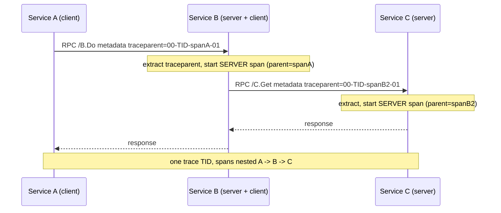
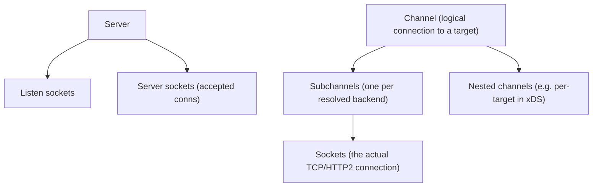
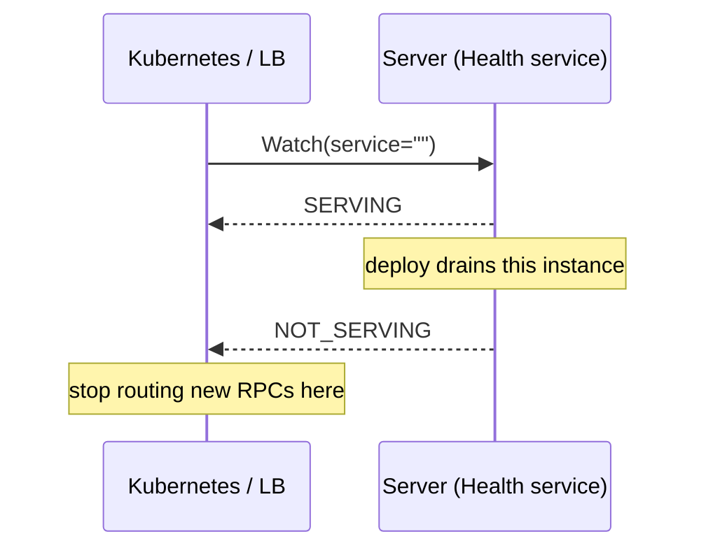
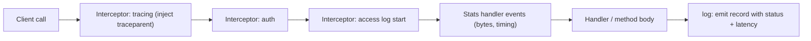

# Observability: Logging, Metrics & Tracing

Observability for gRPC means being able to answer, from the outside, "what is every
RPC doing, how long is it taking, is it succeeding, and how does one call relate to
the downstream calls it triggered?" The three classic signals map cleanly onto gRPC:

- **Metrics** — aggregate counters/histograms per method and status code (call rate,
  error rate, latency, message sizes, in-flight RPCs). These are the **RED** (Rate,
  Errors, Duration) numbers you alarm on for request-driven services; **USE**
  (Utilization, Saturation, Errors) is the resource-side counterpart.
- **Traces** — a span per RPC, stitched parent→child across services by propagating
  trace context **in request metadata**. Answers "where did the latency go" and "what
  fanned out from this request."
- **Logs** — per-RPC access logs (method, peer, `grpc-status`, latency) emitted by
  interceptors, plus structured application logs correlated by trace/span IDs.

gRPC's advantage over ad-hoc HTTP instrumentation is that the framework gives you
**uniform hooks**: interceptors wrap every call, metadata carries context transparently,
and the runtime already knows the method name, status code, and timing. On top of those
hooks gRPC ships built-in introspection services — **channelz** (live channel/socket
stats), the **health checking** service, and **server reflection** — that make a running
process debuggable without redeploying.

> [!INTERVIEW]
> The most common precision question: "How does distributed tracing context travel
> between gRPC services?" Answer: it rides in **request metadata** (HTTP/2 HEADERS),
> typically as the W3C `traceparent`/`tracestate` headers. A client interceptor
> *injects* the current span context into outgoing metadata, a server interceptor
> *extracts* it and starts a child span. gRPC does not put trace context in the
> protobuf message — it uses the same metadata channel that carries `grpc-timeout`,
> auth tokens, and `grpc-status`.

The platform depth for metrics/traces/logs (OpenTelemetry SDK internals, collectors,
backends, sampling strategy, dashboards) lives in `observability`. HTTP/2 framing and
HPACK live in `networking`; the resilience theory behind the numbers you watch lives in
`reliability-ops`; service-mesh telemetry lives in `system-design`. This page teaches
the **gRPC-specific hooks** and cross-references those.

## The Three Signals in a gRPC Context

Each signal answers a different question and is collected through a different gRPC
mechanism. Knowing which mechanism produces which signal is the framing for the whole
topic.

| Signal | Question it answers | gRPC mechanism | Cardinality / cost |
|---|---|---|---|
| **Metrics** | How many RPCs, how fast, how many failed? | Stats handlers / interceptors export counters + histograms keyed by `method` + `status` | Low (pre-aggregated); watch label cardinality |
| **Traces** | Where did this specific request's latency go across services? | Interceptors inject/extract trace context in **metadata**; one span per RPC | High per-request; almost always **sampled** |
| **Logs** | What exactly happened on this one call (peer, status, error detail)? | Access-log interceptor emits one structured line per RPC | High volume; never log message bodies/PII |

> [!KEY-TAKEAWAY]
> Metrics = cheap aggregates you alarm on. Traces = expensive per-request causality you
> sample. Logs = detailed per-event records you keep bounded. All three in gRPC hang off
> the same two primitives: **interceptors** (the wrapping point) and **metadata** (the
> context channel).

The signals are complementary and correlate: an alert fires on a **metric** (error rate
for `/pkg.Svc/Method` spiked), you jump to **traces** filtered to that method to see the
failing span and its children, then to the **logs** for that trace ID to read the exact
error. The connective tissue is the **trace ID**, which is why propagating context
correctly is the foundation.

**Worked example — one trace ID threading all three signals.** A dashboard alarm fires:
the error ratio for `/pkg.Svc/PlaceOrder` jumped from 0.1% to **8%** (metric → *what* and
*how bad*). You filter **traces** to `rpc.method=PlaceOrder AND status_code=4` and open one
failing span: trace `trace_id=abc123`, a SERVER span on `PlaceOrder` whose child CLIENT
span to Service C returned status **4 (DEADLINE_EXCEEDED)** after 2.00 s (trace → *where*
the latency/error lives — the downstream call to C). You then `grep trace_id=abc123` in the
**logs** and read Service C's line: `"upstream db query timed out after 2s, conn pool
exhausted"` (log → *why*). Same literal `abc123` carried from metric label → sampled trace
→ log field; that shared ID is what lets you pivot in seconds instead of guessing.

## Per-RPC Metrics: What to Measure

The standard gRPC metric set is per-RPC and keyed primarily by **fully-qualified method**
(`/package.Service/Method`) and **status code**. The canonical measurements:

- **RPC count / rate** — completed RPCs, labeled by method and `grpc.status` (the
  numeric status code). This gives you request rate *and* error rate (fraction with a
  non-`OK` status). Alarm on the error ratio, not raw error count.
- **Latency histograms** — per-RPC duration, as a **histogram** (bucketed) so you can
  compute p50/p90/p99. Averages hide tail latency; always keep a histogram.
- **Message sizes** — bytes of request/response messages sent/received (compressed and
  uncompressed distinguishable in some SDKs). Useful for spotting oversized payloads and
  tuning `MAX_MESSAGE_SIZE`.
- **In-flight / concurrent RPCs** — a gauge (up/down counter) of RPCs currently active.
  Critical for streaming, where a call can live for hours; a rising gauge signals leaked
  or stuck streams.
- **Messages per stream** — for streaming methods, count of individual messages
  sent/received on the stream, separate from the RPC count (one streaming RPC = many
  messages).

**Worked example — reading p99 off a histogram (and why the mean lies).** Say 1000 RPCs
completed in one scrape window, bucketed by a cumulative latency histogram (each bucket
counts every request *at or below* that boundary):

| Bucket (`le`) | Cumulative count |
|---|---|
| ≤ 10 ms | 900 |
| ≤ 50 ms | 980 |
| ≤ 100 ms | 999 |
| ≤ +Inf | 1000 |

- **p99** = the 990th slowest request (99% of 1000). Cumulative count hits 980 at 50 ms
  and 999 at 100 ms, so the 990th request lands **in the 50–100 ms bucket**. Prometheus
  interpolates linearly inside it: `50 + (990−980)/(999−980) × (100−50) ≈ 50 + (10/19)×50
  ≈ **76 ms**`.
- **Mean** ≈ `(900×5 + 80×30 + 19×75 + 1×2000) / 1000 ≈ 10 325/1000 ≈ **10 ms**`
  (using each bucket's rough midpoint; the single +Inf request was a ~2 s straggler).

The average says "everything's ~10 ms, all good" — yet 1% of callers wait 76 ms+ and one
waited ~2 s. That gap is exactly why you keep a histogram and alarm on p99, not the mean.

> [!WARNING]
> A single streaming RPC produces **one** entry in the RPC-count/latency metrics (it
> starts once, ends once) but **many** message-level events. If you only watch RPC count,
> a long-lived stream that is silently stalled looks identical to a healthy idle one —
> watch the in-flight gauge and per-message metrics for streaming services.

The measurement points differ between unary and streaming, which is a classic gotcha:

| Metric | Unary | Streaming |
|---|---|---|
| RPC latency | start of call → status received | start of call → status received (can be very long) |
| "Time to first response" | ≈ RPC latency | headers/first message latency — a better SLO for streams |
| Message count | always 1 each way | N each way |
| Correct SLO | end-to-end latency | first-message latency + per-message throughput |

Cross-ref `observability` for histogram bucket design, exemplars (trace IDs attached to
specific histogram samples, so you can click a slow bucket and jump straight to an example
trace), and how these feed Prometheus/OTel metric pipelines.

## OpenTelemetry gRPC Instrumentation & RPC Semantic Conventions

The vendor-neutral standard is **OpenTelemetry (OTel)**, which defines *semantic
conventions for RPC* so that gRPC telemetry looks the same regardless of language or
backend. gRPC integrates with OTel through language-specific instrumentation (a stats
handler / interceptor pair) that emits both spans and metrics using these conventions.

Key OTel RPC semantic-convention attributes (span/metric labels) for gRPC:

| Attribute | Meaning | Example |
|---|---|---|
| `rpc.system` | RPC framework | `grpc` |
| `rpc.service` | fully-qualified service | `routeguide.RouteGuide` |
| `rpc.method` | method name | `GetFeature` |
| `rpc.grpc.status_code` | numeric gRPC status | `0` (OK), `4` (DEADLINE_EXCEEDED) |
| `server.address` / `server.port` | peer being called | `10.0.0.5:50051` |

The **span name** convention is the full method path `package.Service/Method` (e.g.
`routeguide.RouteGuide/GetFeature`) — deliberately **not** parameterized with request
data, to keep span-name cardinality bounded. The corresponding **metric names** include
`rpc.server.duration` / `rpc.client.duration` (latency histograms) and request/response
size histograms.

Wiring it (Go, conceptual — the modern stats-handler approach):

```go
import "google.golang.org/grpc/stats/opentelemetry"

// Server: attach OTel stats handler at construction.
srv := grpc.NewServer(
    opentelemetry.ServerOption(opentelemetry.Options{
        MetricsOptions: opentelemetry.MetricsOptions{MeterProvider: mp},
    }),
)

// Client: attach as a dial option so every call on the channel is instrumented.
conn, _ := grpc.NewClient(target,
    opentelemetry.DialOption(opentelemetry.Options{
        MetricsOptions: opentelemetry.MetricsOptions{MeterProvider: mp},
    }),
)
```

> [!TIP]
> Prefer gRPC's **stats handler** hook (`stats.Handler`) over hand-rolled interceptors
> for metrics/tracing. Interceptors see the start and end of a call, but the stats
> handler receives fine-grained events (headers in/out, each message in/out, RPC end)
> with byte counts and timing already computed — exactly what accurate size and
> per-message metrics need. OTel gRPC instrumentation is built on the stats handler.

Cross-ref `observability` for the OTel SDK, exporters, the Collector, and sampling
configuration. Here the point is: gRPC exposes a stats-handler hook and OTel maps its
events onto standardized RPC attributes.

## Tracing: Context Propagation via Metadata

A distributed trace is a tree of **spans**; each gRPC call is one span, and the trace is
stitched together by carrying **trace context** from caller to callee. In gRPC that
context travels **in request metadata** — the same HTTP/2 HEADERS channel that carries
`grpc-timeout` and auth. It is never part of the protobuf message.

The dominant format is **W3C Trace Context**: the `traceparent` header (version, 16-byte
trace-id, 8-byte parent span-id, trace-flags) plus optional `tracestate`. (Older stacks
used B3/`x-b3-*` headers; OTel defaults to W3C.)

The mechanism is inject/extract via interceptors:

1. **Client interceptor** — before sending, it starts a **CLIENT** span as a child of
   the current context, then **injects** that span's context into the outgoing metadata
   (writes `traceparent`).
2. On the wire the header rides in the HEADERS frame that opens the stream.
3. **Server interceptor** — on receipt, it **extracts** `traceparent` from incoming
   metadata and starts a **SERVER** span whose parent is the client span, restoring the
   causal link across the process boundary.
4. Any RPCs the handler makes reuse the propagated context, so their client spans become
   children — building the tree.



Gotchas:

- **Same trace-id, new span-ids.** Every hop keeps the trace-id but generates a fresh
  span-id; the parent-id links child to parent. A common bug is copying the whole
  `traceparent` unchanged so every span claims the same id.
- **Sampling decision propagates too.** The trace-flags bit in `traceparent` (sampled or
  not) is honored downstream — this is **head-based sampling**. If A decides not to
  sample, B and C won't either, keeping a trace all-or-nothing. **Trade-off:** head-based
  is cheap and decided once at the root, but the decision is made *before* you know the
  outcome — so a request that turns out to be an error or a p99 straggler is lost if the
  root rolled a "don't sample." **Tail-based** sampling defers the keep/drop decision until
  the trace finishes (keep all errors + slow ones), which catches exactly the interesting
  traces, but it needs the collector to buffer every span in flight until the trace
  completes (memory + latency cost). Cross-ref `observability` for depth.
- **Streaming spans are long.** For a long-lived stream the span stays open for the
  stream's lifetime; events (messages) can be span events. Beware spans open for hours.
- **Context must actually flow through your code.** Propagation only works if you pass
  the incoming `context.Context` (Go) / `Context` down into outbound calls; losing it
  (e.g. `context.Background()`) breaks the parent link.

Cross-ref `observability` for sampling strategy (head vs tail), span processors, and
exporters; cross-ref `networking` for how HEADERS/HPACK actually carry the bytes.

## Logging: Per-RPC Access Logs via Interceptors

Access logging emits **one structured record per RPC** from an interceptor (or stats
handler), giving you an audit/debug trail independent of metrics and traces. The fields
you want are exactly what the framework already knows at call end:

- **method** — `/package.Service/Method`
- **peer** — client address (from the transport / `peer.FromContext`)
- **grpc-status** — the numeric code and, on error, `grpc-message`
- **latency** — start→end duration
- **request-id / trace-id** — pulled from metadata so logs join to traces
- **message counts** (streaming) — number sent/received

A server-side unary logging interceptor (Go):

```go
func LoggingUnary(ctx context.Context, req any, info *grpc.UnaryServerInfo,
    handler grpc.UnaryHandler) (any, error) {
    start := time.Now()
    resp, err := handler(ctx, req)      // call the actual method
    st := status.Code(err)              // OK if err == nil
    p, _ := peer.FromContext(ctx)
    log.Info("rpc",
        "method", info.FullMethod,
        "peer", p.Addr.String(),
        "code", st.String(),
        "latency_ms", time.Since(start).Milliseconds(),
    )
    return resp, err
}
// srv := grpc.NewServer(grpc.ChainUnaryInterceptor(LoggingUnary))
```

> [!WARNING]
> **Do not log message bodies by default.** RPC payloads routinely contain PII, secrets,
> or large blobs; logging them creates compliance exposure and blows up log volume.
> gRPC's own debug/binary-logging facilities let you enable header/message logging
> selectively (and redact), but the *default* access log should be metadata-only
> (method, peer, status, latency, correlation ids). Likewise never log the raw
> `authorization` metadata value.

Streaming gotcha: a unary interceptor won't fire per message — you need a **stream
interceptor** that wraps the `ServerStream` to observe `SendMsg`/`RecvMsg` if you want
per-message logging, and you should log the final status when the stream closes.

Cross-ref `observability` for structured-logging pipelines and log/trace correlation;
cross-ref `metadata-headers-interceptors` for interceptor mechanics and chaining order.

## Channelz: Built-in Live Introspection

**Channelz** is a gRPC service (`grpc.channelz.v1.Channelz`) that exposes **live internal
state** of a running gRPC process — no restart, no extra instrumentation. It is the
first-line tool for debugging connection and load-balancing problems, because it shows
what the client channel *actually* did, not what you configured.

Channelz exposes a hierarchy:



For each entity channelz reports:

- **Connectivity state** — `IDLE` / `CONNECTING` / `READY` / `TRANSIENT_FAILURE` /
  `SHUTDOWN`. A subchannel stuck in `TRANSIENT_FAILURE` explains "why are my calls
  failing / not load-balancing."
- **Call stats** — calls started / succeeded / failed, last-call timestamp per channel
  and per socket.
- **Socket details** — local/remote address, security (whether TLS), flow-control
  windows, streams started, messages sent/received, keepalive counters.
- **Trace events** — a ring buffer of significant events (subchannel created, address
  resolved, state change) with timestamps.

You query it with `grpcdebug` or `grpc_cli` against the channelz service:

```bash
grpcdebug localhost:50051 channelz channels        # list top-level channels
grpcdebug localhost:50051 channelz channel 3       # drill into one channel's subchannels
grpcdebug localhost:50051 channelz socket 7        # socket-level flow control + keepalive
```

> [!TIP]
> Channelz is the answer to "my client-side load balancing isn't spreading traffic" or
> "connections keep dropping." It shows per-subchannel state and per-socket call counts,
> so you can see one backend stuck in `TRANSIENT_FAILURE` or all traffic pinned to one
> socket. It complements metrics (aggregate) and traces (per-request) with **connection-
> level** truth. It must be explicitly registered/enabled and, because it exposes
> internals, should be protected (bound to localhost or behind auth) in production.

## gRPC Health Checking Protocol

gRPC defines a **standard health-checking service**, `grpc.health.v1.Health`, so that
load balancers, service meshes, and orchestrators (Kubernetes) can ask a process "are
you serving?" over gRPC itself — not a side HTTP endpoint.

```proto
syntax = "proto3";
package grpc.health.v1;

service Health {
  rpc Check(HealthCheckRequest) returns (HealthCheckResponse);
  rpc Watch(HealthCheckRequest) returns (stream HealthCheckResponse);
}

message HealthCheckRequest { string service = 1; }
message HealthCheckResponse {
  enum ServingStatus {
    UNKNOWN = 0;
    SERVING = 1;
    NOT_SERVING = 2;
    SERVICE_UNKNOWN = 3;   // returned by Watch for a not-registered service
  }
  ServingStatus status = 1;
}
```

Semantics:

- **Per-service granularity.** The `service` field names a specific service; an **empty
  string `""`** asks about the **whole server**. A server registers a status per service
  and can flip them independently (e.g. mark one service `NOT_SERVING` during a graceful
  drain while others keep serving).
- **`Check`** is a unary point-in-time probe → good for Kubernetes liveness/readiness
  probes (which have native gRPC probe support) and simple LB checks.
- **`Watch`** is **server-streaming**: the client subscribes and the server pushes a new
  `HealthCheckResponse` whenever status changes. This is what client-side LBs use to
  react to a backend going unhealthy without polling.
- Checking an **unregistered** service returns status `NOT_FOUND` for `Check` and
  `SERVICE_UNKNOWN` on the `Watch` stream.



> [!WARNING]
> Health status is **application-defined**, not automatic. The server must actively set
> its serving status (e.g. mark `NOT_SERVING` when a dependency like the DB is down, and
> flip back when healthy). A process that is "up" but can't serve should report
> `NOT_SERVING` so LBs stop sending it traffic. Kubernetes prefers the native gRPC probe
> or `grpc_health_probe` binary over shelling out.

Cross-ref `reliability-ops` for readiness vs liveness semantics and graceful shutdown;
cross-ref `system-design` for how meshes consume health signals.

## Server Reflection

**Server reflection** (`grpc.reflection.v1.ServerReflection`) lets a client **discover a
server's services and message schemas at runtime**, without having the `.proto` files or
generated stubs. The server exposes its embedded `FileDescriptorProto`s over a gRPC
service; a tool queries them and can then construct and send arbitrary requests
dynamically.

This is what makes **`grpcurl`** work like `curl` for gRPC:

```bash
grpcurl localhost:50051 list                         # list services (uses reflection)
grpcurl localhost:50051 list routeguide.RouteGuide   # list methods
grpcurl localhost:50051 describe routeguide.Feature  # dump a message schema
grpcurl -d '{"latitude":1,"longitude":2}' \
        localhost:50051 routeguide.RouteGuide/GetFeature
```

Mechanism: the client calls the reflection service, gets back the file descriptors
(the compiled schema the server was built with), builds a dynamic message from them,
serializes the JSON you supplied into protobuf, and invokes the target method — all
without a locally compiled stub.

> [!WARNING]
> Reflection is a **debugging/tooling convenience**, and it **advertises your entire API
> surface** to anyone who can reach the port. Common practice: enable it in dev/staging,
> and in production either disable it or protect it with auth/network policy. It is *not*
> a replacement for a schema registry or for shipping `.proto` files as the contract of
> record. If reflection is off, tools like grpcurl still work if you pass the
> `.proto`/descriptor set explicitly (`-proto` / `-protoset`).

Cross-ref `protocol-buffers-syntax-types-encoding` for what a `FileDescriptorProto`
contains and how descriptors relate to the schema.

## Interceptors & Stats Handlers: The Instrumentation Hook

All three signals attach at the same two extension points. Understanding the ordering and
what each hook can see is a frequent senior-level question.

- **Interceptors** wrap a whole RPC (unary: one function around `handler`; streaming: a
  wrapper around the `ServerStream`). They chain in order and can short-circuit. Great for
  auth, access logs, error mapping, and starting/ending a span.
- **Stats handlers** (`stats.Handler`) receive **event callbacks** during the RPC:
  `Begin`, `InHeader`, `InPayload` (with byte length), `OutPayload`, `End` (with status
  and duration). They are the right hook for **metrics and byte-accurate sizes** and are
  what OTel gRPC uses under the hood.



Ordering gotchas: put the **tracing** interceptor **outermost** so the span wraps
everything (including auth failures), and make sure it injects/extracts before other
interceptors run. Logging usually goes just inside tracing so the log line can include
the trace id. Metrics via the stats handler run in parallel to the interceptor chain and
see the true byte counts.

> [!KEY-TAKEAWAY]
> Interceptors = coarse RPC-level wrapping (auth, logs, spans, error mapping). Stats
> handlers = fine-grained event stream (bytes, per-message, precise timing) = metrics.
> Metadata = the channel that carries trace context between them across the network.

Cross-ref `metadata-headers-interceptors` for full interceptor chaining semantics.

## Debugging Tools

A quick map of the tooling and when to reach for each:

| Tool | What it is | Best for | Needs |
|---|---|---|---|
| **grpcurl** | curl-for-gRPC CLI (Go) | invoking methods by hand, exploring an API, JSON in/out | reflection **or** `.proto`/protoset |
| **grpc_cli** | C++ gRPC command-line tool | same as grpcurl in C++ stacks; calling channelz | reflection or protos |
| **grpcdebug** | channelz/health-focused CLI | live connection/LB/health debugging | channelz enabled |
| **grpc_health_probe** | health-check binary | K8s probes, scripts checking `Health/Check` | Health service registered |
| **Wireshark (gRPC/protobuf dissector)** | packet capture + decode | seeing actual HTTP/2 frames, HEADERS/DATA/trailers, `grpc-status` on the wire | keylog for TLS decrypt; `.proto` for field names |

Notes and gotchas:

- **Wireshark** decodes gRPC only if it can see the HTTP/2 bytes — for TLS you must feed
  it the session keys via `SSLKEYLOGFILE`, and to decode protobuf field names (not just
  raw field numbers) you load the `.proto`. It is the ground-truth tool for wire-level
  disputes ("did the client really send the deadline?", "what's in the trailers?").
- **grpcurl vs Wireshark**: grpcurl operates at the RPC/application level (does a call,
  shows the response); Wireshark is at the frame level (shows framing, flow control,
  HPACK). Use grpcurl to test behavior, Wireshark to diagnose protocol/transport issues.
- **grpcdebug + channelz** is the pairing for LB/connection issues; **grpcurl +
  reflection** is the pairing for API exploration.

Cross-ref `networking` for HTTP/2 frame types Wireshark shows; cross-ref
`http2-foundations-for-grpc` for how an RPC maps to HEADERS/DATA/trailers.

## Common Interview Follow-ups

- **"Where does distributed-tracing context travel in gRPC, and how?"** In **request
  metadata** (HTTP/2 HEADERS), typically as W3C `traceparent`/`tracestate`. A client
  interceptor injects it; a server interceptor extracts it and starts a child span. Never
  in the protobuf message.
- **"How does a streaming RPC differ for metrics?"** One RPC-count/latency entry but many
  message events; the RPC can live for hours, so watch the in-flight gauge and per-message
  metrics, and use first-message latency as the SLO instead of end-to-end duration.
- **"Interceptor vs stats handler — which for metrics?"** Stats handler: it gets
  byte-accurate payload sizes and precise per-event timing; interceptors only see start
  and end. OTel gRPC metrics are built on the stats handler.
- **"How do you debug a client-side LB that isn't spreading load?"** Channelz — inspect
  per-subchannel connectivity state and per-socket call counts to find a backend stuck in
  `TRANSIENT_FAILURE` or traffic pinned to one socket.
- **"What is the empty-string service in the health protocol?"** It represents the
  **whole server's** health; individual service names get their own status so you can
  drain one service while others keep serving.
- **"Why not just use an HTTP `/healthz`?"** The gRPC Health protocol runs over the same
  gRPC channel/port, supports streaming `Watch` for push updates, and integrates with
  gRPC client-side LB and native Kubernetes gRPC probes.
- **"Risk of server reflection in prod?"** It advertises your full API surface to anyone
  who can reach the port; disable or auth-gate it in production.
- **"How do you avoid logging PII?"** Default access logs are metadata-only (method, peer,
  status, latency, correlation ids); never log message bodies or the `authorization`
  value; enable body/binary logging only selectively with redaction.
- **"What label cardinality problem hits gRPC metrics?"** Labeling metrics by dynamic
  values (user id, request id) explodes time-series cardinality; keep labels to `method` +
  `status` (bounded) and put high-cardinality data in traces/logs instead. **Do the math:**
  50 methods × 17 gRPC status codes = **850** time series — trivial. Add a `user_id` label
  with 1M distinct users and the ceiling becomes 50 × 17 × 1,000,000 = **850 million**
  series. Each series costs memory in Prometheus (order of a few KB of index + churn per
  active series), so 850M series is on the order of **hundreds of GB to several TB** of RAM —
  far beyond a single scraper, which OOM-kills long before it gets there. That is why `user_id`
  belongs in a trace/log field, never a metric label.

## References

- gRPC docs — Core concepts, Interceptors, and the guides at grpc.io/docs
- gRPC Health Checking Protocol — `grpc/grpc/blob/master/doc/health-checking.md` and the
  `grpc.health.v1` proto
- gRPC Server Reflection Protocol — `grpc/grpc/blob/master/doc/server-reflection.md`
- Channelz — gRFC A14 (channelz) and the `grpc.channelz.v1` service
- gRPC Stats/Observability — the `stats.Handler` interface and `stats/opentelemetry`
- OpenTelemetry Semantic Conventions for RPC / gRPC — opentelemetry.io semantic conventions
- W3C Trace Context — `traceparent` / `tracestate` (w3.org/TR/trace-context)
- gRPC-over-HTTP2 wire spec — `grpc/grpc/blob/master/doc/PROTOCOL-HTTP2.md`
- Tools: grpcurl (`fullstorydev/grpcurl`), grpcdebug (`grpc-ecosystem/grpcdebug`),
  grpc_health_probe (`grpc-ecosystem/grpc-health-probe`), Wireshark gRPC dissector
- Cross-references in this library: `observability` (OTel/metrics/tracing platform depth),
  `networking` (HTTP/2, HPACK, TLS), `reliability-ops` (resilience theory, readiness vs
  liveness), `metadata-headers-interceptors` (interceptor mechanics),
  `http2-foundations-for-grpc` (RPC→HTTP/2 mapping), `system-design` (service mesh telemetry)
