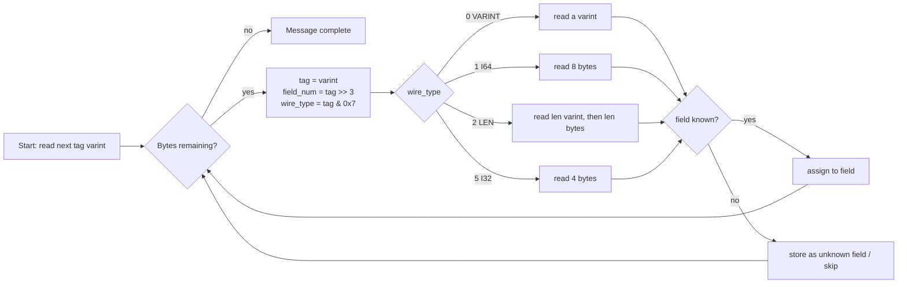
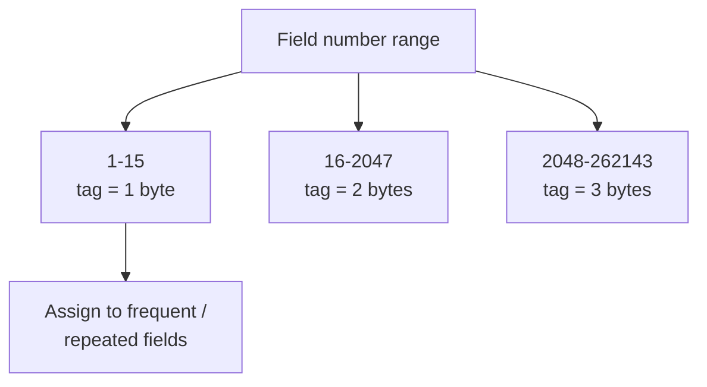

# Protocol Buffers: Syntax, Types & Encoding

Protocol Buffers ("protobuf") are the **interface definition language (IDL)** and
**binary serialization format** that gRPC uses by default. You describe your data and
service contract once in a `.proto` file, `protoc` generates code in your language, and
messages travel on the wire as compact, schema-driven binary. This page is about the
*data* side of protobuf — the proto3 syntax, the scalar type system, and — most
importantly for interviews — **exactly how a message is encoded byte-for-byte**, because
the wire format is what makes field numbers sacred, explains proto3's surprising
field-presence rules, and drives every schema-evolution decision.

> [!INTERVIEW]
> The single most common protobuf interview thread: "walk me through what a message
> looks like on the wire." If you can explain **tag = (field_number << 3) | wire_type**,
> varints, and length-delimited encoding, then *derive* from that why you can rename a
> field freely but never renumber it, and why a proto3 scalar set to `0` isn't
> transmitted — you've demonstrated real understanding, not memorization.

HTTP/2 framing, HPACK, and how these bytes are carried as `DATA` frames belong to
**networking** (see `networking/http2`) and the gRPC wire spec (see
`grpc/http2-foundations-for-grpc`). Service/RPC method definitions and streaming live in
`grpc/service-and-message-definition` and `grpc/four-rpc-types-and-streaming`. Here we
stay at the message/encoding altitude.

## proto3 Syntax & File Structure

A `.proto` file declares its syntax version on the first non-comment line, then
optionally a package, imports, options, and message/enum/service definitions.

```proto
syntax = "proto3";                 // MUST be the first non-comment, non-blank line

package acme.orders.v1;            // namespace; prevents name clashes

option go_package = "github.com/acme/orders/v1;ordersv1";
option java_package = "com.acme.orders.v1";
option java_multiple_files = true;

import "google/protobuf/timestamp.proto";

message Order {
  string id           = 1;         // field name = field number
  string customer_id  = 2;
  repeated LineItem items = 3;
  google.protobuf.Timestamp created_at = 4;
  OrderState state    = 5;
}
```

Key rules:

- **`syntax = "proto3";` must be the first statement.** Without it, `protoc` assumes
  proto2, which has materially different semantics (see *proto2 vs proto3*).
- **`package`** namespaces generated symbols and is independent of language-specific
  package options (`go_package`, `java_package`).
- **Versioning convention:** put a version in the package (`acme.orders.v1`) so a `v2`
  can coexist. This is the schema-level analogue of API versioning.
- Field definitions are `<type> <name> = <field_number>;`. The **name is for humans and
  generated code; the number is the wire identity.**

> [!KEY-TAKEAWAY]
> Field **names never appear on the wire** in binary protobuf — only field numbers do.
> That is why renaming a field is a wire-compatible change and renumbering is a
> catastrophic one.

## Field Numbers Are the Wire Identity

Every field has an integer **field number** that is encoded into the message as part of
each field's *tag*. This is the durable contract.

- Valid range: **1 to 536,870,911 (2²⁹ − 1)**.
- **19000–19999 are reserved** for the protobuf implementation — you cannot use them.
- Field numbers **1–15 encode their tag in a single byte**; **16–2047 take two bytes**
  (see *Why 1–15 Are Cheap*). Assign the low numbers to your hottest, most-repeated
  fields.

The rules that trip people up:

1. **Never change a field's number** once it is in use. Doing so is indistinguishable,
   on the wire, from deleting the old field and adding a brand-new one — old data is
   silently misread.
2. **Never reuse a number** that a deleted field used to occupy. Old serialized data (in
   a database, a queue, a cache) still carries that number; a new field reusing it will
   deserialize garbage into the new field's type.
3. Renaming a field (keeping the number) is safe on the wire — generated *code* changes,
   but serialized bytes don't. (JSON mapping uses names, so name changes do break JSON.)

```proto
message User {
  string user_id = 1;   // renaming to "id" is wire-safe; keep number 1
  // int32 age   = 2;   // deleted — DO NOT let anyone reuse number 2
}
```

## Reserved Fields & Numbers

To *enforce* the "never reuse" rule at compile time, protobuf lets you **reserve** the
numbers (and/or names) of removed fields. `protoc` then rejects any attempt to reuse
them.

```proto
message User {
  reserved 2, 5, 9 to 11;              // numbers that used to be in use
  reserved "age", "email_verified";    // names, so JSON/text can't reuse them either
  string user_id = 1;
  string display_name = 3;
}
```

- You **cannot** mix numbers and names in a single `reserved` statement — use two.
- Reserving is the disciplined way to delete a field: remove the field, add its number
  (and name) to `reserved`, and the compiler guards the tombstone forever.

> [!WARNING]
> Forgetting to reserve a deleted field's number is a classic production bug: months
> later, someone assigns that number to a new field, and old messages in a Kafka topic
> or a database blob start deserializing into the wrong field with a type mismatch —
> often silently, because protobuf is permissive about unknown/mismatched data.

## Scalar Types

Protobuf scalar types, their wire encoding, and the gotchas:

| Proto type | Wire type | Notes / when to use |
|---|---|---|
| `int32`, `int64` | varint | Variable-length. **Inefficient for negatives** (always 10 bytes for negative int64). |
| `uint32`, `uint64` | varint | Unsigned varints. |
| `sint32`, `sint64` | varint (**zigzag**) | Use when values are **often negative** — zigzag keeps small-magnitude negatives small. |
| `fixed32`, `fixed64` | 32-/64-bit | Always 4/8 bytes. Faster to decode; better when values are **often large** (e.g. hashes). |
| `sfixed32`, `sfixed64` | 32-/64-bit | Signed fixed-width. |
| `float`, `double` | 32-/64-bit (I32/I64) | IEEE-754. |
| `bool` | varint | 1 byte (0 or 1). |
| `string` | length-delimited | **Must be valid UTF-8** (or 7-bit ASCII). Invalid UTF-8 is a parse/serialize error. |
| `bytes` | length-delimited | Arbitrary byte sequence — use for binary blobs, non-UTF-8 data. |

Language mapping notes worth knowing:

- `int64`/`uint64`/`fixed64` map to JavaScript/JSON as **strings** in the canonical JSON
  mapping (to avoid 53-bit float precision loss). Interviewers like this one.
- `string` vs `bytes`: `string` enforces UTF-8 validation on both encode and decode;
  `bytes` does not. Never stuff binary data into a `string`.

> [!TIP]
> Rule of thumb for integers: **mostly-positive small numbers → `int32`/`int64`;
> frequently-negative → `sint32`/`sint64`; frequently-large or random (IDs, hashes) →
> `fixed32`/`fixed64`.** Picking `int64` for a field that holds negative values wastes
> up to 10 bytes each.

## The Wire Format: TLV, Tags & Wire Types

A protobuf message is just a concatenation of **key-value pairs**, each written as a
**tag** followed by a **payload** (a Tag-Length-Value / TLV-style layout, where "length"
only exists for length-delimited types). There is no framing of the overall message and
no field-name text — a parser reads tags until the bytes run out.

The **tag** is a single varint computed as:

```
tag = (field_number << 3) | wire_type
```

The low 3 bits are the **wire type** (which tells the parser how to read the payload);
the remaining high bits are the field number.

| Wire type | Value | Used for |
|---|---|---|
| VARINT | 0 | `int32/64`, `uint32/64`, `sint32/64`, `bool`, `enum` |
| I64 | 1 | `fixed64`, `sfixed64`, `double` |
| LEN | 2 | `string`, `bytes`, embedded messages, **packed** repeated fields |
| SGROUP | 3 | start group (**deprecated**, proto2 groups) |
| EGROUP | 4 | end group (**deprecated**) |
| I32 | 5 | `fixed32`, `sfixed32`, `float` |

Worked example — `message T { int32 a = 1; }` with `a = 150`:

```
Field 1, wire type 0 (VARINT):
  tag  = (1 << 3) | 0 = 0x08
  150  = 0x96 0x01   (varint, see below)
Bytes on the wire: 08 96 01
```

Because the wire type is embedded in every tag, a parser can **skip unknown fields**: it
reads the tag, sees the wire type, and knows exactly how many bytes to consume even if it
doesn't recognize the field number. This is the mechanical basis of forward
compatibility.



## Varint Encoding

**Varints** are a variable-length encoding for unsigned integers: base-128, little-endian
groups of 7 bits, where the **most-significant bit (MSB) of each byte is a continuation
flag** (1 = more bytes follow, 0 = last byte).

Encoding `150`:

```
150 decimal = 1001 0110 binary
Split into 7-bit groups (little-endian): 0010110 , 0000001
Add continuation bits:  1_0010110  0_0000001
                         = 0x96      0x01
Wire bytes: 96 01
```

Consequences:

- Small numbers are tiny (0–127 fit in one byte); larger numbers grow one byte per 7
  bits.
- **Negative numbers in `int32`/`int64` are encoded as their two's-complement in a full
  64-bit value**, so *any* negative always occupies **10 bytes**. This is the reason
  `sint`/zigzag exists.
- The tag itself is a varint, which is why field-number size affects tag size.

## Zigzag Encoding for Signed Integers (sint)

`sint32`/`sint64` apply **zigzag encoding** before the varint step so that
small-magnitude negative numbers produce small varints. Zigzag maps signed integers to
unsigned by interleaving positives and negatives:

```
encode:  zigzag(n) = (n << 1) ^ (n >> 31)   // for sint32 (>> 63 for sint64), arithmetic shift
```

| Signed value | Zigzag → encoded |
|---|---|
| 0 | 0 |
| −1 | 1 |
| 1 | 2 |
| −2 | 3 |
| 2 | 4 |
| 2147483647 | 4294967294 |
| −2147483648 | 4294967295 |

So −1 encodes to a 1-byte varint instead of 10 bytes. **Use `sint32`/`sint64` whenever a
field is frequently negative** (deltas, temperatures, offsets). If a field is essentially
always non-negative, plain `int32`/`int64` is fine and interoperates naturally.

> [!WARNING]
> `int32`, `sint32`, and `fixed32` are **not wire-compatible with each other** even
> though they hold the same logical range. Switching a field's type between these
> families is a breaking change — the payloads decode differently (varint vs zigzag-varint
> vs fixed 4 bytes).

## Length-Delimited Encoding (LEN)

Wire type 2 covers **`string`, `bytes`, embedded messages, and packed repeated fields**.
Layout is: `tag`, then a **varint length**, then exactly that many payload bytes.

```
message Person { string name = 1; }   // name = "testing"
tag  = (1 << 3) | 2 = 0x0A
len  = 7
data = "testing"
Wire: 0A 07 74 65 73 74 69 6E 67
```

Embedded messages are encoded as a length-delimited blob whose payload is *itself* a
complete serialized message — this is how nesting works, recursively. Because the length
prefix tells the parser the full extent, an unknown embedded message can be skipped
whole. The recursive, length-prefixed structure is also why deeply nested or adversarial
messages need a **recursion/size limit** (parsers cap this, e.g. gRPC's default 4 MiB
max receive message size).

## Why Field Numbers 1-15 Are Cheap

The tag is `(field_number << 3) | wire_type`, encoded as a varint. A single varint byte
holds 7 bits of value:

- **Field numbers 1–15:** `field_number << 3` uses bits up to `15 << 3 = 120`; with the
  3 wire-type bits the tag is ≤ 127, so it fits in **one byte**.
- **Field numbers 16–2047:** tag needs **two bytes**.
- 2048–262143: three bytes; and so on.



> [!TIP]
> Reserve the 1–15 numbers for your **most frequently set and repeated** fields. On a
> `repeated` field with millions of elements, saving one tag byte per element is real
> bandwidth. Leave some low numbers free for anticipated future hot fields.

## proto3 Field Presence

This is the highest-yield proto3 gotcha. In proto3, **plain scalar fields have *no*
explicit presence by default** — they use **implicit presence**:

- A scalar equal to its **default (zero) value is NOT serialized at all**. `0`, `false`,
  `""`, and the zero-value enum simply produce no bytes on the wire.
- Therefore, on decode, a field that is **unset** and a field **explicitly set to its
  default** are **indistinguishable**. `getX()` returns the zero value in both cases;
  there is no `hasX()`.

```proto
message Ping {
  int32 retries = 1;   // retries = 0 is NOT sent; receiver can't tell "0" from "unset"
}
```

Why this matters: you cannot model "field was intentionally set to 0/false/empty" vs
"field was omitted" with a plain scalar. Classic bug: a partial-update ("PATCH") API
where `active = false` is dropped on the wire, so the server never learns the client
wanted to *set* it to false.

Ways to get **explicit presence** back:

1. **`optional` keyword** (re-introduced for scalars in **proto3.15**, generally
   available since protoc 3.15). It generates a `hasX()` accessor. Under the hood it's
   implemented as a **synthetic single-field `oneof`**, which is what carries presence on
   the wire.

   ```proto
   message Ping {
     optional int32 retries = 1;   // now has_retries() distinguishes 0 from unset
   }
   ```

2. **Message-typed fields and wrapper types always have presence.** A submessage field is
   either present or not (`hasX()` exists), because "present but empty" and "absent" are
   distinguishable on the wire. The **well-known wrappers** (`google.protobuf.Int32Value`,
   `BoolValue`, `StringValue`, …) wrap a scalar in a message purely to add presence.

| Field kind (proto3) | Has presence? | `hasX()`? | Zero value serialized? |
|---|---|---|---|
| Plain scalar | No (implicit) | No | No |
| `optional` scalar | Yes (explicit) | Yes | Yes, if set (even to 0) |
| Message / submessage | Yes | Yes | N/A (present-or-not) |
| Wrapper (`*Value`) | Yes | Yes | Sends the wrapper message |
| `repeated` / `map` | No (emptiness = absence) | No | Empty ≡ absent |
| `oneof` member | Yes (which-one is tracked) | Yes | Yes, if that member is set |

> [!KEY-TAKEAWAY]
> "Is a proto3 scalar with its default value sent on the wire?" → **No.** If you need to
> distinguish unset from zero, use `optional`, a wrapper type, or a submessage. This is
> the most-tested single fact in protobuf interviews.

## Repeated Fields & Packed Encoding

`repeated` declares a list (zero or more elements, order preserved).

```proto
message Sample {
  repeated int32 readings = 1;   // packed by default in proto3
  repeated string names   = 2;   // NOT packable (length-delimited elements)
}
```

- **Packed encoding** (proto3 default for repeated **scalar numeric** fields): all
  elements are written as **one** length-delimited (LEN) field — a single tag, one length
  prefix, then the concatenated element payloads. This avoids repeating the tag per
  element and is far more compact.
- **Non-packable types:** `string`, `bytes`, and embedded messages are *not* packed —
  each element is its own length-delimited field with its own tag (they're already
  length-delimited, so packing gives nothing).
- **Compatibility:** a parser must accept **both** packed and unpacked forms for a
  packable field, so you can toggle `[packed=true/false]` without breaking the wire. (In
  proto2, `packed` is opt-in; proto3 defaults to packed but you can force
  `[packed=false]`.)

## Maps

`map<K, V>` is **syntactic sugar**. On the wire a map is exactly a **`repeated` message
of key/value entries**:

```proto
map<string, int32> counts = 1;
// is equivalent, on the wire, to:
message CountsEntry { string key = 1; int32 value = 2; }
repeated CountsEntry counts = 1;
```

Implications you should be able to state:

- Key type must be an **integral or string type** (no floats, bytes, enums, or messages
  as keys); value can be any type **except another map**.
- Maps are **unordered**; wire order is not significant and not guaranteed.
- On duplicate keys, the **last value wins**.
- Because it's a repeated message, a map is **not packed** and has no presence for the
  map itself (empty ≡ absent).

## Enums

```proto
enum OrderState {
  ORDER_STATE_UNSPECIFIED = 0;   // MUST be 0 and is the default
  ORDER_STATE_PENDING     = 1;
  ORDER_STATE_SHIPPED     = 2;
  reserved 3;                    // tombstone a removed value
}
```

- The **first enum value must be 0** and serves as the default (implicit presence:
  the zero value is not serialized). Convention: name it `*_UNSPECIFIED` so "unset" is
  explicit and meaningful.
- Enums are encoded as **varints** (wire type 0), same as `int32`.
- **proto3 enums are *open*:** an unknown numeric value received on the wire is
  **preserved** (kept as the raw integer, retrievable), not rejected — crucial for
  rolling upgrades where a new server sends a value an old client doesn't know.
- **proto2 enums are *closed*:** unknown values go into the unknown-field set and the
  getter clamps to a known value. (Editions and some languages/`enum` features affect
  this; the classic exam answer is proto3-open, proto2-closed.)

> [!WARNING]
> Because enums serialize as bare integers, you can **add** new values without breaking
> old readers (they see an unknown number). But **never renumber** existing values and
> **never reuse** a removed value's number — same wire-identity rules as fields. Use
> `reserved` for removed enum values too.

## oneof

A `oneof` groups fields where **at most one** may be set at a time; setting one clears
the others. It saves space (like a tagged union) and gives you presence tracking.

```proto
message Payment {
  oneof method {
    CardInfo card        = 1;
    string   paypal_email = 2;
    BankInfo bank        = 3;
  }
}
```

- On the wire, only the **currently-set member's** field is serialized — the generated
  code exposes a "which one is set" discriminator (`getMethodCase()` / `WhichOneof()`).
- oneof members **cannot be `repeated`**.
- Adding a field into or out of a `oneof`, or moving fields between oneofs, is a **wire-
  and-source-breaking** change — treat oneof membership as part of the contract.
- `optional` scalars are implemented as synthetic single-member oneofs internally, which
  is why they have presence.

## Well-Known Types

Google ships standard messages in `google/protobuf/*.proto`. Know these by name and use:

| Type | Purpose / note |
|---|---|
| `Timestamp` | Point in time (seconds + nanos since Unix epoch, UTC). Prefer over raw int64 for time. |
| `Duration` | Signed span (seconds + nanos). |
| `Any` | Embeds an arbitrary serialized message **plus a type URL** — self-describing polymorphism. |
| `Struct`, `Value`, `ListValue` | Represent arbitrary JSON-like dynamic data. |
| `FieldMask` | A set of field paths — the standard way to express **partial update / read masks**. |
| `Empty` | An empty message (common as an RPC request/response placeholder). |
| Wrappers (`Int32Value`, `StringValue`, `BoolValue`, …) | Add **explicit presence** to a scalar (pre-`optional`, or across languages/JSON). |

- **`FieldMask`** is the idiomatic answer to "how do you do PATCH-style partial updates in
  gRPC?" — the client sends the fields it wants changed; the server applies only those.
- **`Any`** carries `type.googleapis.com/<fully-qualified-name>` as its type URL so the
  receiver can identify and unpack the embedded message. It's how the rich error model
  (`google.rpc.Status.details`) attaches typed error payloads — see
  `grpc/error-handling-and-status-codes`.

## proto2 vs proto3

| Aspect | proto2 | proto3 |
|---|---|---|
| Field labels | `required`, `optional`, `repeated` | `repeated`, plus `optional` (re-added 3.15); **no `required`** |
| Scalar presence | Explicit by default (`has*`) | **Implicit** by default; `optional` for explicit |
| Defaults | Custom `[default = ...]` allowed | No custom defaults; always type zero-value |
| Enums | **Closed** (unknown → unknown set) | **Open** (unknown value preserved); first value must be 0 |
| Packed repeated | Opt-in (`[packed=true]`) | **Default on** for scalar numerics |
| JSON mapping | Not standardized originally | Canonical JSON mapping defined |

Notable: proto3 **removed `required`** deliberately — `required` proved a
schema-evolution trap (you can never safely remove a required field). The wire format
itself is the *same* between proto2 and proto3; the differences are in language semantics
and defaults. (Google's newer **"editions"** unify proto2/proto3 into per-feature knobs,
but the proto2-vs-proto3 framing is what interviews still ask.)

> [!INTERVIEW]
> "Why did proto3 drop `required`?" → Because required-ness can't evolve: once a field is
> `required`, you can never remove it or make it optional without breaking every existing
> reader, and a message missing a required field fails to parse — turning a schema tweak
> into an outage. proto3 makes everything optional-in-spirit so schemas stay evolvable.

## Deterministic Serialization Is Not Canonical

A dangerous myth: "the same message always serializes to the same bytes, so I can hash the
serialized form for signatures/dedup/caching." **False.** Protobuf serialization is
**not guaranteed to be canonical or stable**:

- **Map entry order is unspecified** and can differ between runs, versions, and
  languages.
- **Unknown fields** are retained and re-emitted, potentially in a different position.
- Different **library versions / languages** may order or pack fields differently.
- Libraries offer a **deterministic** serialization mode, but the docs explicitly warn it
  is only stable **within the same binary/build**, not across versions or languages — it
  is *not* a canonical form.

> [!WARNING]
> **Never hash or digitally sign serialized protobuf bytes and expect it to verify
> elsewhere.** For signatures, sign a canonical representation you define, or transmit and
> verify the exact bytes you signed. This is a real security/interview gotcha.

## Common Interview Follow-ups

- **"Walk me through the bytes of `message T { int32 a = 1; }` with `a = 150`."**
  → `08 96 01`: tag `08` = field 1, wire type 0 (varint); `96 01` = varint 150.
- **"Is a proto3 `bool` set to `false` sent on the wire?"** → No — implicit presence means
  zero values aren't serialized; use `optional bool` if you must distinguish.
- **"How do you safely delete a field?"** → Remove it and add its number (and name) to
  `reserved`; never reuse the number.
- **"Which schema changes are backward compatible?"** → Adding fields with new numbers,
  renaming fields, adding enum values (open), toggling packed. Breaking: renumbering,
  reusing numbers, changing a field's wire-type family (`int32`↔`sint32`↔`fixed32`),
  moving fields in/out of a `oneof`, changing `string`↔`bytes` semantics. Deep-dive in
  `grpc/schema-evolution-and-compatibility`.
- **"int32 vs sint32 vs fixed32 — when each?"** → int32 for small non-negative; sint32
  (zigzag) for frequently-negative; fixed32 for frequently-large/random values.
- **"How do you model partial updates?"** → `FieldMask` (well-known type) listing the
  paths to modify.
- **"Why must field 1–15 be your hot fields?"** → Their tag is one byte; 16+ is two.
- **"Can I trust serialized bytes to be identical across languages?"** → No; not canonical
  — don't hash them.
- **"How does an old parser handle a field it doesn't know?"** → The tag's wire type tells
  it how many bytes to skip; it stores them as unknown fields and can re-emit them.

## References

- Protocol Buffers — Language Guide (proto3): https://protobuf.dev/programming-guides/proto3/
- Protocol Buffers — Encoding (wire format): https://protobuf.dev/programming-guides/encoding/
- Field presence in protobuf: https://protobuf.dev/programming-guides/field-presence/
- Well-Known Types: https://protobuf.dev/reference/protobuf/google.protobuf/
- proto2 Language Guide: https://protobuf.dev/programming-guides/proto2/
- Serialization determinism note: https://protobuf.dev/programming-guides/serialization-not-canonical/
- gRPC over HTTP/2 wire spec: https://github.com/grpc/grpc/blob/master/doc/PROTOCOL-HTTP2.md
- Cross-references: `networking/http2`, `grpc/schema-evolution-and-compatibility`, `grpc/error-handling-and-status-codes`, `grpc/service-and-message-definition`
