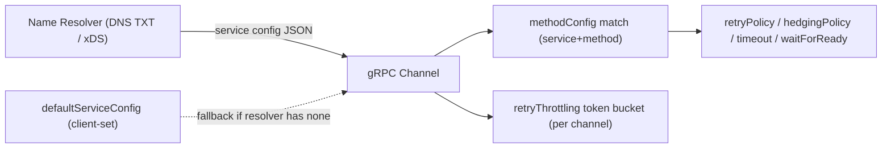
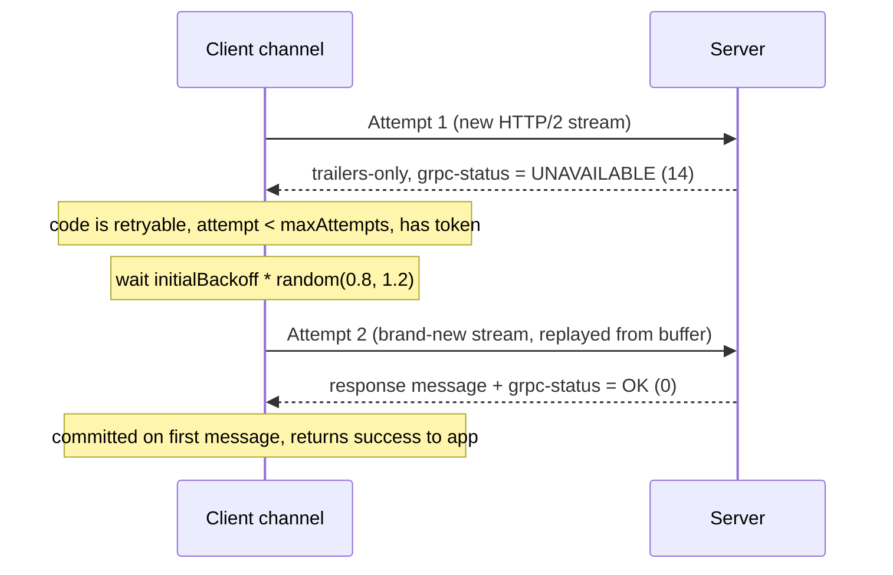
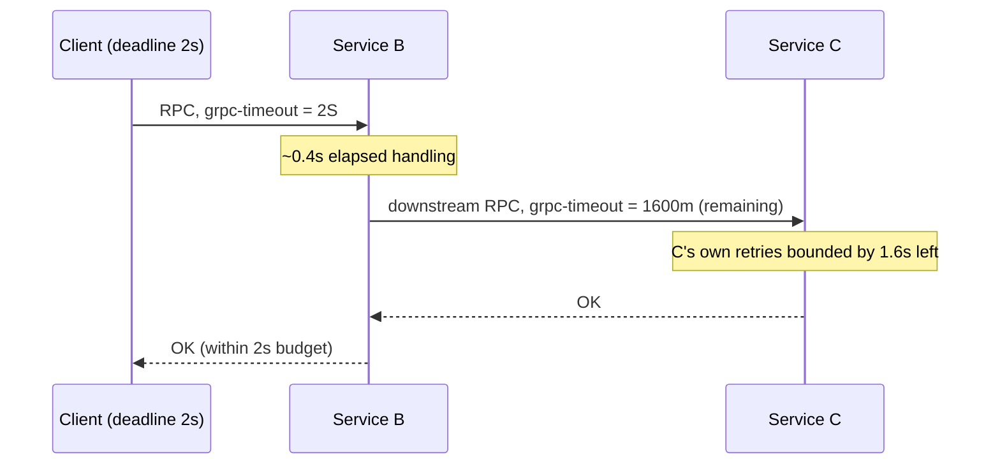

# Retries, Resiliency & Deadline Propagation

gRPC ships **transport-level resiliency as a first-class, configurable feature** rather
than leaving it entirely to application code. The client channel can transparently retry
failed RPCs, run parallel *hedged* attempts, throttle retries to avoid storms, queue calls
until a connection is ready, and probe dead connections with keepalive pings — all driven
by declarative **service config** (a JSON document) that the name resolver delivers to the
channel. This page teaches the gRPC-specific **mechanics** of those features (what the
config keys mean, what happens on the wire, what the framework does), and the judgment
around when each is safe.

> [!KEY-TAKEAWAY]
> gRPC's built-in retry/hedging is governed by **gRFC A6** and configured through the
> `methodConfig.retryPolicy` / `hedgingPolicy` blocks of **service config**. Retries are
> **transparent to your code** but only *safe* when the method is idempotent and the
> failure code is retryable — the framework will happily retry a non-idempotent write if
> you misconfigure it.

This topic is deliberately about the **gRPC config surface and wire behavior**. The
*theory* of retries/backoff/circuit-breaking/idempotency lives in **reliability-ops**
(cross-ref); the *absolute-deadline / cancellation* primitives live in the sibling gRPC
topic **Deadlines, Timeouts & Cancellation** (cross-ref) — here we only cover deadline
*propagation as it interacts with the retry budget*. HTTP/2 framing and TLS internals
live in **networking**; service-mesh/xDS architecture lives in **system-design**.

---

## Service config: how resiliency policy is delivered

**Service config** is a JSON document, defined by
[gRFC A2](https://github.com/grpc/proposal/blob/master/A2-service-configs-in-dns.md),
that configures channel behavior *per service and per method*. It is **not** written in
your `.proto`; it is delivered to the client channel at runtime through the **name
resolver**, so operators can change policy without recompiling clients.

Delivery paths:

| Source | How it arrives | Typical use |
|---|---|---|
| **DNS TXT record** (`_grpc_config.<host>`) | Resolver reads a TXT record with a `grpc_config=` payload | Simple, static, DNS-based deployments |
| **xDS** (control plane, e.g. Envoy/Istio/Traffic Director) | Resolver plugin fetches config from an xDS management server | Service mesh, dynamic policy at scale (see system-design) |
| **Default service config** on the channel (`grpc.service_config` / `defaultServiceConfig`) | Set by the client at construction; used if the resolver returns none | Client-owned defaults, local testing |

The channel merges/selects a `methodConfig` entry by matching the `name` array (service +
method). The relevant resiliency keys are `retryPolicy`, `hedgingPolicy`, `timeout`, and
`waitForReady`; the top-level `retryThrottling` governs the retry token bucket.

```jsonc
{
  "methodConfig": [{
    "name": [{ "service": "routeguide.RouteGuide", "method": "GetFeature" }],
    "timeout": "2s",
    "waitForReady": true,
    "retryPolicy": {
      "maxAttempts": 4,
      "initialBackoff": "0.1s",
      "maxBackoff": "1s",
      "backoffMultiplier": 2,
      "retryableStatusCodes": ["UNAVAILABLE"]
    }
  }],
  "retryThrottling": {
    "maxTokens": 100,
    "tokenRatio": 0.1
  }
}
```

> [!WARNING]
> A `methodConfig` entry may specify **either** `retryPolicy` **or** `hedgingPolicy`, never
> both for the same method. Also: the built-in retry feature must be enabled on the channel
> (it is on by default in modern gRPC releases, but historically gated behind
> `grpc.enable_retries`). If retries are disabled at the channel level, the policy is
> ignored.



---

## Client retries (gRFC A6)

[gRFC A6](https://github.com/grpc/proposal/blob/master/A6-client-retries.md) defines
**transparent client retries**. When enabled, the channel automatically re-sends an RPC
that fails with a **retryable status code**, using exponential backoff, up to
`maxAttempts`. The application sees only the final outcome (success, or the last error) —
retries are invisible above the stub.

`retryPolicy` fields:

| Field | Meaning | Constraint |
|---|---|---|
| `maxAttempts` | Total attempts including the original (so `4` = 1 try + 3 retries) | Must be ≥ 2; capped by an implementation max (commonly 5) |
| `initialBackoff` | Backoff before the first retry | Required, must be > 0 |
| `maxBackoff` | Upper bound on backoff | Required, must be > 0 |
| `backoffMultiplier` | Growth factor per attempt | Required, must be > 0 |
| `retryableStatusCodes` | Set of codes that trigger a retry | Non-empty; status names or integers |

**Backoff mechanism (per gRFC A6):** the delay before the *n*-th retry is
`min(initialBackoff * backoffMultiplier^(n-1), maxBackoff) * random(0.8, 1.2)` — a base that
grows geometrically (capped at `maxBackoff`), multiplied by a **built-in ±20% jitter** factor
(`random(0.8, 1.2)`); you don't add jitter yourself. So with `initialBackoff=0.1s`,
`multiplier=2`: the 1st retry waits ~0.1s, the 2nd ~0.2s, the 3rd ~0.4s (each ± the 0.8–1.2×
jitter, base capped at `maxBackoff`). Note this is a multiplicative jitter around the base
delay, *not* a "full-jitter" pick uniformly in `[0, base]`.

**`server-pushback`:** a server can override client backoff by returning the
`grpc-retry-pushback-ms` metadata (trailer). A non-negative value tells the client to wait
exactly that many ms before the next retry; a **negative** value tells the client to **stop
retrying** immediately (treat as non-retryable). This lets an overloaded server shed load.

### When is an attempt *committed* (retry no longer possible)?

A retry can only replay an RPC while it is *buffered*. The RPC becomes **committed** to a
single attempt — and can no longer be retried — as soon as:

- the client receives **any message** from the server (a response for unary, or the first
  stream message), or
- the server response headers are received without a trailers-only failure, or
- the client's **send buffer for the attempt exceeds the retry buffer size**
  (`retryBufferSize` / `perRpcBufferLimit`) — large requests may become uncommittable to
  buffer and thus non-retryable.

This is why **retries fundamentally require request buffering**: the client holds the
outbound messages so it can replay them on a fresh HTTP/2 stream. Retries only apply
cleanly when the server has not begun sending a response.



> [!WARNING]
> A **trailers-only** response (status carried in the initial HEADERS frame with no data)
> is the common retryable failure shape — e.g. server returns `UNAVAILABLE` before any
> message. If the server has already streamed a message, the RPC is committed and gRPC will
> **not** retry even on a subsequent retryable code.

---

## Which codes and methods are safe to retry

Retrying is only correct when (a) the failure is *transient* and (b) re-executing the
method is *safe*. gRPC leaves the safety judgment to **your config** — it does not know
whether a method mutates state.

**Retryable by default / good candidates:**

| Code | Why safe/transient |
|---|---|
| `UNAVAILABLE` (14) | Transient: connection refused, server draining, LB has no backend yet. The canonical retryable code. |
| `RESOURCE_EXHAUSTED` (8) | Sometimes — only if it means a transient quota/backpressure and you back off; can worsen overload otherwise. |
| `ABORTED` (10) | Often retryable for optimistic-concurrency conflicts. |

**Do NOT put in `retryableStatusCodes`:**

| Code | Why NOT |
|---|---|
| `INVALID_ARGUMENT` (3) | Deterministic client error — retrying re-sends the same bad request forever. |
| `NOT_FOUND` (5) / `ALREADY_EXISTS` (6) | Deterministic; retry won't change the outcome. |
| `UNAUTHENTICATED` (16) / `PERMISSION_DENIED` (7) | Auth won't fix itself by retrying. |
| `FAILED_PRECONDITION` (9) | State-dependent; retry is unsafe/pointless. |
| `OK` (0) | Not allowed — you can't list success as retryable. |

**Idempotency is the real gate.** Even `UNAVAILABLE` is only safe to retry if the method is
idempotent, because the *first* attempt may have reached the server and executed before the
connection dropped (the "did my write happen?" ambiguity). Reads (`GetFeature`), PUT-style
full replaces, and DELETE-by-key are naturally idempotent. Non-idempotent operations
(`AppendLog`, `IncrementCounter`, `Charge`) need an **idempotency key** to be retry-safe, or
should be left with no retry policy. (Deep idempotency theory → reliability-ops.)

> [!INTERVIEW]
> "You added `UNAVAILABLE` retries to a payments RPC and now some customers are double-charged.
> Why?" — Because the first attempt reached the server and committed the charge, but the
> response was lost (connection dropped → `UNAVAILABLE`), so gRPC replayed it. The fix is an
> idempotency key on the request so the server dedupes, **not** removing retries blindly.

---

## Retry throttling (preventing retry storms)

If every client aggressively retries a struggling server, retries *amplify* load exactly
when the server can least handle it — a **retry storm** that turns a blip into an outage.
gRPC's answer is a per-channel **token bucket**, configured by the top-level
`retryThrottling` object:

```jsonc
"retryThrottling": {
  "maxTokens": 100,     // bucket size and initial fill (max 1000)
  "tokenRatio": 0.1     // tokens added back per successful RPC
}
```

**Mechanism (per gRFC A6):**

- The bucket starts full at `maxTokens`.
- Every RPC **failure** decrements the bucket by **1 token**.
- Every RPC **success** increments the bucket by `tokenRatio` (a fractional value, e.g. 0.1).
- A retry is **only attempted while `tokens > maxTokens / 2`** (i.e. the bucket is at least
  half full). When the bucket drops to/below the halfway mark, retries are suppressed until
  successes refill it.

So a sustained stream of failures drains the bucket and **automatically disables retries**
until the server recovers enough to produce successes. The `1 : tokenRatio` ratio sets the
steady-state: with `tokenRatio=0.1`, roughly 1 retry is "paid for" by 10 successes.
Throttling counts **hedged attempts too**.

> [!TIP]
> Throttling is **per channel**, not global. Many clients each with their own bucket still
> collectively hammer a server; cross-fleet protection needs server-side load shedding or a
> mesh-level circuit breaker (cross-ref reliability-ops / system-design).

---

## Hedging (gRFC A6)

**Hedging** trades extra load for lower tail latency: instead of waiting for one attempt to
fail, the client fires the *same* request to (potentially different) backends on a schedule
and uses the **first non-failing response**, cancelling the others. It targets **p99
latency** for read-heavy, idempotent workloads where a slow backend is the enemy.

```jsonc
"hedgingPolicy": {
  "maxAttempts": 3,
  "hedgingDelay": "0.5s",
  "nonFatalStatusCodes": ["UNAVAILABLE", "RESOURCE_EXHAUSTED"]
}
```

**Mechanism:**

- The **first** attempt is sent immediately.
- If no response arrives within `hedgingDelay`, a **second** attempt is sent *in parallel*
  (the first is not cancelled yet); and so on up to `maxAttempts`, each `hedgingDelay` apart.
- A `hedgingDelay` of `"0s"` sends all attempts at once immediately.
- The **first attempt that yields a response** wins: on success, all other in-flight
  attempts are cancelled and the result is returned. If an attempt fails with a
  `nonFatalStatusCode`, it's ignored and hedging continues; a failure with a **fatal**
  (non-listed) code commits the RPC to that failure and cancels the rest.

### Retry vs Hedging

| | Retry (`retryPolicy`) | Hedging (`hedgingPolicy`) |
|---|---|---|
| Timing | **Sequential** — retry only after previous attempt fails | **Parallel** — new attempts on a timer regardless of failure |
| Goal | Recover from transient failures | Cut **tail latency** |
| Extra load | Only on failures | On *every* slow call (even successful-but-slow) |
| Backoff | Exponential + jitter | Fixed `hedgingDelay` interval |
| Safety gate | `retryableStatusCodes` | `nonFatalStatusCodes` |
| Idempotency | Required | **Required** (multiple copies may execute concurrently) |
| Config key | `retryPolicy` | `hedgingPolicy` (mutually exclusive with retry) |

> [!WARNING]
> Hedging is even *more* dangerous than retry for non-idempotent methods: multiple attempts
> can be executing **at the same time** on different servers. Only hedge idempotent reads.
> Both retry and hedging are subject to the same `retryThrottling` token bucket.

---

## Deadline propagation across the retry budget

The gRPC **deadline** is an *absolute* point in time (see the sibling topic for the
`grpc-timeout` header and expiry mechanics). What matters *here* is that **all attempts
share one deadline**: retries, hedges, and downstream calls happen inside the **same overall
budget**, they do not each get a fresh clock.

Key mechanics:

- **Retries do not reset the deadline.** If the call's deadline is 2s, and attempt 1 burns
  1.5s before failing, the retry runs against the remaining ~0.5s. If backoff + the next
  attempt would exceed the deadline, gRPC gives up and returns `DEADLINE_EXCEEDED` — it will
  **not** start an attempt it knows cannot finish.
- **Propagation downstream.** When a server handler makes its own outbound gRPC calls, gRPC
  propagates the *remaining* deadline via the `grpc-timeout` header on each hop. So a
  downstream service sees a deadline no later than the caller's, and its own retries are
  bounded by whatever budget is left. This prevents "orphan" work continuing after the
  original caller gave up.
- **Interaction with retry backoff.** Because backoff eats into the budget, a tight deadline
  with an aggressive `maxAttempts` may only ever run 1–2 attempts before `DEADLINE_EXCEEDED`.
  Size `initialBackoff`/`maxBackoff` against the deadline, not in isolation.



> [!INTERVIEW]
> "Why don't retries each get the full deadline?" — Because the deadline expresses the
> caller's *total* patience / SLA. If each retry reset it, a chain of retries could run far
> longer than the client is willing to wait, defeating the purpose and holding server
> resources long after the client cared. The whole retry sequence must fit the one budget.

---

## wait_for_ready

By default, if a channel has **no ready connection** when you make an RPC (e.g. the resolver
hasn't resolved yet, or all subchannels are in `TRANSIENT_FAILURE`), gRPC **fails the RPC
fast** with `UNAVAILABLE`. Setting **`waitForReady` = true** (per-call option, or in service
config) changes this: the RPC is **queued** until the channel becomes `READY`, rather than
failing immediately.

| | `waitForReady` = false (default) | `waitForReady` = true |
|---|---|---|
| Channel not READY at call time | Fail fast with `UNAVAILABLE` | **Buffer/queue** the RPC until READY |
| Bounded by | — | The RPC's **deadline** (still fails `DEADLINE_EXCEEDED` if it never becomes ready) |
| Good for | Latency-critical calls that should fail over quickly; fail-fast semantics | Startup races, "the server will be there soon", non-latency-critical background calls |
| Risk | Spurious `UNAVAILABLE` during transient blips | Requests pile up / mask a truly-down dependency; can hurt tail latency |

Set it in code (e.g. Go `grpc.WaitForReady(true)` call option, Java
`CallOptions.withWaitForReady()`) or via `"waitForReady": true` in `methodConfig`.

> [!TIP]
> `waitForReady` composes with retries: with fail-fast, a connection blip surfaces as
> `UNAVAILABLE` which your retry policy then catches. With `waitForReady`, the call simply
> waits — often the cleaner choice for startup ordering, but it can hide a hard-down backend
> until the deadline fires.

---

## Keepalive (gRFC A8)

TCP connections can die silently — a middlebox drops idle state, a peer crashes without a
FIN, a NAT times out — leaving a "half-open" connection where the client thinks it's fine
but sends vanish into a black hole. **HTTP/2 keepalive**
([gRFC A8](https://github.com/grpc/proposal/blob/master/A8-client-side-keepalive.md)) lets
gRPC proactively detect this by sending HTTP/2 **PING frames** and requiring a timely PING
ACK.

Client-side knobs (names vary slightly by language):

| Setting | Meaning |
|---|---|
| `keepalive_time` (`KEEPALIVE_TIME_MS`) | Interval of inactivity after which a PING is sent |
| `keepalive_timeout` (`KEEPALIVE_TIMEOUT_MS`) | How long to wait for the PING ACK before declaring the connection dead and closing it |
| `keepalive_permit_without_calls` | If true, send keepalive PINGs even when there are no active RPCs |

**Mechanism:** after `keepalive_time` of no data, the client sends a PING. If no ACK
arrives within `keepalive_timeout`, the transport is considered broken; the connection is
closed, subchannel goes to `TRANSIENT_FAILURE`, and in-flight RPCs fail (typically
`UNAVAILABLE`) — which your retry policy can then handle by re-attempting on a fresh
connection.

> [!WARNING]
> **Server enforcement.** Servers set a minimum keepalive interval
> (`GRPC_ARG_HTTP2_MIN_RECV_PING_INTERVAL_WITHOUT_DATA`, default 5 min) and a
> `MAX_PING_STRIKES` (default 2). A client that pings *too aggressively* — especially with
> `permit_without_calls` and a short `keepalive_time` — accrues strikes and gets its
> connection killed with an HTTP/2 **GOAWAY** carrying `ENHANCE_YOUR_CALM` and debug data
> `"too_many_pings"`. Tune client keepalive ≥ the server's minimum, or coordinate both sides.

Keepalive is about *connection liveness*, distinct from **deadlines** (per-RPC time budget)
and **connection/idle timeout**. The sibling deadlines topic contrasts all three.

---

## Circuit breaking (where it lives for gRPC)

A **circuit breaker** stops sending requests to a failing dependency after an error
threshold, "opening" the circuit to let it recover and fail fast meanwhile. gRPC's core
library does **not** ship a full circuit-breaker feature the way it ships retries — the
closest built-in behaviors are the **subchannel `TRANSIENT_FAILURE` state** (with connection
backoff) and **retry throttling**. Real circuit breaking for gRPC is typically implemented:

1. **At the mesh / proxy layer (most common):** Envoy/Istio circuit breakers configured via
   xDS — max connections, max pending requests, max concurrent requests, and outlier
   detection that ejects unhealthy endpoints. This keeps breaking logic out of every client.
2. **Via xDS to the gRPC client directly:** proxyless gRPC-xDS supports outlier detection /
   circuit-breaking config pushed to the client's load balancing policy.
3. **App-level libraries** (e.g. resilience4j in Java, or a custom interceptor) wrapping the
   stub — useful when you're not in a mesh.

> [!TIP]
> Interview framing: "gRPC gives you *retries + throttling + connection backoff* out of the
> box; *circuit breaking* you get from the mesh (Envoy outlier detection / xDS) or an
> app-level interceptor." Don't claim gRPC core has a first-class circuit breaker — it
> doesn't. (Circuit-breaker theory → reliability-ops; mesh architecture → system-design.)

---

## Putting resiliency together (a defensible default)

A sensible baseline for an **idempotent read** RPC behind a mesh:

```jsonc
{
  "methodConfig": [{
    "name": [{ "service": "catalog.Catalog", "method": "GetItem" }],
    "timeout": "1s",
    "waitForReady": false,
    "retryPolicy": {
      "maxAttempts": 3,
      "initialBackoff": "0.05s",
      "maxBackoff": "0.5s",
      "backoffMultiplier": 2,
      "retryableStatusCodes": ["UNAVAILABLE"]
    }
  }],
  "retryThrottling": { "maxTokens": 200, "tokenRatio": 0.1 }
}
```

Reasoning: tight 1s deadline (fail fast, protect the caller); fail-fast (`waitForReady:false`)
so blips become retryable `UNAVAILABLE`; only 3 attempts with sub-deadline backoff so the
budget isn't blown; throttling to break storms; keepalive + mesh outlier detection provide
liveness and circuit breaking around it. For a **write** RPC, drop `retryPolicy` unless the
server supports idempotency keys.

---

## Common Interview Follow-ups

- **"Walk me through what the channel does when an RPC returns `UNAVAILABLE` with a retry
  policy configured."** — Check code ∈ `retryableStatusCodes`; check attempt < `maxAttempts`;
  check the retry token bucket is > half full; honor any `grpc-retry-pushback-ms`; wait
  `min(initial*mult^(n-1), maxBackoff) * random(0.8, 1.2)`; replay the buffered request
  on a **new** HTTP/2 stream — provided the RPC isn't already committed and fits the deadline.
- **"Retry vs hedging — when hedging?"** — Latency-sensitive, idempotent reads where a slow
  (not failed) backend hurts p99. Hedging sends parallel attempts on a timer; retry only
  reacts to failures. Hedging costs extra load on *every* slow call.
- **"How do you stop a retry storm?"** — `retryThrottling` token bucket disables retries when
  failures dominate; plus server-side load shedding / `grpc-retry-pushback-ms` negative value;
  plus mesh circuit breaking. Per-channel throttling isn't global.
- **"Do retries get a fresh deadline?"** — No. All attempts + backoff share the one absolute
  deadline; gRPC won't start an attempt that can't finish in the remaining budget, and
  propagates the remaining budget downstream.
- **"When can an RPC no longer be retried?"** — Once *committed*: the client received a
  message/response, or the outbound buffer exceeded the retry buffer limit. Retries need
  buffering to replay.
- **"`waitForReady` true or false for a payment gateway call?"** — Usually false (fail fast,
  let orchestration decide), with an idempotency-key-backed retry; `waitForReady` risks piling
  requests against a down dependency.
- **"Why is my client getting GOAWAY `too_many_pings`?"** — Client keepalive is more
  aggressive than the server's minimum ping interval; raise `keepalive_time` or the server's
  min-recv-ping-interval.
- **"Where's the circuit breaker in gRPC?"** — Not in core; use Envoy/xDS outlier detection
  or an app-level interceptor. Core gives you retry throttling + subchannel backoff.

## References

- gRFC **A6 – gRPC Retry Design** (client retries, hedging, throttling, backoff, commit rules):
  https://github.com/grpc/proposal/blob/master/A6-client-retries.md
- gRFC **A2 – Service Config in DNS** (service config delivery):
  https://github.com/grpc/proposal/blob/master/A2-service-configs-in-dns.md
- gRFC **A8 – Client-side Keepalive**:
  https://github.com/grpc/proposal/blob/master/A8-client-side-keepalive.md
- gRPC docs — Retry / hedging & service config:
  https://grpc.io/docs/guides/retry/ and https://grpc.io/docs/guides/service-config/
- gRPC docs — Deadlines & wait-for-ready:
  https://grpc.io/docs/guides/deadlines/ and https://grpc.io/docs/guides/wait-for-ready/
- gRPC docs — Keepalive: https://grpc.io/docs/guides/keepalive/
- gRPC Core keepalive & GOAWAY semantics:
  https://github.com/grpc/grpc/blob/master/doc/keepalive.md
- gRPC status codes: https://grpc.io/docs/guides/status-codes/
- HTTP/2 RFC 9113 (PING, GOAWAY, streams — see **networking**): https://www.rfc-editor.org/rfc/rfc9113
- Cross-ref: **reliability-ops** (retry/backoff/circuit-breaker/idempotency theory);
  **system-design** (service mesh / Envoy / xDS); **networking** (HTTP/2, TLS);
  sibling gRPC topic **Deadlines, Timeouts & Cancellation**.
