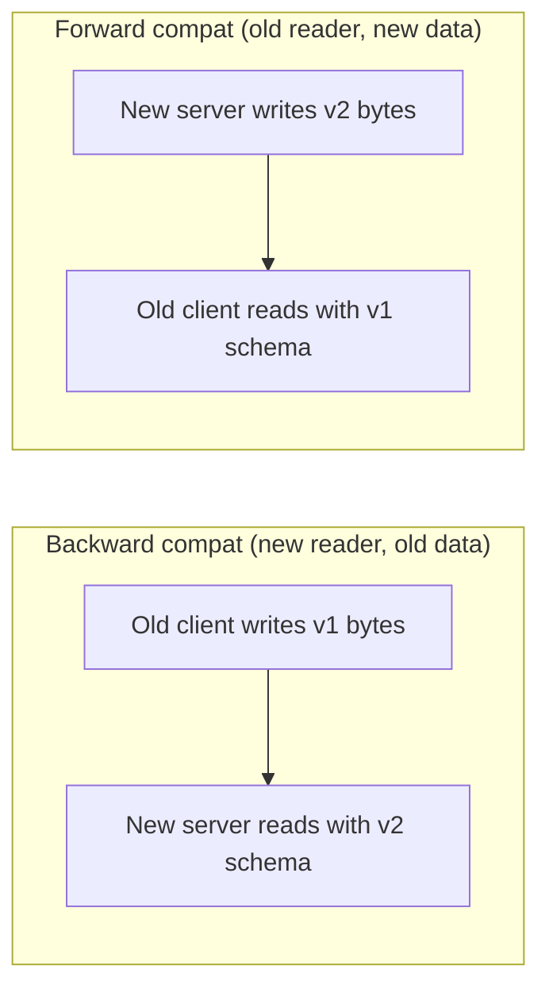
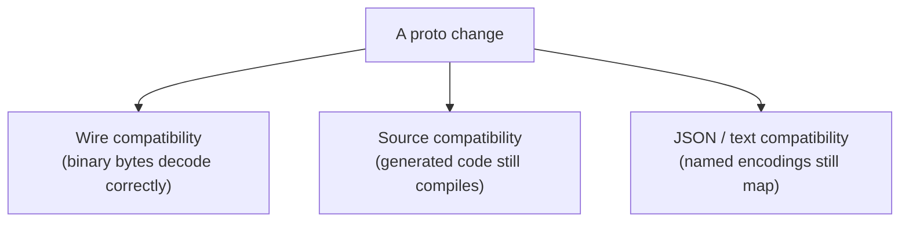

# Schema Evolution & Backward Compatibility

Real services never freeze their contract. Fields get added, messages get restructured,
methods get introduced — while **old clients and old servers keep running** against the
new schema and vice versa. Schema evolution is the discipline of changing a `.proto`
so that peers built from *different* versions of it still interoperate. This is one of
the highest-frequency gRPC/protobuf interview areas because it forces you to reason from
the wire format: what actually travels on the wire, what the generated code assumes, and
where the two can silently diverge.

The single organizing idea: **field numbers are the contract.** Protobuf's binary wire
format identifies every field by its integer field number and wire type, *never* by its
name (see `grpc/protocol-buffers-syntax-types-encoding`). Almost every rule below is a
consequence of that one fact. The name is for humans and generated code; the number is
the immutable wire identity.

> [!INTERVIEW]
> The classic question is "how do you evolve a proto without breaking anyone?" A strong
> answer never memorizes a list — it *derives* the rules: "field numbers are the wire
> identity, so I can add, rename, or remove a field freely as long as I never change or
> reuse a number, and I reserve removed numbers so nobody accidentally recycles them."
> Then layer in the three *distinct* compatibility axes (wire / source / JSON) and the
> proto3 presence gotchas. That progression signals real understanding.

This page assumes you know proto3 syntax and the encoding (`protocol-buffers-syntax-types-encoding`),
message/service definition (`service-and-message-definition`), and the status model
(`error-handling-and-status-codes`). The *messaging-databases* domain owns schema
registries and Avro/Protobuf compatibility modes in event streaming — we note the
parallel but do not re-teach it.

## Forward vs Backward Compatibility

Compatibility has a **direction**, and interviewers probe whether you keep it straight.
Frame it around who reads data written by whom.

- **Backward compatible change:** *new* code can read data produced by *old* code. You
  upgrade the reader; it still understands old messages. (New server reads requests from
  old clients.)
- **Forward compatible change:** *old* code can read data produced by *new* code. The
  reader is stale but must not choke on data from a newer writer. (Old client reads
  responses from a new server.)

Protobuf is unusual in that a well-behaved schema change is **both** forward and backward
compatible at the wire level. That is deliberate: in a distributed rollout you can't
control deploy order, so both old→new and new→old must work simultaneously.



The mechanism that gives protobuf forward compatibility is **unknown-field handling**:
an old reader that meets a field number it doesn't recognize doesn't crash — it either
skips or preserves it (see *Unknown-Field Preservation*). Backward compatibility comes
from **defaults**: a new reader that doesn't find an expected field number just sees the
type's default value.

> [!KEY-TAKEAWAY]
> A "safe" protobuf change is one that is simultaneously backward AND forward compatible
> at the **wire** level, because you cannot guarantee deploy order in a fleet. Ask "can
> old and new read each other's bytes?" for every change.

## Field Numbers Are the Contract

Every rule descends from this. On the wire, a field is written as a *tag* =
`(field_number << 3) | wire_type`, followed by the value. The decoder matches incoming
tags to fields **by number**. Consequences:

- **Never change an existing field's number.** Old peers write/read the old number; the
  data lands in the wrong field (or an unknown field) on the other side. This is a silent
  data-corruption bug, not a loud error.
- **Never reuse a number** for a different field, even after the original field is
  deleted. A lingering old peer still emits the old number; the new peer decodes those
  bytes into the recycled field — again silent corruption, often with a *compatible wire
  type* so it doesn't even fail to parse.
- **The name is free to change** on the wire — but changing it breaks generated code
  (source compatibility) and JSON/text encodings (which key by name). See the three axes
  below.

Field numbers 1–15 encode their tag in a single byte, so reserve them for the most
frequently-set fields (hot-path size optimization). 19000–19999 are reserved by protobuf
itself. The valid range is 1 to 536,870,911 (2^29 − 1).

> [!WARNING]
> Reusing a field number is the most dangerous protobuf mistake because it usually does
> **not** produce a parse error — the bytes decode into the wrong field. Always
> `reserved` a number the moment you delete its field.

## Reserving Removed Numbers and Names

When you delete a field, protect its number (and name) from accidental reuse with a
`reserved` statement. This makes `protoc` **reject** any future definition that tries to
recycle them — turning a silent runtime corruption into a loud compile-time error.

```proto
message Order {
  reserved 2, 5, 9 to 11;              // numbers that were once used
  reserved "customer_email", "notes";  // names that were once used

  string id = 1;
  repeated LineItem items = 3;
}
```

- Reserve **numbers** to prevent wire-level collisions (the real danger).
- Reserve **names** to prevent JSON/text/source-level confusion and accidental
  re-introduction of the old name with a new meaning.
- You cannot mix numbers and names in a single `reserved` statement — use two lines.
- `to` ranges are inclusive; `max` denotes the top of the range (`reserved 100 to max;`).

The disciplined removal recipe: (1) stop *setting* the field in code, (2) deploy, (3)
delete the field from the `.proto` and add its number/name to `reserved`, (4) regenerate.
Reserving is the safety net that makes step 3 non-catastrophic.

## Safe (Non-Breaking) Changes

These preserve both wire compatibility axes when done correctly:

| Change | Why it's safe | Caveat |
|---|---|---|
| **Add a new field** with a brand-new number | Old peers don't know the number, so they skip/preserve it; new peers see default when it's absent | Must use an unused (and un-`reserved`) number |
| **Add a new RPC method** to a service | Old clients simply never call it; old servers return `UNIMPLEMENTED` if called | Don't reuse a method name with a new signature |
| **Add a new enum value** | Open enums (proto3) store unknown values as the raw int | *Only* safe if all readers tolerate unknown values (see enums below) |
| **Rename a field** | The number is unchanged, so wire bytes are identical | **Breaks** source code + JSON/text encodings |
| **Rename a message or enum type** | Type names aren't on the binary wire | Breaks source + JSON type URLs (`Any`) |
| **Add fields to / remove fields from a nested message** | Same rules apply recursively | — |
| **Convert `optional`↔ non-`optional` scalar** in proto3 | Same wire encoding for the set case | Changes presence semantics (see below) |

The workhorse is **additive evolution**: new capabilities arrive as new fields with new
numbers. Old code ignores them; new code reads them with a default when talking to old
code. This is why "just add a field" is almost always the right first instinct.

```proto
// v1
message User { string id = 1; string name = 2; }

// v2 — fully compatible: added field 3, old peers ignore it
message User { string id = 1; string name = 2; string email = 3; }
```

## Unsafe (Breaking) Changes

These break the wire contract — old and new peers can no longer reliably exchange data:

| Change | What breaks |
|---|---|
| **Change a field's number** | Data lands in the wrong field / becomes unknown; silent corruption |
| **Reuse a deleted number** for a new field | Lingering old peers' bytes decode into the new field |
| **Change type incompatibly** (e.g. `int32`→`string`, `int32`→`sint32`) | Wire type mismatch → parse failure or garbage value |
| **Change `message` ↔ scalar** | Length-delimited vs varint/fixed — incompatible wire types |
| **Move a field into/out of a `oneof`** (except the specific single-field case) | Changes generated presence semantics; can lose data |
| **Change `repeated` ↔ singular incompatibly** | See the packed-repeated nuance below |
| **Remove a `required` field** (proto2) | Old readers demand it and fail; proto3 has no `required` |

Note proto3 has **no `required`**, eliminating the single worst proto2 evolution trap:
in proto2, adding or removing `required` is a hard breaking change because a missing
required field is a parse error. Proto3 makes everything effectively optional at the wire
level, which is a major reason it's preferred for evolvable APIs.

> [!WARNING]
> "Incompatible type change" is subtle: some type swaps ARE safe because they share a
> wire type (see next section). The breaking ones are those that change the wire type or
> the value interpretation. Never assume a type change is safe — check the wire type.

## Wire-Compatible Type Changes

Because the decoder keys on `(number, wire_type)`, you *can* change a field's declared
type as long as the **wire type and value interpretation stay compatible**. These are the
groups interviewers love to test:

| Group (freely interchangeable) | Wire type | Gotcha |
|---|---|---|
| `int32`, `int64`, `uint32`, `uint64`, `bool`, `enum` | varint (0) | Truncation if a value exceeds the new type's range; sign handling below |
| `sint32` ↔ `sint64` | varint (0), **zigzag** | NOT interchangeable with `int32`/`int64` — different encoding |
| `fixed32` ↔ `sfixed32` | 32-bit (5) | Same width, sign reinterpreted |
| `fixed64` ↔ `sfixed64` | 64-bit (1) | Same width |
| `string` ↔ `bytes` | length-delimited (2) | Safe only if `string` bytes are valid UTF-8 |
| A message ↔ `bytes` | length-delimited (2) | `bytes` will hold the message's serialized form |

The famous traps:

- **`sint*` is NOT wire-compatible with `int*`.** `sint32`/`sint64` use *zigzag*
  encoding (so small negatives are small varints); `int32`/`int64` use plain
  two's-complement varints. Swapping them silently mangles values. `sint` ↔ `int` is a
  breaking change even though both are "varint."
- **`int32`/`int64`/`uint32`/`uint64`/`bool` ARE mutually compatible** — all plain
  varints. But reading a value that doesn't fit (e.g. a negative `int64` read as
  `int32`, or a large `uint64` read as `int32`) truncates/reinterprets. `int32` sign-extends
  negatives to 10 bytes, so an `int32` −1 read as `int64` is still −1.
- **`fixed32`↔`sfixed32`** (and the 64-bit pair) are safe; the bytes are identical, only
  signedness of interpretation differs.

## The Three Compatibility Axes

The costliest evolution mistakes come from conflating three *distinct* kinds of
compatibility. A change can be safe on one axis and break another.



| Axis | Keyed by | A rename... | A renumber... |
|---|---|---|---|
| **Wire** (binary) | field **number** | is SAFE | BREAKS |
| **Source** (generated code) | field/type **name** | BREAKS (accessors change) | is safe (name unchanged) |
| **JSON / proto text** | field **name** (or `json_name`) | BREAKS (key changes) | is safe |

So **renaming a field is wire-safe but breaks source and JSON**; **renumbering is
source-safe but breaks the wire**. In practice:

- If clients consume **binary protobuf** (normal gRPC), the wire axis dominates —
  renaming is fine, renumbering is fatal.
- If any consumer uses **protobuf JSON** (gRPC-JSON transcoding, grpc-gateway, logging,
  a REST facade — see `grpc/grpc-web-and-gateways`), a rename is a breaking change for
  them because JSON keys by name. Use `json_name` or, better, don't rename fields exposed
  via JSON.
- **Source compatibility** is a *build-time* concern for your own repos, not a wire
  concern for peers — but it still shows up as "we renamed a field and 40 downstream
  services stopped compiling."

> [!KEY-TAKEAWAY]
> "Is this change safe?" has no single answer — ask "safe on which axis?" Renaming is
> safe on the wire and breaks JSON + source; renumbering is safe for source and breaks
> the wire. Know which axes your consumers actually depend on.

## Unknown-Field Preservation

Forward compatibility hinges on what a decoder does with a field number it doesn't
recognize. There are two behaviors, and the proto3 default changed historically:

- **Skip:** read the wire type, consume the bytes, discard them.
- **Preserve:** stash the raw bytes in an *unknown fields* set attached to the message, so
  that if the message is **re-serialized**, the unknown fields are written back out
  unchanged.

Preservation is what makes **read-modify-write proxies safe**: an old intermediary that
parses a message, tweaks one known field, and re-serializes will *not* drop fields it
didn't understand. Without preservation, a middle-tier on an old schema would silently
strip newer fields as data flows through.

> [!WARNING]
> proto3 originally (pre-3.5) **discarded** unknown fields on parse — a notorious
> data-loss footgun for pass-through proxies. **Since protobuf 3.5 (2017), proto3
> preserves unknown fields by default**, matching proto2's long-standing behavior. In an
> interview, mention the 3.5 change if asked about proxy safety.

Caveats: unknown-field preservation is a per-implementation guarantee (all mainstream
runtimes do it now); the protobuf **JSON** parser can be configured to reject or ignore
unknown fields; and `Any`/dynamic messages have their own rules.

## Enum Evolution and Open Enums

Enums are the second-most-common evolution trap after field numbers.

- **proto3 enums are "open":** a decoder that receives an enum value it doesn't have in
  its schema **stores the raw integer** rather than failing. In Go/C++ you get the int
  back; in Java pre-modern versions you get an `UNRECOGNIZED` sentinel. This is what makes
  *adding* enum values forward-compatible.
- **proto2 enums are "closed":** an unknown value is treated as an unknown field (moved to
  the unknown set), so `has`/switch logic can miss it. Edition 2023 lets you choose
  open/closed explicitly.
- **The first enum value MUST be `0` and is the default** in proto3. Convention: name it
  `*_UNSPECIFIED`. A zero-value default is indistinguishable from "not set," so never give
  index 0 a meaningful business value.

```proto
enum OrderState {
  ORDER_STATE_UNSPECIFIED = 0;   // required zero default; means "unknown/not set"
  ORDER_STATE_PENDING     = 1;
  ORDER_STATE_SHIPPED     = 2;
  // v2 adds: ORDER_STATE_RETURNED = 3;  // safe IF readers handle unknowns
}
```

The gotcha: **adding an enum value is only truly safe if every reader tolerates unknown
values.** Client code that does an exhaustive `switch` with no default, or persists the
enum's *name*, or maps it to a closed downstream enum, will misbehave when it meets a
value from a newer server. Always write a `default:`/`else` branch and treat unknown as
`*_UNSPECIFIED`. Never `reserved`-recycle an enum number for a different meaning, same as
fields.

## Optional and Oneof Migration

Proto3 field presence and `oneof` interact with evolution in ways that trip people up.

- **`optional` scalars (explicit presence):** proto3 originally dropped field presence for
  scalars — you couldn't tell "0" from "unset." The re-introduced `optional` keyword
  gives a scalar explicit presence tracking (a `has_field()` accessor). On the wire,
  `optional` is implemented as a **single-field `oneof`**, but the encoding of a *set*
  value is identical to a non-optional field. So adding/removing `optional` on a scalar is
  **wire-compatible** — it only changes whether you can distinguish unset from default in
  generated code.

- **Moving a single existing field *into* a new `oneof`:** this specific case is
  wire-compatible (the field number and wire encoding are unchanged), and the docs call it
  out as safe. But **moving multiple existing fields into a oneof, or a field out of a
  oneof, is NOT safe** — the presence/mutual-exclusion semantics change and generated code
  behaves differently.

- **Adding a new field to an existing `oneof`:** safe (it's a new number). But note all
  fields in a `oneof` share the "only one set at a time" invariant; an old peer that
  doesn't know the new member can still set an old member.

```proto
message Notification {
  oneof channel {          // exactly one of these is set
    string email = 1;
    string sms   = 2;
    string push  = 3;      // v2 addition: safe (new number in the oneof)
  }
}
```

> [!TIP]
> Use `optional` (explicit presence) for scalars where "0/empty" is a meaningful value you
> must distinguish from "unset" — e.g. a price of `0.00` vs "no price provided." It's
> wire-compatible to add later, so you can retrofit it without breaking peers.

## Enforcing Compatibility in CI with buf

Rules you enforce by discipline alone will eventually be broken by a hurried PR. `buf`
(buf.build) is the de-facto tool that **detects breaking changes automatically** by
comparing your working `.proto` against a baseline (git ref, image, or registry version)
and failing CI on any incompatible change.

```yaml
# buf.yaml
version: v2
breaking:
  use:
    - WIRE_JSON        # catches both wire- and JSON-breaking changes
```

```bash
# Compare current tree against the main branch and fail on breaking changes
buf breaking --against '.git#branch=main'
```

`buf` ships tiered rule categories:

| Category | Catches |
|---|---|
| `FILE` | Strictest — even file/package moves that break generated import paths |
| `PACKAGE` | Breaking changes at the package level |
| `WIRE_JSON` | Wire **and** JSON incompatibilities (recommended default) |
| `WIRE` | Only binary-wire incompatibilities |

It flags exactly the unsafe changes above: renumbering, deleting-without-reserving,
incompatible type changes, moving fields in/out of oneofs, changing labels, etc. Pick
`WIRE_JSON` if any consumer uses protobuf JSON; `WIRE` if you're strictly binary and want
to allow renames. Wiring `buf breaking` into CI is the standard, expected answer to "how
do you *prevent* breaking changes, not just avoid them by hand." (`buf lint` separately
enforces style/naming conventions — a different concern.)

## Versioning Strategy When You Must Break

Sometimes a genuinely incompatible redesign is unavoidable. The wire format offers no
in-place breaking migration, so you version at a higher level:

- **Package versioning:** put a major version in the proto package
  (`acme.orders.v1` → `acme.orders.v2`). Because the package is part of the fully-qualified
  service/message name and the gRPC method path (`/acme.orders.v2.OrderService/Get`), `v2`
  is a *completely separate* service that can be served alongside `v1` on the same server.
  Old clients keep hitting `v1`; migrate clients to `v2` at their own pace; retire `v1`
  when traffic drains.
- **New message/field instead of mutation:** rather than changing `int32 amount` to a
  money message, add `Money amount_v2 = 20;`, dual-write both during migration, and
  deprecate the old field with `[deprecated = true]`.
- **`deprecated` option:** `string legacy_id = 4 [deprecated = true];` emits generated-code
  warnings but is purely advisory; it does not remove the field from the wire.

This mirrors REST API versioning (`/v1/`, `/v2/` — see `rest-api-design`) and the schema
registry compatibility modes in event streaming (`messaging-databases` schema evolution:
BACKWARD/FORWARD/FULL modes over Avro/Protobuf). The underlying principle is identical
across all three: **additive evolution within a version, explicit new version to break.**

## Parallel with Schema Registries

Interviewers who work with Kafka often bridge to this. In event-streaming platforms a
**schema registry** (Confluent, AWS Glue) enforces compatibility *modes* on schemas
(often Avro, but Protobuf too) at produce/consume time:

| Registry mode | Meaning | gRPC/proto analogue |
|---|---|---|
| `BACKWARD` | New schema can read old data | New server reads old client's requests |
| `FORWARD` | Old schema can read new data | Old client reads new server's responses |
| `FULL` | Both directions | A properly additive proto change |
| `NONE` | No checks | Discipline + `buf breaking` only |

The mechanism differs (a registry gatekeeps at runtime by schema ID; protobuf bakes
compatibility into the wire format via field numbers + defaults + unknown-field
handling), but the *goal* is the same: let producers and consumers evolve independently.
See `messaging-databases` for the registry deep dive; don't reimplement it here.

## Common Interview Follow-ups

- **"Walk me through adding a field safely."** New number, never a reused/reserved one;
  old peers skip it (or preserve it if they re-serialize); new peers see the default when
  it's absent. Wire-, source-, and JSON-compatible.
- **"Why can I rename but not renumber?"** The wire encodes field *numbers*, not names.
  Renaming only touches source + JSON (which key by name); renumbering moves data to the
  wrong field on the wire.
- **"What happens if a client sends an enum value the server doesn't know?"** Proto3 open
  enums store it as the raw int and preserve it; a proto2 closed enum shifts it to unknown
  fields. Danger is client code with an exhaustive switch and no default branch.
- **"Is `int32`→`int64` safe? `int32`→`sint32`?"** The first is safe (both plain varints).
  The second is NOT — `sint32` uses zigzag encoding.
- **"How do you stop a teammate from making a breaking change?"** `buf breaking --against`
  the main branch in CI, category `WIRE_JSON` (or `WIRE` if binary-only).
- **"A proxy in the middle runs an old schema — does it drop new fields?"** Not since
  protobuf 3.5: proto3 preserves unknown fields and re-serializes them. Pre-3.5 it dropped
  them.
- **"You must change a field's type from a number to a structured Money message —how?"**
  You can't mutate in place; add a new field with a new number, dual-write, deprecate the
  old one, migrate readers, then reserve the old number. Or cut a new package version.
- **"Difference between forward and backward compatibility?"** Backward = new reader reads
  old data; forward = old reader reads new data. Good proto changes are both.
- **"Does removing a field break clients?"** Wire-safe if you `reserved` its number/name and
  no reader *requires* it; it breaks source code that references the generated accessor and
  JSON consumers that expect the key.

## References

- Protocol Buffers — *Proto3 Language Guide*, "Updating A Message Type" / "Reserved
  Fields": https://protobuf.dev/programming-guides/proto3/
- Protocol Buffers — *Encoding* (wire types, varints, zigzag): https://protobuf.dev/programming-guides/encoding/
- Protocol Buffers — *Field Presence* (`optional`, explicit vs implicit): https://protobuf.dev/programming-guides/field-presence/
- Protocol Buffers — *Proto Best Practices* (versioning, don't reuse numbers): https://protobuf.dev/best-practices/dos-donts/
- buf — *Breaking change detection* and rule categories: https://buf.build/docs/breaking/overview
- gRPC docs — service versioning guidance: https://grpc.io/docs/
- Cross-references (this library): `grpc/protocol-buffers-syntax-types-encoding` (wire
  format), `grpc/service-and-message-definition`, `rest-api-design` (REST/GraphQL
  versioning), `messaging-databases` (schema registry compatibility modes).
