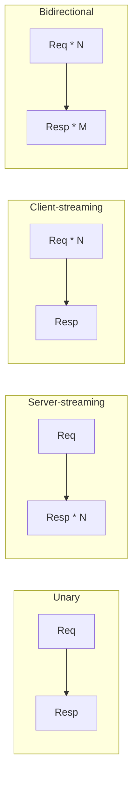
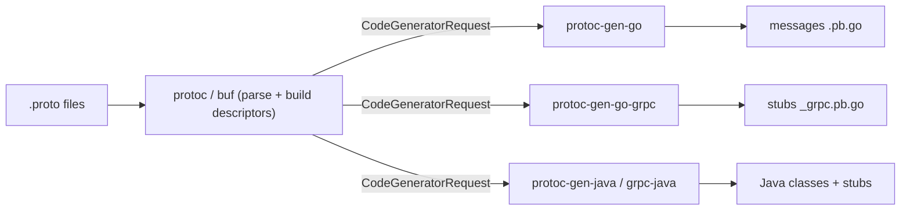
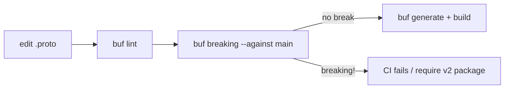

# Service & Message Definition (proto3)

gRPC is **contract-first**: before any client or server code exists, you write a
`.proto` file that declares *services* (collections of remote methods) and *messages*
(the typed request/response payloads). `protoc` (or `buf`) compiles that contract into
strongly-typed client stubs and server skeletons in each target language. The `.proto`
is the single source of truth — the wire format, the generated APIs, and the
compatibility guarantees all flow from it.

This topic is about **authoring that contract well**: how to declare a service and its
four method shapes, why every request and response must be a *message* (never a bare
scalar), how packages/imports/options organize a schema, how codegen works, and the
design discipline that lets a schema evolve for years without breaking callers.

> [!KEY-TAKEAWAY]
> A gRPC RPC is `rpc Method(RequestMessage) returns (ResponseMessage)`. Inputs and
> outputs are **always message types** — wrap even a single scalar in its own message so
> you can add fields later without a breaking change. The `stream` keyword on either side
> selects one of the four call types. Design **one request and one response message per
> RPC** so each method evolves independently, and let `buf` lint and gate breaking
> changes in CI.

For how Protobuf encodes fields on the wire (varints, tags, wire types) see
`protocol-buffers-syntax-types-encoding`; for the streaming *runtime* semantics see
`four-rpc-types-and-streaming`; for what "breaking" precisely means see
`schema-evolution-and-compatibility`. HTTP/2 framing/TLS lives in `networking`.

## Defining a service

A **service** is a named set of RPC methods. In proto3 syntax:

```proto
syntax = "proto3";

package acme.orders.v1;

service OrderService {
  // Unary: one request, one response.
  rpc GetOrder(GetOrderRequest) returns (GetOrderResponse);
  rpc CreateOrder(CreateOrderRequest) returns (CreateOrderResponse);
}
```

**What codegen produces from this** (mechanism):

- A **client stub** class/interface with one method per `rpc`. Calling `GetOrder(req)`
  marshals `req` into Protobuf bytes, opens an HTTP/2 stream, and sends a request whose
  `:path` header is derived from the fully-qualified name: `/acme.orders.v1.OrderService/GetOrder`.
- A **server base class / service interface** you implement. The generated dispatcher
  reads the `:path`, decodes the request bytes into a `GetOrderRequest`, and invokes your
  handler.

That `:path` is the wire-level "address" of the method. It is
`/<package>.<Service>/<Method>` — which is why the package and service names are part of
your public contract and must never be renamed casually.

> [!TIP]
> Method names, service names, and the package together form the HTTP/2 `:path`. Renaming
> any of them is a breaking change even though the *messages* are untouched — old clients
> keep calling the old path and get `UNIMPLEMENTED`.

## The four RPC method signatures

The `stream` keyword, applied to the request type, the response type, both, or neither,
selects the call type. This is a top interview recall item.

| Type | Signature | Semantics |
|---|---|---|
| **Unary** | `rpc M(Req) returns (Resp)` | one message each way — the classic request/response |
| **Server-streaming** | `rpc M(Req) returns (stream Resp)` | one request, a stream of responses |
| **Client-streaming** | `rpc M(stream Req) returns (Resp)` | a stream of requests, one response |
| **Bidirectional** | `rpc M(stream Req) returns (stream Resp)` | independent read/write streams over one call |

```proto
service Chat {
  rpc SendMessage(Message) returns (Ack);                       // unary
  rpc Subscribe(SubscribeRequest) returns (stream Message);     // server-streaming
  rpc UploadLog(stream LogChunk) returns (UploadSummary);       // client-streaming
  rpc Converse(stream Message) returns (stream Message);        // bidi
}
```

**Mechanism:** every call type maps onto exactly **one HTTP/2 stream**. Unary is not a
special protocol — it is just a stream that carries a single message in each direction.
Streaming methods carry multiple length-prefixed messages. Bidi's two directions are
independent: the server can start replying before the client finishes sending. The
`stream` keyword only changes the *cardinality* the generated API exposes (single value
vs an iterator/observable) and how many `DATA` frames flow; the framing and status model
are identical.



The full runtime behavior (flow control, half-close, backpressure) is covered in
`four-rpc-types-and-streaming`.

## Requests and responses must be message types

An RPC's input and output are **always named message types** — you cannot write
`rpc Ping(string) returns (bool)`. The compiler rejects scalars, enums, maps, and
repeated fields in those positions. You must wrap them:

```proto
// WRONG — will not compile:
// rpc GetUserName(int64) returns (string);

// RIGHT:
message GetUserNameRequest  { int64 user_id = 1; }
message GetUserNameResponse { string name = 1; }
rpc GetUserName(GetUserNameRequest) returns (GetUserNameResponse);
```

**Why this is a rule and not just style.** A message is an *open, extensible envelope*:
you can add fields to it later and old/new peers still interoperate (unknown fields are
ignored/preserved). A bare scalar is a *closed* shape — the day you need a second
parameter or a pagination token you have nowhere to put it, and changing the method
signature is a hard break. Wrapping from day one makes every RPC forward-compatible by
construction.

> [!WARNING]
> Even for a "trivial" one-field RPC, use a wrapper message rather than reusing a
> well-known type like `google.protobuf.StringValue`. If tomorrow you need a `locale` or a
> `page_token`, you add a field to *your* message — a non-breaking change. If the request
> was a raw `StringValue`, adding a parameter forces a new method or a breaking signature
> change. "One request message and one response message per RPC" is the single most
> repeated piece of Google API design advice.

## Package and namespacing

Every `.proto` should declare a `package` on the second line:

```proto
syntax = "proto3";
package acme.orders.v1;
```

The package does three things:

1. **Prevents name collisions** across `.proto` files — `acme.orders.v1.Order` and
   `acme.billing.v1.Order` are distinct fully-qualified names.
2. **Becomes part of the RPC path** on the wire (`/acme.orders.v1.OrderService/GetOrder`).
3. **Seeds the default namespace/module** in generated code for languages that lack an
   explicit option (though you usually override this with a language option — see below).

**Versioning convention:** put a major version in the package (`acme.orders.v1`,
`acme.orders.v2`). A backward-incompatible redesign becomes a *new package* living
side-by-side, so both versions can be served during migration. This is the
Google/AIP-style convention and shows up constantly in real APIs.

> [!TIP]
> The package is part of your wire contract. Choose it deliberately (`<org>.<domain>.<vN>`)
> and treat renaming it as a breaking change — every client's generated `:path` changes.

## Imports and `import public`

Split large schemas across files and pull in shared definitions with `import`:

```proto
import "acme/type/money.proto";              // use acme.type.Money in this file
import "google/protobuf/timestamp.proto";    // well-known type
```

`import` makes the imported file's types visible **only in the importing file** — it is
*not* transitive. If file A imports B, and C imports A, then C does **not** automatically
see B's types.

`import public` makes the import **transitive**, re-exporting the imported types to
anyone who imports the current file. This is the tool for building a facade/aggregator
`.proto` or for safely relocating definitions:

```proto
// order_api.proto
import public "acme/orders/order.proto";  // anyone importing order_api also sees Order
```

> [!WARNING]
> `import public` is how you move a message to a new file *without breaking* consumers:
> leave a stub file at the old path that `import public`s the new location, so existing
> `import "old/path.proto"` statements keep resolving the type. Plain `import` would break
> those consumers.

## File options for generated code

**Options** customize generated code without affecting the wire format. They are metadata
for the code generators. Common file-level options:

```proto
option go_package   = "github.com/acme/orders/genpb/ordersv1;ordersv1";
option java_package = "com.acme.orders.v1";
option java_multiple_files = true;   // one .java file per message, not one giant outer class
option java_outer_classname = "OrderProto";
option csharp_namespace = "Acme.Orders.V1";
option optimize_for = SPEED;         // SPEED | CODE_SIZE | LITE_RUNTIME
```

Key points interviewers probe:

- **`go_package`** is effectively required for Go generation; the part after `;` sets the
  Go package identifier. Without it protoc-gen-go errors or guesses badly.
- **`java_package`** overrides the default (which would be the proto `package`); combined
  with `java_multiple_files = true` you avoid the giant nested wrapper class.
- Options **do not change bytes on the wire** — two schemas that differ only in options
  are wire-compatible. They only affect the *shape of generated source*.
- `LITE_RUNTIME` produces a smaller runtime (drops reflection/descriptors) — useful on
  Android/embedded, at the cost of some features.

## Code generation: protoc, plugins, and buf

The `.proto` is compiled by a **compiler front-end** plus a **language plugin back-end**.



**Mechanism:** `protoc` parses the `.proto`, resolves imports, and builds a
`FileDescriptorSet`. For each `--<lang>_out` it spawns a plugin binary named
`protoc-gen-<lang>` and hands it a `CodeGeneratorRequest` (the descriptors) over stdin;
the plugin returns a `CodeGeneratorResponse` (the source files) over stdout. This plugin
protocol is why anyone can add a language or a custom generator (docs, validators, mocks).

Note the split in modern toolchains: **messages** and **service stubs** are generated by
*different* plugins (e.g. `protoc-gen-go` for messages, `protoc-gen-go-grpc` for the
service stubs). A raw protoc invocation:

```bash
protoc \
  --go_out=. --go_opt=paths=source_relative \
  --go-grpc_out=. --go-grpc_opt=paths=source_relative \
  -I proto \
  proto/acme/orders/v1/order.proto
```

**buf** is the modern alternative that most teams now prefer. It wraps codegen with a
declarative `buf.gen.yaml` (no fragile multi-line protoc invocation), does dependency
management via the **Buf Schema Registry (BSR)** instead of vendoring `.proto` files by
hand, and adds first-class **linting** and **breaking-change detection**:

```yaml
# buf.gen.yaml
version: v2
plugins:
  - remote: buf.build/protocolbuffers/go
    out: gen
    opt: paths=source_relative
  - remote: buf.build/grpc/go
    out: gen
    opt: paths=source_relative
```

```bash
buf generate      # codegen for all configured plugins
buf lint          # style/consistency rules
buf breaking --against '.git#branch=main'   # fail the build on breaking changes
```

## Message design best practices

The `.proto` is a long-lived public contract; design it for change.

- **One request message and one response message per RPC.** Do not share a request
  message across two methods, and do not reuse a domain entity (`Order`) as an RPC
  request. Each method must be able to grow its own fields independently. This is the
  core discipline for evolvable APIs.
- **Wrap scalars** (covered above) — never a bare scalar as request/response, and prefer
  your own wrapper message even over well-known wrapper types.
- **Avoid deep nesting.** Deeply nested messages are hard to evolve, hard to field-mask,
  and awkward in generated code. Prefer flatter messages and reference sub-resources by id
  where appropriate.
- **Prefer explicit, semantic types.** Use `enum` (with a `_UNSPECIFIED = 0` zero value)
  over magic ints/strings; use `google.protobuf.Timestamp`/`Duration` over raw epoch
  ints; model money as a dedicated `Money{ currency, units, nanos }` message, not a
  float. Never use floating point for currency.
- **Reserve removed fields.** When you delete a field, `reserved` its number and name so
  they can never be silently reused with a different type — a classic data-corruption bug.
- **Design for pagination and partial responses** on list/read RPCs (`page_size`,
  `page_token`; field masks — next section).

```proto
message ListOrdersRequest {
  string customer_id = 1;
  int32  page_size   = 2;
  string page_token  = 3;
}

message Order {
  reserved 4;                 // legacy 'status_code' int removed — never reuse tag 4
  reserved "status_code";
  string id       = 1;
  Money  total    = 2;
  OrderStatus status = 3;     // enum, not a bare int
}
```

> [!INTERVIEW]
> "Why one request message per RPC even when two methods take the same fields today?"
> Because the moment one method needs a new parameter, a *shared* request forces the
> change on both — coupling their evolution. Independent messages are nearly free (codegen)
> and buy you decades of independent change. This answer signals you have maintained a
> real API.

## Field masks for partial updates

For an `Update` RPC, how does the server know which fields the client *intends* to change
versus fields left at their default? proto3's lack of presence on scalars makes a naive
`UpdateOrder(Order)` ambiguous — is `discount = 0` "set discount to zero" or "leave it
alone"? The idiomatic answer is `google.protobuf.FieldMask`:

```proto
import "google/protobuf/field_mask.proto";

message UpdateOrderRequest {
  Order order = 1;                          // the new values
  google.protobuf.FieldMask update_mask = 2; // which paths to apply, e.g. ["total","status"]
}
```

**Mechanism:** the mask is a list of field paths (`"order.total"`). The server applies
*only* the masked fields from the payload and ignores the rest. This gives PATCH-like
partial-update semantics that are explicit and unambiguous, and it lets read RPCs return
partial responses (a "read mask") to save bandwidth on large messages. This is the gRPC
analogue of REST's `PATCH` (cross-ref `rest-api-design`).

> [!TIP]
> Field masks solve the proto3 "did they mean to clear it or skip it?" problem for
> updates. The other tool is `optional` (proto3 explicit presence — next section); use
> `optional` when you need presence on a *single* scalar, and a `FieldMask` when the client
> needs to name an arbitrary *set* of fields to touch.

## proto3 field presence on the wire (gotcha)

This is the highest-yield proto3 gotcha and it directly shapes message design.

In proto3, a plain scalar field has **no explicit presence**: it defaults to its zero
value (`0`, `""`, `false`) and — critically — **a field set to its default value is not
serialized on the wire at all**. The encoder omits it; the decoder simply leaves the
field at its default. Consequences:

- You **cannot distinguish** "field absent / never set" from "field explicitly set to the
  default value" for a plain scalar. `count = 0` and "count unset" look identical.
- This is exactly why `Update` RPCs need field masks, and why an enum's `0` value should
  be an explicit `_UNSPECIFIED` sentinel (so "unset" and a real value never collide).

To get **explicit presence** for a scalar in proto3, mark it `optional`:

```proto
message Config {
  optional int32 retry_limit = 1;  // now has has_retry_limit() / presence tracking
}
```

`optional` makes the generated code expose a `has_...()` check and *does* serialize the
field even when it equals the default — because the "field is present" bit is tracked
separately. (Under the hood the compiler implements this as a synthetic one-field
`oneof`.) Message-typed fields and `repeated`/`map` fields already track presence
(a message field is either present or `nil`/absent), so `optional` is only needed for
scalars/enums.

| Aspect | proto3 plain scalar | proto3 `optional` scalar | proto2 scalar |
|---|---|---|---|
| Presence tracked | No | Yes (`has_x`) | Yes (`has_x`) |
| Default sent on wire | No (omitted) | Yes (if set) | Depends |
| Can tell unset vs zero | No | Yes | Yes |
| Custom default values | No (always type zero) | No | Yes (`[default=...]`) |

> [!WARNING]
> "Is a scalar field set to its default value transmitted over the wire in proto3?" — the
> answer is **no** for a plain field (it is omitted to save space), and the receiver
> reconstructs the default. If you actually need to send/detect the zero value, make the
> field `optional`. Getting this wrong causes silent "why didn't my `false`/`0` update
> take effect?" bugs.

## API evolution discipline and buf

The `.proto` is a promise to every deployed client. A well-run gRPC shop encodes that
promise in tooling.

**What is safe (non-breaking) vs breaking** (full treatment in
`schema-evolution-and-compatibility`, summarized here because it drives *definition*
decisions):

- **Safe:** add a new field with a new tag number; add a new method to a service; add a
  new enum value (as long as clients tolerate unknowns); add a new message. Old peers
  ignore what they do not understand.
- **Breaking:** change a field's tag number; change a field's type; rename a field where a
  JSON/text mapping is in play; rename/remove a method, service, or package; reuse a
  reserved tag.

**buf's role:** `buf breaking` compiles the proposed schema against a baseline (a git ref
or a BSR module) and *fails CI* if any incompatible change is detected — so a breaking
change cannot merge accidentally. `buf lint` enforces house style (package must end in a
version, RPC request/response naming, no leading underscores, etc.), nudging you toward
the "one request/response message per RPC, versioned package" discipline automatically.
The **BSR** hosts your modules so consumers depend on a versioned schema module instead of
copying `.proto` files around, and it can generate SDKs on demand.



> [!INTERVIEW]
> Strong signal: "We gate every proto change with `buf lint` + `buf breaking` in CI, and
> publish to the BSR. A breaking change is not a code review debate — the build rejects
> it, and the only way forward is a new versioned package (`v2`)." That is how large
> organizations keep thousands of clients from breaking.

## Common Interview Follow-ups

- **Why must an RPC's request and response be message types, not scalars?** So the
  contract stays extensible — you can add fields later without a breaking signature
  change. A bare scalar is a closed shape with nowhere to grow.
- **What is the difference between the four RPC types at the wire level?** All four are
  one HTTP/2 stream carrying length-prefixed Protobuf messages; they differ only in how
  many messages flow each way. `stream` just changes cardinality and the generated API
  shape, not the framing or status model.
- **Is a proto3 scalar set to its default value sent on the wire?** No — plain scalar
  fields at their default are omitted; the receiver rebuilds the default. Use `optional`
  to get explicit presence and force transmission.
- **How do you do a partial update in gRPC?** A `FieldMask` naming the paths to change,
  because proto3 cannot otherwise distinguish "set to zero" from "leave unchanged."
- **What does `import public` do?** Re-exports imported types transitively — the tool for
  facade files and for relocating a message without breaking existing imports.
- **How would you version a gRPC API for a breaking change?** New major version in the
  package (`acme.orders.v2`), served alongside v1 during migration; enforce with
  `buf breaking` in CI.
- **protoc vs buf?** protoc is the reference compiler + plugin protocol; buf adds
  declarative codegen, dependency management via the BSR, linting, and breaking-change
  detection — the ergonomic, CI-friendly wrapper most teams adopt.
- **Where does the method name live on the wire?** In the HTTP/2 `:path` header as
  `/<package>.<Service>/<Method>`, which is why renaming any of them is breaking.

## References

- gRPC — Basics / Defining the service (grpc.io/docs/languages/*/basics)
- gRPC Core concepts, RPC life cycle (grpc.io/docs/what-is-grpc/core-concepts)
- Protocol Buffers Language Guide (proto3) — services, imports, options, field presence
  (protobuf.dev/programming-guides/proto3)
- Protobuf — Field Presence guide (protobuf.dev/programming-guides/field_presence)
- Protobuf — Best practices / API design (protobuf.dev/best-practices/dos-donts)
- Google API Improvement Proposals (AIP) — standard methods, field masks, versioning
  (aip.dev)
- `google.protobuf.FieldMask`, `Timestamp`, `Duration` well-known types
  (protobuf.dev/reference/protobuf/google.protobuf)
- buf documentation — buf.gen.yaml, buf lint, buf breaking, Buf Schema Registry
  (buf.build/docs)
- gRPC-over-HTTP2 wire protocol (`:path` = `/Service/Method`)
  (github.com/grpc/grpc/blob/master/doc/PROTOCOL-HTTP2.md)
- Cross-references: `protocol-buffers-syntax-types-encoding`,
  `four-rpc-types-and-streaming`, `schema-evolution-and-compatibility`,
  `networking/http2-http3-quic`
