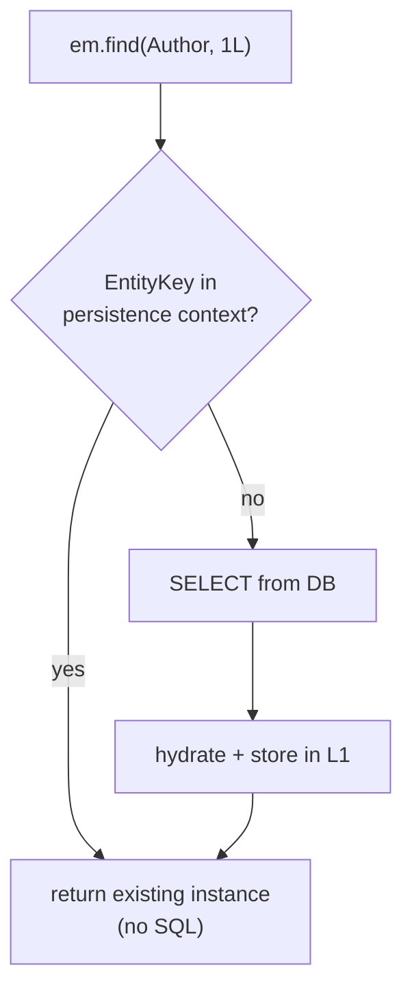
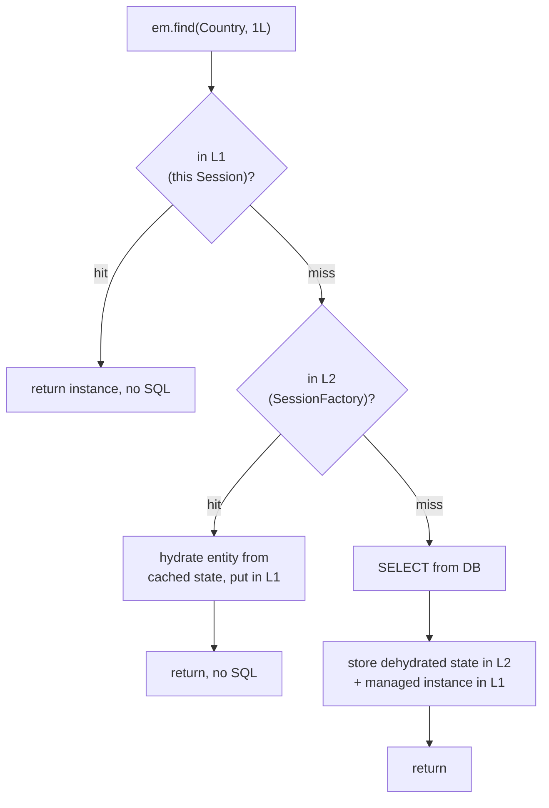
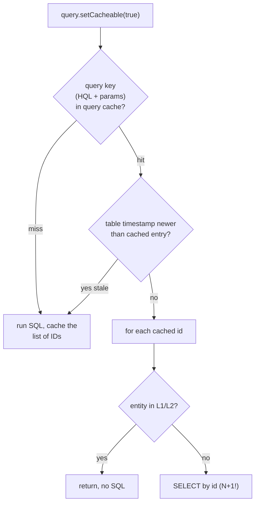

# Caching: First & Second Level Cache

Hibernate has two distinct caches with completely different scopes, lifetimes, and
purposes — and interviewers love to probe whether you can tell them apart. The
**first-level cache (L1)** is *the persistence context itself*: mandatory, per-Session,
and the mechanism behind identity guarantees and dirty checking. The **second-level
cache (L2)** is *optional*, shared across all Sessions at the `SessionFactory` level,
requires a pluggable provider, and is a foot-gun if you cache the wrong data. On top of
L2 sits the separate **query cache**, which is subtle enough to be a net negative in
most systems.

> [!INTERVIEW]
> The single most common confusion this topic exposes: candidates say "Hibernate
> caches entities so the second query is free" without distinguishing *which* cache.
> The L1 cache is why the second `find(Author.class, 1L)` in the *same* transaction
> skips the DB. The L2 cache is why it skips the DB in a *different* transaction on a
> *different* Session. They are not the same thing, and only L1 is on by default.

Underlying distributed-cache infrastructure (Redis, cache invalidation patterns,
write-through vs cache-aside, TTL/eviction policy tradeoffs) lives in
`messaging-databases` — see `messaging-databases/caching-patterns` and
`messaging-databases/redis`. Here we stay at the ORM altitude: what Hibernate's own
caches store, when they hit, and how they go stale.

## First-Level Cache Is the Persistence Context

The first-level cache is not a separate feature you enable — it **is** the persistence
context (`EntityManager` / Hibernate `Session`). Every managed entity lives in a
`Map` keyed by `EntityKey` (entity type + primary key). It is:

- **Mandatory** — you cannot turn it off. Every Session has one.
- **Session-scoped** — bounded to a single `EntityManager`/`Session`, which is
  typically bounded to a single transaction in a Spring app.
- **Not shared** — two concurrent Sessions have completely independent L1 caches.
  Nothing one Session loads is visible to another via L1.

Its job is **identity scope** and **repeated-read avoidance**. Within one Session, a
given database row maps to exactly one Java object instance (the "guaranteed object
identity" / repeatable-read-within-a-Session property):

```java
Author a1 = em.find(Author.class, 1L);   // SELECT ... FROM author WHERE id = 1
Author a2 = em.find(Author.class, 1L);   // NO SQL — served from L1
assert a1 == a2;                          // same instance (== not just equals)
```

The second `find` issues **no SQL** — Hibernate looks up the `EntityKey` in the
persistence context and returns the existing instance. This is also why detached
entity equality and `equals`/`hashCode` matter (see
`hibernate-jpa/entity-lifecycle-states`).



> [!KEY-TAKEAWAY]
> L1 is the persistence context. It gives you (1) guaranteed object identity within a
> Session and (2) avoidance of duplicate SELECTs for the same id in one transaction.
> It is always on and never shared.

## L1 Lifecycle: clear, detach, evict, close

Because L1 lives inside the Session, its contents are governed by the Session's
lifecycle and by explicit eviction:

- `em.clear()` — detaches **all** managed entities; the persistence context is emptied.
  Subsequent `find` for the same id re-hits the DB.
- `em.detach(entity)` (Hibernate `session.evict(entity)`) — removes **one** entity from
  the context; it becomes detached.
- `em.close()` / `session.close()` — closes the Session; everything becomes detached.

A crucial gotcha for long-running or batch operations: the L1 cache **grows unbounded**
for the life of the Session. Inserting a million rows in one transaction without
periodically `flush()` + `clear()` will exhaust the heap, because every persisted entity
is retained in the persistence context. The standard batch idiom flushes and clears
every N entities:

```java
for (int i = 0; i < 1_000_000; i++) {
    em.persist(new LogEntry(...));
    if (i % 50 == 0) {          // batch size
        em.flush();             // push INSERTs to the DB
        em.clear();             // drop them from L1 to free memory
    }
}
```

> [!WARNING]
> The L1 cache is not an LRU cache with a size limit — it holds every entity the
> Session has touched until `clear()`/`close()`. `OutOfMemoryError` during large batch
> jobs is almost always a missing `flush()`+`clear()` loop.

## Second-Level Cache: Shared Across Sessions

The second-level cache is **optional**, scoped to the `SessionFactory` (i.e. the whole
application / persistence unit), and **shared across all Sessions**. Its purpose is to
avoid hitting the database at all for entities that many transactions read repeatedly.

L1 vs L2 at a glance:

| Aspect | First-level (L1) | Second-level (L2) |
|---|---|---|
| Scope | Per `EntityManager`/`Session` | Per `SessionFactory` (app-wide) |
| Shared? | No — private to one Session | Yes — across all Sessions/threads |
| On by default? | Yes, mandatory | No — must be enabled + configured |
| Provider needed? | No | Yes (Ehcache, Infinispan, Caffeine, Hazelcast, …) |
| What's cached | Managed entity **instances** | **Dehydrated** state (see below) |
| Lifetime | Until `clear()`/`close()` | Until evicted / expired / invalidated |
| Concurrency concern | None (single-threaded per Session) | Yes — strategy matters (READ_WRITE etc.) |

The lookup path when both caches are enabled: check L1 first, then L2, then the DB.



## Enabling L2: shared-cache-mode, @Cacheable, @Cache

Turning on L2 takes several coordinated pieces:

1. **A provider on the classpath and configured.** Hibernate 6/7 uses the JCache
   (JSR-107) region factory or a native one. Typical: Ehcache 3 via
   `hibernate.cache.region.factory_class = org.hibernate.cache.jcache.JCacheRegionFactory`,
   or Infinispan for clustered caches.
2. **`hibernate.cache.use_second_level_cache = true`.**
3. **Mark which entities are cacheable** — via the JPA `shared-cache-mode` and/or the
   `@Cacheable` / `@Cache` annotations.

The JPA-standard `shared-cache-mode` (in `persistence.xml`, or
`jakarta.persistence.sharedCache.mode` / Spring's
`spring.jpa.properties.jakarta.persistence.sharedCache.mode`) controls the policy:

| `shared-cache-mode` | Meaning |
|---|---|
| `ALL` | Cache all entities |
| `NONE` | Cache nothing (L2 effectively off) |
| `ENABLE_SELECTIVE` | Cache only entities annotated `@Cacheable(true)` (the common choice) |
| `DISABLE_SELECTIVE` | Cache all entities **except** those `@Cacheable(false)` |
| `UNSPECIFIED` | Provider-specific default |

`@Cacheable` is the **JPA-standard** (`jakarta.persistence.Cacheable`) boolean marker.
Hibernate's own `@Cache` (`org.hibernate.annotations.Cache`) is richer — it also sets
the **concurrency strategy** and region:

```java
@Entity
@Cacheable                                              // JPA: eligible for L2
@Cache(usage = CacheConcurrencyStrategy.READ_ONLY)      // Hibernate: strategy
class Country {
    @Id Long id;
    String isoCode;
    String name;
}
```

> [!TIP]
> Use `ENABLE_SELECTIVE` + `@Cacheable` so caching is opt-in per entity. `ALL` is
> dangerous: it caches write-heavy and large entities that should never be in L2.

## L2 Concurrency Strategies

The `CacheConcurrencyStrategy` (set via Hibernate's `@Cache(usage = ...)`) decides how
concurrent reads/writes to a cached entity are coordinated. Choosing the wrong one is
how you serve stale or even corrupted data.

| Strategy | Use when | Mechanism / cost |
|---|---|---|
| `READ_ONLY` | Data **never** changes after insert (reference/lookup tables) | Cheapest, no locking. Modifying a `READ_ONLY` entity throws an exception. |
| `NONSTRICT_READ_WRITE` | Rare updates, occasional stale reads tolerable | On update, **evicts** the entry (no locking). Small window where a stale value can be read. |
| `READ_WRITE` | Read-mostly data that does get updated, strong-ish consistency needed | Uses **soft locks** on the cache entry during the transaction; more overhead. |
| `TRANSACTIONAL` | Full JTA/XA transactional consistency needed | Cache participates in the JTA transaction (needs a transactional provider like Infinispan). Highest overhead, rarely used. |

Key mechanism points interviewers push on:

- **`READ_ONLY`** does no locking and is the fastest, but any attempt to update such an
  entity results in an error — it's genuinely for immutable data.
- **`NONSTRICT_READ_WRITE`** does not lock; on a write it just **invalidates** (removes)
  the entry so the next read reloads from DB. Because invalidation isn't perfectly
  synchronized with the DB commit, there's a brief staleness window — never use it where
  a stale read is unacceptable.
- **`READ_WRITE`** maintains soft locks so a concurrent transaction sees a consistent
  view; it's the safe default for mutable-but-read-mostly data, at higher cost.
- **`TRANSACTIONAL`** is only meaningful with a JTA transaction manager and a
  transactional cache provider.

> [!WARNING]
> None of these strategies make L2 safe for data changed **outside** Hibernate. A raw
> SQL `UPDATE`, a DB trigger, a bulk JPQL `UPDATE`/`DELETE`, or a second application
> writing the same table will **not** invalidate the L2 cache — Hibernate keeps serving
> the stale cached copy. This is the classic L2 staleness trap.

## L2 Stores Dehydrated State, Not Objects

A frequently-missed detail: the L2 cache does **not** store your entity objects. It
stores a **dehydrated** representation — essentially the disassembled column values (a
`Map`/array of the primitive/identifier state), keyed by entity id, with no object
references and no proxies.

Why it matters:

- On an L2 hit, Hibernate **rehydrates** a *new* entity instance from the cached state
  into the current Session. You never share a mutable object across threads via L2, so
  there's no thread-safety hazard from sharing instances.
- Associations are stored as **foreign-key identifiers**, not as the associated objects.
  A cached `Author` holding a `@ManyToOne Publisher` stores the `publisher_id`, and the
  `Publisher` is resolved separately (from L2 if it too is cached, else the DB).
- This is also why L2 cannot cache things that aren't part of the entity's persistent
  state.

> [!KEY-TAKEAWAY]
> L2 caches **data (dehydrated state) by id**, not object instances. Each hit produces a
> freshly hydrated entity in the requesting Session — which is exactly why the shared
> cache is safe to read from many threads.

## What L2 Does NOT Cache by Default

Enabling `@Cache` on an entity caches **that entity's own scalar state, by id**. It does
*not* automatically cache:

- **Collections / associations.** A `@OneToMany` or `@ManyToMany` collection is a
  *separate* cache region and needs its **own** `@Cache` annotation on the collection
  field. Otherwise, even with the parent cached, navigating the collection re-queries the
  DB (and can reintroduce N+1 — see `hibernate-jpa/fetching-lazy-eager-n-plus-one`).

  ```java
  @Entity @Cacheable @Cache(usage = READ_WRITE)
  class Author {
      @Id Long id;

      @OneToMany(mappedBy = "author")
      @Cache(usage = CacheConcurrencyStrategy.READ_WRITE)   // needed to cache the collection
      List<Book> books = new ArrayList<>();
  }
  ```

  Note the collection cache stores only the **ids** of the associated entities; the
  `Book` entities themselves must also be cached (via their own `@Cache`) or each id is
  re-fetched.

- **Query results.** `find`/`getReference` by id use the entity cache, but results of a
  JPQL/HQL/Criteria *query* are **not** cached unless you explicitly enable the separate
  **query cache** (next section).

## The Query Cache Is Separate (and Often a Net Negative)

The query cache is an **additional, opt-in** cache that stores the results of a specific
query. It must be enabled separately
(`hibernate.cache.use_query_cache = true`) **and** requested per query
(`query.setHint("org.hibernate.cacheable", true)` or `setCacheable(true)`).

Critical mechanism detail: the query cache **does not store entities**. It stores only
the **primary keys** returned by the query (keyed by the query string + bind
parameters). To materialize the results it then looks each id up — in L1, then the L2
entity cache, then the DB. So:

> [!WARNING]
> The query cache is nearly useless (or actively harmful) unless the entities it returns
> are **also** in the L2 entity cache. If the entity isn't L2-cached, a query-cache "hit"
> still fires N SELECTs by id — you get an N+1 *plus* the overhead of maintaining the
> query cache. Enable the query cache only alongside entity caching for the same types.

The bigger reason it's often a net negative:

- **Invalidation is coarse.** The query cache uses an `UpdateTimestampsCache` that tracks
  the last-write timestamp per table (query space). **Any** insert/update/delete to a
  table invalidates **every** cached query touching that table. On a table with any write
  traffic, cached queries are evicted constantly, so the hit rate collapses while you
  still pay the maintenance cost.
- It only helps for **frequently-repeated queries with identical parameters** against
  **rarely-written** tables.



## When L2 Helps vs When It Hurts

L2 is a specialized tool, not a general speedup. The senior judgment:

**Good candidates for L2:**
- Read-mostly / write-rarely **reference data**: countries, currencies, product
  categories, config/lookup tables.
- Entities read far more often than modified, where a small staleness window is
  acceptable.
- Data whose access pattern is **by primary key** (L2 is a by-id cache).

**Bad candidates / anti-patterns:**
- **Write-heavy** entities — constant invalidation kills the hit rate and adds overhead.
- **Large** entities or huge tables — memory blow-up and low reuse.
- Data mutated **outside Hibernate** (raw SQL, other apps, bulk JPQL, triggers) — L2 goes
  stale silently.
- Using L2 as a substitute for fixing N+1 or missing indexes — fix the query first (see
  `hibernate-jpa/fetching-lazy-eager-n-plus-one` and `messaging-databases/indexing`).

> [!INTERVIEW]
> "Should we turn on the second-level cache to speed up the app?" is a trap. The staff
> answer: measure first; L2 only helps read-mostly, by-id, reference-style data, and it
> introduces a distributed-invalidation problem across nodes. For general read scaling,
> an explicit application cache (Redis, cache-aside) with deliberate invalidation is
> usually clearer and easier to reason about — see
> `messaging-databases/caching-patterns`. Reach for L2 when the access is genuinely
> by-entity-id and the data rarely changes.

## Clustered L2 and Invalidation Across Nodes

In a multi-node deployment, each JVM has its own `SessionFactory` and therefore its own
L2. If node A updates a cached entity, node B's L2 must be told, or it serves stale data.
Two approaches:

- **Replicated/distributed cache** (Infinispan, Hazelcast): entries and invalidation
  messages propagate across the cluster over the network. Adds latency and network
  chatter; the invalidation is eventually consistent.
- **Local-only cache** (Ehcache/Caffeine per node): fast, but each node can hold a stale
  copy until its own TTL expires — acceptable only for truly read-mostly data.

This is the same distributed cache-coherency problem covered generally in
`messaging-databases/caching-patterns`; here the Hibernate-specific angle is that L2 is
per-`SessionFactory`, so scaling out multiplies the coherency problem.

## Common Interview Follow-ups

- **"Is the first-level cache on by default? Can you disable it?"** Yes it's always on;
  no you cannot disable it — it *is* the persistence context. You can only `clear()`,
  `detach`/`evict`, or `close` the Session.
- **"Two `find` calls for the same id in one transaction — how many SELECTs?"** One. The
  second is served from L1.
- **"Same two calls in two different transactions with L2 off?"** Two SELECTs — L1 isn't
  shared. With L2 on and the entity `@Cacheable`, the second is an L2 hit (zero SELECTs).
- **"What does L2 actually store?"** Dehydrated state (disassembled column values +
  fk ids) keyed by entity id — not object instances, not proxies.
- **"Does caching an entity cache its collections?"** No. Collections need their own
  `@Cache`, and the associated entities must be cached too or you re-fetch by id.
- **"Why is the query cache often a net negative?"** It stores only ids (so you still
  need the entities cached), and any write to a referenced table invalidates all queries
  over that table, collapsing the hit rate.
- **"You added L2 but still see stale data after a bulk update. Why?"** Bulk JPQL
  `UPDATE`/`DELETE` and raw SQL bypass the L2 invalidation path; the cache keeps the old
  copy until evicted/expired. Evict explicitly (`Cache#evict`) after bulk operations.
- **"Which concurrency strategy for a read-only lookup table?"** `READ_ONLY` — cheapest,
  no locking; updates would throw.
- **"When would you pick `READ_WRITE` over `NONSTRICT_READ_WRITE`?"** When updates happen
  and you can't tolerate the brief stale-read window `NONSTRICT_READ_WRITE` allows;
  `READ_WRITE` uses soft locks for consistency at higher cost.
- **"How do you prevent OOM when persisting a million rows?"** `flush()` + `clear()` in
  batches so the L1 cache doesn't retain every entity.

## References

- Jakarta Persistence 3.1/3.2 spec — `Cacheable`, `SharedCacheMode`, `Cache` API
  (`EntityManagerFactory#getCache`).
- Hibernate ORM 6/7 User Guide — "Caching": second-level cache, `@Cache`,
  `CacheConcurrencyStrategy`, region factories (JCache/Ehcache/Infinispan), query cache.
- Hibernate User Guide — "Batch processing" (flush/clear idiom for L1).
- Cross-references: `messaging-databases/caching-patterns` (cache-aside, write-through,
  invalidation), `messaging-databases/redis`, `messaging-databases/indexing`,
  `hibernate-jpa/fetching-lazy-eager-n-plus-one` (N+1),
  `hibernate-jpa/entity-lifecycle-states` (identity, detach), and `spring-*` for the
  Spring transaction/Session-per-request boundary.
