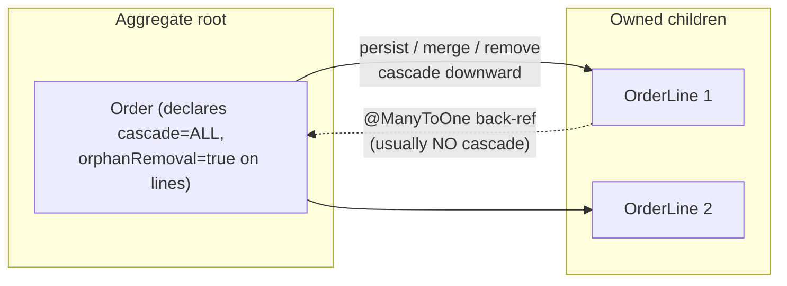
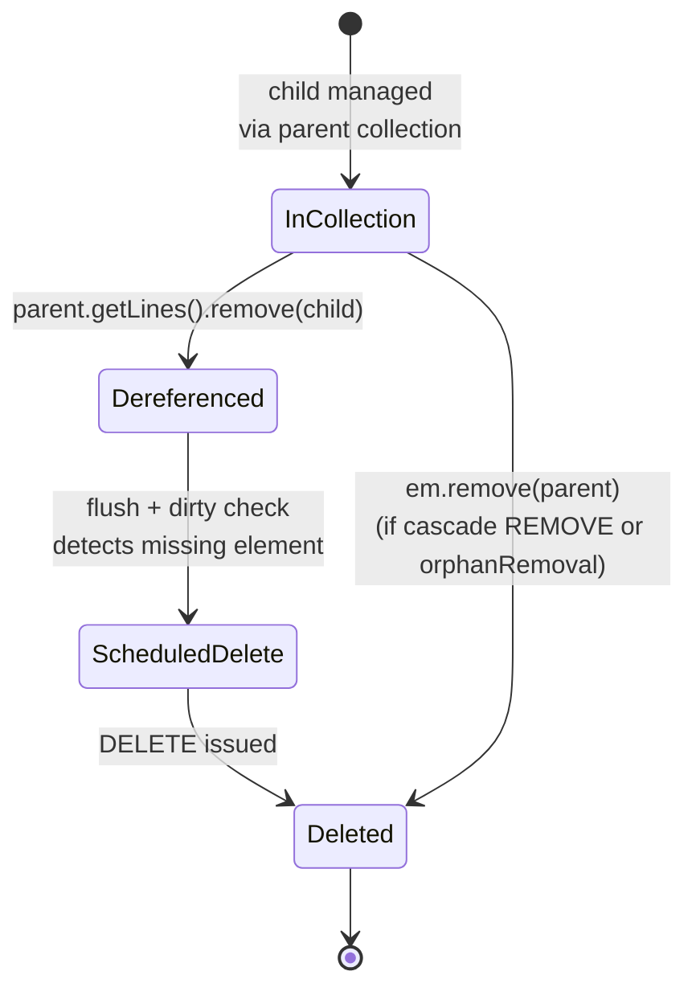

# Cascade Types & Orphan Removal

Cascading is how JPA lets you propagate an entity-manager operation (`persist`,
`merge`, `remove`, `refresh`, `detach`) from a **parent** entity to the entities
**associated** with it, so you don't have to call the operation on every child by
hand. **Orphan removal** is a related-but-distinct feature that deletes a child row
when it is *disconnected* from its parent. Together — `cascade = ALL` +
`orphanRemoval = true` — they model a true parent/child **aggregate** where the
children have no life of their own outside the parent.

This topic is a classic source of interview "gotcha" questions because two features
that look similar (`CascadeType.REMOVE` vs `orphanRemoval`) behave differently, and
because cascading the *wrong* operation across a *shared* association can silently
delete data other entities still reference.

> [!KEY-TAKEAWAY]
> Cascade answers "when I do X to the parent, do X to the children too."
> Orphan removal answers "when a child is removed from the parent's collection,
> delete that child row." They overlap for `remove`/delete but are **not** the same
> feature, and only orphan removal reacts to *dereferencing*.

---

## What Cascading Is and How Hibernate Applies It

By default JPA operations are **not transitive**. If you call
`entityManager.persist(order)` and `order` holds a collection of new, transient
`OrderLine` objects, JPA persists only the `Order`. On flush Hibernate will try to
insert the `Order` row, and — depending on the mapping — either fail with a
`TransientObjectException`/`PropertyValueException` (because the child references a
transient instance) or simply leave the children unsaved. Cascading tells the
provider to walk the association and apply the same operation to the target(s).

Mechanically, when you invoke an `EntityManager` operation, Hibernate consults the
association's **cascade styles**. For each associated entity reachable through a
cascaded association, it schedules the *same* lifecycle action against that entity's
own persister, recursing through the object graph. This all happens in memory
against the **persistence context** (see
`hibernate-jpa/session-entitymanager-persistence-context`); the actual SQL is
emitted later, in dependency order, when the context **flushes** (see
`hibernate-jpa/transactions-dirty-checking-flushing`).

```java
@Entity
class Order {
    @Id @GeneratedValue Long id;

    // Cascade PERSIST + MERGE + REMOVE (and orphan removal) to the lines.
    @OneToMany(mappedBy = "order",
               cascade = CascadeType.ALL,
               orphanRemoval = true)
    List<OrderLine> lines = new ArrayList<>();
}

@Entity
class OrderLine {
    @Id @GeneratedValue Long id;
    @ManyToOne(fetch = FetchType.LAZY)
    @JoinColumn(name = "order_id")
    Order order;                    // owning side of the FK
}
```

```java
Order o = new Order();
o.lines.add(new OrderLine(o));
o.lines.add(new OrderLine(o));
em.persist(o);      // PERSIST cascades: one INSERT for the order, one per line
```

Generated SQL on flush:

```sql
insert into "Order" (id) values (?)
insert into OrderLine (order_id, id) values (?, ?)
insert into OrderLine (order_id, id) values (?, ?)
```

> [!TIP]
> Cascading operates on the **object graph in memory**, not on the database. It is a
> convenience for propagating `EntityManager` calls — it is *not* the same thing as
> an `ON DELETE CASCADE` foreign-key constraint in DDL. The DB-level constraint is a
> separate mechanism (owned by `messaging-databases`); you can even have both, and
> they can disagree.

---

## The JPA CascadeType Values

`jakarta.persistence.CascadeType` (Jakarta Persistence 3.1/3.2 — the
`jakarta.persistence` namespace, **not** the legacy `javax.persistence`) defines
these values. Each maps a cascade style to the matching `EntityManager` method:

| CascadeType | Propagates | When it fires |
|---|---|---|
| `PERSIST` | `em.persist(parent)` | Inserting a new parent also persists new children |
| `MERGE` | `em.merge(parent)` | Merging a detached parent merges its children |
| `REMOVE` | `em.remove(parent)` | Removing the parent removes its children |
| `REFRESH` | `em.refresh(parent)` | Refreshing re-reads children from the DB too |
| `DETACH` | `em.detach(parent)` | Detaching evicts children from the context too |
| `ALL` | all of the above | Shorthand for `{PERSIST, MERGE, REMOVE, REFRESH, DETACH}` |

You set cascade **on the association**, as an attribute of the mapping annotation:

```java
@OneToMany(cascade = {CascadeType.PERSIST, CascadeType.MERGE})
List<OrderLine> lines;
```

Key precision points interviewers probe:

- **There is no default cascade.** An association with no `cascade` attribute
  propagates *nothing*; you must persist/remove children yourself.
- **`CascadeType.ALL` does NOT include `orphanRemoval`.** Orphan removal is a
  *separate* boolean attribute on `@OneToOne`/`@OneToMany`, not a cascade type.
- **`flush` and `find` are not cascade types.** Flush walks the whole context
  anyway; `find` loads by id and has nothing to cascade.
- Cascade is **directional**: it fires when you call the operation on the entity
  that *declares* the cascade on its association, walking toward the target.

---

## Hibernate-Native Cascade Types

Hibernate's native `org.hibernate.annotations.CascadeType` (used via
`@org.hibernate.annotations.Cascade`) is a **superset** of the JPA values and adds
styles the spec never defined:

| Hibernate-native | Meaning |
|---|---|
| `SAVE_UPDATE` | Cascades the legacy Hibernate `Session.saveOrUpdate()` |
| `REPLICATE` | Cascades `Session.replicate()` (copy state into another DB) |
| `LOCK` | Cascades `Session.lock()` / reattachment to associated entities |
| `PERSIST / MERGE / REMOVE / REFRESH / DETACH` | Mirror the JPA values |

Notes for interviews:

- Hibernate's native `CascadeType.DELETE` corresponds to JPA's `REMOVE`; native
  `SAVE_UPDATE` roughly corresponds to `PERSIST` + reattach semantics.
- These require the **native** `@Cascade` annotation. You'd only reach for them when
  using Hibernate-specific `Session` methods (`saveOrUpdate`, `replicate`, `lock`),
  which are increasingly discouraged now that Hibernate 6/7 aligns on the
  JPA/`EntityManager` API. Prefer the JPA `cascade` attribute unless you truly need
  `saveOrUpdate`/`replicate`.
- **`orphanRemoval` is a JPA feature**, not a Hibernate-native cascade style — but
  the *behavior* originated in Hibernate's old `cascade="all-delete-orphan"` and was
  standardized into JPA 2.0. In modern code use `orphanRemoval = true`.

---

## Where Cascade Is Declared and Direction

Cascade is a property of a **single association**, so in a bidirectional
relationship each side has its **own** cascade settings. Cascading on
`Order.lines` does not imply anything about `OrderLine.order`.

- **You almost always cascade from the "parent"/aggregate-root side toward the
  children** (`@OneToMany` on `Order.lines`), not the other way.
- Cascading `REMOVE` from the **child's** `@ManyToOne` back to the parent is a
  dangerous mistake: `em.remove(line)` would then try to delete the whole `Order`
  (and, via cascade on the order, potentially every sibling line). Interviewers love
  this trap.
- Cascade interacts with the **owning side** of the relationship for FK management.
  In a bidirectional `@OneToMany(mappedBy="order")`, the `@ManyToOne` side owns the
  `order_id` FK. If you forget to set `line.setOrder(order)` you can get a spurious
  `UPDATE` (to null the FK) or a constraint violation even when cascade is correct —
  a separate mapping concern covered in
  `hibernate-jpa/entity-mappings-associations`.



---

## When to Cascade vs When Not To

The decision is a **modeling** decision, not a performance tweak. Ask: *does the
child have an independent existence, or is it wholly owned by this parent?*

**Cascade (composition / "owns-a"):** the child is meaningless without the parent
and is not shared. Classic examples:

- `Order` → `OrderLine` (a line item exists only within its order)
- `Post` → `Comment` (if comments die with the post)
- `Invoice` → `InvoiceItem`

Here `cascade = ALL` + `orphanRemoval = true` is appropriate: create, update, and
delete flow through the aggregate root.

**Do NOT cascade (association / shared reference):** the child is a shared,
independently-managed entity.

- `Employee` → `Department` (many employees share one department — cascading
  `REMOVE` when you delete an employee would delete the department out from under
  everyone else!)
- `Book` → `Author` in a `@ManyToMany` (authors are shared; cascading `REMOVE`
  could delete an author referenced by other books)
- Any reference-data / lookup entity (`Country`, `Currency`, `Category`).

> [!WARNING]
> Cascading `REMOVE` (or `ALL`) across a **shared** association is one of the most
> destructive ORM bugs. Deleting one `Employee` can delete a `Department` that
> dozens of other employees still point at, causing FK violations or silent data
> loss. Only cascade `REMOVE` when the association expresses **exclusive
> ownership**. For `@ManyToMany`, cascading `REMOVE` is almost never correct.

A safe middle ground for shared references is to cascade only `PERSIST` and `MERGE`
(so you can save a new graph in one call) while **never** cascading `REMOVE`.

This ownership question is exactly the DDD **Aggregate** boundary — the parent is
the aggregate root and children are internal to the aggregate. See
`system-design/ddd-aggregates` (data-modeling altitude) for the domain-modeling
rationale; here we stay at the ORM mechanism.

---

## orphanRemoval vs CascadeType.REMOVE

This is *the* headline distinction of the topic. Both can cause a child row to be
`DELETE`d, but they trigger on **different events**:

| | `CascadeType.REMOVE` | `orphanRemoval = true` |
|---|---|---|
| Fires when… | you call `em.remove(parent)` | a child is **removed from the collection** / the reference is set to null |
| Reacts to dereferencing a child? | **No** | **Yes** |
| Deletes children when parent is removed? | Yes | Yes (a removed parent orphans all children) |
| Semantics | "cascade my explicit delete" | "private ownership — child can't outlive the association" |
| Where declared | `cascade` attribute | separate `orphanRemoval` boolean |

The crucial case: you keep the parent alive but drop a child from its collection.

```java
Order o = em.find(Order.class, 1L);
OrderLine first = o.getLines().get(0);
o.getLines().remove(first);   // dereference the child
// no em.remove(first) call, parent NOT removed
```

- With **only `CascadeType.REMOVE`** (no orphan removal): nothing is deleted. On
  flush Hibernate merely `UPDATE`s `OrderLine.order_id = NULL` (or, if the FK is
  `NOT NULL`, throws a constraint violation). The child row **survives** as an
  orphan.
- With **`orphanRemoval = true`**: Hibernate detects the child was removed from the
  managed collection and schedules a `DELETE` for that row on flush.

```sql
-- orphanRemoval = true, after removing one line from the collection:
delete from OrderLine where id=?
```

> [!INTERVIEW]
> "You remove an `OrderLine` from `order.getLines()` but never call
> `em.remove(line)`. What SQL runs on flush?" — With `orphanRemoval=true`: a
> `DELETE` of that line. With only `cascade=REMOVE`: an `UPDATE` setting
> `order_id=NULL` (or a `NOT NULL` violation). Naming *why* — orphan removal reacts
> to **dereferencing**, cascade only to an **explicit parent remove** — is the
> senior-level answer.

`orphanRemoval` is only valid on `@OneToOne` and `@OneToMany` (relationships that
express **ownership** of the target). It is illegal on `@ManyToOne`/`@ManyToMany`,
where the target is inherently shared.

---

## orphanRemoval Mechanism and Generated SQL

How does Hibernate *know* a child became an orphan? It tracks the **managed
collection**. When a `@OneToMany`/`@OneToOne` association with `orphanRemoval=true`
is loaded, Hibernate wraps it in a **persistent collection** (e.g.
`PersistentBag`/`PersistentSet`) that records its contents. During
**dirty checking** at flush, Hibernate diffs the current collection against the
snapshot; any element present before but absent now is an orphan and is scheduled
for `DELETE`. (Dirty checking and the flush algorithm are detailed in
`hibernate-jpa/transactions-dirty-checking-flushing`.)



Consequences and edge behavior:

- **Orphan removal implies a delete, not just FK nulling.** Even if the FK column is
  nullable, an orphaned child is `DELETE`d, not detached.
- **Clearing the collection** deletes *all* children: `order.getLines().clear()`
  with `orphanRemoval=true` schedules a `DELETE` per element on flush.
- **Batching:** each orphan is typically a separate `DELETE` unless you enable JDBC
  batching (`hibernate.jdbc.batch_size`) — relevant for
  `hibernate-jpa/performance-tuning-pitfalls`.
- Orphan removal happens at **flush** time within the transaction, obeying the same
  flush ordering rules as other deletes.

---

## Gotchas: Reassigning Collections and Reattachment

Several real-world traps live at the boundary of cascade + orphan removal:

**1. Replacing the whole collection reference.** With `orphanRemoval=true`, do
*not* reassign the collection field to a brand-new instance:

```java
order.setLines(new ArrayList<>(newLines));   // BAD with orphanRemoval
```

Hibernate manages the *original* persistent collection. Reassigning it can throw
`org.hibernate.HibernateException: A collection with orphan deletion was no longer
referenced by the owning entity instance` (a "dereferenced collection" error). The
correct idiom is to **mutate the existing collection**:

```java
order.getLines().clear();          // orphans the old ones -> DELETE
order.getLines().addAll(newLines); // adds the new ones -> INSERT
```

**2. clear()+addAll() deletes then re-inserts.** Even to "keep" some rows, a
`clear()` + re-add can issue `DELETE` for all and `INSERT` for all, losing identity.
Prefer surgical `add`/`remove` when you care about row identity or history.

**3. orphanRemoval + `merge` on a detached graph.** When you `merge` a detached
parent whose collection is missing an element that exists in the DB, orphan removal
kicks in and deletes it. This surprises people who load a partial graph, merge it,
and find children vanished. Load the full collection or manage removals explicitly.

**4. Cascade doesn't fix a broken back-reference.** Cascading `PERSIST` saves the
child, but if you never set the owning `@ManyToOne` (`line.setOrder(order)`) the FK
column is null. Cascade propagates the *operation*, not the *link*. Use a helper:

```java
void addLine(OrderLine l) { lines.add(l); l.setOrder(this); }  // keep both sides
```

**5. `remove` on a detached/transient entity.** `em.remove()` requires a *managed*
instance; cascading `REMOVE` through a detached graph can throw
`IllegalArgumentException`. `merge` first, then `remove`.

> [!WARNING]
> `orphanRemoval` + reassigning the collection field = the classic "collection with
> orphan deletion was no longer referenced" exception. Always mutate the managed
> collection in place; never swap it for a new `List`/`Set` instance.

---

## Modeling a True Parent-Child Aggregate

`cascade = CascadeType.ALL` **plus** `orphanRemoval = true` is the canonical way to
model an entity whose children are **privately owned** and have no lifecycle of
their own — a DDD *aggregate* with the parent as root:

```java
@Entity
class Order {
    @Id @GeneratedValue Long id;

    @OneToMany(mappedBy = "order",
               cascade = CascadeType.ALL,   // persist/merge/remove/refresh/detach
               orphanRemoval = true)        // + delete-on-dereference
    private List<OrderLine> lines = new ArrayList<>();

    public void addLine(OrderLine l)    { lines.add(l); l.setOrder(this); }
    public void removeLine(OrderLine l) { lines.remove(l); l.setOrder(null); }
}
```

With this mapping the entire lifecycle flows through the root:

- `em.persist(order)` inserts the order and all its lines.
- Adding a line and flushing inserts one row.
- `order.removeLine(x)` (dereference) deletes that one row on flush (orphan removal).
- `em.remove(order)` deletes the order and every line (cascade REMOVE).

Why both are needed: `cascade=ALL` alone would *not* delete a line you merely drop
from the collection; `orphanRemoval=true` alone would *not* propagate `persist`,
`merge`, `refresh`, or `detach`. Combined, the children are fully subordinate to the
root — exactly the aggregate invariant you want. External entities should reference
the root (`Order`), never hold their own reference to an internal `OrderLine`. See
`system-design/ddd-aggregates` for the domain rationale; the ORM mechanism is what
we covered above.

> [!KEY-TAKEAWAY]
> `cascade = ALL` + `orphanRemoval = true` = "these children are part of me." Use it
> only for private, non-shared composition. For shared references, cascade at most
> `PERSIST`/`MERGE` and never `REMOVE`.

---

## Common Interview Follow-ups

- **"What's the difference between `CascadeType.REMOVE` and `orphanRemoval=true`?"**
  `REMOVE` cascades an explicit `em.remove(parent)`; `orphanRemoval` also deletes a
  child when it's *removed from the collection* / dereferenced without the parent
  being deleted. Only orphan removal reacts to dereferencing.
- **"Is `orphanRemoval` a `CascadeType`?"** No. It's a separate boolean attribute on
  `@OneToOne`/`@OneToMany`; `CascadeType.ALL` does not include it.
- **"What is the default cascade for `@OneToMany`?"** None — no operations cascade
  unless you specify `cascade`. (Don't confuse with the *fetch* default, which is
  LAZY for `@OneToMany`.)
- **"You remove a child from the collection but the FK is `NOT NULL` and there's no
  orphan removal — what happens?"** Hibernate tries `UPDATE ... SET order_id=NULL`
  and the DB rejects it with a `NOT NULL` constraint violation.
- **"Why did all my children get deleted on `merge`?"** A detached graph missing
  elements + `orphanRemoval=true` deletes the absent children.
- **"Can I put `orphanRemoval` on `@ManyToOne`?"** No — it's only valid on
  ownership-expressing `@OneToOne`/`@OneToMany`.
- **"Cascade `REMOVE` vs DB `ON DELETE CASCADE`?"** Cascade `REMOVE` runs in the
  persistence context (Hibernate issues child `DELETE`s and fires callbacks); DB
  cascade is a constraint enforced by the database and bypasses Hibernate/callbacks.
- **"Why did adding a persisted child throw a transient-object exception?"** You
  didn't cascade `PERSIST` (or didn't persist the child), so Hibernate hit a
  reference to a transient/unsaved instance on flush.

## References

- Jakarta Persistence 3.1 / 3.2 Specification — `CascadeType`, `@OneToMany`,
  `@OneToOne`, and the `orphanRemoval` element (`jakarta.persistence` namespace).
- Hibernate ORM 6.x / 7.x User Guide — "Cascading", "Orphan removal", and
  "Associations"; `org.hibernate.annotations.CascadeType` (native styles).
- Hibernate ORM Javadoc — `org.hibernate.annotations.Cascade`,
  `PersistentCollection` (collection dirty-checking mechanism).
- Cross-references within this library: `hibernate-jpa/entity-lifecycle-states`,
  `hibernate-jpa/transactions-dirty-checking-flushing`,
  `hibernate-jpa/entity-mappings-associations`,
  `hibernate-jpa/session-entitymanager-persistence-context`,
  `hibernate-jpa/performance-tuning-pitfalls`, and `system-design/ddd-aggregates`.
