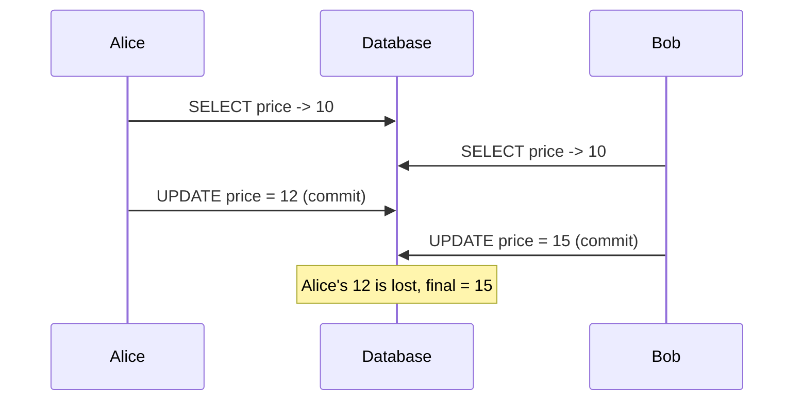
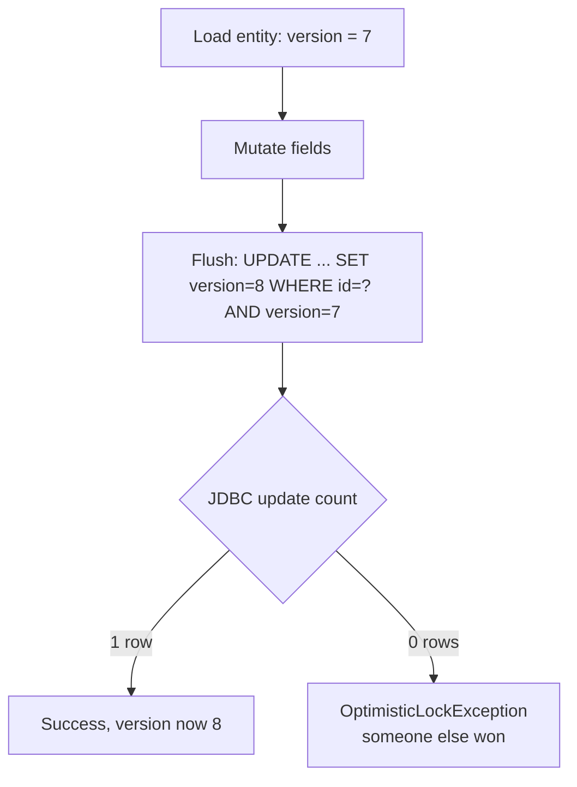

# Concurrency Control: Optimistic vs Pessimistic Locking

Two users load the same product at price $10. Both edit it in their own
transaction. Alice sets it to $12 and commits; Bob sets it to $15 and commits a
second later. Bob's write silently overwrites Alice's — the database never knew
they were racing. Alice's update is **lost**. This is the **lost-update
problem**, and it is the single most common data-integrity bug in read-modify-write
web applications: the gap between *load* and *save* spans a user think-time, an
HTTP round trip, or another transaction, and nothing at the DB level protects the
row across that gap because each `UPDATE` is individually valid.

JPA gives you two families of tools to control this concurrency:

- **Optimistic locking** — assume conflicts are rare. Don't lock anything; detect
  a conflict *at write time* using a `@Version` column and fail the loser with an
  exception so the application can retry. This is the JPA default philosophy and
  the right choice for most read-heavy, low-contention workloads.
- **Pessimistic locking** — assume conflicts are likely. Take a real database lock
  (`SELECT ... FOR UPDATE`) the moment you read, so no one else can touch the row
  until you commit. Correct under high contention or when you cannot retry, at the
  cost of held locks, reduced throughput, and deadlock risk.

> [!KEY-TAKEAWAY]
> Optimistic locking holds **no database locks** — it uses a version column and a
> conditional `UPDATE ... WHERE version = ?` to detect that someone else changed
> the row, throwing `OptimisticLockException` when 0 rows match. Pessimistic
> locking takes a **real DB lock** at read time (`SELECT ... FOR UPDATE`) so the
> conflict is *prevented* rather than detected. Optimistic = detect + retry;
> pessimistic = block + serialize.

For the *database-level* mechanics this builds on — ACID, isolation levels
(READ COMMITTED, REPEATABLE READ, SERIALIZABLE), read/write anomalies (dirty
read, non-repeatable read, phantom, write skew), MVCC, and lock granularity —
see `messaging-databases`. This page stays at the **ORM/JPA-mechanism altitude**:
what the `@Version` column, the lock modes, and `EntityManager.lock()` actually
make Hibernate emit, and how to choose between them. For how Spring's
`@Transactional` proxy opens the transaction that these locks live inside, see
`spring-core`/`spring-boot`; for the Spring Data `@Lock` annotation see also
`spring-data-jpa-repositories`.

---

## The Lost-Update Problem

A **lost update** happens when two transactions both read the same row, both
compute a new value from what they read, and both write back — the second write
clobbers the first, and the first update is silently gone. In an ORM app the
window is huge because the "transaction" is really *load in HTTP request 1, edit
on a form, save in HTTP request 2* (a **conversation** spanning multiple DB
transactions), not a single tight DB transaction.



Crucially, a stricter **isolation level alone does not fix this** for the
conversation case. READ COMMITTED obviously doesn't. Even REPEATABLE READ on
MySQL/InnoDB prevents *non-repeatable reads within one DB transaction* but the two
`UPDATE`s here are in **separate** transactions, so each sees a consistent
snapshot and writes a valid row — no anomaly is detected. Only SERIALIZABLE (or an
application-level version check) reliably catches concurrent read-modify-write, and
SERIALIZABLE is expensive and still can't span two HTTP requests. The clean,
portable ORM solution is a **version column** — optimistic locking — which turns a
lost update into a detectable, retryable conflict regardless of isolation level.

> [!INTERVIEW]
> "Why doesn't setting isolation to REPEATABLE READ fix lost updates in a
> web app?" — Because the read and the write live in *different* transactions
> separated by user think-time; isolation only governs a single transaction's
> view. You need optimistic (`@Version`) or pessimistic locking, which are
> concurrency controls the ORM manages *across* that gap.

---

## Optimistic Locking with @Version

Add a dedicated version property annotated `@Version`. Hibernate manages it
entirely — you never set it yourself.

```java
@Entity
public class Product {
    @Id @GeneratedValue
    private Long id;

    private String name;
    private BigDecimal price;

    @Version
    private long version;   // or int, short, Integer, Long, java.sql.Timestamp, java.time.Instant
    // getters/setters
}
```

**The mechanism.** Every managed entity's version is read into the persistence
context at load time. When Hibernate flushes an `UPDATE` (or `DELETE`) for a
versioned entity, it:

1. Adds the current version to the `WHERE` clause, and
2. Sets `version = version + 1` in the `SET` clause (for numeric versions).

So a dirty-check-generated update looks like:

```sql
-- entity loaded with version = 7
UPDATE product
   SET price = ?, version = 8
 WHERE id = ? AND version = 7
```

Hibernate then inspects the JDBC **update count**. If it is `1`, the row was
untouched since load and the version advanced. If it is `0`, some *other*
transaction already committed a change (incrementing the version to 8, so
`version = 7` matches nothing) — Hibernate raises
`OptimisticLockException` (JPA) / `StaleObjectStateException` (Hibernate native),
which surfaces in Spring as `ObjectOptimisticLockingFailureException`.



> [!KEY-TAKEAWAY]
> Optimistic locking follows **first-commit-wins**: the first transaction to
> commit succeeds; the second discovers 0 rows matched its version and fails.
> This is the opposite of the naive last-write-wins behavior that causes lost
> updates.

**Version types.** JPA permits `int`, `Integer`, `short`, `Short`, `long`,
`Long`, and `java.sql.Timestamp`; Hibernate also supports `java.time.Instant`,
`LocalDateTime`, etc. **Numeric versions are strongly preferred** — a timestamp
version has clock-resolution and clock-skew hazards (two updates in the same
millisecond can collide or, worse, silently miss a conflict), while an integer
monotonic counter is unambiguous. Timestamp versions exist mainly for legacy
schemas that already have a `last_modified` column.

**Gotchas.**
- `@Version` must map to a column that isn't otherwise mutated by the app.
- A `NULL` version column is treated as "new/unversioned" — always give the column
  a `NOT NULL` default or let Hibernate initialize it on `persist`.
- Bulk JPQL/HQL `UPDATE` statements do **not** trigger dirty-check versioning; if
  you want them to bump the version you must set it in the query
  (`UPDATE Product p SET p.price = ?, p.version = p.version + 1 ...`).
- The check protects a single entity row. For consistency across *related* rows
  (e.g. bumping a parent aggregate when a child changes) you need
  `OPTIMISTIC_FORCE_INCREMENT` (below).

---

## Detecting Conflicts: OptimisticLockException & First-Commit-Wins

When the version check fails, JPA throws `jakarta.persistence.OptimisticLockException`.
Because the failure is detected at **flush** — which for a Spring
`@Transactional` method happens at *commit*, often after your method has returned
normally — the exception frequently appears at the transaction boundary, not at
the line that mutated the entity. This surprises people: your service code looks
like it succeeded, but the commit blows up.

In Spring Data JPA the persistence exceptions are translated into the Spring
`DataAccessException` hierarchy: `OptimisticLockException` becomes
`org.springframework.orm.ObjectOptimisticLockingFailureException`. You typically
catch that (or its parent) to trigger a retry.

> [!WARNING]
> Because optimistic lock failures manifest at flush/commit, wrapping just the
> mutation in a `try/catch` inside a `@Transactional` method won't catch them —
> the flush hasn't happened yet. Handle the exception **outside** the transaction
> boundary (e.g. around the service call), or call `flush()` explicitly if you
> need to react earlier. See `spring-core` for how the proxy commits.

`OptimisticLockException` *may* carry the offending entity via
`getEntity()`, but this is not guaranteed for all providers/paths, so retry logic
should generally reload fresh state rather than trust the attached instance.

---

## Optimistic Lock Modes: OPTIMISTIC vs OPTIMISTIC_FORCE_INCREMENT

The presence of `@Version` gives you *implicit* optimistic locking on any entity
you modify. The explicit `LockModeType` values let you extend that check to
entities you only **read**, or force a version bump.

| LockModeType | What it does | Generated effect |
|---|---|---|
| `OPTIMISTIC` (a.k.a. legacy `READ`) | Verify the version of an entity you only **read** is still current **at commit**. Guards against a non-repeatable read affecting your decision. | At flush, a `SELECT version FROM ... WHERE id=? AND version=?` (or comparable check); fails if changed. No `UPDATE` of the row itself. |
| `OPTIMISTIC_FORCE_INCREMENT` (legacy `WRITE`) | Same version check **plus** forcibly increment the version even though the entity's own columns didn't change. | Emits `UPDATE ... SET version = version + 1 WHERE id=? AND version=?`. |

**Why `OPTIMISTIC` (read-verify)?** Suppose you read entity B to make a decision,
then modify entity A. Plain optimistic locking only protects A. If B changed
underneath you between read and commit, your decision was based on stale data but
nothing complains. Requesting `LockModeType.OPTIMISTIC` on B makes Hibernate
re-check B's version at commit and fail if it moved.

**Why `OPTIMISTIC_FORCE_INCREMENT`?** For **aggregate consistency**: when a change
to a *child* should logically invalidate cached decisions about the *parent* /
aggregate root. Example: adding a `LineItem` doesn't change any column on `Order`,
so `Order`'s version wouldn't move — but two threads each adding a line item based
on the same `Order` total could both succeed and violate an invariant (e.g. "order
total <= credit limit"). Locking the `Order` with
`OPTIMISTIC_FORCE_INCREMENT` bumps its version on every child change, so only one
of the racing transactions commits and the other retries. This is the classic
Vaughn-Vernon "version the aggregate root" pattern.

```java
Order order = em.find(Order.class, id, LockModeType.OPTIMISTIC_FORCE_INCREMENT);
order.addLineItem(item);   // Order columns unchanged, but version WILL increment
```

> [!INTERVIEW]
> "You add a child to a collection but the parent's own fields don't change — how
> do you make concurrent additions conflict-detectable?" —
> `OPTIMISTIC_FORCE_INCREMENT` on the aggregate root forces a version bump so the
> parent acts as the concurrency guard for the whole aggregate.

---

## Pessimistic Locking: PESSIMISTIC_READ, PESSIMISTIC_WRITE, PESSIMISTIC_FORCE_INCREMENT

Pessimistic locking asks the **database** to take a real lock the moment you read,
so concurrent access blocks until you commit or roll back. You *prevent* the
conflict instead of detecting it. No `@Version` column is required (though the two
can be combined).

| LockModeType | Intent | Typical generated SQL (dialect-dependent) |
|---|---|---|
| `PESSIMISTIC_READ` | **Shared** lock — others may also read-lock, but no one can write until you release. | `SELECT ... FOR SHARE` (PostgreSQL) / `LOCK IN SHARE MODE` (older MySQL). Some dialects with no shared-lock syntax fall back to `FOR UPDATE`. |
| `PESSIMISTIC_WRITE` | **Exclusive** lock — no other reader-with-lock or writer until release. The common choice. | `SELECT ... FOR UPDATE` |
| `PESSIMISTIC_FORCE_INCREMENT` | Exclusive lock **and** increment the `@Version` column, even without other changes. Requires a `@Version` field. | `SELECT ... FOR UPDATE` then `UPDATE ... SET version = version + 1` |

```java
// exclusive row lock held until the surrounding transaction commits
Account acct = em.find(Account.class, id, LockModeType.PESSIMISTIC_WRITE);
// -> SELECT ... FROM account WHERE id = ? FOR UPDATE
acct.debit(amount);   // no other tx can read-for-update or write this row meanwhile
```

**Mechanism & scope.** The lock is a **database** lock scoped to the current DB
transaction; it is released on commit or rollback. Therefore pessimistic locking
*requires an active transaction* — you cannot hold a `FOR UPDATE` lock across a
detached conversation the way optimistic versioning spans HTTP requests. The exact
SQL and lock semantics are the database's, not Hibernate's (see
`messaging-databases` for `FOR UPDATE`/`FOR SHARE`, gap locks, and MVCC read
behavior). Hibernate's job is to translate the `LockModeType` into the right
dialect clause via the `Dialect`'s lock-mode support.

> [!WARNING]
> Pessimistic locking scales poorly and invites **deadlocks**: two transactions
> that lock rows A then B versus B then A will deadlock, and the DB kills one.
> Always acquire locks in a consistent order, keep the locked transaction short,
> and set a lock timeout. It's the right tool for genuinely high-contention or
> non-retryable operations (financial ledgers, seat/inventory reservation), not a
> default.

---

## Lock Timeouts & Deadlock Handling

A `FOR UPDATE` that can't acquire the lock will, by default, **block** until the
holder commits. To avoid indefinite waits you pass a timeout hint:

```java
Map<String,Object> props = Map.of(
    "jakarta.persistence.lock.timeout", 3000);  // milliseconds
Account a = em.find(Account.class, id, LockModeType.PESSIMISTIC_WRITE, props);
```

- `jakarta.persistence.lock.timeout` = **0** requests `NOWAIT` (fail immediately if
  locked) on databases that support it; a **positive** value is a wait time in
  milliseconds that maps to `SET LOCK_TIMEOUT` / `WAIT n` depending on dialect.
  Hibernate also recognizes the special sentinel `-2` (`SKIP_LOCKED`) to skip
  already-locked rows for queue-style access. **Timeout support is database- and
  dialect-dependent** — some DBs ignore it, so never rely on it for correctness
  alone.
- Failure to acquire within the timeout throws
  `jakarta.persistence.LockTimeoutException`; a true deadlock detected by the DB
  throws `jakarta.persistence.PessimisticLockException`. In Spring both translate
  into `PessimisticLockingFailureException` / `CannotAcquireLockException`.

> [!TIP]
> Deadlock is a *database* concept (see `messaging-databases`); Hibernate only
> surfaces the driver's deadlock error. The ORM-level mitigations are: consistent
> lock ordering, short transactions, `NOWAIT`/`SKIP LOCKED` for queue-style access,
> and a retry on `CannotAcquireLockException`.

---

## Acquiring Locks: find, lock, refresh, query hints & Spring @Lock

There are several entry points to request a lock mode; they differ in *when* the
lock is taken and whether current state is re-read.

**1. On `find` (recommended for new reads):**
```java
em.find(Entity.class, id, LockModeType.PESSIMISTIC_WRITE);
```

**2. On an already-managed entity via `lock`:**
```java
Entity e = em.find(Entity.class, id);      // no lock yet
// ... later ...
em.lock(e, LockModeType.PESSIMISTIC_WRITE); // now take the lock
```
> [!WARNING]
> `em.lock(e, PESSIMISTIC_WRITE)` locks the row but does **not** refresh the
> entity's fields from the DB — you may hold a lock over a *stale* in-memory copy.
> If the row changed between the initial read and the lock, use
> `em.refresh(e, lockMode)` or re-`find` to read fresh data under the lock.

**3. On `refresh`** — re-read from DB *and* lock:
`em.refresh(e, LockModeType.PESSIMISTIC_WRITE)`.

**4. On a query:**
```java
em.createQuery("select a from Account a where a.id = :id", Account.class)
  .setParameter("id", id)
  .setLockMode(LockModeType.PESSIMISTIC_WRITE)
  .getSingleResult();
```

**5. Spring Data JPA `@Lock`** on a repository method (see also
`spring-data-jpa-repositories`):
```java
public interface AccountRepository extends JpaRepository<Account, Long> {
    @Lock(LockModeType.PESSIMISTIC_WRITE)
    @QueryHints(@QueryHint(name = "jakarta.persistence.lock.timeout", value = "3000"))
    @Query("select a from Account a where a.id = :id")
    Optional<Account> findByIdForUpdate(@Param("id") Long id);
}
```
`@Lock` can also decorate a *derived* query method or an overridden `findById`.

---

## Choosing Optimistic vs Pessimistic (and Retry Strategy)

| Dimension | Optimistic (`@Version`) | Pessimistic (`FOR UPDATE`) |
|---|---|---|
| DB locks held | None | Real row locks until commit |
| Detects vs prevents conflict | Detects at write (first-commit-wins) | Prevents at read |
| Best for | Read-heavy, low contention, conversations across HTTP requests | High contention, short critical sections, can't retry |
| Failure mode | `OptimisticLockException` → app retries | Blocking, `LockTimeoutException`, deadlocks |
| Throughput | High (no blocking) | Lower (serializes access) |
| Works across detached/HTTP gaps | Yes (version travels with DTO) | No (lock lives in one DB tx) |
| Cost of a conflict | Wasted work + retry | Waiting threads |

**Default to optimistic.** Add `@Version` to virtually every mutable entity; it's
cheap insurance against lost updates and imposes no locking cost. Reach for
pessimistic locking only where contention is high enough that retries would
thrash, or where the operation *cannot* be safely retried (e.g. side-effecting
external calls) and must be serialized.

**Retry strategy for optimistic failures.** The whole point of optimistic locking
is that a conflict is recoverable: reload the fresh row, re-apply the user's
intent, and try again. This must be a **new transaction** each attempt (the failed
one is rolled back and its persistence context is unusable):

```java
@Retryable(retryFor = ObjectOptimisticLockingFailureException.class,
           maxAttempts = 3, backoff = @Backoff(delay = 50, multiplier = 2))
@Transactional
public void adjustPrice(Long id, BigDecimal delta) {
    Product p = repo.findById(id).orElseThrow();  // fresh read + version
    p.setPrice(p.getPrice().add(delta));
}                                                 // commit -> version check
```

> [!WARNING]
> Never retry inside the *same* transaction that failed the version check — after
> a rollback the `EntityManager` is in an undefined state and must be discarded.
> Spring Retry / Spring's `@Transactional(REQUIRES_NEW)` each attempt (or an outer
> retry around the whole `@Transactional` call) gives you a clean context per try.
> Add jittered exponential backoff and a small max-attempts cap so a hot row
> doesn't turn retries into a livelock.

> [!INTERVIEW]
> "Optimistic or pessimistic for decrementing product inventory during a flash
> sale?" — A defensible answer discusses contention: under extreme contention on a
> few hot SKUs, optimistic retries thrash and pessimistic `FOR UPDATE` (or an
> atomic `UPDATE ... SET qty = qty - 1 WHERE qty > 0`) serializes cleanly; for the
> long tail of low-contention SKUs, optimistic is cheaper. Senior answers name the
> trade-off rather than picking dogmatically.

---

## Isolation-Level Interplay

Locking modes and transaction **isolation** are complementary, not
interchangeable — a frequent point of confusion.

- **Isolation** (READ COMMITTED, REPEATABLE READ, SERIALIZABLE) controls what a
  *single* transaction can see of others' *uncommitted/committed* changes and
  which read anomalies are possible. It is a database setting (see
  `messaging-databases` for the full anomaly matrix).
- **Optimistic `@Version`** works at *any* isolation level, including READ
  COMMITTED, because it doesn't rely on the DB's read consistency — it relies on
  the conditional `UPDATE ... WHERE version = ?`. This portability is a big reason
  to prefer it over "just raise the isolation level."
- **Pessimistic locks** interact with isolation and MVCC: on PostgreSQL/InnoDB a
  plain `SELECT` uses a non-locking MVCC snapshot, so a concurrent
  `SELECT ... FOR UPDATE` sees the latest *committed* row (not necessarily your
  snapshot) — which is exactly why `FOR UPDATE` is how you make a read
  authoritative for a subsequent write.

> [!KEY-TAKEAWAY]
> You rarely need SERIALIZABLE if you use `@Version` correctly: optimistic locking
> converts the lost-update anomaly into a detectable conflict at any isolation
> level. Raising isolation is a blunt, throughput-killing instrument; per-entity
> versioning is the surgical ORM-level tool.

---

## Common Interview Follow-ups

- **"Walk me through the exact SQL Hibernate emits when I update a `@Version`ed
  entity."** — `UPDATE t SET col=?, version=version+1 WHERE id=? AND version=?`;
  it checks the update count and throws `OptimisticLockException` on 0 rows.
- **"Where/when does `OptimisticLockException` actually get thrown?"** — At flush,
  which for a Spring `@Transactional` method is usually at commit, so it appears at
  the transaction boundary after the method body ran. Handle it outside the tx.
- **"Difference between `OPTIMISTIC` and `OPTIMISTIC_FORCE_INCREMENT`?"** —
  `OPTIMISTIC` verifies the version of a read-only entity at commit;
  `FORCE_INCREMENT` also bumps the version to guard an aggregate whose own columns
  didn't change.
- **"`PESSIMISTIC_READ` vs `PESSIMISTIC_WRITE`?"** — shared vs exclusive lock;
  `WRITE` emits `SELECT ... FOR UPDATE`, `READ` a shared lock (or falls back to
  `FOR UPDATE` on dialects lacking shared-lock syntax).
- **"Does `em.lock(entity, PESSIMISTIC_WRITE)` re-read the row?"** — No; it locks
  possibly-stale in-memory state. Use `refresh` with a lock mode to read fresh.
- **"How do you retry an optimistic failure safely?"** — In a *new* transaction
  with a fresh read; never reuse the rolled-back `EntityManager`. Add backoff +
  attempt cap.
- **"Why not just set isolation to SERIALIZABLE?"** — Portability and throughput:
  `@Version` catches lost updates at any isolation level and doesn't serialize the
  whole workload; it also works across HTTP-request conversations that a DB tx
  can't span.
- **"Timestamp vs numeric `@Version`?"** — Numeric monotonic counter is
  unambiguous; timestamps risk clock resolution/skew collisions and exist mainly
  for legacy schemas.
- **"How does the lock timeout property behave?"** —
  `jakarta.persistence.lock.timeout` (ms); `0` = NOWAIT where supported; behavior
  is dialect-dependent and throws `LockTimeoutException` on failure.

## References

- Jakarta Persistence 3.1/3.2 Specification — `LockModeType`,
  `EntityManager.lock/find/refresh`, `OptimisticLockException`,
  `PessimisticLockException`, `LockTimeoutException`, and the
  `jakarta.persistence.lock.timeout` hint.
- Hibernate ORM 6.x/7.x User Guide — "Locking" chapter (`@Version`, optimistic and
  pessimistic lock modes, dialect lock support, `StaleObjectStateException`).
- Spring Data JPA Reference — `@Lock`, `@QueryHints`, and Spring's persistence
  exception translation (`ObjectOptimisticLockingFailureException`,
  `PessimisticLockingFailureException`, `CannotAcquireLockException`).
- Cross-references: `messaging-databases` (isolation levels, anomalies, MVCC,
  `SELECT ... FOR UPDATE`, deadlocks); `spring-core`/`spring-boot`
  (`@Transactional` proxy & transaction boundaries); `spring-data-jpa-repositories`
  (repository `@Lock`); `transactions-dirty-checking-flushing` (flush timing that
  triggers the version check).
