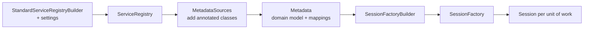
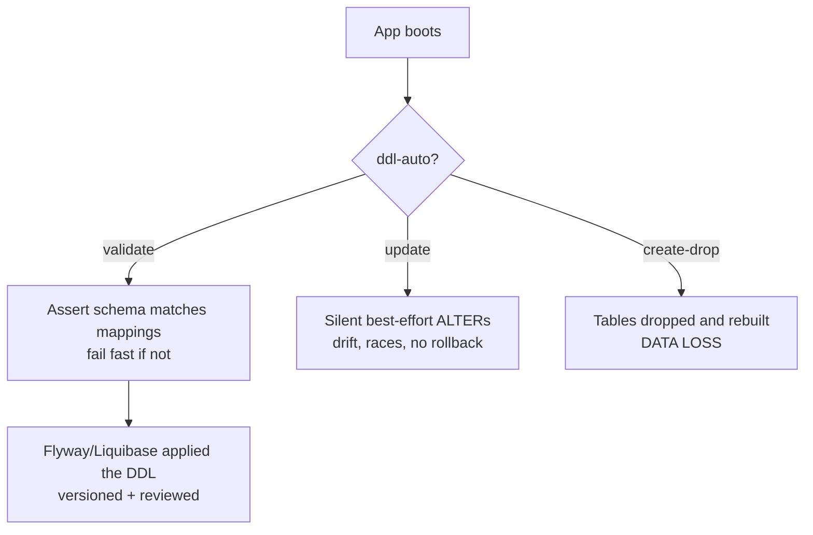

# Configuration, Bootstrapping & Schema Generation

This is the "wiring it up" topic: how a JPA/Hibernate persistence layer comes
into existence at startup, what knobs control it, and — critically for a senior
interview — **which of those knobs are safe in production and which will delete
your data.** Everything here is grounded in **Jakarta Persistence 3.1/3.2**
(the `jakarta.persistence.*` namespace — *not* legacy `javax.persistence.*`) and
**Hibernate ORM 6.x/7.x**.

Two worlds meet here. The **JPA-standard** world bootstraps from a
`persistence.xml` describing a *persistence-unit*, producing an
`EntityManagerFactory`. The **Spring Boot** world skips `persistence.xml`
entirely: auto-configuration builds a `DataSource`, a `JpaVendorAdapter`, and a
`LocalContainerEntityManagerFactoryBean` from `spring.*`/`spring.jpa.*`
properties. Under both, Hibernate's own native bootstrap (`ServiceRegistry` →
`Metadata` → `SessionFactory`) does the real work.

> [!KEY-TAKEAWAY]
> `hibernate.hbm2ddl.auto=update` and `=create` are **not** migration tools and
> are dangerous in production. Use `validate` (or `none`) at runtime and manage
> the schema with **Flyway or Liquibase**. This single decision comes up in
> almost every Hibernate config interview.

For the underlying database mechanics — SQL itself, indexing, isolation levels,
and especially **zero-downtime schema migrations** — see `messaging-databases`
and `devops-cicd`. For how the Spring container wires beans, auto-configuration,
and `@Transactional` proxies, see `spring-boot`/`spring-core`. Here we stay at
the ORM-configuration altitude.

---

## persistence.xml and the Persistence Unit

The JPA-standard bootstrap descriptor is `META-INF/persistence.xml`. It defines
one or more **persistence units** — a named set of entity classes plus the
configuration that governs their `EntityManagerFactory`.

```xml
<persistence xmlns="https://jakarta.ee/xml/ns/persistence"
             version="3.1">
  <persistence-unit name="orders-pu" transaction-type="RESOURCE_LOCAL">
    <class>com.acme.Order</class>
    <properties>
      <property name="jakarta.persistence.jdbc.url"      value="jdbc:postgresql://localhost/orders"/>
      <property name="jakarta.persistence.jdbc.user"     value="app"/>
      <property name="jakarta.persistence.jdbc.password" value="secret"/>
      <property name="hibernate.hbm2ddl.auto"            value="validate"/>
    </properties>
  </persistence-unit>
</persistence>
```

Key points a senior should know:

- The **namespace is `jakarta.ee`** and standard properties are
  `jakarta.persistence.*` (e.g. `jakarta.persistence.jdbc.url`). The old
  `javax.persistence.*` names belong to JPA ≤ 2.2 and do **not** work with
  Hibernate 6/7. See `hibernate-6-7-and-jakarta-migration`.
- `transaction-type` is `RESOURCE_LOCAL` (you drive `EntityTransaction`
  yourself) or `JTA` (a container/JTA transaction manager drives it).
- You bootstrap with
  `Persistence.createEntityManagerFactory("orders-pu")`.

```java
EntityManagerFactory emf = Persistence.createEntityManagerFactory("orders-pu");
EntityManager em = emf.createEntityManager();
```

> [!INTERVIEW]
> "Do you need a `persistence.xml` in a Spring Boot app?" — **No.** Spring Boot
> builds the `EntityManagerFactory` programmatically from properties and
> component scanning. `persistence.xml` is the JPA-SE / Jakarta EE path; both
> ultimately configure the same Hibernate engine.

## Spring Boot Auto-Configuration (no persistence.xml)

In Spring Boot, `HibernateJpaAutoConfiguration` + `DataSourceAutoConfiguration`
assemble the persistence layer from properties. There is no `persistence.xml`;
instead:

- A **`DataSource`** is built from `spring.datasource.*` (url, username,
  password, pool settings). The default pool is **HikariCP**.
- A **`JpaVendorAdapter`** (`HibernateJpaVendorAdapter`) plugs Hibernate in as
  the provider.
- A `LocalContainerEntityManagerFactoryBean` scans `@Entity` classes on the
  classpath and produces the `EntityManagerFactory`.

Typical `application.yml`:

```yaml
spring:
  datasource:
    url: jdbc:postgresql://localhost/orders
    username: app
    password: secret
  jpa:
    hibernate:
      ddl-auto: validate        # -> hibernate.hbm2ddl.auto
    properties:
      hibernate:
        jdbc:
          batch_size: 50
        order_inserts: true
        order_updates: true
    show-sql: false
```

Mapping rules to remember:

- `spring.jpa.hibernate.ddl-auto` → `hibernate.hbm2ddl.auto`. Boot's **default**
  is `create-drop` when using an embedded in-memory DB (H2/HSQLDB/Derby) with no
  schema manager, and `none` otherwise.
- `spring.jpa.properties.hibernate.*` are passed straight through to Hibernate
  verbatim — this is how you set anything Boot doesn't have a shortcut for.
- `spring.jpa.show-sql=true` → Hibernate's `hibernate.show_sql` (see the SQL
  logging section — this is the *worst* of the logging options).

> [!WARNING]
> If Flyway or Liquibase is on the classpath, Spring Boot backs off the
> embedded-DB `create-drop` default and expects the migration tool to own the
> schema — you should still explicitly set `ddl-auto: validate` to be safe.

## Bootstrapping the EntityManagerFactory / SessionFactory

Hibernate's **native bootstrap** (Hibernate 6/7) is a three-stage pipeline. Even
when JPA or Spring hides it, this is what runs underneath and it is a favorite
"do you actually understand Hibernate?" question.



1. **`ServiceRegistry`** — the lowest layer. Holds pluggable *services*
   (JDBC connections, the dialect, transaction coordinator, JMX, etc.). Built
   via `StandardServiceRegistryBuilder`, seeded with your settings.
2. **`Metadata`** — the parsed, validated domain model: every entity, its
   columns, associations, and generated DDL. Built from `MetadataSources`
   (annotated classes / XML) against the registry.
3. **`SessionFactory`** — the heavyweight, thread-safe, application-scoped
   object built from `Metadata`. It is expensive to create (you create **one**
   per database) and vends cheap, short-lived `Session`s.

```java
StandardServiceRegistry registry = new StandardServiceRegistryBuilder()
        .applySetting("hibernate.hbm2ddl.auto", "validate")
        .build();
Metadata metadata = new MetadataSources(registry)
        .addAnnotatedClass(Order.class)
        .buildMetadata();
SessionFactory sessionFactory = metadata.buildSessionFactory();
```

Key relationships:

- `EntityManagerFactory` **is a** `SessionFactory` in Hibernate — you can
  `emf.unwrap(SessionFactory.class)`, and `EntityManager.unwrap(Session.class)`.
- The `SessionFactory` is thread-safe and long-lived; a `Session` /
  `EntityManager` is **not** thread-safe and lives for one unit of work
  (usually one request/transaction). See
  `session-entitymanager-persistence-context`.

> [!INTERVIEW]
> "How many `SessionFactory`/`EntityManagerFactory` instances should an app
> have?" — Normally **one per database**, created at startup. It is expensive
> (parses all mappings, builds caches, opens the pool). Creating one per request
> is a classic performance bug.

## The Dialect (auto-detected in Hibernate 6+)

The **`Dialect`** teaches Hibernate the SQL flavor of your specific database:
identity vs sequence support, LIMIT/OFFSET syntax, column type mappings,
function names, lock-clause syntax, etc. It is how one ORM speaks Postgres,
MySQL, and Oracle.

- In **Hibernate 6/7 you normally do NOT set `hibernate.dialect`.** Hibernate
  auto-detects it from the JDBC `DatabaseMetaData` (product name + version) via
  the `DialectResolver`. Setting it manually is discouraged and can even *hide*
  version-specific behavior.
- You still may set it for special cases (e.g. a proxy that misreports its
  version, or to pin a specific version's feature set).
- Dialect classes were **consolidated** in HB6: version-specific subclasses like
  `PostgreSQL95Dialect` were removed in favor of a single `PostgreSQLDialect`
  that adapts to the reported version. Referencing an old removed dialect is a
  common HB5→HB6 migration break — see
  `hibernate-6-7-and-jakarta-migration`.

> [!TIP]
> If startup fails with "Unable to determine Dialect without JDBC metadata", it
> usually means Hibernate could not open a connection at boot (bad URL/creds, or
> you disabled metadata lookup). Fix connectivity rather than hard-coding a
> dialect.

## Connection Pool (HikariCP by default in Boot)

Opening a physical DB connection is expensive, so Hibernate acquires connections
from a **pool**. The pool is a `ConnectionProvider` service in the
`ServiceRegistry`.

- **Spring Boot's default pool is HikariCP** (`spring.datasource.hikari.*`
  tunes it — `maximum-pool-size`, `connection-timeout`, `max-lifetime`, etc.).
- Hibernate's built-in `hibernate.connection.pool_size` uses a **trivial,
  non-production** internal pool — fine for tests, never for prod. Real
  deployments use Hikari (Boot), Agroal (Quarkus), or a JTA/JNDI datasource.
- The pool interacts with `@Transactional`: a connection is typically held for
  the duration of the transaction, so an oversized `maximum-pool-size` plus long
  transactions can exhaust the database's connection limit. For sizing theory
  and DB-side connection limits, see `messaging-databases`/`reliability-ops`.

> [!WARNING]
> `hibernate.connection.pool_size` and a real pool are different things. Seeing
> "Using built-in connection pool (not intended for production use)" in the logs
> means no real pool was configured — a red flag in a prod service.

## hbm2ddl.auto and Jakarta Schema Generation

Two overlapping mechanisms control schema DDL: Hibernate's legacy
`hibernate.hbm2ddl.auto`, and the JPA-standard
`jakarta.persistence.schema-generation.*` properties. Both can create/validate
tables from your entity mappings at startup.

`hibernate.hbm2ddl.auto` values:

| Value | What Hibernate does | Prod-safe? |
|---|---|---|
| `none` | Nothing. | Yes |
| `validate` | Compares entity mappings to the live schema; **fails startup** on mismatch. Makes **no changes**. | Yes (recommended) |
| `update` | Diffs mappings vs schema and issues `ALTER`/`CREATE` to add what's missing. | **No** |
| `create` | Drops (if present) and recreates the schema on startup. | **No — data loss** |
| `create-drop` | Like `create`, and also drops on shutdown. | No (tests only) |
| `create-only` | Creates, never drops (HB6+). | No (tools/tests) |
| `drop` | Drops the schema. | No |

The JPA-standard equivalent is
`jakarta.persistence.schema-generation.database.action` with values `none`,
`create`, `drop-and-create`, `drop`. You can also generate DDL **to a script**
via `...scripts.action` + `...scripts.create-target`, and seed data with a
`jakarta.persistence.sql-load-script-source` file.

> [!KEY-TAKEAWAY]
> `validate` = "assert the schema matches, change nothing." `update` = "try to
> patch the schema." `create`/`create-drop` = "throw the schema away and rebuild
> it." Only `none`/`validate` belong in production.

## Why 'update' and 'create' Are Dangerous in Production

This is the highest-value point of the whole topic.

- **`create` / `create-drop` destroy data.** They drop tables on startup (and,
  for `create-drop`, on shutdown). Point one at a production database and you
  lose everything. Never near prod.
- **`update` is deceptively bad**, even though it "only adds things":
  - It is **additive-only and best-effort** — it never drops or renames columns,
    never narrows types, never handles data backfills, and can silently *skip*
    changes it can't express. Your schema drifts.
  - It is **non-transactional and unversioned** — there is no record of what
    changed, no ordering guarantee across nodes, and **no rollback**. Two app
    instances booting simultaneously can race on the same `ALTER`.
  - It cannot do **data migrations** (split a column, backfill, transform), which
    real schema evolution constantly requires.
- **The correct pattern:** run the app with `validate` (or `none`) and evolve the
  schema with a **versioned migration tool — Flyway or Liquibase**. Migrations
  are ordered, checksummed, reviewable, reversible, and support data changes.
  For **zero-downtime / expand-contract** migration strategy (add column →
  backfill → dual-write → switch → drop), see
  `messaging-databases` and `devops-cicd`.



> [!INTERVIEW]
> "You inherit a service running `ddl-auto=update` in prod. What do you do?" —
> Switch to `validate`, baseline the current schema into Flyway/Liquibase
> (`flyway baseline`), and route all future changes through versioned
> migrations. Explain that `update` gives no rollback, no data migrations, and
> can race across instances.

## SQL Logging: show_sql vs Loggers vs Proxies

Three escalating ways to see the SQL Hibernate emits — know the trade-offs.

1. **`hibernate.show_sql=true`** (Boot: `spring.jpa.show-sql`) — prints SQL to
   **`System.out`**, unformatted, with **no bind parameter values** (you see
   `?` placeholders). Convenient but crude; not for production (bypasses the
   logging framework, no correlation, performance overhead).
   Pair with `hibernate.format_sql=true` and
   `hibernate.use_sql_comments=true` to pretty-print and annotate.
2. **The proper loggers** — route through SLF4J/Logback:
   - `org.hibernate.SQL` at `DEBUG` — logs each statement (like `show_sql` but
     through the log framework, with timestamps/MDC).
   - `org.hibernate.orm.jdbc.bind` at `TRACE` — logs the **bound parameter
     values** (Hibernate 6+). In Hibernate 5 this logger was
     `org.hibernate.type.descriptor.sql.BasicBinder` — a common gotcha when
     upgrading.
3. **A dedicated tool — p6spy or datasource-proxy** — wraps the `DataSource`
   and logs the **fully-inlined SQL with real parameter values**, plus timing
   and batch info. This is the production-grade choice for diagnosing N+1 and
   slow queries because you see exactly what hit the wire. See
   `fetching-lazy-eager-n-plus-one` and `performance-tuning-pitfalls`.

> [!WARNING]
> `hibernate.show_sql` does **not** show parameter values and writes to stdout —
> never rely on it in production. Also, logging every statement is a real
> performance and security (PII in logs) cost; enable it deliberately.

## Batching and Statement-Ordering Properties

Hibernate defers and can group SQL at flush. These properties turn write-heavy
workloads from N round trips into a handful of batches — a top performance win
also covered in `transactions-dirty-checking-flushing` and
`performance-tuning-pitfalls`.

| Property | Effect |
|---|---|
| `hibernate.jdbc.batch_size` | Enables JDBC batching; groups up to N inserts/updates into one `addBatch/executeBatch`. `0`/unset = no batching. |
| `hibernate.order_inserts=true` | Reorders pending inserts by entity type so same-type statements batch together. |
| `hibernate.order_updates=true` | Same for updates. |
| `hibernate.jdbc.batch_versioned_data=true` | Allows batching of updates on `@Version` entities (row-count checks). |
| `hibernate.default_batch_fetch_size` | When initializing lazy associations/proxies, fetch N of them per `SELECT ... IN (?,?,...)` instead of one query each — a broad **N+1 mitigation**. See `fetching-lazy-eager-n-plus-one`. |

> [!TIP]
> `batch_size` alone often doesn't batch, because interleaved statements of
> different entity types break the batch. That's why you set `order_inserts`
> and `order_updates` together with it. Also note: `IDENTITY` id generation
> **disables insert batching** because Hibernate needs the generated key after
> each insert — prefer `SEQUENCE` when batching matters (see
> `primary-keys-and-id-generation`).

## Time Zone and Miscellaneous Properties

- **`hibernate.jdbc.time_zone`** — the time zone Hibernate uses when reading/
  writing `java.time` and `Timestamp` values via JDBC. Set it to `UTC` so
  timestamps are stored consistently regardless of the JVM/DB server zone. This
  prevents the classic "times shift when we deploy to a box in another region"
  bug.
- **`hibernate.query.in_clause_parameter_padding=true`** — rounds up the number
  of `IN (?)` bind parameters to a power of two so the SQL string (and thus the
  DB's prepared-statement cache) is reused across similar queries.
- **`hibernate.generate_statistics=true`** — exposes `Statistics` (query counts,
  cache hit ratios) for diagnostics and micrometer metrics; see
  `observability`.
- **`hibernate.jdbc.fetch_size`** — JDBC row prefetch hint for large result
  sets.

## Naming Strategies (Physical and Implicit)

Hibernate maps a Java name (entity/field) to a database name (table/column) in
**two stages**:

1. **`ImplicitNamingStrategy`** — decides the *logical* name when you did **not**
   specify one (no `@Table`/`@Column` name). E.g. what column does a `firstName`
   field with no `@Column` map to, and how are join-table/FK names derived.
2. **`PhysicalNamingStrategy`** — transforms the logical name into the **actual**
   database identifier. This is where camelCase → snake_case conversion happens.

```java
@Entity
class UserAccount {         // logical -> physical
  private String firstName; // firstName -> first_name (Boot default)
}
```

- **Spring Boot's default `PhysicalNamingStrategy` is
  `CamelCaseToUnderscoresNamingStrategy`** (formerly named
  `SpringPhysicalNamingStrategy`): `UserAccount` → `user_account`,
  `firstName` → `first_name`, and it lowercases. The default
  `ImplicitNamingStrategy` is `SpringImplicitNamingStrategy`.
- **Plain Hibernate (no Spring)** defaults differ: the physical strategy is a
  near pass-through (`PhysicalNamingStrategyStandardImpl`) that keeps the name
  as-is, so `firstName` stays `firstName`. This mismatch surprises people moving
  code between a Boot app and a plain-Hibernate/JPA app.
- Override via `spring.jpa.hibernate.naming.physical-strategy` /
  `...implicit-strategy` (Boot) or `hibernate.physical_naming_strategy` /
  `hibernate.implicit_naming_strategy` (native).

> [!INTERVIEW]
> "Why does my `firstName` field map to a `first_name` column even though I
> never wrote `@Column(name=...)`?" — Because Spring Boot installs
> `CamelCaseToUnderscoresNamingStrategy` as the physical naming strategy. On
> plain Hibernate it would have stayed `firstName`.

## Common Interview Follow-ups

- **"Walk me through what happens from app start to first query."** DataSource/
  pool built → ServiceRegistry with auto-detected Dialect → MetadataSources scan
  entities → SessionFactory built (and `ddl-auto` runs) → per-request Session
  opened → query.
- **"Difference between `validate` and `update`?"** `validate` asserts and
  changes nothing (fails fast on drift); `update` best-effort adds missing
  columns/tables, never drops, no versioning, no rollback, can race.
- **"Why is `create`/`create-drop` fine in tests but not prod?"** Tests want a
  fresh throwaway schema each run; prod data is permanent — dropping it is
  catastrophic and there's no migration history.
- **"How do you see the actual SQL with parameter values?"** `org.hibernate.SQL`
  DEBUG + `org.hibernate.orm.jdbc.bind` TRACE (HB6), or a datasource proxy
  (p6spy) for fully-inlined SQL. `show_sql` alone omits parameters.
- **"Do you set `hibernate.dialect`?"** Usually no in HB6+ — it's auto-detected
  from JDBC metadata. Set it only for special cases.
- **"How do you make bulk inserts fast?"** `jdbc.batch_size` + `order_inserts` +
  `order_updates`, and use `SEQUENCE` (not `IDENTITY`) so batching isn't
  disabled.
- **"Where should schema changes actually live?"** In versioned Flyway/Liquibase
  migrations, with the app on `validate`. Cross-ref `devops-cicd` /
  `messaging-databases` for zero-downtime strategy.
- **"One SessionFactory or many?"** One per database, created at startup;
  cheap `Session`s per unit of work.

## References

- Jakarta Persistence 3.1/3.2 Specification — Bootstrapping, Persistence Units,
  and Schema Generation (`jakarta.persistence.schema-generation.*`).
- Hibernate ORM 6/7 User Guide — Bootstrap (ServiceRegistry, Metadata,
  SessionFactory), Configuration properties, Schema generation, SQL statement
  logging, and Naming strategies.
- Spring Boot Reference — Data / JPA auto-configuration, `spring.jpa.*`,
  HikariCP defaults, and naming-strategy defaults.
- HikariCP documentation — pool sizing and configuration.
- Flyway / Liquibase documentation — versioned, production-grade schema
  migrations (the recommended alternative to `hbm2ddl`).
- Cross-references: `hibernate-6-7-and-jakarta-migration`,
  `fetching-lazy-eager-n-plus-one`, `primary-keys-and-id-generation`,
  `transactions-dirty-checking-flushing`, `performance-tuning-pitfalls`;
  and for DB-level mechanics/migrations, `messaging-databases`, `devops-cicd`.
