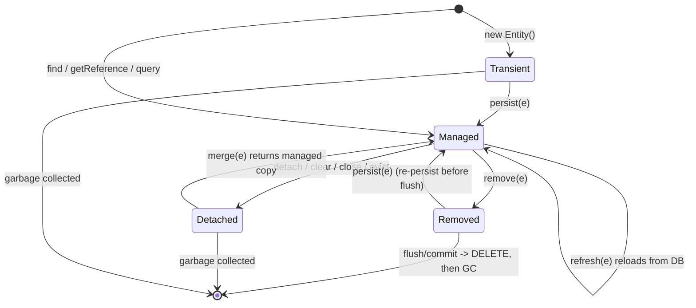

# Entity Lifecycle States

"Walk me through the JPA entity lifecycle states and the transitions between them" is one
of the most common Hibernate/JPA interview openers — and the answers reveal instantly
whether a candidate understands the **persistence context** or just calls `save()`. The
one-line answer: **a JPA entity is always in exactly one of four states —
`TRANSIENT` (new), `MANAGED` (persistent), `DETACHED`, or `REMOVED` — and the
`EntityManager` operations `persist`, `find`/`getReference`, `merge`, `remove`,
`detach`/`clear`/`close`, and `refresh` move an entity between them.** The single most
important nuance most candidates miss: **`merge` does NOT make the instance you pass
managed — it returns a *different* managed copy**, and **modifying a detached entity does
nothing to the database until you merge it back**.

This note owns the state machine and the transition operations. Neighboring topics that
this cross-references (do not duplicate them):

- The `EntityManager`/`Session`, the persistence context as a first-level cache, and its
  lifespan — see `hibernate-jpa/session-entitymanager-persistence-context`.
- Dirty checking, flush modes, and flush ordering mechanics in depth — see
  `hibernate-jpa/transactions-dirty-checking-flushing`.
- Lazy proxies, `LazyInitializationException`, and the N+1 problem — see
  `hibernate-jpa/fetching-lazy-eager-n-plus-one`.
- Cascade types and orphan removal (how state transitions propagate across associations) —
  see `hibernate-jpa/cascade-types-orphan-removal`.
- Spring Data `save()` semantics beyond the raw `EntityManager` — see
  `hibernate-jpa/spring-data-jpa-repositories`.
- `@Transactional` propagation and the Spring transaction proxy — see `spring-boot` /
  `spring-core`.
- DB-level transactions, isolation, and locking mechanics — see
  `messaging-databases`.

> [!KEY-TAKEAWAY]
> **Four states: TRANSIENT (new, no persistence-context association, usually no PK) →
> MANAGED (attached to a persistence context, tracked/dirty-checked, changes auto-flushed)
> → DETACHED (was managed, context closed/evicted — has state but no tracking) → REMOVED
> (scheduled for `DELETE` on next flush).** Transitions: `persist` (transient→managed),
> `find`/`getReference` (loads as managed), `merge` (copies detached state into a managed
> instance and **returns that copy**), `remove` (managed→removed), `detach`/`clear`/`close`
> (managed→detached), `refresh` (reloads managed state from the DB, discarding changes).

---

## The four entity states

Every entity object, from JPA's perspective, is in exactly one of four lifecycle states at
any moment. The state is a property of the **object's relationship to a persistence
context**, not of the object's class or its data.

| State | Associated with a persistence context? | Has a database row? | Dirty-checked / auto-flushed? | Typical origin |
|---|---|---|---|---|
| **Transient** (a.k.a. *new*) | No | No | No | `new Entity()` — just constructed |
| **Managed** (a.k.a. *persistent*) | Yes | Yes (or will on flush) | Yes | `persist`, `find`, `merge` result, query result |
| **Detached** | No (was, earlier) | Yes (or did) | No | context closed, `detach`, `clear`, `evict`, serialization |
| **Removed** | Yes | Yes, but scheduled for `DELETE` | N/A (delete pending) | `remove` on a managed entity |

The Jakarta Persistence spec names these states in its description of `EntityManager`
operations (§ "Entity Instance's Life Cycle"). Hibernate's native API uses the words
*transient*, *persistent*, *detached*, and *removed* for the same four states.

The critical mental model:

- **Managed** is the only state where the persistence context is *watching* the object.
  While managed, any change to a field is noticed by **dirty checking** and turned into an
  `UPDATE` at flush time — you never call an "update" method. (Mechanism detail lives in
  `transactions-dirty-checking-flushing`.)
- **Transient** and **detached** look identical as plain Java objects — the difference is
  purely history and identity: a transient object has no corresponding row and (usually)
  no PK; a detached object *does* correspond to a row and carries its PK, but nobody is
  tracking it anymore.



## Transient (new)

A **transient** entity is a freshly instantiated object that the persistence context knows
nothing about. It was created with `new`, has no representation in the database, and
generally has no primary key assigned yet (for generated IDs).

```java
Order order = new Order();       // TRANSIENT
order.setTotal(new BigDecimal("42.00"));
// order.getId() == null  — no PK, no DB row, no tracking
```

Key properties:

- Not associated with any persistence context.
- Changes to its fields have **no** database effect — it is an ordinary POJO.
- Will be garbage-collected like any object if you never persist it.
- Hibernate decides "is this instance transient?" partly by inspecting the `@Id` /
  `@Version` value (a `null` generated id, or a `@Version` of null, signals *new*) — this
  matters for `merge` and for Spring Data `save()` (see those sections).

> [!TIP]
> "Transient" here is a JPA lifecycle term and has **nothing** to do with the Java
> `transient` keyword (which excludes a field from serialization). Different concept, same
> word.

## Managed (persistent)

A **managed** (persistent) entity is associated with an open persistence context. It has
(or will have, at flush) a row in the database, and the context holds a reference to it in
its **first-level cache** keyed by entity type + primary key.

What "managed" buys you:

- **Automatic dirty checking.** At flush time Hibernate compares each managed entity's
  current field values against the snapshot it took when the entity was loaded/attached.
  Any difference produces an `UPDATE`. You never call `update()`:

  ```java
  Order o = em.find(Order.class, 1L);   // MANAGED (SELECT)
  o.setTotal(new BigDecimal("99.00"));  // just a setter
  // on flush/commit -> Hibernate emits:  update orders set total=99.00 where id=1
  ```
- **Guaranteed identity within the context.** Two `find` calls for the same PK in the same
  context return the *same object reference* (`==`). This is the first-level-cache
  guarantee (detailed in `session-entitymanager-persistence-context`).
- **Transitive persistence** via cascades, and lazy-association loading works because the
  context is open.

An entity becomes managed via `persist`, as the return of `merge`, via `find` /
`getReference`, or as an element of a query result list.

> [!WARNING]
> "Managed" is scoped to **one** persistence context. The same row loaded in two different
> `EntityManager`s yields two distinct managed objects. Identity (`==`) is only guaranteed
> *within* a single context.

## Detached

A **detached** entity was managed at some point but is no longer associated with a
persistence context. It still holds its data and its primary key, but nobody is watching
it: field changes are **not** tracked and will **not** be flushed.

How an entity becomes detached:

- The persistence context **closes** (e.g. the transaction/`EntityManager` ends). In a
  typical Spring request, entities returned to the controller after the service-layer
  transaction commits are detached.
- Explicit `em.detach(entity)` — evicts a single entity.
- `em.clear()` — detaches **all** entities in the context.
- Hibernate-native `session.evict(entity)`.
- The entity is **serialized** and sent across the wire (e.g. to a remote client) and
  deserialized — the copy is detached.

> [!WARNING]
> **The classic gotcha:** mutating a detached entity does nothing.
> ```java
> Order o = orderRepo.findById(1L).get(); // managed inside the tx, DETACHED after it returns
> o.setTotal(new BigDecimal("500"));      // no context is watching -> NO UPDATE ever happens
> ```
> To persist the change you must re-associate it: `merge` it back (JPA-portable) — see
> *merge*. This is also the root cause of the infamous `LazyInitializationException`:
> touching an un-initialized lazy association on a detached entity has no session to load
> it (see `fetching-lazy-eager-n-plus-one`).

## Removed

A **removed** entity is one you passed to `em.remove(...)`. It is still associated with the
context and still corresponds to a row, but it is now **scheduled for deletion**: the
`DELETE` SQL is issued at the next flush/commit, not immediately.

```java
Order o = em.find(Order.class, 1L);  // MANAGED
em.remove(o);                        // REMOVED — no SQL yet
// ... later, on flush/commit ->  delete from orders where id=1
```

Notes and gotchas:

- `remove` requires a **managed** instance. Passing a *detached* entity throws
  `IllegalArgumentException` — you must `find`/`merge` it first (or `getReference` to a
  proxy) so the context manages it, then remove.
- Passing a *transient* entity to `remove` is a no-op (nothing to delete).
- Between `remove` and flush the object is a live Java object; you may even `persist` it
  again to cancel the scheduled delete (spec: a removed instance re-`persist`ed becomes
  managed again).
- After the transaction commits, the Java object typically lingers as a detached object
  with a now-orphaned PK — do not reuse it as if it still had a row.

## persist: transient to managed

`em.persist(entity)` makes a **transient** entity **managed**. Semantics per the Jakarta
Persistence spec:

- The entity is associated with the context and scheduled for `INSERT`.
- The `INSERT` may be deferred until flush — with `IDENTITY` generation it typically fires
  **immediately** (Hibernate needs the DB-generated key right away and cannot batch it);
  with `SEQUENCE`/`TABLE` it can allocate the id up front and defer/batch the insert.
- `persist` returns `void`. It mutates the **passed** instance to managed (unlike `merge`).
- Calling `persist` on an already-**managed** entity is a no-op. Calling it on a
  **detached** entity throws (or throws at flush) `EntityExistsException` /
  `IllegalArgumentException` — `persist` is for *new* entities only; use `merge` for
  detached ones.
- Cascades to associations annotated `cascade = PERSIST` (or `ALL`).

```java
Order o = new Order();          // TRANSIENT
em.persist(o);                  // MANAGED; INSERT scheduled (or run now for IDENTITY)
// o is now the managed instance; o.getId() is populated
```

> [!INTERVIEW]
> "What's the difference between `persist` and `merge`?" — `persist`: for **transient**
> entities; returns void; makes the **argument** managed; throws for detached. `merge`:
> for **detached** (or transient) entities; **returns** a managed copy; **does not** make
> the argument managed. Reach for `persist` when inserting a brand-new row inside the same
> transaction; reach for `merge` when re-attaching an object that lived outside the
> current context.

## find and getReference: loading as managed

`em.find(Class, id)` returns a **managed** entity, executing a `SELECT` immediately (unless
the row is already in the first-level cache or second-level cache). Returns `null` if no
row exists.

`em.getReference(Class, id)` returns a **managed** entity too, but as a **lazy proxy**: no
`SELECT` is issued up front. The `SELECT` fires the first time you touch a non-id property
— and if the row does not exist, you get `EntityNotFoundException` at that point (not at
`getReference` time). It is the JPA-standard equivalent of Hibernate's `session.load()`.

```java
Order o = em.find(Order.class, 1L);        // SELECT now; null if missing; MANAGED
Order p = em.getReference(Order.class, 2L); // no SELECT; proxy; MANAGED
p.getTotal();                              // SELECT fires here; EntityNotFoundException if missing
```

Use `getReference` to set a foreign key without loading the parent — e.g.
`child.setParent(em.getReference(Parent.class, parentId))` avoids an unnecessary `SELECT`.
(Proxy mechanics and lazy loading in depth: `fetching-lazy-eager-n-plus-one`.)

## merge: detached to a managed copy

`em.merge(entity)` copies the state of a **detached** (or transient) instance into a
managed instance and **returns that managed instance**. This is the operation candidates
most often get wrong.

Mechanism, step by step:

1. If a managed entity with the same identity already exists in the context, Hibernate
   copies the detached entity's field values into that existing managed instance.
2. Otherwise Hibernate **loads** the entity by id (a `SELECT`, unless already cached),
   creating a managed instance, then copies the detached state into it.
3. If the entity is transient (no id), `merge` behaves like `persist` on a fresh managed
   copy.
4. It **returns** the managed instance. Dirty checking then handles the `UPDATE` at flush.

```java
Order detached = /* loaded in a previous tx, now detached */;
detached.setTotal(new BigDecimal("500"));      // change is invisible so far

Order managed = em.merge(detached);            // SELECT (load) + copy; RETURNS managed copy
// merge does NOT make `detached` managed!
managed.setTotal(new BigDecimal("600"));       // THIS is tracked
detached.setTotal(new BigDecimal("700"));      // this is STILL ignored — detached != managed
// on flush -> update with total=600
```

> [!WARNING]
> **`merge` returns a different object.** `entity != em.merge(entity)` (in the common
> detached case). The number-one bug: `em.merge(order);` while continuing to mutate the
> original `order`. You must use the returned reference:
> `order = em.merge(order);`.

Other notes:

- `merge` cascades to associations marked `cascade = MERGE` (or `ALL`). Associations *not*
  cascaded keep the managed instance's existing values.
- Because merge may trigger a load-by-id `SELECT`, blindly merging in a loop is a
  performance trap; prefer loading managed entities and mutating them, or use `persist`
  for genuinely new rows.

## remove, detach, clear, refresh, and close

Rounding out the transition operations:

| Operation | From → To | SQL | Notes |
|---|---|---|---|
| `remove(e)` | Managed → Removed | `DELETE` at flush | Throws for detached; no-op for transient |
| `detach(e)` | Managed → Detached | none | Stops tracking one entity; pending changes to it are lost (not flushed) |
| `clear()` | all Managed → Detached | none | Empties the whole context (first-level cache); unflushed changes discarded |
| `refresh(e)` | Managed → Managed | `SELECT` | Overwrites in-memory state from the DB, **discarding** un-flushed field changes |
| `close()` | all Managed → Detached | none | Ends the `EntityManager`; everything becomes detached |
| `flush()` | (no state change) | `INSERT`/`UPDATE`/`DELETE` | Synchronizes pending changes to the DB; entities stay managed |

`refresh` is the mirror image of dirty checking: instead of pushing your in-memory changes
to the DB, it pulls the DB's current values into your object, throwing away any un-flushed
edits. It requires a managed entity (throws `IllegalArgumentException` otherwise) and
throws `EntityNotFoundException` if the row was deleted.

`detach`/`clear` are the deliberate way to shed tracking — e.g. in a large batch, you
`flush()` then `clear()` every N rows so the first-level cache does not grow unbounded and
dirty checking does not slow to a crawl (a standard bulk-insert pattern; see
`performance-tuning-pitfalls`).

## persist vs merge vs save and Spring Data save

The transition operations differ across the JPA spec, Hibernate's native `Session`, and
Spring Data — a frequent source of confusion.

| Operation | API | Argument state expected | Returns | Effect |
|---|---|---|---|---|
| `persist` | JPA `EntityManager` | Transient | void | Makes **argument** managed; INSERT |
| `merge` | JPA `EntityManager` | Detached or transient | **managed copy** | Copies state into a managed instance; argument stays detached |
| `save` | Hibernate `Session` (legacy) | Transient/detached | generated id | Native; INSERTs/attaches; **deprecated** in Hibernate 6+ |
| `update` | Hibernate `Session` (legacy) | Detached | void | Re-attaches a detached entity; **deprecated** |
| `saveOrUpdate` | Hibernate `Session` (legacy) | Either | void | Picks save or update by id/version; **deprecated** |
| `persist` (native) | Hibernate `Session` | Transient | void | JPA-aligned; the recommended native call |
| `save(S)` | Spring Data `JpaRepository` | Either | saved entity | `isNew` ? `persist` : `merge`, and **returns** the result |

Key points for interviews:

- **Hibernate 6/7 deprecated `save`, `update`, `saveOrUpdate`, `saveOrUpdateCopy`, and
  `Session.load`** in favor of the JPA-standard `persist`, `merge`, `find`, and
  `getReference`. (Note: `upsert` is a `StatelessSession` method, added in 6.3 — it is
  **not** on the regular `Session`.) Modern code should prefer the JPA operations.
  (See `hibernate-6-7-and-jakarta-migration`.)
- **Spring Data `save(entity)` is `merge` in disguise for existing entities.** Its
  `SimpleJpaRepository.save` calls `em.persist` when the entity `isNew()`, else
  `em.merge` — and it **returns** the saved instance. So, exactly like `merge`, you must
  use the **returned** object; the argument you passed may be detached and untracked:
  ```java
  order = orderRepo.save(order);  // use the return value, not the original
  ```
- `isNew()` defaults to "the `@Id` is null / primitive zero," so **assigned** (non-generated)
  ids fool it into calling `merge` (with a wasteful pre-`SELECT`) for genuinely new rows —
  implement `Persistable#isNew()` or use `@Version` to fix. (Detail:
  `spring-data-jpa-repositories`.)

> [!INTERVIEW]
> "I called `repository.save(entity)` but my later changes to `entity` weren't saved —
> why?" Because after the transaction the returned entity (and often the argument) is
> **detached**; further mutations aren't dirty-checked. Either keep the work inside one
> transaction on the managed entity, or `save`/`merge` again.

## The persistence context as first-level cache

Two `find` calls for the same PK within one persistence context return the **same managed
object** and issue only **one** `SELECT`. The persistence context *is* the first-level
cache; it is mandatory, per-context, and cannot be disabled.

```java
Order a = em.find(Order.class, 1L);  // SELECT
Order b = em.find(Order.class, 1L);  // no SELECT — served from the context
assert a == b;                       // same reference: identity guarantee
```

This is why lifecycle state matters for identity: the identity guarantee holds only for
**managed** entities in the **same** context. Two contexts, or a detached copy, break `==`.
(First- vs second-level cache and how the L1 cache interacts with flush: see
`session-entitymanager-persistence-context` and `caching-first-second-level`.)

## equals and hashCode for entities

Lifecycle transitions expose a subtle trap: an entity's generated `@Id` is `null` while
transient and only populated after `persist`/flush. If `equals`/`hashCode` use the
generated id, an entity's hash code **changes** once it is persisted — so if you added it
to a `HashSet` while transient, you can no longer find it, corrupting `@OneToMany` sets and
bidirectional association maintenance.

Guidance (widely recommended by the Hibernate team):

- **Do not** base `equals`/`hashCode` on a database-generated identifier that is null
  before persist.
- Prefer a **business/natural key** that is stable and set at construction; or use an
  application-assigned UUID as the id.
- A common pattern: `hashCode` returns a constant or is based on the immutable natural key,
  and `equals` compares the natural key (or the id only when both are non-null, class-checked
  with `instanceof`/`getClass`).

> [!WARNING]
> Never use Lombok `@Data`/`@EqualsAndHashCode` naively on entities — they generate
> id-based (and association-traversing) equals/hashCode that break across the
> transient→managed transition and can trigger `LazyInitializationException` or infinite
> recursion on bidirectional links.

## NonUniqueObjectException and re-attachment collisions

The most notorious re-attachment failure is not about a missing row — it is about **two
Java objects claiming the same identity in one context**. If the persistence context
already holds a managed instance of `Order#1` and you then try to *re-attach a second,
different* `Order#1` object (typically via the legacy `session.update(detached)` or
`saveOrUpdate(detached)`), Hibernate throws:

```
org.hibernate.NonUniqueObjectException: A different object with the same identifier
value was already associated with the session : [com.acme.Order#1]
```

The context guarantees a single managed instance per type+id (the first-level-cache
identity rule). `update`/`saveOrUpdate` try to make the *passed* object the managed one,
but that slot is already taken — collision.

```java
Order managed = em.find(Order.class, 1L);   // context now holds THE Order#1
Order detached = deserializeFromRequest();   // a different Order#1 object
session.update(detached);                     // NonUniqueObjectException!
```

**`merge` is the fix.** Merge does not try to attach the passed object; it *copies* the
detached state field-by-field into the already-managed instance and returns that instance.
No second object is ever attached, so no collision. This is the deeper reason the JPA spec
standardized on `merge` and Hibernate deprecated `update`/`saveOrUpdate`.

> [!INTERVIEW]
> "Why does `session.update(detached)` throw `NonUniqueObjectException` here but `merge`
> doesn't?" — Because the context already manages an instance with that id. `update`
> tries to attach a *second* instance of the same identity (illegal); `merge` copies state
> into the existing managed instance instead.

## Optimistic locking when merging a stale @Version

`merge` is where stale-data conflicts surface. If the entity has a `@Version` field and the
detached copy's version is older than the current DB row (someone else updated it while you
held the detached object), the flush-time UPDATE is guarded by the version:

```sql
-- versioned UPDATE emitted at flush after merge
update orders set total=?, version=? where id=? and version=?
--                                                    ^ the OLD version you carried
```

If another transaction already bumped `version`, the `where ... and version=?` matches
**zero rows**. Hibernate detects `rowCount == 0` and throws
`OptimisticLockException` (JPA) / `StaleObjectStateException` (Hibernate native) — no data
is silently overwritten. This is optimistic concurrency control implemented purely in the
`WHERE` clause; there is no DB row lock held (contrast pessimistic locking — see
`messaging-databases`).

```java
Order detached = /* loaded earlier, version=3 */;
detached.setTotal(new BigDecimal("500"));
// meanwhile another tx updated the row -> DB version is now 4
Order managed = em.merge(detached);   // SELECT loads version=4 into managed instance...
// ...but merge copies detached fields; at flush the UPDATE ... where version=3 hits 0 rows
// -> OptimisticLockException
```

> [!TIP]
> Use a **wrapper** `@Version` type (`Long`, not `long`). A `null` version is Hibernate's
> unambiguous "this instance is transient/new" signal; a primitive `long` defaults to `0`,
> which is a *valid* version and defeats the new-vs-detached heuristic that `merge` and
> Spring Data's `isNew()` rely on.

## StatelessSession: a no-lifecycle API

`StatelessSession` is Hibernate's deliberate escape hatch from the whole lifecycle model —
worth knowing because it clarifies *what the persistence context actually does* by removing
it. A `StatelessSession` has:

- **No persistence context / no first-level cache** — no identity guarantee, no dedup of
  rows by id.
- **No dirty checking** — you must explicitly call `update(...)`; nothing auto-flushes.
- **No cascades** — associations are not traversed; you persist each entity yourself.
- **No lifecycle callbacks** (`@PrePersist` etc.) and **no interceptors/events**.
- **Ignores collections** — mapped collections are not managed.
- Its entities are effectively **always detached** — every operation is immediate SQL.

```java
StatelessSession ss = sessionFactory.openStatelessSession();
ss.insert(order);   // immediate INSERT
ss.update(order);   // immediate UPDATE — ALWAYS fires, no dirty check
ss.delete(order);   // immediate DELETE
Order o = ss.get(Order.class, 1L);   // fresh SELECT every time (no L1 cache)
ss.upsert(order);   // @Incubating (6.3+): emits SQL MERGE INTO; TransientObjectException if no id
```

Because there is no L1 cache to bound, `StatelessSession` is a first-class tool for
**streaming bulk work** (import/export of millions of rows) with constant memory — an
alternative to the `flush()`+`clear()`-every-N pattern on a regular session. The trade-off
is "data aliasing": without identity dedup, two `get` calls for the same id return two
different objects, so you lose the safety of shared state.

## Predicting the generated SQL for each transition

Senior interviews often ask you to *predict the SQL*. The shapes:

| Operation | SQL emitted | When |
|---|---|---|
| `persist` (IDENTITY) | `insert into orders (...) values (...)` | **Immediately** (needs the generated key; unbatchable) |
| `persist` (SEQUENCE) | `select nextval('order_seq')` / `call next value for order_seq` then `insert ...` | id fetched now; INSERT deferred/batched to flush |
| managed field change | `update orders set col=? where id=?` | at flush (dirty check) |
| `merge` (uncached id) | `select ... from orders where id=?` then `update ...` | SELECT during merge, UPDATE at flush |
| versioned `merge` | `update orders set ..., version=? where id=? and version=?` | at flush; 0 rows → `OptimisticLockException` |
| `remove` | `delete from orders where id=?` | at flush |
| `refresh` | `select ... from orders where id=?` | immediately (discards in-memory edits) |
| `upsert` (6.3+) | `merge into orders ...` (or insert-or-update) | immediately |

The IDENTITY-vs-SEQUENCE split is a real production bug source: **IDENTITY disables JDBC
batch inserts**, so a loop of `persist` on an IDENTITY entity runs N separate round-trips
even with `hibernate.jdbc.batch_size` set. SEQUENCE/TABLE pre-allocate ids (often
`pooled`/`pooled-lo` optimizers grabbing a block at a time), letting Hibernate batch the
INSERTs. "Why is my batch insert slow?" is almost always an IDENTITY key.

## Deprecated Session methods and their modern replacements

Hibernate 6/7 deprecated the mutable-state legacy methods; the 1:1 replacement mapping the
Javadoc prescribes:

| Deprecated (legacy `Session`) | Modern replacement | Note |
|---|---|---|
| `save(entity)` | `persist(entity)` | `save` returned the id; `persist` returns void |
| `update(entity)` | `merge(entity)` | avoids `NonUniqueObjectException`; copies state |
| `saveOrUpdate(entity)` | `merge` (or `persist` if you know it is new) | picks by id/version otherwise |
| `saveOrUpdateCopy(entity)` | `merge(entity)` | |
| `load(Class, id)` | `getReference(Class, id)` | lazy proxy |
| `load(Class, id, LockMode/LockOptions)` | `get(...)` / `find(..., LockModeType)` | the locking overloads map to `get`, not `getReference` |
| `load(Object, id)` (read state into a given instance) | **not deprecated** | still valid |
| `refresh(String, Object)` | `refresh(Object)` | entity-name overloads deprecated |
| `replicate(...)` | **no direct replacement** | removed capability |

Two subtle behavior notes for interviews:

- **`Session.update` forces an `UPDATE` at flush even if nothing changed** — it re-attaches
  and marks the entity dirty wholesale, *bypassing* the field-level dirty check. That is
  why legacy code sometimes issues UPDATEs for untouched rows.
- **`@org.hibernate.annotations.SelectBeforeUpdate`** adds a `SELECT` before the update so
  Hibernate can compare and *skip* the UPDATE when a re-attached detached entity is
  actually unchanged — trading a read to avoid a needless write.

## Cascade types keyed to lifecycle operations

Cascades exist precisely to **propagate lifecycle transitions across associations**. The
full JPA set maps 1:1 to the operations in this note:

- `CascadeType.PERSIST` → `persist` cascades transient→managed to children.
- `CascadeType.MERGE` → `merge` cascades the detached-state copy into the child graph.
- `CascadeType.REMOVE` → `remove` schedules DELETE of the children too.
- `CascadeType.REFRESH` → `refresh` re-reads the children from the DB.
- `CascadeType.DETACH` → `detach` evicts the children from the context as well.
- `CascadeType.ALL` = all five above.

Hibernate adds native cascade styles beyond JPA — notably `LOCK` and `REPLICATE` (and the
legacy `SAVE_UPDATE`). Fetch type (LAZY/EAGER) is **orthogonal** to cascade: an EAGER
association is not automatically cascaded, and a cascaded association is not automatically
eager. (Deep dive incl. `orphanRemoval` vs `CascadeType.REMOVE`:
`cascade-types-orphan-removal`.)

## Merging an entity graph and the merge N+1 trap

`merge` is recursive along `CascadeType.MERGE`/`ALL` associations, and each child raises its
own `MergeEvent`. For a child that is **not** already in the context, Hibernate must load it
by id to obtain a managed instance to copy into — one `SELECT` per uncached child:

```java
// parent has @OneToMany(cascade = MERGE) List<LineItem> items  (100 detached items)
order = em.merge(detachedOrder);
// -> SELECT order#id, then up to 100 SELECT lineitem#id  (the "merge N+1")
// -> then UPDATEs at flush
```

So merging a graph of 1 parent + 100 children can cost **101 SELECTs** before any UPDATE.
Contrast with children that are **transient** (no id): those are treated like `persist` and
get `INSERT`ed — no pre-SELECT. Mixed graphs (some children with ids, some without) produce
a mix of SELECT+UPDATE and INSERT. The fix for the read storm is to load the managed graph
first (with a `JOIN FETCH`) and mutate it, rather than merging a large detached graph.

## Hibernate 6 and 7 lifecycle API changes

Version-specific facts that make good fresh interview fodder:

- **`javax.persistence.*` → `jakarta.persistence.*`**: the Jakarta EE 9+ package rename.
  Hibernate 6+ targets `jakarta.*`; every annotation in modern examples is `jakarta.*`.
- **Hibernate 6.3+ added `StatelessSession.upsert(...)`** (`@Incubating`): an
  insert-or-update that emits SQL `MERGE INTO`. It throws `TransientObjectException` if the
  entity has no id (upsert must know the row's identity). Note: `upsert` is a
  `StatelessSession` method — the regular `Session` interface has **no** `upsert`.
- **`StatelessSession.get`** gained an `EntityGraph` + `GraphSemantic` overload in 6.x for
  eager sub-graph loading without a persistence context.
- **Jakarta Persistence 3.2 / Hibernate 7** add option-style overloads:
  `find(Class, Object, FindOption...)`, `refresh(Object, RefreshOption...)`, a
  `getReference(entity)` overload, and `EntityManagerFactory.runInTransaction` /
  `callInTransaction` helpers. (Confirm exact 3.2 signatures against the spec when relied
  upon.)
- **Bytecode enhancement** changes the *mechanism* of the managed state: with
  `enableDirtyTracking`, managed entities self-track modified fields instead of Hibernate
  diffing a load-time snapshot at flush — cheaper dirty checking for wide tables. (Detail:
  `transactions-dirty-checking-flushing`.)

## Common Interview Follow-ups

- **"Name the four states and how you move between them."** Transient → Managed
  (`persist`); Managed → Detached (`detach`/`clear`/`close`); Detached → Managed (`merge`,
  returns a copy); Managed → Removed (`remove`); plus `find`/`getReference`/query load as
  Managed, and `refresh` reloads a Managed entity.
- **"Does `merge` make the passed entity managed?"** No — it returns a *separate* managed
  copy; the argument stays detached. Use the return value.
- **"What happens if I modify a detached entity?"** Nothing, until you `merge` it back into
  a context; there is no dirty checking off-context.
- **"When does `persist` actually issue the INSERT?"** Usually at flush; but `IDENTITY`
  generation forces an immediate INSERT to obtain the key, while `SEQUENCE`/`TABLE` can
  defer and batch.
- **"`find` vs `getReference`?"** `find` = eager SELECT, `null` if missing;
  `getReference` = lazy proxy, no SELECT until touched, `EntityNotFoundException` if
  missing.
- **"Why did my `repository.save()` not persist later changes?"** The returned/argument
  entity was detached after the transaction; mutations off-context aren't flushed.
- **"How do you detach entities in a bulk job?"** `flush()` then `clear()` periodically to
  bound the first-level cache and keep dirty checking cheap.
- **"Difference between transient and detached — both are unmanaged?"** Yes, but transient
  has no DB row and (usually) no id; detached has both a row and a PK, it's just untracked.
- **"Is `save`/`saveOrUpdate` still recommended?"** No — deprecated in Hibernate 6/7; use
  the JPA `persist`/`merge`.
- **"Why `NonUniqueObjectException` on `update` but not `merge`?"** The context already
  holds a managed instance with that id; `update` tries to attach a second one, `merge`
  copies state into the existing instance.
- **"I merged a detached entity with an old `@Version` — predict the SQL and exception."**
  `SELECT` to load, then `UPDATE ... where id=? and version=?`; 0 rows matched →
  `OptimisticLockException`.
- **"How do you bulk-insert 1M rows without OOM?"** `StatelessSession` (no L1 cache, no
  dirty check, no cascade) or `flush()`+`clear()` every N on a regular session.
- **"Is a `getReference` result managed, and what breaks if the row is missing?"** Yes —
  a managed proxy; first access to a non-id property throws `EntityNotFoundException`.
- **"How many SELECTs does merging 1 parent + 100 children cost?"** Up to 101 — the merge
  N+1: one load per uncached child before the UPDATEs.

## References

- Jakarta Persistence 3.1/3.2 Specification — "Entity Instance's Life Cycle" and the
  `EntityManager` method contracts (`persist`, `merge`, `remove`, `find`, `getReference`,
  `refresh`, `detach`, `clear`).
- Hibernate ORM 6.x/7.x User Guide — "Persistence Context," "Making entities persistent,"
  "Modifying managed entities," "Merging detached entities," "Cascading" (§ cascade types),
  deprecation of `save`/`update`/`saveOrUpdate`.
- Hibernate ORM 6.4 Javadoc — `org.hibernate.Session` (deprecations, `upsert`) and
  `org.hibernate.StatelessSession` (`insert`/`update`/`delete`/`upsert`, no persistence
  context).
- Hibernate ORM User Guide — optimistic locking (`@Version`, `OptimisticLockException`,
  `StaleObjectStateException`) and `@SelectBeforeUpdate`.
- Jakarta Persistence API Javadoc — `jakarta.persistence.EntityManager`.
- Spring Data JPA reference — `SimpleJpaRepository.save`, `Persistable#isNew`.
- Sibling topics: `session-entitymanager-persistence-context`,
  `transactions-dirty-checking-flushing`, `fetching-lazy-eager-n-plus-one`,
  `cascade-types-orphan-removal`, `spring-data-jpa-repositories`,
  `hibernate-6-7-and-jakarta-migration`.
