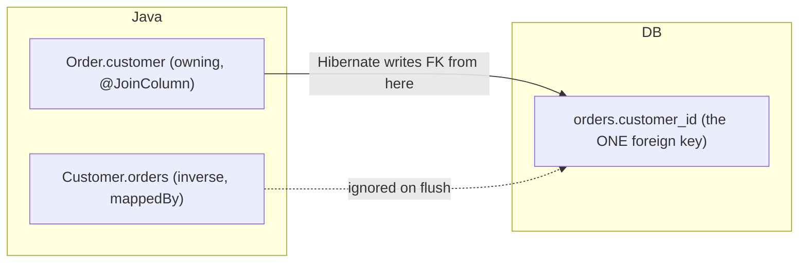
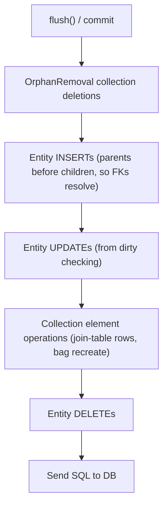

# Entity Mappings & Associations

How you map Java classes and their relationships to relational tables is the
single most consequential decision in a JPA/Hibernate model. Get the *owning
side*, *fetch type*, and *collection type* right and Hibernate emits tight,
predictable SQL. Get them wrong and you ship silent data loss (updating the
inverse side does nothing), N+1 storms, `LazyInitializationException`, or
delete-all-then-reinsert churn on every save.

This topic uses **Jakarta Persistence 3.1/3.2** (`jakarta.persistence.*` — the
Jakarta EE 9+ namespace that replaced `javax.persistence.*`) and **Hibernate
ORM 6.x/7.x**. For the underlying SQL/index/transaction mechanics see
`messaging-databases`; for the persistence context, dirty checking, and flush
order see `hibernate-jpa/transactions-dirty-checking-flushing`; for lazy vs
eager and the deep N+1 treatment see
`hibernate-jpa/fetching-lazy-eager-n-plus-one`; for the repository layer see
`hibernate-jpa/spring-data-jpa-repositories`.

---

## @Entity, @Table and @Column basics

An `@Entity` class is a *managed* type: Hibernate tracks its instances in the
persistence context, dirty-checks them, and maps them to a table. The minimum
contract:

- The class is annotated `@Entity` and has a no-arg constructor (at least
  `protected`/package-private; the JVM/Hibernate uses it to instantiate rows).
- It is a top-level (or static nested) class, not `final`, and its persistent
  fields/getters are not `final` — Hibernate needs to subclass it for runtime
  proxies (lazy loading) and to enhance it for dirty tracking.
- It declares exactly one identifier via `@Id` (or a composite id — see
  `hibernate-jpa/inheritance-embeddables-composite-keys`).

```java
import jakarta.persistence.*;

@Entity
@Table(name = "app_user",
       uniqueConstraints = @UniqueConstraint(columnNames = "email"),
       indexes = @Index(name = "ix_user_email", columnList = "email"))
public class User {

    @Id
    @GeneratedValue(strategy = GenerationType.IDENTITY)
    private Long id;

    @Column(name = "email", nullable = false, length = 320, unique = true)
    private String email;

    @Column(name = "display_name", length = 100)
    private String displayName;

    protected User() { }        // required no-arg ctor
    // getters/setters ...
}
```

Key annotation semantics:

| Annotation | Purpose | Notes / gotchas |
|---|---|---|
| `@Entity(name=...)` | Marks a managed class; `name` sets the **JPQL** entity name (defaults to the simple class name) | The JPQL name is *not* the table name |
| `@Table` | Table name, schema/catalog, unique constraints, indexes | Optional; defaults to the entity name |
| `@Column` | Column name, `nullable`, `length`, `precision`/`scale`, `unique`, `insertable`/`updatable` | `nullable=false` only adds a DDL constraint; it does **not** validate at flush unless the DB rejects it |
| `@Basic` | Marks a simple mapped attribute; `fetch=LAZY` hint for basic columns | Rarely needed; LAZY on basic needs bytecode enhancement |
| `@Transient` | Excludes a field from persistence | Different from Java's `transient` keyword (though that also works) |
| `@Access` | FIELD vs PROPERTY access | Where you put `@Id` usually decides the default access type |

> [!WARNING]
> `@Column(nullable=false)` and `@Column(length=...)` affect **generated DDL
> only**. If you don't let Hibernate generate the schema (production almost
> never does — see `hibernate-jpa/configuration-bootstrapping-schema-generation`),
> those attributes have no runtime effect. For actual runtime validation use
> Bean Validation (`@NotNull`, `@Size`) with the Hibernate Validator
> integration.

**Access type.** If `@Id` is on a field, Hibernate uses *field access* for the
whole entity (reads/writes fields directly, reflectively); if on a getter, it
uses *property access* (calls getters/setters). Mixing is possible with
`@Access` but a frequent source of "why isn't my getter being called" bugs.

---

## The four association types

JPA models relationships with four annotations. The name describes cardinality
from *this* entity's perspective (this-side → other-side):

| Annotation | Cardinality | Default fetch | Typical FK location |
|---|---|---|---|
| `@ManyToOne` | many of *this* → one target | **EAGER** | FK column on *this* entity's table (owning) |
| `@OneToMany` | one of *this* → many targets | **LAZY** | FK on the *other* table |
| `@OneToOne` | one → one | **EAGER** | FK on one side (owning), unique |
| `@ManyToMany` | many → many | **LAZY** | join table |

> [!KEY-TAKEAWAY]
> Memorize the fetch defaults: **`@ManyToOne` and `@OneToOne` are EAGER;
> `@OneToMany` and `@ManyToMany` are LAZY.** The rule of thumb: the `*ToOne`
> (singular target) sides are eager, the `*ToMany` (collection) sides are lazy.
> This is one of the most-asked JPA trivia questions — and the EAGER `*ToOne`
> default is a leading cause of accidental N+1 (see
> `hibernate-jpa/fetching-lazy-eager-n-plus-one`).

A `@ManyToOne` and a `@OneToMany` are usually two ends of the *same*
relationship. `Order` has `@ManyToOne Customer`; `Customer` has
`@OneToMany List<Order>`. There is one FK column (`orders.customer_id`); the two
annotations are two Java views of it.

---

## Owning side vs inverse side

This is the concept that separates people who "use JPA" from people who
understand it. In the relational model a relationship is *one* foreign key.
Hibernate has to decide which Java field controls that FK. That field is the
**owning side**; the other is the **inverse (non-owning) side**.

Rules:

- The **owning side** has the `@JoinColumn`/`@JoinTable` (or accepts the
  defaults) and **no `mappedBy`**. Hibernate reads *this* side's state to decide
  the FK value in the generated `INSERT`/`UPDATE`.
- The **inverse side** declares `mappedBy = "<field on owning side>"`. It is a
  read-only *mirror*. Hibernate **ignores it** when writing the FK.
- For `@ManyToOne`/`@OneToMany`, the `@ManyToOne` (many) side is *always* the
  owning side, because that is the table that physically holds the FK column.
  So the `@OneToMany` collection must be the inverse side (`mappedBy`).

```java
@Entity
public class Customer {
    @Id @GeneratedValue Long id;

    // INVERSE side: read-only mirror, ignored when writing the FK
    @OneToMany(mappedBy = "customer")
    private List<Order> orders = new ArrayList<>();
}

@Entity
public class Order {
    @Id @GeneratedValue Long id;

    // OWNING side: this field's value determines orders.customer_id
    @ManyToOne
    @JoinColumn(name = "customer_id")
    private Customer customer;
}
```

> [!WARNING]
> **The #1 association gotcha.** Setting only the inverse side persists
> nothing. This runs without error and writes `customer_id = NULL`:
> ```java
> customer.getOrders().add(order);   // inverse side only
> em.persist(order);
> ```
> Because `Order.customer` (the owning side) was never set, Hibernate has
> nothing to put in the FK column. You must set the owning side:
> `order.setCustomer(customer);`. This silent no-op — no exception, just a
> missing relationship — is exactly what interviewers probe.



**How to reason about it in an interview:** "Which table has the foreign key
column? That table's entity is the owning side. `mappedBy` goes on the *other*
side and points at the field name that owns it."

---

## Keeping both sides in sync (helper methods)

Because the inverse side is a mirror, if you set only the owning side the FK is
correct in the DB — but your *in-memory* inverse collection is now stale within
the same persistence context/transaction, which causes surprising reads and
broken cascades. The idiom is a **helper method on the parent** that mutates
both ends atomically:

```java
@Entity
public class Customer {
    @OneToMany(mappedBy = "customer",
               cascade = CascadeType.ALL, orphanRemoval = true)
    private List<Order> orders = new ArrayList<>();

    public void addOrder(Order o) {
        orders.add(o);          // fix inverse (in-memory) view
        o.setCustomer(this);    // fix owning side -> FK actually persists
    }
    public void removeOrder(Order o) {
        orders.remove(o);
        o.setCustomer(null);
    }
}
```

> [!TIP]
> Always add these `addX`/`removeX` helpers on bidirectional associations. They
> guarantee both sides agree, make `orphanRemoval`/cascade behave, and keep your
> object graph consistent without a flush+reload. This is a standard
> "what would you improve in this code" answer.

---

## Unidirectional vs bidirectional

- **Unidirectional**: only one entity references the other. Simpler. You can
  navigate one way only.
- **Bidirectional**: both entities reference each other (owning + `mappedBy`
  inverse). You can navigate both ways, and you get a natural place for helper
  methods — but you must keep both sides in sync yourself.

A notorious case is the **unidirectional `@OneToMany` with `@JoinColumn`** vs
**with a join table**:

```java
// Unidirectional @OneToMany, NO mappedBy (there is no inverse @ManyToOne)
@OneToMany
@JoinColumn(name = "customer_id")   // put FK on child table
private List<Order> orders = new ArrayList<>();
```

Here the collection *is* the owning side of a FK it doesn't physically live in.
To insert a child, Hibernate first `INSERT`s the `Order` with a `NULL`
`customer_id`, then issues a separate `UPDATE` to set the FK — extra SQL. If you
omit `@JoinColumn`, JPA's **default for a unidirectional `@OneToMany` is a join
table** (`customer_orders`), which is usually not what people expect.

> [!KEY-TAKEAWAY]
> Prefer **bidirectional** with `@ManyToOne` owning + `@OneToMany(mappedBy=...)`
> inverse over a unidirectional `@OneToMany`. The bidirectional form maps to the
> natural single FK and avoids the extra `UPDATE`s (and, for `List`s, the
> delete-all-reinsert problem below).

---

## @JoinColumn vs @JoinTable

- **`@JoinColumn`** maps a relationship to a **foreign-key column** on the
  owning entity's table. Use for `@ManyToOne`, owning `@OneToOne`, and
  (occasionally) unidirectional `@OneToMany`.
- **`@JoinTable`** maps a relationship to a **separate join/link table** holding
  two FKs. It is the **default** for `@ManyToMany` and can be forced onto other
  associations.

```java
@ManyToMany
@JoinTable(
    name = "student_course",
    joinColumns = @JoinColumn(name = "student_id"),          // this side
    inverseJoinColumns = @JoinColumn(name = "course_id"))    // other side
private Set<Course> courses = new HashSet<>();
```

`joinColumns` points back to *this* (owning) entity; `inverseJoinColumns` points
to the target. Get them backwards and you get a table that references the wrong
rows.

---

## @OneToOne mapping and its traps

`@OneToOne` shares one row-to-one-row relationship. The owning side holds the FK
(unique constraint enforces the 1:1); the inverse uses `mappedBy`.

```java
@Entity
public class User {
    @OneToOne(mappedBy = "user", cascade = CascadeType.ALL)  // inverse
    private UserProfile profile;
}
@Entity
public class UserProfile {
    @OneToOne @JoinColumn(name = "user_id", unique = true)   // owning
    private User user;
}
```

> [!WARNING]
> **A `@OneToOne` on the inverse side cannot be lazy by default.** For a
> `@ManyToOne` or owning `@OneToOne`, Hibernate can put a proxy in the field. But
> the *inverse* (`mappedBy`) `@OneToOne` has no FK column on its own row, so
> Hibernate can't tell whether the other side exists without a query — it must
> either return `null` or a proxy, and to know which it *executes a SELECT
> anyway*. Result: a `mappedBy` `@OneToOne` is effectively eager even if you mark
> it `LAZY`, unless you enable **bytecode enhancement** (`@LazyToOne` /
> build-time enhancement). Owning-side `@OneToOne` (which has the FK) *can* be
> lazy, but even then Hibernate may need `@MapsId` or a not-null FK to make it a
> reliable proxy.

A common cleaner alternative: model an optional 1:1 as a shared primary key with
`@MapsId`, so the child's PK *is* the parent's FK (no extra unique column, and
lazy works reliably on the owning side).

---

## @ManyToMany and why an explicit join entity is usually better

`@ManyToMany` maps directly to a join table with two FKs and *nothing else*. It
works only while the association carries no data of its own.

The moment you need an attribute *about the relationship* — enrollment date,
quantity, line-item price, a role, a status — you cannot add it to a
`@ManyToMany` join table. The standard senior answer: **decompose the
`@ManyToMany` into an explicit join entity with two `@ManyToOne`s**, i.e. two
`@OneToMany` relationships pointing at a real entity:

```java
@Entity
public class Enrollment {                 // the join table as a first-class entity
    @EmbeddedId EnrollmentId id;          // (student_id, course_id) composite PK
    @ManyToOne @MapsId("studentId") @JoinColumn(name="student_id") Student student;
    @ManyToOne @MapsId("courseId")  @JoinColumn(name="course_id")  Course  course;

    @Column(nullable=false) LocalDate enrolledOn;   // <- the extra column @ManyToMany can't hold
    @Enumerated(EnumType.STRING) EnrollmentStatus status;
}
```

Benefits: extra columns, explicit control of the link's lifecycle, ability to
query/sort/paginate the links directly, and no surprise delete-all-reinsert.

> [!KEY-TAKEAWAY]
> "`@ManyToMany` is fine for a pure tag-style link with no extra data. As soon
> as the relationship has its own attributes — or you want to control its
> lifecycle — replace it with an explicit join entity and two `@OneToMany` /
> `@ManyToOne` associations." This is a top-tier interview answer.

Also: on a bidirectional `@ManyToMany`, exactly one side must be `mappedBy`
(inverse); otherwise Hibernate maps two independent join tables.

---

## List vs Set for collections (and the delete-all-reinsert trap)

The collection *type* you choose changes both semantics and the SQL Hibernate
emits.

| Aspect | `Set` | `List` (bag, no `@OrderColumn`) | `List` with `@OrderColumn` |
|---|---|---|---|
| Duplicates | No | Yes | Yes |
| Order preserved | No | No (bag) | Yes (index column) |
| Uses `equals`/`hashCode` | Yes (dedup) | No | No |
| Update behavior (see below) | Row-level add/remove | Often delete-all + reinsert | Delete-all + reinsert on structural change |

The infamous case: a **bidirectional `@OneToMany` mapped as a `List`** (a "bag").
Because a bag has no stable identity/position that Hibernate tracks, when you
modify the collection Hibernate sometimes cannot compute a minimal diff and
instead **`DELETE`s all child rows and re-`INSERT`s them**:

```sql
-- remove one order from a 3-element List<Order>, then flush:
DELETE FROM orders WHERE customer_id = ?;
INSERT INTO orders (...) VALUES (...);   -- x2, the survivors re-inserted
```

> [!WARNING]
> This delete-all-then-reinsert on a `@OneToMany` `List`/bag is a classic
> performance and correctness gotcha: it thrashes the DB, breaks
> auto-increment/audit assumptions, and can deadlock. Fixes: use a `Set`
> (Hibernate does row-level `DELETE ... WHERE id = ?`), or add an
> `@OrderColumn` if order matters, or model the owning `@ManyToOne` side and
> operate on it. For simple parent-child, a `Set` is the safe default.

Note the *owning-side* matters: the problem is most acute when the collection is
the owning side (unidirectional `@OneToMany` + `@JoinColumn`) or a bag. A
bidirectional `@OneToMany(mappedBy=...)` where the `@ManyToOne` owns the FK is
better behaved, but a `List` bag can still trigger recreation on reordering.

---

## equals() and hashCode() on entities

Because `Set`s dedup via `equals`/`hashCode`, and because entities move through
states (transient → managed → detached) and get proxied, entity equality is a
minefield.

Rules that hold up:

- **Do not** use the auto-generated `@Id` in `hashCode()`. A transient entity
  has `id == null`; after `persist`+flush it gets an id, so its hash *changes*
  while it sits in a `HashSet` — the JVM can no longer find it. This breaks the
  Set.
- **Do not** use all fields / Lombok `@Data`'s default `equals`. It pulls lazy
  associations (triggering loads / `LazyInitializationException`) and changes as
  fields mutate.
- **Best practice:** use a **business/natural key** (e.g. email, ISBN) if one is
  truly immutable and unique. If none exists, use a UUID assigned in the
  constructor (an application-assigned key), so identity is stable across the
  whole lifecycle. `hashCode()` should return a constant or the natural key's
  hash so it never changes while the object is in a `Set`.

> [!WARNING]
> Never call Lombok `@EqualsAndHashCode`/`@ToString` with defaults on an
> `@Entity`. `@ToString` alone can trigger lazy loads and stack overflows on
> bidirectional graphs; default `equals` breaks Set semantics and can pull the
> whole graph. Exclude associations explicitly.

---

## Cascade types and how they flow across associations

`cascade` on an association tells Hibernate to propagate `EntityManager`
operations from the parent to the associated entities. It is set per
association, e.g. `@OneToMany(cascade = CascadeType.ALL)`.

| CascadeType | Propagates | Common use |
|---|---|---|
| `PERSIST` | `em.persist()` | Save children when saving parent |
| `MERGE` | `em.merge()` | Reattach detached graphs |
| `REMOVE` | `em.remove()` | Delete children with parent |
| `REFRESH` | `em.refresh()` | Reload children |
| `DETACH` | `em.detach()` | Evict children from context |
| `ALL` | all of the above | Aggregate-root parent-child |

Two related but *distinct* concepts:

- **`CascadeType.REMOVE`** deletes children when the parent is removed.
- **`orphanRemoval = true`** deletes a child when it is *disassociated* from the
  parent collection (`parent.getChildren().remove(child)`), even without
  removing the parent. See
  `hibernate-jpa/cascade-types-orphan-removal` for the deep treatment.

> [!WARNING]
> Do **not** put `CascadeType.REMOVE` (or `ALL`) on a `@ManyToOne` pointing at a
> shared parent (e.g. `Order.customer`). Removing one order would cascade to
> delete the customer — and all their other orders. Cascade belongs on the
> aggregate root's owning collection, pointing *down* to children it exclusively
> owns, not *up* to a shared parent.

---

## What Hibernate does on flush for associations

Understanding the generated SQL is the senior differentiator. When a transaction
commits (or you call `flush()`), Hibernate runs its **action queue** in a fixed
order and reads the *owning* side of each association to compute FK values. The
canonical flush ordering (see
`hibernate-jpa/transactions-dirty-checking-flushing` for the full list):



Example: saving a `Customer` with two `Order`s via cascade produces —

```sql
INSERT INTO app_customer (id, name) VALUES (?, ?);
INSERT INTO orders (id, customer_id, total) VALUES (?, ?, ?);  -- FK from owning side
INSERT INTO orders (id, customer_id, total) VALUES (?, ?, ?);
```

If you had set only the inverse collection and not `order.setCustomer(...)`, the
`customer_id` above would be `NULL` — the silent bug from the owning-side
section.

For the N+1 fan-out that eager/lazy associations cause and its fixes
(`JOIN FETCH`, `@EntityGraph`, `@BatchSize`), see
`hibernate-jpa/fetching-lazy-eager-n-plus-one`. It is cross-referenced here
because association *mapping* choices (fetch defaults, collection types) are what
create the N+1 in the first place.

---

## Common Interview Follow-ups

- **"What are the default fetch types for each association?"** `@ManyToOne` and
  `@OneToOne` → EAGER; `@OneToMany` and `@ManyToMany` → LAZY.
- **"How do you decide which side is the owning side?"** The side whose table
  holds the FK column; it has `@JoinColumn` and no `mappedBy`. The inverse side
  uses `mappedBy`.
- **"I added a child to the parent collection and it wasn't saved — why?"** Only
  the inverse side was set; the owning `@ManyToOne` FK field was never assigned,
  so Hibernate wrote nothing (or `NULL`). Use a helper method that sets both.
- **"When would you not use `@ManyToMany`?"** Whenever the link needs its own
  attributes or lifecycle — model an explicit join entity with two
  `@ManyToOne`s.
- **"Why is a bidirectional `@OneToMany` `List` dangerous?"** Bag semantics can
  make Hibernate delete all children and re-insert on modification; prefer `Set`
  or `@OrderColumn`.
- **"Why shouldn't you use the generated id in `equals`/`hashCode`?"** It's
  `null` while transient and changes after flush, corrupting `HashSet`
  membership. Use a stable natural key or application-assigned UUID.
- **"Can a `mappedBy` `@OneToOne` be lazy?"** Not reliably without bytecode
  enhancement; the inverse side has no FK, so Hibernate must query to know
  whether to null it, making it effectively eager.
- **"Where should cascade go, and why not on `@ManyToOne`?"** On the aggregate
  root's owning collection pointing down at exclusively-owned children; on a
  `@ManyToOne` to a shared parent it would cascade-delete the shared parent.

## References

- Jakarta Persistence 3.1 / 3.2 Specification — Chapter "Entity" and
  "Relationship Mapping" (`jakarta.persistence.*`).
- Hibernate ORM 6.x/7.x User Guide — "Associations", "Collections",
  "Fetching", "Flushing".
- Vlad Mihalcea, *High-Performance Java Persistence* — owning side, best `List`
  vs `Set` practices, `@ManyToMany` pitfalls, entity `equals`/`hashCode`.
- Cross-references: `hibernate-jpa/fetching-lazy-eager-n-plus-one`,
  `hibernate-jpa/cascade-types-orphan-removal`,
  `hibernate-jpa/transactions-dirty-checking-flushing`,
  `hibernate-jpa/inheritance-embeddables-composite-keys`,
  `hibernate-jpa/spring-data-jpa-repositories`, and `messaging-databases` for
  DB-level FK/index/transaction mechanics.
