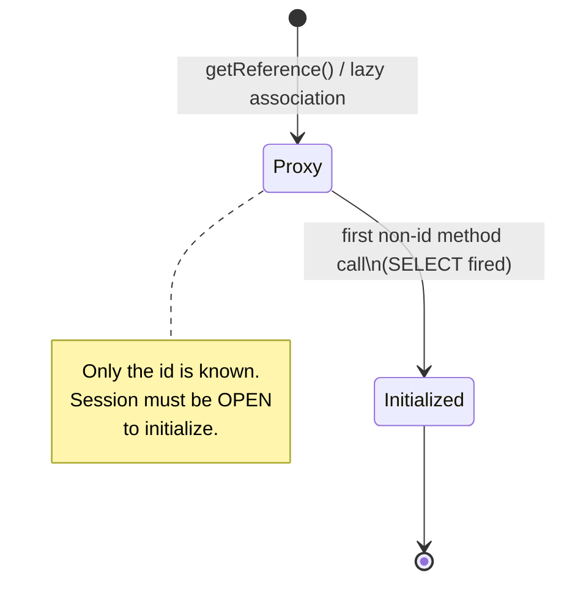
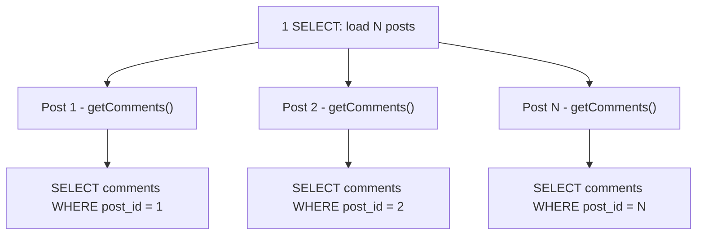

# Fetching Strategies: Lazy vs Eager & the N+1 Problem

How and *when* Hibernate loads associated entities is the single most-asked
Hibernate interview topic — because getting it wrong is the most common source of
production performance disasters (the N+1 problem) and the most common runtime error
beginners hit (`LazyInitializationException`). This page covers what LAZY and EAGER
actually mean, the *mechanism* Hibernate uses to defer loading (proxies and bytecode
enhancement), the N+1 problem with real generated SQL, and every legitimate fix.

> [!INTERVIEW]
> The senior-level answer to "how do you fix N+1?" is never "use EAGER." EAGER
> *causes* N+1 and Cartesian products just as often as it prevents them. The
> real answer: keep everything LAZY, then fetch exactly what a given use case
> needs per-query via `JOIN FETCH`, `@EntityGraph`, batch fetching, or a DTO
> projection.

Underlying SQL join mechanics, index usage, and read-consistency live in
`messaging-databases` — see `messaging-databases/sql-joins` and
`messaging-databases/indexing`. Here we stay at the ORM altitude: what SQL
Hibernate *generates* and *why*.

## FetchType LAZY vs EAGER

`FetchType` (defined in `jakarta.persistence.FetchType`) tells the provider *when* to
load an association:

- **`EAGER`** — the association must be loaded at the same time as the owning entity.
  When you load the parent, the child is fetched immediately (usually via a join or a
  secondary select).
- **`LAZY`** — the association is a *hint* that it may be loaded on first access. The
  provider is allowed to defer the load until the association is actually navigated.

Every relationship annotation has a `fetch` attribute. The **spec-mandated defaults**
are the number-one precision question in interviews:

| Annotation | Default `fetch` | Rationale |
|---|---|---|
| `@ManyToOne` | **EAGER** | Single row on the other side — "cheap" to load |
| `@OneToOne` | **EAGER** | Single row on the other side |
| `@OneToMany` | **LAZY** | Could be a huge collection — never load eagerly by default |
| `@ManyToMany` | **LAZY** | Same — collections are lazy |

Mnemonic: **to-one is EAGER, to-many is LAZY.** (The "many" side being LAZY is what
makes it safe to have a `Post` with a `List<Comment>` without dragging every comment
into memory on every load.)

> [!KEY-TAKEAWAY]
> LAZY is only a *hint* in the JPA spec — a provider may fetch eagerly anyway.
> EAGER is a *requirement* — the provider must load it. In practice Hibernate
> honors LAZY for collections and (with a proxy) for to-one associations.

```java
@Entity
class Post {
    @Id @GeneratedValue Long id;

    // Collection: LAZY by default — good.
    @OneToMany(mappedBy = "post")
    List<Comment> comments = new ArrayList<>();
}

@Entity
class Comment {
    @Id @GeneratedValue Long id;

    // to-one: EAGER by default — usually you want to override this to LAZY.
    @ManyToOne(fetch = FetchType.LAZY)
    Post post;
}
```

## Why EAGER is a code smell

Making a to-one association EAGER (or leaving the default EAGER in place) is widely
considered an anti-pattern for these reasons:

1. **It cannot be turned off per-query.** LAZY can always be upgraded to eager for a
   specific query (`JOIN FETCH`, entity graph). But EAGER is *baked into the mapping* —
   you cannot easily make an EAGER association lazy for one query. You are stuck paying
   for it on **every** load path, including `find()`, JPQL, and Criteria.
2. **Surprise joins / extra selects.** Every EAGER to-one silently adds a join (or a
   secondary select) to queries you didn't write with that association in mind.
3. **It causes N+1 on `getResultList()`.** When you run a JPQL query that returns N
   entities, Hibernate cannot always fold an EAGER association into the main query — it
   fires one extra SELECT per returned row to satisfy the EAGER contract. This is the
   classic EAGER-induced N+1 (see below).
4. **Cartesian products with multiple EAGER collections** — two EAGER `@OneToMany`
   associations multiply rows.

> [!WARNING]
> The professional default is: **make all associations LAZY**, including `@ManyToOne`
> and `@OneToOne`, with `fetch = FetchType.LAZY`. Then fetch eagerly *per use case* in
> the query. This is the opposite of what the JPA defaults give you for to-one.

Note a `@OneToOne` gotcha: an *optional* (nullable) `@OneToOne` on the **non-owning**
side (the `mappedBy` side) cannot be proxied to LAZY without bytecode enhancement,
because Hibernate must issue a query to know whether the association is null. See
"How LAZY works" below.

## How LAZY works: proxies and bytecode enhancement

LAZY is not magic — Hibernate implements it two different ways depending on the
association cardinality:

**1. To-one associations → runtime proxy.**
For a LAZY `@ManyToOne`/`@OneToOne`, Hibernate hands you a **proxy** — a subclass of
your entity generated at runtime (historically via CGLIB/Javassist, now via ByteBuddy)
that holds only the foreign-key id. The proxy has all the real class's methods
overridden. Calling any method other than the id getter triggers **initialization**: a
`SELECT` is fired to hydrate the real state. `entityManager.getReference(Post.class,
id)` returns exactly such an uninitialized proxy.

**2. Collections → lazy collection wrapper.**
For a LAZY `@OneToMany`/`@ManyToMany`, Hibernate replaces your `List`/`Set` with its own
persistent-collection type (`PersistentBag`, `PersistentSet`, ...). The collection is
uninitialized until you touch it (call `size()`, iterate, etc.), at which point the
`SELECT` for its rows runs.

**3. Bytecode enhancement (optional).**
With the Hibernate build-time bytecode enhancer (`enableLazyInitialization`), Hibernate
can do **attribute-level lazy loading** (lazy `@Basic` columns, e.g. a big `@Lob`) and
can make LAZY to-one associations work *without* a proxy object — including the tricky
optional-`@OneToOne`-on-the-inverse-side case. Without enhancement, an optional inverse
`@OneToOne` is effectively EAGER.



> [!TIP]
> `Hibernate.isInitialized(proxy)` tells you if a proxy/collection is loaded.
> `Hibernate.initialize(proxy)` forces it (while the session is open).
> `entityManager.getReference(...)` deliberately returns an uninitialized proxy —
> useful for setting a FK without a SELECT.

## LazyInitializationException

The single most famous Hibernate error. It is thrown when you access an
**uninitialized** lazy association or collection **after the persistence context
(Session) that owned it has been closed**.

Typical scenario: a `@Transactional` service method loads a `Post`, returns it, the
transaction commits and the Session closes; then the view layer (or a serializer like
Jackson) calls `post.getComments()`. The collection proxy has no open Session to run
its `SELECT`, so:

```
org.hibernate.LazyInitializationException: failed to lazily initialize a
collection of role: com.example.Post.comments: could not initialize proxy - no Session
```

### The WRONG "fixes"

| "Fix" | Why it's wrong |
|---|---|
| Change the mapping to `EAGER` | Reintroduces N+1 / Cartesian products on *every* query; can't be scoped per use case. |
| Enable **Open Session In View (OSIV)** | `spring.jpa.open-in-view=true` (Spring's default!) keeps the Session open for the whole request, so lazy loads "work" — but you get N+1 fired from the view layer, DB connections held during view rendering, and hidden query load. It hides the design flaw. |
| `Hibernate.initialize()` sprinkled everywhere | Whack-a-mole; still runs extra queries. |

### The RIGHT fix

**Fetch what the use case needs, inside the transaction, in the query** — via
`JOIN FETCH`, an `@EntityGraph`, or a DTO projection. The association stays LAZY in the
mapping; you eagerly initialize it *only* where that data is actually used, before the
Session closes.

> [!WARNING]
> Spring Boot enables OSIV by default (`spring.jpa.open-in-view=true`) and logs a
> warning about it. Senior teams typically set it to `false` and fix lazy access
> properly. See `spring-boot` for request-scope/filter mechanics — here the point is
> that OSIV masks N+1 rather than solving it.

## The N+1 problem

The N+1 problem: you run **1** query to load N parent entities, then Hibernate runs
**N additional** queries — one per parent — to load each parent's lazy association. For
N parents you pay **N+1** round trips to the database.

Consider loading all posts and reading each one's comments:

```java
List<Post> posts = em.createQuery("select p from Post p", Post.class).getResultList();
for (Post p : posts) {
    p.getComments().size();   // triggers a SELECT per post
}
```

Generated SQL (with, say, 100 posts):

```sql
-- 1 query for the parents
select p.id, p.title from post p;

-- then N=100 queries, one per post, as each lazy collection is touched
select c.id, c.body from comment c where c.post_id = ?;   -- post 1
select c.id, c.body from comment c where c.post_id = ?;   -- post 2
...                                                        -- ... 98 more
```



**EAGER causes the same thing:** if `Comment.post` were `@ManyToOne(EAGER)` and you ran
`select c from Comment c`, Hibernate would run 1 query for the comments and then 1
extra SELECT per distinct post to satisfy the EAGER contract — N+1 again, and you can't
turn it off for that query.

### Detecting N+1

- **Log the SQL:** `hibernate.show_sql=true` / `spring.jpa.show-sql=true`, or better,
  set `org.hibernate.SQL` logger to DEBUG. Seeing the same parameterized SELECT fire
  many times in a loop is the tell.
- **Count queries in tests:** tools like Hibernate `Statistics`
  (`sessionFactory.getStatistics().getPrepareStatementCount()`) or datasource-proxy /
  `QuickPerf` assert a query count.
- **APM traces** (see `observability`) show the fan-out of identical queries.

## Fix: JOIN FETCH

The most direct fix: tell the query to load the association in the *same* SQL statement
using a JPQL/HQL `join fetch`.

```java
List<Post> posts = em.createQuery(
    "select p from Post p join fetch p.comments", Post.class).getResultList();
```

Generated SQL — **one** statement, an inner join:

```sql
select p.id, p.title, c.id, c.body
from post p
join comment c on c.post_id = p.id;
```

Notes and gotchas:

- Use `left join fetch` if you want posts that have **no** comments (an inner
  `join fetch` drops parents with empty collections).
- Fetching a collection returns **duplicate parent references** (one row per child).
  Use `select distinct p ...` — in Hibernate 6+ the `distinct` keyword no longer adds a
  SQL `DISTINCT` for entity queries by default (the
  `hibernate.query.passDistinctThrough=false` behavior became the default), so it
  de-duplicates the Java result list without a needless SQL `DISTINCT`.
- **You cannot paginate a collection `join fetch` in SQL.** If you add
  `setMaxResults()`/`setFirstResult()` to a query that fetches a collection, Hibernate
  cannot apply `LIMIT` correctly (the collection explodes rows), so it fetches
  **everything into memory and paginates in-app** — logging
  `HHH000104: firstResult/maxResults specified with collection fetch; applying in
  memory`. This is a serious, silent OOM risk. For pagination + collection, use batch
  fetching or a two-query approach instead.

## Fix: @EntityGraph

`@NamedEntityGraph` / `jakarta.persistence.EntityGraph` is the JPA-standard, declarative
way to specify a fetch plan *without* hardcoding a `join fetch` into every query. It
overrides the mapping's fetch types for that one query.

Two flavors:

- **`FETCH` graph** (`jakarta.persistence.fetchgraph` hint): attributes in the graph are
  EAGER; everything else is **LAZY** (even if mapped EAGER).
- **`LOAD` graph** (`jakarta.persistence.loadgraph` hint): attributes in the graph are
  EAGER; everything else keeps its **mapping default**.

Spring Data makes this a one-liner on a repository method:

```java
interface PostRepository extends JpaRepository<Post, Long> {

    @EntityGraph(attributePaths = {"comments"})   // ad-hoc graph
    List<Post> findAll();
}
```

Hibernate implements an entity graph the same way as `join fetch` (a single join query),
so it fixes N+1 the same way — but it is reusable and declarative, and it plays nicely
with Spring Data derived queries. Same collection-pagination caveat applies.

## Fix: batch fetching (@BatchSize)

Batch fetching keeps the lazy behavior but loads the N children in **batches** using an
`IN (...)` clause instead of one query per parent — turning N+1 into roughly
`1 + ceil(N / batchSize)` queries.

```java
@Entity
class Post {
    @OneToMany(mappedBy = "post")
    @BatchSize(size = 10)               // Hibernate annotation
    List<Comment> comments;
}
```

Or set it globally (recommended): `hibernate.default_batch_fetch_size=16` (or in Spring
Boot, `spring.jpa.properties.hibernate.default_batch_fetch_size=16`).

Now when you touch the first post's comments, Hibernate initializes up to 10 posts'
collections at once:

```sql
select c.post_id, c.id, c.body
from comment c
where c.post_id in (?, ?, ?, ?, ?, ?, ?, ?, ?, ?);
```

> [!TIP]
> Batch fetching is the best general-purpose N+1 defense because it (a) works for both
> collections and to-one proxies, (b) does **not** create Cartesian products, and (c)
> is compatible with pagination. Many teams set `default_batch_fetch_size` globally as a
> safety net. Hibernate 6 uses an in-clause padding strategy for better statement-cache
> reuse.

## Fix: subselect fetching (@Fetch(SUBSELECT))

`@Fetch(FetchMode.SUBSELECT)` initializes **all** the lazy collections of the original
query's parents with a single second query that re-runs the original query as a
subselect:

```java
@OneToMany(mappedBy = "post")
@Fetch(FetchMode.SUBSELECT)
List<Comment> comments;
```

```sql
-- original query
select p.id, p.title from post p where p.title like ?;

-- one subselect loads ALL comments for ALL matched posts
select c.post_id, c.id, c.body
from comment c
where c.post_id in (
    select p.id from post p where p.title like ?
);
```

Two queries total regardless of N. Downside vs `@BatchSize`: it re-executes the original
query (potentially expensive), and it always loads *everything* (no batching granularity).

Comparison of the anti-N+1 tools:

| Technique | Queries | Cartesian product? | Paginatable? | Scope |
|---|---|---|---|---|
| `JOIN FETCH` (JPQL) | 1 | Yes, if 2+ collections | No (collection) | Per query |
| `@EntityGraph` | 1 | Yes, if 2+ collections | No (collection) | Per query (declarative) |
| `@BatchSize` / `default_batch_fetch_size` | 1 + ⌈N/size⌉ | No | Yes | Mapping / global |
| `@Fetch(SUBSELECT)` | 2 | No | No | Mapping |
| DTO projection | 1 | Controlled by you | Yes | Per query |

## MultipleBagFetchException & Cartesian products

If you `join fetch` **two collections** in one query, you hit two problems:

1. **Cartesian product**: joining a post with 10 comments and 5 tags produces 10×5 = 50
   rows — data is multiplied and shipped over the wire, then de-duplicated in memory.
   This scales multiplicatively and can blow up.
2. **`MultipleBagFetchException`**: if both collections are **bags** (a `List` with no
   `@OrderColumn` — Hibernate's default for `List`), Hibernate cannot fetch both in one
   query because it can't correctly de-duplicate two unordered bags simultaneously:

```
org.hibernate.loader.MultipleBagFetchException: cannot simultaneously fetch
multiple bags: [com.example.Post.comments, com.example.Post.tags]
```

Fixes:

- **Use `Set` instead of `List`** for the collections (`Set` is not a bag) — allows
  fetching two, but you still pay the Cartesian product.
- **Better: fetch one collection per query** (split into two queries, or fetch the
  second collection via `@BatchSize`/subselect while `join fetch`-ing only the first).
  Two round trips beat one multiplicative one.
- Or use `@OrderColumn` to make the `List` a genuinely ordered list (not a bag), though
  this adds an index column.

> [!KEY-TAKEAWAY]
> Never `JOIN FETCH` more than one collection. Fetch to-one associations and *at most
> one* collection per query; get the rest via batch/subselect fetching or a second query.

## DTO projections

When you only need to *read* data (not modify managed entities), the cleanest fix is to
skip entities entirely and project straight into a **DTO**. No lazy associations exist on
a DTO, so there's no N+1 and no `LazyInitializationException` — and you fetch only the
columns you need.

```java
public record PostSummary(Long id, String title, long commentCount) {}

List<PostSummary> rows = em.createQuery("""
        select new com.example.PostSummary(p.id, p.title, count(c))
        from Post p left join p.comments c
        group by p.id, p.title
        """, PostSummary.class).getResultList();
```

- JPQL **constructor expressions** (`select new ...`) map rows to DTOs directly.
- Spring Data supports **interface-based** and **class-based projections** — see
  `spring-data-jpa-repositories` for the repository-level API.
- DTOs are the recommended approach for read-heavy, list/reporting endpoints: entities
  are for the write model (dirty checking, cascades — see
  `transactions-dirty-checking-flushing`); DTOs are for the read model.

> [!INTERVIEW]
> A strong closing line: "For reads I project into DTOs so I load exactly the columns I
> need and avoid the whole lazy/eager question; for writes I load managed entities with
> a fetch plan tailored to the operation."

## The FetchMode triad: SELECT, JOIN, SUBSELECT

`FetchType` (JPA) decides *when* an association loads. Hibernate's own
`@Fetch(FetchMode.…)` decides *how* it loads. There are **three** modes, not just the
SUBSELECT covered above:

| `@Fetch` mode | What Hibernate does | Query count for N parents |
|---|---|---|
| **`SELECT`** (default) | One secondary `SELECT` per association, lazily on access | 1 + N — **this is the N+1 generator** |
| **`JOIN`** | Eager outer join folded into the *owner's* `SELECT` | 1 (but forces eager) |
| **`SUBSELECT`** | One second query using the original query as an `IN (subselect)` | 2 |

`FetchMode.SELECT` is the implicit default and is exactly the mechanism behind classic
N+1. `FetchMode.JOIN` makes the association eager via a LEFT OUTER JOIN in the same
statement.

> [!WARNING]
> **`@Fetch(FetchMode.JOIN)` is silently ignored for JPQL/HQL and Criteria queries.**
> It only takes effect for `EntityManager.find()` and `getReference()`. So a developer
> annotates `Comment.post` with `@Fetch(FetchMode.JOIN)`, expecting their
> `findAll()`-style JPQL to avoid N+1 — but the repository's `select c from Comment c`
> still fires N secondary SELECTs, because JPQL builds its own fetch plan and disregards
> `FetchMode.JOIN`. To eager-join inside a JPQL query you must write an explicit
> `join fetch` or use an entity graph. This "why is my `@Fetch(JOIN)` not working" bug is
> a very common senior gotcha.

```java
@ManyToOne(fetch = FetchType.LAZY)
@Fetch(FetchMode.JOIN)     // honored by find()/getReference() ONLY, not JPQL/Criteria
Post post;
```

## Proxy identity gotchas

A LAZY to-one proxy is a **ByteBuddy-generated subclass** of your entity. That runtime
subclass leaks in several ways senior candidates are expected to know:

- **`entity.getClass()` returns `Post$HibernateProxy$xxxx`, NOT `Post.class`.** Any
  `getClass() == Post.class` comparison fails; `instanceof` against a *subtype* of the
  entity (in an inheritance hierarchy) is unreliable because the proxy extends the base
  type, not the concrete subclass.
- **Field access does NOT initialize the proxy — only getter/method calls do.** So an
  `equals()`/`hashCode()` that reads fields *directly* (`this.name`) instead of via
  getters sees `null` on a proxy, silently breaking equality. Always call getters inside
  `equals`/`hashCode`, and prefer a stable **business key** over generated `@Id`.
- **`WrongClassException` / `ClassCastException`** on polymorphic associations: if
  `payment` is a proxied `Payment` and the real row is a `CreditCardPayment`, the proxy is
  of the *base* type `Payment`, so `(CreditCardPayment) order.getPayment()` throws
  `ClassCastException`. Downcasting a proxy is a trap.

Escapes:

```java
// Get the REAL, initialized entity out of a proxy (Hibernate 5.2.10+):
Post real = Hibernate.unproxy(proxy, Post.class);
// Get the real class regardless of proxying:
Class<?> type = Hibernate.getClass(entity);   // -> Post.class, not the $Proxy subclass
```

> [!TIP]
> A subtle interview puzzle: load `a` via `em.find(Post.class, 1L)` (real instance) and
> `b` via `em.getReference(Post.class, 1L)` (proxy) in the same context. `a.getClass()`
> is `Post`, `b.getClass()` is `Post$HibernateProxy$…`, so `a.getClass() == b.getClass()`
> is **false** — yet they represent the same row. Use `Hibernate.getClass()` (or getters
> in a properly written `equals`) to compare correctly.

## More anti-patterns: enable_lazy_load_no_trans and Jackson

The LIE anti-pattern trio has a third leg beyond EAGER and OSIV:

- **`hibernate.enable_lazy_load_no_trans=true`** — makes lazy access "work" outside a
  transaction by opening a **temporary Session + transaction for each lazy load**
  (auto-commit). It masks `LazyInitializationException` but inflates connection and
  transaction count (one round trip per lazy access) and gives **inconsistent reads**
  across a single logical operation (each lazy load sees a different snapshot). It is a
  worse-than-OSIV trap answer.
- **`jackson-datatype-hibernate` (`Hibernate6Module`)** — teaches Jackson to serialize
  uninitialized proxies as `null`/omit them instead of throwing. Like OSIV it *masks* the
  problem rather than solving it; the right answer for a serialization boundary is a DTO.

Ranking the three bad fixes when asked "why is each bad":

1. **EAGER** — worst: pollutes *every* query, unfixable per use case, causes N+1 /
   Cartesian products.
2. **`enable_lazy_load_no_trans`** — hidden per-access transactions, connection churn,
   inconsistent reads.
3. **OSIV** — holds the connection for the whole request and fires N+1 from the view
   layer, but at least reuses one Session/transaction. Still a smell.

The right fix is always: fetch what the use case needs, in the query, in the transaction
(JOIN FETCH / entity graph / DTO).

## Paginating a parent with its children (two-query recipe)

Because a collection `join fetch` cannot be paginated in SQL (`HHH000104`, in-memory
paging, OOM risk), the production-grade recipe is **two queries: fetch a page of IDs,
then fetch the entities with their collection**.

```java
// Query 1: page a set of parent IDs. No collection here, so SQL LIMIT is legal.
List<Long> ids = em.createQuery(
        "select p.id from Post p order by p.createdAt desc", Long.class)
    .setFirstResult(pageOffset)
    .setMaxResults(pageSize)
    .getResultList();

// Query 2: fetch those parents + their comments in one join. IN-list, no LIMIT.
List<Post> page = em.createQuery("""
        select distinct p from Post p
        left join fetch p.comments
        where p.id in :ids
        order by p.createdAt desc
        """, Post.class)
    .setParameter("ids", ids)
    .getResultList();
```

> [!WARNING]
> **You must re-apply the `order by` in query 2.** The `IN (:ids)` clause does not
> preserve the order from query 1, so without an explicit `order by` in the second query
> the page rows can come back in arbitrary order.

Alternatives: a **window-function** query (`DENSE_RANK()`/`ROW_NUMBER()` over the parent)
to page in one statement, or **Blaze-Persistence** which implements keyset/offset
pagination with collection fetches correctly. Note this ID-then-entities pattern is also
exactly how Spring Data JPA (post-2.x) handles a paginated method annotated with
`@EntityGraph` on a collection.

## Filtering a fetch-joined collection (destructive fetch)

A dangerous, data-losing trap: putting a `WHERE` predicate on a **fetch-joined
collection**.

```java
// DANGER: filters the fetched collection itself
List<Post> posts = em.createQuery("""
        select p from Post p
        join fetch p.comments c
        where c.status = 'APPROVED'
        """, Post.class).getResultList();
```

The returned managed `Post.comments` collection now contains **only the APPROVED
comments** — Hibernate hydrated a *partial* collection but marked it initialized. If that
`Post` is then dirty-checked and flushed, Hibernate compares the in-memory (partial)
collection against the DB and can **delete the "missing" rows** (for owned collections /
orphan removal) or otherwise persist a corrupted collection.

> [!KEY-TAKEAWAY]
> **Never put a `WHERE` filter on a fetch-joined collection.** If you need only some
> children, either filter in a DTO/projection query (read-only, not managed), use
> `@Filter`/`@Where` (mapping-level, applied consistently), or fetch the full collection
> and filter in memory. A filtered fetch join corrupts the managed collection.

## Second-level cache can cause N+1

Counter-intuitively, caching can *introduce* N+1. The **query cache stores only entity
IDs**, not the entities themselves. When a cached query is replayed, Hibernate resolves
each ID against the second-level cache — and if the entity regions aren't cached (or were
evicted), it fires **one `SELECT`-by-id per row** to rehydrate them. Result: a cache
"hit" that produces N SELECTs.

> [!WARNING]
> Enabling the query cache without also caching the entity regions it references can make
> a query *slower* than no cache at all. Cache both the query and the entities it returns.
> See `hibernate-jpa/caching-first-second-level` for cache region and concurrency
> strategy details.

## Read-only reads: readOnly and query hints

On pure read paths, tell Hibernate not to track changes. A read-only entity is loaded
**without a dirty-checking snapshot** (Hibernate skips the detached-state copy it
normally keeps to diff at flush), cutting memory and CPU:

```java
@Transactional(readOnly = true)                 // Spring: sets FlushMode + read-only hint
public List<Post> report() { ... }

// Or per-query:
query.setHint(org.hibernate.jpa.QueryHints.HINT_READONLY, true);   // "org.hibernate.readOnly"
```

This pairs with DTO projections as the "read model" strategy: DTOs skip entities
entirely; `readOnly` keeps entities but drops the write-side bookkeeping. See
`hibernate-jpa/transactions-dirty-checking-flushing` for how the snapshot/dirty check
works.

## Entity graphs: types, named graphs, subgraphs

Beyond ad-hoc `attributePaths`, the JPA `EntityGraph` API has more surface area:

- **Graph type** decides how unlisted attributes behave — `@EntityGraph(type = …)` in
  Spring Data, or the hint key at the EntityManager level:
  - `EntityGraphType.FETCH` → hint `jakarta.persistence.fetchgraph`: listed = EAGER,
    everything else **LAZY**.
  - `EntityGraphType.LOAD` → hint `jakarta.persistence.loadgraph`: listed = EAGER,
    everything else keeps its **mapping default**.
- **Named graph** — declare once on the entity, reference by name:

```java
@Entity
@NamedEntityGraph(
    name = "Post.withComments",
    attributeNodes = @NamedAttributeNode("comments"))
class Post { ... }

// Spring Data: reference the named graph
@EntityGraph(value = "Post.withComments", type = EntityGraphType.LOAD)
Optional<Post> findById(Long id);

// EntityManager: pass the graph as a hint to find()
EntityGraph<Post> g = em.getEntityGraph("Post.withComments");
Post p = em.find(Post.class, id, Map.of("jakarta.persistence.loadgraph", g));
// JPA 3.1 adds a typed find(Class, Object, FindOption...) overload too.
```

- **Nested subgraphs** for multi-level plans (Post → comments → author):

```java
@NamedEntityGraph(
    name = "Post.deep",
    attributeNodes = @NamedAttributeNode(value = "comments", subgraph = "commentWithAuthor"),
    subgraphs = @NamedSubgraph(
        name = "commentWithAuthor",
        attributeNodes = @NamedAttributeNode("author")))

// Programmatic equivalent:
EntityGraph<Post> g = em.createEntityGraph(Post.class);
g.addSubgraph("comments").addAttributeNodes("author");
```

> [!WARNING]
> A subtle spec-vs-implementation nuance: even with a **fetch graph** that omits a
> `@ManyToOne(EAGER)` attribute, Hibernate has historically **not reliably demoted a
> mapped-EAGER to-one to lazy** — the association may still load eagerly. The spec says
> unlisted attributes in a fetch graph are LAZY; Hibernate's honoring of that for
> mapped-EAGER to-one associations has been inconsistent across versions. Don't rely on a
> fetch graph to *turn off* a mapped EAGER; fix the mapping instead.

## Bytecode enhancement setup and @LazyGroup

Attribute-level lazy loading and no-proxy lazy to-one require the **build-time bytecode
enhancer** to be enabled — otherwise those mappings are **silently EAGER**.

```groovy
// Gradle
plugins { id 'org.hibernate.orm' version '6.x' }
hibernate {
    enhancement {
        enableLazyInitialization = true      // lazy @Basic / no-proxy lazy to-one
        enableDirtyTracking = true           // in-place dirty tracking (skip full snapshot)
        enableAssociationManagement = true   // auto-manage bidirectional sides
    }
}
```

```xml
<!-- Maven -->
<plugin>
  <groupId>org.hibernate.orm.tooling</groupId>
  <artifactId>hibernate-enhance-maven-plugin</artifactId>
  <configuration><enableLazyInitialization>true</enableLazyInitialization></configuration>
</plugin>
```

With enhancement on:

- `@Basic(fetch = FetchType.LAZY)` on a column (e.g. a big `@Lob`) actually defers loading
  it. **Without enhancement this attribute is loaded eagerly** — the annotation is ignored.
- Each lazy basic attribute is loaded by its **own** secondary SELECT. **`@LazyGroup`**
  batches several lazy attributes into a single secondary SELECT:

```java
@Basic(fetch = FetchType.LAZY)
@LazyGroup("heavy")
@Lob String content;

@Basic(fetch = FetchType.LAZY)
@LazyGroup("heavy")     // loaded together with `content` in ONE extra SELECT
byte[] thumbnail;
```

## Why an inverse LAZY @OneToOne is really EAGER

Deepening the earlier note: on the **owning** side of a `@OneToOne`, the FK column lives
in that table, so Hibernate can build a proxy from the FK value it already has → LAZY
works with a plain proxy. On the **inverse** (`mappedBy`) side, there is **no FK column**
in the parent's row, so Hibernate cannot tell whether the child exists (it might be
`null`) without running a query — and it can't return a proxy for "maybe null". So it
issues an **eager SELECT** regardless of `fetch = LAZY`.

Escapes:

- Enable **bytecode enhancement** (no-proxy lazy loading resolves the null question lazily).
- Use **`@MapsId` / a shared primary key** so the child shares the parent's PK; then the
  child's existence is tied to the parent id and the association can be lazy.

## Hibernate 6/7 fetching behavior changes

Version-precise facts a senior is expected to state correctly:

- **`hibernate.query.passDistinctThrough` was removed in Hibernate 6.** JPQL `distinct` on
  an entity fetch-join query no longer emits SQL `DISTINCT`; Hibernate always
  de-duplicates the entity result list **in memory** and passes the query through without
  `DISTINCT`. (In HB5 you set `passDistinctThrough=false` to get this; in HB6 it is the
  only behavior for entity queries — `distinct` on scalar/DTO queries still emits SQL
  `DISTINCT`.)
- **`hibernate.default_batch_fetch_size` defaults to `-1` (disabled).** You must set a
  positive value to get global batch fetching.
- **In-clause padding (HB6+).** Batch fetching rounds the `IN (…)` list **up to the next
  power of two** (2, 4, 8, 16, …) to maximize prepared-statement / execution-plan cache
  reuse — fewer distinct SQL strings. A 3-element batch is padded to 4 by repeating a
  bind value:

```sql
-- batch of 3 ids, padded to IN with 4 binds (last id duplicated)
select c.post_id, c.id, c.body
from comment c
where c.post_id in (?, ?, ?, ?);   -- binds: 10, 11, 12, 12
```

## Asserting query counts in tests

The senior way to prevent N+1 regressions is to **assert the SQL statement count in CI**,
not to eyeball logs:

- **Hypersistence Utils** — `SQLStatementCountValidator`:

```java
SQLStatementCountValidator.reset();
postService.loadDashboard();
SQLStatementCountValidator.assertSelectCount(2);   // fails if an N+1 sneaks in
```

- **Hibernate `Statistics`** — `hibernate.generate_statistics=true`, then
  `sessionFactory.getStatistics().getPrepareStatementCount()`.
- **datasource-proxy** and **p6spy** — JDBC proxies that log/count every statement and can
  assert counts, independent of Hibernate.

Wiring one of these into a test around each read path turns N+1 from a lurking production
surprise into a failing build.

## Common Interview Follow-ups

- **What are the default fetch types for each association?** to-one (`@ManyToOne`,
  `@OneToOne`) = EAGER, to-many (`@OneToMany`, `@ManyToMany`) = LAZY.
- **Why make `@ManyToOne` LAZY if the default is EAGER?** So it can be fetched
  per-query; EAGER can't be scoped and forces joins/N+1 on every load path.
- **Exactly what throws `LazyInitializationException` and how do you fix it properly?**
  Accessing an uninitialized lazy association after the Session closed; fix by fetching
  in the query (JOIN FETCH / entity graph / DTO), not by EAGER or OSIV.
- **How does LAZY work under the hood?** to-one → runtime proxy (ByteBuddy subclass
  holding the id); collection → persistent-collection wrapper; optionally bytecode
  enhancement for attribute-level laziness and no-proxy to-one.
- **Show the SQL for the N+1 problem and for the JOIN FETCH fix.** (see above.)
- **Why can't you paginate a collection JOIN FETCH?** LIMIT can't be applied to the
  multiplied rows, so Hibernate paginates in memory (`HHH000104`) — OOM risk.
- **Why can't you JOIN FETCH two `List` collections?** `MultipleBagFetchException` + a
  Cartesian product; fetch one collection per query.
- **When would you pick `@BatchSize` over `JOIN FETCH`?** When you need pagination, or
  to avoid Cartesian products, or as a global safety net.
- **Difference between a fetch graph and a load graph?** Fetch graph: listed = EAGER,
  everything else LAZY. Load graph: listed = EAGER, everything else keeps its default.
- **Is `spring.jpa.open-in-view` good?** It's Spring's default but a smell — it hides
  N+1 and holds connections; senior teams disable it.
- **Why doesn't my `@Fetch(FetchMode.JOIN)` stop N+1 in a repository query?** It's
  ignored for JPQL/HQL/Criteria — it only applies to `find()`/`getReference()`. Use
  `join fetch` or an entity graph in the query instead.
- **Why does `proxy.getClass()` not equal `Post.class`?** The proxy is a ByteBuddy
  subclass; use `Hibernate.getClass()` / `Hibernate.unproxy()`, and getters (not fields)
  in `equals`/`hashCode`.
- **How do you paginate parents with their children without OOM?** Two queries: page a
  list of parent IDs (LIMIT is legal, no collection), then `left join fetch` those IDs —
  re-applying the `order by` in the second query.
- **Why is filtering a fetch-joined collection dangerous?** The managed collection is
  hydrated partially but marked initialized; a flush can delete the "missing" rows.
- **Rank EAGER vs `enable_lazy_load_no_trans` vs OSIV as bad fixes.** EAGER is worst
  (unfixable per query), then `enable_lazy_load_no_trans` (per-access transactions,
  inconsistent reads), then OSIV (one Session but view-layer N+1).

## References

- Jakarta Persistence 3.1/3.2 Specification — `jakarta.persistence.FetchType`,
  `@ManyToOne`/`@OneToOne`/`@OneToMany`/`@ManyToMany`, `EntityGraph`,
  `@NamedEntityGraph`, the `jakarta.persistence.fetchgraph`/`loadgraph` hints.
- Hibernate ORM 6.x/7.x User Guide — "Fetching", "Batch fetching",
  `@Fetch(FetchMode.SUBSELECT/JOIN/SELECT)`, `@BatchSize`, bytecode enhancement.
- Vlad Mihalcea — "The best way to fix the Hibernate N+1 query problem",
  "MultipleBagFetchException".
- Related in this library: `hibernate-jpa/entity-mappings-associations`,
  `hibernate-jpa/session-entitymanager-persistence-context`,
  `hibernate-jpa/performance-tuning-pitfalls`,
  `hibernate-jpa/spring-data-jpa-repositories`, `messaging-databases/sql-joins`.
