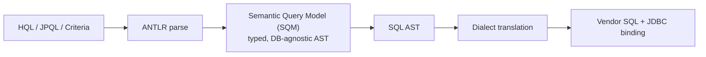

# Modern Hibernate: 6/7 Changes & Jakarta Migration

This topic is the **currency signal** for a Hibernate/JPA interview: it separates a
candidate who last touched the stack in the Java-EE / `javax.persistence` era from one
who is current on **Jakarta Persistence 3.1/3.2**, **Hibernate ORM 6.x/7.x**, and the
**Spring Boot 3** baseline. The headline changes are (1) the `javax.*` → `jakarta.*`
**namespace rename** (a breaking *package* change, not merely a version bump), and (2)
Hibernate 6's ground-up rewrite of its query engine (the **Semantic Query Model, SQM**)
and its **type system** (`JavaType`/`JdbcType`/`@JdbcTypeCode` replacing the legacy
`UserType`/`@Type`/`@TypeDef`).

Interviewers use this topic to check whether you can *lead a migration* — you know why
the rename happened, which Hibernate version pairs with which Jakarta spec level and JDK
baseline, and the concrete gotchas (dialect auto-detection, removed legacy APIs,
`boolean`/`UUID`/`enum` mapping changes) that break a naive upgrade.

> [!KEY-TAKEAWAY]
> **Jakarta EE 9 renamed the package root `javax` → `jakarta` for trademark reasons; it
> is a breaking source/binary change with no behavioral meaning.** Hibernate 6 was the
> ORM's response: `jakarta.persistence` only, plus a rewritten SQM query engine and a new
> `JavaType`/`JdbcType` type system. Spring Boot 3 (Nov 2022) hard-requires the
> `jakarta.*` namespace and Hibernate 6. Hibernate 7 (2025) targets Jakarta Persistence
> 3.2 and bumps the Java baseline to 17.

For the underlying database mechanics (SQL, isolation levels, indexing) see
`messaging-databases/*`. For the Spring container, `@Transactional` proxying, and Boot
auto-configuration see `spring-boot/*` and `spring-core/*`. The servlet/Tomcat side of
the same `javax`→`jakarta` rename is covered in `apache-tomcat/*` — this topic covers the
**persistence** angle only.

---

## The Jakarta namespace migration: javax.persistence to jakarta.persistence

The single most disruptive modern change is the **package rename**: every persistence
API moved from `javax.persistence.*` to `jakarta.persistence.*`. This is a *breaking*
change at both source and binary level — the fully-qualified class name **is** the type,
so `javax.persistence.Entity` and `jakarta.persistence.Entity` are two unrelated types.
Old bytecode compiled against `javax.persistence` will not link against the Jakarta jars.

```java
// Legacy (Java EE / Jakarta EE 8 and earlier, Hibernate 5.x):
import javax.persistence.Entity;
import javax.persistence.Id;
import javax.persistence.EntityManager;

// Modern (Jakarta EE 9+, Hibernate 6+/7, Spring Boot 3):
import jakarta.persistence.Entity;
import jakarta.persistence.Id;
import jakarta.persistence.EntityManager;
```

What changed and what did **not**:

| Aspect | Before | After | Behavioral change? |
|---|---|---|---|
| Package root | `javax.persistence` | `jakarta.persistence` | **No** — same annotations, same semantics |
| `persistence.xml` schema | `http://xmlns.jcp.org/xml/ns/persistence` | `https://jakarta.ee/xml/ns/persistence` | Namespace/version bump only |
| Annotation names | `@Entity`, `@Id`, `@OneToMany` … | identical simple names | No |
| Artifact coordinates | `javax.persistence:javax.persistence-api` | `jakarta.persistence:jakarta.persistence-api` | Dependency change |

The mechanical part of the migration is a **find-and-replace** of `javax.persistence` →
`jakarta.persistence` (Eclipse Transformer and the Spring Boot migration tooling automate
it, including for byte code you cannot recompile). The subtle part is that *every*
`javax.*` EE namespace moved (`javax.servlet`, `javax.validation`, `javax.annotation`,
`javax.transaction`, …), so a real app migrates all of them together.

> [!WARNING]
> The rename is **not** backward compatible and there is **no** `javax`→`jakarta`
> aliasing at runtime. You cannot mix a `javax.persistence`-annotated entity with a
> Hibernate 6 provider. All modules must move together, and any third-party jar still on
> `javax.persistence` must be upgraded or byte code-transformed.

## Why the rename happened: the Oracle/Eclipse trademark handoff

The rename is a *legal/governance* artifact, not a technical improvement. When Oracle
donated Java EE to the **Eclipse Foundation** (rebranded **Jakarta EE**), Oracle retained
the **`javax` package namespace as a trademark** and did not license evolution of it.
Eclipse was allowed to ship the *existing* `javax.*` APIs unchanged (Jakarta EE 8) but was
**forbidden from adding new features under `javax.*`**. To evolve the specs at all,
Eclipse had to relocate everything to a namespace it owned: **`jakarta`**. Jakarta EE 9
(2020) was therefore a "big-bang rename" release — no new features, purely
`javax`→`jakarta` — precisely so downstream projects could adopt the new namespace before
new functionality started landing (Jakarta EE 9.1, 10, 11).

> [!INTERVIEW]
> A crisp answer: *"The `javax` namespace is Oracle-trademarked and frozen. When Java EE
> moved to the Eclipse Foundation as Jakarta EE, Eclipse couldn't add features under
> `javax`, so Jakarta EE 9 renamed everything to `jakarta`. It's a breaking package
> rename with zero behavior change — done first so the ecosystem could migrate, then new
> features (Persistence 3.1, 3.2) landed on the new namespace."*

## Version alignment: Hibernate 5 vs 6 vs 7, Jakarta spec, JDK baseline, Spring Boot

Getting the version matrix right is a senior discriminator, because picking an incompatible
combination is the most common cause of a broken upgrade.

| Layer | `javax` era | `jakarta` era (modern) |
|---|---|---|
| **Hibernate 5.6** | `javax.persistence` (default) | ships an **experimental Jakarta artifact** (`hibernate-core-jakarta`) as a bridge |
| **Hibernate 6.0/6.1** | — | `jakarta.persistence` **only**; Jakarta Persistence 3.1; JDK 11 baseline; new SQM engine + type system |
| **Hibernate 6.2 – 6.6** | — | Jakarta Persistence 3.1; incremental improvements; JDK 11 baseline |
| **Hibernate 7.0** (2025) | — | **Jakarta Persistence 3.2**; **JDK 17 baseline**; refined bootstrap/APIs |
| **Jakarta Persistence spec** | JPA 2.2 (`javax`) | 3.0 (rename), 3.1 (Hib 6), 3.2 (Hib 7) |
| **Spring Boot** | 2.x → `javax`, Hibernate 5 | **3.x → `jakarta` only, Hibernate 6+, JDK 17 baseline** |

Key facts to remember:

- **Jakarta Persistence 3.0** was the pure rename (equivalent to JPA 2.2 semantics under
  `jakarta.*`). **3.1** (with Hibernate 6) added real features. **3.2** ships with
  Hibernate 7.
- **Hibernate 5.6** is the migration bridge: it can run under either namespace (the
  `-jakarta` variant), letting you flip namespaces *before* the bigger Hibernate 6 jump.
- **Spring Boot 3.0** (Nov 2022) is the forcing function for most teams: it moved to the
  `jakarta.*` namespace, requires **Java 17+**, and depends on **Hibernate 6**. Upgrading
  Boot 2→3 therefore drags in the whole Jakarta + Hibernate 6 migration at once. (Spring
  container/auto-config specifics: see `spring-boot/*`.)

## Hibernate 6: the SQM (Semantic Query Model) query engine

Hibernate 6 **rewrote the entire query translator**. In Hibernate 5, HQL/JPQL was parsed
by an ANTLR-based translator that produced SQL fairly directly and was hard to extend. In
Hibernate 6 the pipeline is a proper, staged compiler:



The **SQM** is a fully *typed, database-agnostic* abstract syntax tree of the query. Both
the string forms (HQL/JPQL) and the **Criteria API** compile down to the *same* SQM, which
is then lowered to a **SQL AST** and finally rendered to vendor SQL by the dialect. Why it
matters for interviews:

- **Type safety and consistency**: Criteria and HQL now share one model, so behavior is
  consistent and the query is validated against entity metamodel types before SQL is
  generated.
- **Better SQL generation**: Hibernate 6 reads results **by position** (column index)
  rather than by alias/name, and generates cleaner, more optimizable SQL. This also fixed
  many edge cases in tuple/DTO and polymorphic queries.
- **Extensibility**: new HQL functions and features (see 3.1/3.2 below) plug into the SQM
  → SQL-AST pipeline cleanly.

> [!TIP]
> A common upgrade surprise: because Hibernate 6 reads results **by column position**,
> some hand-tuned native queries or result-set mappings that relied on Hibernate 5's
> by-name behavior may need adjustment. The generated SQL column *order* and casing can
> differ from Hibernate 5.

## The revamped type system: JavaType, JdbcType, and @JdbcTypeCode

Hibernate 6 replaced the old, monolithic `org.hibernate.type.Type` hierarchy with a
**two-sided** model that cleanly separates the Java side from the JDBC side of a mapping:

- **`JavaType<T>`** (a.k.a. Java type descriptor) — how a value is represented and handled
  on the **Java** side (e.g. `String`, `UUID`, an enum, a `Duration`): comparison,
  mutability, wrapping/unwrapping.
- **`JdbcType`** (JDBC type descriptor) — how it is read from / written to JDBC (which
  `java.sql.Types` code, how to `set`/`get` on `PreparedStatement`/`ResultSet`).

A mapped basic value = a `(JavaType, JdbcType)` pair. This replaced the Hibernate 5 world
of `UserType`, `@Type`, `@TypeDef`, and `BasicType` registrations.

| Concern | Hibernate 5 (legacy) | Hibernate 6+/7 (modern) |
|---|---|---|
| Override the SQL type of a column | `@Type` / custom `UserType` | **`@JdbcTypeCode(SqlTypes.XXX)`** or `@JdbcType` |
| Custom Java-side handling | `UserType` / `@TypeDef` | **`@JavaType`** / register a `JavaType<T>` |
| Global custom type name | `@TypeDef(name=…, typeClass=…)` | Registered `JavaType`/`JdbcType` or a `@CompositeType` |
| Enum stored as string/ordinal | `@Enumerated(STRING)` | still `@Enumerated`; or `@JdbcTypeCode(SqlTypes.NAMED_ENUM)` on Postgres |
| JSON column | third-party `UserType` | **`@JdbcTypeCode(SqlTypes.JSON)`** (built in) |

```java
@Entity
class Document {
    @Id Long id;

    // Store this UUID as a native SQL uuid/binary rather than the default:
    @JdbcTypeCode(SqlTypes.VARCHAR)
    UUID externalRef;

    // Map a POJO column to a JSON/JSONB SQL type — built into Hibernate 6, no UserType:
    @JdbcTypeCode(SqlTypes.JSON)
    Metadata metadata;
}
```

> [!WARNING]
> `@Type` and `@TypeDef` still *exist* in Hibernate 6 but their signatures changed
> (`@Type` now takes a `UserType` *class*, not a string name, and `@TypeDef` is
> deprecated/removed depending on version). Code that used the string-based `@Type("json")`
> or Hibernate-Types library annotations will **not** compile unchanged — this is one of
> the most common Hibernate 5→6 migration breakages.

## Jakarta Persistence 3.1 features (Hibernate 6)

Jakarta Persistence **3.1** (shipped with Hibernate 6) added the first *functional*
additions since the rename:

- **Standardized UUID generation**: `@GeneratedValue(strategy = GenerationType.UUID)` — a
  spec-portable way to auto-generate a `java.util.UUID` primary key, instead of relying on
  Hibernate's proprietary UUID generators. (Id-generation strategies in general:
  `primary-keys-and-id-generation`.)
- **New JPQL/HQL functions**: `EXTRACT(field FROM datetime)` for date/time parts, plus
  math functions **`CEILING`, `FLOOR`, `ROUND`, `EXP`, `LN`, `POWER`, `SIGN`**, and the
  `LOCAL DATE` / `LOCAL TIME` / `LOCAL DATETIME` constructs.

```java
@Entity
class Invoice {
    @Id
    @GeneratedValue(strategy = GenerationType.UUID)   // Jakarta Persistence 3.1
    UUID id;
}
```

```sql
-- SELECT EXTRACT(YEAR FROM i.issuedAt) FROM Invoice i  →
select extract(year from i.issued_at) from invoice i
```

## Jakarta Persistence 3.2 and Hibernate 6.2+/7 enhancements

**Jakarta Persistence 3.2** (Jakarta EE 11, shipped with **Hibernate 7**) is the largest
spec revision in years. Interview-relevant additions:

- **`java.time` and `java.util.UUID` are now first-class basic types** in the spec.
- **Programmatic schema export** and more `EntityManagerFactory`/`Metamodel` utility
  methods; `getReference` accepting an entity + id; richer `EntityGraph` typing.
- **`records` usable for JPQL constructor (`SELECT NEW …`) projections** and better DTO
  support.
- **Enum-as-check-constraint** and standardized handling improvements; `union`, `except`,
  `intersect` set operations exposed in the Criteria API.
- The Java baseline for **Hibernate 7 is JDK 17**.

Hibernate itself added, across 6.2+ and 7:

- **`@TenantId`** — a field-level annotation for **discriminator-based multi-tenancy** so
  a tenant column is transparently filtered and populated (below).
- Ongoing HQL enhancements: CTEs (`with` clause), `limit`/`offset`/`fetch` in HQL, more
  window/aggregate functions, `cast`, tuple constructors.
- Improved **`hbm.xml` → annotations** transition tooling (legacy `hbm.xml` mapping is
  deprecated in Hibernate 6 and being removed).

## StatelessSession, Jakarta Data & Hibernate Reactive

Three modern APIs interviewers may probe as "what's new / when would you use it":

- **`StatelessSession`** — a lightweight, command-oriented API that has **no persistence
  context (no first-level cache), no dirty checking, no cascade, and no automatic flush**.
  You issue `insert`/`update`/`delete` directly. It exists for **bulk / batch** work where
  the overhead and memory of tracking thousands of managed entities is the bottleneck.
  Contrast with the normal stateful `Session`/`EntityManager` (see
  `session-entitymanager-persistence-context`).

| | Stateful `Session` / `EntityManager` | `StatelessSession` |
|---|---|---|
| First-level cache | Yes | **No** |
| Dirty checking / auto-flush | Yes | **No** — you call insert/update explicitly |
| Cascade of operations | Yes | **No** |
| Lazy loading of associations | Yes | **No** (no proxies backed by a context) |
| Best for | Normal transactional work | High-volume batch / streaming |

- **Hibernate Reactive** — a non-blocking implementation built on **Mutiny** (SmallRye)
  and Vert.x reactive DB clients, for reactive stacks (e.g. Quarkus). It exposes reactive
  `Mutiny.Session`/`Stage.Session` returning `Uni`/`CompletionStage` instead of blocking.
  It is a *separate* project layered on Hibernate ORM's core, not the default runtime.

- **Jakarta Data** (preview/1.0, Jakarta EE 11) — a new *specification* for **repository**
  abstractions (`@Repository`, `CrudRepository`, `@Find`, `@Query`, `@Save`) —
  Spring-Data-like repositories standardized at the Jakarta level. Hibernate provides an
  implementation (via an annotation processor generating repository implementations). It
  overlaps conceptually with Spring Data JPA — see `spring-data-jpa-repositories` for the
  Spring repository abstraction that most teams still use today.

## @TenantId and multi-tenancy improvements

Hibernate 6 added **`@TenantId`**, a field-level annotation that marks an entity attribute
as the **tenant discriminator** for *discriminator-based* multi-tenancy (all tenants share
one schema/table, rows filtered by a tenant column). Hibernate then:

- **Automatically populates** the tenant field on insert from the current
  `CurrentTenantIdentifierResolver`.
- **Automatically adds a `WHERE tenant_id = ?` predicate** to generated SQL for reads,
  updates, and deletes, so application queries need not mention the tenant column.

```java
@Entity
class Order {
    @Id Long id;
    @TenantId String tenantId;   // auto-filled + auto-filtered by Hibernate
    BigDecimal amount;
}
```

```sql
-- find(Order.class, 5L) with current tenant 'acme' →
select o.id, o.amount, o.tenant_id from orders o where o.id = ? and o.tenant_id = ?
```

Hibernate still supports the older multi-tenancy models too — **separate database** and
**separate schema** per tenant (via a `MultiTenantConnectionProvider`) — but `@TenantId`
made the common *discriminator* model a first-class, low-ceremony feature.

## Migration gotchas: what actually breaks a Hibernate 5→6 upgrade

The upgrade is rarely just a package rename. The senior-level checklist:

1. **Namespace rename must be total.** Every `javax.persistence` import (and other EE
   namespaces) moves to `jakarta.*`. Any third-party dependency still on `javax.persistence`
   breaks linkage. Use Eclipse Transformer / OpenRewrite for code you can't hand-edit.

2. **Dialect auto-detection / version-specific dialects.** Hibernate 6 **auto-detects the
   dialect** from the JDBC connection, so you usually **stop specifying**
   `hibernate.dialect` explicitly. Version-specific dialect *classes* (e.g.
   `PostgreSQL95Dialect`, `MySQL8Dialect`) were **removed/deprecated** in favor of a single
   versioned `PostgreSQLDialect`/`MySQLDialect` that takes the DB version. Keeping the old
   dialect class name in config is a frequent boot failure.

3. **`boolean` mapping changed.** Hibernate 6 maps `boolean` to the database `BOOLEAN`/`BIT`
   type by its own type system; apps that stored booleans as `char(1)` `'Y'/'N'` or
   `0/1 integer` via legacy defaults may see a **schema/type mismatch** and need explicit
   `@JdbcTypeCode` or a converter.

4. **`UUID` mapping changed.** Hibernate 6 has a proper `UUID` `JavaType` and may map it to
   a native SQL `uuid`/binary differently than Hibernate 5 (which often used `VARBINARY` or
   a string). Column type mismatches on existing schemas are common — pin the mapping with
   `@JdbcTypeCode(SqlTypes.CHAR/VARCHAR/UUID)` to match your existing column.

5. **`enum` and other basic-type defaults** shifted with the new type system; re-verify
   `@Enumerated`, temporal, and `Duration`/`Instant` columns against the actual schema.

6. **Removed/changed legacy APIs**: string-based `@Type`, `@TypeDef`, much of `hbm.xml`,
   old `Criteria` (the pre-JPA `org.hibernate.Criteria` was removed — use JPA Criteria),
   and several deprecated `Session` methods (`load()` → `getReference()`, `save()`/`update()`
   → `persist()`/`merge()`; `saveOrUpdate` is legacy). See
   `session-entitymanager-persistence-context` for the modern method set.

7. **`persistence.xml` schema namespace** must be updated to
   `https://jakarta.ee/xml/ns/persistence` with the matching `version="3.1"`/`"3.2"`.

> [!WARNING]
> The most dangerous gotchas are **silent data/type mismatches** (`boolean`, `UUID`, enum)
> against an *existing* production schema — the app boots but reads/writes the wrong column
> type. On a brownfield DB, always compare Hibernate 6's generated/expected column types
> against the live schema (`hbm2ddl` in `validate` mode) before deploying.

## Common Interview Follow-ups

- **"Is the `javax`→`jakarta` change just a version bump?"** No — it's a breaking *package*
  rename (the FQN is the type), driven by Oracle's trademark on `javax`. Zero behavior
  change, but old bytecode won't link against Jakarta jars.
- **"Why can't Jakarta EE keep adding features under `javax`?"** Oracle donated Java EE to
  the Eclipse Foundation but kept the `javax` trademark and froze it; Eclipse had to
  relocate to a namespace it owns (`jakarta`) to evolve the specs.
- **"What does Spring Boot 3 require?"** Jakarta namespace, Java 17+, and Hibernate 6.
  Upgrading Boot 2→3 forces the whole migration.
- **"What is SQM and why did Hibernate 6 introduce it?"** The Semantic Query Model: a
  typed, DB-agnostic AST that both HQL/JPQL and Criteria compile into, then lowered to a
  SQL AST and rendered by the dialect. It unified and hardened the query engine and enabled
  by-position result reading and cleaner SQL.
- **"How do I map a JSON column in Hibernate 6?"** `@JdbcTypeCode(SqlTypes.JSON)` — built
  in, no third-party `UserType`.
- **"How do I generate a UUID primary key portably?"**
  `@GeneratedValue(strategy = GenerationType.UUID)` (Jakarta Persistence 3.1).
- **"What replaced `@Type`/`@TypeDef`/`UserType`?"** The `JavaType`/`JdbcType` two-sided
  descriptors, surfaced as `@JavaType`, `@JdbcType`, and `@JdbcTypeCode`.
- **"When would you use `StatelessSession`?"** High-volume batch/bulk operations where the
  first-level cache and dirty-checking overhead of a normal session is the bottleneck; you
  give up caching, cascade, lazy loading, and auto-flush.
- **"What's the classic dialect gotcha upgrading to Hibernate 6?"** Version-specific dialect
  classes were removed and Hibernate auto-detects the dialect; keeping the old
  `PostgreSQL95Dialect` in config breaks boot.
- **"What is `@TenantId`?"** A field annotation for discriminator-based multi-tenancy that
  auto-populates the tenant column and auto-adds a tenant `WHERE` predicate to SQL.

## References

- Jakarta Persistence 3.1 specification — Eclipse Foundation.
- Jakarta Persistence 3.2 specification (Jakarta EE 11) — Eclipse Foundation.
- Hibernate ORM 6.x User Guide — "6.0 Migration Guide", type system (`JavaType`/`JdbcType`),
  and query (SQM) chapters.
- Hibernate ORM 7.0 Migration Guide and release notes.
- Spring Boot 3.0 Release Notes and Migration Guide (Jakarta EE 9+, Java 17, Hibernate 6).
- Eclipse Foundation: "Update on Jakarta EE Rights to Java Trademarks" (the `javax` freeze).
- Hibernate Reactive and Jakarta Data project documentation.
- Cross-references: `session-entitymanager-persistence-context`, `primary-keys-and-id-generation`,
  `spring-data-jpa-repositories`, `value-mapping-converters-enums-types`, `messaging-databases/*`,
  `spring-boot/*`, `apache-tomcat/*`.
