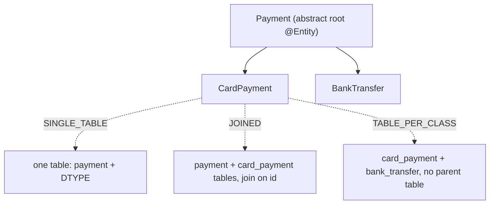

# Inheritance, Embeddables & Composite Keys

Java is an object model with inheritance and composition; relational databases are flat
tables with foreign keys. This topic is about the three ways JPA maps a **class hierarchy**
onto tables, how **value objects** (`@Embeddable`) are folded into an owning table, and how
**composite primary keys** are expressed and why they complicate identity. These are the
classic "object–relational impedance mismatch" problems, and interviewers love them because
each choice has concrete SQL consequences and gotchas.

> [!KEY-TAKEAWAY]
> Three inheritance strategies, three trade-off profiles: `SINGLE_TABLE` (fast, no joins,
> but no `NOT NULL` on subclass columns), `JOINED` (normalized, but a join per level), and
> `TABLE_PER_CLASS` (avoid — polymorphic queries become `UNION`s). `@MappedSuperclass` is
> *not* an entity: it shares mapping but supports no polymorphic query. Embeddables are
> value objects with no identity of their own. Composite keys come in two flavors —
> `@IdClass` and `@EmbeddedId` — and both force you to implement `equals`/`hashCode`.

For the underlying relational mechanics (joins, foreign keys, indexes, normalization) see
`messaging-databases`. For how repositories query these mappings see
`spring-data-jpa-repositories`. This topic stays at the ORM-mapping altitude.

## Inheritance Mapping: The Big Picture

JPA offers three strategies via `@Inheritance(strategy = ...)` on the root entity:

- **`SINGLE_TABLE`** (the default when `@Inheritance` is present but no strategy given) —
  the whole hierarchy lives in one table; a **discriminator column** says which concrete
  type each row is.
- **`JOINED`** — each class (root and subclasses) gets its own table; a subclass row is
  reconstructed by joining child tables to the parent on a shared primary key.
- **`TABLE_PER_CLASS`** — each *concrete* class gets a standalone table containing all
  inherited + own columns; there is no shared parent table.

The choice changes the generated DDL, every SELECT, and whether polymorphic queries and
constraints are cheap or expensive. Only entities annotated `@Entity` participate;
`@MappedSuperclass` and `@Embeddable` do *not* create inheritance in the database sense.



## SINGLE_TABLE Strategy

All classes in the hierarchy share **one physical table**. A **discriminator column**
(default name `DTYPE`, a `VARCHAR`) records the concrete type of each row. Columns that
belong only to a subclass are simply extra columns on the shared table, left NULL for rows
of other types.

```java
@Entity
@Inheritance(strategy = InheritanceType.SINGLE_TABLE)
@DiscriminatorColumn(name = "payment_type", discriminatorType = DiscriminatorType.STRING)
public abstract class Payment {
    @Id @GeneratedValue Long id;
    BigDecimal amount;
}

@Entity
@DiscriminatorValue("CARD")
public class CardPayment extends Payment {
    String cardNumber;   // becomes a nullable column on the payment table
}
```

Generated DDL (one table):

```sql
CREATE TABLE payment (
    id           BIGINT PRIMARY KEY,
    amount       DECIMAL,
    card_number  VARCHAR,       -- NULL for non-card rows
    bank_iban    VARCHAR,       -- NULL for non-transfer rows
    payment_type VARCHAR NOT NULL
);
```

Reading any subtype or a polymorphic `select p from Payment p` is a **single table scan, no
joins** — this is the fastest strategy and Hibernate's default.

> [!WARNING]
> The killer limitation: subclass-specific columns **cannot be `NOT NULL`**, because rows
> of sibling types leave them NULL. You lose database-level enforcement of mandatory
> subclass fields. If your schema demands `NOT NULL` on subclass attributes, `SINGLE_TABLE`
> cannot express it — that's often the deciding factor for `JOINED`.

## JOINED Strategy

Each class gets its **own table**. The root table holds the shared columns and the primary
key; each subclass table holds only that subclass's own columns plus a primary key that is
**also a foreign key** to the root table. A subclass instance is split across tables and
reassembled with a join.

```java
@Entity
@Inheritance(strategy = InheritanceType.JOINED)
public abstract class Payment { @Id @GeneratedValue Long id; BigDecimal amount; }

@Entity
@PrimaryKeyJoinColumn(name = "payment_id")   // optional; defaults to root PK name
public class CardPayment extends Payment { String cardNumber; }
```

DDL (one table per class):

```sql
CREATE TABLE payment      (id BIGINT PRIMARY KEY, amount DECIMAL);
CREATE TABLE card_payment (payment_id BIGINT PRIMARY KEY, card_number VARCHAR NOT NULL,
                           FOREIGN KEY (payment_id) REFERENCES payment(id));
```

Loading a `CardPayment` by id:

```sql
SELECT p.id, p.amount, c.card_number
FROM payment p JOIN card_payment c ON p.id = c.payment_id
WHERE p.id = ?;
```

A polymorphic `select p from Payment p` must **outer-join every subclass table** (or issue
per-row lookups), which grows costly as the hierarchy widens.

> [!TIP]
> `JOINED` is the **normalized** choice: no wasted NULL columns, subclass columns can be
> `NOT NULL`, and it scales cleanly to many subclasses. The cost is a join per hierarchy
> level on reads and an insert into two tables on write. Prefer it when data integrity
> matters more than raw read speed.

## TABLE_PER_CLASS Strategy

Each **concrete** class gets a full table containing inherited *and* own columns. There is
no parent table. An abstract root maps to no table. Because a polymorphic query has to
combine rows scattered across unrelated tables, Hibernate generates a **`UNION ALL`**.

```sql
-- select p from Payment p  becomes:
SELECT id, amount, card_number, NULL AS bank_iban, 1 AS clazz FROM card_payment
UNION ALL
SELECT id, amount, NULL, bank_iban, 2 AS clazz FROM bank_transfer;
```

> [!WARNING]
> `TABLE_PER_CLASS` is widely discouraged. Identity generation is awkward — `IDENTITY`
> is essentially unusable because ids must be **unique across all sibling tables** (a
> `TABLE` or `SEQUENCE` generator is required), polymorphic queries produce heavy `UNION`s,
> and polymorphic associations (a FK pointing at "any Payment") can't be a simple foreign
> key. Reach for `SINGLE_TABLE` or `JOINED` unless you have a strong, specific reason.

## Inheritance Strategy Trade-off Table

| Concern | SINGLE_TABLE | JOINED | TABLE_PER_CLASS |
|---|---|---|---|
| Number of tables | 1 | 1 per class | 1 per concrete class |
| Read a single subtype | Table scan, no join | Join root + subclass | Single-table read |
| Polymorphic query | Single scan (fastest) | Outer-joins per subclass | `UNION ALL` across tables |
| Insert one entity | 1 INSERT | INSERT into 2+ tables | 1 INSERT |
| `NOT NULL` on subclass cols | **No** (NULL for siblings) | **Yes** | Yes |
| Wasted/NULL columns | Yes (sparse table) | No | Duplicated columns per table |
| Normalization | Poor | Good | Poor (duplicate columns) |
| Polymorphic FK / association | Easy | Easy | **Hard** |
| Id generation | Any | Any | `IDENTITY` unusable |
| Discriminator column | Required (default `DTYPE`) | Optional | N/A |
| Verdict | Fast default; watch NULLs | Normalized, best integrity | Avoid |

> [!INTERVIEW]
> Expected answer to "which would you pick?": start with `SINGLE_TABLE` for a small, mostly
> read-heavy hierarchy where subclass fields are optional; switch to `JOINED` when you need
> `NOT NULL` on subclass columns or the table would become a sparse NULL wasteland. Name
> `TABLE_PER_CLASS` only to explain why you'd avoid it.

## @MappedSuperclass vs @Inheritance

`@MappedSuperclass` is a class whose **mappings are inherited** by entity subclasses, but
which is **itself not an entity**: it has no table, cannot be the target of a query or an
association, and there is **no polymorphic query** over it. Use it purely to share common
columns/mapping (audit fields, an id) as code reuse.

```java
@MappedSuperclass
public abstract class Auditable {
    @Column(updatable = false) Instant createdAt;
    Instant updatedAt;
}

@Entity
public class Invoice extends Auditable { @Id Long id; }  // gets createdAt/updatedAt columns
```

| | `@MappedSuperclass` | `@Inheritance` (entity hierarchy) |
|---|---|---|
| Is it an entity? | No | Yes (root + subclasses) |
| Has a table? | No | Yes (per strategy) |
| Polymorphic query (`from Auditable`) | **Not allowed** | Allowed (`from Payment`) |
| Can be an association target | No | Yes |
| Purpose | Share mapping/columns only | Model a real IS-A hierarchy |

> [!TIP]
> If you never need to query "all Payments" polymorphically and only want to reuse columns,
> `@MappedSuperclass` avoids all the inheritance-strategy trade-offs. Choose `@Inheritance`
> only when polymorphism (query or association over the base type) is a real requirement.

## @DiscriminatorColumn & @DiscriminatorValue

For `SINGLE_TABLE` (and optionally `JOINED`), the **discriminator** tells Hibernate which
concrete class a row represents. `@DiscriminatorColumn` (on the root) names the column and
its type; `@DiscriminatorValue` (on each subclass) gives that subclass's stored value.

- Default column name: `DTYPE`, type `STRING`.
- Default `@DiscriminatorValue`: the entity name.
- Hibernate adds a `WHERE payment_type = 'CARD'` predicate automatically when you query a
  specific subtype, and reads the column to instantiate the right class on a polymorphic
  read.
- `@DiscriminatorFormula` lets you derive the discriminator from an SQL expression instead
  of a dedicated column (Hibernate extension) — useful for mapping legacy schemas.

```sql
-- querying "from CardPayment" under SINGLE_TABLE:
SELECT ... FROM payment WHERE payment_type = 'CARD';
```

## Embeddables: @Embeddable & @Embedded

An **embeddable** is a **value object** with no identity of its own: its fields are stored
as columns **in the owning entity's table**. This models *composition* (HAS-A), not an
association. Two entities embedding the same `Address` do not share a row — each has its own
copy of the columns.

```java
@Embeddable
public class Address {
    String street;
    String city;
    String zip;
}

@Entity
public class Customer {
    @Id Long id;
    @Embedded Address address;   // street, city, zip columns live on the customer table
}
```

DDL: `customer(id, street, city, zip)` — the embeddable adds no table and no join.

> [!KEY-TAKEAWAY]
> Embeddables have **no primary key and no lifecycle of their own** — they are loaded,
> saved, and deleted with their owner. There is no "load an Address by id." This is the
> core difference from a `@OneToOne` association, which is a separate entity with its own
> identity and (usually) its own table. Prefer embeddables for cohesive value groups
> (money, address, coordinates) — they keep the object model clean without extra tables.

Embeddables can be nested, can contain their own associations, and (since JPA 2.0) can be
used as map keys/values. Since Java records exist, an embeddable can be a record in
Hibernate 6+, but it must still be `@Embeddable`.

## @AttributeOverride & Multiple Embeddings

If an entity embeds the **same embeddable type twice**, the columns would collide. Use
`@AttributeOverride` (or `@AttributeOverrides`) to remap the columns for one of them.
`@AssociationOverride` does the same for associations inside an embeddable.

```java
@Entity
public class Order {
    @Id Long id;

    @Embedded
    Address billing;   // street, city, zip

    @Embedded
    @AttributeOverrides({
        @AttributeOverride(name = "street", column = @Column(name = "ship_street")),
        @AttributeOverride(name = "city",   column = @Column(name = "ship_city")),
        @AttributeOverride(name = "zip",    column = @Column(name = "ship_zip"))
    })
    Address shipping;
}
```

Without the overrides, both embeddings map to `street`/`city`/`zip` on the same table and
Hibernate fails at boot with a duplicate-column mapping error.

## @ElementCollection

`@ElementCollection` maps a collection of **basic types or embeddables** (not entities) into
a **separate collection table** keyed by the owner's foreign key. It's the way to persist a
`List<String>` or `Set<Address>` on an entity without making them entities.

```java
@Entity
public class Customer {
    @Id Long id;

    @ElementCollection
    @CollectionTable(name = "customer_phone", joinColumns = @JoinColumn(name = "customer_id"))
    @Column(name = "phone")
    List<String> phones;
}
```

DDL: `customer_phone(customer_id FK, phone)`. Elements have **no identity** and their
lifecycle is entirely owned by the parent — Hibernate manages them like an embeddable
collection, not a `@OneToMany`.

> [!WARNING]
> `@ElementCollection` is **`LAZY` by default** (like other collections), but it has a
> notorious update gotcha: for many mappings Hibernate **deletes all rows and re-inserts**
> the whole collection on any change, because element-collection rows have no stable primary
> key to target individual updates. Adding an `@OrderColumn` or a well-chosen key mitigates
> it, but for large or frequently-mutated collections prefer a real `@OneToMany` child
> entity. See `entity-mappings-associations` for the entity-collection alternative.

## Composite Keys: @IdClass vs @EmbeddedId

A **composite primary key** is a PK made of more than one column. JPA gives two ways to
express it. Both require a separate, `Serializable` key class that implements `equals` and
`hashCode`.

**`@EmbeddedId`** — a single field of an `@Embeddable` key type; you access key parts via
the embedded object (`order.getId().getCustomerId()`).

```java
@Embeddable
public class OrderId implements Serializable {
    Long customerId;
    Long orderNo;
    // equals + hashCode over both fields
}
@Entity
public class Order {
    @EmbeddedId OrderId id;
}
```

**`@IdClass`** — the entity declares each key field directly with `@Id`, and points at a
separate "id class" that mirrors those fields for identity/lookup
(`em.find(Order.class, new OrderId(1L, 42L))`).

```java
@Entity
@IdClass(OrderId.class)   // OrderId is a plain class with matching fields + equals/hashCode
public class Order {
    @Id Long customerId;
    @Id Long orderNo;
}
```

| | `@EmbeddedId` | `@IdClass` |
|---|---|---|
| Key type annotation | `@Embeddable` | plain `Serializable` class |
| Fields on entity | one embedded id object | each key field, each `@Id` |
| Access to a key part | `e.getId().getX()` | `e.getX()` directly |
| JPQL reference | `o.id.customerId` | `o.customerId` |
| Best when | Key is a cohesive value object; reused | Legacy schema / flat field access preferred |

> [!TIP]
> Modern guidance: prefer **`@EmbeddedId`** — it treats the key as a first-class value
> object, reads cleanly, and is easy to reuse (e.g. as a `@MapsId` target). Use `@IdClass`
> mainly when you want the key columns as plain top-level entity fields or are mapping a
> legacy design. Whichever you pick, the key class **must** override `equals`/`hashCode`.

## @MapsId & Shared Primary Key

`@MapsId` maps an association's foreign key to be (part of) the entity's **own primary
key** — a **shared primary key**. The classic case is a one-to-one where the child should
use the parent's id as its own, avoiding a separate surrogate key.

```java
@Entity
public class UserProfile {
    @Id Long id;                 // same value as the User's id

    @OneToOne
    @MapsId                      // profile.id IS user.id (FK == PK)
    @JoinColumn(name = "id")
    User user;
}
```

With composite keys, `@MapsId("customerId")` says "the `customerId` part of my
`@EmbeddedId` is populated from this `@ManyToOne` association's key" — you no longer set
that key field by hand; Hibernate derives it from the associated entity.

> [!KEY-TAKEAWAY]
> `@MapsId` gives you a `@OneToOne`/`@ManyToOne` whose PK equals the FK. Benefits: one
> column instead of two, a natural 1:1 enforced by the shared PK, and cheaper joins. It is
> the idiomatic fix for the "unidirectional OneToOne loads eagerly / can't be lazy" pain in
> many mappings, since the child's presence is derivable from its own PK.

## equals() & hashCode() with Composite Keys

Entity identity is subtle and composite keys make it sharper. The persistence context (the
first-level cache) guarantees that within one `EntityManager` there is **one instance per
identity** — but across sessions, or before an id is assigned, Java `equals`/`hashCode`
governs set membership and map keys.

- The **id class / embedded id** class *must* implement `equals` and `hashCode` over all key
  fields — JPA requires it and Hibernate uses it to look entities up in the persistence
  context.
- For the **entity** itself, the well-known trap: if you base `equals`/`hashCode` on a
  generated `@Id`, a transient (unsaved) instance has `id == null`, so it behaves
  incorrectly in a `HashSet` before and after `persist()` assigns the id (its hash bucket
  changes). Recommended practice: use a **business/natural key** if one exists, or return a
  **constant `hashCode`** and compare on id with a null-guard, so an entity's hash never
  changes across its lifecycle.

```java
@Override public boolean equals(Object o) {
    if (this == o) return true;
    if (!(o instanceof Customer c)) return false;
    return id != null && id.equals(c.id);   // null id => only equal to itself (this==o)
}
@Override public int hashCode() { return getClass().hashCode(); } // stable across lifecycle
```

> [!WARNING]
> Never derive `equals`/`hashCode` from a **mutable** field or from a DB-generated id used
> naively — putting a transient entity in a `HashSet`, then persisting it, can make it
> "disappear" from the set because its bucket moved. This bites hardest with
> `@OneToMany Set<Child>` collections. See `java-jvm` for the general `equals`/`hashCode`
> contract; here the ORM angle is lifecycle-stability of identity.

## Polymorphic Queries & N+1 with Inheritance

Inheritance interacts with fetching. Under `JOINED`, a polymorphic `from Payment` needs the
subclass tables; Hibernate can do it with outer joins in one statement, but a naive mapping
plus lazy subclass state, or associations on subclasses, can still produce the classic
**N+1** fan-out (one query for the roots, then one per row for something lazy).

```sql
-- N+1 shape: 1 query for parents, then N queries triggered lazily
SELECT * FROM payment;                 -- 1
SELECT * FROM card_payment WHERE payment_id = ?;  -- xN (bad)
```

Fixes are the same as elsewhere — `JOIN FETCH` / entity graphs to load in one round trip,
or batch fetching. `SINGLE_TABLE` sidesteps join-based N+1 for the hierarchy itself because
everything is one table. The deep treatment of N+1, `JOIN FETCH`, entity graphs, and
`@BatchSize` lives in `fetching-lazy-eager-n-plus-one` — cross-reference it; don't
re-derive it here.

## Common Interview Follow-ups

- **"Default inheritance strategy if I only write `@Inheritance` with no strategy?"**
  `SINGLE_TABLE`.
- **"Why can't a subclass column be `NOT NULL` under `SINGLE_TABLE`?"** Because rows of
  sibling subtypes share the table and leave that column NULL.
- **"`@MappedSuperclass` vs `@Entity` root — can I write `from Auditable`?"** No;
  `@MappedSuperclass` is not an entity and supports no polymorphic query.
- **"Difference between `@Embedded` and `@OneToOne`?"** Embeddable = value object, no
  identity, same table; `@OneToOne` = separate entity with its own id/lifecycle.
- **"How do I embed the same `Address` twice?"** `@AttributeOverride(s)` to remap columns.
- **"`@IdClass` vs `@EmbeddedId` — which and why?"** Prefer `@EmbeddedId` (cohesive value
  object, clean JPQL, reusable with `@MapsId`); `@IdClass` for flat fields/legacy.
- **"What is `@MapsId` for?"** Shared primary key — the association's FK *is* the entity's
  PK; idiomatic for 1:1 and for the association half of a composite key.
- **"Why must the id class implement `equals`/`hashCode`?"** Hibernate uses them to look up
  entities in the persistence context and to satisfy the JPA identity contract.
- **"Why is `@ElementCollection` sometimes slow to update?"** No per-row PK, so Hibernate
  often deletes-all-and-reinserts on change; use a real child entity for large collections.
- **"How do I avoid a `HashSet` bug with entity identity?"** Stable `hashCode` (constant or
  natural key), never a mutable field or a raw generated id.

## References

- Jakarta Persistence 3.1/3.2 Specification — `@Inheritance`, `@DiscriminatorColumn`,
  `@Embeddable`/`@Embedded`, `@ElementCollection`, `@IdClass`, `@EmbeddedId`, `@MapsId`
  (jakarta.persistence.* namespace).
- Hibernate ORM 6/7 User Guide — Inheritance, Embeddable types, Collections of value types,
  Identifiers (composite ids, derived identifiers).
- Vlad Mihalcea, *High-Performance Java Persistence* — inheritance strategy trade-offs,
  `@ElementCollection` pitfalls, entity `equals`/`hashCode`.
- Cross-references: `messaging-databases` (joins, FKs, normalization),
  `fetching-lazy-eager-n-plus-one` (N+1, JOIN FETCH), `entity-mappings-associations`
  (`@OneToMany` vs `@ElementCollection`), `spring-data-jpa-repositories` (querying),
  `java-jvm` (`equals`/`hashCode` contract).
