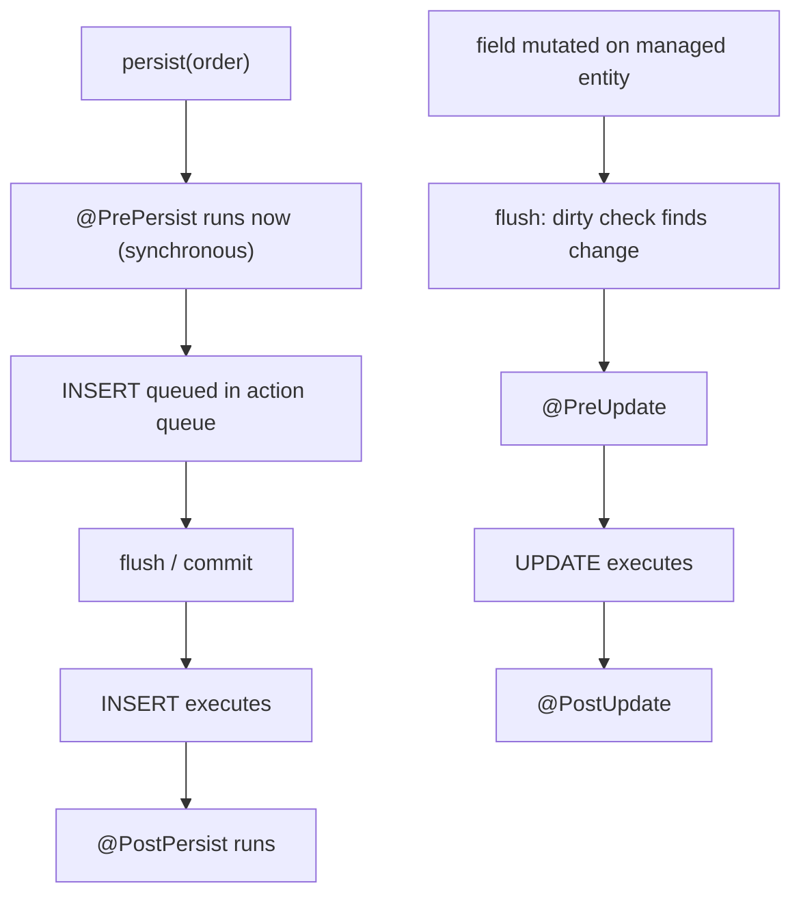
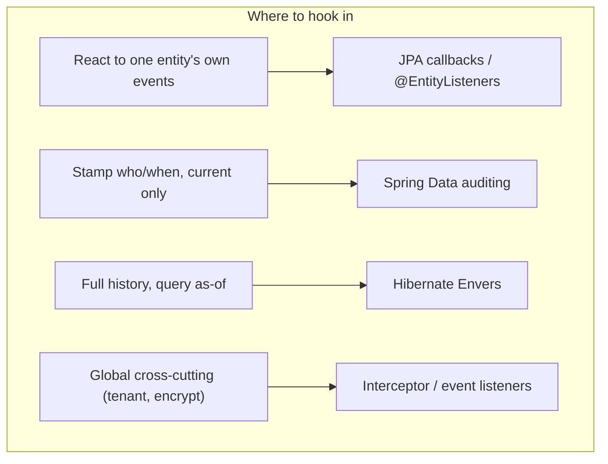
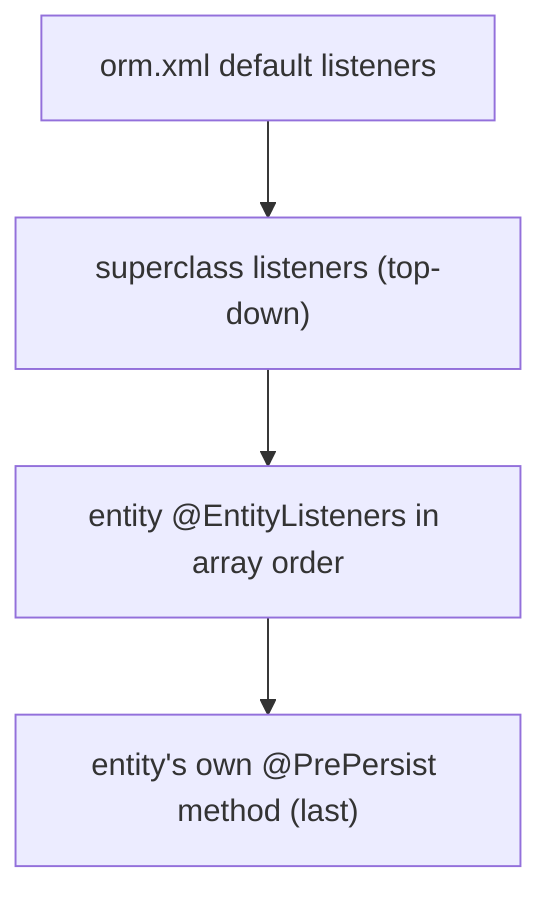

# Entity Lifecycle Callbacks, Auditing & Interceptors

"How do you stamp `createdAt`/`updatedAt` automatically?" and "how do you implement
soft-delete or an audit trail?" are extremely common Hibernate/JPA interview questions
because they force a candidate to show *where* in the persistence machinery they can hook
in — and to know the layered menu of tools. The one-line map: **JPA lifecycle callbacks
(`@PrePersist`, `@PostPersist`, `@PreUpdate`, `@PostUpdate`, `@PreRemove`, `@PostRemove`,
`@PostLoad`) let an entity react to its own persistence events; Spring Data JPA's
`AuditingEntityListener` builds on those callbacks to auto-fill created/modified metadata;
Hibernate Envers builds *revision history* tables; and for cross-cutting concerns
(multi-tenancy, soft-delete, encryption) you drop to Hibernate's `Interceptor` /
event-listener SPI or declarative annotations like `@SQLDelete` and `@SoftDelete`.**

The senior-level judgment being tested is *choosing the right layer* and knowing the
sharp edges — especially the JPA rule that **you must not touch the `EntityManager` or
other entities from inside a callback** (undefined behavior), and the surprise that
**`@PreUpdate` only fires when dirty checking actually produces an `UPDATE`.**

This note owns entity event hooks, auditing, and interceptors. Neighboring topics it
cross-references (do not duplicate them):

- Dirty checking, flush order, and what triggers an `UPDATE` at flush — see
  `hibernate-jpa/transactions-dirty-checking-flushing`.
- Entity states and `persist`/`merge`/`remove` transitions the callbacks fire around — see
  `hibernate-jpa/entity-lifecycle-states`.
- Lazy proxies and `LazyInitializationException` (why touching lazy fields in `@PostLoad`
  is risky) — see `hibernate-jpa/fetching-lazy-eager-n-plus-one`.
- `@Version` optimistic locking (how it interacts with `@PreUpdate` and Envers) — see
  `hibernate-jpa/concurrency-optimistic-pessimistic-locking`.
- Spring's transaction proxy and `@Transactional` boundaries around the flush — see
  `spring-boot` / `spring-core`.
- Soft-delete as a **data-modeling / query pattern** (indexing partial rows, unique
  constraints on "active" rows, GDPR hard-delete) — see `messaging-databases`.

> [!KEY-TAKEAWAY]
> **Four layers, increasing power/cost:** (1) **JPA callbacks** — entity reacts to its own
> events, no framework needed; (2) **Spring Data auditing** — `@CreatedDate` /
> `@LastModifiedBy` via `AuditingEntityListener` + `@EnableJpaAuditing` + `AuditorAware`,
> stamps *current* metadata only; (3) **Hibernate Envers** — `@Audited` writes full
> **revision history** to `_AUD` tables you can query as-of any point in time; (4)
> **Hibernate `Interceptor` / event-listener SPI** — SessionFactory-wide cross-cutting
> hooks. Declarative `@SQLDelete` + `@SQLRestriction` (or `@SoftDelete` in Hibernate 6.4+)
> turn `DELETE` into a soft-delete `UPDATE`.

---

## JPA lifecycle callbacks

JPA (Jakarta Persistence 3.1/3.2, `jakarta.persistence.*`) defines **seven** lifecycle
callback annotations. A method annotated with one is invoked by the provider when the
corresponding event occurs for that entity:

| Annotation | When it fires | Relative to SQL |
|---|---|---|
| `@PrePersist` | When `persist()` is called (or cascaded) | **Before** the `INSERT` is scheduled; runs *synchronously* with `persist()`, not at flush |
| `@PostPersist` | After the entity is made persistent | **After** the `INSERT` executes (at flush; or immediately for `IDENTITY`) |
| `@PreUpdate` | Before a managed entity's `UPDATE` | **Before** the `UPDATE` at flush — **only if the entity is dirty** |
| `@PostUpdate` | After the `UPDATE` | **After** the `UPDATE` executes at flush |
| `@PreRemove` | When `remove()` is called (or cascaded) | **Before** the `DELETE` is scheduled; synchronous with `remove()` |
| `@PostRemove` | After the entity is deleted | **After** the `DELETE` executes at flush |
| `@PostLoad` | After the entity is loaded/refreshed into the context | **After** the `SELECT` populates the object |

A callback defined **on the entity** must be an instance method that takes **no arguments**
and returns **void** (any name, any access modifier):

```java
@Entity
public class Order {
    @Id @GeneratedValue Long id;
    Instant createdAt;
    Instant updatedAt;

    @PrePersist
    void onCreate() {           // no args, void
        createdAt = Instant.now();
        updatedAt = createdAt;
    }

    @PreUpdate
    void onUpdate() {
        updatedAt = Instant.now();
    }
}
```

> [!TIP]
> A method may carry **multiple** callback annotations (e.g. `@PrePersist @PreUpdate void
> touch()`), but you may declare **at most one** method per callback type per entity class.
> Multiple `@PrePersist` methods in the same class is illegal.

**Timing nuance that trips people up:** `@PrePersist` and `@PreRemove` fire *immediately*
when you call `persist()`/`remove()` (or when the operation cascades), **not at flush**.
By contrast `@PostPersist`, `@PreUpdate`, `@PostUpdate`, and `@PostRemove` fire during
**flush** when the actual SQL runs. The exception: with `GenerationType.IDENTITY`, Hibernate
must run the `INSERT` at `persist()` time to obtain the generated key, so `@PostPersist`
fires early too (see `hibernate-jpa/primary-keys-and-id-generation`).



---

## Why @PreUpdate only fires on a real dirty UPDATE

`@PreUpdate` and `@PostUpdate` are gated by **dirty checking**. At flush, Hibernate
compares each managed entity's current field values against the *loaded snapshot* it kept
when the entity was read. If nothing changed, **no `UPDATE` is generated and the update
callbacks do not fire.** This is the single most common "why isn't my `updatedAt`
changing?" bug.

Consequences a senior candidate should name:

- Setting a field to the **same value** it already had is not a change — no `UPDATE`, no
  callback.
- A `@Version` bump, an explicit optimistic `LockModeType.OPTIMISTIC_FORCE_INCREMENT`, or a
  collection change *can* force an `UPDATE` even when scalar fields look unchanged.
- `@PreUpdate` does **not** fire on the initial `INSERT` — only `@PrePersist` does. So if
  you want a timestamp set on both create and update, annotate two methods (or one method
  with both annotations).
- Callbacks fire per-entity in memory; **bulk JPQL** (`UPDATE Order o SET ...`) and native
  SQL **bypass the persistence context and do NOT trigger any callbacks** (see
  `hibernate-jpa/querying-jpql-hql-criteria-native`).

> [!WARNING]
> Because callbacks never run for bulk/native `UPDATE`/`DELETE`, any invariant you enforce
> in `@PreUpdate` (timestamps, validation, soft-delete stamping) is silently skipped by
> `@Modifying` bulk queries. This is a classic auditing-gap interview trap.

---

## @EntityListeners and external listener classes

Putting callback logic on the entity couples cross-cutting behavior to the domain class.
JPA lets you extract callbacks into a separate **listener class** referenced with
`@EntityListeners`:

```java
public class AuditLoggingListener {
    @PostPersist                     // ONE argument: the entity; returns void
    void logCreate(Object entity) {
        log.info("created {}", entity);
    }
}

@Entity
@EntityListeners(AuditLoggingListener.class)
public class Order { /* ... */ }
```

Key rules and mechanics:

- A callback on a **listener class** takes **exactly one argument** — the entity instance
  (typed as the entity or `Object`) — and returns `void`. (Contrast: on the entity itself
  the method takes **no** arguments.)
- The listener is **stateless and effectively a singleton per persistence unit** — the
  provider instantiates it once. Do not keep per-entity state in fields.
- Multiple listeners run in the **order listed** in `@EntityListeners({A.class, B.class})`;
  superclass listeners run before subclass listeners. Then, finally, the entity's own
  callback methods run **last**.
- `@ExcludeSuperclassListeners` stops inheritance of a superclass's listeners;
  `@ExcludeDefaultListeners` stops default listeners declared in `orm.xml`.
- A common pattern: put audit fields + `@EntityListeners(AuditingEntityListener.class)` on
  a `@MappedSuperclass` base entity so every entity inherits auditing.

Listener beans are **not Spring-managed by default** — plain JPA instantiates them
reflectively, so `@Autowired` in a listener is null. Spring Data's `AuditingEntityListener`
is the wired exception (it resolves its collaborators through a static
`BeanFactory`-backed bridge that `@EnableJpaAuditing` installs).

---

## Callback rules and gotchas

The Jakarta Persistence spec explicitly constrains what a callback may do. Violating these
is **undefined behavior**, not a guaranteed exception:

> [!WARNING]
> Inside a lifecycle callback you **must not** invoke `EntityManager` or `Query`
> operations, access **other** entity instances, or modify **relationships** within the
> same persistence context. You *may* modify the **non-relationship state** of the entity
> the callback is invoked on.

Why the restriction exists: callbacks run **in the middle of a flush**, while Hibernate is
iterating its action queue and holding the loaded-state snapshots. Calling
`em.persist()`, running a query (which forces an auto-flush), or mutating another entity
re-enters the flush machinery and can corrupt ordering, cause `ConcurrentModification`, or
recurse infinitely.

Other gotchas:

- **No transaction guarantee for "post" callbacks around commit.** `@PostPersist`/
  `@PostUpdate`/`@PostRemove` fire after the SQL statement, but that is *within* the
  flush — the transaction has **not committed yet** and can still roll back. Do not treat
  them as "the row is durably committed." For after-commit side effects (publish an event,
  send email) use a Spring `@TransactionalEventListener(phase = AFTER_COMMIT)` instead — see
  `spring-boot`.
- **`@PostLoad` and lazy fields.** `@PostLoad` runs when the entity is materialized;
  touching a `LAZY` association there forces initialization (an extra `SELECT`, or a
  `LazyInitializationException` if the session later closes). Keep it to scalar
  post-processing.
- **Exceptions propagate and roll back.** Throwing from a callback marks the transaction
  for rollback (a `RuntimeException` propagates out of the flush).
- Callbacks are **provider-invoked**; you never call them yourself, and they do not run for
  detached entities or objects that never entered a persistence context.

---

## Spring Data JPA auditing

Spring Data JPA provides declarative "who/when" auditing built **on top of JPA callbacks**.
Four annotations mark the audit fields:

| Annotation | Filled on | Value source |
|---|---|---|
| `@CreatedDate` | insert (`@PrePersist`) | current time |
| `@LastModifiedDate` | insert + update (`@PrePersist`/`@PreUpdate`) | current time |
| `@CreatedBy` | insert | `AuditorAware.getCurrentAuditor()` |
| `@LastModifiedBy` | insert + update | `AuditorAware.getCurrentAuditor()` |

Wiring (three pieces):

```java
@Configuration
@EnableJpaAuditing                       // 1. turn auditing on
class JpaConfig {
    @Bean
    AuditorAware<String> auditorProvider() {   // 3. supply the "who"
        return () -> Optional.ofNullable(
            SecurityContextHolder.getContext().getAuthentication())
            .map(Authentication::getName);
    }
}

@Entity
@EntityListeners(AuditingEntityListener.class)   // 2. attach the listener
class Order {
    @CreatedDate    Instant createdAt;
    @LastModifiedDate Instant updatedAt;
    @CreatedBy      String createdBy;
    @LastModifiedBy String updatedBy;
}
```

Mechanics and facts:

- `AuditingEntityListener` internally implements `@PrePersist`/`@PreUpdate` and populates
  the annotated fields — so it inherits every callback rule above (including "no fire on
  bulk queries").
- Date-typed fields may be `Instant`, `LocalDateTime`, `Date`/`Calendar`, or `long`/`Long`
  (epoch millis). `@CreatedBy`/`@LastModifiedBy` are any type your `AuditorAware` returns.
- `@EnableJpaAuditing(auditorAwareRef="...")` picks a specific `AuditorAware` bean;
  `dateTimeProviderRef` overrides the clock (handy for deterministic tests).
- This stamps only the **current** state — it overwrites on each update and keeps **no
  history**. If you need "what did this row look like last Tuesday?", that is Envers.

> [!INTERVIEW]
> "Spring auditing vs Envers?" — Spring Data auditing = *current* created/modified metadata
> on the same row, cheap, no extra tables. Envers = *full revision history* in separate
> tables, queryable as-of any revision, at the cost of write amplification and storage.

---

## Hibernate Envers for revision history

Hibernate Envers provides **versioned auditing**: it records the state of an entity at
every change into parallel **audit tables**, so you can reconstruct or query historical
state.

```java
@Entity
@Audited                       // audit every column
public class Order {
    @Id @GeneratedValue Long id;
    BigDecimal total;
    @NotAudited String cachedLabel;   // opt a field out
}
```

What Envers creates and does:

- For each `@Audited` entity, a table (default name `<table>_AUD`) with the entity columns
  plus a **revision number** and a **revision type** (`RevisionType`: `ADD`, `MOD`, `DEL`).
- A single global `REVINFO` table mapping each revision number to a timestamp (customizable
  via a `@RevisionEntity` with `@RevisionNumber` and `@RevisionTimestamp`, e.g. to also
  store the acting user).
- On every insert/update/delete of an audited entity, Envers writes a new audit row inside
  the **same transaction** (it hooks Hibernate's post-commit/flush event listeners).

Querying history uses the `AuditReader`:

```java
AuditReader reader = AuditReaderFactory.get(entityManager);
// state of Order 42 at revision 7
Order old = reader.find(Order.class, 42L, 7);
// all revision numbers where Order 42 changed
List<Number> revs = reader.getRevisions(Order.class, 42L);
```

Trade-offs / config a senior should mention:

- **Audit strategy:** the default `DefaultAuditStrategy` stores only a revision *start*
  column, so "state at revision N" requires a subquery for the max revision ≤ N.
  `ValidityAuditStrategy` also writes a `REVEND` column marking when each audit row stopped
  being valid — **faster reads, slightly slower writes** (it must update the previous row's
  `REVEND`). Choose based on read-vs-write mix.
- Write amplification: every change doubles into the audit table; storage grows unbounded
  without a purge/retention job.
- Schema coupling: audit tables must be migrated alongside the main schema (Flyway/Liquibase).
- Envers is **Hibernate-specific** (not portable JPA) and lives in the `hibernate-envers`
  module.

---

## Hibernate Interceptor and the event-listener SPI

For **SessionFactory-wide** cross-cutting concerns that must apply regardless of which
entity or code path triggered them, Hibernate exposes two lower-level, provider-specific
mechanisms.

**`org.hibernate.Interceptor`** — a callback interface with hooks such as `onLoad`,
`onFlushDirty` (state about to be updated), `onSave`/`onPersist` (about to insert),
`onDelete`, `preFlush`, and `postFlush`. You register it either:

- **Session-scoped:** `sessionFactory.withOptions().interceptor(new MyInterceptor()).openSession()`
  — may be stateful, one per `Session`.
- **SessionFactory-scoped:** `hibernate.session_factory.interceptor` property — must be
  **thread-safe** because it is shared across all sessions.

```java
public class AuditInterceptor implements Interceptor {
    @Override
    public boolean onFlushDirty(Object entity, Object id, Object[] currentState,
                                Object[] previousState, String[] propertyNames,
                                Type[] types) {
        // mutate currentState[i] to change the UPDATE; return true if you changed it
        return false;
    }
}
```

> [!TIP]
> Hibernate 6 changed several SPI signatures from `Serializable id` to `Object id`, and
> Hibernate 6.x/7 deprecates `onSave`/`onDelete` in favor of `onPersist`/`onRemove`-style
> methods. All `Interceptor` methods now have `default` bodies, so you override only what
> you need.

**Event-listener SPI** — Hibernate's internal engine is event-driven: each operation
(`EventType.PERSIST`, `MERGE`, `DELETE`, `FLUSH`, `LOAD`, `PRE_UPDATE`, `POST_INSERT`, …)
dispatches to a registered listener. You add/replace listeners via an `Integrator` that
gets the `EventListenerRegistry`:

```java
registry.appendListeners(EventType.POST_INSERT, new MyPostInsertListener());
```

Envers itself is implemented this way. Use event listeners when you need to *replace or
augment* core behavior globally; use an `Interceptor` for simpler per-session hooks.



---

## Soft deletes with SQLDelete, SQLRestriction and SoftDelete

Soft delete = mark a row inactive instead of physically removing it. Hibernate offers
declarative support so a `remove()` transparently becomes an `UPDATE`.

**Classic approach — `@SQLDelete` + a restriction:**

```java
@Entity
@SQLDelete(sql = "UPDATE orders SET deleted = true WHERE id = ?")
@SQLRestriction("deleted = false")   // Hibernate 6.3+; replaces @Where
public class Order {
    @Id @GeneratedValue Long id;
    boolean deleted;
}
```

- `@SQLDelete` overrides the generated `DELETE` with your custom `UPDATE`, so
  `em.remove(order)` (or a cascaded delete) flips the flag instead of deleting the row.
- `@SQLRestriction("deleted = false")` (the modern name for the deprecated `@Where`) is
  appended to **every** `SELECT` for the entity and its collections, hiding soft-deleted
  rows from queries and lazy-loaded associations.

**Modern approach — `@SoftDelete` (Hibernate 6.4+):** first-class, less boilerplate.

```java
@Entity
@SoftDelete(columnName = "deleted", strategy = SoftDeleteType.DELETED)
public class Order { @Id @GeneratedValue Long id; }
```

Hibernate manages the indicator column, rewrites deletes to updates, and adds the filter
automatically; `strategy` can be `DELETED` (a "is-deleted" flag) or `ACTIVE` (an
"is-active" flag).

Gotchas (the interview meat):

- **Bulk JPQL/native `DELETE` bypasses `@SQLDelete`** and hard-deletes the row — soft delete
  only intercepts entity-level `remove()`.
- **`@SQLRestriction` is static** (no parameters). For dynamic/parameterized visibility use
  `@Filter` + `session.enableFilter(...)`.
- Unique constraints, partial indexes on active rows, and GDPR "right to be forgotten"
  hard-delete are **data-model** concerns — see `messaging-databases`.
- Related pattern `@Filter` (multi-tenancy row filtering) and `@FilterDef` are enabled
  per-session, unlike the always-on `@SQLRestriction`.

---

## Choosing callbacks vs listeners vs Envers vs interceptors

| Need | Best tool | Why |
|---|---|---|
| One entity reacts to its own create/update | `@PrePersist`/`@PreUpdate` on the entity | Simplest, portable, no framework |
| Reusable cross-entity callback logic | `@EntityListeners` class | Decouples behavior from domain |
| Auto created/modified who+when (current) | Spring Data `AuditingEntityListener` | Declarative, zero code |
| Full history / "state as of revision N" | Hibernate Envers `@Audited` | Revision tables + `AuditReader` |
| Soft delete on `remove()` | `@SQLDelete` + `@SQLRestriction` or `@SoftDelete` | DELETE→UPDATE, auto-filter |
| Global multi-tenancy / encryption / metrics | `Interceptor` or event listeners | SessionFactory-wide, every path |
| After-commit side effect (publish/email) | Spring `@TransactionalEventListener` | Post callbacks run pre-commit |

> [!KEY-TAKEAWAY]
> Reach for the **highest, most declarative layer that solves the problem**. Callbacks and
> Spring auditing cover 90% of "stamp metadata"; escalate to Envers only for real audit
> history, and to the Interceptor/event SPI only for genuinely global cross-cutting
> concerns. Never do EntityManager work or after-commit side effects inside a JPA callback.

---

## Callback ordering, default listeners, and exclusions

The precise call order for a single event (e.g. persist) on an entity that has a
`@MappedSuperclass` chain, default listeners, and its own `@EntityListeners` is defined by
the Jakarta Persistence spec and is a favourite senior probe:

1. **Default entity listeners** — declared in `orm.xml` via `<default-entity-listeners>`;
   apply to *every* entity in the persistence unit. Run first.
2. **Superclass-hierarchy listeners** — `@EntityListeners` on mapped superclasses, from the
   **highest (most general) superclass downwards** to the entity's direct superclass.
3. **The entity's own `@EntityListeners`** — in **array order** as listed
   (`@EntityListeners({A.class, B.class})` → A then B).
4. **The entity's own annotated callback method** — runs **last**.



Additional precise rules:

- **One method per callback type per class**, but a subclass method that *overrides* a
  superclass callback method of the same event type replaces it (normal Java override
  semantics) — the callback is not invoked twice.
- **`@ExcludeDefaultListeners`** on an entity/superclass suppresses the `orm.xml` default
  listeners for that class and its subclasses. **`@ExcludeSuperclassListeners`** suppresses
  listeners *inherited from superclasses* (not the ones declared directly on the class).
- To register the Spring `AuditingEntityListener` **globally** without repeating it on every
  entity, declare it as a `<default-entity-listeners>` in `orm.xml` — the same mechanism.

> [!WARNING]
> A classic silent bug: `@EnableJpaAuditing` is present on a `@Configuration` class but the
> entity is **missing `@EntityListeners(AuditingEntityListener.class)`** (and no default
> listener is registered). No error is thrown — the audit fields simply stay `null` forever.

---

## @DynamicUpdate, @DynamicInsert and callback interplay

By default Hibernate generates **one static UPDATE per entity that sets *all* columns**
(the SQL string is built once and cached/prepared for reuse). This means even if you change
one field, the flush emits `update orders set col1=?, col2=?, ... col40=? where id=?`.

`@DynamicUpdate` tells Hibernate to **regenerate the UPDATE SQL on each flush** to include
**only the dirty columns**:

```java
@Entity
@DynamicUpdate   // per-flush SQL: only changed columns in SET
@DynamicInsert   // per-flush SQL: only non-null columns in INSERT
public class Order { /* ... */ }
```

Mechanism and trade-offs:

- **Cost:** the SQL is no longer cached — Hibernate builds a new statement string each
  flush, so there is CPU/allocation overhead. Use it where the win is real: very wide
  tables, avoiding overwrite of columns updated out-of-band, avoiding unnecessary
  second-level-cache invalidation, or fitting a covering-index update.
- **It does not change *whether* `@PreUpdate` fires** — dirty checking still decides that.
  `@DynamicUpdate` only changes *which columns* end up in the SQL.
- **Interplay with `@PreUpdate`:** a field you mutate *inside* `@PreUpdate` (e.g.
  `updatedAt = now()`) **is** included in the dynamic UPDATE, because `@PreUpdate` runs
  **before** the SQL is built and Hibernate re-derives the dirty set afterwards. So dynamic
  update + a timestamp-stamping callback compose correctly.
- Also relevant to soft-delete indicator columns and `@Version`: with `@DynamicUpdate` those
  columns are still included whenever they actually change.

---

## Hibernate-native timestamps: @CreationTimestamp, @UpdateTimestamp, @CurrentTimestamp

If you are **not** using Spring Data (no `@EnableJpaAuditing`, no `AuditingEntityListener`),
Hibernate offers annotation-driven timestamps that need **no listener and no callback code**:

```java
@Entity
public class Order {
    @Id @GeneratedValue Long id;

    @CreationTimestamp                       // set once, at INSERT
    Instant createdAt;

    @UpdateTimestamp                         // refreshed on every UPDATE
    Instant updatedAt;
}
```

- `@CreationTimestamp` / `@UpdateTimestamp` default to the **VM (application) clock**.
- Hibernate 6's `@CurrentTimestamp(source = SourceType.DB)` uses the **database clock**
  (`current_timestamp` in the generated SQL) instead of the JVM clock — important when app
  servers have clock skew or you want a single authoritative time source.
  `SourceType.VM` (the default) uses `Instant.now()`-style JVM time.
- Contrast with Spring Data's `@CreatedDate`/`@LastModifiedDate`: those are portable across
  JPA providers (they ride on JPA callbacks) but require Spring wiring; the Hibernate
  annotations are Hibernate-specific but zero-config. Both are bypassed by bulk/native DML.

For multi-tenancy stamping, Hibernate 6's declarative **`@TenantId`** (with a
`CurrentTenantIdentifierResolver`) is the modern hook — cross-reference any multi-tenancy
topic; prefer it over hand-rolled `@PrePersist` tenant-stamping.

---

## @SoftDelete internals: defaults, converters, and generated SQL

`@SoftDelete` (Hibernate ORM **6.4+**) is worth knowing to the SQL level.

**Defaults.** With a bare `@SoftDelete` (no attributes):

- default `strategy` is **`SoftDeleteType.DELETED`** (a "is-deleted" flag), and
- the default column is **`deleted`** (a `boolean`). With `strategy = ACTIVE`, the
  conventional column is `active` with inverted semantics.

**Generated SQL** for a default `@SoftDelete` `Account`:

```sql
-- INSERT seeds the indicator
insert into Account (name, deleted, id) values (?, false, ?)
-- em.remove(account) becomes a guarded UPDATE
update Account set deleted=true where id=? and deleted=false
-- every fetch (including find-by-PK) filters
select ... from Account a1_0 where a1_0.deleted=false and a1_0.id=?
```

Note the filter is baked into the **primary-key fetch** too — unlike the legacy
`@SQLDelete`+`@Where` combo (see next section).

**Legacy-schema converters.** The indicator's Java type must be `Boolean`; to map it to a
non-boolean column use a converter:

```java
@Entity
@SoftDelete(converter = YesNoConverter.class)      // 'Y' / 'N'
public class Account { /* ... */ }
```

Hibernate ships `YesNoConverter` (`'Y'`/`'N'`) and `NumericBooleanConverter` (`1`/`0`). With
a string converter the generated SQL literals change accordingly
(e.g. `insert ... values (?, 'N', ?)`, `update ... set deleted='Y' where id=? and deleted='N'`).

**Collection- and package-level.** `@SoftDelete` can annotate a `@ManyToMany`/collection to
soft-delete **join-table rows**, and can be placed at **package level** (`package-info.java`)
to apply the strategy globally to every entity in the package.

**Auto-managed in-session state — the key advantage.** `@SoftDelete` updates the managed
entity's indicator field in memory after `remove()`. The old `@SQLDelete` approach does
**not** (see below), which is a real gotcha.

---

## @SQLDelete gotchas: @Loader, @SQLDeleteAll and stale in-memory state

The classic `@SQLDelete` + `@Where`/`@SQLRestriction` pattern has sharp edges that
`@SoftDelete` fixes:

- **`@Where`/`@SQLRestriction` historically did NOT filter a direct `em.find(id)`.** Since
  Hibernate 5.2 a `@Where` predicate was applied to query/collection loads but not to a
  direct primary-key fetch, so `findById(deletedId)` could still return the soft-deleted
  row. The fix was a custom **`@Loader(namedQuery = ...)`** that also applied the filter to
  direct fetches. (`@SoftDelete` filters PK fetches automatically, so no `@Loader` needed.)
- **Stale in-memory indicator.** With `@SQLDelete`, "Hibernate does not parse your native
  SQL", so after `em.remove(entity)` the managed instance's `deleted` field is **still
  `false`** in memory — the object is out of sync with the row. Fix by also adding a
  `@PreRemove` that sets `deleted = true`, or migrate to `@SoftDelete`.
- **Collections need `@SQLDeleteAll`.** `@SQLDelete` overrides the per-row delete;
  `@SQLDeleteAll` overrides the **bulk collection remove** issued for a `@ManyToMany`/owned
  collection. Missing it means the collection clear still hard-deletes join rows.
- **`@SQLDelete(check = ResultCheckStyle.COUNT)`** makes Hibernate verify the affected row
  count (like it does for versioned updates), surfacing a stale/missing row instead of
  silently succeeding.

---

## Envers deep dive: AuditQuery, RevisionListener and configuration

Beyond `reader.find(...)` and `getRevisions(...)`, seniors are expected to know the query
API and the acting-user story.

**Two AuditQuery axes:**

```java
AuditReader reader = AuditReaderFactory.get(em);

// Horizontal: DB state of a type AT a given revision
List<?> asOf = reader.createQuery()
    .forEntitiesAtRevision(Order.class, rev)
    .add(AuditEntity.property("total").gt(new BigDecimal("100")))
    .getResultList();

// Vertical: every revision of ONE entity (2nd bool = selectDeletedEntities)
List<?> history = reader.createQuery()
    .forRevisionsOfEntity(Order.class, false, true)
    .add(AuditEntity.id().eq(42L))
    .addOrder(AuditEntity.revisionNumber().asc())
    .getResultList();
```

Useful constraints: `AuditEntity.property("x").gt/eq(...)`,
`AuditEntity.revisionNumber().maximize()`, `AuditEntity.relatedId("customer").eq(id)`.

**`RevisionType` integer encoding** stored in the `REVTYPE` column: **0 = ADD, 1 = MOD,
2 = DEL** — handy when reading raw audit tables.

**Capturing the acting user — `RevisionListener`.** A custom `@RevisionEntity` names a
`RevisionListener` whose `newRevision(Object revisionEntity)` hook is called **once per
transaction/revision**, letting you stamp the username/tenant into `REVINFO`:

```java
@Entity @RevisionEntity(UserRevisionListener.class)
public class UserRevision extends DefaultRevisionEntity {
    String username;
}
public class UserRevisionListener implements RevisionListener {
    public void newRevision(Object revisionEntity) {        // must be stateless/thread-safe
        ((UserRevision) revisionEntity).setUsername(currentUser());
    }
}
```

This is how Envers answers "who?", contrasted with Spring's per-row `@CreatedBy`/
`AuditorAware`: Envers writes **one REVINFO row per transaction**, not per changed row.

**Configuration a senior should name:**

- **`org.hibernate.envers.store_data_at_delete`** (default `false`): a `DEL` (`REVTYPE=2`)
  row normally stores only the id with all other columns **NULL**. Set it `true` to snapshot
  the entity's last state into the delete revision. This is why
  `reader.find(Order.class, id, rev)` for a deleted entity's revision can return an
  all-null/`null` result — either enable this flag or query with `selectDeletedEntities=true`.
- **`org.hibernate.envers.track_entities_changed_in_revision`** (default `false`): when
  `true`, Envers records which entity types changed in each revision (a `REVCHANGES` /
  `ModifiedEntityNames` set), queryable via `reader.getCrossTypeRevisionChangesReader()`.
- **`@AuditMappedBy`** ties an audited one-to-many to its owning side so relationship-change
  audit rows are consistent.

---

## Second-level cache, filters and soft-delete leaks

A subtle production bug: `@SQLRestriction`/`@Filter`/`@SoftDelete` predicates are applied to
generated **SQL**, but the **second-level cache (2LC)** and `@NaturalId` lookups serve
entities **without running that SQL**. Consequences:

- An entity fetched from the 2LC, or via `em.getReference(id)` / a cached association, can
  return a **soft-deleted or filtered row** — the predicate is not re-checked in memory.
- `@Filter` in particular is *not* applied to entities already in the 2LC or navigated
  through cached collections — filtered rows can "leak" from cache.
- **Envers does not read the 2LC** either; it works off the flush events.

The interview point: soft-delete/`@Filter` are **query-time** mechanisms, not entity-state
invariants, so combine them carefully with caching (or exclude filtered entities from the
2LC).

---

## StatementInspector, veto and post-commit listeners

Three distinct hook families, often confused:

- **`org.hibernate.Interceptor`** — *entity-state* level: `onFlushDirty`, `onPersist`,
  `onRemove`, `onLoad`, can mutate the `currentState[]` array to change the SQL, per-session
  or SessionFactory-wide.
- **`StatementInspector`** (SPI) — the modern hook for **inspecting/rewriting the raw SQL
  string** just before execution (logging, adding hints, query tagging). Distinct from
  `Interceptor`, which never sees SQL text.
- **Event listeners** — `PRE_INSERT`/`PRE_UPDATE`/`PRE_DELETE` listeners can **veto** an
  operation by returning `true`; `POST_COMMIT_INSERT`/`POST_COMMIT_UPDATE`/
  `POST_COMMIT_DELETE` variants fire with after-commit semantics (historically how Envers
  ordered its work). Registered via `EventListenerRegistry.appendListeners` /
  `prependListeners` from an `Integrator`.

Compared to a JPA `@PreUpdate`: a `PRE_UPDATE` event listener is SessionFactory-wide and can
veto; an `Interceptor.onFlushDirty` can rewrite the `currentState[]` array (not just entity
fields) and is portable-only-to-Hibernate; `@PreUpdate` is portable JPA, per-entity, and can
only mutate the entity's own non-relationship fields.

---

## Common Interview Follow-ups

- **"Why isn't my `@PreUpdate` firing?"** The entity isn't dirty (no field actually
  changed), or the change came through a bulk JPQL `@Modifying` query that bypasses the
  persistence context. Also: setting a field to its existing value is not a change.
- **"Can I call `entityManager.persist()` inside `@PrePersist`?"** No — it's undefined
  behavior per the spec. Callbacks run mid-flush; use an event listener or an after-commit
  hook instead.
- **"When exactly does `@PrePersist` run vs `@PostPersist`?"** `@PrePersist` runs
  synchronously when you call `persist()`; `@PostPersist` runs after the `INSERT` at flush
  (or immediately for `IDENTITY` generation).
- **"Difference between Spring Data auditing and Envers?"** Auditing overwrites current
  who/when on the same row; Envers keeps full revision history in `_AUD` tables you query
  with `AuditReader`.
- **"Are `@PostUpdate` callbacks safe for sending an email?"** No — they fire before commit,
  which can still roll back. Use `@TransactionalEventListener(AFTER_COMMIT)`.
- **"How do you soft-delete but still enforce a unique email among active users?"** A
  partial/filtered unique index on `email WHERE deleted = false` — a DB modeling concern
  (`messaging-databases`); Hibernate's `@SoftDelete`/`@SQLRestriction` only hides rows.
- **"Does `@SQLDelete` protect against a native bulk delete?"** No — bulk and native SQL
  bypass entity-level delete rewriting.
- **`@EntityListeners` ordering?** Superclass listeners, then listed listeners in order,
  then the entity's own callback methods.
- **"How does `AuditorAware` know the current user in an async thread?"** It reads the
  `SecurityContext`, which is thread-bound — background threads without context propagation
  return empty; you must propagate it.

## References

- Jakarta Persistence 3.1/3.2 specification — "Entity Listeners and Lifecycle Callback
  Methods" (§3.5) and the callback-restriction rules.
- Hibernate ORM 6.x/7.x User Guide — Interceptors, events, Envers, `@SoftDelete`,
  `@SQLDelete`, `@SQLRestriction`, `@Filter`.
- Spring Data JPA Reference — "Auditing" (`@EnableJpaAuditing`, `AuditingEntityListener`,
  `AuditorAware`, `DateTimeProvider`).
- Hibernate Envers documentation — audit strategies (`DefaultAuditStrategy` vs
  `ValidityAuditStrategy`), `REVINFO`, `@RevisionEntity`.
- Related topics: `hibernate-jpa/transactions-dirty-checking-flushing`,
  `hibernate-jpa/entity-lifecycle-states`, `hibernate-jpa/querying-jpql-hql-criteria-native`,
  `messaging-databases` (soft-delete data modeling), `spring-boot` (transactional events).
