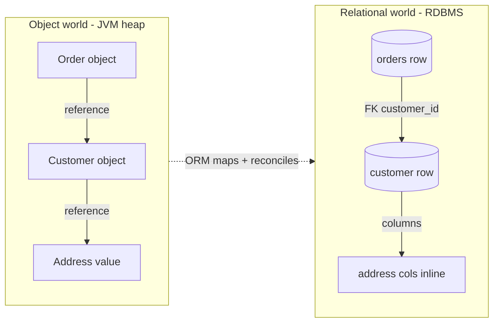
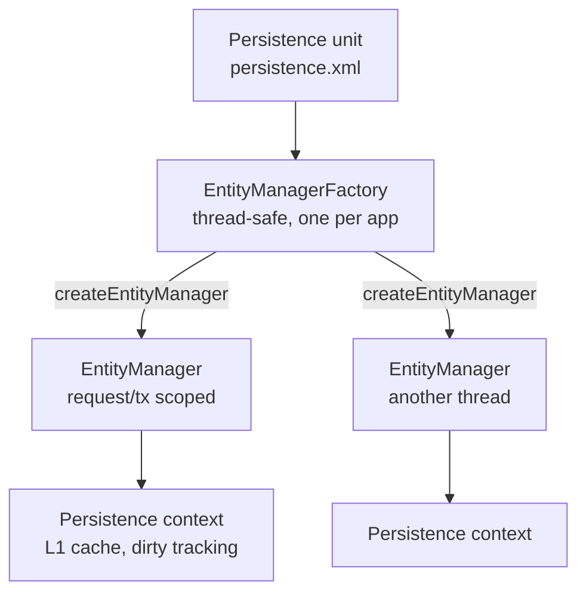
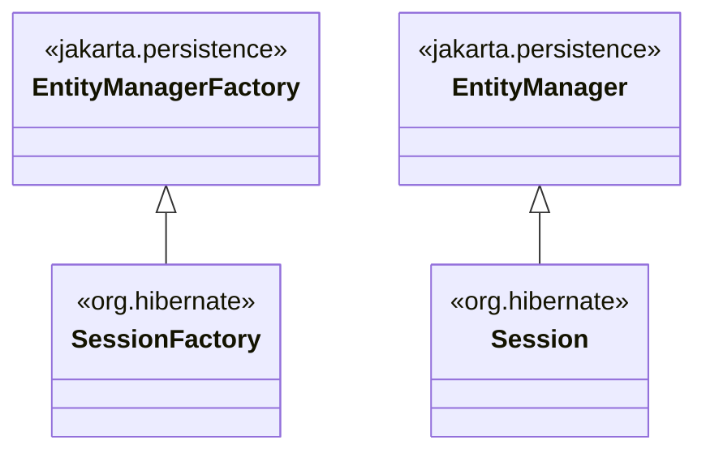
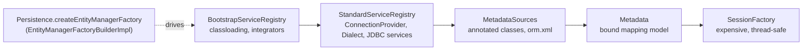
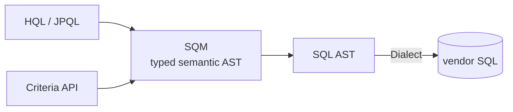

# ORM Fundamentals & JPA vs Hibernate

Object-Relational Mapping (ORM) is the layer that bridges two worlds that were never
designed to talk to each other: an **object graph** in the JVM heap (classes, references,
inheritance, identity by reference) and a **relational database** (tables, rows, foreign
keys, identity by primary key). This topic is the foundation of the whole Hibernate/JPA
domain — before you can reason about the persistence context, dirty checking, lazy
proxies, N+1, or caching, you need to be crisp about *what* an ORM is, *why* the
mismatch exists, and the difference between **JPA the specification** and **Hibernate
the implementation**.

Interviewers open with this topic to calibrate seniority fast. A junior says "JPA and
Hibernate are the same thing." A senior explains: JPA is a *spec* (a set of interfaces
and annotations in `jakarta.persistence.*`), Hibernate is the most-used *provider* that
implements it plus a large superset of native features, and they can articulate the
impedance mismatch that makes ORM both useful and dangerous.

> [!KEY-TAKEAWAY]
> **JPA = the contract (Jakarta Persistence spec). Hibernate = an implementation of
> that contract (plus native extensions).** You code to `jakarta.persistence.*` for
> portability, and reach for `org.hibernate.*` when you need power the spec doesn't
> expose. Modern stack: **Jakarta Persistence 3.1/3.2**, **Hibernate ORM 6.x/7.x**,
> `jakarta.*` namespace (the `javax.*` era is legacy).

For the underlying database mechanics referenced throughout — SQL itself, B-tree/LSM
storage, ACID isolation levels, indexing, and transactions at the DB level — see
`messaging-databases/*`. This topic stays at the **ORM mechanism altitude**: how
Hibernate/JPA *uses* the database.

---

## What ORM is and the object-relational impedance mismatch

**ORM** is a technique (and the libraries that implement it) for mapping rows in
relational tables to objects in an object-oriented language, and vice versa, so you
manipulate persistent data as ordinary objects instead of hand-writing SQL and
JDBC `ResultSet` plumbing for every operation.

The reason ORM is *hard* — and the reason it leaks — is the **object-relational
impedance mismatch**: the object model and the relational model have fundamentally
different rules. The classic five mismatch dimensions (from Fowler / the original
Hibernate authors, Bauer & King) are:

| Mismatch | Object world | Relational world | ORM must reconcile |
|---|---|---|---|
| **Granularity** | Fine-grained classes (an `Address` value object) | Coarse-grained tables; you rarely want a table per tiny type | Embeddables (`@Embeddable`) flatten a value type into the owner's columns |
| **Inheritance** | `Employee extends Person`, polymorphism | No native inheritance; tables are flat | Inheritance strategies: `SINGLE_TABLE`, `JOINED`, `TABLE_PER_CLASS` (see `inheritance-embeddables-composite-keys`) |
| **Identity** | Two notions: `a == b` (same reference) and `a.equals(b)` (logical) | One notion: primary-key equality | Persistence context guarantees `==` within a session; `equals/hashCode` needs care |
| **Associations** | Object references, inherently **directional** (A holds a pointer to B) | Foreign keys, inherently **bidirectional** (a join can go either way) | Mapping directionality (`mappedBy`, owning vs inverse side) |
| **Data navigation** | Walk the graph: `order.getCustomer().getAddress()` | Set-based: you want to fetch what you need in as few round-trips as possible | Fetch strategies, lazy loading, `JOIN FETCH` — get this wrong and you get **N+1** |

**Identity** is the subtlest and a favorite follow-up. In Java there are two questions:
"are these the *same object*?" (`==`, reference identity) and "are these *logically
equal*?" (`equals()`). The database has exactly one: do the **primary keys** match. The
persistence context (first-level cache) bridges this by guaranteeing that within a single
`EntityManager`, repeated loads of the same row return the **same object instance** — so
`==` works *inside* a session. Across sessions, or for detached/transient entities, only
a properly implemented `equals()`/`hashCode()` (typically on a stable business key, never
on a DB-generated id that is null before insert) is reliable. See
`entity-mappings-associations` for the equals/hashCode entity contract in depth.

**Data navigation** is where the mismatch bites hardest in production. Objects invite you
to walk references freely; the database wants set-based access. If you lazily walk a
collection in a loop, the ORM issues one query per element — the **N+1 select problem**:

```java
// 1 query to load the orders...
List<Order> orders = em.createQuery("select o from Order o", Order.class).getResultList();
for (Order o : orders) {
    // ...then 1 query PER order to load its customer (lazy) = N more queries
    System.out.println(o.getCustomer().getName());
}
```

```sql
select * from orders;                       -- 1
select * from customer where id = ?;        -- N (once per order)
select * from customer where id = ?;
...
```

That is the impedance mismatch made concrete: fluent object navigation silently becomes a
flood of round-trips. The fix is `JOIN FETCH` / entity graphs / batch fetching, covered in
`fetching-lazy-eager-n-plus-one`.



> [!WARNING]
> An ORM does not *eliminate* the impedance mismatch — it *manages* it and hides it
> behind an abstraction. The leaks (N+1, `LazyInitializationException`, cascade
> surprises, dirty-checking overhead) are exactly where the mismatch shows through, and
> exactly what senior interviews probe.

---

## JPA: the specification (Jakarta Persistence)

**JPA — Jakarta Persistence API** (formerly *Java* Persistence API) — is a
**specification**, not a library you can run by itself. It defines:

- A set of **interfaces**: `EntityManager`, `EntityManagerFactory`, `EntityTransaction`,
  `Query`, `TypedQuery`, `CriteriaBuilder`, etc. (package `jakarta.persistence.*`).
- A set of **annotations**: `@Entity`, `@Id`, `@GeneratedValue`, `@Table`, `@Column`,
  `@OneToMany`, `@ManyToOne`, `@Embeddable`, `@Version`, etc.
- A query language, **JPQL** (Jakarta Persistence Query Language), an object-oriented
  query language that operates over entities, not tables.
- The rules for the **persistence context**, entity lifecycle states, transactions,
  locking, and the `META-INF/persistence.xml` bootstrap descriptor.

JPA is delivered as an **API jar plus a TCK** (Technology Compatibility Kit). To do
anything at runtime you need a **provider** (implementation) — Hibernate, EclipseLink, or
OpenJPA — that supplies the actual engine behind those interfaces.

**Version lineage (know the current numbers):**

| Version | Namespace | Notes |
|---|---|---|
| JPA 2.2 | `javax.persistence.*` | Last release under the `javax` namespace (Java EE 8) |
| Jakarta Persistence 3.0 | `jakarta.persistence.*` | **Big-bang namespace rename**, no new features |
| Jakarta Persistence 3.1 | `jakarta.persistence.*` | `UUID` generation, more JPQL functions (`ceiling`, `floor`, `power`, `round`, `sign`, `extract`, `local date/time`) |
| Jakarta Persistence 3.2 | `jakarta.persistence.*` | Latest; `EntityManagerFactory`/`EntityManager` implement `AutoCloseable`, records for `@IdClass`/embeddables, more JPQL, programmatic schema APIs, `Enum`/`instant`/`year` improvements |

> [!TIP]
> Frame it in one line for the interviewer: *"JPA is the API and the rulebook;
> Hibernate is the engine that obeys the rulebook."* Coding against
> `jakarta.persistence.*` types keeps you provider-portable; coding against
> `org.hibernate.*` types couples you to Hibernate.

---

## Hibernate: the implementation (reference-grade JPA provider plus native features)

**Hibernate ORM** predates JPA — it was created by Gavin King around 2001 — and its
design directly inspired the JPA specification. Today Hibernate is the **most widely used
JPA provider** and is the default provider bundled with Spring Boot. It is *a* reference
implementation in practice (EclipseLink is the *official* JPA reference implementation),
and it implements the full JPA spec **plus** a large superset of native capabilities the
spec does not standardize:

- **Native query/session API**: `SessionFactory`, `Session`, `StatelessSession`.
- **HQL** (Hibernate Query Language) — a superset of JPQL.
- Extra id generators, `@NaturalId`, multi-tenancy, `@Filter`, `@Where`/`@SQLRestriction`,
  `@Formula`, `@DynamicUpdate`/`@DynamicInsert`, soft-delete, envers auditing.
- Second-level cache provider integration, batch fetching, `@BatchSize`,
  `@Fetch(FetchMode.SUBSELECT)`.
- Since Hibernate 6: a rewritten query engine built on the **SQM (Semantic Query
  Model)** — HQL/JPQL is parsed into a semantic AST, then translated to SQL, giving much
  better type safety and richer SQL generation. Hibernate 6 also moved fully to the
  `jakarta.*` namespace and requires **Java 11+** (Hibernate 7 requires **Java 17+**).

**The trade-off**: every native feature you use ties you to Hibernate. That is often the
right call (Hibernate is excellent and rarely swapped out), but it means "JPA-portable"
and "uses Hibernate" are not the same claim. Senior candidates make this distinction
explicitly.

```java
// JPA-portable: only jakarta.persistence.* types
@Entity
public class Book {
    @Id @GeneratedValue(strategy = GenerationType.IDENTITY)
    private Long id;
    private String title;
}

// Hibernate-native: org.hibernate.annotations.* — NOT portable to EclipseLink
@Entity
public class Book2 {
    @Id @GeneratedValue Long id;
    @org.hibernate.annotations.NaturalId String isbn;   // native
    @org.hibernate.annotations.Formula("(select count(*) from review r where r.book_id = id)")
    int reviewCount;                                     // native
}
```

---

## Other JPA providers: EclipseLink and OpenJPA

JPA is a spec, so multiple providers exist. Knowing they exist (and which is which)
signals you understand the spec/impl split.

| Provider | Role | Notes |
|---|---|---|
| **Hibernate ORM** | Most-used provider; Spring Boot default | Largest native feature set; created before JPA and inspired it |
| **EclipseLink** | **Official reference implementation** of Jakarta Persistence | Descended from Oracle TopLink; default provider in GlassFish/Payara |
| **Apache OpenJPA** | Apache's implementation | Descended from BEA Kodo; less active today |
| **DataNucleus** | Implements JPA *and* JDO | Notable for supporting non-relational stores too |

> [!INTERVIEW]
> Gotcha question: *"Which is the reference implementation of JPA — Hibernate or
> EclipseLink?"* The **official** reference implementation is **EclipseLink**. Hibernate
> is the most *popular* provider and the de-facto standard in Spring shops, but "most
> used" ≠ "the reference implementation." Getting this right is a quick seniority signal.

Because they all implement the same spec, an application written strictly against
`jakarta.persistence.*` can (in principle) swap providers by changing the
`provider` in `persistence.xml` and the dependency — the value proposition of coding to
the spec. In practice, real apps use provider-specific features and rarely migrate.

---

## The JPA architecture: EntityManagerFactory, EntityManager and the persistence unit

The three central runtime abstractions of JPA (this maps directly onto Hibernate's
native trio — see the next section):

| JPA concept | What it is | Lifecycle / cost | Thread-safety |
|---|---|---|---|
| **Persistence unit** | A named set of entity classes + config, declared in `META-INF/persistence.xml` (or built programmatically) | Design-time grouping | n/a |
| **`EntityManagerFactory` (EMF)** | Factory that builds `EntityManager`s for one persistence unit | **Expensive**, create **once** per unit, keep for app lifetime | **Thread-safe** — share it |
| **`EntityManager` (EM)** | The primary API: persist/find/merge/remove/query; owns the **persistence context** (first-level cache) | **Cheap**, short-lived, **one per transaction/request** | **NOT thread-safe** — never share across threads |

The `EntityManager` is the workhorse. It manages the **persistence context**: the set of
managed entity instances in the current unit of work. Within that context Hibernate
tracks changes (**dirty checking**), guarantees object identity (`==` for the same row),
batches writes, and flushes SQL at the right moment. Those mechanisms are the subject of
`session-entitymanager-persistence-context`, `entity-lifecycle-states`, and
`transactions-dirty-checking-flushing` — here just anchor the object hierarchy.



**Bootstrap (JPA-standard):**

```java
EntityManagerFactory emf = Persistence.createEntityManagerFactory("my-unit");
EntityManager em = emf.createEntityManager();
em.getTransaction().begin();
em.persist(new Book("Effective Java"));
em.getTransaction().commit();   // flush + commit
em.close();
```

> [!WARNING]
> **`EntityManager` is not thread-safe.** Sharing one across threads corrupts the
> persistence context. In Spring you almost never manage this yourself: Spring injects a
> shared, thread-bound proxy `@PersistenceContext EntityManager` that delegates to the
> correct per-transaction instance. Container/transaction management is a **spring-***
> concern — see `spring-core`/`spring-boot` for `@Transactional` proxying and
> propagation; this domain owns only the JPA/Hibernate mechanics.

---

## Hibernate's native API: SessionFactory and Session

Hibernate's native abstractions predate JPA and map one-to-one onto the JPA ones:

| Hibernate native | JPA equivalent | Relationship in Hibernate 6/7 |
|---|---|---|
| `SessionFactory` | `EntityManagerFactory` | `SessionFactory` **extends** `EntityManagerFactory` |
| `Session` | `EntityManager` | `Session` **extends** `EntityManager` |
| `Transaction` | `EntityTransaction` | native transaction abstraction |
| `StatelessSession` | (no JPA equivalent) | no persistence context, no cache, no dirty checking — for bulk work |

Because `Session extends EntityManager` and `SessionFactory extends EntityManagerFactory`
in Hibernate 6/7, you can **unwrap** the JPA type to the Hibernate type to reach native
features while keeping JPA everywhere else:

```java
Session session = em.unwrap(Session.class);              // JPA -> Hibernate
SessionFactory sf = emf.unwrap(SessionFactory.class);
Book b = session.bySimpleNaturalId(Book.class).load("978-0134685991"); // native feature
```

**`StatelessSession`** is a key senior detail: it is a command-oriented API with **no
persistence context, no first-level cache, no automatic dirty checking, and no cascade**.
Because it doesn't accumulate managed entities in memory, it's the right tool for bulk
inserts/updates and large exports where a normal `Session` would balloon memory and force
constant flushing. It's the ORM-side answer to "the ORM is the wrong tool for bulk work"
(next section).



---

## javax to jakarta: the namespace migration

A version-history question that trips people up. Java EE was donated by Oracle to the
Eclipse Foundation and rebranded **Jakarta EE**. For legal/trademark reasons Oracle
retained the `javax` trademark, so **Jakarta EE 9 renamed every `javax.*` package to
`jakarta.*`** — a hard, breaking, package-level rename with **no new features** in that
release. For persistence specifically:

- **`javax.persistence.*` → `jakarta.persistence.*`** (e.g. `javax.persistence.Entity`
  becomes `jakarta.persistence.Entity`).
- This happened at **Jakarta Persistence 3.0**.
- **Hibernate ORM 5.x** used `javax.persistence.*`; **Hibernate ORM 6.0+** uses
  `jakarta.persistence.*`. This is often the single biggest hurdle in a Hibernate
  5→6 upgrade.
- **Spring Boot 2.x** is `javax`; **Spring Boot 3.x** requires `jakarta` (and Java 17+).

```java
// Legacy (Java EE 8 / JPA 2.2 / Hibernate 5 / Spring Boot 2)
import javax.persistence.Entity;
import javax.persistence.Id;

// Current (Jakarta EE 9+ / Jakarta Persistence 3.x / Hibernate 6-7 / Spring Boot 3)
import jakarta.persistence.Entity;
import jakarta.persistence.Id;
```

> [!TIP]
> Migration tools exist (Eclipse Transformer, OpenRewrite `jakarta` recipes,
> IntelliJ's refactor) to bytecode/source-rewrite `javax.*` → `jakarta.*`. It is
> mechanical but all-or-nothing: you cannot mix `javax.persistence` and
> `jakarta.persistence` in the same running application because they are different types.
> The rename is *only* about package names — annotation names, semantics, and behavior
> are unchanged.

---

## When to use an ORM vs plain JDBC, jOOQ or MyBatis

An ORM is not always the right tool. A senior answer weighs the trade-offs rather than
treating Hibernate as a default hammer.

**Use an ORM (JPA/Hibernate) when:**

- You have a rich **domain model** with lots of entities and associations, and CRUD +
  navigation dominate the workload.
- You benefit from the **persistence context**: automatic dirty checking, identity
  guarantees, write batching, caching, and cascade of lifecycle operations.
- Portability across databases matters (Hibernate abstracts dialect differences).
- Developer productivity on transactional line-of-business logic matters more than
  micro-optimized SQL.

**Prefer plain JDBC / jOOQ / MyBatis (or Spring's `JdbcClient`/`JdbcTemplate`) when:**

| Tool | Strength | Use when |
|---|---|---|
| **Plain JDBC** | Full control, zero abstraction | Ultra-hot paths, simple scripts, you own every byte |
| **jOOQ** | Type-safe SQL DSL generated from your schema; SQL-first | You want to *write SQL* but type-checked and refactor-safe; complex analytical queries |
| **MyBatis** | SQL in XML/annotations mapped to objects; SQL-first | You want hand-tuned SQL with light object mapping and no persistence-context magic |
| **Spring Data JDBC** | Simpler than JPA, no lazy loading / dirty checking | You want repositories without the full JPA machinery |

**Where an ORM is the *wrong* tool (classic interview point):**

- **Bulk operations** — inserting/updating/deleting millions of rows one managed entity
  at a time is slow and memory-hungry. Use set-based `UPDATE`/`DELETE` JPQL, JDBC batch,
  or Hibernate's `StatelessSession`.
- **Reporting / analytics** — wide aggregations, pivots, window functions. Fetching
  entities to compute a report is wasteful; run SQL (or projections) and read scalars.
- **Complex, database-specific queries** — recursive CTEs, sophisticated window
  functions, vendor SQL. Native SQL, jOOQ, or a view is clearer than bending JPQL.

> [!KEY-TAKEAWAY]
> The mature position: **use an ORM for the transactional domain model, and drop to
> SQL-first tools (native query, jOOQ, `StatelessSession`, set-based JPQL) for bulk and
> reporting.** They coexist — many teams run Hibernate for OLTP writes and jOOQ/native
> SQL for reports against the same database. Reaching for the right tool per workload,
> rather than forcing everything through entities, is the senior move.

For the underlying SQL, JDBC driver, and database-engine mechanics that all these tools
sit on top of, see `messaging-databases/sql-query-language-advanced-queries` and
`messaging-databases/database-storage-internals-engines`.

---

## The spec lineage: JSRs, the JCP-to-Jakarta handoff, and version-by-version changes

"Trace JPA's history" is a classic seniority calibrator. Naming the **JSR numbers** and the
**governance shift** is the signal that separates someone who has read the spec from someone
who has only used `@Entity`.

While JPA lived under the **Java Community Process (JCP)**, each version was a **JSR**:

| JSR | Version | Year | Headline additions |
|---|---|---|---|
| **JSR 220** | JPA 1.0 (part of EJB 3.0) | 2006 | The API itself: `@Entity`, `EntityManager`, JPQL — extracted from EJB CMP |
| **JSR 317** | JPA 2.0 | 2009 | Criteria API, `@ElementCollection`, the L2 cache SPI, `orphanRemoval`, pessimistic locking |
| **JSR 338** | JPA 2.1 (2013) → 2.2 (2017) | 2013/17 | 2.1: converters, `@NamedEntityGraph`, stored procedures, schema-gen. 2.2: `java.time`, `@Repeatable`, `Stream`. **The last `javax` JSRs.** |

Then Oracle donated Java EE to the **Eclipse Foundation**. Because the JCP could no longer
govern it, the spec moved to the **Jakarta EE Specification Process (JESP)** — **there are no
more JSRs**. Jakarta Persistence 3.0 (2020) onward is a JESP specification, not a JCP JSR.

- **3.0** (2020) — the big-bang `javax.persistence.*` → `jakarta.persistence.*` rename. **No new features.**
- **3.1** (2022) — `GenerationType.UUID`, plus math/date JPQL functions (`ceiling`, `floor`, `power`, `round`, `sign`, `extract`, `local date/time`).
- **3.2** (2024) — `AutoCloseable`, records, options-based `find`/`refresh`/`lock`, `PersistenceConfiguration`, `getSingleResultOrNull` (see below).
- **4.0** — the next major, **in development**, targeted by **Hibernate 8**. Do not present it as stable.

> [!INTERVIEW]
> If asked "what changed at 3.0 vs 3.1 vs 3.2?": **3.0 = rename only**, **3.1 = UUID + JPQL
> functions**, **3.2 = AutoCloseable / records / options-based API**, **4.0 = next major (in dev)**.
> Bonus: JPA was born in **JSR 220 (EJB 3.0)** and stopped being a JSR when it left the JCP.

---

## How JPA finds Hibernate: the persistence-provider SPI

"How does `Persistence.createEntityManagerFactory(...)` find Hibernate at runtime?" separates
people who understand the plug-in architecture from those who think it's magic. It is the
**Java `ServiceLoader` mechanism**, not a hard-coded dependency.

- The spec defines `jakarta.persistence.spi.PersistenceProvider`. Every provider ships an
  implementation — Hibernate's is `org.hibernate.jpa.HibernatePersistenceProvider`.
- Each provider jar declares itself in
  `META-INF/services/jakarta.persistence.spi.PersistenceProvider` (a `ServiceLoader` file
  whose single line names the impl class).
- `Persistence.createEntityManagerFactory("unit")` asks the
  `PersistenceProviderResolver` for all providers on the classpath, then hands each the
  persistence-unit name; the **first provider that recognizes the unit** (or that matches the
  `jakarta.persistence.provider` property in `persistence.xml`) builds and returns the EMF.

```xml
<!-- persistence.xml: pin the provider explicitly when more than one is on the classpath -->
<persistence-unit name="my-unit">
  <provider>org.hibernate.jpa.HibernatePersistenceProvider</provider>
  ...
</persistence-unit>
```

> [!KEY-TAKEAWAY]
> JPA finds Hibernate by **service discovery**: the provider jar advertises a
> `PersistenceProvider` under `META-INF/services`, and `Persistence` delegates unit creation
> to it. That is why adding the Hibernate jar to the classpath is enough — and why two
> providers on the classpath forces you to name one with `<provider>` or the `jakarta.persistence.provider` property.

---

## Hibernate bootstrap internals: ServiceRegistry, Metadata, SessionFactory

The JPA `Persistence.createEntityManagerFactory` path is a thin façade
(`EntityManagerFactoryBuilderImpl`) that sits **on top of** Hibernate's native bootstrap. A
senior candidate can describe what actually happens when the `SessionFactory` is built —
service resolution, dialect detection, metadata binding:

```java
// Hibernate native bootstrap (what the JPA path drives underneath)
StandardServiceRegistry registry = new StandardServiceRegistryBuilder()
        .configure("hibernate.cfg.xml")   // or applySetting(...)
        .build();
Metadata metadata = new MetadataSources(registry)
        .addAnnotatedClass(Book.class)
        .buildMetadata();                 // binds entities -> relational mapping model
SessionFactory sf = metadata.buildSessionFactory();
```

The three layers, in order:

1. **`BootstrapServiceRegistry`** — the lowest tier: classloading, integrator discovery
   (`ServiceLoader` for `Integrator`), and the `StrategySelector`.
2. **`StandardServiceRegistry`** — the configurable services: `ConnectionProvider`
   (Agroal/Hikari pool), `JdbcServices` (dialect resolution — Hibernate probes the JDBC
   `DatabaseMetaData` to pick the `Dialect` unless you set one), transaction coordinator, etc.
   Services are resolved lazily and cached here.
3. **`Metadata`** — the fully bound domain model: `MetadataSources` collects mapping inputs
   (annotated classes, `orm.xml`, `hbm.xml`), and `buildMetadata()` produces the immutable
   mapping model from which `buildSessionFactory()` creates the (expensive, thread-safe,
   one-per-app) `SessionFactory`.



---

## The Hibernate 6 type system: JavaType, JdbcType, and @JdbcTypeCode

The single biggest "what actually changed in Hibernate 6?" answer, and the mechanism behind
every JSON / enum / UUID mapping question.

**Hibernate 5** used one monolithic `org.hibernate.type.Type` hierarchy (`BasicType`,
`UserType`), where a single object mixed the Java-side and JDBC-side concerns. **Hibernate 6
split this into two composable descriptors**:

- **`JavaType<T>`** (`org.hibernate.type.descriptor.java`) — describes the **Java side**: how
  to instantiate, compare, copy, and wrap/unwrap a `T` (e.g. `StringJavaType`, `UUIDJavaType`).
- **`JdbcType`** (`org.hibernate.type.descriptor.jdbc`) — describes the **JDBC/SQL side**: how
  to bind to a `PreparedStatement` and extract from a `ResultSet`, tied to a JDBC type code
  (`SqlTypes.VARCHAR`, `SqlTypes.JSON`, `SqlTypes.UUID`).

A `BasicType` is the **composition** of one `JavaType` + one `JdbcType`. You steer the mapping
with annotations rather than a custom `UserType`:

```java
@Entity
class Product {
    // Store a Java UUID as the DB's native uuid/binary type
    @JdbcTypeCode(SqlTypes.VARCHAR)          // override the SQL side
    UUID sku;

    // Map a POJO to a JSON column (Postgres jsonb, etc.)
    @JdbcTypeCode(SqlTypes.JSON)
    Map<String, Object> attributes;

    @Enumerated(EnumType.STRING)             // JPA-standard enum mapping still works
    Status status;
}
```

> [!TIP]
> In **Hibernate 7**, prefer **`@JdbcTypeCode(SqlTypes.X)`** over the lower-level
> `@JdbcType(SomeJdbcType.class)`: several built-in `JdbcType` classes moved to internal
> packages, so referencing them directly is fragile. `@JavaType` / `@JdbcType` remain for
> genuinely custom descriptors.

---

## SQM: the Semantic Query Model query pipeline

"Why did they rewrite the query engine in Hibernate 6?" HQL, JPQL, and the Criteria API do
**not** each have their own translator anymore — they all produce a single intermediate
representation:

1. **Parse** HQL/JPQL (or build Criteria) into an **SQM** — a *typed* semantic AST validated
   **against the domain model** (entity names, attribute types, association metadata). Illegal
   references and type mismatches are caught here, not at SQL time.
2. **Lower** the SQM into a **SQL AST** (an abstract relational tree).
3. **Render** the SQL AST to vendor SQL via the `Dialect`.

Contrast with Hibernate 5's older Antlr-based HQL walker, which was less type-aware and
generated SQL more directly. SQM is why HB6+ has far better type safety, tuple/DTO
projections, set operations, and consistent behavior across HQL and Criteria — they share the
same back half of the pipeline.



---

## Hibernate 7.0: breaking changes and new defaults

Hibernate ORM **7.0 went GA in 2025** (baseline **Java 17**; 7.x also runs on 21/25) and
targets **Jakarta Persistence 3.2**. "Have you moved to Hibernate 7 / what breaks?" is the
current-events question for 2025/26 loops. This section is a **summary**; deep migration steps
live in `hibernate-6-7-and-jakarta-migration`.

**Renamed annotations** (the old ones are removed, not deprecated):

| Removed (HB ≤6) | Replacement (HB7) |
|---|---|
| `@Where` | `@SQLRestriction` |
| `@WhereJoinTable` | `@SQLJoinTableRestriction` |
| `@OrderBy` (Hibernate's) | `@SQLOrder` (or JPA `@OrderBy`) |
| `@Target` | `@TargetEmbeddable` |

**Removed native `Session` methods** (they predated JPA and duplicated it) — use the JPA verbs:

| Removed | Use instead |
|---|---|
| `save` | `persist` |
| `update` / `saveOrUpdate` | `merge` (detached) / `persist` (transient) |
| `delete` | `remove` |
| `load` | `getReference` |
| `get` (deprecated) | `find` |

Also removed: **`@Proxy`, `@LazyToOne`, `@LazyCollection`, `@Persister`, `@Loader`,
`@SelectBeforeUpdate`**; `CascadeType.SAVE_UPDATE` and `CascadeType.DELETE` (use
`PERSIST`/`MERGE`/`REMOVE`).

**New defaults / behavior changes**:

- **`StatelessSession` now uses the L2 cache by default** — call `setCacheMode(CacheMode.IGNORE)`
  to opt out. (This makes the older "StatelessSession never touches the cache" statement stale for 7.x.)
- Bulk `update`/`delete` on an **`@Immutable`** entity now **throws** (was a warning).
- `refresh`/`lock` on a **detached** entity now throws `IllegalArgumentException` (aligns with
  JPA; the `hibernate.allow_refresh_detached_entity` escape hatch was removed).
- Implicit-`SELECT` queries with no declared result type are rejected; native-query temporal
  types default to `java.time`; `LockOptions` deprecated in favor of passing
  `LockMode`/`Timeout`/`PessimisticLockScope`.
- **Hibernate Models** replaces **HCANN** for reading annotations/domain metadata.
- Classpath entity scanning needs the new **`hibernate-scan-jandex`** module; the built-in
  Vibur/Proxool/UCP connection pools were dropped (use **Agroal or Hikari**).
- Hibernate is now **Apache License 2.0** (was LGPL) as of 7.0.

---

## Jakarta Persistence 3.2: developer-facing changes

3.2 is the version Hibernate 7 targets, so "what's new in the latest JPA?" maps here.

- **`EntityManagerFactory` and `EntityManager` are now `AutoCloseable`** — usable in
  try-with-resources.
- **Records** are usable as embeddables (and for DTO projections / `@IdClass`-style keys).
- **Options-based overloads**: `find(Class, Object, FindOption...)`, plus `refresh`/`lock`
  taking `RefreshOption`/`LockOption` — `LockModeType`, `Timeout`, `PessimisticLockScope`,
  and `CacheStoreMode`/`CacheRetrieveMode` are now passed as options instead of property maps.
- **`getSingleResultOrNull()`** on `Query`/`TypedQuery`/`StoredProcedureQuery` — returns `null`
  instead of throwing `NoResultException` (and still throws `NonUniqueResultException` for >1).
- **`PersistenceConfiguration`** — a programmatic bootstrap API, an alternative to
  `persistence.xml`.
- New JPQL: `id()`, `version()`, `cast`, `left`/`right`, `replace`, the `||` concatenation
  operator, and set operations (`union`/`intersect`/`except`).
- `runInTransaction`/`callInTransaction` on the EMF and `runWithConnection`/`callWithConnection`
  on the EM for lambda-style unit-of-work code.

> [!NOTE]
> Under the Jakarta model there is no single JCP-style *mandated* RI: the spec lists
> **compatible implementations** (EclipseLink and Hibernate both certify against the TCK).
> EclipseLink remains the **historical/official RI** and Hibernate is the de-facto standard —
> so "which is the RI?" still answers **EclipseLink**, but be ready for the nuance follow-up.

---

## Jakarta Data 1.0 and Hibernate Data Repositories

The newest thing in the ecosystem, and a 2025 differentiator: **"how does Jakarta Data relate
to Spring Data JPA?"**

**Jakarta Data 1.0** (part of **Jakarta EE 11**) standardizes the **repository abstraction**
that Spring Data popularized — but as a *spec*, not a framework. It introduces `@Repository`,
built-in `CrudRepository`/`BasicRepository`, annotation-driven query methods (`@Find`,
`@Query`, `@Insert`/`@Update`/`@Delete`), and pagination/sort types (`Order`, `Sort`,
`Page`/`PageRequest`, `CursoredPage`). **Hibernate 7 ships an implementation** (Hibernate Data
Repositories / HR) that generates repository implementations at build time.

In one line: **Jakarta Data is a Jakarta-standardized, vendor-portable answer to Spring Data
JPA.** Deep repository coverage (derived queries, projections, `Page` vs `Slice`) belongs to
`spring-data-jpa-repositories`; here just place it in the landscape.

---

## Hibernate-native features beyond the spec

"Name Hibernate features JPA doesn't have" is a standard prompt; each maps to a real production
use case. All are in `org.hibernate.annotations.*` and couple you to Hibernate.

| Feature | What it does | Typical use |
|---|---|---|
| `@Formula("sql")` | Read-only computed column from a SQL fragment | Derived `fullName`, `reviewCount` without a real column |
| `@SQLRestriction("...")` (HB6.3+, replaces `@Where`) | Always-on entity-level filter | Soft delete: `deleted = false` |
| `@Filter` / `@FilterDef` | **Parameterized**, per-session filter enabled via `session.enableFilter(...)` | Multi-tenant row filtering, effective-dated data |
| `@NaturalId` + `session.byNaturalId(...)` / `bySimpleNaturalId(...)` | Business-key lookup with its own cache | Load `User` by email / `Book` by ISBN |
| `@DynamicUpdate` / `@DynamicInsert` | Generate SQL touching only changed / non-null columns | Wide tables; optimistic-lock on many columns (trade-off: no cached prepared statement) |
| `@Immutable` | Read-only entity/collection; skips dirty checking | Reference data, audit rows |
| `@SoftDelete` (HB6.4+) | First-class soft-delete, replacing hand-rolled `@SQLDelete` + `@SQLRestriction` | Logical deletes |
| `@SQLInsert` / `@SQLUpdate` / `@SQLDelete` | Override generated DML with custom SQL | Stored-proc-backed writes, DB-specific syntax |
| **Multi-tenancy** (`MultiTenantConnectionProvider`, `CurrentTenantIdentifierResolver`) | SCHEMA / DATABASE / DISCRIMINATOR (discriminator added HB6.3) strategies | SaaS tenant isolation |
| **Envers** (`@Audited`, `_AUD` tables, `AuditReader`) | Automatic entity revision history | Audit trails, temporal queries |

---

## Bulk operations and why entity-by-entity is slow

Deepening "when NOT to use an ORM": the *mechanism* behind the slowness matters in interviews.

Loading N rows as managed entities holds **every row in the persistence context** — that costs
memory *and* an **O(n) dirty-check** at each flush (Hibernate snapshots and diffs every managed
entity). For large mutations, bypass that:

- **Set-based JPQL/HQL `UPDATE`/`DELETE`** — one SQL statement, no entities loaded. **But** it
  **bypasses the persistence context and L1 cache**: already-managed entities keep their stale
  in-memory values, and it does **NOT cascade** or fire `@PreUpdate`/`@PreRemove` callbacks.

  ```java
  em.createQuery("update Account a set a.status = :s where a.region = :r")
    .setParameter("s", Status.CLOSED).setParameter("r", region)
    .executeUpdate();      // 1 UPDATE; managed Account instances still show the OLD status
  ```

- **JDBC batching** — `hibernate.jdbc.batch_size`, plus `order_inserts` / `order_updates` so
  Hibernate can group statements by table into batched `PreparedStatement`s.
- **`StatelessSession`** — no persistence context to grow, direct `insert`/`update`/`delete`.
  In **HB7** its batch tuning changed: `hibernate.jdbc.batch_size` no longer affects it — call
  `setJdbcBatchSize()` or use the new `insertMultiple()`/`updateMultiple()`/`deleteMultiple()`.

> [!WARNING]
> The classic gotcha: *"I ran a bulk JPQL `UPDATE` and my in-memory entity still shows the old
> value."* Bulk DML goes straight to the database and does not touch the persistence context —
> `em.refresh(entity)` (or `clear()` before re-reading) to resync. Same reason bulk DML skips
> cascades and lifecycle callbacks.

---

## Common Interview Follow-ups

- **"Are JPA and Hibernate the same thing?"** No. JPA is a specification (interfaces +
  annotations in `jakarta.persistence.*`); Hibernate is an implementation (provider) of
  that spec plus native features. You can use JPA *through* Hibernate.
- **"Which is the official JPA reference implementation?"** EclipseLink. Hibernate is the
  most *popular* provider and Spring Boot's default, but not the official RI.
- **"What's the difference between `EntityManagerFactory` and `EntityManager`?"** EMF is
  expensive, thread-safe, created once per persistence unit; EM is cheap, not thread-safe,
  one per transaction/request, and owns the persistence context.
- **"How does Hibernate's `Session` relate to JPA's `EntityManager` in Hibernate 6?"**
  `Session extends EntityManager` (and `SessionFactory extends EntityManagerFactory`); you
  `em.unwrap(Session.class)` to reach native features.
- **"Why did the package change from `javax.persistence` to `jakarta.persistence`?"**
  Oracle donated Java EE to the Eclipse Foundation but kept the `javax` trademark, forcing
  the rename in Jakarta EE 9. Jakarta Persistence 3.0 and Hibernate 6 adopted it.
- **"Name a case where you would NOT use Hibernate."** Bulk data loads, heavy
  reporting/analytics, or vendor-specific complex SQL — use native SQL, jOOQ,
  `StatelessSession`, or set-based JPQL instead.
- **"What is the object-relational impedance mismatch, in one example?"** Object
  navigation (`order.getCustomer()`) is graph-oriented while the DB is set-oriented;
  walking a lazy association in a loop produces the N+1 select problem.
- **"Can you swap Hibernate for EclipseLink without code changes?"** Only if you coded
  strictly against `jakarta.persistence.*` and used no native features; in practice most
  apps use provider-specific features and don't migrate.
- **"How does `Persistence.createEntityManagerFactory` find Hibernate?"** The
  `ServiceLoader` SPI: Hibernate advertises `HibernatePersistenceProvider` under
  `META-INF/services/jakarta.persistence.spi.PersistenceProvider`; `Persistence` asks each
  provider to build the named unit.
- **"What actually changed between Hibernate 5, 6, and 7?"** HB5: `javax`, Java 8, monolithic
  `Type` system, Antlr HQL. HB6: `jakarta`, Java 11+, **SQM** engine, `JavaType`/`JdbcType` +
  `@JdbcTypeCode`, `@SQLRestriction`/`@SoftDelete`. HB7: Java 17+, Jakarta Persistence 3.2,
  legacy `Session.save/update/delete/load` and `@Proxy`/`@Where` removed, Hibernate Models,
  StatelessSession L2-by-default, Apache license.
- **"What actually changed in Hibernate 6's type system?"** The single `Type`/`UserType` was
  split into a `JavaType<T>` (Java side) + `JdbcType` (SQL side) composed into a `BasicType`;
  you steer it with `@JdbcTypeCode(SqlTypes.JSON/UUID/...)`.
- **"Is Hibernate's `Session` thread-safe since it extends `EntityManager`?"** No — same rule
  as `EntityManager`. Only `SessionFactory`/`EntityManagerFactory` are thread-safe.
- **"How does Jakarta Data relate to Spring Data JPA?"** Jakarta Data 1.0 (Jakarta EE 11)
  standardizes the repository abstraction as a spec; Hibernate 7 ships an implementation. It's
  a vendor-portable answer to Spring Data JPA.
- **"I ran a bulk JPQL update but my entity still shows the old value — why?"** Bulk DML
  bypasses the persistence context and L1 cache (and cascades/callbacks); `em.refresh()` or
  `clear()` to resync.

## References

- Jakarta Persistence 3.2 Specification — jakarta.ee/specifications/persistence/3.2/
- Jakarta Persistence 3.1 Specification — jakarta.ee/specifications/persistence/3.1/
- Hibernate ORM 6/7 User Guide — docs.jboss.org/hibernate/orm/current/userguide/html_single/
- Hibernate ORM Migration Guide (5→6, javax→jakarta) — docs.jboss.org/hibernate/orm/6.0/migration-guide/
- Hibernate ORM 7.0 Migration Guide (annotation/method removals, new defaults) — docs.hibernate.org/orm/7.0/migration-guide/
- Jakarta Data 1.0 Specification — jakarta.ee/specifications/data/1.0/
- JSR 220 / 317 / 338 (JPA 1.0 / 2.0 / 2.1–2.2) — jcp.org; Jakarta EE Specification Process (JESP)
- *Java Persistence with Hibernate* (Bauer, King, Gregory) — impedance mismatch chapter
- EclipseLink (official JPA RI) — eclipse.dev/eclipselink/
- Vlad Mihalcea, *High-Performance Java Persistence* — ORM vs JDBC trade-offs, N+1
- Related in this library: `session-entitymanager-persistence-context`,
  `entity-lifecycle-states`, `fetching-lazy-eager-n-plus-one`,
  `hibernate-6-7-and-jakarta-migration`; `messaging-databases/*` for SQL/JDBC/DB internals;
  `spring-boot`/`spring-core` for `@Transactional` and the container.
