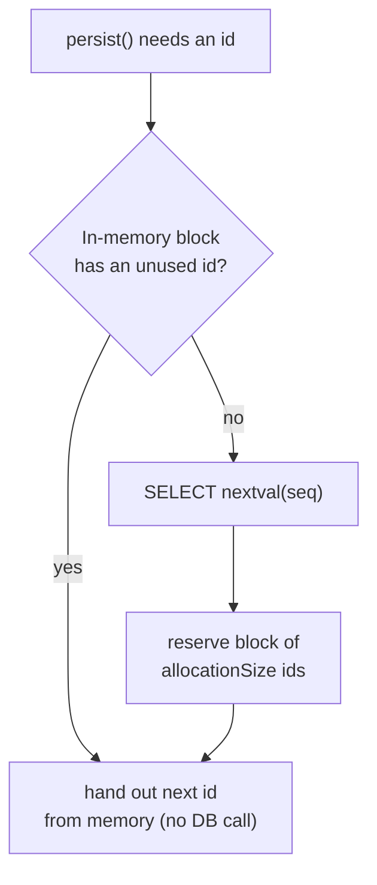
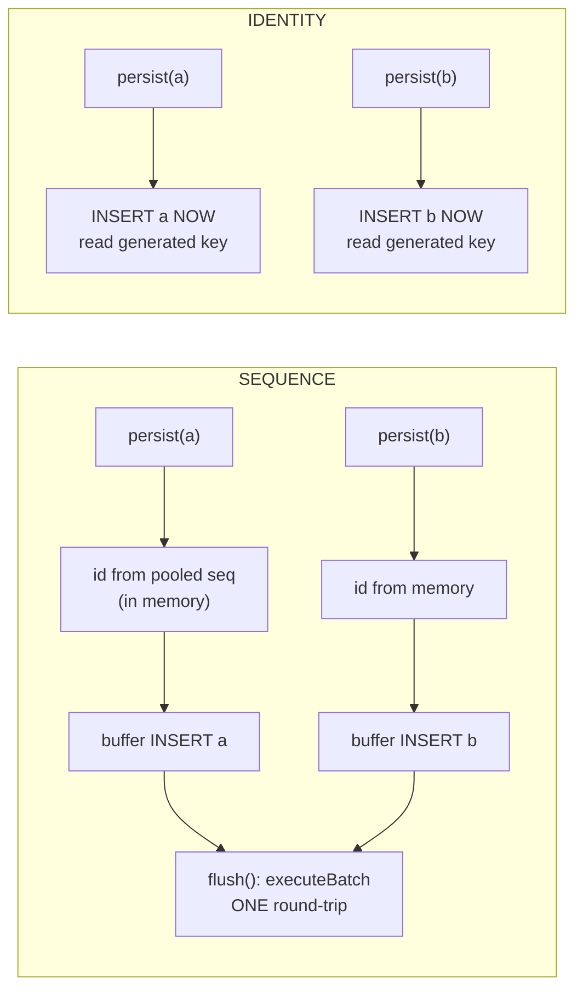
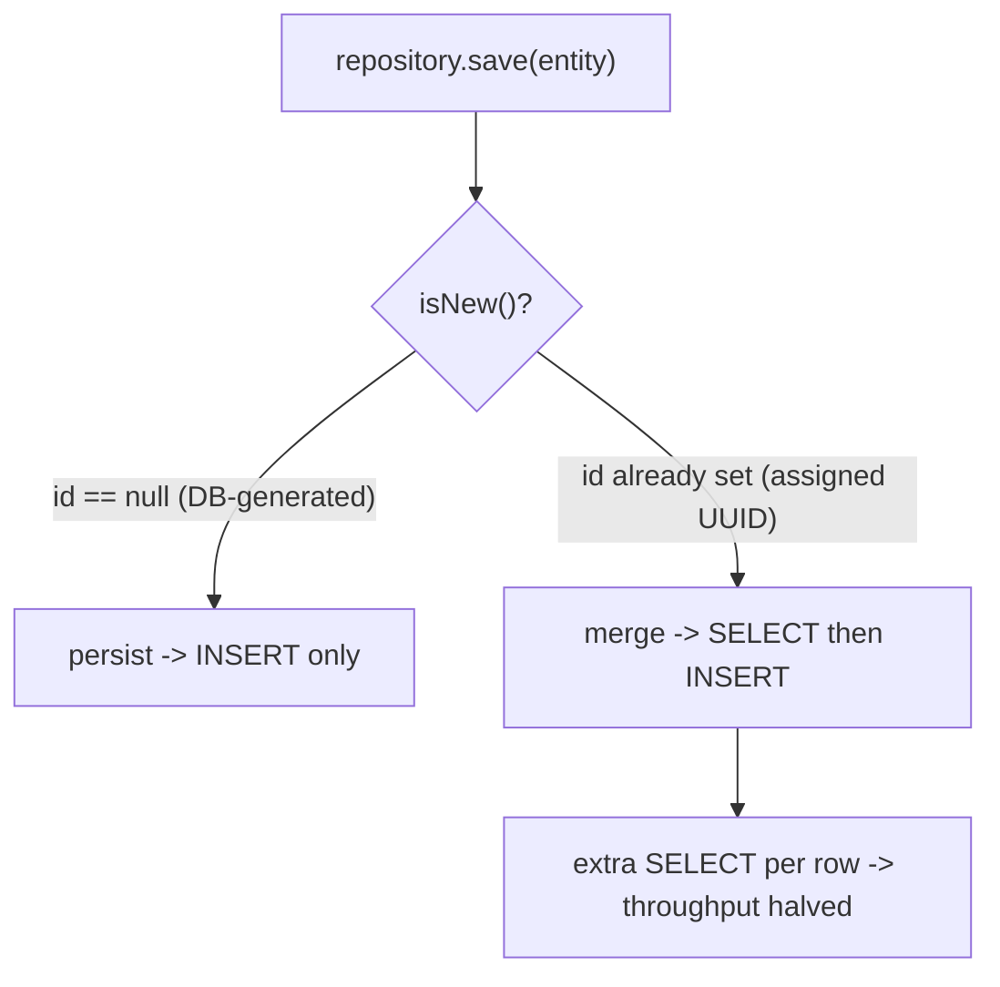

# Primary Keys & ID Generation Strategies

Every JPA entity must have an identifier — the mapping to the table's primary key. How
that identifier is produced (by the database, by a sequence, by the application, or as a
UUID) has outsized consequences for **insert batching, write throughput, index locality,
and the correctness of `equals`/`hashCode`**. This topic is where a senior candidate
distinguishes themselves: the "right" strategy is almost never IDENTITY, and knowing *why*
requires understanding what Hibernate does on `persist()` and on `flush()`.

Grounded in **Jakarta Persistence 3.1/3.2** (`jakarta.persistence.*`) and **Hibernate ORM
6.x/7.x**. The relational-side mechanics of B-tree page splits, primary-key index design,
and auto-increment internals are owned by **messaging-databases** — see
`messaging-databases/indexing-b-tree-lsm` and `messaging-databases/key-design`. Here we
teach how JPA/Hibernate *chooses and populates* the key.

---

## Surrogate vs Natural Keys

A **natural key** is a column that already has business meaning and is guaranteed unique —
an ISBN, an email, a country ISO code. A **surrogate key** is a synthetic, meaningless
value (an auto-increment `BIGINT` or a UUID) that exists only to identify the row.

| Aspect | Natural key | Surrogate key |
|---|---|---|
| Business meaning | Yes | None |
| Stability | Can change (email, SSN reformatting) | Never changes |
| Width / FK cost | Often wide (strings, composites) | Narrow (`BIGINT` = 8 bytes) |
| JPA mapping | `@Id` on the business field (assigned) | `@Id @GeneratedValue` |
| Refactoring risk | High — a "unique" field often isn't forever | Low |

> [!KEY-TAKEAWAY]
> Prefer a **surrogate key** as the primary key for almost all entities, and enforce the
> natural key separately with a `@NaturalId` or a plain unique constraint
> (`@Column(unique = true)`). Natural keys make terrible primary keys because "immutable
> and unique forever" is a promise the business almost always breaks, and every foreign key
> then carries the wide value.

The cost of natural keys compounds: a composite natural key propagates into every child
table's foreign key and every join. Surrogate keys keep FKs narrow and joins cheap. The
trade-off is you usually still need a unique constraint on the natural key for data
integrity, so you maintain both.

---

## GeneratedValue Strategies Overview

`@Id` marks the identifier field. `@GeneratedValue` tells the provider to populate it
automatically instead of you assigning it. The `strategy` element takes a
`jakarta.persistence.GenerationType`:

```java
@Entity
public class Book {
    @Id
    @GeneratedValue(strategy = GenerationType.SEQUENCE, generator = "book_seq")
    @SequenceGenerator(name = "book_seq", sequenceName = "book_seq", allocationSize = 50)
    private Long id;
    // ...
}
```

The four standard strategies:

| Strategy | Mechanism | Value known | Batch inserts | Portable |
|---|---|---|---|---|
| `IDENTITY` | DB identity / auto-increment column | **After** INSERT | **No** (disabled) | Yes |
| `SEQUENCE` | DB sequence object | **Before** INSERT | Yes | Needs sequence support |
| `TABLE` | A table row emulating a sequence | Before INSERT | Yes | Yes (but slow) |
| `AUTO` | Provider picks | Depends | Depends | Yes |
| `UUID` (3.1+) | Provider generates a UUID | Before INSERT | Yes | Yes |

> [!KEY-TAKEAWAY]
> The headline mechanism: with `SEQUENCE`/`TABLE`/`UUID` Hibernate knows the id **before**
> the row is inserted, so it can hold the INSERT in the persistence context and batch many
> together at flush. With `IDENTITY` the id only exists **after** the INSERT executes, so
> Hibernate must fire each INSERT immediately and JDBC batching is impossible.

If you omit `@GeneratedValue` entirely, the id is **assigned** — you must set it yourself
before `persist()`, or Hibernate throws `IdentifierGenerationException`.

---

## IDENTITY Strategy

`GenerationType.IDENTITY` maps to a database identity/auto-increment column:
`AUTO_INCREMENT` (MySQL), `SERIAL`/`GENERATED ... AS IDENTITY` (PostgreSQL),
`IDENTITY` (SQL Server). The database assigns the value as part of the INSERT, and
Hibernate reads it back via JDBC `Statement.getGeneratedKeys()`.

```java
@Id
@GeneratedValue(strategy = GenerationType.IDENTITY)
private Long id;
```

```sql
insert into book (title) values (?)   -- id column omitted; DB assigns it
-- Hibernate then reads generated keys to populate book.id
```

**The critical mechanism:** because the identifier is unknown until the row physically
exists, Hibernate **cannot delay the INSERT to flush time**. On `entityManager.persist()`
it must execute the INSERT *immediately* to obtain the id (the id is the key of the
first-level cache / persistence context, so an entity without an id cannot be managed).
This has two consequences:

1. **JDBC batch inserts are disabled** for `IDENTITY` entities even if you set
   `hibernate.jdbc.batch_size`. Each `persist()` is its own round-trip. Inserting 1,000
   rows = 1,000 INSERT statements. (See "Why IDENTITY Disables JDBC Batch Inserts".)
2. **`persist()` is no longer a purely in-memory operation** — it hits the DB early, which
   can subtly change transaction/flush behavior.

> [!WARNING]
> IDENTITY is the most commonly used strategy (it is MySQL's natural fit and what tutorials
> reach for) but it is the *worst* for write-heavy workloads because it kills insert
> batching. On PostgreSQL/Oracle, prefer SEQUENCE. On MySQL 8, an identity column is often
> unavoidable, but be aware of the batching cost.

**`hibernate.order_inserts` doesn't help IDENTITY either.** Insert ordering groups
same-table statements so a JDBC batch can be built — but IDENTITY fires each INSERT
immediately on `persist()`, so there is never a buffer to reorder. On MySQL/MariaDB the
batching is genuinely off; some older JDBC drivers (e.g. older PostgreSQL) even mishandled
`getGeneratedKeys()` for multi-row batches, historically causing reordering/return-value
issues — another reason IDENTITY and batching don't mix.

> [!KEY-TAKEAWAY]
> **The PostgreSQL "gotcha reversal."** PostgreSQL's `SERIAL` and
> `GENERATED ... AS IDENTITY` columns are *backed by a real sequence* under the hood. If you
> map such a column as `GenerationType.IDENTITY`, you inherit the no-batching penalty. But
> you can map the **same column** as `GenerationType.SEQUENCE` pointing at that backing
> sequence (`nextval('mytable_id_seq')`) and **regain JDBC batching** — the DB still enforces
> the column, but Hibernate now knows the id up front. A senior candidate names this reversal
> on a "1M-row insert is slow on Postgres" question.

---

## SEQUENCE Strategy

`GenerationType.SEQUENCE` uses a database **sequence** object — an independent, atomic
counter (`CREATE SEQUENCE book_seq`). Because the sequence is queried *before* the row is
inserted, Hibernate learns the id up front and can keep the INSERT buffered until flush.

```java
@Id
@GeneratedValue(strategy = GenerationType.SEQUENCE, generator = "book_seq")
@SequenceGenerator(name = "book_seq", sequenceName = "book_seq", allocationSize = 50)
private Long id;
```

```sql
select nextval('book_seq')            -- get id up front (may be pooled, see below)
insert into book (title, id) values (?, ?)
insert into book (title, id) values (?, ?)   -- these can be batched
```

> [!KEY-TAKEAWAY]
> SEQUENCE is the **default and preferred** strategy for most databases. It supports JDBC
> batching *and* the pooled/hi-lo optimizers, which amortize the `nextval` round-trip
> across many inserts. PostgreSQL, Oracle, H2, DB2, and SQL Server all support sequences.

**MySQL caveat:** MySQL has no `SEQUENCE` object (even in 8.x). If you request SEQUENCE on
MySQL, Hibernate emulates it with a table (see TABLE strategy) — so on MySQL, IDENTITY vs a
table-backed sequence is the real choice.

In **Hibernate 6+**, if you use SEQUENCE (or AUTO) *without* naming a `@SequenceGenerator`,
the default sequence name changed: each entity gets its own `<entity>_seq` (via the
implicit naming strategy) instead of the single shared `hibernate_sequence` used in
Hibernate 5. This is a common migration surprise. The Hibernate-5 shared sequence was also
a **cross-entity contention** point and interacted badly with clustered MySQL/Galera
(a single hot counter row); per-entity `<entity>_seq` fixes both.

**Predict the SQL — one round-trip per block, not per row.** With `allocationSize = 50` and
three `persist()` calls in the same transaction, Hibernate issues **one** `nextval` and
serves all three ids from the reserved block:

```sql
select nextval('book_seq')                 -- ONE call, reserves a block of 50
insert into book (title, id) values (?, ?)  -- id from memory
insert into book (title, id) values (?, ?)  -- id from memory
insert into book (title, id) values (?, ?)  -- id from memory (all batchable at flush)
```

If instead `allocationSize = 1`, Hibernate uses the **`none` optimizer** — one `nextval`
per row (three calls for three inserts). This is a favorite "predict how many `nextval`
calls fire" interview probe.

---

## TABLE Strategy

`GenerationType.TABLE` emulates a sequence using a regular table, one row per generator,
whose value column holds the next id.

```java
@Id
@GeneratedValue(strategy = GenerationType.TABLE, generator = "book_table_gen")
@TableGenerator(name = "book_table_gen", table = "id_gen",
                pkColumnName = "gen_name", valueColumnName = "gen_val",
                pkColumnValue = "book_id", allocationSize = 50)
private Long id;
```

To allocate an id block, Hibernate must run `SELECT ... FOR UPDATE` and then `UPDATE` the
row — a **row-level lock** on the generator row for the duration:

```sql
select gen_val from id_gen where gen_name = 'book_id' for update
update id_gen set gen_val = ? where gen_name = 'book_id' and gen_val = ?
```

> [!WARNING]
> TABLE is portable to any database (no sequence support required) but is **slow and a
> contention hotspot**: the `SELECT ... FOR UPDATE` serializes id allocation across all
> transactions inserting that entity, and it runs in a separate transaction/connection to
> avoid holding the lock. Avoid TABLE unless you truly cannot use a sequence. A large
> `allocationSize` mitigates but does not eliminate the contention.

---

## AUTO Strategy

`GenerationType.AUTO` (the default when you write `@GeneratedValue` with no `strategy`)
delegates the choice to the provider based on the SQL dialect.

In **Hibernate 6/7**, `AUTO` behavior changed from earlier versions:

- For a **numeric** id, `AUTO` resolves to `SequenceStyleGenerator` — a real sequence if
  the dialect supports one, otherwise a **table-backed** sequence emulation. (In Hibernate
  5 the mapping was more dialect-dependent and MySQL often ended up on IDENTITY-like or a
  shared `hibernate_sequence`.)
- For a **`UUID`-typed** id, `AUTO` resolves to UUID generation (equivalent to
  `GenerationType.UUID`).

> [!WARNING]
> Because `AUTO` prefers a sequence/table-sequence, on MySQL it will create a
> **table-backed sequence** rather than use `AUTO_INCREMENT`. Teams migrating to Hibernate
> 6 sometimes see an unexpected `<entity>_seq` table appear. If you specifically want
> auto-increment on MySQL, ask for `IDENTITY` explicitly rather than relying on `AUTO`.

Being explicit (`SEQUENCE` on Postgres/Oracle, `IDENTITY` on MySQL) is generally clearer
than `AUTO` for production code, precisely because `AUTO`'s meaning shifts across versions
and dialects.

---

## SequenceGenerator and TableGenerator Configuration

`@SequenceGenerator` and `@TableGenerator` define a *named* generator that
`@GeneratedValue(generator = "...")` refers to. The `generator` name and the `name` element
must match.

**`@SequenceGenerator` key elements:**

| Element | Meaning | Default |
|---|---|---|
| `name` | Logical name referenced by `@GeneratedValue` | — (required) |
| `sequenceName` | Actual DB sequence object name | provider-specific |
| `allocationSize` | Ids fetched per `nextval` (pool size) | **50** |
| `initialValue` | Starting value | 1 |

**`@TableGenerator` key elements:** `table`, `pkColumnName`, `valueColumnName`,
`pkColumnValue` (which row identifies this generator), `allocationSize`, `initialValue`.

> [!WARNING]
> `allocationSize` **must match** the sequence's actual `INCREMENT BY` when using the
> pooled optimizer. If Hibernate thinks `allocationSize = 50` but the DB sequence is
> declared `INCREMENT BY 1`, the pooled optimizer will hand out ids that collide with
> other allocations. Hibernate generates the DDL to match when it creates the sequence,
> but if the sequence already exists (production DB, Flyway/Liquibase), you must keep them
> in sync yourself. See `messaging-databases/schema-migrations` for migration ownership.

You can share one generator across entities, or (idiomatically) give each entity its own
sequence. Per-entity sequences reduce cross-entity contention and make the schema clearer.

---

## allocationSize and the Pooled Optimizers

A naive sequence generator calls `nextval` once per insert — one network round-trip per
row. An **optimizer** amortizes that: fetch a *block* of N ids in one call and hand them out
from memory. `allocationSize` is the block size (default **50**). This is the single
biggest reason SEQUENCE outperforms IDENTITY at scale.

Hibernate has three main optimizer styles:

| Optimizer | How it interprets the sequence value | Interoperable with other apps / manual inserts |
|---|---|---|
| **hi-lo** (legacy) | `nextval` returns a "hi" value; ids = `hi * allocationSize + lo`, lo in memory | **No** — other writers to the table collide |
| **pooled** | `nextval` returns the **top** of the current block; ids counted downward within it | **Yes** |
| **pooled-lo** | `nextval` returns the **bottom** (lo) of the block; ids counted upward | **Yes** |



> [!KEY-TAKEAWAY]
> The **hi-lo** optimizer is fast but *not interoperable*: it assumes it owns the whole id
> space, so a second application (or a manual `INSERT`) writing to the same table will
> generate colliding ids. **pooled** and **pooled-lo** store the real boundary value in the
> sequence itself, so external writers using the same sequence stay consistent. Modern
> Hibernate defaults to **pooled** (well, `pooled` since Hibernate 5+ when `allocationSize
> > 1`). Prefer pooled/pooled-lo; avoid the legacy hi-lo.

**Generated DDL and the boundary math.** When Hibernate creates the sequence it emits an
`INCREMENT BY` equal to `allocationSize`:

```sql
create sequence book_seq start with 1 increment by 50
```

- **pooled**: `nextval` returns the **top** of the block. First call returns `50`; that
  reserves ids `1..50` (handed out below the boundary). Next call returns `100`, reserving
  `51..100`, and so on.
- **pooled-lo**: `nextval` returns the **bottom** (lo) of the block. First call returns `1`,
  reserving `1..50`; next returns `51`, reserving `51..100`.

Default optimizer selection: Hibernate uses **`pooled`** when `allocationSize > 1`, `none`
when `allocationSize == 1`. You can switch the default flavor with
`hibernate.id.optimizer.pooled.preferred = pooled-lo`.

> [!WARNING]
> **`allocationSize` ↔ `INCREMENT BY` mismatch is a real production outage, not a warning
> you can ignore.** The pooled/pooled-lo optimizers *assume* the DB sequence's `INCREMENT BY`
> equals `allocationSize`. If the sequence is `INCREMENT BY 1` but the mapping says
> `allocationSize = 50`, the optimizer treats each `nextval` result as the top/bottom of a
> 50-wide block and hands out 49 ids that were **never reserved** — the next `nextval`
> returns a value inside that range, so two rows get the **same id** → duplicate-key
> violations under concurrency. Hibernate logs a validation warning on mismatch and may fall
> back to a different optimizer, but the safe rule is: **`allocationSize` MUST equal the
> live sequence's `INCREMENT BY`.** With Flyway/Liquibase-managed sequences you own that
> invariant. (See `messaging-databases/schema-migrations`.)

**Can two app nodes share one sequence safely?** Yes — with **pooled/pooled-lo**. The real
boundary lives in the DB sequence, so each node's `nextval` reserves a *disjoint* block.
Node A gets `1..50`, node B gets `51..100`, etc. **Gaps between blocks are expected and
harmless.** hi-lo, by contrast, is unsafe across independent writers (see below).

**Trade-off of a large `allocationSize`:** fewer round-trips (good) but **gaps** in the id
sequence on restart or rollback (each JVM/session holds an unused block that is discarded).
Gaps are cosmetic — ids need not be contiguous — but surprise people who expect 1,2,3,...
A value of 50 balances round-trip savings against gap size for most apps.

**hi-lo's specific hole (why it's discouraged).** With legacy `seqhilo`/hi-lo, the sequence
value is a *bucket multiplier*: `nextval → 5` with `allocationSize = 1000` claims ids
`5000..5999`. Any external writer — a second app, an ETL job, or a manual
`INSERT ... VALUES (6, ...)` using the *raw* sequence value `6` — collides with that block.
This is exactly what `hibernate.id.new_generator_mappings = true` (default since Hibernate 5)
replaced hi-lo with pooled to fix. Treat hi-lo as **deprecated/discouraged** in modern
Hibernate; use pooled or pooled-lo.

---

## Why IDENTITY Disables JDBC Batch Inserts

This is a classic senior interview question. **JDBC batching** groups many INSERTs into one
network round-trip via `PreparedStatement.addBatch()` / `executeBatch()`, controlled by
`hibernate.jdbc.batch_size`. It dramatically speeds up bulk writes.

To batch, Hibernate must **buffer** pending INSERTs and flush them together. It can only
buffer an entity if that entity is fully managed — and to be managed it needs its
identifier, because the id is the **key into the first-level cache (persistence context)**.



With **SEQUENCE/TABLE/UUID**, the id is available before insert → Hibernate buffers and
`executeBatch()`es at flush. With **IDENTITY**, the id does not exist until the INSERT runs,
so Hibernate is forced to execute each INSERT immediately on `persist()` to read back
`getGeneratedKeys()`. There is nothing to batch.

> [!INTERVIEW]
> "You're bulk-inserting 100,000 rows through Hibernate and it's slow even with
> `batch_size=50`. What's wrong?" — The entity almost certainly uses `GenerationType.IDENTITY`,
> which silently disables batching. Switch to `SEQUENCE` with a pooled optimizer (and
> consider `order_inserts`/`order_updates` and periodic `flush()`+`clear()` to bound the
> persistence context). This single change often yields an order-of-magnitude speedup.

---

## UUID Generation

UUIDs let the **application** generate a globally unique id without a DB round-trip — useful
for distributed systems, offline creation, and merging data across shards. The id is known
before insert, so batching works.

**Jakarta Persistence 3.1** standardized UUID generation with a new enum value:

```java
@Id
@GeneratedValue(strategy = GenerationType.UUID)   // JPA 3.1+
private UUID id;                                   // or String
```

Hibernate also offers a richer, Hibernate-specific annotation, `@UuidGenerator`:

```java
@Id
@GeneratedValue
@UuidGenerator(style = UuidGenerator.Style.TIME)   // v1-style time-based
private UUID id;
```

`UuidGenerator.Style`:

| Style | Produces | Notes |
|---|---|---|
| `RANDOM` (default) | RFC 4122 **v4** (random) | Poor index locality |
| `TIME` | RFC 4122 **v1-style** time-based value | Hibernate's own layout — **not UUIDv7** |
| `AUTO` | Same as `RANDOM` (v4) | — |

> [!WARNING]
> **`Style.TIME` does NOT produce UUIDv7.** It produces a **version-1-style**, time-based
> value using Hibernate's own layout (timestamp + a per-JVM "node"/sequence component). Its
> internal layout places the *low* bits of the timestamp first, so it is **not guaranteed
> monotonic** and does **not** give UUIDv7-grade right-edge insert locality. Hibernate ships
> exactly two things out of the box: **v4 (`RANDOM`)** and a **v1-ish time value (`TIME`)**.
> If you want true **UUIDv7** (Unix-millis prefix, append-only ordering), you must generate
> it yourself: supply a custom `org.hibernate.id.uuid.UuidValueGenerator` via
> `@UuidGenerator(algorithm = MyV7Generator.class)`, use a library (Hypersistence Utils, or a
> Java UUIDv7 generator), or assign an app-generated v7. Do not conflate `Style.TIME` with v7.

**`GenerationType.UUID` vs `@UuidGenerator` — which to use:**

| | `@GeneratedValue(strategy = UUID)` | `@UuidGenerator` |
|---|---|---|
| Source | JPA 3.1 spec (portable across providers) | Hibernate-specific |
| Version produced | Provider's choice — **v4** in Hibernate | v4 (`RANDOM`) or v1-style (`TIME`), or custom `algorithm` |
| Customization | None | `style` / `algorithm` control |

Use the spec `GenerationType.UUID` when you want portability and are fine with random v4;
reach for `@UuidGenerator` when you need Hibernate's `TIME` layout or a custom algorithm.

**v4 (random) vs v7 (time-ordered) — the index-locality problem:**

| | UUIDv4 (random) | UUIDv7 (time-ordered) |
|---|---|---|
| First bits | Random | Unix-millis timestamp |
| Insert position in PK B-tree | Scattered | Monotonic (append to right edge) |
| Page splits / write amplification | High | Low |
| Fragmentation, buffer-pool churn | Worse | Better |

> [!KEY-TAKEAWAY]
> A random **UUIDv4** primary key inserts into random spots in the clustered/PK B-tree,
> causing page splits, fragmentation, and cache-miss-heavy writes. **UUIDv7** embeds a
> Unix-millis timestamp *prefix* so new rows land at the "right edge" of the index like an
> auto-increment — restoring good insert locality while keeping the distributed-generation
> benefit. Note that Hibernate's `Style.TIME` is v1-*style*, **not** v7, and does not
> guarantee this right-edge ordering; for true append-only locality you supply a v7
> `algorithm` or use a TSID (below). The relational B-tree mechanics belong to
> `messaging-databases/indexing-b-tree-lsm`; here the takeaway is *pick a truly ordered id*.

Trade-offs of UUID keys generally: 16 bytes vs 8 for `BIGINT` (wider FKs and indexes),
harder to read/type, and (for v4) index bloat. Store as `uuid`/`binary(16)`, not
`varchar(36)`, to avoid tripling the storage (see the storage/JDBC-type section below).

### TSID / Snowflake-style ids — the modern "we rejected UUID" answer

When teams reject UUIDs for width/locality reasons but still want distributed, roughly
time-sorted ids, the common senior answer is a **TSID** (Time-Sorted Unique Identifier) or
a Snowflake-style id: a **64-bit** value combining a millisecond timestamp with a random /
node component. It fits a `BIGINT` (8 bytes — half a UUID's 16), is time-ordered like v7
(good right-edge locality), and is generated client-side. Hypersistence Utils exposes
`@Tsid`:

```java
@Id
@Tsid                       // Hypersistence Utils: 64-bit time-sorted id in a Long/long
private Long id;
```

The trade-off vs UUIDv7: a TSID's smaller random component makes cross-node collision
probability higher than a 122-bit UUID, so most TSID schemes reserve bits for a node id.
Choose TSID when index size / FK width matters and you can assign node ids; choose UUIDv7
when you want zero coordination and don't mind 16 bytes.

---

## UUID Storage and JDBC Type Mapping

"Store as `binary(16)`, not `varchar(36)`" is the *what*; here is the *how* in Hibernate 6/7.
Hibernate 6 maps a `java.util.UUID` attribute to the dialect's **native `uuid` type** when
one exists (PostgreSQL `uuid`, H2 `uuid`), and otherwise falls back to **`BINARY(16)`**
(e.g. MySQL). The choice is governed by:

```properties
# global default for how UUID is stored; BINARY (16 bytes) is the default
hibernate.type.preferred_uuid_jdbc_type = BINARY   # or CHAR / VARCHAR
```

For a per-attribute override you use the Hibernate 6 JavaType/JdbcType system via
`@JdbcTypeCode`:

```java
@Id
@GeneratedValue(strategy = GenerationType.UUID)
@JdbcTypeCode(SqlTypes.CHAR)          // force char(36) for this one column
private UUID id;
// or SqlTypes.VARBINARY / SqlTypes.BINARY to force a 16-byte binary column
```

> [!KEY-TAKEAWAY]
> Prefer the native `uuid` type on PostgreSQL and `BINARY(16)` elsewhere (the Hibernate 6
> defaults). Only force `CHAR`/`VARCHAR` when a downstream consumer (reporting tool, external
> query) genuinely needs the human-readable 36-char form — and accept the ~2–3x storage and
> index-size cost on the PK and every FK referencing it.

---

## Database-Generated Non-Id Values (boundary note)

Candidates often conflate `@GeneratedValue` (id generation) with database-generated *column*
values. They are different mechanisms. `@GeneratedValue` populates the **identifier**;
DB-side defaults, triggers, and computed columns populate **other** columns during INSERT/
UPDATE and are mapped with:

- `@Generated(event = {INSERT, UPDATE})` — Hibernate reads the value back after the DB
  computes it (trigger, computed column).
- `@GeneratedColumn("...")` — a `GENERATED ALWAYS AS (...)` computed column.
- `@ColumnDefault("...")` — emits a `DEFAULT` clause in the generated DDL.
- `insertable = false, updatable = false` — tell Hibernate the DB owns the value.

These use the **`OnExecutionGenerator`** path (value produced *during* execution) and require
a **read-back**, exactly like IDENTITY — which is precisely why they are the same family of
mechanism as IDENTITY and the opposite of a sequence. Keep them out of the PK-generation
discussion except to disambiguate.

---

## Custom Generators: the Hibernate 6 and 7 Generator SPI

Writing a custom id generator changed substantially in Hibernate 6, and again in 7. The old
`org.hibernate.id.IdentifierGenerator` with
`generate(SharedSessionContractImplementor, Object)` and
`configure(Type, Properties, ServiceRegistry)` is now **legacy**.

Hibernate 6 introduced a `org.hibernate.generator.Generator` supertype that splits by *when*
the value is produced:

| Interface | When the value is computed | Examples |
|---|---|---|
| **`BeforeExecutionGenerator`** | **Before** the INSERT (in memory / extra query) | sequence, UUID, application logic |
| **`OnExecutionGenerator`** | **By the DB during** the INSERT/UPDATE | IDENTITY, DB defaults, computed columns |

This split *is* the mechanical root of the whole batching story: `BeforeExecutionGenerator`
values are known up front (batchable); `OnExecutionGenerator` values require a read-back and
force immediate execution.

The modern way to bind a custom generator is the **`@IdGeneratorType`** meta-annotation —
you create a self-describing annotation that points at your `Generator` class:

```java
@IdGeneratorType(TsidGenerator.class)     // Hibernate 6+ meta-annotation
@Retention(RUNTIME) @Target({FIELD, METHOD})
public @interface TsidId {}

@Entity
class Event {
    @Id @TsidId
    private Long id;                        // TsidGenerator implements BeforeExecutionGenerator
}
```

This replaces the old string-based `@GenericGenerator(strategy = "fqcn", parameters = ...)`,
which is **deprecated in Hibernate 6+** (still works, but discouraged).

> [!WARNING]
> **Hibernate 7 SPI break.** `Configurable#configure` now takes a **`GeneratorCreationContext`**
> instead of a `ServiceRegistry` (old signature deprecated-for-removal). `@GeneratorType` and
> `GenerationTime` were **removed** entirely. And Hibernate 7 adds **strict validation**: it
> is *no longer valid* to combine `GenerationType.SEQUENCE` with anything other than
> `@SequenceGenerator`, or `GenerationType.TABLE` with anything other than `@TableGenerator`.
> Combinations that silently "worked" on HB5/6 now **fail at boot**. Custom generators written
> for HB5 must be ported to the new `Generator` SPI (or, better, migrated to `@IdGeneratorType`).

---

## Derived Identity: @MapsId and Shared Primary Keys

A very common senior question: how do you make a child's primary key **be** the foreign key
to its parent (shared PK), so a `@OneToOne` or `@ManyToOne` doesn't need a second column?
The answer is **`@MapsId`** — a *derived identifier*. The child reuses the parent's id as its
own `@Id`:

```java
@Entity
class User {
    @Id @GeneratedValue(strategy = GenerationType.SEQUENCE)
    private Long id;
}

@Entity
class UserProfile {
    @Id
    private Long id;                 // NOT @GeneratedValue — derived from the association

    @OneToOne(fetch = FetchType.LAZY)
    @MapsId                          // profile.id := user.id
    @JoinColumn(name = "id")
    private User user;
}
```

The profile's PK column is also the FK to `user` — one column, one index, a guaranteed 1:1.
Contrast with `@IdClass`-based derived identity, where the child declares the association
field(s) *and* matching `@Id` scalar fields and a separate id class holds them.

> [!WARNING]
> **Hibernate 7 no longer auto-enables `cascade = PERSIST` on `@Id`/`@MapsId` associations.**
> In HB6 and earlier, persisting the child would implicitly cascade-persist the associated
> parent through the derived id. In HB7 you must add `cascade = PERSIST` (or persist the
> parent first) explicitly, or you get a **`TransientObjectException`** ("object references
> an unsaved transient instance"). This is a sharp HB6→7 migration gotcha.

`@GeneratedValue` is **illegal** on the components of an `@EmbeddedId`/`@IdClass` — they are
assigned. The "generated-then-shared" pattern (parent id is generated, child derives it via
`@MapsId`) is the idiomatic workaround when you want a generated value inside a composite/
shared key.

---

## Enforcing Business Keys with @NaturalId

The surrogate-key section says "enforce the natural key separately"; `@NaturalId` is the
first-class mechanism to do it. It marks the immutable business key alongside the surrogate
PK and unlocks a dedicated load API and cache.

```java
@Entity
class Book {
    @Id @GeneratedValue(strategy = GenerationType.SEQUENCE)
    private Long id;                              // surrogate PK

    @NaturalId(mutable = false)                  // business key; unique, immutable
    @Column(nullable = false, unique = true)
    private String isbn;
}
```

Load by the natural key with the Hibernate `Session` API — Hibernate maintains a **natural-id
resolution cache** (id ↔ natural-id mapping) so a natural-id lookup can be answered without
hitting the table when the mapping is cached:

```java
Book b = session.byNaturalId(Book.class).using("isbn", "978-0451524935").load();
// single-attribute form:
Book b2 = session.bySimpleNaturalId(Book.class).load("978-0451524935");
```

> [!KEY-TAKEAWAY]
> `@NaturalId` is the concrete answer to "keep a surrogate PK but still treat the business key
> as first-class." `mutable = false` (the default) lets Hibernate cache the id↔natural-id
> mapping aggressively; the `byNaturalId(...)`/`bySimpleNaturalId(...)` API gives you a
> lookup that reads like a PK lookup. It does **not** replace a DB `unique` constraint —
> declare both.

---

## Spring Data save with Assigned or UUID Ids: the SELECT-before-INSERT Trap

This is the **#1 real production bug with UUID PKs**, so it is a high-value senior question.
Spring Data's `SimpleJpaRepository.save(entity)` does:

```java
public <S> S save(S entity) {
    if (entityInformation.isNew(entity)) em.persist(entity);   // INSERT only
    else return em.merge(entity);                              // SELECT then INSERT/UPDATE
}
```

The default `isNew()` returns `true` when the **id is null**. That works for DB-generated
ids (null before save). But if you **assign the id in the constructor** (an app-generated
UUID or TSID), the id is *never* null, so `isNew()` returns `false`, `save()` calls
**`merge()`**, and `merge()` must first **`SELECT`** to check whether a row already exists —
firing a wasteful `SELECT` before **every** `INSERT` and halving bulk-insert throughput.



**Fixes:**

1. Implement **`Persistable<ID>`** with a custom `isNew()` backed by a transient flag or a
   null `@Version`/`@CreatedDate`:

```java
@Entity
class Order implements Persistable<UUID> {
    @Id private UUID id = UUID.randomUUID();      // assigned at construction
    @Transient private boolean isNew = true;      // true until first load/persist

    @Override public UUID getId() { return id; }
    @Override public boolean isNew() { return isNew; }

    @PostPersist @PostLoad
    void markNotNew() { this.isNew = false; }
}
```

2. Or bypass `save()` and call `entityManager.persist()` directly for known-new entities.

> [!INTERVIEW]
> "You moved to UUIDv7 PKs assigned in the constructor and insert throughput dropped, with a
> `SELECT` appearing before every `INSERT` in the logs. Why?" — Spring Data `save()` sees a
> non-null id, decides the entity is *not* new, and routes to `merge()`, which selects first.
> Fix with `Persistable` + custom `isNew()` (transient flag / null `@Version`), or call
> `persist()`. Cross-ref `hibernate-jpa/spring-data-jpa-repositories`.

---

## persist vs merge vs legacy save and id state

"Why did an extra SELECT/UPDATE appear?" almost always traces to *which method ran*, which in
turn depends on whether the id is known:

| Method | Argument state expected | Behavior | Returns |
|---|---|---|---|
| `persist()` (JPA) | **transient** (new) | Schedules INSERT; makes the *argument* managed | `void` |
| `merge()` (JPA) | detached or new | **Copies** state onto a managed instance (SELECT if not in context); may INSERT or UPDATE | a **different** managed instance |
| `save()` (legacy Hibernate) | transient/detached | Like persist but returns the generated id; can trigger early INSERT | the id |
| `saveOrUpdate()` (legacy) | either | Chooses save vs update by id/`unsaved-value` | `void` |

The key distinction: `persist()` expects a **new** entity and makes the *passed* object
managed; `merge()` handles **detached** entities and returns a *new* managed copy — the
argument stays detached. Spring Data dispatches to one or the other via `isNew()` (above), so
an assigned id nudges it into the `merge()` path and its preliminary SELECT. Prefer `persist`
for genuinely new entities to avoid that SELECT.

---

## Composite Keys Preview

Sometimes the primary key spans multiple columns (a join table, a legacy natural composite).
JPA offers two mechanisms, covered in depth in
`hibernate-jpa/inheritance-embeddables-composite-keys`:

- **`@EmbeddedId`** — a single `@Embeddable` id class field.
- **`@IdClass`** — multiple `@Id` fields plus a separate id class.

```java
@Embeddable
public record OrderLineId(Long orderId, Long productId) {}

@Entity
public class OrderLine {
    @EmbeddedId
    private OrderLineId id;
}
```

> [!WARNING]
> Composite keys **cannot use `@GeneratedValue`** — the components are assigned, typically
> derived from the parent rows. A composite id class must implement `equals`/`hashCode`
> correctly (it *is* the identity). Prefer a surrogate `@Id` on the join entity when you
> can, and enforce the pair with a unique constraint. Full mechanics live in the composite
> keys topic.

---

## Equals and hashCode with Generated Ids

Entities live in `Set`s and are used as `Map` keys, and the persistence context tracks them
across state transitions. This exposes a subtle bug with generated ids: **the id is `null`
before `persist()` and gets assigned after**, so an id-based `hashCode` *changes while the
object is in a collection*.

```java
Set<Book> shelf = new HashSet<>();
Book b = new Book("Dune");   // id == null
shelf.add(b);                // bucketed by hashCode(null)
entityManager.persist(b);    // id := 42  -> hashCode changes!
shelf.contains(b);           // may return FALSE — wrong bucket
```

This is the **"assigned-after-persist" problem**. There are three defensible approaches:

1. **Assign the id in the constructor** (application-assigned UUID). The id is stable from
   birth, so id-based `equals`/`hashCode` is safe and simple. This is a strong argument for
   UUID keys.
2. **Use a stable business/natural key** in `equals`/`hashCode` (an immutable one, e.g.
   an ISBN), independent of the surrogate id.
3. **The "id in equals, constant hashCode" pattern** (Vlad Mihalcea): `equals` compares the
   id *only when non-null* (and requires same class), while `hashCode` returns a **constant**
   (or `getClass().hashCode()`) so it never changes:

```java
@Override
public boolean equals(Object o) {
    if (this == o) return true;
    if (!(o instanceof Book other)) return false;
    return id != null && id.equals(other.id);
}
@Override
public int hashCode() {
    return getClass().hashCode();   // constant -> stable across id assignment
}
```

> [!WARNING]
> **Never** auto-generate `equals`/`hashCode` from *all* fields on a JPA entity (Lombok
> `@Data`, IDE "use all fields"). It pulls lazy associations (triggering
> `LazyInitializationException` or extra queries — see
> `hibernate-jpa/fetching-lazy-eager-n-plus-one`), and mutable fields break the
> `Set`/`Map` contract. Also avoid `@EqualsAndHashCode` defaults on entities.

> [!KEY-TAKEAWAY]
> The safest, simplest identity model is an **application-assigned UUID** set at
> construction: `equals`/`hashCode` on that id are stable from creation through persistence.
> If you must use a DB-generated numeric id, use the constant-`hashCode` + null-guarded-`equals`
> pattern. Never base `hashCode` on a value that changes after `persist()`.

**Why `instanceof`, not `getClass() ==`, in `equals` — the lazy-proxy angle.** When you
`getReference()` a lazy association, Hibernate hands you a **runtime proxy subclass**
(`Book$HibernateProxy$xyz`), whose `getClass()` is **not** `Book.class`. A `getClass() == o.getClass()`
check therefore returns `false` when comparing a proxy to a real entity for the *same row* —
a subtle correctness bug. The `instanceof` pattern in the example above tolerates proxies
because a proxy *is* an `instanceof Book`. If you need the true class, use
`Hibernate.getClass(o)` (which unwraps the proxy) rather than `o.getClass()`.

**A `@NaturalId`-based variant.** If the entity has a stable, immutable natural id, basing
`equals`/`hashCode` on that natural id is even cleaner than the constant-`hashCode` trick —
it gives a *real* hash distribution (not everything in one bucket) and is stable from
construction:

```java
@Override public boolean equals(Object o) {
    if (this == o) return true;
    if (!(o instanceof Book other)) return false;
    return Objects.equals(isbn, other.isbn);   // @NaturalId — immutable business key
}
@Override public int hashCode() { return Objects.hashCode(isbn); }
```

---

## ID Generation Strategy Comparison

| Strategy | Round-trips per insert | Batchable | Best for | Avoid when |
|---|---|---|---|---|
| `IDENTITY` | 1 (immediate) | **No** | Simple apps on MySQL; low write volume | Bulk/high-throughput inserts |
| `SEQUENCE` + pooled | ~1 per `allocationSize` inserts | Yes | **Default**: Postgres/Oracle/H2/SQL Server | DB has no sequences (MySQL) |
| `TABLE` | 2+ (SELECT FOR UPDATE + UPDATE) | Yes | Last resort for portability | Any time a sequence exists |
| `AUTO` | Depends (HB6: sequence/table-seq) | Depends | Prototypes; portable defaults | You need predictable prod behavior |
| `UUID` (v4 default; v7/TSID for locality) | 0 (client-side) | Yes | Distributed / offline / sharded id creation | Storage width matters and reads dominate |

> [!INTERVIEW]
> A crisp decision tree for the interview: **Postgres/Oracle → SEQUENCE (pooled)** (and note
> you can map Postgres `SERIAL`/`IDENTITY` columns *as* SEQUENCE to keep batching).
> **MySQL → IDENTITY** (accept the batching cost) or a table-backed sequence if you need
> batching. **Distributed id creation → UUIDv7 or a TSID** (remember Hibernate's `Style.TIME`
> is v1-style, *not* v7 — supply a v7 `algorithm` or a library for true ordering). Never
> reach for TABLE unless portability forces it, and never rely on `AUTO` for production
> semantics.

---

## Common Interview Follow-ups

- **"Why is `IDENTITY` bad for batch inserts?"** — The id is only known after the INSERT
  runs (`getGeneratedKeys`), so Hibernate must execute each INSERT immediately on
  `persist()` to obtain the id (the id keys the persistence context). Nothing can be
  buffered, so JDBC batching is disabled regardless of `batch_size`.
- **"What does `allocationSize` do and what's the risk of a big value?"** — It's the block
  of ids fetched per `nextval` by the pooled optimizer (default 50). Bigger = fewer
  round-trips but larger id gaps on restart/rollback. It must match the sequence's
  `INCREMENT BY`.
- **"hi-lo vs pooled?"** — hi-lo is legacy and *not interoperable* with other writers to the
  table; pooled/pooled-lo persist the true boundary in the sequence so external inserts stay
  consistent. Use pooled.
- **"What changed about `AUTO` / default sequences in Hibernate 6?"** — `AUTO` prefers a
  `SequenceStyleGenerator` (real sequence or table-backed emulation), and the default
  sequence is now per-entity `<entity>_seq` instead of the shared `hibernate_sequence`.
- **"UUIDv4 vs v7 for a primary key?"** — v4 is random → scattered B-tree inserts, page
  splits, fragmentation. v7 is time-ordered → monotonic inserts, good locality. Prefer v7
  and store as binary(16)/uuid. Note Hibernate's `@UuidGenerator(style = TIME)` is v1-*style*,
  **not** v7 — for true v7 supply a custom `algorithm` or use a library/TSID.
- **"Does `@UuidGenerator(style = TIME)` give UUIDv7?"** — No. `RANDOM` = v4, `TIME` = a
  Hibernate v1-style time value (low timestamp bits first, not monotonic), `AUTO` = RANDOM.
  True v7 needs a custom `UuidValueGenerator` or a library.
- **"Why does Spring Data `save()` fire a SELECT before every INSERT with UUID PKs?"** —
  Assigned (non-null) id → `isNew()` is false → `save()` calls `merge()`, which SELECTs first.
  Fix with `Persistable` + custom `isNew()` (transient flag / null `@Version`) or `persist()`.
- **"How do you make a child's PK be the FK to its parent?"** — `@MapsId` derived identity;
  one shared column. On HB7 add `cascade = PERSIST` explicitly or get a `TransientObjectException`.
- **"How would you write a custom id generator on Hibernate 6/7?"** — Implement
  `BeforeExecutionGenerator` (value before INSERT) or `OnExecutionGenerator` (DB-produced) and
  bind it with the `@IdGeneratorType` meta-annotation; `@GenericGenerator` is deprecated.
- **"Why did HB7 start failing at boot on my `SEQUENCE` + `@TableGenerator` mapping?"** —
  HB7 strict validation: SEQUENCE must pair with `@SequenceGenerator`, TABLE with
  `@TableGenerator`. Mismatches that silently worked pre-7 now error.
- **"How is a UUID actually stored?"** — Native `uuid` on Postgres, else `BINARY(16)`.
  Controlled by `hibernate.type.preferred_uuid_jdbc_type` (default `BINARY`) or per-field
  `@JdbcTypeCode(SqlTypes.CHAR/VARBINARY)`.
- **"Why not put the entity's id in `hashCode`?"** — Because it's `null` before `persist()`
  and assigned after, so the hash changes while the object sits in a `HashSet`/`Map`,
  breaking `contains`. Use a constant `hashCode` or an app-assigned id.
- **"Can I use `@GeneratedValue` on a composite key?"** — No; composite key components are
  assigned. Prefer a surrogate key + unique constraint. (See composite keys topic.)
- **"MySQL and SEQUENCE?"** — MySQL has no sequence objects; Hibernate emulates with a
  table, so it's effectively TABLE. The real MySQL choice is IDENTITY vs table-backed seq.

## References

- Jakarta Persistence 3.1 / 3.2 Specification — `@Id`, `@GeneratedValue`, `GenerationType`
  (incl. `UUID`), `@SequenceGenerator`, `@TableGenerator` (`jakarta.persistence.*`).
- Hibernate ORM 6/7 User Guide — Identifiers chapter: identity, sequence, table generators;
  optimizers (hi-lo, pooled, pooled-lo); `@UuidGenerator` and `Style` (`RANDOM` = v4,
  `TIME` = v1-style, `AUTO` = `RANDOM`); `@IdGeneratorType`; the `Generator` /
  `BeforeExecutionGenerator` / `OnExecutionGenerator` SPI; `@NaturalId` and
  `Session.byNaturalId`/`bySimpleNaturalId`; `@MapsId` derived identity;
  `hibernate.type.preferred_uuid_jdbc_type` and `@JdbcTypeCode`/`SqlTypes`.
- Hibernate ORM 7.0 Migration Guide — `Configurable#configure` now takes
  `GeneratorCreationContext`; removal of `@GeneratorType`/`GenerationTime`; strict validation
  that `SEQUENCE`↔`@SequenceGenerator` and `TABLE`↔`@TableGenerator`; `@MapsId` no longer
  auto-cascades PERSIST.
- Hibernate `SequenceStyleGenerator` and implicit sequence naming (`<entity>_seq`);
  `hibernate.id.optimizer.pooled.preferred`.
- Vlad Mihalcea — "How to implement `equals`/`hashCode` for JPA entities", "Hibernate
  identity, sequence and table (pooled) generators", and "Spring Data `save`/`saveAll` vs
  `persist`/`merge`" (Persistable/`isNew()`).
- Thorben Janssen — "How to generate primary keys with JPA and Hibernate" and
  "`@UuidGenerator` styles" (RFC 4122 v1/v4). Hypersistence Utils `@Tsid` for 64-bit
  time-sorted ids.
- Cross-references: `messaging-databases/indexing-b-tree-lsm` (B-tree page splits, index
  locality), `messaging-databases/key-design` (UUID vs auto-increment key design),
  `hibernate-jpa/inheritance-embeddables-composite-keys` (composite keys),
  `hibernate-jpa/fetching-lazy-eager-n-plus-one` (lazy pitfalls in equals/hashCode),
  `hibernate-jpa/performance-tuning-pitfalls` (batch tuning: `order_inserts`, flush/clear).
