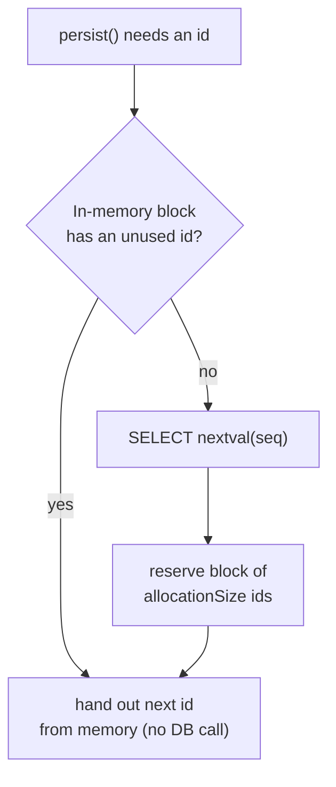
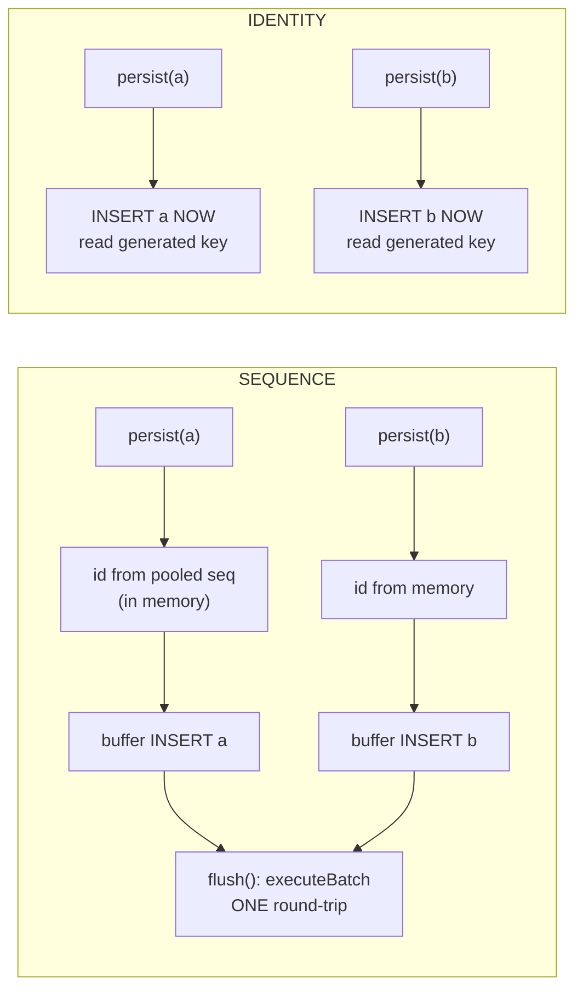

# Primary Keys & ID Generation Strategies

Every JPA entity must have an identifier — the mapping to the table's primary key. How
that identifier is produced (by the database, by a sequence, by the application, or as a
UUID) has outsized consequences for **insert batching, write throughput, index locality,
and the correctness of `equals`/`hashCode`**. This topic is where a senior candidate
distinguishes themselves: the "right" strategy is almost never IDENTITY, and knowing *why*
requires understanding what Hibernate does on `persist()` and on `flush()`.

Grounded in **Jakarta Persistence 3.1/3.2** (`jakarta.persistence.*`) and **Hibernate ORM
6.x/7.x**. The relational-side mechanics of B-tree page splits, primary-key index design,
and auto-increment internals are owned by **messaging-databases** — see
`messaging-databases/indexing-b-tree-lsm` and `messaging-databases/key-design`. Here we
teach how JPA/Hibernate *chooses and populates* the key.

---

## Surrogate vs Natural Keys

A **natural key** is a column that already has business meaning and is guaranteed unique —
an ISBN, an email, a country ISO code. A **surrogate key** is a synthetic, meaningless
value (an auto-increment `BIGINT` or a UUID) that exists only to identify the row.

| Aspect | Natural key | Surrogate key |
|---|---|---|
| Business meaning | Yes | None |
| Stability | Can change (email, SSN reformatting) | Never changes |
| Width / FK cost | Often wide (strings, composites) | Narrow (`BIGINT` = 8 bytes) |
| JPA mapping | `@Id` on the business field (assigned) | `@Id @GeneratedValue` |
| Refactoring risk | High — a "unique" field often isn't forever | Low |

> [!KEY-TAKEAWAY]
> Prefer a **surrogate key** as the primary key for almost all entities, and enforce the
> natural key separately with a `@NaturalId` or a plain unique constraint
> (`@Column(unique = true)`). Natural keys make terrible primary keys because "immutable
> and unique forever" is a promise the business almost always breaks, and every foreign key
> then carries the wide value.

The cost of natural keys compounds: a composite natural key propagates into every child
table's foreign key and every join. Surrogate keys keep FKs narrow and joins cheap. The
trade-off is you usually still need a unique constraint on the natural key for data
integrity, so you maintain both.

---

## GeneratedValue Strategies Overview

`@Id` marks the identifier field. `@GeneratedValue` tells the provider to populate it
automatically instead of you assigning it. The `strategy` element takes a
`jakarta.persistence.GenerationType`:

```java
@Entity
public class Book {
    @Id
    @GeneratedValue(strategy = GenerationType.SEQUENCE, generator = "book_seq")
    @SequenceGenerator(name = "book_seq", sequenceName = "book_seq", allocationSize = 50)
    private Long id;
    // ...
}
```

The four standard strategies:

| Strategy | Mechanism | Value known | Batch inserts | Portable |
|---|---|---|---|---|
| `IDENTITY` | DB identity / auto-increment column | **After** INSERT | **No** (disabled) | Yes |
| `SEQUENCE` | DB sequence object | **Before** INSERT | Yes | Needs sequence support |
| `TABLE` | A table row emulating a sequence | Before INSERT | Yes | Yes (but slow) |
| `AUTO` | Provider picks | Depends | Depends | Yes |
| `UUID` (3.1+) | Provider generates a UUID | Before INSERT | Yes | Yes |

> [!KEY-TAKEAWAY]
> The headline mechanism: with `SEQUENCE`/`TABLE`/`UUID` Hibernate knows the id **before**
> the row is inserted, so it can hold the INSERT in the persistence context and batch many
> together at flush. With `IDENTITY` the id only exists **after** the INSERT executes, so
> Hibernate must fire each INSERT immediately and JDBC batching is impossible.

If you omit `@GeneratedValue` entirely, the id is **assigned** — you must set it yourself
before `persist()`, or Hibernate throws `IdentifierGenerationException`.

---

## IDENTITY Strategy

`GenerationType.IDENTITY` maps to a database identity/auto-increment column:
`AUTO_INCREMENT` (MySQL), `SERIAL`/`GENERATED ... AS IDENTITY` (PostgreSQL),
`IDENTITY` (SQL Server). The database assigns the value as part of the INSERT, and
Hibernate reads it back via JDBC `Statement.getGeneratedKeys()`.

```java
@Id
@GeneratedValue(strategy = GenerationType.IDENTITY)
private Long id;
```

```sql
insert into book (title) values (?)   -- id column omitted; DB assigns it
-- Hibernate then reads generated keys to populate book.id
```

**The critical mechanism:** because the identifier is unknown until the row physically
exists, Hibernate **cannot delay the INSERT to flush time**. On `entityManager.persist()`
it must execute the INSERT *immediately* to obtain the id (the id is the key of the
first-level cache / persistence context, so an entity without an id cannot be managed).
This has two consequences:

1. **JDBC batch inserts are disabled** for `IDENTITY` entities even if you set
   `hibernate.jdbc.batch_size`. Each `persist()` is its own round-trip. Inserting 1,000
   rows = 1,000 INSERT statements. (See "Why IDENTITY Disables JDBC Batch Inserts".)
2. **`persist()` is no longer a purely in-memory operation** — it hits the DB early, which
   can subtly change transaction/flush behavior.

> [!WARNING]
> IDENTITY is the most commonly used strategy (it is MySQL's natural fit and what tutorials
> reach for) but it is the *worst* for write-heavy workloads because it kills insert
> batching. On PostgreSQL/Oracle, prefer SEQUENCE. On MySQL 8, an identity column is often
> unavoidable, but be aware of the batching cost.

---

## SEQUENCE Strategy

`GenerationType.SEQUENCE` uses a database **sequence** object — an independent, atomic
counter (`CREATE SEQUENCE book_seq`). Because the sequence is queried *before* the row is
inserted, Hibernate learns the id up front and can keep the INSERT buffered until flush.

```java
@Id
@GeneratedValue(strategy = GenerationType.SEQUENCE, generator = "book_seq")
@SequenceGenerator(name = "book_seq", sequenceName = "book_seq", allocationSize = 50)
private Long id;
```

```sql
select nextval('book_seq')            -- get id up front (may be pooled, see below)
insert into book (title, id) values (?, ?)
insert into book (title, id) values (?, ?)   -- these can be batched
```

> [!KEY-TAKEAWAY]
> SEQUENCE is the **default and preferred** strategy for most databases. It supports JDBC
> batching *and* the pooled/hi-lo optimizers, which amortize the `nextval` round-trip
> across many inserts. PostgreSQL, Oracle, H2, DB2, and SQL Server all support sequences.

**MySQL caveat:** MySQL has no `SEQUENCE` object (even in 8.x). If you request SEQUENCE on
MySQL, Hibernate emulates it with a table (see TABLE strategy) — so on MySQL, IDENTITY vs a
table-backed sequence is the real choice.

In **Hibernate 6+**, if you use SEQUENCE (or AUTO) *without* naming a `@SequenceGenerator`,
the default sequence name changed: each entity gets its own `<entity>_seq` (via the
implicit naming strategy) instead of the single shared `hibernate_sequence` used in
Hibernate 5. This is a common migration surprise.

---

## TABLE Strategy

`GenerationType.TABLE` emulates a sequence using a regular table, one row per generator,
whose value column holds the next id.

```java
@Id
@GeneratedValue(strategy = GenerationType.TABLE, generator = "book_table_gen")
@TableGenerator(name = "book_table_gen", table = "id_gen",
                pkColumnName = "gen_name", valueColumnName = "gen_val",
                pkColumnValue = "book_id", allocationSize = 50)
private Long id;
```

To allocate an id block, Hibernate must run `SELECT ... FOR UPDATE` and then `UPDATE` the
row — a **row-level lock** on the generator row for the duration:

```sql
select gen_val from id_gen where gen_name = 'book_id' for update
update id_gen set gen_val = ? where gen_name = 'book_id' and gen_val = ?
```

> [!WARNING]
> TABLE is portable to any database (no sequence support required) but is **slow and a
> contention hotspot**: the `SELECT ... FOR UPDATE` serializes id allocation across all
> transactions inserting that entity, and it runs in a separate transaction/connection to
> avoid holding the lock. Avoid TABLE unless you truly cannot use a sequence. A large
> `allocationSize` mitigates but does not eliminate the contention.

---

## AUTO Strategy

`GenerationType.AUTO` (the default when you write `@GeneratedValue` with no `strategy`)
delegates the choice to the provider based on the SQL dialect.

In **Hibernate 6/7**, `AUTO` behavior changed from earlier versions:

- For a **numeric** id, `AUTO` resolves to `SequenceStyleGenerator` — a real sequence if
  the dialect supports one, otherwise a **table-backed** sequence emulation. (In Hibernate
  5 the mapping was more dialect-dependent and MySQL often ended up on IDENTITY-like or a
  shared `hibernate_sequence`.)
- For a **`UUID`-typed** id, `AUTO` resolves to UUID generation (equivalent to
  `GenerationType.UUID`).

> [!WARNING]
> Because `AUTO` prefers a sequence/table-sequence, on MySQL it will create a
> **table-backed sequence** rather than use `AUTO_INCREMENT`. Teams migrating to Hibernate
> 6 sometimes see an unexpected `<entity>_seq` table appear. If you specifically want
> auto-increment on MySQL, ask for `IDENTITY` explicitly rather than relying on `AUTO`.

Being explicit (`SEQUENCE` on Postgres/Oracle, `IDENTITY` on MySQL) is generally clearer
than `AUTO` for production code, precisely because `AUTO`'s meaning shifts across versions
and dialects.

---

## SequenceGenerator and TableGenerator Configuration

`@SequenceGenerator` and `@TableGenerator` define a *named* generator that
`@GeneratedValue(generator = "...")` refers to. The `generator` name and the `name` element
must match.

**`@SequenceGenerator` key elements:**

| Element | Meaning | Default |
|---|---|---|
| `name` | Logical name referenced by `@GeneratedValue` | — (required) |
| `sequenceName` | Actual DB sequence object name | provider-specific |
| `allocationSize` | Ids fetched per `nextval` (pool size) | **50** |
| `initialValue` | Starting value | 1 |

**`@TableGenerator` key elements:** `table`, `pkColumnName`, `valueColumnName`,
`pkColumnValue` (which row identifies this generator), `allocationSize`, `initialValue`.

> [!WARNING]
> `allocationSize` **must match** the sequence's actual `INCREMENT BY` when using the
> pooled optimizer. If Hibernate thinks `allocationSize = 50` but the DB sequence is
> declared `INCREMENT BY 1`, the pooled optimizer will hand out ids that collide with
> other allocations. Hibernate generates the DDL to match when it creates the sequence,
> but if the sequence already exists (production DB, Flyway/Liquibase), you must keep them
> in sync yourself. See `messaging-databases/schema-migrations` for migration ownership.

You can share one generator across entities, or (idiomatically) give each entity its own
sequence. Per-entity sequences reduce cross-entity contention and make the schema clearer.

---

## allocationSize and the Pooled Optimizers

A naive sequence generator calls `nextval` once per insert — one network round-trip per
row. An **optimizer** amortizes that: fetch a *block* of N ids in one call and hand them out
from memory. `allocationSize` is the block size (default **50**). This is the single
biggest reason SEQUENCE outperforms IDENTITY at scale.

Hibernate has three main optimizer styles:

| Optimizer | How it interprets the sequence value | Interoperable with other apps / manual inserts |
|---|---|---|
| **hi-lo** (legacy) | `nextval` returns a "hi" value; ids = `hi * allocationSize + lo`, lo in memory | **No** — other writers to the table collide |
| **pooled** | `nextval` returns the **top** of the current block; ids counted downward within it | **Yes** |
| **pooled-lo** | `nextval` returns the **bottom** (lo) of the block; ids counted upward | **Yes** |



> [!KEY-TAKEAWAY]
> The **hi-lo** optimizer is fast but *not interoperable*: it assumes it owns the whole id
> space, so a second application (or a manual `INSERT`) writing to the same table will
> generate colliding ids. **pooled** and **pooled-lo** store the real boundary value in the
> sequence itself, so external writers using the same sequence stay consistent. Modern
> Hibernate defaults to **pooled** (well, `pooled` since Hibernate 5+ when `allocationSize
> > 1`). Prefer pooled/pooled-lo; avoid the legacy hi-lo.

**Trade-off of a large `allocationSize`:** fewer round-trips (good) but **gaps** in the id
sequence on restart or rollback (each JVM/session holds an unused block that is discarded).
Gaps are cosmetic — ids need not be contiguous — but surprise people who expect 1,2,3,...
A value of 50 balances round-trip savings against gap size for most apps.

---

## Why IDENTITY Disables JDBC Batch Inserts

This is a classic senior interview question. **JDBC batching** groups many INSERTs into one
network round-trip via `PreparedStatement.addBatch()` / `executeBatch()`, controlled by
`hibernate.jdbc.batch_size`. It dramatically speeds up bulk writes.

To batch, Hibernate must **buffer** pending INSERTs and flush them together. It can only
buffer an entity if that entity is fully managed — and to be managed it needs its
identifier, because the id is the **key into the first-level cache (persistence context)**.



With **SEQUENCE/TABLE/UUID**, the id is available before insert → Hibernate buffers and
`executeBatch()`es at flush. With **IDENTITY**, the id does not exist until the INSERT runs,
so Hibernate is forced to execute each INSERT immediately on `persist()` to read back
`getGeneratedKeys()`. There is nothing to batch.

> [!INTERVIEW]
> "You're bulk-inserting 100,000 rows through Hibernate and it's slow even with
> `batch_size=50`. What's wrong?" — The entity almost certainly uses `GenerationType.IDENTITY`,
> which silently disables batching. Switch to `SEQUENCE` with a pooled optimizer (and
> consider `order_inserts`/`order_updates` and periodic `flush()`+`clear()` to bound the
> persistence context). This single change often yields an order-of-magnitude speedup.

---

## UUID Generation

UUIDs let the **application** generate a globally unique id without a DB round-trip — useful
for distributed systems, offline creation, and merging data across shards. The id is known
before insert, so batching works.

**Jakarta Persistence 3.1** standardized UUID generation with a new enum value:

```java
@Id
@GeneratedValue(strategy = GenerationType.UUID)   // JPA 3.1+
private UUID id;                                   // or String
```

Hibernate also offers a richer, portable annotation, `@UuidGenerator`:

```java
@Id
@GeneratedValue
@UuidGenerator(style = UuidGenerator.Style.TIME)   // time-ordered
private UUID id;
```

`UuidGenerator.Style`:

| Style | Produces | Notes |
|---|---|---|
| `RANDOM` (default) | UUID **v4** (random) | Poor index locality |
| `TIME` | Time-based UUID (ordered) | Better index locality |
| `AUTO` | Chooses based on member type | — |

**v4 (random) vs v7 (time-ordered) — the index-locality problem:**

| | UUIDv4 (random) | UUIDv7 (time-ordered) |
|---|---|---|
| First bits | Random | Unix-millis timestamp |
| Insert position in PK B-tree | Scattered | Monotonic (append to right edge) |
| Page splits / write amplification | High | Low |
| Fragmentation, buffer-pool churn | Worse | Better |

> [!KEY-TAKEAWAY]
> A random **UUIDv4** primary key inserts into random spots in the clustered/PK B-tree,
> causing page splits, fragmentation, and cache-miss-heavy writes. **UUIDv7** (or
> Hibernate's `Style.TIME`) embeds a timestamp prefix so new rows land at the "right edge"
> of the index like an auto-increment — restoring good insert locality while keeping the
> distributed-generation benefit. The relational B-tree mechanics behind this belong to
> `messaging-databases/indexing-b-tree-lsm`; here the takeaway is *pick an ordered UUID*.

Trade-offs of UUID keys generally: 16 bytes vs 8 for `BIGINT` (wider FKs and indexes),
harder to read/type, and (for v4) index bloat. Store as `uuid`/`binary(16)`, not
`varchar(36)`, to avoid tripling the storage.

---

## Composite Keys Preview

Sometimes the primary key spans multiple columns (a join table, a legacy natural composite).
JPA offers two mechanisms, covered in depth in
`hibernate-jpa/inheritance-embeddables-composite-keys`:

- **`@EmbeddedId`** — a single `@Embeddable` id class field.
- **`@IdClass`** — multiple `@Id` fields plus a separate id class.

```java
@Embeddable
public record OrderLineId(Long orderId, Long productId) {}

@Entity
public class OrderLine {
    @EmbeddedId
    private OrderLineId id;
}
```

> [!WARNING]
> Composite keys **cannot use `@GeneratedValue`** — the components are assigned, typically
> derived from the parent rows. A composite id class must implement `equals`/`hashCode`
> correctly (it *is* the identity). Prefer a surrogate `@Id` on the join entity when you
> can, and enforce the pair with a unique constraint. Full mechanics live in the composite
> keys topic.

---

## Equals and hashCode with Generated Ids

Entities live in `Set`s and are used as `Map` keys, and the persistence context tracks them
across state transitions. This exposes a subtle bug with generated ids: **the id is `null`
before `persist()` and gets assigned after**, so an id-based `hashCode` *changes while the
object is in a collection*.

```java
Set<Book> shelf = new HashSet<>();
Book b = new Book("Dune");   // id == null
shelf.add(b);                // bucketed by hashCode(null)
entityManager.persist(b);    // id := 42  -> hashCode changes!
shelf.contains(b);           // may return FALSE — wrong bucket
```

This is the **"assigned-after-persist" problem**. There are three defensible approaches:

1. **Assign the id in the constructor** (application-assigned UUID). The id is stable from
   birth, so id-based `equals`/`hashCode` is safe and simple. This is a strong argument for
   UUID keys.
2. **Use a stable business/natural key** in `equals`/`hashCode` (an immutable one, e.g.
   an ISBN), independent of the surrogate id.
3. **The "id in equals, constant hashCode" pattern** (Vlad Mihalcea): `equals` compares the
   id *only when non-null* (and requires same class), while `hashCode` returns a **constant**
   (or `getClass().hashCode()`) so it never changes:

```java
@Override
public boolean equals(Object o) {
    if (this == o) return true;
    if (!(o instanceof Book other)) return false;
    return id != null && id.equals(other.id);
}
@Override
public int hashCode() {
    return getClass().hashCode();   // constant -> stable across id assignment
}
```

> [!WARNING]
> **Never** auto-generate `equals`/`hashCode` from *all* fields on a JPA entity (Lombok
> `@Data`, IDE "use all fields"). It pulls lazy associations (triggering
> `LazyInitializationException` or extra queries — see
> `hibernate-jpa/fetching-lazy-eager-n-plus-one`), and mutable fields break the
> `Set`/`Map` contract. Also avoid `@EqualsAndHashCode` defaults on entities.

> [!KEY-TAKEAWAY]
> The safest, simplest identity model is an **application-assigned UUID** set at
> construction: `equals`/`hashCode` on that id are stable from creation through persistence.
> If you must use a DB-generated numeric id, use the constant-`hashCode` + null-guarded-`equals`
> pattern. Never base `hashCode` on a value that changes after `persist()`.

---

## ID Generation Strategy Comparison

| Strategy | Round-trips per insert | Batchable | Best for | Avoid when |
|---|---|---|---|---|
| `IDENTITY` | 1 (immediate) | **No** | Simple apps on MySQL; low write volume | Bulk/high-throughput inserts |
| `SEQUENCE` + pooled | ~1 per `allocationSize` inserts | Yes | **Default**: Postgres/Oracle/H2/SQL Server | DB has no sequences (MySQL) |
| `TABLE` | 2+ (SELECT FOR UPDATE + UPDATE) | Yes | Last resort for portability | Any time a sequence exists |
| `AUTO` | Depends (HB6: sequence/table-seq) | Depends | Prototypes; portable defaults | You need predictable prod behavior |
| `UUID` (v7 / `Style.TIME`) | 0 (client-side) | Yes | Distributed / offline / sharded id creation | Storage width matters and reads dominate |

> [!INTERVIEW]
> A crisp decision tree for the interview: **Postgres/Oracle → SEQUENCE (pooled).
> MySQL → IDENTITY (accept the batching cost) or a table-backed sequence if you need
> batching. Distributed id creation → UUIDv7 / `@UuidGenerator(style = TIME)`. Never
> reach for TABLE unless portability forces it, and never rely on `AUTO` for production
> semantics.**

---

## Common Interview Follow-ups

- **"Why is `IDENTITY` bad for batch inserts?"** — The id is only known after the INSERT
  runs (`getGeneratedKeys`), so Hibernate must execute each INSERT immediately on
  `persist()` to obtain the id (the id keys the persistence context). Nothing can be
  buffered, so JDBC batching is disabled regardless of `batch_size`.
- **"What does `allocationSize` do and what's the risk of a big value?"** — It's the block
  of ids fetched per `nextval` by the pooled optimizer (default 50). Bigger = fewer
  round-trips but larger id gaps on restart/rollback. It must match the sequence's
  `INCREMENT BY`.
- **"hi-lo vs pooled?"** — hi-lo is legacy and *not interoperable* with other writers to the
  table; pooled/pooled-lo persist the true boundary in the sequence so external inserts stay
  consistent. Use pooled.
- **"What changed about `AUTO` / default sequences in Hibernate 6?"** — `AUTO` prefers a
  `SequenceStyleGenerator` (real sequence or table-backed emulation), and the default
  sequence is now per-entity `<entity>_seq` instead of the shared `hibernate_sequence`.
- **"UUIDv4 vs v7 for a primary key?"** — v4 is random → scattered B-tree inserts, page
  splits, fragmentation. v7 is time-ordered → monotonic inserts, good locality. Prefer v7 /
  `@UuidGenerator(style = TIME)` and store as binary(16)/uuid.
- **"Why not put the entity's id in `hashCode`?"** — Because it's `null` before `persist()`
  and assigned after, so the hash changes while the object sits in a `HashSet`/`Map`,
  breaking `contains`. Use a constant `hashCode` or an app-assigned id.
- **"Can I use `@GeneratedValue` on a composite key?"** — No; composite key components are
  assigned. Prefer a surrogate key + unique constraint. (See composite keys topic.)
- **"MySQL and SEQUENCE?"** — MySQL has no sequence objects; Hibernate emulates with a
  table, so it's effectively TABLE. The real MySQL choice is IDENTITY vs table-backed seq.

## References

- Jakarta Persistence 3.1 / 3.2 Specification — `@Id`, `@GeneratedValue`, `GenerationType`
  (incl. `UUID`), `@SequenceGenerator`, `@TableGenerator` (`jakarta.persistence.*`).
- Hibernate ORM 6/7 User Guide — Identifiers chapter: identity, sequence, table generators;
  optimizers (hi-lo, pooled, pooled-lo); `@UuidGenerator` and `Style`.
- Hibernate `SequenceStyleGenerator` and implicit sequence naming (`<entity>_seq`).
- Vlad Mihalcea — "How to implement `equals`/`hashCode` for JPA entities" and
  "Hibernate identity, sequence and table (pooled) generators".
- Cross-references: `messaging-databases/indexing-b-tree-lsm` (B-tree page splits, index
  locality), `messaging-databases/key-design` (UUID vs auto-increment key design),
  `hibernate-jpa/inheritance-embeddables-composite-keys` (composite keys),
  `hibernate-jpa/fetching-lazy-eager-n-plus-one` (lazy pitfalls in equals/hashCode),
  `hibernate-jpa/performance-tuning-pitfalls` (batch tuning: `order_inserts`, flush/clear).
