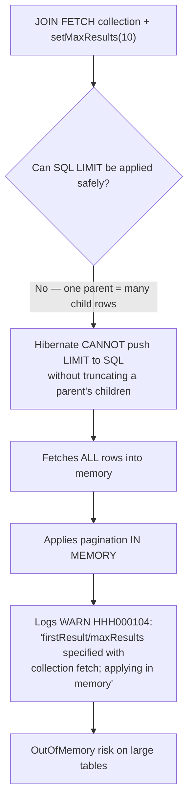

# Querying: JPQL, HQL, Criteria API & Native SQL

JPA and Hibernate give you four ways to ask the database for data, and a senior
interview probes whether you know *which to reach for, why, and what SQL each one
generates*. This page covers **JPQL** (the portable, object-oriented query language),
**HQL** (Hibernate's superset), the **Criteria API** (type-safe programmatic queries),
and **native SQL** (raw queries with result mapping) — plus the cross-cutting concerns
that trip people up: parameter binding, pagination, projections, `JOIN FETCH`, and
bulk update/delete.

> [!INTERVIEW]
> The one-liner that signals seniority: "JPQL and Criteria query the **entity model**
> — classes and fields — and Hibernate translates them to SQL against the mapped
> tables; native SQL queries the **database directly** and gives up portability and
> automatic dirty-tracking of scalar results." Everything else (N+1, pagination traps,
> bulk-DML cache invalidation) flows from understanding that boundary.

The raw SQL itself — join algorithms, index usage, execution plans, isolation — lives
in `messaging-databases` (see `messaging-databases/sql-joins`,
`messaging-databases/indexing`, `messaging-databases/transactions-isolation`). Here we
stay at the ORM altitude: what Hibernate *generates* and *why*. Query-injection
security is expanded in the security domain; here we cover the JPA-specific rule (always
bind parameters). The Spring Data repository layer (`@Query`, derived queries,
`Pageable`, projections) is owned by `hibernate-jpa/spring-data-jpa-repositories` — this
page teaches the underlying JPA query mechanics it delegates to.

## JPQL: Querying Objects, Not Tables

**JPQL** (Jakarta Persistence Query Language) is a SQL-like, **portable** query language
defined by the Jakarta Persistence spec. Its defining characteristic: it operates on the
**entity model**, not the database schema. You name **entity classes** and their
**fields/associations**, never tables and columns.

```java
// JPQL: 'Author' is the entity class, 'a.books' navigates the mapped association,
// 'a.name' is a persistent field. No table or column names appear.
List<Author> authors = em.createQuery(
        "SELECT a FROM Author a JOIN a.books b WHERE b.price > :min", Author.class)
    .setParameter("min", new BigDecimal("20"))
    .getResultList();
```

Hibernate parses this into its **Semantic Query Model (SQM)** — an **abstract syntax tree
(AST)**, i.e. a structured, in-memory tree representation of the query, expressed in terms
of the entity model rather than tables — and then translates SQM to SQL for the configured
dialect:

```sql
select a.id, a.name, a.version
from author a
join book b on b.author_id = a.id
where b.price > ?
```

Key JPQL facts interviewers check:

- **Entity and field names are case-sensitive**; JPQL keywords (`SELECT`, `FROM`,
  `WHERE`) are not.
- `SELECT a FROM Author a` returns **managed entities** — they go into the persistence
  context and are dirty-checked. (See
  `hibernate-jpa/session-entitymanager-persistence-context`.)
- **Implicit joins** via path navigation: `WHERE b.author.name = :n` silently generates
  a SQL join.
- JPQL defines **no `INSERT` statement at all** — its only bulk-DML statements are
  `UPDATE` and `DELETE`. (`INSERT` is a Hibernate HQL extension; see below.) There is no
  direct table access either — that is by design for portability.
- Polymorphism is built in: `SELECT p FROM Payment p` returns all subclasses of a mapped
  `Payment` hierarchy.

> [!KEY-TAKEAWAY]
> JPQL is portable because it targets the *object model*. The provider owns the
> object→SQL translation, so the same JPQL runs on PostgreSQL, Oracle, or MySQL — the
> generated SQL differs per dialect, your query does not.

## HQL: Hibernate's Superset of JPQL

**HQL** (Hibernate Query Language) is Hibernate's native query language. In modern
Hibernate (6/7) JPQL and HQL share the same SQM-based parser, so **HQL is a strict
superset of JPQL**: every valid JPQL query is valid HQL, but HQL adds features the spec
does not require. Interview-relevant extras:

- **`INSERT`** statements entirely — both `INSERT ... SELECT` and (Hibernate 6.1+)
  `INSERT ... VALUES` with literal rows. Standard JPQL has no `INSERT` at all, so any
  JPQL-level insert is really an HQL extension.
- Richer functions and operators, e.g. `str()`, extended date/time functions, and in
  Hibernate 6+ many standard SQL functions exposed portably.
- **Implicit and explicit polymorphism** on non-mapped superclasses/interfaces (query
  `FROM java.lang.Object` — rarely used, but legal).
- **`WITH`** clause for extra join conditions (`JOIN a.books b WITH b.price > 10`) — JPQL
  uses `ON` for the same purpose (`ON` was added to JPQL in later versions).
- Set operations, tuple constructors, and other conveniences.

You obtain HQL through the Hibernate `Session`:

```java
Session session = em.unwrap(Session.class);
List<Author> authors = session.createQuery(
        "from Author a where a.name like :p", Author.class)   // 'from' without 'select' is HQL-friendly
    .setParameter("p", "A%")
    .list();
```

> [!TIP]
> **Prefer JPQL unless you specifically need an HQL feature.** Sticking to JPQL keeps
> you provider-portable and keeps the query valid against the spec. Reach for HQL only
> for `INSERT ... VALUES`, `WITH`, or Hibernate-specific functions — and document why.

## The Criteria API & the JPA Metamodel

The **Criteria API** (`jakarta.persistence.criteria.*`) builds queries **programmatically
and type-safely** as a tree of Java objects instead of a string. It shines for **dynamic
queries** — where the set of filters/sorts is unknown until runtime (search screens with
optional filters) — because you conditionally append predicates instead of concatenating
strings.

```java
CriteriaBuilder cb = em.getCriteriaBuilder();
CriteriaQuery<Author> cq = cb.createQuery(Author.class);
Root<Author> author = cq.from(Author.class);

List<Predicate> filters = new ArrayList<>();   // row filters -> WHERE
if (name != null) {
    filters.add(cb.like(author.get(Author_.name), name + "%"));  // metamodel: Author_.name
}
cq.select(author).where(cb.and(filters.toArray(new Predicate[0])));

if (minBooks != null) {
    // An aggregate (COUNT) is illegal in WHERE — it belongs in HAVING with a GROUP BY.
    Join<Author, Book> b = author.join(Author_.books);
    cq.groupBy(author);
    cq.having(cb.gt(cb.count(b), minBooks));
}

List<Author> result = em.createQuery(cq).getResultList();
```

**The JPA metamodel** is the `_` (underscore) suffixed classes — `Author_`,
`Author_.name` — generated at compile time by an annotation processor (Hibernate's
`hibernate-jpamodelgen`). Referencing `Author_.name` instead of the string `"name"` is
what makes Criteria **type-safe**: rename the `name` field and the code fails to compile
rather than blowing up at runtime. (You *can* use string attribute names —
`author.get("name")` — but you lose the type safety, so it is discouraged.)

| | JPQL/HQL string | Criteria API |
|---|---|---|
| Form | Text query | Java object tree |
| Type safety | None (string) | Type-safe with metamodel |
| Readability | High for static queries | Verbose, harder to read |
| Best for | Fixed queries | **Dynamic** queries (optional filters) |
| Refactor-safe | No | Yes (compile-time errors) |
| Injection risk | Only if you concatenate | None (always parameterized) |

> [!WARNING]
> Criteria is **verbose** — do not use it for static queries where a one-line JPQL string
> would do. Its sweet spot is dynamic query building. For anything static, JPQL/named
> queries read better and are easier to maintain.

## Native SQL Queries & Result Mapping

When you need database-specific SQL — vendor functions, hints, complex analytics,
recursive CTEs, or a hand-tuned query the ORM can't express — use a **native query**.

```java
// JPA
List<Author> authors = em.createNativeQuery(
        "SELECT * FROM author WHERE name LIKE ?1", Author.class)  // map to entity
    .setParameter(1, "A%")
    .getResultList();
```

Native queries can return:

1. **Entities** — pass the entity class; the columns must map to the entity's fields.
   Result rows become **managed** entities in the persistence context.
2. **Scalars** — omit the class; you get `Object[]` (or `Object` for one column). These
   are **not managed** — they are plain values.
3. **Mapped results** via **`@SqlResultSetMapping`** — for complex shapes (multiple
   entities per row, entities + scalars, DTOs via `@ConstructorResult`):

```java
@SqlResultSetMapping(
    name = "AuthorBookCount",
    classes = @ConstructorResult(
        targetClass = AuthorSummary.class,
        columns = {
            @ColumnResult(name = "name", type = String.class),
            @ColumnResult(name = "book_count", type = Long.class)
        }))
@NamedNativeQuery(
    name = "Author.summaries",
    query = "SELECT a.name AS name, count(b.id) AS book_count " +
            "FROM author a LEFT JOIN book b ON b.author_id = a.id GROUP BY a.name",
    resultSetMapping = "AuthorBookCount")
```

Trade-offs of native SQL:

- **Loses portability** — you're now tied to a dialect.
- **Bypasses SQM** — Hibernate does not understand the query semantically; it can't apply
  the same optimizations and it doesn't auto-add discriminator/version columns for you.
- **Cache & flush caveats:** by default a native query does **not** know which entities it
  touches, so Hibernate may **flush the entire persistence context** before running it
  (to keep the DB consistent) and may not auto-invalidate the second-level cache for
  affected tables unless you tell it (`addSynchronizedEntityClass` /
  `@NamedNativeQuery(... )` synchronization). See `hibernate-jpa/caching-first-second-level`.

> [!TIP]
> Prefer JPQL/HQL first; drop to native SQL only when the query genuinely can't be
> expressed portably. When you do, map results to a DTO with `@ConstructorResult` rather
> than dragging back managed entities you'll never modify.

## Named Queries (@NamedQuery & @NamedNativeQuery)

A **named query** is a query defined once (by name) and referenced everywhere else.
`@NamedQuery` holds JPQL/HQL; `@NamedNativeQuery` holds native SQL.

```java
@Entity
@NamedQuery(
    name = "Author.byName",
    query = "SELECT a FROM Author a WHERE a.name = :name")
class Author { /* ... */ }

// usage
List<Author> a = em.createNamedQuery("Author.byName", Author.class)
    .setParameter("name", "Ada")
    .getResultList();
```

The senior-level advantage: **named JPQL queries are parsed and validated at startup**
(when the persistence unit is built), not on first execution. A syntax error or a
reference to a non-existent field fails **fast at boot**, not at 3 a.m. in production.
They can also be **precompiled/cached** by the provider, saving per-call parse cost.

> [!KEY-TAKEAWAY]
> Named JPQL queries = **fail-fast validation at startup** + reuse + one place to change.
> Named *native* queries are validated as strings only (Hibernate can't semantically check
> raw SQL against the model), so their startup check is weaker.

## Parameter Binding: Named vs Positional (and Injection)

There are exactly two legitimate ways to pass values into a query — and **string
concatenation is never one of them.**

| Style | Syntax | Bind call |
|---|---|---|
| **Named** | `:name` | `.setParameter("name", value)` |
| **Positional** | `?1`, `?2` (1-based) | `.setParameter(1, value)` |

```java
// Named — preferred: self-documenting, reusable, order-independent
em.createQuery("SELECT a FROM Author a WHERE a.name = :n AND a.active = :act", Author.class)
  .setParameter("n", name)
  .setParameter("act", true);
```

> [!WARNING]
> **NEVER concatenate user input into a query string** — that is textbook
> **JPQL/SQL injection**. `"... WHERE a.name = '" + userInput + "'"` lets an attacker
> break out of the literal. Bound parameters are sent to the DB **separately** from the
> query text, so they can never be interpreted as query syntax. This holds for JPQL,
> HQL, and native SQL alike. (Deep dive in the security domain.)

Mechanism bonus: bound parameters also let the DB **reuse the prepared-statement plan
cache** (same SQL text, different bind values), which concatenation defeats. Positional
JPQL parameters are **1-based** (`?1`) — a classic gotcha for people used to 0-based
indexing.

## Projections: Scalar, Constructor Expressions, Tuple & Interface

Fetching whole entities when you only need a few columns is wasteful (and for read-only
data, pollutes the persistence context with dirty-check overhead). **Projections** return
just what you need.

- **Scalar / multi-column:** `SELECT a.name, a.email FROM Author a` returns
  `List<Object[]>` (or `List<Tuple>` if you ask for `Tuple.class`). Untyped, but cheap.
- **Constructor expression (DTO):** the interview favorite —

  ```java
  // AuthorDto must have a matching constructor. Fully-qualified class name required.
  List<AuthorDto> dtos = em.createQuery(
      "SELECT new com.example.AuthorDto(a.name, a.email) FROM Author a", AuthorDto.class)
      .getResultList();
  ```

  This returns plain **unmanaged DTOs** — no persistence-context overhead, no dirty
  checking, exactly the columns in the constructor. In Hibernate 6.1+ you can even
  skip the `new` and use `SELECT a.name, a.email ...` with `.getResultList()` typed to
  the DTO in some setups, but the constructor expression is the portable classic.
- **`Tuple`:** `em.createQuery(jpql, Tuple.class)` — access by alias (`t.get("name")`)
  or index; a typed alternative to `Object[]`.
- **Interface / class projections (Spring Data):** define an interface with getters and
  Spring Data JPA builds the projection for you — see
  `hibernate-jpa/spring-data-jpa-repositories`.

> [!TIP]
> For read-only screens and reports, project into a **DTO**. It's faster (less data,
> fewer columns, no entity hydration) and safer (unmanaged, so no accidental dirty-check
> writes). This is one of the highest-leverage performance habits in JPA.

Beware: you can only put **scalars/paths** in a constructor expression, not a collection
association — `SELECT new Dto(a.books)` is illegal.

## Fetching in Queries: JOIN FETCH vs Entity Graphs

A plain JPQL join **does not initialize** the associated collection — it only affects the
`WHERE`/filtering. To *load* an association in the same query (and avoid N+1), use
**`JOIN FETCH`**:

```java
// Loads authors AND their books in ONE query — no N+1
List<Author> authors = em.createQuery(
    "SELECT DISTINCT a FROM Author a JOIN FETCH a.books", Author.class)
    .getResultList();
```

```sql
select distinct a.*, b.*
from author a
join book b on b.author_id = a.id
```

Contrast with a plain `JOIN a.books` (no `FETCH`): the collection stays lazy, so touching
`author.getBooks()` for each of N authors fires N extra selects — the **N+1 problem** (owned
by `hibernate-jpa/fetching-lazy-eager-n-plus-one`). `JOIN FETCH` collapses that to one.

- Use **`DISTINCT`** with a to-many `JOIN FETCH` to de-duplicate parent rows (the SQL join
  produces one row per child). In Hibernate 6+ `DISTINCT` is automatically applied in-memory
  for entity queries and *not* pushed to SQL unnecessarily; historically
  `hibernate.query.passDistinctThrough=false` controlled that.
- **`@EntityGraph`** (JPA) achieves the same fetch declaratively without changing the query
  text — attach a fetch graph to `find()` or a query via a hint. Great with Spring Data
  (`@EntityGraph` on a repository method).

> [!WARNING]
> **You cannot `JOIN FETCH` two collection associations at once** (e.g.
> `JOIN FETCH a.books JOIN FETCH a.awards`) — that produces a **Cartesian product**
> (`MultipleBagFetchException` if they're `List`/bags). Fetch one collection per query;
> use batch fetching or separate queries for the rest.

## Pagination & the JOIN-FETCH-Collection Trap (HHH000104)

Pagination uses two `Query` methods:

- **`setFirstResult(int)`** — the offset (0-based) of the first row to return.
- **`setMaxResults(int)`** — the maximum number of rows.

Hibernate translates these into dialect-specific SQL (`LIMIT/OFFSET`, `FETCH FIRST ... ROWS`,
Oracle `ROWNUM`/`OFFSET`, etc.).

```java
em.createQuery("SELECT a FROM Author a ORDER BY a.name", Author.class)
  .setFirstResult(20)
  .setMaxResults(10)   // -> ... ORDER BY name OFFSET 20 ROWS FETCH NEXT 10 ROWS ONLY
  .getResultList();
```

The senior gotcha — **combining `setMaxResults` with a `JOIN FETCH` of a collection**:



Because one parent maps to many joined child rows, a SQL `LIMIT 10` would slice a parent's
children in half. Hibernate refuses to corrupt the result, so it **loads the entire result
set into memory and paginates there** — logging the infamous warning
**`HHH000104: firstResult/maxResults specified with collection fetch; applying in memory`**.
On a big table this is an OOM waiting to happen.

**Fixes:**
1. **Two-query approach:** page over the **root IDs** first (no fetch, real SQL LIMIT), then
   a second query `WHERE a.id IN :ids JOIN FETCH a.books`.
2. **`@BatchSize`** or `hibernate.default_batch_fetch_size` — paginate roots lazily, batch-load
   collections in `IN (...)` chunks.
3. **`@EntityGraph`** with a to-**one** graph (no cardinality explosion) paginates fine.

> [!KEY-TAKEAWAY]
> Paginating (`setMaxResults`) a query that `JOIN FETCH`es a **collection** = in-memory
> pagination (`HHH000104`). Paginate the root IDs first, then fetch the collection for that
> page. To-**one** fetch joins paginate safely because cardinality is 1:1.

## Bulk Update & Delete (executeUpdate & the Persistence Context)

JPQL/HQL support **bulk `UPDATE` and `DELETE`** run directly against the database via
`Query.executeUpdate()`:

```java
int updated = em.createQuery(
    "UPDATE Author a SET a.active = false WHERE a.lastLogin < :cutoff")
    .setParameter("cutoff", cutoff)
    .executeUpdate();   // returns rows affected; ONE SQL statement
```

```sql
update author set active = false where last_login < ?
```

This is enormously faster than loading N entities and mutating them one by one. **But** it
comes with a sharp gotcha every senior must know:

> [!WARNING]
> **Bulk update/delete bypasses the persistence context and the first-level cache.** The
> SQL runs directly against the DB. Entities already loaded in the current persistence
> context are **NOT updated** — they hold stale state. It also does **not** cascade, does
> **not** run `@PreUpdate`/lifecycle callbacks, and does **not** increment `@Version`
> automatically unless you set it in the query. **Call `em.clear()` (or `flush()` then
> `clear()`) after a bulk operation** so subsequent reads reload fresh state.

```java
em.flush();                 // push any pending changes first
int n = em.createQuery("UPDATE Author a SET a.active = false WHERE ...").executeUpdate();
em.clear();                 // discard now-stale managed entities
```

Bulk DML also **invalidates affected regions of the second-level cache** for the entity
(Hibernate handles the standard case), but native bulk SQL does not unless you declare the
synchronized tables. See `hibernate-jpa/caching-first-second-level` and
`hibernate-jpa/transactions-dirty-checking-flushing` for flush/cache mechanics.

## Scalar vs Entity Results (and Managed State)

A crucial mental model for *any* query API:

| Result kind | Example | Managed? | Dirty-checked? |
|---|---|---|---|
| Entity | `SELECT a FROM Author a` | **Yes** — in persistence context | Yes |
| Scalar/`Object[]` | `SELECT a.name, a.email ...` | No | No |
| DTO (constructor expr) | `SELECT new Dto(...)` | No | No |
| `Tuple` | typed to `Tuple.class` | No | No |
| Native → entity class | `createNativeQuery(sql, Author.class)` | **Yes** | Yes |
| Native → scalar | `createNativeQuery(sql)` | No | No |

The takeaway: if the query returns **entities**, every returned object is put in the L1
cache and will be included in dirty checking on flush — mutate one and it silently
`UPDATE`s on commit. If it returns **scalars/DTOs**, they're detached values you can throw
around freely. For read-only work, project to DTOs to keep the persistence context lean.

## Aggregates, GROUP BY & HAVING

Reporting queries are the most common *real* JPQL, so interviewers probe the aggregate
rules precisely.

- **Aggregate functions:** `COUNT`, `SUM`, `AVG`, `MIN`, `MAX`, plus `COUNT(DISTINCT x)`.
- **Return types matter:** `COUNT(...)` returns **`Long`**; `AVG(...)` returns
  **`Double`**; `SUM` returns `Long`/`Double`/`BigDecimal`/`BigInteger` depending on the
  operand type; `MIN`/`MAX` return the operand's type. Casting `count(...)` to `int` in a
  constructor DTO is a classic `ClassCastException`/mapping error.
- **`GROUP BY` rule:** every non-aggregated item in the `SELECT` list must appear in
  `GROUP BY`. `HAVING` filters **groups** (post-aggregation), whereas `WHERE` filters
  **rows** (pre-aggregation) — a distinction candidates routinely blur.

```java
List<Object[]> rows = em.createQuery(
    "SELECT a.name, COUNT(b), AVG(b.price) " +
    "FROM Author a LEFT JOIN a.books b " +
    "GROUP BY a.name " +
    "HAVING COUNT(b) > 5", Object[].class)
  .getResultList();   // Object[]{String, Long, Double}
```

```sql
select a.name, count(b.id), avg(b.price)
from author a left join book b on b.author_id = a.id
group by a.name
having count(b.id) > 5
```

> [!KEY-TAKEAWAY]
> `WHERE` filters rows *before* grouping; `HAVING` filters aggregated groups *after*.
> `COUNT` → `Long`, `AVG` → `Double` — get the DTO constructor argument types right or the
> projection blows up at runtime.

## Subqueries, EXISTS & Quantifiers

Standard JPQL allows subqueries **only in `WHERE` and `HAVING`**. Hibernate 6 relaxes
this — subqueries are legal in the `SELECT` list and in `FROM` (including **lateral**
joins) in HQL. Interview-relevant forms:

- **`EXISTS` / `NOT EXISTS`** — usually **correlated** (the subquery references the outer
  row):

  ```java
  "SELECT a FROM Author a WHERE EXISTS " +
  "(SELECT b FROM Book b WHERE b.author = a AND b.price > 100)"
  ```

- **`IN (subquery)`** — uncorrelated set membership:
  `WHERE a.id IN (SELECT b.author.id FROM Book b WHERE b.price > 100)`.
- **`ALL` / `ANY` / `SOME`** quantifiers: `WHERE a.royalty > ALL (SELECT ...)` (greater
  than every value), `ANY`/`SOME` (greater than at least one).
- **`MEMBER OF`** tests membership in a *collection association*:
  `WHERE :book MEMBER OF a.books` — this is about the mapped collection, not a subquery
  result. Its opposite is `NOT MEMBER OF`; `IS EMPTY` / `IS NOT EMPTY` test collection
  emptiness.

> [!TIP]
> **`EXISTS` (correlated) vs `IN (subquery)` (uncorrelated)** is a frequent whiteboard
> ask. `EXISTS` short-circuits on the first matching child row and often out-performs an
> `IN` that materializes the whole subquery set — but let the DB optimizer decide; both
> are portable JPQL.

## TREAT, CASE & JPQL Functions

**`TREAT` — polymorphic downcasting.** In an inheritance hierarchy, `TREAT(p AS
CreditCardPayment)` narrows a supertype reference to a subtype so you can reference
subtype-only fields in `FROM`, `WHERE`, or `SELECT`:

```java
"SELECT p FROM Payment p WHERE TREAT(p AS CreditCardPayment).cardNumber LIKE '4%'"
```

It generates a join (JOINED strategy) or a discriminator filter (SINGLE_TABLE). A
notorious Hibernate 5.1-era bug restricted `TREAT` to `WHERE` and lower-cased names; this
is fixed in Hibernate 6, where `TREAT` works in `SELECT`/`FROM`/`WHERE`.

**`CASE` expressions** — both simple and searched forms, usable in `SELECT`, `WHERE`, and
`ORDER BY` (e.g. sort by a computed priority):

```java
"SELECT a.name, CASE WHEN a.royalty > 1000 THEN 'HIGH' ELSE 'LOW' END FROM Author a"
"... ORDER BY CASE WHEN a.tier = 'GOLD' THEN 0 ELSE 1 END, a.name"
```

**Standard JPQL functions:** `CONCAT`, `SUBSTRING`, `TRIM(LEADING|TRAILING|BOTH ...)`,
`LOWER`/`UPPER`, `LENGTH`, `LOCATE`, `ABS`/`MOD`/`SQRT`, `COALESCE`, `NULLIF`, `CAST`,
`CURRENT_DATE`/`CURRENT_TIME`/`CURRENT_TIMESTAMP`, and `EXTRACT(YEAR FROM ...)`.

**The `FUNCTION()` escape hatch** (JPA 2.1+) calls a database function from *portable*
JPQL without dropping to native SQL:

```java
"SELECT a FROM Author a WHERE FUNCTION('date_part', 'year', a.createdAt) = 2025"
```

This is the senior answer to "call a Postgres/Oracle function without going native" — you
keep managed-entity results and the persistence context while reaching a vendor function.

> [!KEY-TAKEAWAY]
> `FUNCTION('native_fn', args)` is the portable bridge to a DB function; `TREAT` downcasts
> in inheritance queries; `CASE` computes values inline (great in `ORDER BY`). Reaching for
> native SQL just to call one function is usually unnecessary.

## Collection & Map Operators: SIZE, KEY, VALUE, ENTRY, INDEX

- **`SIZE(a.books)`** returns the collection size and generates a **correlated subquery**
  (`(select count(*) from book b where b.author_id = a.id)`), *not* a join — so using it in
  a `SELECT` list can fire an extra correlated subselect per row. Contrast with an explicit
  `JOIN ... GROUP BY ... COUNT`, which is a single grouped query.
- **Map associations** (`@ElementCollection Map` / `@MapKey`): `KEY(m)` yields the map key,
  `VALUE(m)` the value, `ENTRY(m)` a `Map.Entry`. You can also filter on them:
  `WHERE KEY(phones) = 'work'`.
- **`INDEX(b)`** returns the position of an element in an **ordered `List`** mapped with
  `@OrderColumn`.

```java
"SELECT KEY(p), VALUE(p) FROM Person person JOIN person.phones p WHERE KEY(p) = 'MOBILE'"
```

## getSingleResult, getSingleResultOrNull & Result Streaming

**`getSingleResult()` has a sharp exception contract:**

- **0 rows → `NoResultException`**
- **>1 row → `NonUniqueResultException`**

Both are **unchecked** `PersistenceException` subtypes, and (per spec) a thrown
`PersistenceException` **marks the transaction for rollback** — so using try/catch around
`getSingleResult()` for control flow can leave you with a rollback-only transaction. **JPA
3.2 / Hibernate 6 add `getSingleResultOrNull()`**, which returns `null` for zero rows (and
still throws for >1), eliminating the try/catch-for-control-flow anti-pattern.

```java
// Anti-pattern (may mark tx rollback-only):
try { return q.getSingleResult(); } catch (NoResultException e) { return null; }
// Preferred (JPA 3.2 / HB6+):
return q.getSingleResultOrNull();
```

**Streaming / scrolling large result sets.** `getResultList()` materializes *all* rows in
memory — an OOM waiting to happen on millions of rows. Alternatives:

- **`getResultStream()`** (JPA 2.2) — a `Stream<T>` backed by a JDBC cursor (forward-only
  fetch), so rows are pulled as consumed.
- **Hibernate `Query.scroll()`** → `ScrollableResults` for bidirectional cursor access.

Both **must be closed** (use try-with-resources) and **run inside an open
transaction/session** — using the stream/cursor after the session closes throws
`LazyInitializationException`/a closed-cursor error. For large batch reads, combine with
`StatelessSession` or periodic `flush()`+`clear()` to keep the persistence context from
growing unbounded.

```java
try (Stream<Author> s = em.createQuery("SELECT a FROM Author a", Author.class)
        .setHint("org.hibernate.fetchSize", 200)
        .getResultStream()) {
    s.forEach(this::process);   // rows streamed via cursor, not all loaded at once
}
```

> [!WARNING]
> A `getResultStream()`/`scroll()` cursor is only valid **while the session/transaction is
> open**. Returning a live stream from a `@Transactional` method and consuming it after the
> method returns throws on the closed cursor.

## Stored Procedures

For legacy/enterprise databases you call stored procedures through
`StoredProcedureQuery`:

```java
StoredProcedureQuery q = em.createStoredProcedureQuery("count_books_by_author")
    .registerStoredProcedureParameter("authorId", Long.class, ParameterMode.IN)
    .registerStoredProcedureParameter("total",    Long.class, ParameterMode.OUT)
    .setParameter("authorId", 42L);
q.execute();
Long total = (Long) q.getOutputParameterValue("total");
```

Or declaratively with `@NamedStoredProcedureQuery` + `@StoredProcedureParameter`.
Parameter modes are `IN`, `OUT`, `INOUT`, and `REF_CURSOR` (for procedures that return a
cursor/result set, common on Oracle/PostgreSQL). `.execute()` runs it; OUT params are
read afterward via `getOutputParameterValue(...)`.

## Query Plan Cache & IN-clause Parameter Padding

Every JPQL/HQL/Criteria query is parsed to an **SQM/AST** that Hibernate caches so
repeated executions skip re-parsing. Two settings govern it:

- **`hibernate.query.plan_cache_max_size`** — max cached query plans (**default 2048**).
- **`hibernate.query.plan_parameter_metadata_max_size`** — cached parameter metadata for
  native queries (**default 128**); native queries cache only param metadata, not a full
  semantic plan.

If code generates a **different query string every call** (e.g. string-concatenated
dynamic filters, or variable-length `IN` lists), the plan cache **thrashes** — constant
recompilation drives CPU up under load. This is the root cause behind "why is CPU high
with dynamic queries?"

**`hibernate.query.in_clause_parameter_padding=true`** pads the bind-parameter count of an
`IN` list up to the next power of two, so `IN (?,?,?)` and `IN (?,?,?,?)` both become
`IN (?,?,?,?)` (padding by repeating the last value). This collapses many distinct query
shapes into a few, dramatically shrinking plan-cache entries **and** the DB's own
execution-plan cache footprint for variable-length `IN` queries.

> [!KEY-TAKEAWAY]
> Dynamic queries that produce unique SQL text each call thrash the query plan cache
> (default size 2048) and the DB plan cache → high CPU. Build them with
> Criteria/parameters (stable text) and enable `in_clause_parameter_padding` for
> variable-length `IN` lists.

## Set Operations (UNION, INTERSECT, EXCEPT)

HQL in Hibernate 6 makes **`UNION [ALL]`, `INTERSECT [ALL]`, and `EXCEPT [ALL]`**
first-class:

```java
"SELECT a.name FROM Author a WHERE a.active = true " +
"UNION " +
"SELECT p.name FROM Publisher p WHERE p.active = true"
```

Standard JPQL historically lacked these (JPA 3.2 begins adding some). This is a clean
answer to "what can HQL do that spec JPQL can't."

## Keyset (Seek) Pagination

Offset pagination (`setFirstResult`) degrades on deep pages: the DB must **scan and
discard** all `OFFSET n` rows before returning the page, so `OFFSET 500000` reads half a
million rows to return ten. It is also **unstable** under concurrent inserts (rows shift
between pages). **Keyset (seek) pagination** instead filters on the last-seen sort key:

```sql
-- offset (slow on deep pages): scans + discards 500000 rows
... ORDER BY created_at, id LIMIT 10 OFFSET 500000
-- keyset (uses the index, constant cost): seeks directly
... WHERE (created_at, id) > (?, ?) ORDER BY created_at, id LIMIT 10
```

Hibernate 6.5+ exposes this as a first-class API:

```java
Order<Author> order = Order.asc(Author_.name);
KeyedPage<Author> page = Page.first(10).keyedBy(List.of(order));
KeyedResultList<Author> results = session
    .createSelectionQuery("from Author", Author.class)
    .getKeyedResultList(page);
List<Author> authors = results.getResultList();
KeyedPage<Author> next = results.getNextPage();   // carries the last key forward
```

The sort key **must be stable and unique** (append the PK as a tiebreaker) and ideally
**indexed** — the index-scan and offset-cost reasoning lives in
`messaging-databases/indexing`. This is the standard answer to "your `OFFSET 100000` page
is slow — fix it."

> [!KEY-TAKEAWAY]
> Offset pagination scans and throws away `OFFSET n` rows (O(n)) and is unstable under
> inserts; keyset/seek pagination filters `WHERE (sortcols) > (lastSeen)` on an indexed,
> unique-tiebroken order for constant-cost deep paging.

## Building Dynamic Queries: Criteria Alternatives

Raw JPA Criteria is type-safe but famously verbose. Real teams reach for higher-level
builders — a common follow-up to the Criteria question:

| Approach | What it is | Notes |
|---|---|---|
| **JPA Criteria** | Spec `CriteriaBuilder`/`Root`/`Predicate` tree | Type-safe, verbose |
| **Spring Data `Specification<T>`** | `toPredicate(root, query, cb)` composed with `.and()/.or()/.where()`, run via `JpaSpecificationExecutor` | Thin wrapper over Criteria; the Spring-idiomatic dynamic-query tool (see `spring-data-jpa-repositories`) |
| **QueryDSL** | Fluent DSL over generated `Q`-types (`QAuthor.author.name.like(...)`) | Needs an APT processor + extra dependency; very readable |
| **Blaze-Persistence** | Advanced query builder on top of Criteria | Adds CTEs, set operations, and keyset pagination |

Note the version gotcha: **the legacy `org.hibernate.Criteria` interface was REMOVED in
Hibernate 6** — people still reference `session.createCriteria(...)` from old tutorials,
but it no longer exists; use JPA `CriteriaBuilder` instead.

**Never** build dynamic queries by string concatenation: it invites injection *and*
thrashes the query plan cache (unique SQL text every call).

## Static Metamodel Generation Mechanics

The `Author_` metamodel classes are produced by **`hibernate-jpamodelgen`, an annotation
processor** wired on the compiler's `annotationProcessor`/`-processor` path. It generates
`Author_` with `public static volatile SingularAttribute<Author, String> name;` (and
`ListAttribute`/`SetAttribute`/`MapAttribute` for collections) into a
`generated-sources` directory. It **re-runs on entity changes** during compilation. The
classic setup gotcha — *"cannot resolve `Author_`"* in the IDE — means annotation
processing isn't enabled or the generated-sources folder isn't marked as a source root.

## Native Query Flush Scope & Column-Alias Mapping

Two native-SQL depth points beyond the basics:

- **Flush scope (query spaces).** Because Hibernate can't parse native SQL, it doesn't know
  the *query spaces* (tables) it touches, so under `FlushModeType.AUTO` it **flushes the
  entire persistence context before every native query** — a perf hit and a source of
  surprising ordering. Scope it by declaring synchronized tables/classes:

  ```java
  query.unwrap(org.hibernate.query.SynchronizeableQuery.class)
       .addSynchronizedEntityClass(Author.class);
  ```

  Then only pending changes to `Author` force a flush, and 2LC invalidation is likewise
  scoped. `@NamedNativeQuery` synchronization does the same declaratively.
- **Column-alias requirement.** Mapping a native result to an entity requires **every
  mapped column present with the aliases the entity expects**. Missing columns → a mapping
  failure; `SELECT *` is fragile across schema changes. Use `@FieldResult` inside
  `@EntityResult` to remap aliases, or `addScalar()`/`addEntity()` on the unwrapped
  `NativeQuery` to declare scalar types explicitly.

## DISTINCT Semantics & the MultipleBagFetchException Fix

**DISTINCT means two different things:**

- For a **scalar** query (`SELECT DISTINCT a.name ...`), `DISTINCT` is passed to SQL for
  real database-level de-duplication.
- For an **entity `JOIN FETCH`** query, `DISTINCT` only de-duplicates the **Java parent
  references** — pushing it to SQL would add a useless (and expensive) sort.

Version behavior to state authoritatively:

- **Hibernate 5** wrongly pushed `DISTINCT` through to SQL for fetch joins (adding a
  needless sort); the fix was the query hint `hibernate.query.passDistinctThrough=false`
  (HB5-only).
- **Hibernate 6 removed that hint** and **never** pushes `DISTINCT` to SQL for entity fetch
  joins — so in HB6 you can *drop `DISTINCT` entirely* and still get de-duplicated parents.
  (Keeping it is harmless for fetch joins but signals HB5-era habits.)

**Fixing `MultipleBagFetchException` (not just the ban).** The full exception is
`org.hibernate.loader.MultipleBagFetchException: cannot simultaneously fetch multiple
bags`. It fires because two `List`-mapped collections are **bags** (unordered, allow
duplicates). The *fix* is to make them not-bags — change the `List`s to **`Set`** (or add
`@OrderColumn` to make them ordered lists). Then two collections *can* be fetched — **but
the result is still a Cartesian product** (rows = books × awards), so `@BatchSize` or two
separate queries is usually the better answer even when it compiles.

## SQM Pipeline & Bulk DML Version/Cascade Edge Cases

**The SQM pipeline.** In Hibernate 6/7, HQL, JPQL, *and* Criteria all translate through the
same two-phase pipeline: source → **SQM (Semantic Query Model, a semantic AST)** → **SQL
AST** → dialect SQL. Criteria is **not** stringified to JPQL first — it builds SQM
directly, so Criteria and JPQL share the same plan cache and optimizer. HB6 also introduced
the `JavaType`/`JdbcType` type system that governs how literals and parameters bind.

**Bulk DML + `@Version`.** A bulk `UPDATE` does **not** touch the optimistic-lock column, so
concurrent optimistic locking silently breaks unless you bump it yourself:

```java
"UPDATE Author a SET a.active = false, a.version = a.version + 1 WHERE ..."
```

(The Spring Data equivalent is `@Modifying(clearAutomatically = true, flushAutomatically =
true)` — see `spring-data-jpa-repositories`.)

**Bulk `DELETE` + cascades.** A bulk `DELETE` ignores `cascade = REMOVE` and
`orphanRemoval`; it issues one `DELETE` and will hit a **foreign-key constraint violation**
if child rows exist. Delete children first, or rely on a database `ON DELETE CASCADE`
constraint.

**Count query for pagination.** A paginated screen needs a **separate `SELECT COUNT`**
query, and that count query **must drop any `JOIN FETCH`** (you can't fetch a collection in
a scalar count, and the fetch inflates the count). Spring Data does this automatically via
its derived/`countQuery` support.

## Choosing the Right Query Approach

| Need | Reach for |
|---|---|
| Static, portable query | **JPQL** (ideally a **named query**) |
| Dynamic filters/sorts at runtime | **Criteria API** |
| Hibernate-only feature (`INSERT VALUES`, `WITH`) | **HQL** |
| Vendor SQL, hints, recursive CTE, hand-tuned | **Native SQL** + `@SqlResultSetMapping` |
| Read-only rows / reports | Any of the above **projected to a DTO** |
| Load an association without N+1 | **`JOIN FETCH`** or **`@EntityGraph`** |
| Bulk change many rows | JPQL **`UPDATE`/`DELETE`** + `executeUpdate()` (then `clear()`) |
| Repository-level convenience | Spring Data JPA (`@Query`, derived, `Pageable`) — see that topic |

## Common Interview Follow-ups

- **"What's the difference between JPQL and SQL?"** JPQL queries entities/fields (object
  model) and is portable; the provider translates it to dialect SQL against tables/columns.
- **"JPQL vs HQL?"** HQL is Hibernate's superset — every JPQL query is valid HQL; HQL adds
  `INSERT` (JPQL has none), the `WITH` join clause, and extra functions. Modern Hibernate
  parses both through SQM.
- **"When Criteria over JPQL?"** Dynamic queries with optional predicates, and when you want
  compile-time type safety via the metamodel. Not for static queries (too verbose).
- **"Why does `setMaxResults` with a collection `JOIN FETCH` log HHH000104?"** Cardinality:
  one parent → many child rows, so SQL LIMIT can't be applied without truncating a parent's
  children; Hibernate paginates in memory. Fix with the two-query ID approach.
- **"What does `executeUpdate()` bulk DML NOT do?"** Doesn't update the persistence
  context/L1, doesn't cascade, doesn't run lifecycle callbacks, doesn't bump `@Version`
  automatically. Clear the EM after.
- **"Named vs positional parameters?"** Both bind safely; named (`:x`) is preferred for
  readability; positional (`?1`) is **1-based**. Never concatenate — injection.
- **"How do named queries help?"** JPQL named queries are validated at startup (fail-fast)
  and can be precompiled/reused.
- **"How do you avoid loading entities you'll only read?"** Constructor-expression DTO
  projection — unmanaged, minimal columns, no dirty-check overhead.
- **"Why can't you `JOIN FETCH` two collections?"** Cartesian product / `MultipleBagFetchException`;
  fetch one collection per query, batch the rest. Fix by switching `List`→`Set`, but batching
  is usually still better because the Cartesian product remains.
- **"`getSingleResult()` vs `getSingleResultOrNull()`?"** The former throws
  `NoResultException` (0 rows) / `NonUniqueResultException` (>1); JPA 3.2 / HB6 added
  `getSingleResultOrNull()` returning null for zero rows (avoids try/catch control flow that
  can mark the tx rollback-only).
- **"Your `OFFSET 500000` page is slow — fix it."** Keyset/seek pagination on a stable,
  unique, indexed sort key (`WHERE (cols) > (lastSeen) ... LIMIT n`); offset scans and
  discards n rows and is unstable under inserts. HB6.5+ has `Order`/`Page`/`KeyedPage`/
  `getKeyedResultList`.
- **"Process 10M rows without OOM."** `getResultStream()`/`scroll()` over a JDBC cursor,
  closed in try-with-resources inside an open tx, with `StatelessSession` or periodic
  `flush()`+`clear()` — not `getResultList()`.
- **"CPU is high under load with dynamic queries — why?"** Unique SQL text per call thrashes
  the query plan cache (default 2048); use parameters/Criteria and
  `in_clause_parameter_padding` for variable-length `IN` lists.
- **"Bulk UPDATE and optimistic locking?"** Bulk DML doesn't touch `@Version`; bump it in the
  `SET` clause (`a.version = a.version + 1`) or optimistic locking silently breaks.
- **"`EXISTS` vs `IN (subquery)`?"** `EXISTS` is typically correlated and short-circuits;
  `IN` materializes the subquery set. Both are portable JPQL; subqueries are spec-legal only
  in `WHERE`/`HAVING` (HB6 relaxes to `SELECT`/`FROM`/lateral).
- **"Call a Postgres function without native SQL?"** `FUNCTION('fn', args)` — the portable
  JPQL escape hatch that keeps managed results.

## References

- Jakarta Persistence 3.1 / 3.2 Specification — Query Language (JPQL), Criteria API,
  parameters, `@NamedQuery`, `@SqlResultSetMapping`, `@ConstructorResult`.
- Hibernate ORM 6.x / 7.x User Guide — HQL & JPQL, SQM (Semantic Query Model), native
  queries, pagination, bulk update/delete, entity graphs.
- Hibernate `hibernate-jpamodelgen` — static metamodel generation for the Criteria API.
- Cross-references in this library: `hibernate-jpa/fetching-lazy-eager-n-plus-one`
  (N+1 + JOIN FETCH), `hibernate-jpa/caching-first-second-level` (query cache & bulk-DML
  invalidation), `hibernate-jpa/transactions-dirty-checking-flushing` (flush/managed state),
  `hibernate-jpa/spring-data-jpa-repositories` (`@Query`, projections, `Pageable`),
  `messaging-databases/sql-joins` + `messaging-databases/indexing` (SQL & DB mechanics),
  and the security domain (injection).
