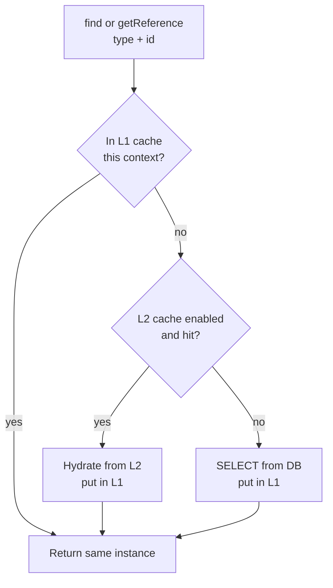
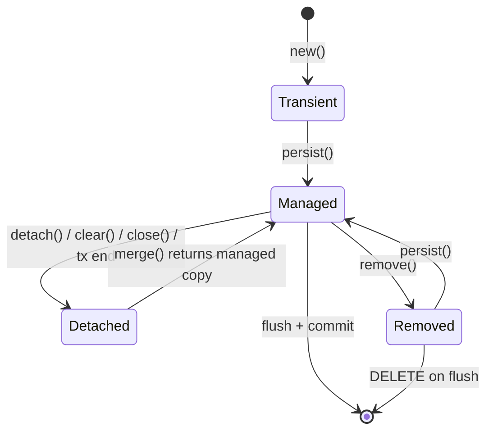
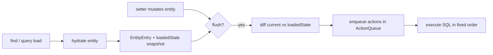

# Session, EntityManager & Persistence Context

The persistence context is the single most important concept in JPA/Hibernate. Almost
every "surprising" ORM behavior — why an entity got UPDATEd without you calling `save`,
why two `find` calls return the *same* object, why you got a `LazyInitializationException`,
why nothing hit the database until commit — traces back to how the persistence context
works. A senior candidate can reason about the persistence context as a **unit of work**;
a junior treats the ORM as a magic `save()` button.

> [!KEY-TAKEAWAY]
> The persistence context is a **first-level cache** *and* a **unit of work**. It tracks
> every managed entity, guarantees one object instance per primary key within its scope,
> detects changes automatically (dirty checking), and flushes the resulting SQL to the
> database — usually right before commit.

---

## What the persistence context is

The **persistence context** (PC) is an in-memory set of **managed entity instances**,
keyed by their entity type + primary key. It is a *stateful* object with two jobs:

1. **First-level (L1) cache** — a map of `EntityKey (type + id) -> entity instance`. Once
   an entity is loaded or persisted, it lives here for the lifetime of the context.
2. **Unit of work** — it records the *original* loaded state of each managed entity so it
   can compute what changed and emit the minimal SQL at flush time (dirty checking).

You never touch the persistence context directly. You interact with it through the
`EntityManager` (JPA) or `Session` (Hibernate). Under Hibernate ORM 6/7, `Session`
*extends* `EntityManager`, so a JPA `EntityManager` in a Hibernate app *is* a `Session`
you can `unwrap(Session.class)`.

> [!INTERVIEW]
> A great one-line answer: "The persistence context is a transactional write-behind
> first-level cache that tracks managed entities so Hibernate can guarantee object
> identity and do automatic dirty checking, flushing SQL lazily before commit."

Everything Hibernate does — lazy loading, dirty checking, cascading, cache lookups,
identity guarantees — is coordinated *through* this context.

---

## EntityManager and Session as the interface

`EntityManager` is the JPA (Jakarta Persistence 3.1/3.2, `jakarta.persistence` package)
interface to one persistence context. `Session` is Hibernate's superset. In Hibernate 6/7:

```java
import jakarta.persistence.EntityManager;   // NOT javax.persistence
import org.hibernate.Session;

Session session = entityManager.unwrap(Session.class);
```

The persistence context is *owned* by the `EntityManager`/`Session`. There is a
one-to-one relationship: an `EntityManager` has exactly one persistence context (for a
transaction-scoped EM, a fresh PC per transaction; for an extended EM, one PC that spans
transactions).

> [!WARNING]
> Use the `jakarta.persistence.*` namespace. The `javax.persistence.*` packages are the
> legacy Java EE / JPA ≤2.2 names, dropped in Jakarta EE 9+ and unsupported by Hibernate
> ORM 6/7. Mixing the two namespaces is a classic migration bug — see
> `hibernate-6-7-and-jakarta-migration`.

---

## Core operations

The `EntityManager` API for moving entities in and out of the persistence context:

| Operation | What it does | Triggers SQL? |
|---|---|---|
| `persist(e)` | Makes a *new* (transient) entity managed; schedules an INSERT | Not immediately (at flush); INSERT may be earlier if the id generator needs it (`IDENTITY`) |
| `find(Class, id)` | Loads by PK; checks L1 cache first, then L2, then DB | Only on a cache miss |
| `getReference(Class, id)` | Returns a **lazy proxy** without hitting the DB | No — SELECT deferred until a non-id field is accessed |
| `merge(e)` | Copies state of a *detached* entity onto a managed instance; returns the managed copy | SELECT to load current state (if not cached), UPDATE at flush |
| `remove(e)` | Schedules a DELETE for a managed entity | At flush |
| `flush()` | Synchronizes the PC to the DB now (runs pending SQL) | Yes, immediately |
| `detach(e)` | Evicts one entity from the PC (becomes detached) | No |
| `clear()` | Evicts *all* entities; empties the PC | No |
| `contains(e)` | Returns whether the entity is currently managed by this PC | No |
| `refresh(e)` | Overwrites the entity's in-memory state from the DB | SELECT |

> [!WARNING]
> `merge` does **not** make the argument managed. It returns a *different* managed
> instance and copies your detached state onto it. A very common bug:
> ```java
> Order o = new Order(existingId);   // detached
> em.merge(o);                       // WRONG: keep the return value
> o.setStatus(SHIPPED);              // o is still detached — this update is lost
> ```
> Correct: `Order managed = em.merge(o); managed.setStatus(SHIPPED);`

`persist` vs `merge`: use `persist` for brand-new entities inside the current
transaction (it keeps *your* reference managed and can throw
`EntityExistsException` if the id already exists); use `merge` to reattach detached
state coming from outside the transaction (e.g. an entity edited in a web form across
requests).

---

## The first-level cache and object identity

The L1 cache is **mandatory, per-persistence-context, and cannot be disabled**. It is not
shared between contexts or threads — it is a private scratchpad for one unit of work.
(The optional shared cache across contexts is the *second-level* cache; see
`caching-first-second-level`.)

Two consequences:

**Repeated lookups are free.** Loading the same PK twice in one context hits the map, not
the DB:

```java
Author a1 = em.find(Author.class, 1L);   // SELECT ... FROM author WHERE id=1
Author a2 = em.find(Author.class, 1L);   // no SQL — served from L1 cache
```

**Guaranteed object identity (repeatable read within a context).** Within one persistence
context, the same primary key always returns the *same Java object instance*:

```java
Author a1 = em.find(Author.class, 1L);
Author a2 = em.getReference(Author.class, 1L);
assert a1 == a2;   // true — reference equality, not just equals()
```

This is why a JPQL query that returns an already-managed entity gives you the cached
instance, *not* a fresh copy — even if the DB row changed since it was first loaded. The
L1 cache wins for entity identity (though scalar/column values from the query row are read
fresh).



> [!TIP]
> Because identity is guaranteed *only within a context*, `==` is unreliable across
> contexts. This is the deep reason entities need a stable `equals`/`hashCode` (based on a
> business key or an assigned id) rather than relying on the generated surrogate id — see
> "equals and hashCode gotchas" below and `entity-mappings-associations`.

---

## Dirty checking and automatic flush

When an entity is loaded, Hibernate snapshots a copy of its property values (the "loaded
state") inside the persistence context. At flush time it compares the current field values
to that snapshot; any managed entity whose state differs is **dirty** and gets an UPDATE.
**You never call `save`/`update` for a managed entity** — mutating a getter/setter is
enough.

```java
@Transactional
void raise(Long id) {
    Employee e = em.find(Employee.class, id);   // SELECT; snapshot taken
    e.setSalary(e.getSalary() + 1000);          // just a setter — no em call
}   // on commit: flush compares snapshot, emits UPDATE employee SET salary=? WHERE id=?
```

Generated SQL on flush:

```sql
UPDATE employee SET salary = 6000 WHERE id = 42
```

By default Hibernate UPDATEs *all* columns (not just changed ones) so it can reuse a single
cached prepared statement; `@DynamicUpdate` switches to updating only dirty columns at the
cost of statement-cache churn. See `transactions-dirty-checking-flushing` for flush order,
`FlushModeType`, and dynamic-update trade-offs.

> [!WARNING]
> Dirty checking only tracks **managed** entities. If an entity is detached (context
> closed, or you called `clear`/`detach`), setters do nothing to the DB until you `merge`
> it back. "I changed the object but the DB didn't update" almost always means the entity
> was detached.

The comparison cost is proportional to the number of managed entities × their fields, which
is why loading thousands of entities into one context and mutating a few is expensive — see
`performance-tuning-pitfalls`.

---

## Persistence context scope: transaction-scoped vs extended

A container-managed `EntityManager` injected with `@PersistenceContext` has a **scope**
that controls how long its persistence context lives.

| | Transaction-scoped (default) | Extended (`type = EXTENDED`) |
|---|---|---|
| Lifetime of PC | Bound to a single JTA/Spring transaction; created at tx start, flushed+closed at commit | Spans multiple transactions; lives as long as the owning stateful bean |
| Entities after tx | **Detached** once the tx ends | Stay **managed** across transactions |
| Typical use | Stateless services (the normal case) | Stateful conversations (multi-step wizard in a `@Stateful` EJB) |
| Declaration | `@PersistenceContext EntityManager em;` | `@PersistenceContext(type = PersistenceContextType.EXTENDED)` |

```java
@PersistenceContext(type = PersistenceContextType.EXTENDED)
private EntityManager em;   // managed entities survive between method calls
```

In a typical Spring `@Transactional` service the PC is transaction-scoped: it is created
when the transaction begins and closed when it commits, so any entity you return is
detached. Accessing a lazy association on that returned entity later throws
`LazyInitializationException`. (Spring's tx proxying and `@Transactional` semantics are
owned by `spring-boot`/`spring-core`; here we only care that the PC lifetime tracks the
transaction.)

> [!WARNING]
> The infamous **`LazyInitializationException`** happens when you touch an uninitialized
> lazy proxy/collection *after* its persistence context has closed. The fix is to
> initialize what you need *inside* the transaction (`JOIN FETCH`, entity graph, DTO
> projection) — **not** `spring.jpa.open-in-view=true` (Open Session In View), which merely
> hides the N+1 problem behind the render phase. See `fetching-lazy-eager-n-plus-one`.

---

## Factory vs context: EntityManagerFactory and SessionFactory

Do not confuse the *factory* with the *context*. They have opposite lifecycles and
threading rules.

| | `EntityManagerFactory` / `SessionFactory` | `EntityManager` / `Session` |
|---|---|---|
| Cost to create | **Expensive** — parses mappings, builds metamodel, opens the connection pool | **Cheap** — thin wrapper over a PC + connection |
| Quantity | **One per persistence unit** for the whole application | **One per request/transaction** |
| Thread-safety | **Thread-safe** — shared across all threads | **NOT thread-safe** — never share across threads |
| Lifespan | Application lifetime (a global singleton) | Short — a single unit of work |
| Holds | Second-level cache, metamodel, connection pool, config | The first-level cache (the PC) |

```java
// Built ONCE at startup, shared, thread-safe:
EntityManagerFactory emf = Persistence.createEntityManagerFactory("myPU");

// Created per unit of work, cheap, single-threaded:
EntityManager em = emf.createEntityManager();
```

> [!WARNING]
> Sharing one `EntityManager`/`Session` across threads is a serious bug: the L1 cache and
> dirty-check state are unsynchronized, so you get race conditions and corrupt SQL. In
> Spring the injected `@PersistenceContext EntityManager` is actually a thread-bound proxy
> that routes each thread to *its own* context, which is why it looks safe — the underlying
> `EntityManager` still is not.

---

## contains, detach, and clear

These control what is *in* the persistence context:

- `contains(e)` — is this instance currently managed by this PC? Useful to distinguish
  managed vs detached at runtime.
- `detach(e)` — evict one entity (and stop dirty-checking it). It becomes detached; further
  setters won't reach the DB.
- `clear()` — evict everything; the PC becomes empty. Essential in **batch processing**:
  after each batch of N inserts you `flush()` then `clear()` so the L1 cache doesn't grow
  unbounded and blow up memory / slow dirty checking:

```java
for (int i = 0; i < rows.size(); i++) {
    em.persist(toEntity(rows.get(i)));
    if (i % 50 == 0) {   // hibernate.jdbc.batch_size = 50
        em.flush();      // push INSERTs to DB
        em.clear();      // empty L1 cache to bound memory
    }
}
```

> [!WARNING]
> After `clear()`, every previously-managed entity is **detached** — touching a lazy
> association throws `LazyInitializationException`, and setters no longer dirty-check.

---

## Entity lifecycle at a glance

The operations above move an entity between four states. This is covered in depth in
`entity-lifecycle-states`; the summary as it relates to the persistence context:



- **Transient** — a plain `new` object, unknown to any PC, no DB row.
- **Managed** — in the PC, dirty-checked, changes auto-flushed.
- **Detached** — was managed, PC no longer tracks it (closed/cleared/serialized).
- **Removed** — scheduled for DELETE at flush.

Only **managed** entities are dirty-checked and participate in the L1 cache.

---

## equals and hashCode gotchas

Because object identity is only guaranteed *within one persistence context*, entities used
in `Set`s or as map keys across contexts (or before vs after `persist`) need a carefully
chosen `equals`/`hashCode`:

- **Do not** use the auto-generated surrogate `@Id` in `equals`/`hashCode` if it is
  DB-generated: a transient entity has `id == null`, and its hash changes the moment
  `persist` assigns an id — corrupting any `HashSet` it was already added to.
- **Prefer** a stable **business/natural key**, or a UUID assigned *before* persist.
- If you must rely on the surrogate id, make `hashCode` return a constant and base `equals`
  on the id-when-present pattern (a well-known Vlad Mihalcea idiom).

> [!INTERVIEW]
> "Why can't I just use the primary key in equals/hashCode?" → Because for
> `GenerationType.IDENTITY`/`SEQUENCE` the id is null until flush, so the object's identity
> would mutate mid-lifecycle. This ties back to the persistence context guaranteeing
> `==` only *within* a context, not across them. See `entity-mappings-associations` and
> `primary-keys-and-id-generation`.

---

## Hibernate 7 Session API removals

Hibernate ORM 7.0 finished a long deprecation cycle by **removing the legacy native
mutation vocabulary** from `Session`. A senior candidate must know which methods still
exist. The rule: **only the JPA-standard operations survive**; the Hibernate-native
mutators are gone.

| Legacy Hibernate `Session` method | Status in HB7 | Use instead |
|---|---|---|
| `save(e)` | **REMOVED** | `persist(e)` |
| `update(e)` | **REMOVED** | `merge(e)` |
| `saveOrUpdate(e)` | **REMOVED** | `persist` (transient) / `merge` (detached) |
| `delete(e)` | **REMOVED** | `remove(e)` |
| `load(Class, id)` | **REMOVED** | `getReference(Class, id)` — same lazy-proxy semantics |
| `get(Class, id)` | **DEPRECATED** | JPA `find(Class, id)` |
| `persist / merge / remove / find / getReference` | present | (already JPA-standard) |

Additional HB7 changes relevant here:

- **`SessionFactory.createEntityManager()` now returns `Session`** (the narrowed return
  type), so you no longer need to `unwrap`.
- **`@Id`/`@MapsId` associations no longer auto-enable `cascade=PERSIST`.** You must add
  the cascade explicitly.
- **Flushing a `CascadeType.PERSIST`/`ALL` association that points at a DETACHED instance
  now throws `jakarta.persistence.EntityExistsException`** (JPA-compliant). Fix by
  `merge`-ing the detached child, or by pointing at a `getReference` proxy instead of a
  detached instance.

> [!INTERVIEW]
> "Which of `save / update / saveOrUpdate / load / get / persist / merge / find` still
> exist in Hibernate 7?" → Only the JPA-standard ones (`persist`, `merge`, `find`,
> `getReference`, `remove`). `get` is deprecated; the four native mutators and `load` are
> gone.

---

## StatelessSession for high-volume batch work

A **`StatelessSession`** is Hibernate's answer to "insert/update 10M rows without OOM and
without dirty-check overhead." It is *not* a persistence context:

- **No first-level cache**, no object identity, no `EntityEntry`, no snapshots.
- **No dirty checking** — you must call `update(entity)` explicitly to write changes.
- **No cascade**, no auto-flush, no lazy-loading of associations.
- Each operation maps almost directly to a single SQL statement.

```java
StatelessSession ss = sessionFactory.openStatelessSession();
Transaction tx = ss.beginTransaction();
try (var rows = readMillionsLazily()) {
    rows.forEach(r -> ss.insert(toEntity(r)));   // direct INSERTs, no PC growth
}
tx.commit();
ss.close();
```

Contrast with stateful `Session`: the stateful batch idiom (`flush()`+`clear()`+
`hibernate.jdbc.batch_size`) still pays for snapshots, dirty checking, and the L1 map even
though you clear it every N rows; `StatelessSession` skips all of that.

**Hibernate 7 changes to `StatelessSession`:**

- It now **uses the second-level cache by default**. To recover the old L2-bypass
  behavior, call `ss.setCacheMode(CacheMode.IGNORE)`.
- **`hibernate.jdbc.batch_size` no longer affects it.** Configure batching with
  `ss.setJdbcBatchSize(n)`, or use the new bulk methods `insertMultiple()`,
  `updateMultiple()`, `deleteMultiple()`.

> [!TIP]
> For the *read* side of a big job, a stateful `Session` with **read-only** entities (see
> below) is often the right tool: you still get mapping/lazy features but skip snapshots.

---

## Flush modes and auto-flush before queries

`FlushModeType` (JPA) controls *when* the PC synchronizes to the DB:

| Mode | Meaning |
|---|---|
| `AUTO` (JPA default) | Flush before commit **and** before a query whose tables overlap pending changes |
| `COMMIT` | Flush only at commit — queries may **not** see your own unflushed writes |
| Hibernate `FlushMode.ALWAYS` | Flush before *every* query, even unrelated ones |
| Hibernate `FlushMode.MANUAL` | Never auto-flush; you must call `flush()` yourself (used by OSIV render, read-only conversations) |

**Auto-flush-before-query mechanism.** Before running a JPQL/HQL/Criteria query under
`AUTO`, Hibernate inspects the query's **query spaces** (the tables it reads) and flushes
any pending changes that touch those tables, so the query sees your own writes. This is
why *a SELECT can emit an UPDATE or INSERT first*.

**Native SQL gotcha.** For a native `createNativeQuery(...)`, Hibernate cannot parse the
SQL to infer which tables it touches, so it conservatively flushes the **whole** PC (or
nothing, if you declared `addSynchronizedEntityClass`/synchronized tables). This surprises
people who expect the same targeted flush as JPQL.

**Hibernate 7:** `Query.setFlushMode(FlushModeType)` is **deprecated** in favor of
`setQueryFlushMode(QueryFlushMode)`.

> [!WARNING]
> Deep flush-order and `@DynamicUpdate` details live in
> `transactions-dirty-checking-flushing`. Here we only cover the *query-triggered* flush
> hook.

---

## Persistence context internals: EntityEntry, snapshots, ActionQueue

The PC is implemented (in Hibernate) by `StatefulPersistenceContext`. For each managed
entity it holds an **`EntityEntry`** recording:

- the `EntityKey` (entity name + id),
- the entity **status** (`MANAGED`, `READ_ONLY`, `DELETED`, `GONE`, …),
- the current `LockMode`,
- and the **`loadedState`** — an **array snapshot** of the hydrated property values at
  load time.

**Dirty checking** diffs the entity's *current* field values against that `loadedState`
array (index-by-index over the persister's property list). Mutating operations don't run
SQL immediately; they enqueue `EntityInsertAction`, `EntityUpdateAction`,
`EntityDeleteAction`, collection actions, etc. into the **`ActionQueue`**, which is drained
at flush.



---

## Action-queue flush order and the unique-constraint trap

At flush, the `ActionQueue` executes actions in a **fixed order regardless of the order you
called the operations**:

1. orphan-removal deletes
2. **inserts**
3. updates
4. collection actions (queued-op → remove → update → recreate)
5. **deletes — LAST**

The classic production bug: swapping a row that shares a unique key.

```java
em.remove(oldWithSameEmail);       // scheduled DELETE
em.persist(newWithSameEmail);      // scheduled INSERT
// flush runs the INSERT before the DELETE -> unique-constraint violation!
```

Because inserts run before deletes, the INSERT collides with the not-yet-deleted row.
Sprinkling `em.flush()` between the two "works" but is a **code smell** (forces order,
breaks batching); the real fix is usually to **update the existing row in place** rather
than delete-then-insert.

---

## Bytecode enhancement and in-line dirty tracking

By default Hibernate uses **snapshot-diffing** (the `loadedState` array above), whose cost
scales with managed-entities × fields. With **bytecode enhancement**
(`hibernate-enhance-maven-plugin` / Gradle plugin with `enableDirtyTracking`), Hibernate
instruments your entities so each one **tracks its own dirty attributes in-line** — flush
only inspects the self-reported dirty set, drastically cutting cost on large PCs.

Enhancement also enables:

- **lazy loading of `@Basic` columns** (e.g. a large `@Lob`) via `@LazyGroup`,
- **lazy to-one without a proxy** (`@LazyToOne` no-proxy),
- and bidirectional-association management.

So the "snapshot comparison cost" described earlier is only the **non-enhanced default
path**; enhancement is a legitimate senior-level performance lever.

---

## Read-only entities and skipping snapshots

For read-heavy paths you can tell Hibernate to **skip taking the loaded-state snapshot**,
which halves per-entity memory and eliminates dirty checking:

```java
session.setDefaultReadOnly(true);              // all subsequently loaded entities
session.setReadOnly(entity, true);             // one entity
query.setHint(QueryHints.HINT_READONLY, true); // JPA query hint (org.hibernate.readOnly)
```

A read-only entity's `EntityEntry` has status `READ_ONLY`; Hibernate never snapshots it and
never issues an UPDATE for it, even if you mutate a field in memory. Ideal for large batch
reads and for the render phase behind Open Session In View.

---

## getReference vs find in depth

`getReference` returns an **uninitialized proxy** (Hibernate uses ByteBuddy) carrying only
the id:

- Accessing any **non-id** property triggers the deferred SELECT.
- If the row was deleted, the deref throws **`EntityNotFoundException`** (JPA) /
  `ObjectNotFoundException` (Hibernate native) — **not `null`**, and it throws at
  **dereference time**, which may be *outside the transaction* → then you additionally risk
  `LazyInitializationException` if the PC already closed.
- **Prime use:** setting a foreign key without a SELECT —
  `child.setParent(em.getReference(Parent.class, parentId))` schedules the FK write with no
  read of the parent.
- **Nuance:** if the entity is **already in L1** (loaded earlier this context),
  `getReference` returns that initialized instance, so `a1 == a2` holds — which is why the
  identity assertion earlier in this doc is correct.

`find`, by contrast, hits L1 → L2 → DB eagerly and returns `null` when the row is absent.

---

## merge: generated SQL and edge cases

Predicting merge SQL is a staple question. `merge(detached)`:

1. **SELECT** the current managed state by id (**skipped** if it is already in L1, or
   loadable from L2),
2. copy the detached entity's state onto the managed instance,
3. **UPDATE** at flush (only if dirty).

Edge cases:

- **Assigned-id entity + `merge`** fires a **redundant SELECT** before the INSERT to check
  whether the row exists (Hibernate can't tell transient from detached when the id is
  always set). Fix by adding a **wrapper-type `@Version` field** (`Long`, not `long`): a
  `null` version marks the instance transient, so Hibernate INSERTs without the probe SELECT.
- **Redundant-save anti-pattern:** calling `merge` (or Spring Data `save`) on an
  **already-managed** entity is wasted work — it fires a `MergeEvent` and re-copies the
  hydrated state, when plain **dirty checking would already emit the UPDATE**. Managed
  entities auto-sync; you don't need to "save" them.

> [!INTERVIEW]
> "Why does `repository.save(loadedEntity)` still emit an UPDATE, and is the `save`
> needed?" → The UPDATE comes from dirty checking, not from `save`; on a managed entity the
> `save`/`merge` is redundant `MergeEvent` overhead.

---

## refresh gotchas and the Hibernate 7 detached rule

- `refresh(entity)` **overwrites in-memory state from the DB and discards unflushed
  edits** to that entity — surprising if you expected a merge-style reconcile.
- **Hibernate 7:** calling `refresh` **or** `lock` on a **detached** entity now throws
  `IllegalArgumentException` (JPA-compliant). The old escape-hatch property
  `hibernate.allow_refresh_detached_entity` has been **removed**. Reattach with `merge`
  first if you need DB state.

---

## Extended persistence context in Spring vs Jakarta EE

`@PersistenceContext(type = EXTENDED)` is fundamentally a **Jakarta EE `@Stateful` EJB**
feature: the extended PC lives with the stateful bean across method calls/transactions. In
**plain Spring there is no direct equivalent** — Spring's `@Transactional` beans are
effectively singletons, and an extended PC held in a singleton would be shared and
thread-unsafe. Spring's "conversation" story is different: custom scopes (e.g. a
web/conversation scope), a manually managed `EntityManager`, or frameworks like Spring Web
Flow. Do **not** conflate a Spring `@Transactional` service with an EJB extended PC.

---

## Persistence context propagation across transactions

At ORM altitude (proxying mechanics belong to `spring-*`): within **one** transaction,
**all methods that JOIN it share the same PC/EM**. Spring binds the EM to the thread via
`TransactionSynchronizationManager`, so a nested `@Transactional` method with the default
`REQUIRED` sees the *same* PC — including your unflushed changes and the same object
identity.

`Propagation.REQUIRES_NEW` **suspends** the outer transaction and runs with a **fresh,
independent PC**. Consequences:

- An entity managed by the outer tx is **effectively detached** inside the inner one → no
  dirty checking there, and `find`-ing the same id in the inner tx yields a **different
  instance** (`==` breaks).
- The inner tx does **not** see the outer tx's unflushed changes (they're in a different PC
  and uncommitted).

> [!INTERVIEW]
> "Two `find(A.class, 1L)` calls in two different `@Transactional(REQUIRES_NEW)` methods —
> is `a1 == a2`?" → No. Different transactions → different persistence contexts → different
> instances.

---

## Open Session In View mechanics

`spring.jpa.open-in-view=true` is the **Spring Boot default** (Boot logs a warning about it
since 2.0). The `OpenEntityManagerInViewInterceptor` (MVC) / `OpenSessionInViewFilter`
binds one `EntityManager` to the **request thread**, so the **L1 cache and the JDBC
connection stay alive for the entire request, including view/serialization rendering**.

Crucially, during render the EM's flush mode is forced to **`MANUAL`/`COMMIT`** so that
lazy-init reads triggered by the view do **not** accidentally flush dirty state after the
service transaction already committed.

Costs: the DB connection is held through rendering (pool pressure), N+1 queries are hidden
behind the view, and SQL is split across the service and UI layers. Prefer fetching what
you need in-tx — N+1 and OSIV-fix depth live in `fetching-lazy-eager-n-plus-one`.

---

## Loading by id set and natural id

Beyond `find`, Hibernate exposes richer load APIs on `Session`:

```java
// Optional-style single load
Optional<Book> b = session.byId(Book.class).loadOptional(id);

// Batched multi-load: ONE "SELECT ... WHERE id IN (?, ?, ...)" — beats N finds
List<Book> books = session.byMultipleIds(Book.class).multiLoad(id1, id2, id3);

// Natural-id lookup (entity has @NaturalId), L1/L2-cached by natural key
Book byIsbn = session.bySimpleNaturalId(Book.class).load("978-0135166307");
Book compound = session.byNaturalId(Book.class)
        .using("isbn", isbn).using("edition", 2).load();
```

`byMultipleIds().multiLoad(...)` is the senior answer to "load 500 entities by id
efficiently" — a single batched `IN` query instead of 500 round-trips.

---

## clear vs close vs detach

| Method | Effect | EM still usable? |
|---|---|---|
| `detach(e)` | Evict **one** entity (respects `CascadeType.DETACH`); it becomes detached | Yes |
| `clear()` | Evict **all** entities; PC becomes empty | **Yes** — the EM is still open, just empty |
| `close()` | End the EM entirely: releases the JDBC connection, PC gone | **No** |

`clear()` is the batch-loop tool (keep the EM, drop the entities); `close()` ends the unit
of work. After any of the three, affected entities are detached — lazy access throws
`LazyInitializationException`.

---

## Common Interview Follow-ups

- **"What is the persistence context and how is it related to the first-level cache?"** —
  They're the same thing viewed two ways: the PC *is* the L1 cache plus the dirty-checking
  unit of work; it's mandatory and per-context.
- **"Why did two `find` calls for the same id return the identical object?"** — L1 cache /
  guaranteed object identity within a context.
- **"Why did my entity get UPDATEd when I only called a setter?"** — automatic dirty
  checking of managed entities at flush.
- **"Why `LazyInitializationException`?"** — lazy proxy accessed after its PC closed
  (transaction-scoped EM ended). Fix by fetching eagerly *in* the tx, not OSIV.
- **"persist vs merge?"** — persist for new entities (keeps your ref managed); merge for
  reattaching detached state (returns a *new* managed copy — use the return value).
- **"Is EntityManager thread-safe? Is EntityManagerFactory?"** — EM/Session: no, one per
  request. EMF/SessionFactory: yes, one per app.
- **"How do you avoid OutOfMemory when inserting a million rows?"** — periodic
  `flush()` + `clear()` with a JDBC batch size; don't let the L1 cache grow unbounded.
- **"getReference vs find?"** — `getReference` returns a lazy proxy with no SELECT
  (throws `EntityNotFoundException` on first access if the row is missing); `find` loads
  eagerly and returns `null` if absent.
- **"transaction-scoped vs extended PC?"** — default is transaction-scoped (detached after
  commit); extended keeps entities managed across transactions for stateful conversations.
- **"Which Session methods were removed in Hibernate 7?"** — `save`, `update`,
  `saveOrUpdate`, `delete`, `load`; `get` is deprecated. Use the JPA-standard operations.
- **"How do you insert 10M rows without OOM?"** — `StatelessSession` (no PC/dirty
  checking), or stateful `flush()`+`clear()`+`batch_size`. Read side: read-only entities.
- **"Why does `remove(a); persist(b)` with the same unique key throw?"** — the ActionQueue
  runs inserts before deletes, so the INSERT collides with the not-yet-deleted row.
- **"Does `refresh` keep my unsaved changes?"** — no, it overwrites them from the DB; and
  in HB7 refreshing a detached entity throws `IllegalArgumentException`.
- **"Why did my SELECT emit an UPDATE first?"** — `FlushModeType.AUTO` auto-flushes pending
  changes that touch the query's tables (query spaces) before running the query.
- **"Is `repository.save()` needed on a loaded entity?"** — no; dirty checking already
  emits the UPDATE. `save`/`merge` on a managed entity is redundant `MergeEvent` overhead.

## References

- Jakarta Persistence 3.1/3.2 specification — `EntityManager`, `EntityManagerFactory`,
  `PersistenceContextType`, `@PersistenceContext`.
- Hibernate ORM 6/7 User Guide — "Persistence Context", "Flushing", "Session API".
- Vlad Mihalcea, *High-Performance Java Persistence* — persistence context, identity,
  `equals`/`hashCode`, batching.
- Cross-references in this library: `entity-lifecycle-states`,
  `transactions-dirty-checking-flushing`, `fetching-lazy-eager-n-plus-one`,
  `caching-first-second-level`, `hibernate-6-7-and-jakarta-migration`,
  `spring-data-jpa-repositories`; DB-level mechanics in `messaging-databases`.
