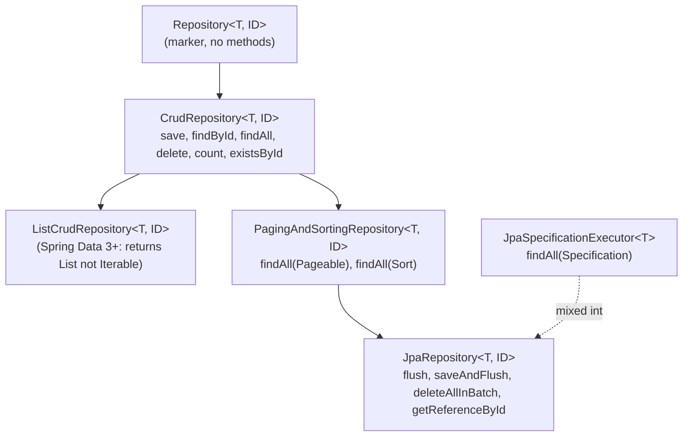
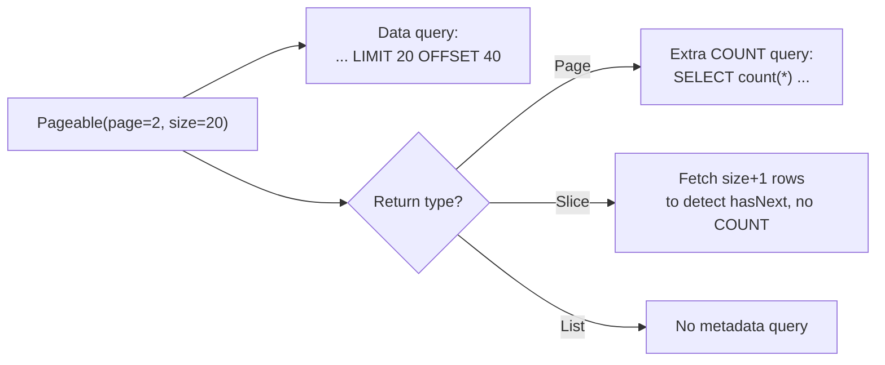
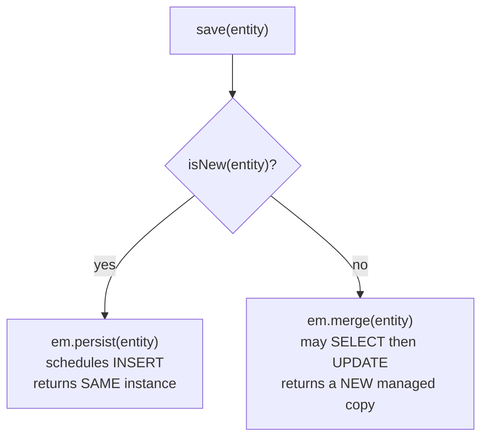
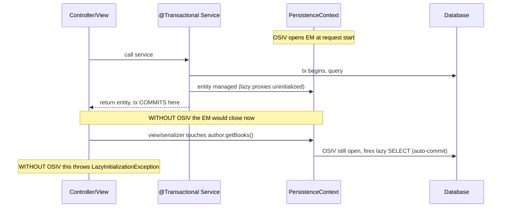

# Spring Data JPA & Repository Abstraction

Spring Data JPA is the layer almost every Spring application uses to talk to the
database. It sits *on top of* JPA/Hibernate: you declare an **interface**, and Spring
generates a proxy at startup that implements it — deriving queries from method names,
running your `@Query` strings, wiring in pagination, and delegating everything else to a
shared `EntityManager`. Understanding this abstraction at interview grade means knowing
*what code Spring generates*, *what SQL Hibernate ultimately runs*, and where the
convenience hides landmines: `save()` that silently does a `SELECT`, `Page` that fires an
extra `COUNT`, bulk `@Modifying` updates that skip the persistence context, and
Open-Session-In-View that masks `LazyInitializationException` in dev then blows up under
load.

> [!INTERVIEW]
> The repository interface is *not* magic ORM. It is a thin query-generation and
> boilerplate layer. Every question here reduces to: "what `EntityManager` call and what
> SQL does this method produce?" A senior answer always ties the repository method back to
> `persist`/`merge`, a JPQL/Criteria query, and the flush/transaction boundary.

**Boundary notes (do not duplicate):**
- The Spring container, `@Transactional` propagation, proxy mechanics, and
  auto-configuration are owned by `spring-boot` / `spring-core` — see
  `spring-boot/transaction-management` and `spring-core/aop-proxies`. Here we cover only
  the JPA repository abstraction.
- SQL itself, isolation levels, and index behavior are owned by `messaging-databases` —
  see `messaging-databases/sql-joins` and `messaging-databases/transactions-isolation`.
- The N+1 problem, lazy proxies, and fetch mechanics are covered in depth in
  `hibernate-jpa/fetching-lazy-eager-n-plus-one`; here we cover the *repository-level*
  fixes (`@EntityGraph`, fetch-join `@Query`).

## The Repository Interface Hierarchy

Spring Data's repositories form a layered hierarchy. You extend the one that gives you the
API surface you want; each adds capability:



- **`Repository<T, ID>`** — a pure marker interface (no methods). Extending it makes a
  type a Spring Data managed repository so it can pick and choose methods.
- **`CrudRepository<T, ID>`** — the basic CRUD set: `save`, `saveAll`, `findById`,
  `existsById`, `findAll`, `count`, `deleteById`, `delete`, `deleteAll`.
- **`PagingAndSortingRepository<T, ID>`** — adds `findAll(Sort)` and `findAll(Pageable)`.
  In **Spring Data 3.x** (Spring Boot 3), this interface no longer extends
  `CrudRepository` — it is a standalone add-on, so `JpaRepository` composes both.
- **`JpaRepository<T, ID>`** — the JPA-specific interface most apps extend. Adds
  `flush()`, `saveAndFlush()`, `saveAllAndFlush()`, `deleteAllInBatch()`,
  `deleteAllByIdInBatch()`, `getReferenceById()` (the `EntityManager.getReference` proxy —
  replaces the deprecated `getOne`), and overrides `findAll`/`saveAll` to return `List`.
- **`JpaSpecificationExecutor<T>`** — a *sibling* interface (not in the CRUD chain) you mix
  in for dynamic Criteria queries via `Specification`.

```java
public interface AuthorRepository
        extends JpaRepository<Author, Long>,
                JpaSpecificationExecutor<Author> {
    // derived + @Query methods go here
}
```

> [!KEY-TAKEAWAY]
> You never write the implementation. At startup Spring's
> `JpaRepositoryFactory` creates a proxy backed by `SimpleJpaRepository` (the default impl
> of `JpaRepository`) and routes each method to: a derived query, a `@Query`, a named
> query, or a `SimpleJpaRepository` method. `SimpleJpaRepository` itself is annotated
> `@Transactional(readOnly = true)` at class level, with write methods overriding to
> `@Transactional`.

## Derived Query Methods

Spring parses the **method name** into a query. The name is split into a *subject*
(`find`, `read`, `get`, `query`, `count`, `exists`, `delete`, `stream`) and a *predicate*
(everything after `By`), then property expressions and keywords in the predicate become a
JPQL `WHERE` clause.

```java
List<Author> findByLastNameAndAgeGreaterThan(String lastName, int age);
// →  SELECT a FROM Author a WHERE a.lastName = ?1 AND a.age > ?2
```

Supported keywords include `And`, `Or`, `Between`, `LessThan`, `GreaterThan`, `Like`,
`StartingWith`, `Containing`, `In`, `IsNull`, `True`/`False`, `IgnoreCase`, `OrderBy…Asc`.
Result-limiting: `findFirst10By…`, `findTop3By…`, `findDistinctBy…`. Traversal into nested
properties: `findByAddressZipCode` resolves `x.address.zipCode` (Spring greedily matches
the longest property, then splits on ambiguity — use an underscore `findByAddress_ZipCode`
to force the split point).

Return types are flexible: `List<T>`, `Optional<T>`, `T` (null if none / exception if
>1), `Stream<T>`, `Page<T>`, `Slice<T>`, `long` (for `countBy`), `boolean` (`existsBy`).

> [!WARNING]
> Derived queries fail *at application startup*, not at runtime, if a property in the name
> doesn't exist on the entity — Spring validates them when building the repository proxy.
> That is a feature: typos are caught immediately. But it also means derived-query
> validation makes context startup fail loudly.

**Limits — when to abandon derived queries:** once a method name exceeds ~3 conditions it
becomes unreadable (`findByFirstNameAndLastNameAndAgeGreaterThanAndActiveTrueOrderBy…`).
Derived names also cannot express joins with conditions on both sides, subqueries,
`GROUP BY`, projections of arbitrary columns, or `JOIN FETCH`. At that point switch to
`@Query`, Specifications, or QueryDSL.

## @Query: JPQL and Native SQL

`@Query` lets you attach an explicit query to a method, bypassing name parsing. Two modes:

```java
// JPQL (default): entity/field names, portable, participates fully in JPA
@Query("SELECT a FROM Author a WHERE a.age > :age")
List<Author> olderThan(@Param("age") int age);

// Native SQL: real table/column names, DB-specific
@Query(value = "SELECT * FROM author WHERE age > :age", nativeQuery = true)
List<Author> olderThanNative(@Param("age") int age);
```

| Aspect | JPQL (`nativeQuery=false`) | Native (`nativeQuery=true`) |
|---|---|---|
| References | Entity + field names | Table + column names |
| Portability | DB-agnostic (Hibernate emits dialect SQL) | Tied to one DB's SQL |
| Result mapping | Entities/DTOs automatically | Entities via `@SqlResultSetMapping` or interface projection |
| Pagination | `Pageable` fully supported | Supported, but **count query** must often be supplied manually |
| Dynamic sort | `Sort` translated into `ORDER BY` | `Sort` **not** applied to native queries (silently ignored) |
| Use when | 95% of cases | DB-specific SQL, window functions, hints, vendor features |

For native queries with pagination, provide `countQuery`:

```java
@Query(value = "SELECT * FROM author WHERE age > :age",
       countQuery = "SELECT count(*) FROM author WHERE age > :age",
       nativeQuery = true)
Page<Author> page(@Param("age") int age, Pageable pageable);
```

> [!WARNING]
> `Sort` is **not** applied to native queries — Spring cannot safely rewrite arbitrary
> native SQL. Passing a `Sort`/`Pageable` sort to a native `@Query` silently produces
> unsorted results (older versions threw; current versions ignore). Put `ORDER BY` in the
> SQL, or use JPQL.

## Named Parameters, Positional Params & SpEL

Bind parameters two ways:

- **Named**: `:name` in the query + `@Param("name")` on the argument. Preferred — order
  independent and readable. (With `-parameters` compilation the `@Param` can sometimes be
  omitted, but always include it for clarity/robustness.)
- **Positional**: `?1`, `?2` bound by argument index (1-based).

`IN` clauses take a `Collection`: `WHERE a.id IN :ids` with `List<Long> ids`.

**SpEL** is supported inside `@Query` via `?#{…}` / `:#{…}`:

```java
// Reference an entity name generically (reusable base repositories)
@Query("SELECT e FROM #{#entityName} e WHERE e.active = true")
List<T> findAllActive();

// Reference a bean or the argument itself
@Query("SELECT a FROM Author a WHERE a.tenantId = :#{@tenantProvider.currentTenant()}")
List<Author> forCurrentTenant();
```

> [!TIP]
> `#{#entityName}` is the most common SpEL use — it lets you write generic base
> repositories reused across entities. For `LIKE` with SpEL, use
> `:#{'%' + #term + '%'}` and bind carefully to avoid injection through concatenation
> (SpEL values are still bound as parameters, not string-concatenated into SQL).

## Modifying Queries: @Modifying, Bulk Update & Delete

By default `@Query` runs `SELECT`. To run an `UPDATE` or `DELETE` JPQL/native statement,
add `@Modifying`. These are **bulk** operations executed as a single SQL statement — they
do **not** load entities into the persistence context.

```java
@Modifying
@Transactional
@Query("UPDATE Author a SET a.active = false WHERE a.lastLogin < :cutoff")
int deactivateStale(@Param("cutoff") LocalDate cutoff);
// → UPDATE author SET active = false WHERE last_login < ?   (one statement, returns row count)
```

Key mechanics and gotchas:

- Return type must be `void`, `int`, or `long` (the affected-row count).
- Requires a write transaction — annotate with `@Transactional` (on the method or a
  service). Repository query methods are otherwise `readOnly`.
- **The bulk statement bypasses the persistence context and the first-level cache.**
  Entities already loaded into the current `EntityManager` are *not* updated in memory and
  are now **stale**. This is the classic bug: you `UPDATE` then read the same entity and
  get the old field value from L1 cache.
- Fix with the flush/clear flags:

```java
@Modifying(flushAutomatically = true, clearAutomatically = true)
@Query("UPDATE Author a SET a.active = false WHERE a.id = :id")
int deactivate(@Param("id") Long id);
```

- `flushAutomatically = true` — flush pending changes to the DB *before* the bulk statement
  (so they aren't lost/overwritten).
- `clearAutomatically = true` — clear the persistence context *after*, so subsequent reads
  re-fetch fresh state. (Caveat: this also detaches every managed entity, discarding
  unflushed changes — use judiciously.)
- Bulk operations do **not** cascade and do **not** trigger `@Version` optimistic-lock
  increments or lifecycle callbacks (`@PreUpdate` etc.). See
  `hibernate-jpa/lifecycle-callbacks-auditing-interceptors`.

> [!KEY-TAKEAWAY]
> `@Modifying` bulk update/delete = raw SQL efficiency at the cost of the persistence
> context. It skips dirty checking, cascades, version columns, and callbacks. Reach for it
> for large maintenance updates; use normal load-modify-flush (dirty checking) for
> single-entity business logic. See `hibernate-jpa/transactions-dirty-checking-flushing`.

## Pagination & Sorting: Page vs Slice

Pass a `Pageable` (usually `PageRequest.of(page, size, Sort.by(...))`) and choose a return
type:

```java
Page<Author>  findByActiveTrue(Pageable pageable);   // knows total count + total pages
Slice<Author> findByLastName(String ln, Pageable pageable);  // only knows "is there a next page?"
List<Author>  findByAge(int age, Pageable pageable);  // just the window, no metadata
```

| Return type | Extra query fired | Knows total elements/pages | Use for |
|---|---|---|---|
| `Page<T>` | **Yes — a `COUNT(*)` query** | Yes | UIs that show "page 5 of 218" |
| `Slice<T>` | No | No (only `hasNext()`) | Infinite scroll / "load more" |
| `List<T>` | No | No | You only need the window |



**Mechanism:** for `Page`, Spring runs the data query with `LIMIT`/`OFFSET` *and* a
separate `COUNT` query to compute total elements. For `Slice`, Spring fetches `size + 1`
rows: if the extra row exists, `hasNext()` is true — no `COUNT` needed. On the DB side,
`OFFSET` pagination degrades on deep pages (the DB still scans skipped rows) — for large
datasets prefer keyset/seek pagination; see `messaging-databases/pagination`.

> [!WARNING]
> `Page` always costs an extra `COUNT` query. On large or complex joined queries that
> `COUNT` can be as expensive as the data query itself. If the UI doesn't need the total,
> use `Slice`. If it does but the count is expensive, consider a cached/approximate count.

## Projections: Interface, DTO & Dynamic

By default a query returns full managed entities. **Projections** fetch only the columns
you need (less data, no full hydration, avoid loading lazy graphs).

**Interface-based — closed projection** (getters map exactly to properties; Spring
generates a proxy, and Hibernate can select *only those columns*):

```java
interface AuthorNameOnly {
    String getFirstName();
    String getLastName();
}
List<AuthorNameOnly> findByActiveTrue();
// → SELECT a.first_name, a.last_name FROM author a WHERE a.active = true
```

**Interface-based — open projection** (`@Value` with SpEL combining fields). *Open
projections cannot be optimized* — Spring must load the **whole entity** to evaluate the
SpEL, so column pruning is lost:

```java
interface AuthorSummary {
    @Value("#{target.firstName + ' ' + target.lastName}")
    String getFullName();
}
```

**Class-based (DTO) projection** — a concrete class (or Java `record`); Hibernate uses a
JPQL constructor expression and selects only those columns:

```java
public record AuthorDto(String firstName, String lastName) {}

@Query("SELECT new com.example.AuthorDto(a.firstName, a.lastName) FROM Author a")
List<AuthorDto> fetchDtos();
// Or via derived query returning the DTO directly (Spring builds the constructor call)
List<AuthorDto> findByActiveTrue();
```

**Dynamic projection** — one query method, projection type chosen by the caller via a
`Class<T>` argument:

```java
<T> List<T> findByLastName(String lastName, Class<T> type);
// repo.findByLastName("Bloch", AuthorDto.class) or (..., Author.class)
```

| Projection kind | Loads full entity? | Column pruning | Notes |
|---|---|---|---|
| Closed interface | No | Yes | Getters must match property names |
| Open interface (`@Value`) | **Yes** | No | SpEL forces full load |
| Class / record DTO | No | Yes | Constructor expression or derived |
| Dynamic (`Class<T>`) | Depends on chosen type | Depends | Same method, caller picks shape |

> [!TIP]
> DTO projections return **detached, non-managed** objects — no dirty checking, no
> identity in the persistence context. That's exactly what you want for read-only query
> endpoints, and it sidesteps `LazyInitializationException` because you never hold a lazy
> proxy.

## Specifications & QueryDSL (Dynamic Queries)

When filters are dynamic (optional search fields), string queries explode combinatorially.
Two type-safe alternatives wrap the JPA Criteria API:

**Specifications** (`JpaSpecificationExecutor`). A `Specification<T>` is a lambda producing
a Criteria `Predicate`; compose them with `and`/`or`:

```java
static Specification<Author> hasLastName(String ln) {
    return (root, query, cb) ->
        ln == null ? null : cb.equal(root.get("lastName"), ln);
}
static Specification<Author> olderThan(Integer age) {
    return (root, query, cb) ->
        age == null ? null : cb.greaterThan(root.get("age"), age);
}
// combine conditionally — null specs are skipped
repo.findAll(hasLastName(ln).and(olderThan(age)), pageable);
```

**QueryDSL** (`QuerydslPredicateExecutor`). A generated `Q`-class (`QAuthor`) gives a
fluent, compile-time-checked builder:

```java
BooleanExpression p = QAuthor.author.lastName.eq("Bloch")
                          .and(QAuthor.author.age.gt(40));
repo.findAll(p);
```

Both compile to the **Criteria API** → JPQL/SQL (see
`hibernate-jpa/querying-jpql-hql-criteria-native`). Specifications are built into Spring
Data (no codegen); QueryDSL needs an annotation processor to generate `Q` types but reads
more fluently and catches typos at compile time.

## Fixing N+1 at the Repository: @EntityGraph & Fetch Joins

A repository method that returns entities with LAZY associations triggers the **N+1
problem** the moment the caller iterates and touches those associations (1 query for the
list + N for each association). See the full mechanism in
`hibernate-jpa/fetching-lazy-eager-n-plus-one`. The repository-level fixes:

**`@EntityGraph`** — declaratively tell Hibernate to fetch named associations in the *same*
query for that method, without changing the entity's default fetch type:

```java
@EntityGraph(attributePaths = {"books", "publisher"})
List<Author> findByActiveTrue();
// → SELECT ... FROM author a
//   LEFT JOIN book b ON b.author_id = a.id
//   LEFT JOIN publisher p ON a.publisher_id = p.id
//   WHERE a.active = true       -- one query, no N+1
```

`type = FETCH` (default) overrides everything to eager for listed paths; `type = LOAD`
uses defaults for unlisted attributes. You can also reference a static
`@NamedEntityGraph` by name.

**Fetch-join `@Query`** — explicit `JOIN FETCH` in JPQL:

```java
@Query("SELECT DISTINCT a FROM Author a JOIN FETCH a.books WHERE a.active = true")
List<Author> withBooks();
```

> [!WARNING]
> Fetch-joining **more than one collection** (two `@OneToMany` in one query) causes a
> Cartesian product ("MultipleBagFetchException" for `List`-typed bags in Hibernate).
> Fetch one collection per query, or use `@BatchSize`/`Set`, or split into separate
> queries. Also: `JOIN FETCH` + `Pageable` forces Hibernate to paginate **in memory**
> (it logs `HHH000104: firstResult/maxResults specified with collection fetch; applying in
> memory`) — a serious footgun on large result sets. `@EntityGraph` with pagination has the
> same caveat for collection fetches.

## How save() Works: persist vs merge & isNew Detection

`CrudRepository.save(entity)` is *not* always an `INSERT`. `SimpleJpaRepository.save` does:

```java
@Transactional
public <S extends T> S save(S entity) {
    if (entityInformation.isNew(entity)) {
        entityManager.persist(entity);   // INSERT — returns same instance
        return entity;
    } else {
        return entityManager.merge(entity); // SELECT-then-UPDATE — returns a NEW managed copy
    }
}
```



**How `isNew` is decided** (`JpaMetamodelEntityInformation`), in order:
1. If the entity implements **`Persistable<ID>`**, call its `isNew()` — full control.
2. Else if the `@Version` field is present and is an **object type** (e.g. `Long`), new ⇔
   version is `null`.
3. Else, new ⇔ the **`@Id` is null** (for object id types) or zero (for primitive id types).

> [!WARNING]
> The primitive-id trap: an `@Id long id` (primitive) with an assigned-id strategy is
> `0` for a genuinely new row, and `isNew` sees `0`/`null`-equivalent as new. But if you
> assign IDs yourself (e.g. natural keys, UUIDs set in the constructor), `isNew` sees a
> non-null id, decides the entity is *not* new, and `save` calls **`merge`** — which fires
> a wasteful `SELECT` (to load the existing row) before every insert, and can even fail. The
> fix is to implement **`Persistable`** and manage an `@Transient boolean isNew` flag (set
> in `@PostLoad`/`@PrePersist`). See `hibernate-jpa/primary-keys-and-id-generation`.

**`merge` semantics:** `merge` copies the detached entity's state onto a managed instance
(loading it first if not in the context) and returns *that managed copy*. The argument you
passed in stays detached — a classic bug is `repo.save(x)` then keep using `x`; you must
use the **returned** value.

## Custom Repository Implementations

When declarative methods aren't enough (you need the `EntityManager` directly, StoredProc
calls, or complex Criteria assembly), add a **custom fragment**:

```java
interface AuthorRepositoryCustom {                 // 1. custom interface
    List<Author> searchComplex(SearchCriteria c);
}

class AuthorRepositoryCustomImpl implements AuthorRepositoryCustom {  // 2. impl — naming matters!
    @PersistenceContext EntityManager em;
    public List<Author> searchComplex(SearchCriteria c) {
        // build a CriteriaQuery / use em directly
    }
}

interface AuthorRepository                          // 3. compose
        extends JpaRepository<Author, Long>, AuthorRepositoryCustom { }
```

> [!KEY-TAKEAWAY]
> The impl class name must be the fragment interface name + the configured **postfix**
> (default `Impl`) — `AuthorRepositoryCustomImpl`. Spring detects it and stitches it into
> the generated proxy. Since Spring Data 2.x you compose *fragments*, so a repository can
> mix several custom interfaces. This is how you drop to raw JPA where the abstraction
> can't reach — without giving up derived queries elsewhere.

## Open Session In View (OSIV)

**OSIV** keeps the Hibernate `Session`/`EntityManager` (and its persistence context) open
for the *entire* web request — from controller entry through view rendering / JSON
serialization — instead of closing it when the `@Transactional` service method returns.

In Spring Boot it is **enabled by default** (`spring.jpa.open-in-view=true`), implemented
by `OpenEntityManagerInViewInterceptor`/`Filter`. Boot even logs a warning on startup that
it's on.



**Why it's on by default:** it prevents the beginner-hostile
`LazyInitializationException` when a view or Jackson serializer touches a lazy association
*after* the transactional service returned. It "just works" in demos.

**What it hides / why seniors disable it:**
- **N+1 in the view layer**: Jackson serializing a list, touching each element's lazy
  collection, silently fires N queries during response rendering — invisible to the
  service, outside any explicit transaction (each lazy load runs in **auto-commit** mode,
  so a separate DB round-trip per association).
- **Connection held longer**: the DB connection can be held for the whole request
  (including view render / slow serialization), reducing pool throughput under load.
- **Queries outside a transaction boundary**: writes/reads scatter across implicit
  auto-commit statements; harder to reason about consistency.
- It **masks a design smell**: the service layer should return exactly the data the caller
  needs (fetch-joined entities or DTOs), not lazy proxies the view lazily triggers.

**The senior position:** disable it (`spring.jpa.open-in-view=false`) and fetch the graph
you need inside the transaction — via `@EntityGraph`, `JOIN FETCH`, or (best for read
endpoints) **DTO projections**. Then a `LazyInitializationException` becomes a loud,
early signal that a query is missing its fetch — not a silent N+1 in production. The
`@Transactional` boundary and proxying that make this work are owned by `spring-boot` —
see `spring-boot/transaction-management`.

> [!INTERVIEW]
> "Should you disable Open-Session-In-View?" is a favorite senior screen. The strong
> answer: yes in principle — it trades a visible early exception for hidden production N+1
> and longer-held connections — but disabling it forces discipline (fetch what you need in
> the service / return DTOs), so do it deliberately with the team aware, and cover it with
> tests that assert query counts.

## Common Interview Follow-ups

- **"Does `save()` always INSERT?"** No — `persist` for new entities, `merge` for detached
  ones; `merge` may fire a `SELECT` first and returns a *different* managed instance.
- **"How does Spring decide an entity is new?"** `Persistable.isNew()` if implemented, else
  null `@Version`, else null/zero `@Id`.
- **"`Page` vs `Slice`?"** `Page` runs an extra `COUNT` and knows total pages; `Slice`
  fetches `size+1` rows to know only if there's a next page.
- **"Why is my entity stale after a `@Modifying` update?"** Bulk update bypasses the
  persistence context and L1 cache; use `clearAutomatically=true` or clear the context.
- **"Closed vs open interface projection?"** Closed prunes columns; open (`@Value` SpEL)
  must load the full entity, losing the optimization.
- **"How do you fix N+1 in a repository?"** `@EntityGraph(attributePaths=…)` or a
  `JOIN FETCH` `@Query` — never by switching to EAGER.
- **"Why doesn't `Sort` work on my native query?"** Spring can't rewrite arbitrary native
  SQL; put `ORDER BY` in the query or use JPQL.
- **"What does OSIV hide and should you turn it off?"** Hides view-layer N+1 and holds
  connections longer; seniors disable it and fetch explicitly.
- **"Why must `@Modifying` methods be `@Transactional`?"** Repo queries are `readOnly` by
  default; a bulk DML statement needs a writable transaction.
- **"MultipleBagFetchException?"** Fetch-joining two `List` collections at once → Cartesian
  product; fetch one collection per query, use `Set`, or `@BatchSize`.

## References

- Jakarta Persistence 3.1 / 3.2 specification — `jakarta.persistence.*` (query, `EntityManager.persist`/`merge`, `getReference`).
- Spring Data JPA Reference Documentation — repository hierarchy, derived queries, `@Query`, `@Modifying`, projections, Specifications, `@EntityGraph`, custom implementations.
- Spring Data Commons Reference — `Repository`, `CrudRepository`, `PagingAndSortingRepository`, `Page`/`Slice`, `Persistable`, `isNew` detection.
- Hibernate ORM 6.x/7.x User Guide — persistence context, bulk update/delete semantics, fetch strategies, `@BatchSize`.
- Spring Boot Reference — `spring.jpa.open-in-view`, JPA auto-configuration (cross-ref `spring-boot`).
- Cross-references: `hibernate-jpa/fetching-lazy-eager-n-plus-one`, `hibernate-jpa/transactions-dirty-checking-flushing`, `hibernate-jpa/primary-keys-and-id-generation`, `hibernate-jpa/querying-jpql-hql-criteria-native`, `spring-boot/transaction-management`, `messaging-databases/pagination`.
