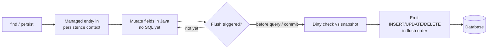
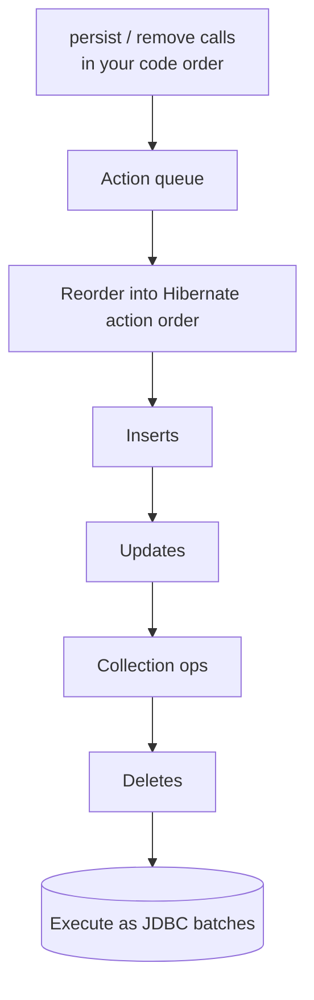

# Transactions, Dirty Checking & Flushing

This topic is about the single most surprising idea in JPA for developers coming
from JDBC: **you rarely call `save`/`update` on data you loaded**. You load an
entity, mutate a field, and at the end of the transaction Hibernate figures out
what changed and emits the `UPDATE` for you. The machinery behind that — the
persistence context, *dirty checking*, *write-behind*, and *flushing* — is what
this page unpacks, together with the transaction boundaries that drive it.

> [!KEY-TAKEAWAY]
> A **managed** entity is auto-synchronized to the database. Hibernate keeps a
> *snapshot* of every managed entity's state; at **flush** it compares the live
> object to the snapshot and generates SQL for the differences. `flush` writes
> pending SQL; **commit** ends the DB transaction. They are not the same thing.

For the underlying database mechanics — isolation levels, read/write anomalies,
MVCC, lock granularity — see `messaging-databases`. For how Spring's
`@Transactional` proxy actually opens/commits transactions and how propagation
works, see `spring-core`/`spring-boot`. Here we stay at the ORM-mechanism
altitude: what Hibernate does *inside* those boundaries.

---

## The Persistence Context as a Write-Behind Cache

The persistence context (the `EntityManager`'s / Hibernate `Session`'s
first-level cache) is a `Map`-like unit of work that holds every entity you have
loaded or persisted in the current transaction, keyed by entity type + primary
key. It plays two roles:

1. **Read cache / identity map** — `find` by the same id twice returns the *same*
   Java object without a second `SELECT`. See `caching-first-second-level`.
2. **Write-behind buffer** — mutations are *not* sent to the database
   immediately. Hibernate records the intent and defers the SQL until **flush**.

Write-behind exists for three concrete reasons:

- **Batching** — deferring lets Hibernate group many `INSERT`/`UPDATE` statements
  and send them as JDBC batches, cutting round trips.
- **Dirty checking** — because the context holds live objects, Hibernate can
  wait until the last moment and emit only the *net* changes.
- **Statement ordering** — Hibernate can reorder statements (all inserts, then
  updates, then deletes) to satisfy foreign-key constraints.



> [!INTERVIEW]
> "If I load a `User`, set `user.setName(...)`, and never call any repository
> method, does the name get persisted?" — Yes, if the entity is *managed* and the
> transaction commits (or a flush occurs). This is the classic dirty-checking
> "aha" that separates seniors from juniors.

---

## Dirty Checking: How Hibernate Auto-Generates UPDATEs

**Dirty checking** is the process by which Hibernate detects which managed
entities changed and generates `UPDATE` SQL for them automatically at flush time.

Mechanism (default *state-snapshot* strategy):

1. When an entity becomes managed (loaded via `find`/query, or persisted),
   Hibernate stores a **snapshot** — a copy of the entity's persistent property
   values (a `Object[]` "loaded state") in the persistence context.
2. At flush, Hibernate iterates over managed entities and compares each current
   property value against the snapshot, field by field, using the mapped types'
   equality logic.
3. Any entity whose state differs is **dirty**; Hibernate schedules an `UPDATE`.

```java
@Transactional
public void raise(Long id) {
    Employee e = em.find(Employee.class, id); // SELECT + snapshot taken
    e.setSalary(e.getSalary().add(BigDecimal.valueOf(1000)));
    // no persist(), no merge(), no save() — nothing else
} // on commit: flush runs dirty check → UPDATE employee SET salary=? WHERE id=?
```

Generated on flush:

```sql
update employee set salary=? where id=?
```

Key mechanism details interviewers probe:

- **Default `UPDATE` updates all columns**, not just the changed one. Hibernate
  pre-generates one parameterized `UPDATE` per entity type so the SQL can be
  cached/reused. `@DynamicUpdate` makes it generate SQL touching only changed
  columns at the cost of not reusing a cached statement (useful for very wide
  tables or when column-level triggers matter).
- Only **managed** entities are dirty-checked. A **detached** entity (context
  closed) is *not* — mutating it does nothing until you `merge` it back. A
  **transient** entity is not tracked until `persist`. See
  `entity-lifecycle-states`.
- Snapshotting costs memory and CPU proportional to the number of managed
  entities × their fields. Loading 100k rows into one context to touch three of
  them is a classic anti-pattern (use bulk `UPDATE` via JPQL, or a stateless
  session). See `performance-tuning-pitfalls`.

> [!WARNING]
> Bulk JPQL `update`/`delete` (`em.createQuery("update ...")`) bypasses dirty
> checking and the persistence context entirely — it goes straight to SQL and
> can leave already-loaded entities *stale* in the first-level cache. Flush or
> clear the context around bulk operations.

---

## Bytecode Enhancement for Dirty Tracking

The snapshot-comparison strategy is O(managed entities × fields) at flush.
Hibernate offers an alternative: **bytecode enhancement** for *in-line dirty
tracking*. With the Hibernate enhancement plugin (Gradle/Maven) and
`enableDirtyTracking`, entity setters are instrumented so each mutation records
the changed attribute name in a `$$_hibernate_tracker` field.

At flush, Hibernate can then ask each entity "which attributes are dirty?"
instead of diffing every field against a snapshot — cheaper for large contexts
and wide entities.

| Strategy | How it detects change | Cost | When |
|---|---|---|---|
| **State snapshot** (default) | Diff live state vs loaded snapshot at flush | O(entities × fields); extra memory for snapshots | Default; zero build config |
| **Bytecode enhancement** | Instrumented setters flag dirty attributes eagerly | Cheaper flush; needs build-time enhancement | Large contexts, wide entities, also enables lazy basic attributes & `@LazyGroup` |

Enhancement also powers **lazy loading of basic (`@Basic(fetch=LAZY)`)
attributes** and lazy `@OneToOne`/`@ManyToOne` without a proxy on the owning
side. It is opt-in because it changes your class bytecode at build time.

---

## Flush: Synchronizing the Persistence Context to the Database

**Flush** is the act of writing all pending SQL (inserts, updates, deletes
accumulated in the action queue) to the database within the current transaction.
It **does not** commit — the changes are visible to your own transaction and,
depending on isolation level, not to others until commit.

What a flush actually does:

1. Run dirty checking over managed entities → schedule `UPDATE`s.
2. Process queued `persist` calls → `INSERT`s (assigning identity if needed).
3. Process `remove` calls and `orphanRemoval` → `DELETE`s.
4. Cascade the above across associations per configured cascade types
   (see `cascade-types-orphan-removal`).
5. Order and (optionally) batch the statements, then execute them via JDBC.

A flush happens at three moments:

- **Automatically before a query** whose result could be affected by pending
  changes (default `AUTO` mode — see below).
- **Automatically at transaction commit** — Hibernate always flushes before the
  DB `COMMIT`.
- **Explicitly** when you call `em.flush()` / `session.flush()`.

> [!TIP]
> After `flush`, the SQL is on the wire and the DB has applied it *inside your
> transaction*. If you then throw and roll back, those statements are undone —
> because a rollback undoes the transaction, flush or not.

---

## FlushModeType AUTO vs COMMIT and Hibernate MANUAL/ALWAYS

`FlushModeType` (JPA) / `FlushMode` (Hibernate) controls *when* automatic flushes
fire. Set it via `em.setFlushMode(...)`, per-query with
`query.setFlushMode(...)`, or on a Hibernate `Session`.

| Mode | Namespace | Behavior |
|---|---|---|
| **AUTO** | JPA (default) | Flush at commit **and** before executing a query that overlaps pending changes, so the query sees your own writes ("read-your-writes"). |
| **COMMIT** | JPA | Flush **only** at commit. Queries may *not* see unflushed changes → possible stale reads within the tx. Slightly faster; risky. |
| **MANUAL** | Hibernate only | Never auto-flush; you must call `flush()` explicitly. Used with read-mostly / long conversations. |
| **ALWAYS** | Hibernate only | Flush before *every* query, even non-overlapping ones. Rarely needed; expensive. |

The subtle part is **AUTO's query-overlap check**. Before a JPQL/HQL/Criteria
query, Hibernate flushes if the query touches entity types (query spaces / table
names) that have pending changes, so results are consistent with your in-memory
state.

```java
Order o = new Order();
em.persist(o);                       // INSERT queued, not yet executed
// AUTO: this query touches ORDER, so Hibernate flushes first → sees the new row
Long n = em.createQuery("select count(o) from Order o", Long.class)
           .getSingleResult();
```

> [!WARNING]
> **`AUTO` does not reliably flush before *native* SQL queries.** Hibernate can't
> always parse a native query's tables to know it overlaps, so a native `SELECT`
> may miss your unflushed changes. Call `em.flush()` first, or set the query's
> flush mode, when a native query must see pending writes.

Spring's `@Transactional(readOnly = true)` and Spring Data can set the Hibernate
`FlushMode` to `MANUAL` for read-only work (see the read-only section).

---

## Flush Order and the Constraint-Violation Gotcha

Within a flush, Hibernate does **not** execute statements in the order you called
`persist`/`remove`. It executes them in a fixed *action* order (per the ORM
implementation):

1. `OrphanRemovalAction`
2. `EntityInsertAction` / `EntityIdentityInsertAction` (all inserts)
3. `EntityUpdateAction` (all updates)
4. `CollectionRemoveAction`
5. `CollectionUpdateAction`
6. `CollectionRecreateAction`
7. `EntityDeleteAction` (all deletes)

The senior gotcha: because **all inserts precede all deletes**, a common pattern
fails —

```java
// Unique constraint on (email). Old row has email 'a@x.com'.
oldUser.setEmail("temp");       // intend: free up the email
em.remove(oldUser);             // delete old
User fresh = new User("a@x.com");
em.persist(fresh);              // insert new with same email
// FLUSH ORDER: INSERT fresh (a@x.com) runs BEFORE DELETE oldUser
// → unique-constraint violation, even though "logically" the delete frees it
```

Fixes: call `em.flush()` between the delete and the insert to force ordering; or
avoid the reuse; or use a deferred/deferrable constraint at the DB level (see
`messaging-databases`). This is *the* classic "why does my delete-then-insert
throw a constraint violation?" interview scenario.



---

## Batching Inserts and Ordered Statements

By default each `INSERT` is a separate JDBC round trip. To batch, configure:

```properties
hibernate.jdbc.batch_size=50
hibernate.order_inserts=true
hibernate.order_updates=true
hibernate.batch_versioned_data=true   # allow batching versioned (optimistic-lock) rows
```

- **`batch_size`** turns on JDBC batching (`addBatch`/`executeBatch`).
- **`order_inserts` / `order_updates`** group statements *by table* so the JDBC
  driver can actually batch same-shape statements together. Without ordering, an
  interleaved `INSERT A, INSERT B, INSERT A` breaks batches at each type change.

> [!WARNING]
> Batching is silently defeated by `GenerationType.IDENTITY`: to batch inserts
> Hibernate must know the ids up front, but `IDENTITY` needs a round trip per
> row to read the generated key, so Hibernate disables insert batching for
> `IDENTITY`-keyed entities. Prefer `SEQUENCE` (with a pooled/`hi-lo` optimizer)
> when you need batch inserts. See `primary-keys-and-id-generation`.

---

## Flush Is Not Commit (and Transaction Boundaries)

`flush()` and `commit()` are distinct:

| | flush | commit |
|---|---|---|
| What it does | Writes queued SQL within the current tx | Ends the DB transaction, making changes durable/visible to others |
| Visibility | Only your transaction (per isolation) | Everyone (after commit) |
| Rolls back? | Yes — a later rollback undoes flushed SQL | N/A — commit is the end |
| Who triggers | AUTO before queries, at commit, or explicit `flush()` | Tx manager (`@Transactional` proxy) at method end, or explicit |

**Transaction boundaries** define the persistence-context lifetime for the common
"transaction-scoped" `EntityManager`:

- **Resource-local** (`@PersistenceContext` in Spring, JDBC `DataSource`):
  Hibernate manages the JDBC `Connection`'s transaction directly. Spring's
  `@Transactional` (via `JpaTransactionManager`) begins the tx, and on method
  return the proxy triggers **flush + commit**; on a runtime exception it rolls
  back. The proxy mechanics (propagation `REQUIRED`/`REQUIRES_NEW`, self-
  invocation not being proxied) live in `spring-core`/`spring-boot`.
- **JTA** (Jakarta Transactions, app-server or Narayana): a global transaction
  manager coordinates possibly multiple resources (XA). Hibernate enlists as a
  `Synchronization` and flushes on `beforeCompletion`. Choose JTA for
  multi-resource/2PC; resource-local for a single datasource (the common case).

> [!WARNING]
> A flush at commit that fails (e.g., a constraint violation) surfaces as an
> exception *at commit time*, sometimes far from the offending code. This is why
> a debugging `em.flush()` is invaluable — it surfaces the SQL error at the line
> that caused it, not at the end of the method.

For isolation levels, dirty/non-repeatable/phantom reads, and how the DB itself
enforces atomicity/durability, see `messaging-databases`.

---

## Read-Only Transactions and Optimization

Marking a transaction read-only lets Hibernate skip work:

```java
@Transactional(readOnly = true)     // Spring
public List<Report> load() { ... }
```

What actually happens under Spring + Hibernate:

- Spring sets the Hibernate `Session`'s `FlushMode` to **MANUAL** and marks the
  session read-only, so **no automatic flush** occurs (no point writing).
- Hibernate can then skip taking dirty-checking **snapshots** for read-only
  entities (via `session.setDefaultReadOnly(true)` /
  `@QueryHints` `org.hibernate.readOnly`), saving memory and flush CPU — a big
  win when loading large read-only result sets.

Ways to get read-only entities:

- `entityManager.unwrap(Session.class).setDefaultReadOnly(true)`
- Query hint `org.hibernate.readOnly = true`
- `@Transactional(readOnly = true)` (Spring propagates the hint)

> [!TIP]
> `readOnly = true` is **not** a database-level guarantee by itself; it's mainly
> a Hibernate optimization (skip flush/snapshots) plus a hint that some drivers/
> routing (read replicas) honor. Mutating a read-only entity silently does *not*
> persist because there's no snapshot/flush.

Because read-only entities have no snapshot, they are also cheaper for the
second-level cache to store (immutable). See `caching-first-second-level`.

---

## When You Need an Explicit flush()

With `AUTO` mode and commit-time flushing you *usually* never call `flush()`.
Legitimate reasons to call it explicitly:

1. **Force the INSERT to execute now** — `persist` already assigns the id (a
   `SEQUENCE`/`TABLE` generator is called at `persist`, and `IDENTITY` runs the
   `INSERT` immediately), so you rarely flush *just* for the id. Flush when the row
   must physically exist before commit — e.g., a DB default/trigger must populate a
   column, or a later native query / foreign key must see it. For `SEQUENCE`/`TABLE`
   the `INSERT` itself is deferred to flush.
2. **Control flush order around constraints** — force a `DELETE` before a
   conflicting `INSERT` (the unique-constraint scenario above).
3. **Make a native query see pending changes** — since `AUTO` may not auto-flush
   before native SQL.
4. **Surface SQL errors early / at the right line** while debugging.
5. **Free memory in a batch loop** — the "batch insert" idiom:

```java
for (int i = 0; i < records.size(); i++) {
    em.persist(records.get(i));
    if (i % 50 == 0) {          // == hibernate.jdbc.batch_size
        em.flush();             // push batch to DB
        em.clear();             // detach flushed entities → release snapshots
    }
}
```

> [!WARNING]
> `flush()` alone in a loop without `clear()` still grows the persistence context
> unboundedly (snapshots for every entity), risking `OutOfMemoryError` and
> ever-slower dirty checks. Pair `flush()` with `clear()` (or use a
> `StatelessSession`, which has no persistence context, no dirty checking, no
> cascade, and no first-level cache).

---

## Common Interview Follow-ups

- **"I loaded an entity, changed a field, and it updated the DB without me
  saving. Why?"** — Dirty checking on the managed entity at flush/commit.
- **"What's the difference between flush and commit?"** — Flush writes queued SQL
  within the tx; commit ends the tx. A rollback after flush still undoes it.
- **"Default `FlushModeType`?"** — `AUTO`: flush before overlapping queries and at
  commit.
- **"Why did my delete-then-insert with the same unique key fail?"** — Flush
  order runs all inserts before all deletes; `flush()` between them, or use a
  deferrable constraint.
- **"How does Hibernate know an entity is dirty?"** — Snapshot comparison at flush
  by default, or bytecode-enhanced in-line dirty tracking.
- **"Why is `@DynamicUpdate` sometimes used?"** — To `UPDATE` only changed columns
  (wide tables / column triggers), trading cached-statement reuse.
- **"Why aren't my `IDENTITY` inserts batched?"** — `IDENTITY` needs a round trip
  per row for the generated key; use `SEQUENCE` for batching.
- **"What does `readOnly = true` do for Hibernate?"** — Sets `FlushMode` MANUAL
  and can skip dirty-check snapshots — an optimization, not a DB lock.
- **"When must you call `flush()` explicitly?"** — Force a deferred `INSERT` to run
  early (DB trigger/default or native-query visibility), ordering around
  constraints, batch loops, debugging. (The id itself is already assigned at
  `persist`.)
- **"What breaks dirty checking?"** — Detaching the entity, bulk JPQL
  `update`/`delete`, `StatelessSession`, or a read-only entity with no snapshot.

## References

- Jakarta Persistence 3.1/3.2 Specification — `EntityManager`, `FlushModeType`,
  transaction association (`jakarta.persistence.*`).
- Hibernate ORM 6.x/7.x User Guide — "Flushing", "Dirty checking", "Bytecode
  Enhancement", "Batching", "Read-only entities", `StatelessSession`.
- Hibernate ORM Javadoc — `FlushMode`, `Session#flush`, `Session#setDefaultReadOnly`.
- Vlad Mihalcea, *High-Performance Java Persistence* — flush order, batching,
  dirty-checking internals.
- Cross-references in this library: `entity-lifecycle-states`,
  `cascade-types-orphan-removal`, `caching-first-second-level`,
  `primary-keys-and-id-generation`, `fetching-lazy-eager-n-plus-one`,
  `performance-tuning-pitfalls`; `messaging-databases` (isolation, constraints);
  `spring-core`/`spring-boot` (`@Transactional` proxy, propagation).
