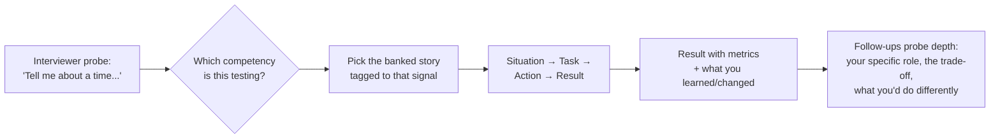
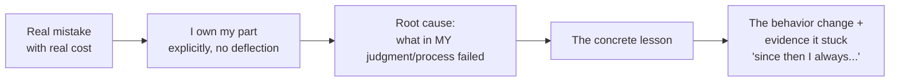
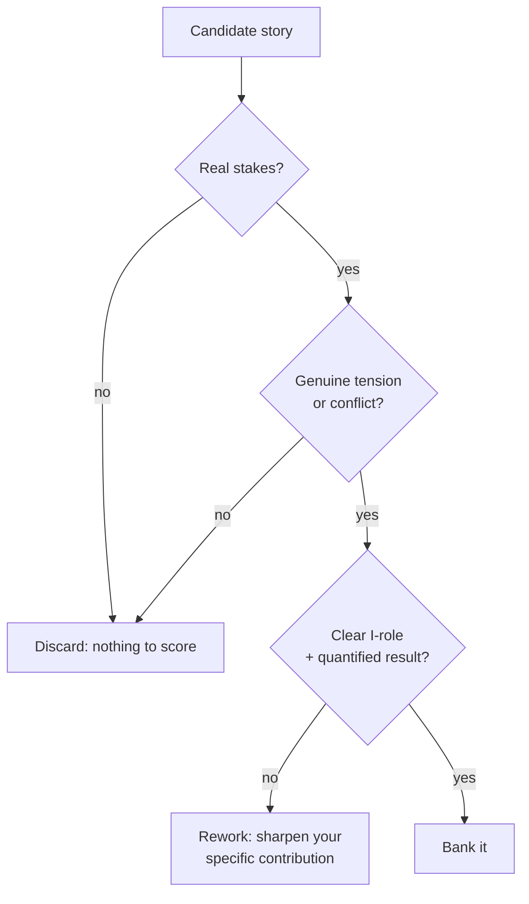

# The Competency Bank: Conflict, Failure, Ambiguity & More

Behavioral rounds are not a personality quiz — they are a **structured evidence
hunt**. The interviewer has a rubric of competencies (conflict, failure,
ambiguity, influence, delivery-under-pressure, feedback, prioritization) and is
collecting *behavioral evidence* that you operate at the target level. Your job
is to walk in with a **bank of 8–12 pre-built stories**, each tagged to the
competencies it demonstrates, so that whatever they probe, you have a real,
high-stakes example ready in STAR form.

This topic assumes you already know the STAR structure
(`behavioral-star-method`) and how specific companies weight values
(`company-values-and-leadership-principles`). Here we go competency by
competency: what signal each probe is really testing, a *weak vs strong* answer
contrast, the traps (the "tell me about a time you were wrong" landmine,
humblebrags, throwing others under the bus), and how the **seniority bar** shifts
each answer — a senior engineer resolves conflict on their team; a staff
engineer resolves it across teams and leaves behind a mechanism so it does not
recur.

> [!KEY-TAKEAWAY]
> The "correct" behavioral answer is not the most flattering one — it is the one
> that most cleanly demonstrates the **target signal** (ownership, judgment,
> influence, growth) with a *real* outcome and *real* stakes. Interviewers
> discount stories with no tension, no cost, and no self-reflection.

---

## Mapping stories to competencies

**What it is.** Before any interview, build a **story bank**: a spreadsheet with
one row per real project/incident and columns for the competencies each story can
demonstrate. Most strong stories cover 2–4 competencies, so 8–12 stories can
cover the entire rubric. You are not memorizing scripts — you are indexing your
experience so recall is instant under pressure.

**How to build it.** For each story capture: the one-line situation, your
*specific* actions (not the team's), the quantified result, and the lesson. Then
tag it: does it show conflict? Ambiguity? Influence without authority? Failure
and recovery? Delivery under a hard deadline? A prioritization trade-off?

| Story | Conflict | Failure | Ambiguity | Influence | Deadline | Prioritization |
|---|---|---|---|---|---|---|
| Payments migration | ✅ (vendor choice) | | ✅ (no spec) | ✅ (3 teams) | ✅ | ✅ |
| Cache incident | | ✅ (I shipped the bug) | | | ✅ | |
| Deprecating legacy API | ✅ (pushback) | | | ✅ | | ✅ |

**The mapping rule.** When the interviewer asks a competency question, silently
map it to the *strongest* banked story for that signal — not the most recent, not
the most technically impressive, but the one with the clearest tension and
outcome. Reusing one strong story across two competency probes is fine; telling a
weak, low-stakes story because it "technically matches" is not.

> [!TIP]
> Keep two stories per high-frequency competency (conflict, failure, ambiguity).
> Interviewers on the same loop compare notes and sometimes ask a second, "give
> me a *different* example," to test whether you have depth or one rehearsed tale.

**Senior/staff bar.** At senior, stories are scoped to your team and one
project. At staff+, at least half your bank should show **cross-team scope,
lasting mechanisms, or org-level judgment** — you didn't just fix the thing, you
changed how the org does the thing so it doesn't recur.

---

## Conflict and disagreement

**What it tests.** Whether you can disagree *productively* — using data over
ego, separating the person from the position, and committing fully once a
decision is made. Amazon codifies this as **"Have Backbone; Disagree and
Commit"**: leaders are obligated to respectfully challenge decisions they
disagree with, but once a decision is made, they commit wholly.

**The framework.** A strong conflict story has four beats:

1. **The disagreement was substantive** — a real technical or product trade-off,
   not a personality clash.
2. **You advocated with data**, not volume — you brought a benchmark, a cost
   model, a prototype, or user data.
3. **You genuinely listened** — you can articulate the *other* side's strongest
   argument (steelman it).
4. **Resolution and commitment** — either you changed your mind on evidence, or
   the team went the other way and you committed fully and made it succeed
   anyway.

> [!WARNING]
> The number-one conflict-answer failure mode is the **"and I was right"** story
> — you disagreed, you won, everyone learned you're smart. It signals you value
> being right over the team's outcome. The *stronger* signal is often a story
> where you lost the argument, disagreed-and-committed, and the decision
> succeeded — that shows maturity and that you can be trusted with autonomy.

**Weak vs strong.**

- *Weak:* "My teammate wanted to use MongoDB but I knew Postgres was right, so I
  pushed back until they agreed. The project went fine." (No data, ego-driven,
  "I won," no listening.)
- *Strong:* "We disagreed on sync vs async for the notifications pipeline. I
  believed sync was simpler; the lead wanted async for resilience. I built a
  one-day spike measuring tail latency and failure modes under load. The data
  showed async's complexity was justified only above ~5k msg/s, which we were
  years from. We aligned on sync-now with a documented trigger to revisit. I
  wrote the ADR so the decision and its reversal condition were explicit." (Data,
  steelman, a mechanism, committed.)

**Senior/staff bar.** Junior: resolves conflict with one peer. Senior: resolves
it and preserves the relationship. Staff: de-escalates conflict *between other
people/teams*, finds the shared goal both sides forgot, and installs a
decision-making mechanism (an RFC process, a tie-break owner) so the class of
conflict stops recurring.

---

## Failure, mistakes, and the "time you were wrong" trap

**What it tests.** Ownership, self-awareness, and growth. Interviewers want proof
you can (a) own a real mistake without deflecting, (b) extract a concrete lesson,
and (c) show you *changed your behavior* afterward. This is the single most
diagnostic behavioral question because it's the easiest to fail.

**The three traps.**

1. **The humblebrag** — "My biggest failure is I work too hard / care too much /
   set the bar too high for the team." This reads as evasion. It signals you
   either lack self-awareness or won't be candid, both disqualifying.
2. **Throwing others under the bus** — "The project failed because QA missed it /
   the PM changed requirements / my manager didn't support me." Even if partly
   true, an answer with zero personal ownership is a red flag; it predicts you'll
   blame teammates in real failures too.
3. **No lesson / no change** — a real failure with a shrug ending. Without "and
   here's what I do differently now," the story has no growth signal.

**The framework (ownership + growth):**

**Weak vs strong.**

- *Weak:* "We had an outage but it was really the on-call runbook that was out of
  date." (Deflects; no ownership.)
- *Strong:* "I pushed a config change on a Friday without a staged rollout to hit
  a deadline. It took down checkout for 40 minutes — real revenue impact. I
  owned it in the postmortem, wrote the corrective actions myself, and I drove a
  policy that config changes go through the same canary pipeline as code. I
  haven't shipped an un-canaried change since, and the pattern caught two later
  bugs before customers did." (Owns it, real cost, systemic fix, behavior stuck.)

> [!INTERVIEW]
> "Tell me about a time you were **wrong**" is a *trap variant*: many candidates
> reframe it into a story where they turned out right. Don't. Pick a case where
> you held a position, the evidence proved you wrong, and you *updated*. The
> signal being tested is **intellectual honesty and updating on data** — being
> wrong and changing is the win condition, not a confession to minimize.

**Senior/staff bar.** The failure should be proportional to your level — a staff
engineer's failure should involve real scope (a mis-called architecture bet, a
mis-read of the org), and the fix should be a *mechanism* (a review gate, a
guardrail) that protects others, not just a personal note-to-self.

---

## A project that failed (vs a mistake you made)

**What it tests.** Different from a personal mistake: here a whole effort didn't
achieve its goal, and they want to see how you reason about *systemic* failure,
sunk cost, and knowing when to kill something. Judgment, not just contrition.

**Key distinctions.**

- A **mistake** is an error you made; a **failed project** may have failed for
  reasons beyond you — but a strong answer still finds *your* leverage points.
- The best failed-project stories show you **recognized the failure early**,
  argued to cut losses (fighting sunk-cost bias), or salvaged learnings/assets.
- Naming the *root cause honestly* (wrong bet on the market, unvalidated
  assumption, no clear owner) matters more than the failure itself.

**Strong shape.** "We spent a quarter building a real-time recommendations engine
on an assumption we never validated: that latency was the conversion blocker.
When early A/B data showed no lift, I pushed to stop rather than keep polishing —
we'd already sunk the cost, and continuing was ego. We repurposed the streaming
infra for fraud detection, which *did* move a metric. My lesson: put the riskiest
assumption behind the cheapest possible test *first*. Now I open every project by
naming the assumption that, if false, kills it."

> [!WARNING]
> Don't pick a "failed project" that clearly wasn't your responsibility and where
> you were a bystander — it shows no ownership or agency. Also avoid the
> fake-failure ("we shipped two weeks late but it was a huge success") — it dodges
> the question and signals you can't sit with real failure.

**Senior/staff bar.** Staff engineers are expected to *prevent* doomed projects:
the strongest version includes "and I now insist on a lightweight validation gate
before we commit a team-quarter," showing you turned one failure into
organizational risk reduction.

---

## Dealing with a difficult teammate or manager

**What it tests.** Emotional maturity, empathy, and whether you can be effective
*despite* interpersonal friction — without becoming the difficult person
yourself. A red flag here is contagious negativity.

**The framework.**

1. **Assume positive intent and seek to understand** — what pressure or incentive
   is driving their behavior? (The "difficult" senior engineer is often
   protecting reliability; the "blocking" manager is often shielding the team.)
2. **Address it directly and privately**, focusing on impact and behavior, not
   character: "When reviews sit for three days I lose context and momentum — can
   we find a faster path?"
3. **Find the shared goal** and reframe the relationship around it.
4. **Escalate as a last resort, professionally** — with facts, not complaints.

> [!WARNING]
> The trap: turning this into a **character assassination**. "My teammate was
> toxic and lazy and everyone hated him" tells the interviewer more about *you*
> (do you badmouth colleagues? will you badmouth *us*?) than about them. Describe
> **behavior and impact**, never label the person. Show empathy for their
> perspective even in a conflict story.

**Weak vs strong.**

- *Weak:* "My manager was a micromanager who didn't trust anyone, so I just kept
  my head down until I could transfer." (No agency, badmouthing, avoidance.)
- *Strong:* "My manager reviewed every decision in detail, which slowed us down. I
  realized he was accountable for a fragile system and lacked visibility. I
  started sending a short weekly plan and risk-list proactively; as trust grew he
  gave me the design lead on the next project. I learned to *manage up* by
  reducing my manager's uncertainty." (Empathy, agency, growth, no badmouthing.)

**Senior/staff bar.** Senior engineers repair one relationship; staff engineers
notice that a difficult dynamic is *systemic* (e.g., unclear ownership breeding
turf conflict) and fix the system, and they model the behavior for more junior
engineers watching.

---

## Tight deadlines and working under pressure

**What it tests.** Prioritization under constraint, calm decision-making, and
whether you protect quality/communication when squeezed — or cut corners and hide
risk. Also tests scope negotiation.

**The framework — the strong answer negotiates scope, not silence:**

1. **Triage ruthlessly** — separate must-haves from nice-to-haves; find the 20%
   that delivers 80% of the value.
2. **Make the trade-off explicit to stakeholders** — "We can hit the date with
   feature X cut / with a manual fallback / with tech debt Y we'll pay down in the
   next sprint." Never silently absorb impossible scope.
3. **De-risk early** — front-load the riskiest work so surprises surface with time
   to react.
4. **Protect the non-negotiables** — data integrity, security, and a rollback
   path don't get cut for a date.

> [!WARNING]
> Two failure modes: (1) the **hero** who worked 90-hour weeks and personally
> saved the day — signals poor planning and unsustainable habits, and doesn't
> scale; (2) the **corner-cutter** who shipped by skipping tests/reviews and
> "it worked out" — signals you'll trade away reliability under pressure. The
> strong signal is *scope negotiation and transparent communication*, not heroics.

**Strong shape.** "Two weeks out, it was clear the full feature wouldn't be ready.
Rather than crunch silently, I mapped what was truly required for the launch
partner vs. deferrable, and proposed shipping the core flow with the analytics
dashboard following in two weeks. The PM agreed once I showed the partner only
needed the core flow. We hit the date without a death march, and shipped the rest
clean." 

**Senior/staff bar.** Staff engineers are judged on *preventing* the crunch:
raising the risk early, cutting scope proactively, and building slack/estimation
buffers into the plan — heroics under pressure is a *junior* signal dressed up.

---

## Handling ambiguity and driving clarity

**What it tests.** Whether you can create structure and forward motion when the
problem, the requirements, or the ownership is undefined — a core senior+ signal.
Junior engineers wait for a spec; senior+ engineers *write* it. (See also
`handling-ambiguity` for the full treatment.)

**The framework.**

1. **Frame the problem** — write down what you *do* and *don't* know, and the
   decisions that must be made.
2. **Reduce uncertainty cheaply** — talk to stakeholders/users, run a spike,
   ship a small probe to gather data rather than debating in the abstract.
3. **Make a reversible decision and move** — a "one-way vs two-way door"
   judgment: for reversible calls, decide fast and iterate; for irreversible
   ones, invest more in de-risking.
4. **Create the artifact that aligns everyone** — a one-pager, a scoping doc, a
   decision log — so your clarity is *durable and shared*, not just in your head.

**Weak vs strong.**

- *Weak:* "The requirements were unclear so I asked my manager for a spec and
  waited until we had one." (Passive; pushes ambiguity back up.)
- *Strong:* "The ask was 'make onboarding better' — no metric, no scope. I
  interviewed five recent signups, found the drop-off was at email verification,
  and wrote a one-page problem statement with a target metric (verification
  completion +15%). That turned an ambiguous ask into a scoped project three teams
  could align on." (Frames, gathers data, produces a durable artifact, aligns
  others.)

> [!TIP]
> The phrase interviewers love to hear: *"I made the ambiguity explicit and then
> reduced it."* Naming the unknowns and choosing what to resolve first *is* the
> senior skill — not pretending you had certainty you didn't.

**Senior/staff bar.** Staff+ handle ambiguity that spans *organizational*
boundaries (unclear ownership, competing mandates) and produce artifacts that
align *leaders*, not just a team.

---

## Influencing without authority

**What it tests.** The defining staff+ skill: driving outcomes across teams you
don't manage, through trust, data, and framing rather than positional power.
StaffEng/Will Larson frame this as the core of the Architect and Tech Lead
archetypes — impact scales through influence, not headcount.

**The framework — how influence actually works:**

1. **Build the relationship and credibility first** — you can't make a withdrawal
   from an account you never funded. Help teams before you need them.
2. **Speak their metrics** — frame your proposal in terms of *their* goals and
   incentives, not yours ("this cuts your on-call load," not "this helps my
   roadmap").
3. **Bring evidence, not opinion** — a prototype, a benchmark, a small pilot that
   de-risks the ask.
4. **Give people a way to say yes** — reduce their effort, offer to do the hard
   part, start with a coalition of the willing.
5. **Make it their idea** — co-author, credit generously; adoption beats
   authorship.

**Weak vs strong.**

- *Weak:* "I escalated to my manager to get the other team to adopt our library."
  (Reaches for authority immediately; will burn goodwill.)
- *Strong:* "I wanted three teams to adopt a shared auth library. I started with
  the team in the most pain, built the migration tooling *for* them so the cost
  was near-zero, and turned their success into an internal case study. The other
  teams asked to adopt it. I never had to mandate anything." (Coalition, reduce
  their cost, evidence, pull not push.)

> [!KEY-TAKEAWAY]
> Influence without authority is measured by whether the *other side ends up
> owning and wanting* the outcome. If your only tool was escalation, you didn't
> influence — you outsourced the persuasion to someone with power.

**Senior/staff bar.** This question effectively *is* the senior→staff line.
Senior engineers influence their immediate team; staff engineers change the
behavior of teams and leaders across the org and leave standards/platforms behind.

---

## Going above and beyond

**What it tests.** Ownership and bias for action — did you take responsibility for
an outcome beyond your assigned lane? The risk is that "above and beyond" degrades
into either heroics or scope-creep with no judgment.

**Strong shape.** The best answers show you saw a gap *nobody owned*, judged it
worth fixing, and either fixed it or drove an owner to it — with a real result.
"Our error rates were creeping up but no single team owned the alerting. It wasn't
my job, but customers were hurting, so I built a cross-service dashboard,
identified the top offenders, and drove a fix-it week. p99 errors dropped 60%."

> [!WARNING]
> "Above and beyond" is *not* "I stayed till midnight every night." Effort isn't
> impact. And beware the version that reveals poor prioritization ("I gold-plated
> a feature nobody asked for"). The signal is **ownership of an outcome plus the
> judgment that it mattered** — ideally with a mechanism so it stays fixed.

**Senior/staff bar.** At staff level, "above and beyond" should mean spotting a
*strategic* gap (a missing platform capability, an unowned reliability risk) and
mobilizing others — not personally grinding out extra work.

---

## Prioritization and trade-off decisions

**What it tests.** Judgment: can you say *no*, defend *why*, and reason about
opportunity cost, not just "I worked on everything." (Trade-off *articulation* in
the technical sense lives in `tradeoff-articulation-and-judgment`; here it's the
behavioral story.)

**The framework.**

1. **Name the axis of the trade-off** — value vs effort, urgent vs important,
   short-term unblock vs long-term health, one customer vs many.
2. **Make the criteria explicit** — expected impact, cost, reversibility, risk —
   ideally tied to a team/business goal.
3. **Decide and communicate the *no*** — what you deprioritized and why the people
   who wanted it can live with the decision.
4. **Revisit** — a good prioritization call names the condition under which you'd
   change it.

**Weak vs strong.**

- *Weak:* "We had a lot to do so I just worked hardest on the most urgent things."
  (No framework, conflates urgent with important.)
- *Strong:* "We had a security hardening ask and a revenue feature both due. I
  scored them on impact and reversibility: the security fix was irreversible risk
  (a breach can't be undone), the feature was a two-way door we could ship a month
  later. I sequenced security first, told the PM the feature slipped three weeks
  and why, and we accepted it because the risk asymmetry was clear." (Explicit
  criteria, defensible no, reasoned trade-off.)

**Senior/staff bar.** Staff engineers prioritize *portfolios and roadmaps* and
say no to whole projects, aligning the trade-off to strategy; senior engineers
prioritize within a project's backlog.

---

## Receiving hard feedback and showing growth

**What it tests.** Coachability and a growth mindset — arguably what most predicts
whether you'll keep leveling up. Interviewers watch for defensiveness and for
whether feedback actually *changed* you.

**The framework.**

1. **Receive it without defending** — thank them, ask clarifying questions,
   assume it's a gift even if delivered badly.
2. **Separate the signal from the delivery** — poor delivery doesn't make the
   feedback wrong; extract the valid core.
3. **Act visibly** — make a concrete change and, ideally, close the loop with the
   person who gave it.
4. **Show the arc** — the strongest answers show feedback you *disagreed with at
   first*, sat with, and eventually integrated.

**Weak vs strong.**

- *Weak:* "My manager said I was too quiet in meetings, but honestly I just prefer
  to listen, so I explained that and we moved on." (Defensive; rejected the
  feedback; no growth.)
- *Strong:* "In a review I was told my design docs were too solution-first and
  skipped the problem framing. My gut reaction was defensive. But I looked back
  and saw reviewers *did* keep asking 'why this approach?' I started leading with
  a problem statement and alternatives-considered section; review cycles got
  shorter and my next promo doc cited 'stronger written communication.'"
  (Non-defensive, integrated, evidence of change.)

> [!INTERVIEW]
> When asked "what's an area you're working on?" or "what feedback have you
> received?", a real, specific weakness with a real improvement plan beats a fake
> weakness every time. The signal is *self-awareness + agency*, not the absence of
> flaws. "I'm working on delegating instead of doing" with an example beats "I'm a
> perfectionist."

**Senior/staff bar.** Growth signal never expires — staff engineers still receive
and act on feedback (often about influence, patience, or scope), and they *model*
receiving it well because juniors are watching.

---

## Picking stories with real stakes

**What it tests (indirectly).** The quality of your *story selection* is itself a
signal. Interviewers can tell a rehearsed low-stakes story from a real one, and a
story with no tension gives them nothing to score.

**Selection criteria — a good competency story has:**

- **Real stakes** — money, users, a deadline, a relationship, a career risk. If
  nothing was at risk, there's no judgment to demonstrate.
- **Genuine tension** — a real disagreement, a real constraint, a real
  possibility of failure. "Everything went smoothly" is not a story.
- **A clear, *individual* role** — the interviewer scores *you*, so "I" beats
  "we" in the Action section (credit the team in the Result).
- **A quantified result** — "reduced p99 by 40%," "cut onboarding drop-off 15%,"
  not "it went well."
- **A lesson** — proof you extracted something transferable.

> [!TIP]
> A useful gut check: if the story would be *equally true* if a competent
> colleague had been in your seat, it's not about you. Pick moments where *your
> specific judgment or action* changed the outcome.

**Senior/staff bar.** The stakes should scale with the level: a $50 bug fix isn't
a staff story. Staff stories carry org-level stakes — a bet the company made, a
platform many teams depend on, a decision that shaped a roadmap.

---

## Red-flag answers interviewers penalize

**What it tests (in reverse).** Some answers actively *sink* an otherwise strong
candidate. Knowing the anti-patterns is as important as the frameworks.

| Red flag | Why it sinks you | The fix |
|---|---|---|
| Throwing others under the bus | Predicts you'll blame teammates; poor ownership | Own your part; describe others' behavior neutrally |
| "I've never had a conflict / failure" | Signals no self-awareness, no stakes, or dishonesty | Everyone has; pick a real one with a good ending |
| The humblebrag weakness | Reads as evasion; you won't be candid | Give a real weakness + real improvement |
| "And I was right all along" | Values ego over team outcome | Show listening, updating, disagree-and-commit |
| No lesson / no change | No growth signal | End every failure story with the behavior change |
| Vague "we" with no personal role | Can't score you; may signal a passenger | Use "I" for your actions; "we" for shared credit |
| No stakes / no tension | Nothing to evaluate | Pick a higher-stakes story |
| Badmouthing a past employer/manager | Predicts you'll badmouth *us* | Stay professional; frame as a learning |

> [!WARNING]
> The most common instant-fail is answering "tell me about a conflict/failure"
> with **"I can't really think of one"** or a non-story. It reads as either
> dishonesty or a lack of the self-reflection senior roles require. Always have a
> real, well-bounded example ready — and one where you come out having *learned*,
> not *won*.

**Senior/staff bar.** At senior+, a subtle red flag is showing you can *do* the
work but not *scale* it — every story is you personally heroing, none is you
building leverage, mentoring, or leaving a mechanism behind. The absence of
multiplier impact caps your level even if each story is "successful."

---

## Common follow-up questions

- "What would you do **differently** if you faced that situation again?" (Tests
  reflection — have a real answer, not "nothing, it went great.")
- "What did the **other person** think / how did they react?" (Tests empathy and
  whether the resolution was mutual.)
- "What was **your specific** contribution vs. the team's?" (Isolates your role;
  don't hide behind "we.")
- "Give me a **different** example of the same thing." (Tests depth of your bank
  vs. one rehearsed story — carry two per key competency.)
- "How did you **measure** that it worked?" (Tests for a real, quantified result.)
- "Tell me about a time you were **wrong** about something technical." (The
  updating-on-evidence trap — don't reframe into being right.)
- "What feedback have you gotten that was hard to hear?" (Coachability probe —
  give a real one you acted on.)
- "When did you decide *not* to do something / to kill a project?" (Prioritization
  and sunk-cost judgment.)

## References

- Amazon, *Leadership Principles* (16 principles incl. **"Have Backbone; Disagree
  and Commit,"** plus 2021 additions "Strive to be Earth's Best Employer" and
  "Success and Scale Bring Broad Responsibility") — aboutamazon.com and
  amazon.jobs. The Bar Raiser process and behavioral-evidence bar.
- Will Larson, *Staff Engineer: Leadership Beyond the Management Track* and
  StaffEng.com — the four archetypes (Tech Lead, Architect, Solver, Right Hand)
  and influence-without-authority as the core staff+ skill.
- Will Larson, *An Elegant Puzzle: Systems of Engineering Management* — systemic
  thinking, mechanisms over one-off fixes.
- The **STAR** method (Situation, Task, Action, Result) and its SAR/CARL variants
  — standard behavioral-interview structure (see `behavioral-star-method`).
- Gayle Laakmann McDowell, *Cracking the Coding Interview* / *Cracking the PM
  Interview* — behavioral-question preparation and the story-matrix approach.
- Google re:Work / Project Oxygen — manager and collaboration behaviors that
  inform behavioral rubrics.
- Published engineering ladders (Dropbox, CircleCI, Rent the Runway, GitLab) and
  levels.fyi — how competency expectations scale by level.
- Kim Scott, *Radical Candor* — giving and receiving feedback frameworks.
- Related topics in this library: `behavioral-star-method`,
  `company-values-and-leadership-principles`, `handling-ambiguity`,
  `mentorship-and-cross-team-influence`, `seniority-ladder-and-scope-signals`,
  `staff-archetypes-and-impact`, `incident-leadership-behavioral`.
